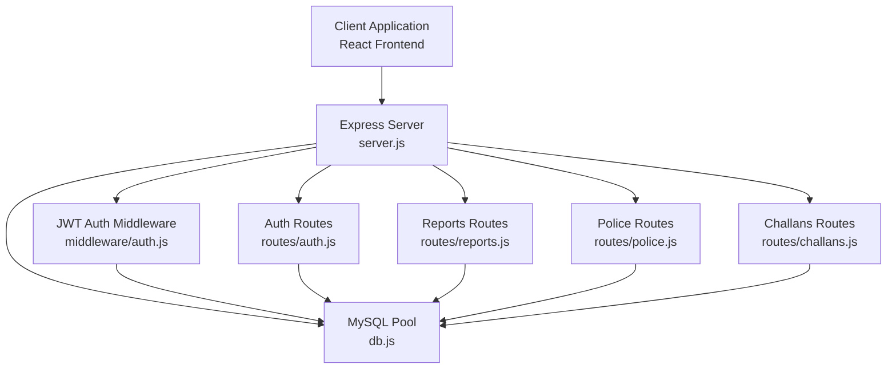
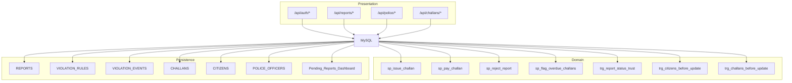
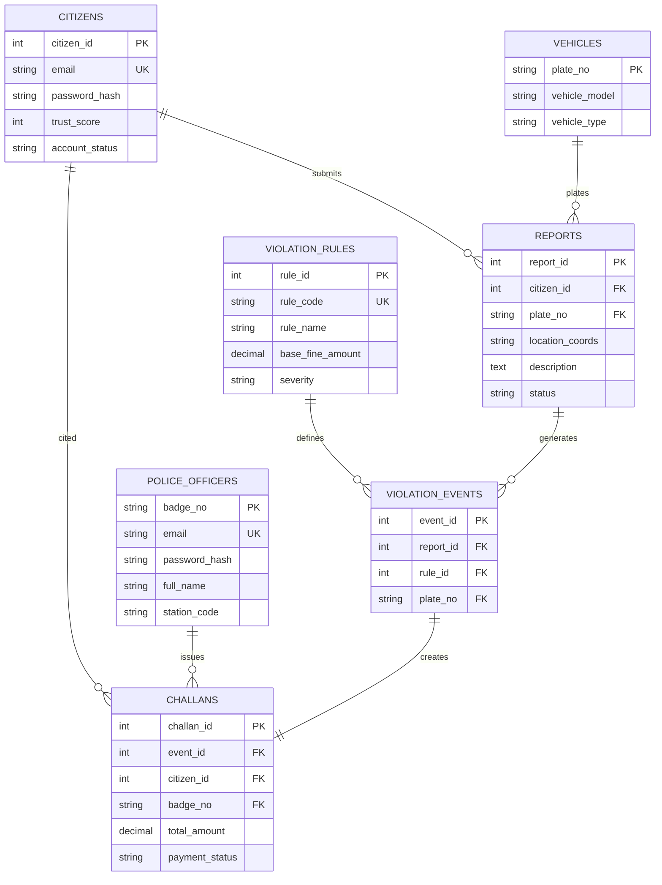
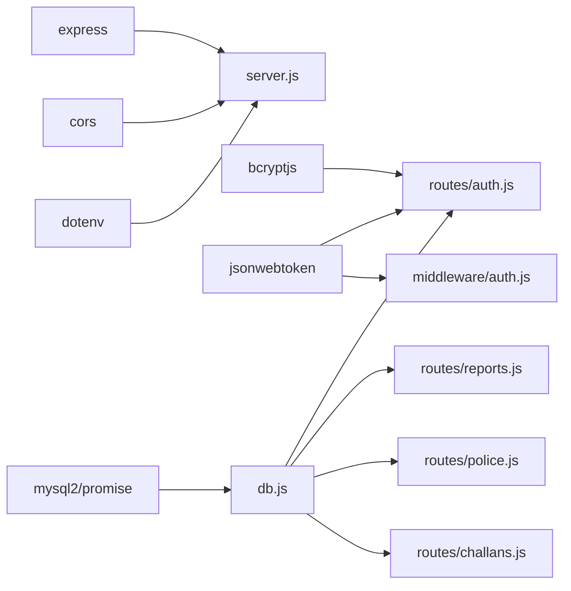

# API Reference

<cite>
**Referenced Files in This Document**
- [server.js](file://backend/server.js)
- [package.json](file://backend/package.json)
- [db.js](file://backend/db.js)
- [auth.js](file://backend/middleware/auth.js)
- [auth.js](file://backend/routes/auth.js)
- [reports.js](file://backend/routes/reports.js)
- [police.js](file://backend/routes/police.js)
- [challans.js](file://backend/routes/challans.js)
- [schema.sql](file://db/schema.sql)
- [stored_procedure_process_report.sql](file://db/stored_procedure_process_report.sql)
- [seed_demo_accounts.sql](file://db/seed_demo_accounts.sql)
- [insert_mock_reports.sql](file://db/insert_mock_reports.sql)
- [config.js](file://frontend/src/config.js)
</cite>

## Table of Contents
1. [Introduction](#introduction)
2. [Project Structure](#project-structure)
3. [Core Components](#core-components)
4. [Architecture Overview](#architecture-overview)
5. [Detailed Component Analysis](#detailed-component-analysis)
6. [Dependency Analysis](#dependency-analysis)
7. [Performance Considerations](#performance-considerations)
8. [Troubleshooting Guide](#troubleshooting-guide)
9. [Conclusion](#conclusion)
10. [Appendices](#appendices)

## Introduction
This document provides a comprehensive API reference for the Traffic Violation Management System backend. It covers:
- Authentication endpoints for citizens and police
- Citizen-facing endpoints for report submission, challan access, and profile retrieval
- Police-facing endpoints for report review, verification, rejection, and administrative views
- Request/response schemas, authentication requirements, validation rules, and error handling
- CORS configuration, security headers, and cross-origin resource sharing
- Rate limiting, pagination, and filtering guidance
- Troubleshooting and debugging techniques

The backend is built with Express.js, uses MySQL via mysql2/promise, JSON Web Tokens (JWT) for authentication, and exposes RESTful endpoints under the /api/* namespace.

## Project Structure
The backend is organized into modular route handlers, shared middleware, and a database connection module. Environment variables are loaded via dotenv. The server initializes middleware, registers routes, and exposes health checks and global error handling.

**Diagram sources**
- [server.js:1-42](file://backend/server.js#L1-L42)
- [auth.js:1-37](file://backend/middleware/auth.js#L1-L37)
- [auth.js:1-117](file://backend/routes/auth.js#L1-L117)
- [reports.js:1-54](file://backend/routes/reports.js#L1-L54)
- [police.js:1-109](file://backend/routes/police.js#L1-L109)
- [challans.js:1-101](file://backend/routes/challans.js#L1-L101)
- [db.js:1-26](file://backend/db.js#L1-L26)

**Section sources**
- [server.js:1-42](file://backend/server.js#L1-L42)
- [package.json:1-22](file://backend/package.json#L1-L22)

## Core Components
- Express server with CORS enabled globally and JSON body parsing
- Centralized database pool with connection testing and keep-alive
- JWT-based authentication middleware with role guards (citizen/police)
- Route modules for auth, reports, police, and challans
- Global 404 and error handlers

Key behaviors:
- CORS: Enabled via cors() middleware for all routes
- Health check endpoint at GET /api/health
- All protected endpoints require Authorization: Bearer <token>
- Role-based access enforced via middleware

**Section sources**
- [server.js:13-37](file://backend/server.js#L13-L37)
- [db.js:1-26](file://backend/db.js#L1-L26)
- [auth.js:1-37](file://backend/middleware/auth.js#L1-L37)

## Architecture Overview
The API follows a layered architecture:
- Presentation Layer: Express routes
- Domain Layer: Business logic in stored procedures and triggers
- Persistence Layer: MySQL with normalized tables, views, triggers, and stored procedures

**Diagram sources**
- [server.js:22-26](file://backend/server.js#L22-L26)
- [schema.sql:440-546](file://db/schema.sql#L440-L546)
- [schema.sql:552-629](file://db/schema.sql#L552-L629)
- [schema.sql:634-686](file://db/schema.sql#L634-L686)
- [schema.sql:693-754](file://db/schema.sql#L693-L754)
- [schema.sql:764-780](file://db/schema.sql#L764-L780)
- [schema.sql:26-43](file://db/schema.sql#L26-L43)
- [schema.sql:68-82](file://db/schema.sql#L68-L82)
- [schema.sql:87-95](file://db/schema.sql#L87-L95)
- [schema.sql:98-111](file://db/schema.sql#L98-L111)
- [schema.sql:114-136](file://db/schema.sql#L114-L136)
- [schema.sql:140-149](file://db/schema.sql#L140-L149)
- [schema.sql:151-167](file://db/schema.sql#L151-L167)
- [schema.sql:170-195](file://db/schema.sql#L170-L195)

## Detailed Component Analysis

### Authentication API
Endpoints:
- POST /api/auth/login
  - Purpose: Authenticate citizen or police and return JWT token
  - Required headers: Content-Type: application/json
  - Request body:
    - email: string (required)
    - password: string (required)
    - role: string enum ["citizen", "police"] (required)
  - Responses:
    - 200 OK: { token, user: { id, name, email, role, trust_score?, badge_number?, station? } }
    - 400 Bad Request: Missing fields or invalid role
    - 401 Unauthorized: Invalid credentials
    - 500 Internal Server Error: Server error
  - Notes:
    - Token expires in 8 hours
    - Use Authorization: Bearer <token> for subsequent protected calls

- GET /api/auth/me
  - Purpose: Retrieve current user profile
  - Required headers: Authorization: Bearer <token>
  - Responses:
    - 200 OK: { id, name, email, role, trust_score?, badge_number?, station?, phone?, address? }
    - 401 Unauthorized: No token provided
    - 403 Forbidden: Invalid or expired token
    - 404 Not Found: User not found
    - 500 Internal Server Error: Server error

Security and validation:
- Password comparison uses bcrypt
- JWT secret is loaded from environment variable
- Protected routes enforce role-specific access

**Section sources**
- [auth.js:9-76](file://backend/routes/auth.js#L9-L76)
- [auth.js:78-114](file://backend/routes/auth.js#L78-L114)
- [auth.js:1-37](file://backend/middleware/auth.js#L1-L37)

### Citizen APIs

#### Reports
- POST /api/reports
  - Purpose: Submit a new violation report
  - Required headers: Authorization: Bearer <token>, Content-Type: application/json
  - Role: citizen only
  - Request body:
    - plate_number: string (required)
    - latitude: number (optional)
    - longitude: number (optional)
    - image_url: string (optional)
    - description: text (required)
  - Responses:
    - 201 Created: { message, report_id }
    - 400 Bad Request: Missing required fields
    - 500 Internal Server Error: Submission failure

- GET /api/reports/my
  - Purpose: List reports submitted by the logged-in citizen
  - Required headers: Authorization: Bearer <token>
  - Role: citizen only
  - Responses:
    - 200 OK: Array of reports with fields: report_id, plate_number, latitude, longitude, image_url, description, status, reported_at
    - 500 Internal Server Error: Fetch failure

Validation and behavior:
- Latitude/longitude and image_url are optional
- Status defaults to Pending upon submission

**Section sources**
- [reports.js:7-31](file://backend/routes/reports.js#L7-L31)
- [reports.js:33-51](file://backend/routes/reports.js#L33-L51)

#### Challans
- GET /api/challans/my
  - Purpose: View challans associated with the logged-in citizen
  - Required headers: Authorization: Bearer <token>
  - Role: citizen only
  - Responses:
    - 200 OK: Array of challans with fields: challan_id, amount, status, issued_at, paid_at, rule_code, violation_description, issued_by_officer
    - 500 Internal Server Error: Fetch failure

- POST /api/challans/pay
  - Purpose: Pay a challan with row-level locking to prevent race conditions
  - Required headers: Authorization: Bearer <token>, Content-Type: application/json
  - Role: citizen only
  - Request body:
    - challan_id: integer (required)
  - Responses:
    - 200 OK: { message, challan_id, amount_paid, paid_at }
    - 400 Bad Request: Missing challan_id
    - 403 Forbidden: Challan does not belong to the citizen
    - 404 Not Found: Challan not found
    - 409 Conflict: Challan already paid
    - 500 Internal Server Error: Payment failure

Concurrency and safety:
- Uses SELECT ... FOR UPDATE to lock the specific challan row
- Ensures ownership and non-paid status before updating

**Section sources**
- [challans.js:7-29](file://backend/routes/challans.js#L7-L29)
- [challans.js:31-98](file://backend/routes/challans.js#L31-L98)

### Police APIs

#### Dashboard and Review
- GET /api/police/pending
  - Purpose: Fetch pending reports dashboard view
  - Required headers: Authorization: Bearer <token>
  - Role: police only
  - Responses:
    - 200 OK: Array of pending reports from the view Pending_Reports_Dashboard
    - 500 Internal Server Error: Fetch failure

- PATCH /api/police/verify/:id
  - Purpose: Verify a report and issue a challan via stored procedure
  - Required headers: Authorization: Bearer <token>, Content-Type: application/json
  - Role: police only
  - Path parameters:
    - id: integer (report_id)
  - Request body:
    - rule_id: integer (required)
  - Responses:
    - 200 OK: { message }
    - 400 Bad Request: Missing rule_id or invalid violation rule
    - 404 Not Found: Report not found or already processed
    - 500 Internal Server Error: Verification failure

- PATCH /api/police/reject/:id
  - Purpose: Reject a report
  - Required headers: Authorization: Bearer <token>
  - Role: police only
  - Path parameters:
    - id: integer (report_id)
  - Responses:
    - 200 OK: { message }
    - 404 Not Found: Report not found or already processed
    - 500 Internal Server Error: Rejection failure

Workflow and triggers:
- Verification updates report status to Verified and triggers trust score adjustments
- Stored procedure enforces row-level locks and ACID compliance
- Trust score changes are handled by triggers

**Section sources**
- [police.js:7-16](file://backend/routes/police.js#L7-L16)
- [police.js:18-85](file://backend/routes/police.js#L18-L85)
- [police.js:87-106](file://backend/routes/police.js#L87-L106)

### Data Model and Stored Procedures
The backend relies on a normalized relational model with views and stored procedures for ACID-safe operations.

**Diagram sources**
- [schema.sql:26-43](file://db/schema.sql#L26-L43)
- [schema.sql:68-82](file://db/schema.sql#L68-L82)
- [schema.sql:87-95](file://db/schema.sql#L87-L95)
- [schema.sql:98-111](file://db/schema.sql#L98-L111)
- [schema.sql:114-136](file://db/schema.sql#L114-L136)
- [schema.sql:151-167](file://db/schema.sql#L151-L167)
- [schema.sql:170-195](file://db/schema.sql#L170-L195)

Stored procedures:
- sp_issue_challan: Issues challans with full transaction and row-level locks
- sp_pay_challan: Processes payments safely with row locks and reward points
- sp_reject_report: Rejects reports with reason and status update
- sp_flag_overdue_challans: Flags overdue challans and penalizes trust scores

**Section sources**
- [schema.sql:440-546](file://db/schema.sql#L440-L546)
- [schema.sql:552-629](file://db/schema.sql#L552-L629)
- [schema.sql:634-686](file://db/schema.sql#L634-L686)
- [schema.sql:693-754](file://db/schema.sql#L693-L754)

## Dependency Analysis
External dependencies and integrations:
- Express: Web framework
- cors: Cross-origin support
- dotenv: Environment variables
- bcryptjs: Password hashing
- jsonwebtoken: JWT signing and verification
- mysql2/promise: Asynchronous MySQL driver

**Diagram sources**
- [package.json:10-17](file://backend/package.json#L10-L17)
- [server.js:1-42](file://backend/server.js#L1-L42)
- [auth.js:1-7](file://backend/routes/auth.js#L1-L7)
- [auth.js:1-3](file://backend/middleware/auth.js#L1-L3)
- [db.js:1-2](file://backend/db.js#L1-L2)

**Section sources**
- [package.json:1-22](file://backend/package.json#L1-L22)

## Performance Considerations
- Connection pooling: The MySQL pool is configured with connection limits and keep-alive to manage concurrent connections efficiently.
- Row-level locking: Payment and verification endpoints use SELECT ... FOR UPDATE to prevent race conditions and ensure data consistency.
- Indexes: Core tables have strategic indexes on foreign keys, status, and timestamps to optimize queries.
- Stored procedures: Encapsulate ACID transactions and reduce client-side complexity.

Recommendations:
- Implement rate limiting at the gateway or middleware level to protect endpoints from abuse.
- Add pagination for large datasets (e.g., GET /api/police/pending) using LIMIT and OFFSET.
- Use filtering and sorting parameters on dashboard endpoints to reduce payload sizes.

[No sources needed since this section provides general guidance]

## Troubleshooting Guide
Common issues and resolutions:
- 401 Access Denied: Ensure Authorization header is present and formatted as Bearer <token>.
- 403 Invalid or Expired Token: Regenerate token after expiration (8 hours).
- 403 Forbidden Access: Verify role requirements (citizen vs police).
- 404 Endpoint Not Found: Confirm correct base URL and endpoint path.
- 500 Internal Server Error: Check server logs for detailed error messages.
- CORS Issues: The server enables cors globally; ensure client sends appropriate Origin headers.

Debugging tips:
- Use the health check endpoint GET /api/health to verify service availability.
- Validate JWT signature and claims using a JWT debugger.
- Inspect database triggers and stored procedures for transaction rollbacks.

**Section sources**
- [server.js:28-37](file://backend/server.js#L28-L37)
- [auth.js:5-20](file://backend/middleware/auth.js#L5-L20)

## Conclusion
The Traffic Violation Management System provides a secure, role-based REST API with robust data integrity enforced by database triggers and stored procedures. The citizen and police portals rely on standardized endpoints for authentication, reporting, verification, and financial processing. Proper use of JWT, row-level locking, and database views ensures reliability and scalability.

[No sources needed since this section summarizes without analyzing specific files]

## Appendices

### Endpoint Catalog
- Authentication
  - POST /api/auth/login
  - GET /api/auth/me
- Citizen
  - POST /api/reports
  - GET /api/reports/my
  - GET /api/challans/my
  - POST /api/challans/pay
- Police
  - GET /api/police/pending
  - PATCH /api/police/verify/:id
  - PATCH /api/police/reject/:id

**Section sources**
- [auth.js:9-114](file://backend/routes/auth.js#L9-L114)
- [reports.js:7-51](file://backend/routes/reports.js#L7-L51)
- [challans.js:7-98](file://backend/routes/challans.js#L7-L98)
- [police.js:7-106](file://backend/routes/police.js#L7-L106)

### Example Requests and Responses
Note: Replace placeholders with actual values and ensure Authorization: Bearer <token> is included for protected endpoints.

- POST /api/auth/login
  - Request body:
    - email: string
    - password: string
    - role: "citizen" | "police"
  - Response:
    - 200 OK: { token, user }

- POST /api/reports
  - Request body:
    - plate_number: string
    - description: text
    - latitude: number (optional)
    - longitude: number (optional)
    - image_url: string (optional)
  - Response:
    - 201 Created: { message, report_id }

- PATCH /api/police/verify/:id
  - Request body:
    - rule_id: integer
  - Response:
    - 200 OK: { message }

- POST /api/challans/pay
  - Request body:
    - challan_id: integer
  - Response:
    - 200 OK: { message, challan_id, amount_paid, paid_at }

**Section sources**
- [auth.js:9-76](file://backend/routes/auth.js#L9-L76)
- [reports.js:7-31](file://backend/routes/reports.js#L7-L31)
- [police.js:18-85](file://backend/routes/police.js#L18-L85)
- [challans.js:31-98](file://backend/routes/challans.js#L31-L98)

### CORS and Security Headers
- CORS: Enabled globally via cors() middleware; allows cross-origin requests from any origin.
- Security headers: None explicitly set in server.js; consider adding CSP, HSTS, X-Content-Type-Options, and X-Frame-Options in production.
- TLS: Deploy behind HTTPS termination proxy or load balancer.

**Section sources**
- [server.js:14](file://backend/server.js#L14)

### Rate Limiting, Pagination, and Filtering
- Rate limiting: Not implemented in the current server; add middleware to protect endpoints.
- Pagination: Not implemented; use LIMIT and OFFSET for large result sets.
- Filtering: Not implemented; add query parameters for status, date ranges, and roles.

[No sources needed since this section provides general guidance]

### Database Setup References
- Schema creation and seed data are provided in the db directory for local development and testing.
- Demo accounts and mock reports are available for quick testing.

**Section sources**
- [schema.sql:846-921](file://db/schema.sql#L846-L921)
- [seed_demo_accounts.sql:1-175](file://db/seed_demo_accounts.sql#L1-L175)
- [insert_mock_reports.sql:1-22](file://db/insert_mock_reports.sql#L1-L22)