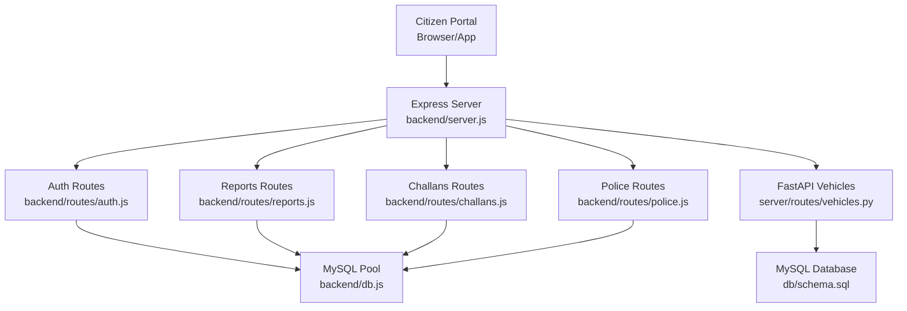
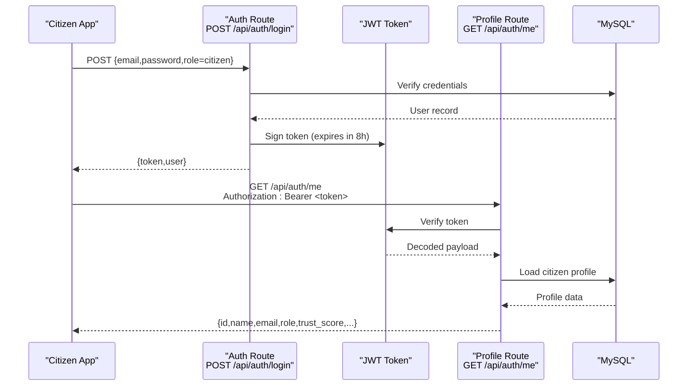
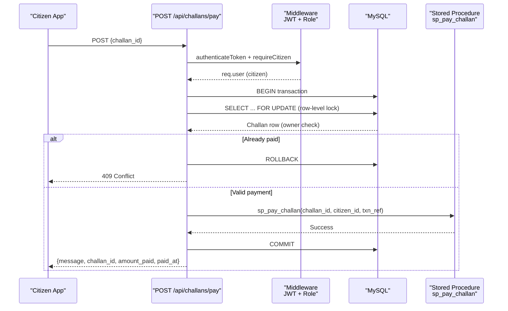
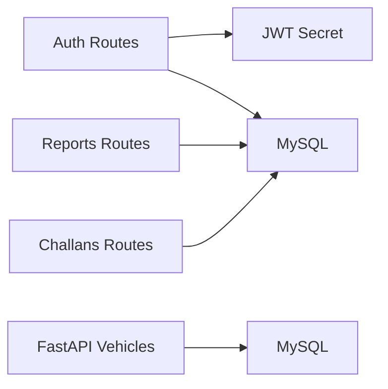

# Citizen API Endpoints

<cite>
**Referenced Files in This Document**
- [server.js](file://backend/server.js)
- [auth.js](file://backend/middleware/auth.js)
- [auth_routes.js](file://backend/routes/auth.js)
- [reports_routes.js](file://backend/routes/reports.js)
- [challans_routes.js](file://backend/routes/challans.js)
- [vehicles_routes.py](file://server/routes/vehicles.py)
- [schema.sql](file://db/schema.sql)
</cite>

## Table of Contents
1. [Introduction](#introduction)
2. [Project Structure](#project-structure)
3. [Core Components](#core-components)
4. [Architecture Overview](#architecture-overview)
5. [Detailed Component Analysis](#detailed-component-analysis)
6. [Dependency Analysis](#dependency-analysis)
7. [Performance Considerations](#performance-considerations)
8. [Troubleshooting Guide](#troubleshooting-guide)
9. [Conclusion](#conclusion)

## Introduction
This document provides comprehensive API documentation for citizen-facing endpoints in the Traffic Violation Management System. It covers authentication, report submission, challan management, and vehicle search (police-focused). For each endpoint, you will find request/response schemas, authentication requirements using JWT tokens, error handling patterns, and practical examples with curl commands. It also outlines data validation rules, file upload specifications for evidence photos, and integration patterns for the citizen portal.

## Project Structure
The backend is an Express.js server exposing REST endpoints grouped by feature:
- Authentication: /api/auth
- Reports: /api/reports
- Challans: /api/challans
- Police: /api/police
- Vehicle search (police): /api/vehicles/search/{plate}

**Diagram sources**
- [server.js:10-26](file://backend/server.js#L10-L26)
- [auth_routes.js:1-117](file://backend/routes/auth.js#L1-L117)
- [reports_routes.js:1-54](file://backend/routes/reports.js#L1-L54)
- [challans_routes.js:1-101](file://backend/routes/challans.js#L1-L101)
- [vehicles_routes.py:1-145](file://server/routes/vehicles.py#L1-L145)
- [schema.sql:1-120](file://db/schema.sql#L1-L120)

**Section sources**
- [server.js:10-26](file://backend/server.js#L10-L26)

## Core Components
- Authentication middleware enforces JWT-based access control and role checks.
- Auth routes implement login and profile retrieval with role-specific payloads.
- Reports routes support citizen report submission and retrieval of their own reports.
- Challans routes support fetching and paying challans with row-level locking for safety.
- Vehicle search is exposed via FastAPI for police use.

Key runtime details:
- CORS enabled globally.
- JSON body parsing enabled.
- Health check endpoint at /api/health.
- Centralized 404 and global error handlers.

**Section sources**
- [auth.js:1-37](file://backend/middleware/auth.js#L1-L37)
- [auth_routes.js:1-117](file://backend/routes/auth.js#L1-L117)
- [reports_routes.js:1-54](file://backend/routes/reports.js#L1-L54)
- [challans_routes.js:1-101](file://backend/routes/challans.js#L1-L101)
- [vehicles_routes.py:1-145](file://server/routes/vehicles.py#L1-L145)
- [server.js:13-37](file://backend/server.js#L13-L37)

## Architecture Overview
The citizen portal integrates with the backend through authenticated HTTP requests. Authentication uses signed JWT tokens. Role-based access ensures citizens can only access citizen-restricted endpoints.

**Diagram sources**
- [auth_routes.js:9-76](file://backend/routes/auth.js#L9-L76)
- [auth.js:5-20](file://backend/middleware/auth.js#L5-L20)
- [server.js:14-20](file://backend/server.js#L14-L20)

## Detailed Component Analysis

### Authentication Endpoints
- POST /api/auth/login
  - Purpose: Authenticate a citizen and return a JWT token and user profile.
  - Request body:
    - email: string (required)
    - password: string (required)
    - role: string enum "citizen" or "police" (required)
  - Response:
    - token: string (JWT)
    - user: object
      - id: integer/string (citizen_id or police_id)
      - name: string
      - email: string
      - role: "citizen" or "police"
      - trust_score: integer (present for citizens)
      - badge_number: string (present for police)
      - station: string (present for police)
  - Errors:
    - 400: Missing fields or invalid role
    - 401: Invalid credentials
    - 500: Server error during login
  - Example curl:
    - curl -X POST http://localhost:5000/api/auth/login -H "Content-Type: application/json" -d '{"email":"aarav@example.com","password":"password123","role":"citizen"}'

- GET /api/auth/me
  - Purpose: Retrieve the authenticated citizen’s profile.
  - Headers:
    - Authorization: Bearer <JWT token>
  - Response:
    - id: integer/string
    - name: string
    - email: string
    - role: "citizen" or "police"
    - trust_score: integer (for citizens)
    - badge_number: string (for police)
    - station: string (for police)
  - Errors:
    - 401: No token provided
    - 403: Invalid/expired token
    - 404: User not found
    - 500: Internal server error
  - Example curl:
    - curl -H "Authorization: Bearer eyJhb..." http://localhost:5000/api/auth/me

**Section sources**
- [auth_routes.js:9-114](file://backend/routes/auth.js#L9-L114)
- [auth.js:5-20](file://backend/middleware/auth.js#L5-L20)

### Report Submission Endpoints
- POST /api/reports
  - Purpose: Submit a new violation report (citizen only).
  - Authentication: JWT required; requires citizen role.
  - Request body:
    - plate_number: string (required)
    - latitude: number/string (optional)
    - longitude: number/string (optional)
    - image_url: string (optional)
    - description: text (required)
  - Response:
    - message: string
    - report_id: integer
  - Errors:
    - 400: Missing required fields
    - 500: Failed to submit report
  - Example curl:
    - curl -X POST http://localhost:5000/api/reports -H "Content-Type: application/json" -H "Authorization: Bearer <token>" -d '{"plate_number":"TN-01-AB-1234","latitude":"13.0827","longitude":"80.2707","image_url":"/uploads/evidence/photo.jpg","description":"Running red light"}'

- GET /api/reports/my
  - Purpose: Retrieve the logged-in citizen’s reports.
  - Authentication: JWT required; requires citizen role.
  - Response: Array of report objects with fields:
    - report_id: integer
    - plate_number: string
    - latitude: number/string
    - longitude: number/string
    - image_url: string
    - description: text
    - status: enum "Pending","Verified","Rejected"
    - reported_at: datetime
  - Errors:
    - 500: Failed to fetch reports

**Section sources**
- [reports_routes.js:7-51](file://backend/routes/reports.js#L7-L51)

### Challan Management Endpoints
- GET /api/challans/my
  - Purpose: View challans associated with the logged-in citizen.
  - Authentication: JWT required; requires citizen role.
  - Response: Array of challan objects with fields:
    - challan_id: integer
    - amount: decimal
    - status: enum "Unpaid","Paid","Overdue","Waived","Disputed"
    - issued_at: date
    - paid_at: datetime
    - rule_code: string
    - violation_description: string
    - issued_by_officer: string
  - Errors:
    - 500: Failed to fetch challans

- POST /api/challans/pay
  - Purpose: Pay a specific challan with row-level locking to prevent race conditions.
  - Authentication: JWT required; requires citizen role.
  - Request body:
    - challan_id: integer (required)
  - Response:
    - message: string
    - challan_id: integer
    - amount_paid: decimal
    - paid_at: datetime (ISO string)
  - Errors:
    - 400: Missing challan_id
    - 404: Challan not found
    - 403: Not authorized to pay this challan
    - 409: Challan already paid
    - 500: Payment failed
  - Example curl:
    - curl -X POST http://localhost:5000/api/challans/pay -H "Content-Type: application/json" -H "Authorization: Bearer <token>" -d '{"challan_id":1}'

**Diagram sources**
- [challans_routes.js:31-98](file://backend/routes/challans.js#L31-L98)
- [schema.sql:548-629](file://db/schema.sql#L548-L629)

**Section sources**
- [challans_routes.js:7-98](file://backend/routes/challans.js#L7-L98)
- [schema.sql:548-629](file://db/schema.sql#L548-L629)

### Vehicle Search Endpoint (Police)
- GET /api/vehicles/search/{plate}
  - Purpose: Search vehicle by plate number and return registration details plus violation history (police use).
  - Authentication: Requires police role (via separate FastAPI routes).
  - Path parameter:
    - plate: string (vehicle plate number)
  - Response:
    - message: string
    - vehicle: object with fields:
      - plate_no: string
      - vehicle_model: string
      - vehicle_type: enum
      - owner_name: string
      - owner_type: enum
      - registered_at: datetime (ISO string)
    - summary: object with fields:
      - total_violations: integer
      - unpaid_challans: integer
      - total_unpaid_amount: number
    - violations: array of violation objects with fields:
      - event_id: integer
      - event_timestamp: datetime (ISO string)
      - location_coords: string
      - notes: text
      - rule_code: string
      - rule_name: string
      - base_fine_amount: number
      - severity: enum
      - challan_id: integer
      - total_amount: number
      - payment_status: enum
      - issue_date: date
      - due_date: date
      - paid_at: datetime (ISO string)
  - Errors:
    - 404: Vehicle not found
    - 500: Internal server error
  - Example curl:
    - curl http://localhost:5000/api/vehicles/search/TN-01-AB-1234

**Section sources**
- [vehicles_routes.py:36-131](file://server/routes/vehicles.py#L36-L131)

## Dependency Analysis
- Authentication depends on:
  - JWT secret from environment.
  - MySQL for user lookup and profile retrieval.
- Reports depend on:
  - Citizen identity from JWT.
  - MySQL for inserting reports and fetching citizen reports.
- Challans depend on:
  - Citizen identity from JWT.
  - MySQL with stored procedures and triggers for safe updates.
- Vehicle search depends on:
  - FastAPI service with dedicated database connection and queries.

**Diagram sources**
- [auth.js](file://backend/middleware/auth.js#L3)
- [auth_routes.js:1-117](file://backend/routes/auth.js#L1-L117)
- [reports_routes.js:1-54](file://backend/routes/reports.js#L1-L54)
- [challans_routes.js:1-101](file://backend/routes/challans.js#L1-L101)
- [vehicles_routes.py:1-145](file://server/routes/vehicles.py#L1-L145)

**Section sources**
- [auth.js](file://backend/middleware/auth.js#L3)
- [schema.sql:1-120](file://db/schema.sql#L1-L120)

## Performance Considerations
- JWT expiration: Tokens expire in 8 hours to reduce long-lived session risks.
- Row-level locking: Payments use SELECT ... FOR UPDATE to prevent race conditions.
- Stored procedures: Encapsulate critical transactions to minimize application-level errors.
- Database pooling: MySQL pool configured with connection limits and keep-alive.
- CORS and JSON parsing: Applied globally to avoid per-route overhead.

[No sources needed since this section provides general guidance]

## Troubleshooting Guide
Common issues and resolutions:
- 401 Unauthorized:
  - Cause: Missing or malformed Authorization header.
  - Fix: Ensure "Authorization: Bearer <token>" is sent with every protected request.
- 403 Forbidden:
  - Cause: Invalid or expired token; or insufficient role (e.g., accessing citizen-only endpoints).
  - Fix: Re-authenticate to obtain a new token; verify role in login payload.
- 404 Not Found:
  - Challan not found: Verify challan_id belongs to the logged-in citizen.
  - Vehicle not found: Confirm plate number spelling and case.
- 409 Conflict (Payment):
  - Cause: Attempting to pay an already-paid challan.
  - Fix: Check current status via GET /api/challans/my.
- 500 Internal Server Error:
  - Cause: Database connectivity or stored procedure failure.
  - Fix: Retry after health check; inspect server logs.

**Section sources**
- [auth_routes.js:83-113](file://backend/routes/auth.js#L83-L113)
- [challans_routes.js:53-72](file://backend/routes/challans.js#L53-L72)
- [vehicles_routes.py:61-65](file://server/routes/vehicles.py#L61-L65)

## Conclusion
The citizen-facing API provides secure, role-gated endpoints for authentication, report submission, and challan management. Authentication relies on JWT with short-lived tokens, while critical operations like payments use row-level locking and stored procedures to ensure data integrity. Vehicle search is available via a dedicated police endpoint. Integrate the citizen portal by sending authenticated requests with proper headers and validating responses against the documented schemas.