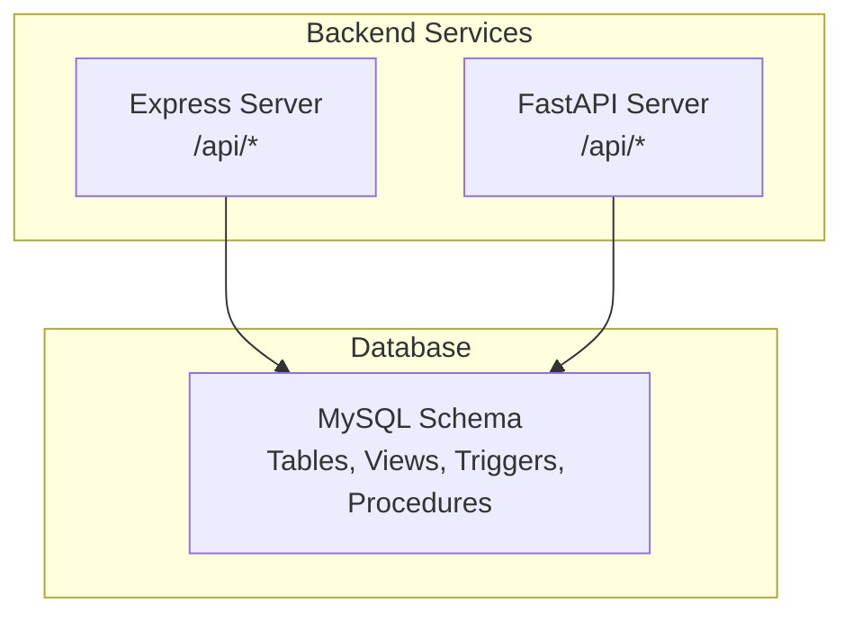
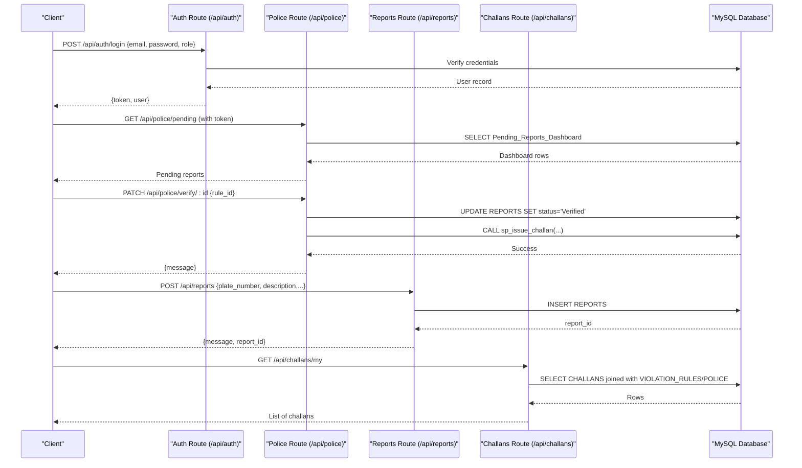
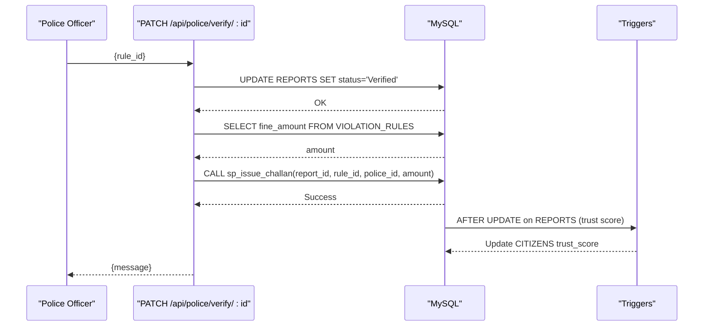
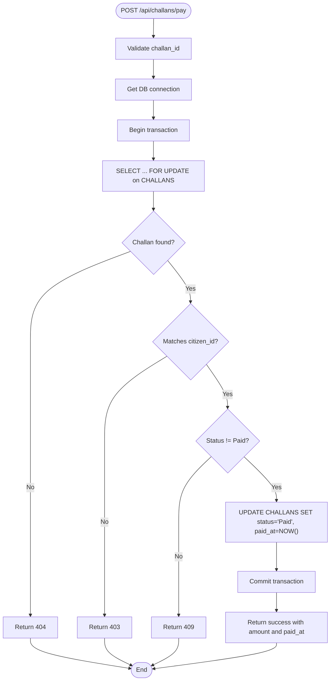
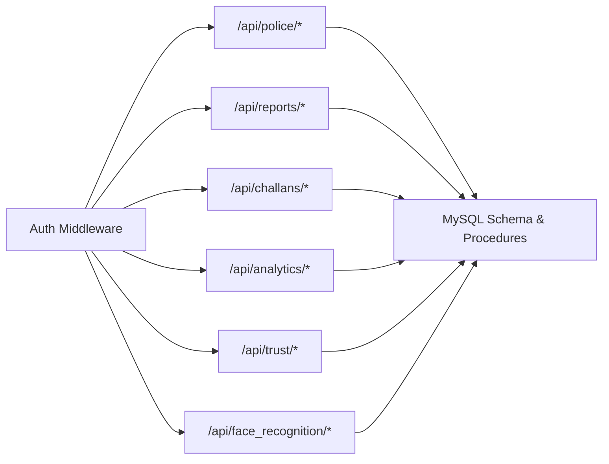

# Police API Endpoints

<cite>
**Referenced Files in This Document**
- [server.js](file://backend/server.js)
- [auth.js](file://backend/routes/auth.js)
- [police.js](file://backend/routes/police.js)
- [reports.js](file://backend/routes/reports.js)
- [challans.js](file://backend/routes/challans.js)
- [auth.js](file://backend/middleware/auth.js)
- [schema.sql](file://db/schema.sql)
- [stored_procedure_process_report.sql](file://db/stored_procedure_process_report.sql)
- [reports_enhancement.sql](file://db/reports_enhancement.sql)
- [marga_rakshak_triggers.sql](file://db/marga_rakshak_triggers.sql)
- [face_recognition.py](file://server/routes/face_recognition.py)
- [analytics.py](file://server/routes/analytics.py)
- [trust.py](file://server/routes/trust.py)
</cite>

## Table of Contents
1. [Introduction](#introduction)
2. [Project Structure](#project-structure)
3. [Core Components](#core-components)
4. [Architecture Overview](#architecture-overview)
5. [Detailed Component Analysis](#detailed-component-analysis)
6. [Dependency Analysis](#dependency-analysis)
7. [Performance Considerations](#performance-considerations)
8. [Troubleshooting Guide](#troubleshooting-guide)
9. [Conclusion](#conclusion)

## Introduction
This document provides comprehensive API documentation for police and administrative endpoints within the Traffic Violation Management System. It covers authentication endpoints for police officers, report review and verification workflows, challan generation and management, analytics and trust score administration, and face recognition endpoints for biometric authentication. The documentation includes request/response schemas, role-based access control requirements, administrative function specifications, and practical examples for report processing and dashboard analytics.

## Project Structure
The system comprises:
- Express.js backend exposing REST endpoints under /api
- FastAPI Python backend exposing analytics, trust, and face recognition endpoints
- MySQL database with normalized schema, views, triggers, stored procedures, and event scheduling

**Diagram sources**
- [server.js:1-42](file://backend/server.js#L1-L42)
- [schema.sql:1-942](file://db/schema.sql#L1-L942)

**Section sources**
- [server.js:1-42](file://backend/server.js#L1-L42)

## Core Components
- Authentication service: login and profile retrieval for citizens and police
- Police portal: pending reports dashboard, report verification/rejection
- Reports: citizen submission and retrieval
- Challans: citizen access to issued challans and payment processing
- Analytics: system-wide and police-specific dashboards
- Trust management: trust score history and manual overdue flagging
- Face recognition: biometric registration and verification

**Section sources**
- [auth.js:1-117](file://backend/routes/auth.js#L1-L117)
- [police.js:1-109](file://backend/routes/police.js#L1-L109)
- [reports.js:1-54](file://backend/routes/reports.js#L1-L54)
- [challans.js:1-101](file://backend/routes/challans.js#L1-L101)
- [analytics.py:1-526](file://server/routes/analytics.py#L1-L526)
- [trust.py:1-134](file://server/routes/trust.py#L1-L134)
- [face_recognition.py:1-282](file://server/routes/face_recognition.py#L1-L282)

## Architecture Overview
The system uses role-based access control via JWT tokens. Express routes enforce roles for police-only endpoints, while FastAPI routes implement additional analytics and trust endpoints. Database triggers and stored procedures encapsulate business logic for trust scoring, challan issuance, and overdue processing.

**Diagram sources**
- [auth.js:9-76](file://backend/routes/auth.js#L9-L76)
- [police.js:7-85](file://backend/routes/police.js#L7-L85)
- [reports.js:7-31](file://backend/routes/reports.js#L7-L31)
- [challans.js:7-29](file://backend/routes/challans.js#L7-L29)
- [schema.sql:764-781](file://db/schema.sql#L764-L781)

## Detailed Component Analysis

### Authentication Endpoints
- POST /api/auth/login
  - Purpose: Authenticate citizens or police and return a signed JWT token
  - Request body:
    - email: string (required)
    - password: string (required)
    - role: "citizen" | "police" (required)
  - Response:
    - token: string
    - user: object containing id, name, email, role, and either trust_score (citizen) or badge_number/station (police)
  - Access control: none (authentication required after login)
  - Role-based behavior: selects appropriate table (CITIZENS vs POLICE) and returns role-specific fields

- GET /api/auth/me
  - Purpose: Retrieve currently authenticated user profile
  - Headers: Authorization: Bearer <token>
  - Response: User object with role
  - Access control: requires valid JWT

**Section sources**
- [auth.js:9-76](file://backend/routes/auth.js#L9-L76)
- [auth.js:78-114](file://backend/routes/auth.js#L78-L114)

### Report Review and Verification Endpoints
- GET /api/police/pending
  - Purpose: Fetch pending reports for the police dashboard
  - Access control: authenticateToken + requirePolice
  - Response: Array of pending reports from Pending_Reports_Dashboard view

- PATCH /api/police/verify/:id
  - Purpose: Verify a report and issue a challan
  - Path params: id = report_id
  - Request body: rule_id (required)
  - Access control: authenticateToken + requirePolice
  - Processing:
    - Validates report status "Pending"
    - Updates status to "Verified"
    - Retrieves fine amount from VIOLATION_RULES
    - Calls stored procedure sp_issue_challan with report_id, rule_id, police_id, amount
  - Response: Success message
  - Notes: Uses transaction with row-level locks and triggers for trust score updates

- PATCH /api/police/reject/:id
  - Purpose: Reject a pending report
  - Path params: id = report_id
  - Access control: authenticateToken + requirePolice
  - Processing:
    - Updates status to "Rejected"
  - Response: Success message

**Diagram sources**
- [police.js:18-85](file://backend/routes/police.js#L18-L85)
- [schema.sql:440-546](file://db/schema.sql#L440-L546)
- [marga_rakshak_triggers.sql:16-45](file://db/marga_rakshak_triggers.sql#L16-L45)

**Section sources**
- [police.js:7-106](file://backend/routes/police.js#L7-L106)
- [schema.sql:764-781](file://db/schema.sql#L764-L781)

### Challan Generation and Management Endpoints
- GET /api/challans/my
  - Purpose: Retrieve challans associated with the logged-in citizen
  - Access control: authenticateToken + requireCitizen
  - Response: Array of challans joined with VIOLATION_RULES and issuing POLICE officer

- POST /api/challans/pay
  - Purpose: Pay a challan with row-level locking to prevent race conditions
  - Request body: challan_id (required)
  - Access control: authenticateToken + requireCitizen
  - Processing:
    - Locks specific challan row for update
    - Verifies ownership and unpaid status
    - Updates status to "Paid" and sets paid_at
  - Response: Payment success with amount_paid and paid_at

**Diagram sources**
- [challans.js:31-98](file://backend/routes/challans.js#L31-L98)

**Section sources**
- [challans.js:7-98](file://backend/routes/challans.js#L7-L98)

### Analytics and Trust Score Management
- GET /api/analytics/summary
  - Purpose: System-wide dashboard summary (counts and revenue)
  - Response: Aggregated metrics for reports, challans, and system stats

- GET /api/analytics/police-summary
  - Purpose: Police dashboard summary (processed, pending, verified, rejected, fines collected, active challans)

- GET /api/analytics/leaderboard
  - Purpose: Top 50 citizens by trust_score and reward_points

- GET /api/analytics/citizen/{citizen_id}
  - Purpose: Personal analytics for a citizen (reports counts and trust_score)
  - Access control: requireCitizen ensures only self-access

- GET /api/analytics/police/system
  - Purpose: Global system analytics for police/admin (totals for reports, citizens, police)

- GET /api/analytics/violation-types
  - Purpose: Violation type distribution

- GET /api/analytics/recent-activity
  - Purpose: Recent report activity with reporter info

- GET /api/analytics/status-trend
  - Purpose: Daily report status trend for the last 7 days

- GET /api/trust/history/{citizen_id}
  - Purpose: Trust score history for a citizen
  - Access control: requireCitizen ensures only self-access

- GET /api/trust/current/{citizen_id}
  - Purpose: Current trust score and related info
  - Access control: requireCitizen ensures only self-access

- POST /api/trust/flag-overdue
  - Purpose: Manually trigger overdue challan flagging procedure
  - Access control: require_police

**Section sources**
- [analytics.py:36-526](file://server/routes/analytics.py#L36-L526)
- [trust.py:15-134](file://server/routes/trust.py#L15-L134)

### Face Recognition Endpoints
- POST /api/face_recognition/register_face
  - Purpose: Register face encoding for a citizen
  - Form data:
    - citizen_id: integer (form field)
    - image: UploadFile (image file)
  - Response: Success message with citizen details
  - Processing: Detects face, extracts 128-d encoding, stores in CITIZENS.face_encoding

- POST /api/face_recognition/login_face
  - Purpose: Face-based login
  - Form data: image (UploadFile)
  - Response: JWT token and user profile if match found within tolerance
  - Processing: Compares against all stored encodings and generates token

- POST /api/face_recognition/detect_face
  - Purpose: Simple face detection endpoint (for testing)
  - Response: Whether face detected and bounding box

**Section sources**
- [face_recognition.py:28-282](file://server/routes/face_recognition.py#L28-L282)

### Role-Based Access Control
- authenticateToken: validates JWT from Authorization header
- requireCitizen: enforces role "citizen"
- requirePolice: enforces role "police"

**Section sources**
- [auth.js:1-37](file://backend/middleware/auth.js#L1-L37)

## Dependency Analysis
Key dependencies and relationships:
- Express routes depend on shared middleware for authentication and role checks
- Police endpoints depend on Pending_Reports_Dashboard view and stored procedure sp_issue_challan
- Trust score updates are handled by triggers on REPORTS and CITIZENS
- Challan payment uses row-level locking to prevent race conditions
- Analytics endpoints query denormalized data for performance
- Face recognition endpoints integrate with face detection models and database storage

**Diagram sources**
- [auth.js:1-37](file://backend/middleware/auth.js#L1-L37)
- [server.js:5-26](file://backend/server.js#L5-L26)
- [schema.sql:1-942](file://db/schema.sql#L1-L942)

**Section sources**
- [server.js:1-42](file://backend/server.js#L1-L42)
- [schema.sql:1-942](file://db/schema.sql#L1-L942)

## Performance Considerations
- Row-level locking in challan payment prevents race conditions and ensures atomicity
- Stored procedures centralize business logic and reduce network round trips
- Database triggers maintain referential integrity and audit trails automatically
- Event-based cleanup for sessions and unverified uploads reduces maintenance overhead
- Views provide optimized access to frequently accessed dashboard data

## Troubleshooting Guide
Common issues and resolutions:
- Authentication failures:
  - Ensure Authorization header contains valid Bearer token
  - Verify JWT_SECRET environment variable is set
- Role access errors:
  - Confirm login role matches endpoint requirements
  - Check middleware enforceRole functions
- Report verification failures:
  - Verify report status is "Pending"
  - Ensure rule_id exists and is active
  - Check stored procedure execution logs
- Challan payment conflicts:
  - Handle 409 "already paid" responses
  - Implement retry with exponential backoff
- Face recognition errors:
  - Verify face detection models are loaded
  - Ensure image quality meets detection thresholds
  - Check tolerance settings for comparison

**Section sources**
- [auth.js:5-20](file://backend/middleware/auth.js#L5-L20)
- [police.js:24-63](file://backend/routes/police.js#L24-L63)
- [challans.js:44-72](file://backend/routes/challans.js#L44-L72)
- [face_recognition.py:34-42](file://server/routes/face_recognition.py#L34-L42)

## Conclusion
The Traffic Violation Management System provides a robust, secure, and scalable API for police and administrative functions. The architecture leverages JWT-based authentication, role-specific access controls, database triggers for trust management, and stored procedures for complex workflows like challan issuance. The analytics and trust endpoints enable comprehensive oversight and citizen engagement through transparent scoring mechanisms.