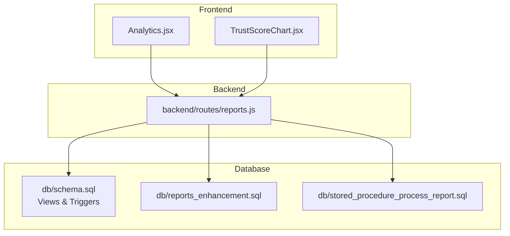
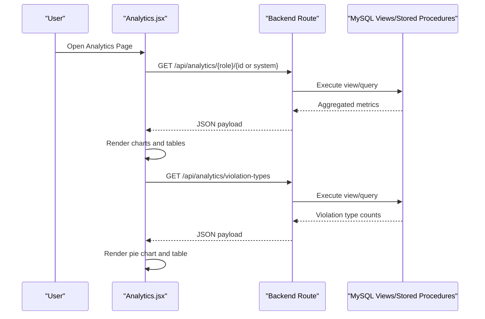
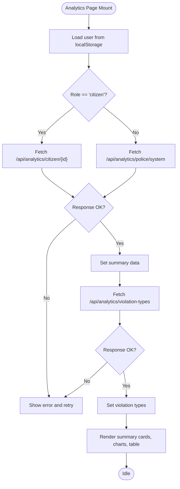
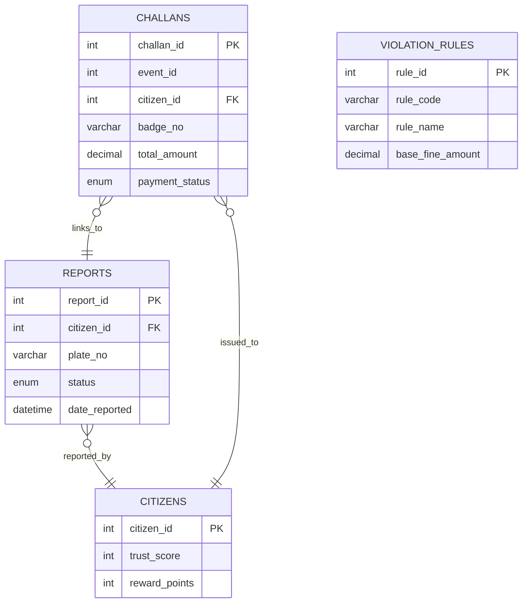
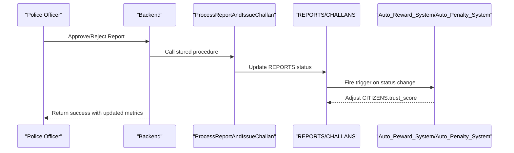
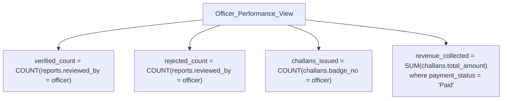
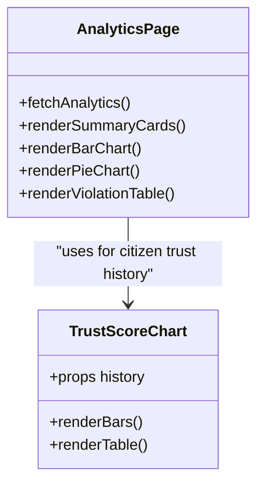
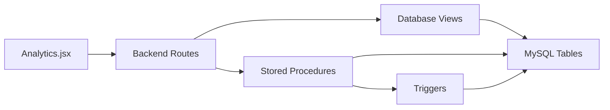

# Analytics and Reporting

<cite>
**Referenced Files in This Document**
- [Analytics.jsx](file://frontend/src/pages/Analytics.jsx)
- [TrustScoreChart.jsx](file://frontend/src/components/TrustScoreChart.jsx)
- [schema.sql](file://db/schema.sql)
- [reports_enhancement.sql](file://db/reports_enhancement.sql)
- [stored_procedure_process_report.sql](file://db/stored_procedure_process_report.sql)
- [database_triggers.sql](file://db/database_triggers.sql)
- [marga_rakshak_triggers.sql](file://db/marga_rakshak_triggers.sql)
- [reports.js](file://backend/routes/reports.js)
</cite>

## Table of Contents
1. [Introduction](#introduction)
2. [Project Structure](#project-structure)
3. [Core Components](#core-components)
4. [Architecture Overview](#architecture-overview)
5. [Detailed Component Analysis](#detailed-component-analysis)
6. [Dependency Analysis](#dependency-analysis)
7. [Performance Considerations](#performance-considerations)
8. [Troubleshooting Guide](#troubleshooting-guide)
9. [Conclusion](#conclusion)
10. [Appendices](#appendices)

## Introduction
This document explains the analytics and reporting capabilities of the Traffic Violation Management System. It covers:
- Real-time traffic violation statistics and trend analysis
- Dashboard components and visualization using Recharts
- Pre-computed database views and stored procedures that optimize performance
- Trust score analytics and citizen performance tracking
- Police performance metrics (verification rates, revenue, efficiency)
- Export-ready report structures and data aggregation patterns
- Integration between database views and frontend visualization components

## Project Structure
The analytics implementation spans three layers:
- Frontend: React components render charts and summaries
- Backend: Routes expose analytics endpoints
- Database: Views and stored procedures aggregate and compute metrics efficiently

**Diagram sources**
- [Analytics.jsx:1-271](file://frontend/src/pages/Analytics.jsx#L1-L271)
- [TrustScoreChart.jsx:1-126](file://frontend/src/components/TrustScoreChart.jsx#L1-L126)
- [reports.js:1-54](file://backend/routes/reports.js#L1-L54)
- [schema.sql:757-840](file://db/schema.sql#L757-L840)
- [reports_enhancement.sql:1-302](file://db/reports_enhancement.sql#L1-L302)
- [stored_procedure_process_report.sql:1-115](file://db/stored_procedure_process_report.sql#L1-L115)

**Section sources**
- [Analytics.jsx:1-271](file://frontend/src/pages/Analytics.jsx#L1-L271)
- [TrustScoreChart.jsx:1-126](file://frontend/src/components/TrustScoreChart.jsx#L1-L126)
- [reports.js:1-54](file://backend/routes/reports.js#L1-L54)
- [schema.sql:757-840](file://db/schema.sql#L757-L840)

## Core Components
- Analytics dashboard page renders:
  - Summary cards for total, pending, verified, and rejected reports
  - Bar chart of report status distribution
  - Pie chart of violation types
  - Violation type breakdown table
  - Role-aware data: citizens see personal trust score; police see system-wide stats
- Trust score visualization displays historical changes via a custom bar chart component
- Backend routes support:
  - Report submission and retrieval
  - Role-based analytics endpoints (as referenced by the frontend)

**Section sources**
- [Analytics.jsx:1-271](file://frontend/src/pages/Analytics.jsx#L1-L271)
- [TrustScoreChart.jsx:1-126](file://frontend/src/components/TrustScoreChart.jsx#L1-L126)
- [reports.js:1-54](file://backend/routes/reports.js#L1-L54)

## Architecture Overview
The analytics pipeline integrates frontend visualization with backend routes and database views/stored procedures.

**Diagram sources**
- [Analytics.jsx:19-57](file://frontend/src/pages/Analytics.jsx#L19-L57)
- [schema.sql:764-780](file://db/schema.sql#L764-L780)
- [schema.sql:807-820](file://db/schema.sql#L807-L820)

## Detailed Component Analysis

### Frontend Dashboard Components
- Analytics page:
  - Loads role from local storage and requests appropriate analytics endpoint
  - Renders summary cards and two charts using Recharts
  - Displays a violation type table with computed percentages
- Trust score chart:
  - Accepts trust history data and renders a vertical bar chart with color-coded bars
  - Provides a small table of recent trust score changes

**Diagram sources**
- [Analytics.jsx:15-57](file://frontend/src/pages/Analytics.jsx#L15-L57)

**Section sources**
- [Analytics.jsx:1-271](file://frontend/src/pages/Analytics.jsx#L1-L271)
- [TrustScoreChart.jsx:1-126](file://frontend/src/components/TrustScoreChart.jsx#L1-L126)

### Database Views and Stored Procedures
- Pre-computed views:
  - Pending_Reports_Dashboard: lists pending reports with reporter info and evidence count
  - Officer_Performance_View: aggregates verified/rejected counts, challans issued, and revenue collected per officer
  - Citizen_Challan_Summary: citizen-facing challan overview
  - Citizen_Trust_History: temporal view of trust score changes
- Stored procedures:
  - ProcessReportAndIssueChallan: ACID-compliant workflow to process reports and issue challans
- Triggers:
  - Auto_Reward_System and Auto_Penalty_System adjust citizen trust scores on report status changes
  - Additional triggers in marga_rakshak_triggers.sql reinforce trust scoring behavior

**Diagram sources**
- [schema.sql:116-136](file://db/schema.sql#L116-L136)
- [schema.sql:26-43](file://db/schema.sql#L26-L43)
- [schema.sql:173-195](file://db/schema.sql#L173-L195)
- [schema.sql:100-111](file://db/schema.sql#L100-L111)

**Section sources**
- [schema.sql:764-840](file://db/schema.sql#L764-L840)
- [stored_procedure_process_report.sql:8-98](file://db/stored_procedure_process_report.sql#L8-L98)
- [database_triggers.sql:8-35](file://db/database_triggers.sql#L8-L35)
- [marga_rakshak_triggers.sql:16-45](file://db/marga_rakshak_triggers.sql#L16-L45)

### Trust Score Analytics
- Historical tracking:
  - CITIZENS_HISTORY captures trust score changes over time
  - Frontend TrustScoreChart renders recent history with color-coded bars and a tabular log
- Real-time updates:
  - Triggers update trust score upon report verification/rejection
  - Revenue and report counts may also be incremented via triggers

**Diagram sources**
- [stored_procedure_process_report.sql:33-84](file://db/stored_procedure_process_report.sql#L33-L84)
- [database_triggers.sql:14-20](file://db/database_triggers.sql#L14-L20)
- [marga_rakshak_triggers.sql:20-27](file://db/marga_rakshak_triggers.sql#L20-L27)

**Section sources**
- [schema.sql:822-839](file://db/schema.sql#L822-L839)
- [TrustScoreChart.jsx:1-126](file://frontend/src/components/TrustScoreChart.jsx#L1-L126)
- [database_triggers.sql:8-35](file://db/database_triggers.sql#L8-L35)
- [marga_rakshak_triggers.sql:16-45](file://db/marga_rakshak_triggers.sql#L16-L45)

### Police Performance Metrics
- Officer_Performance_View aggregates:
  - Number of verified vs. rejected reports per officer
  - Total challans issued
  - Revenue collected from paid challans
- These metrics enable verification rate analysis, efficiency monitoring, and revenue attribution

**Diagram sources**
- [schema.sql:809-819](file://db/schema.sql#L809-L819)

**Section sources**
- [schema.sql:807-820](file://db/schema.sql#L807-L820)

### Data Visualization Implementation
- Recharts usage:
  - BarChart for report status distribution
  - PieChart for violation type composition
  - ResponsiveContainer ensures charts adapt to screen size
- Custom TrustScoreChart:
  - Vertical bar chart with dynamic scaling and color bands
  - Recent history table with dates, scores, reward points, status, and change type

**Diagram sources**
- [Analytics.jsx:59-71](file://frontend/src/pages/Analytics.jsx#L59-L71)
- [TrustScoreChart.jsx:1-126](file://frontend/src/components/TrustScoreChart.jsx#L1-L126)

**Section sources**
- [Analytics.jsx:1-271](file://frontend/src/pages/Analytics.jsx#L1-L271)
- [TrustScoreChart.jsx:1-126](file://frontend/src/components/TrustScoreChart.jsx#L1-L126)

### Backend Routes Supporting Analytics
- Reports route supports:
  - Submitting new reports (citizen-only)
  - Fetching citizen’s own reports
- Analytics endpoints are consumed by the frontend (as shown in the frontend code), enabling:
  - Role-aware dashboards
  - Violation type distributions
  - Real-time refresh patterns

**Section sources**
- [reports.js:1-54](file://backend/routes/reports.js#L1-L54)
- [Analytics.jsx:19-57](file://frontend/src/pages/Analytics.jsx#L19-L57)

## Dependency Analysis
- Frontend depends on:
  - Backend analytics endpoints
  - Recharts for visualization
- Backend depends on:
  - Database views for aggregated metrics
  - Stored procedures for ACID-compliant processing
  - Triggers for automatic trust score updates
- Database schema defines:
  - Core entities and relationships
  - Indexes supporting analytics queries
  - Scheduled events for overdue processing

**Diagram sources**
- [Analytics.jsx:19-57](file://frontend/src/pages/Analytics.jsx#L19-L57)
- [schema.sql:764-840](file://db/schema.sql#L764-L840)
- [stored_procedure_process_report.sql:8-98](file://db/stored_procedure_process_report.sql#L8-L98)
- [database_triggers.sql:8-35](file://db/database_triggers.sql#L8-L35)

**Section sources**
- [Analytics.jsx:1-271](file://frontend/src/pages/Analytics.jsx#L1-L271)
- [schema.sql:757-840](file://db/schema.sql#L757-L840)
- [stored_procedure_process_report.sql:1-115](file://db/stored_procedure_process_report.sql#L1-L115)
- [database_triggers.sql:1-48](file://db/database_triggers.sql#L1-L48)

## Performance Considerations
- Pre-computed views:
  - Offload heavy aggregations to views (e.g., Pending_Reports_Dashboard, Officer_Performance_View)
  - Reduce runtime joins and improve response times
- Indexes:
  - Ensure indexes on frequently filtered/sorted columns (status, date_reported, payment_status)
- Stored procedures:
  - Encapsulate complex workflows and enforce ACID properties
- Real-time refresh:
  - Frontend can poll endpoints periodically; consider throttling and caching
- Data volume:
  - Use LIMIT clauses for leaderboards and recent histories
  - Paginate large result sets when extending analytics

[No sources needed since this section provides general guidance]

## Troubleshooting Guide
- Analytics page shows an error:
  - Verify backend analytics endpoints are reachable
  - Confirm user role and ID are present in local storage
- Missing trust score history:
  - Ensure CITIZENS_HISTORY has records and the view is accessible
- Incorrect violation type counts:
  - Validate underlying REPORTS and VIOLATION_RULES data
- Trust score not updating:
  - Check trigger activation and status transitions in REPORTS

**Section sources**
- [Analytics.jsx:84-100](file://frontend/src/pages/Analytics.jsx#L84-L100)
- [schema.sql:822-839](file://db/schema.sql#L822-L839)
- [database_triggers.sql:8-35](file://db/database_triggers.sql#L8-L35)

## Conclusion
The system combines efficient database views, stored procedures, and triggers with a responsive frontend to deliver real-time analytics. Citizens gain visibility into personal trust scores and report status, while police command centers benefit from performance metrics and revenue analytics. Extending the system with export capabilities and advanced filtering follows naturally from the existing architecture.

[No sources needed since this section summarizes without analyzing specific files]

## Appendices

### Dashboard Configurations and Data Aggregation Patterns
- Summary cards:
  - Total, pending, verified, rejected counts derived from REPORTS status
- Violation types:
  - Count per violation type using grouped queries on REPORTS
- Trust score:
  - Current score from CITIZENS; history from CITIZENS_HISTORY
- Officer performance:
  - Aggregated via Officer_Performance_View

**Section sources**
- [Analytics.jsx:60-71](file://frontend/src/pages/Analytics.jsx#L60-L71)
- [schema.sql:764-780](file://db/schema.sql#L764-L780)
- [schema.sql:807-819](file://db/schema.sql#L807-L819)
- [schema.sql:822-839](file://db/schema.sql#L822-L839)

### Export Functionality and Report Formats
- Current implementation focuses on visualization; exporting can be achieved by:
  - Adding CSV/XLSX endpoints that query the same views/procedures
  - Returning downloadable files with filtered datasets (date range, station, officer)
  - Caching frequent exports to reduce load

[No sources needed since this section provides general guidance]