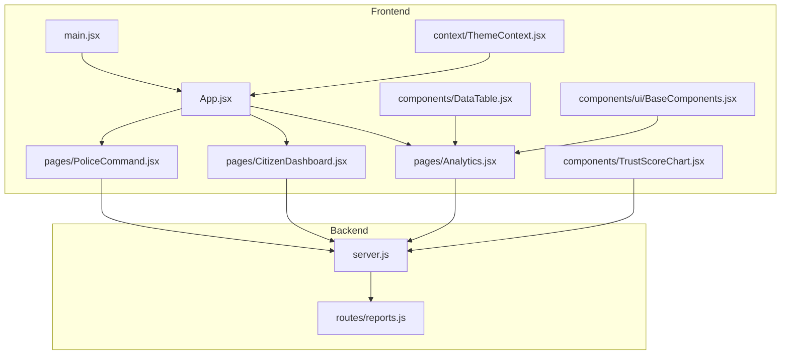
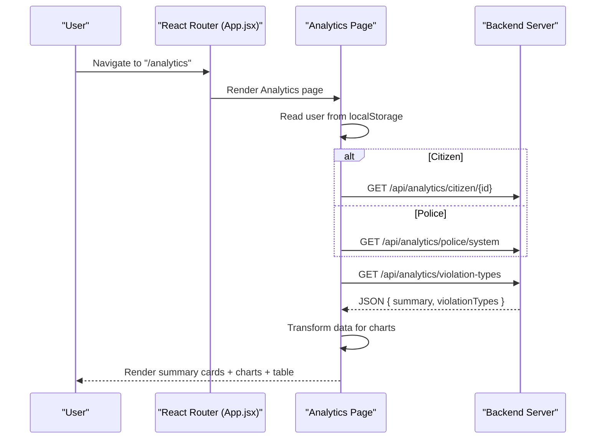
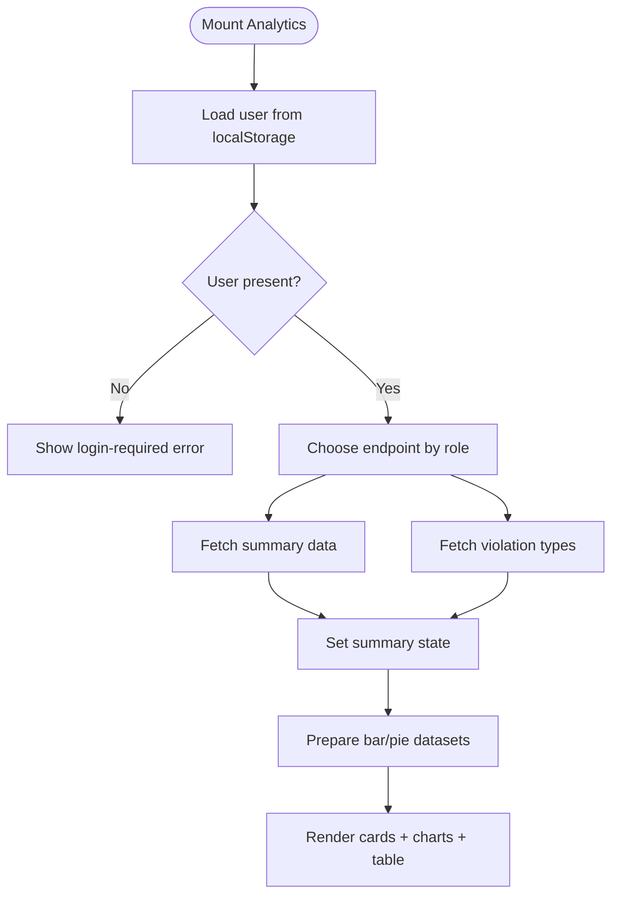
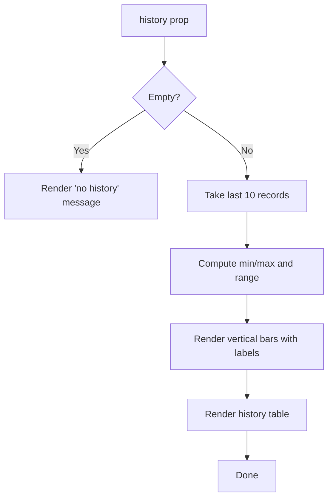
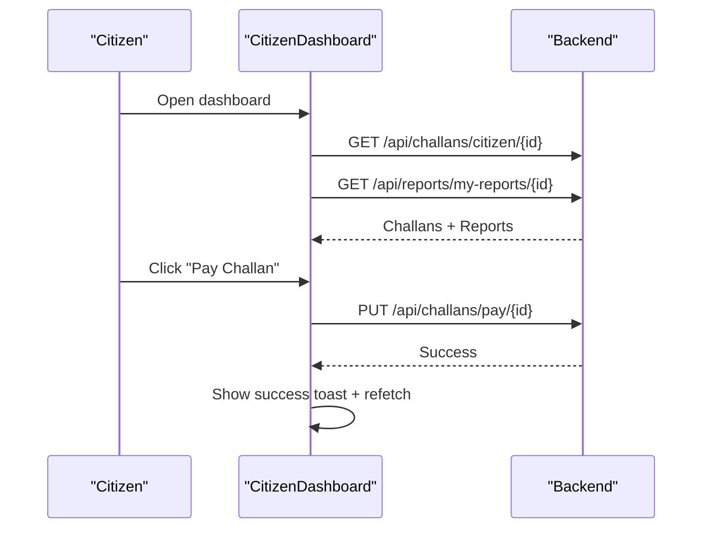
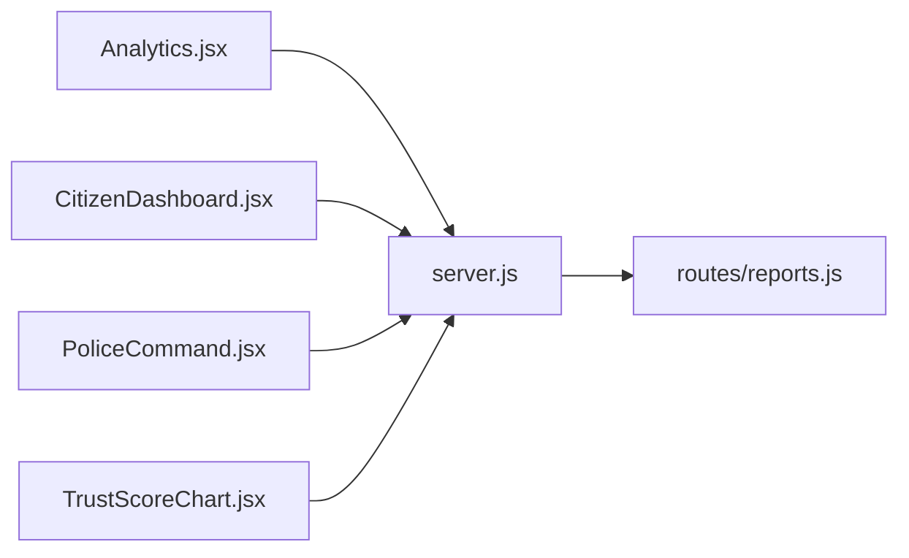

# Dashboard Components

<cite>
**Referenced Files in This Document**
- [Analytics.jsx](file://frontend/src/pages/Analytics.jsx)
- [TrustScoreChart.jsx](file://frontend/src/components/TrustScoreChart.jsx)
- [BaseComponents.jsx](file://frontend/src/components/ui/BaseComponents.jsx)
- [CitizenDashboard.jsx](file://frontend/src/pages/CitizenDashboard.jsx)
- [PoliceCommand.jsx](file://frontend/src/pages/PoliceCommand.jsx)
- [DataTable.jsx](file://frontend/src/components/DataTable.jsx)
- [ThemeContext.jsx](file://frontend/src/context/ThemeContext.jsx)
- [App.jsx](file://frontend/src/App.jsx)
- [main.jsx](file://frontend/src/main.jsx)
- [server.js](file://backend/server.js)
- [reports.js](file://backend/routes/reports.js)
- [README.md](file://README.md)
</cite>

## Table of Contents
1. [Introduction](#introduction)
2. [Project Structure](#project-structure)
3. [Core Components](#core-components)
4. [Architecture Overview](#architecture-overview)
5. [Detailed Component Analysis](#detailed-component-analysis)
6. [Dependency Analysis](#dependency-analysis)
7. [Performance Considerations](#performance-considerations)
8. [Troubleshooting Guide](#troubleshooting-guide)
9. [Conclusion](#conclusion)
10. [Appendices](#appendices)

## Introduction
This document explains the dashboard components that power the analytics and trust score visualization for the traffic violation system. It covers:
- The main analytics dashboard page showing real-time traffic violation statistics, performance metrics, and system health indicators
- Trust score visualization components including charts, graphs, and interactive elements
- Component architecture using React hooks, state management, and data fetching patterns
- Integration between backend analytics endpoints and frontend visualization components
- Real-time data updates, responsive design considerations, and user interaction patterns
- Dashboard layout system, card-based information display, and metric presentation formats
- Examples of component composition, prop handling, and data transformation workflows

## Project Structure
The dashboard spans frontend React pages and components, with backend endpoints serving analytics data. The frontend is bootstrapped with React Router and TailwindCSS, while the backend exposes REST endpoints via Express.

**Diagram sources**
- [App.jsx:1-274](file://frontend/src/App.jsx#L1-L274)
- [main.jsx:1-14](file://frontend/src/main.jsx#L1-L14)
- [Analytics.jsx:1-271](file://frontend/src/pages/Analytics.jsx#L1-L271)
- [CitizenDashboard.jsx:1-340](file://frontend/src/pages/CitizenDashboard.jsx#L1-L340)
- [PoliceCommand.jsx:1-207](file://frontend/src/pages/PoliceCommand.jsx#L1-L207)
- [TrustScoreChart.jsx:1-126](file://frontend/src/components/TrustScoreChart.jsx#L1-L126)
- [DataTable.jsx:1-37](file://frontend/src/components/DataTable.jsx#L1-L37)
- [BaseComponents.jsx:1-178](file://frontend/src/components/ui/BaseComponents.jsx#L1-L178)
- [ThemeContext.jsx:1-39](file://frontend/src/context/ThemeContext.jsx#L1-L39)
- [server.js:1-42](file://backend/server.js#L1-L42)
- [reports.js:1-54](file://backend/routes/reports.js#L1-L54)

**Section sources**
- [App.jsx:1-274](file://frontend/src/App.jsx#L1-L274)
- [main.jsx:1-14](file://frontend/src/main.jsx#L1-L14)
- [server.js:1-42](file://backend/server.js#L1-L42)

## Core Components
- Analytics page: Role-aware analytics dashboard with summary cards, bar/pie charts, and a violation types table. Uses Recharts for visualization and Tailwind for responsive layout.
- Trust score visualization: A compact bar-style chart and history table tailored for trust score trends.
- Base UI components: Reusable Button, Input, Card, Badge, Skeleton, and Spinner for consistent UX.
- Citizen dashboard: Personalized metrics for challans and reports, with actions to pay and delete.
- Police command dashboard: Operational KPIs and quick actions for review and enforcement.
- Data table component: Generic table renderer for tabular analytics data.
- Theme context: Persistent light/dark theme with local storage.

**Section sources**
- [Analytics.jsx:1-271](file://frontend/src/pages/Analytics.jsx#L1-L271)
- [TrustScoreChart.jsx:1-126](file://frontend/src/components/TrustScoreChart.jsx#L1-L126)
- [BaseComponents.jsx:1-178](file://frontend/src/components/ui/BaseComponents.jsx#L1-L178)
- [CitizenDashboard.jsx:1-340](file://frontend/src/pages/CitizenDashboard.jsx#L1-L340)
- [PoliceCommand.jsx:1-207](file://frontend/src/pages/PoliceCommand.jsx#L1-L207)
- [DataTable.jsx:1-37](file://frontend/src/components/DataTable.jsx#L1-L37)
- [ThemeContext.jsx:1-39](file://frontend/src/context/ThemeContext.jsx#L1-L39)

## Architecture Overview
The analytics dashboards integrate frontend pages with backend endpoints. Authentication state is persisted in localStorage and used to route users to appropriate dashboards. Data flows from backend endpoints to frontend components, which render charts and tables.

**Diagram sources**
- [App.jsx:133-137](file://frontend/src/App.jsx#L133-L137)
- [Analytics.jsx:19-57](file://frontend/src/pages/Analytics.jsx#L19-L57)
- [server.js:22-26](file://backend/server.js#L22-L26)

## Detailed Component Analysis

### Analytics Page
- Responsibilities:
  - Load role-specific analytics and violation type breakdown
  - Render summary cards, bar chart, pie chart, and violation types table
  - Handle loading and error states
- Data fetching:
  - Reads user from localStorage to determine endpoint
  - Fetches summary and violation types concurrently
- Data transformation:
  - Builds bar chart dataset from summary
  - Builds pie chart dataset from violation types
- Visualizations:
  - Recharts BarChart/PieChart with ResponsiveContainer
  - Tailwind-based grid layout for responsive cards

**Diagram sources**
- [Analytics.jsx:15-72](file://frontend/src/pages/Analytics.jsx#L15-L72)

**Section sources**
- [Analytics.jsx:1-271](file://frontend/src/pages/Analytics.jsx#L1-L271)

### Trust Score Visualization Component
- Responsibilities:
  - Display recent trust score history as vertical bars with color-coded bands
  - Present a history table with dates, scores, reward points, account status, and operation type
- Props:
  - history: array of trust score records
- Behavior:
  - Scales bars to min/max within the recent window
  - Renders color bands based on score thresholds
  - Provides readable date formatting and status badges

**Diagram sources**
- [TrustScoreChart.jsx:1-126](file://frontend/src/components/TrustScoreChart.jsx#L1-L126)

**Section sources**
- [TrustScoreChart.jsx:1-126](file://frontend/src/components/TrustScoreChart.jsx#L1-L126)

### Base UI Components
- Button: Variants (primary, secondary, success, danger, outline, ghost), sizes, icons, full-width option
- Input: Label, error messaging, icon support, required flag, spread of additional props
- Card: Standard card container with optional hover effect
- Badge: Status variants (default, success, warning, danger, info, primary)
- Skeleton and Spinner: Loading placeholders

These components are used across dashboards to maintain consistent styling and interaction patterns.

**Section sources**
- [BaseComponents.jsx:1-178](file://frontend/src/components/ui/BaseComponents.jsx#L1-L178)

### Citizen Dashboard
- Responsibilities:
  - Show personalized metrics: total challans, unpaid, total due, pending reports
  - List challans with payment actions and reports with delete actions
  - Integrate toast notifications for feedback
- Data fetching:
  - Fetch challans and reports for the logged-in citizen
- Interactions:
  - Pay challan (updates backend and refreshes list)
  - Delete pending reports (updates backend and refreshes list)

**Diagram sources**
- [CitizenDashboard.jsx:27-92](file://frontend/src/pages/CitizenDashboard.jsx#L27-L92)

**Section sources**
- [CitizenDashboard.jsx:1-340](file://frontend/src/pages/CitizenDashboard.jsx#L1-L340)

### Police Command Dashboard
- Responsibilities:
  - Display operational KPIs: total processed, pending reviews, verified/rejected counts, fines collected, active challans
  - Provide quick links to review reports, vehicle search, and analytics
- Data fetching:
  - Fetches real-time stats from a dedicated endpoint
- Layout:
  - Grid of stat cards with icons and color-coded values

**Section sources**
- [PoliceCommand.jsx:1-207](file://frontend/src/pages/PoliceCommand.jsx#L1-L207)

### Data Table Component
- Responsibilities:
  - Generic table rendering with configurable columns and optional cell renderers
  - Handles empty state messaging
- Usage:
  - Supports column headers, accessor keys, and custom render functions

**Section sources**
- [DataTable.jsx:1-37](file://frontend/src/components/DataTable.jsx#L1-L37)

### Theme Context
- Responsibilities:
  - Manage dark/light theme preference
  - Persist theme choice in localStorage
  - Apply/remove dark class on document root
- Hook:
  - useTheme provides isDark and toggleTheme

**Section sources**
- [ThemeContext.jsx:1-39](file://frontend/src/context/ThemeContext.jsx#L1-L39)

### Routing and Entry Point
- Entry point initializes routing and wraps the app with providers.
- Routes define protected paths and navigation between dashboards.

**Section sources**
- [main.jsx:1-14](file://frontend/src/main.jsx#L1-L14)
- [App.jsx:1-274](file://frontend/src/App.jsx#L1-L274)

## Dependency Analysis
- Frontend-to-backend:
  - Analytics page depends on backend analytics endpoints for summary and violation types
  - Citizen and police dashboards depend on their respective endpoints for real-time data
- Internal dependencies:
  - Pages depend on shared UI components and context providers
  - Trust score component is reusable across contexts
- Backend:
  - server.js registers routes and enables CORS
  - reports.js defines report submission and retrieval endpoints

**Diagram sources**
- [Analytics.jsx:1-271](file://frontend/src/pages/Analytics.jsx#L1-L271)
- [CitizenDashboard.jsx:1-340](file://frontend/src/pages/CitizenDashboard.jsx#L1-L340)
- [PoliceCommand.jsx:1-207](file://frontend/src/pages/PoliceCommand.jsx#L1-L207)
- [TrustScoreChart.jsx:1-126](file://frontend/src/components/TrustScoreChart.jsx#L1-L126)
- [server.js:1-42](file://backend/server.js#L1-L42)
- [reports.js:1-54](file://backend/routes/reports.js#L1-L54)

**Section sources**
- [server.js:1-42](file://backend/server.js#L1-L42)
- [reports.js:1-54](file://backend/routes/reports.js#L1-L54)

## Performance Considerations
- Minimize re-renders by structuring state updates efficiently and avoiding unnecessary deep object updates.
- Use responsive containers for charts to prevent layout thrashing on resize.
- Debounce or throttle frequent fetches; consider caching where appropriate.
- Lazy-load heavy visualizations only when needed.
- Keep chart datasets minimal and precompute derived values (e.g., percentages) in components.

## Troubleshooting Guide
- Authentication errors:
  - If user is missing from localStorage, analytics pages show a login-required error. Ensure login persists token and user data.
- Network failures:
  - Analytics and dashboards handle network errors by displaying an error state and a retry button.
- Endpoint mismatches:
  - Verify backend routes match frontend URLs. The backend registers core routes; ensure analytics endpoints are implemented and reachable.
- CORS issues:
  - Confirm CORS is enabled on the backend server.

**Section sources**
- [Analytics.jsx:73-100](file://frontend/src/pages/Analytics.jsx#L73-L100)
- [CitizenDashboard.jsx:142-158](file://frontend/src/pages/CitizenDashboard.jsx#L142-L158)
- [server.js:14-37](file://backend/server.js#L14-L37)

## Conclusion
The dashboard components implement a cohesive, role-aware analytics experience with real-time data visualization and responsive layouts. They leverage React hooks for state and effects, Tailwind for styling, and Recharts for data visualization. The architecture cleanly separates concerns across pages, shared UI components, and backend endpoints, enabling maintainable growth and consistent user experiences.

## Appendices

### Backend Endpoints Used by Dashboards
- Analytics page:
  - GET /api/analytics/citizen/{id} (citizen-specific)
  - GET /api/analytics/police/system (police-global)
  - GET /api/analytics/violation-types
- Citizen dashboard:
  - GET /api/challans/citizen/{id}
  - GET /api/reports/my-reports/{id}
  - PUT /api/challans/pay/{id}
  - DELETE /api/reports/{id}
- Police command:
  - GET /api/analytics/police-summary

Note: The backend server.js registers core routes; ensure analytics endpoints are implemented and exposed.

**Section sources**
- [server.js:22-26](file://backend/server.js#L22-L26)
- [reports.js:33-51](file://backend/routes/reports.js#L33-L51)
- [Analytics.jsx:34-40](file://frontend/src/pages/Analytics.jsx#L34-L40)
- [CitizenDashboard.jsx:31-68](file://frontend/src/pages/CitizenDashboard.jsx#L31-L68)
- [PoliceCommand.jsx:24-42](file://frontend/src/pages/PoliceCommand.jsx#L24-L42)