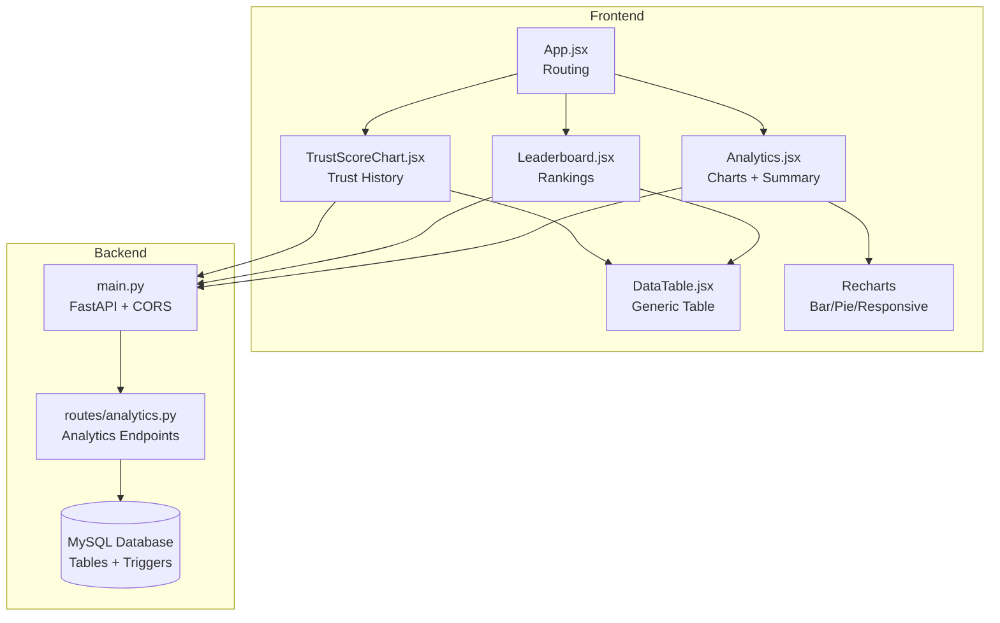
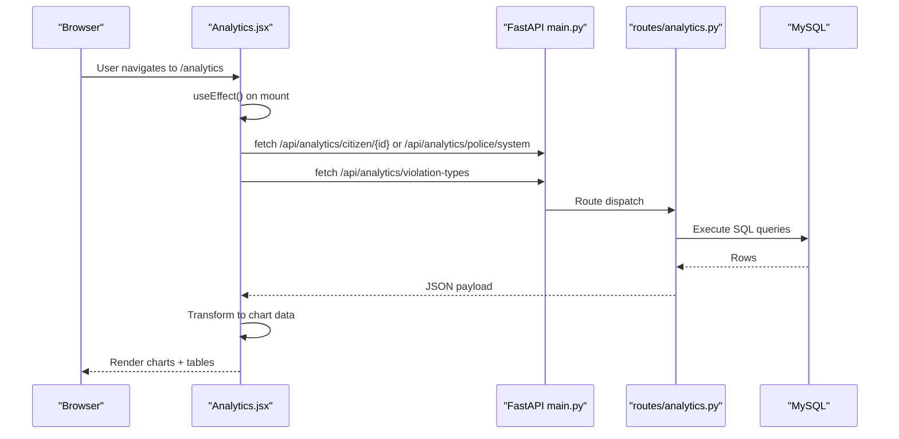
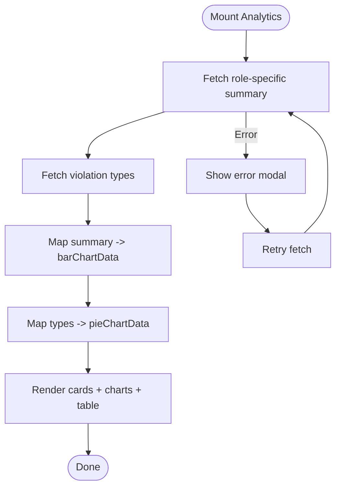
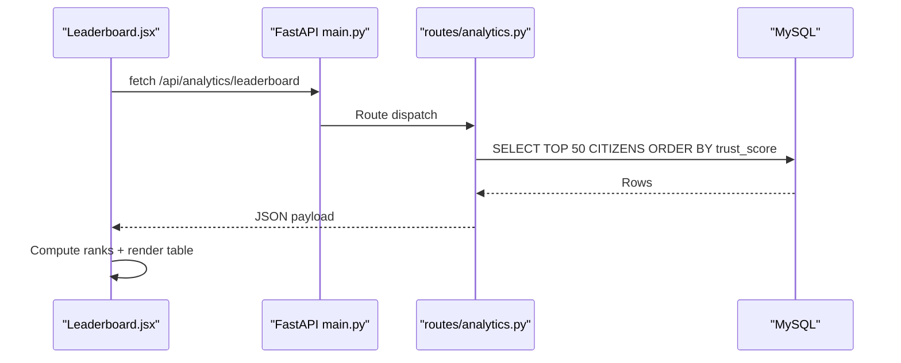
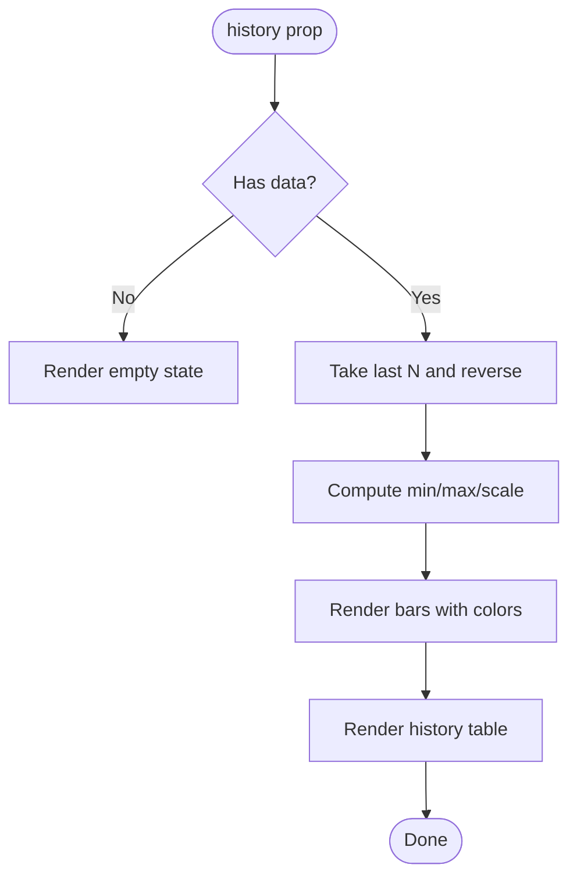
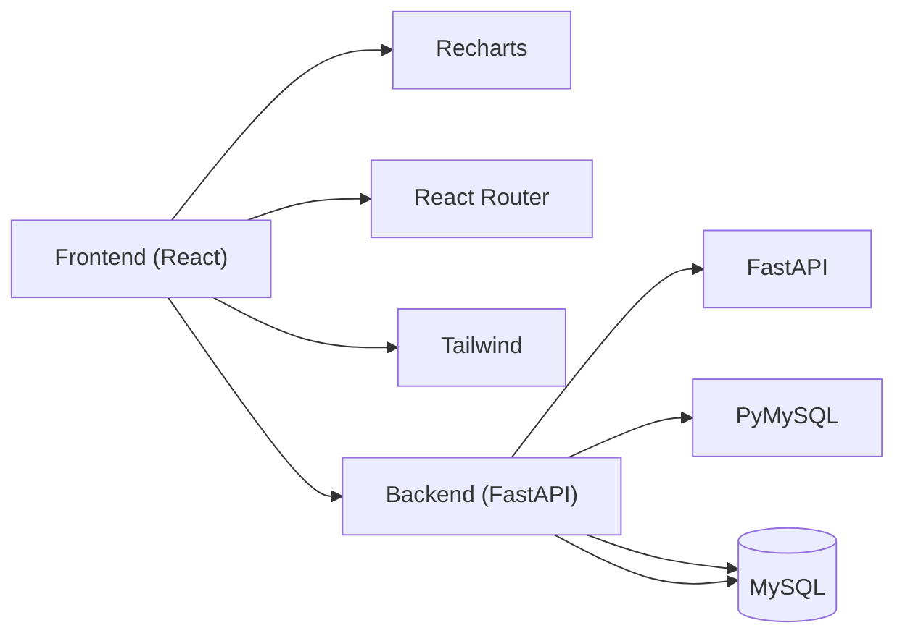

# Data Visualization

<cite>
**Referenced Files in This Document**
- [Analytics.jsx](file://frontend/src/pages/Analytics.jsx)
- [Leaderboard.jsx](file://frontend/src/pages/Leaderboard.jsx)
- [TrustScoreChart.jsx](file://frontend/src/components/TrustScoreChart.jsx)
- [DataTable.jsx](file://frontend/src/components/DataTable.jsx)
- [App.jsx](file://frontend/src/App.jsx)
- [analytics.py](file://server/routes/analytics.py)
- [main.py](file://server/main.py)
- [schema.sql](file://db/schema.sql)
- [marga_rakshak_triggers.sql](file://db/marga_rakshak_triggers.sql)
- [stored_procedure_process_report.sql](file://db/stored_procedure_process_report.sql)
- [package.json](file://frontend/package.json)
</cite>

## Table of Contents
1. [Introduction](#introduction)
2. [Project Structure](#project-structure)
3. [Core Components](#core-components)
4. [Architecture Overview](#architecture-overview)
5. [Detailed Component Analysis](#detailed-component-analysis)
6. [Dependency Analysis](#dependency-analysis)
7. [Performance Considerations](#performance-considerations)
8. [Troubleshooting Guide](#troubleshooting-guide)
9. [Conclusion](#conclusion)

## Introduction
This document explains the data visualization implementation for the Traffic Violation Management System. It covers how frontend React components render charts and tables, how data flows from backend endpoints to frontend components, and how database triggers and stored procedures influence the underlying datasets. It also documents chart configurations, data transformations, responsive design, accessibility, cross-browser compatibility, and error/loading states.

## Project Structure
The visualization system spans two layers:
- Frontend (React + Recharts): Renders analytics dashboards, leaderboards, and trust score histories.
- Backend (FastAPI + MySQL): Exposes REST endpoints that return real-time analytics data.

**Diagram sources**
- [App.jsx:133-245](file://frontend/src/App.jsx#L133-L245)
- [Analytics.jsx:1-271](file://frontend/src/pages/Analytics.jsx#L1-L271)
- [Leaderboard.jsx:1-191](file://frontend/src/pages/Leaderboard.jsx#L1-L191)
- [TrustScoreChart.jsx:1-126](file://frontend/src/components/TrustScoreChart.jsx#L1-L126)
- [DataTable.jsx:1-37](file://frontend/src/components/DataTable.jsx#L1-L37)
- [main.py:77-87](file://server/main.py#L77-L87)
- [analytics.py:36-526](file://server/routes/analytics.py#L36-L526)

**Section sources**
- [App.jsx:133-245](file://frontend/src/App.jsx#L133-L245)
- [main.py:77-87](file://server/main.py#L77-L87)

## Core Components
- Analytics dashboard with:
  - Summary cards
  - Bar chart for report status distribution
  - Pie chart for violation types
  - Violation type breakdown table
- Leaderboard page with:
  - Top 3 podium
  - Full rankings table
- Trust score history visualization:
  - Vertical bars with color-coded score bands
  - Inline table of history entries
- Generic data table component for reusable tabular rendering

**Section sources**
- [Analytics.jsx:117-264](file://frontend/src/pages/Analytics.jsx#L117-L264)
- [Leaderboard.jsx:79-187](file://frontend/src/pages/Leaderboard.jsx#L79-L187)
- [TrustScoreChart.jsx:1-126](file://frontend/src/components/TrustScoreChart.jsx#L1-L126)
- [DataTable.jsx:1-37](file://frontend/src/components/DataTable.jsx#L1-L37)

## Architecture Overview
The frontend fetches analytics data from backend endpoints, transforms it into chart-ready formats, and renders responsive visualizations. The backend aggregates counts and trends from normalized database tables and exposes them via typed endpoints.

**Diagram sources**
- [Analytics.jsx:19-57](file://frontend/src/pages/Analytics.jsx#L19-L57)
- [main.py:77-87](file://server/main.py#L77-L87)
- [analytics.py:36-526](file://server/routes/analytics.py#L36-L526)

## Detailed Component Analysis

### Analytics Dashboard (Charts and Summary)
- Role-aware data fetching:
  - Citizen views personal analytics under `/api/analytics/citizen/{id}`
  - Police/admin views system-wide analytics under `/api/analytics/police/system`
- Data preparation:
  - Summary card counts derived from aggregated totals
  - Bar chart data mapped from summary counts
  - Pie chart data built from violation type counts
- Rendering:
  - Recharts components: ResponsiveContainer, BarChart, Bar, XAxis, YAxis, CartesianGrid, Tooltip, Legend, PieChart, Pie, Cell
  - Tailwind-based layout with cards and grids
- Error and loading states:
  - Loading spinner while fetching
  - Error modal with retry button
- Accessibility and responsiveness:
  - Recharts tooltips and legends
  - ResponsiveContainer adapts to container width
  - Semantic headings and contrast-friendly colors

**Diagram sources**
- [Analytics.jsx:19-72](file://frontend/src/pages/Analytics.jsx#L19-L72)
- [Analytics.jsx:59-71](file://frontend/src/pages/Analytics.jsx#L59-L71)

**Section sources**
- [Analytics.jsx:1-271](file://frontend/src/pages/Analytics.jsx#L1-L271)
- [analytics.py:36-526](file://server/routes/analytics.py#L36-L526)

### Leaderboard Page
- Data source: `/api/analytics/leaderboard` returns top 50 citizens ordered by trust score and reward points
- Presentation:
  - Top 3 podium with special styling
  - Full table with ranks, names, trust scores, and reward points
  - Current user highlighted with a subtle border and badge
- Styling:
  - Rank badges with distinct colors per placement
  - Color-coded trust score text
  - Hover and animation effects for rows

**Diagram sources**
- [Leaderboard.jsx:18-32](file://frontend/src/pages/Leaderboard.jsx#L18-L32)
- [analytics.py:205-255](file://server/routes/analytics.py#L205-L255)

**Section sources**
- [Leaderboard.jsx:1-191](file://frontend/src/pages/Leaderboard.jsx#L1-L191)
- [analytics.py:205-255](file://server/routes/analytics.py#L205-L255)

### Trust Score History Visualization
- Input: history array of trust score changes with timestamps and metadata
- Transformation:
  - Slice and reverse to show most recent entries
  - Scale scores to bar heights
  - Color bands for score ranges
- Rendering:
  - Vertical bars with score labels
  - Y-axis range labels
  - Inline table of history entries with status and operation type badges

**Diagram sources**
- [TrustScoreChart.jsx:1-126](file://frontend/src/components/TrustScoreChart.jsx#L1-L126)

**Section sources**
- [TrustScoreChart.jsx:1-126](file://frontend/src/components/TrustScoreChart.jsx#L1-L126)

### Generic Data Table Component
- Purpose: Reusable table renderer with column configuration and optional cell renderers
- Behavior:
  - Empty state when no data
  - Iterates columns and rows to render cells
  - Supports custom renderers per column

**Section sources**
- [DataTable.jsx:1-37](file://frontend/src/components/DataTable.jsx#L1-L37)

### Backend Analytics Endpoints
- Summary endpoints:
  - `/api/analytics/summary`: General system metrics
  - `/api/analytics/police-summary`: Officer-focused metrics
  - `/api/analytics/citizen/{id}`: Personal analytics
  - `/api/analytics/police/system`: System-wide stats
- Specialized analytics:
  - `/api/analytics/violation-types`: Counts grouped by violation type
  - `/api/analytics/leaderboard`: Top 50 citizens by trust score
  - `/api/analytics/recent-activity`: Recent report activity
  - `/api/analytics/status-trend`: Daily status trend over 7 days
- Database integration:
  - Direct SQL queries against normalized tables
  - Aggregations and ordering performed in MySQL
  - Consistent JSON payloads with message and data fields

**Section sources**
- [analytics.py:36-526](file://server/routes/analytics.py#L36-L526)

### Data Transformation From Database to Chart-ready Formats
- Violation types:
  - Backend groups by violation_type and returns count
  - Frontend maps to name/value pairs for Recharts Pie
- Status distribution:
  - Backend aggregates counts per status
  - Frontend maps to name/count pairs for Recharts Bar
- Leaderboard:
  - Backend orders by trust_score and reward_points, limits to 50
  - Frontend adds computed rank field
- Trust score history:
  - Backend returns history rows
  - Frontend computes bar heights and colors

**Section sources**
- [analytics.py:398-436](file://server/routes/analytics.py#L398-L436)
- [Analytics.jsx:67-71](file://frontend/src/pages/Analytics.jsx#L67-L71)
- [Leaderboard.jsx:214-241](file://frontend/src/pages/Leaderboard.jsx#L214-L241)
- [TrustScoreChart.jsx:10-25](file://frontend/src/components/TrustScoreChart.jsx#L10-L25)

### Visualization Components by Data Type
- Trust score trends:
  - Custom vertical bar visualization with color-coded bands and inline table
- Violation type distributions:
  - Pie chart with labels and percentages
- Status trends:
  - Bar chart for counts per status category
- Leaderboard displays:
  - Podium for top 3 and full table for top 50

**Section sources**
- [TrustScoreChart.jsx:34-121](file://frontend/src/components/TrustScoreChart.jsx#L34-L121)
- [Analytics.jsx:194-234](file://frontend/src/pages/Analytics.jsx#L194-L234)
- [Leaderboard.jsx:79-187](file://frontend/src/pages/Leaderboard.jsx#L79-L187)

### Responsive Design, Accessibility, and Cross-Browser Compatibility
- Responsive design:
  - Tailwind grids adapt to mobile/tablet/desktop
  - Recharts ResponsiveContainer ensures charts resize with container
- Accessibility:
  - Semantic headings and tables
  - Tooltips and legends for Recharts
  - Sufficient color contrast and readable fonts
- Cross-browser compatibility:
  - Recharts and modern Tailwind utilities supported across major browsers
  - No browser-specific APIs used in visualization code

**Section sources**
- [Analytics.jsx:102-267](file://frontend/src/pages/Analytics.jsx#L102-L267)
- [Leaderboard.jsx:67-187](file://frontend/src/pages/Leaderboard.jsx#L67-L187)

### Examples of Chart Configuration, Data Formatting, Animation Effects, and Interactions
- Chart configuration:
  - BarChart with XAxis/YAxis, CartesianGrid, Tooltip, Legend, and Bar series
  - PieChart with labelLine, label formatter, and Cell coloring
- Data formatting:
  - Converting backend rows to chart data objects
  - Percentage computation for violation type table
- Animation effects:
  - Leaderboard rows with staggered fade-in animation
  - Hover effects on bars and table rows
- Interactions:
  - Clickable retry button on error state
  - Tooltips on charts for detailed values

**Section sources**
- [Analytics.jsx:196-234](file://frontend/src/pages/Analytics.jsx#L196-L234)
- [Leaderboard.jsx:137-173](file://frontend/src/pages/Leaderboard.jsx#L137-L173)

### Integration Between Frontend and Backend, Error Handling, and Loading States
- Integration:
  - Frontend routes to backend endpoints via fetch
  - Role-based routing: citizen vs police/admin
- Error handling:
  - Try/catch around fetch calls
  - Error modal with retry action
- Loading states:
  - Spinner during initial fetch
  - Conditional rendering based on loading/error flags

**Section sources**
- [Analytics.jsx:19-57](file://frontend/src/pages/Analytics.jsx#L19-L57)
- [Leaderboard.jsx:18-32](file://frontend/src/pages/Leaderboard.jsx#L18-L32)

## Dependency Analysis
- Frontend dependencies:
  - Recharts for statistical visualizations
  - React Router for navigation
  - Tailwind for responsive styling
- Backend dependencies:
  - FastAPI for routing and CORS
  - PyMySQL for database connectivity
  - MySQL for persistent data and triggers

**Diagram sources**
- [package.json:11-29](file://frontend/package.json#L11-L29)
- [main.py:5-26](file://server/main.py#L5-L26)
- [analytics.py:5-7](file://server/routes/analytics.py#L5-L7)

**Section sources**
- [package.json:11-29](file://frontend/package.json#L11-L29)
- [main.py:5-26](file://server/main.py#L5-L26)
- [analytics.py:5-7](file://server/routes/analytics.py#L5-L7)

## Performance Considerations
- Backend:
  - Use of aggregation queries and indexed columns reduces CPU overhead
  - Stored procedures and triggers encapsulate business logic close to data
- Frontend:
  - Recharts renders efficiently for moderate dataset sizes
  - Avoid unnecessary re-renders by passing memoized data props
- Recommendations:
  - Paginate leaderboard beyond 50 entries if growth continues
  - Debounce or throttle frequent polling if adding live updates

## Troubleshooting Guide
- CORS errors:
  - Ensure backend CORS allows frontend origin
- Database connectivity:
  - Verify DB credentials and availability
- Endpoint failures:
  - Check backend logs for SQL exceptions
- Frontend fetch failures:
  - Confirm API base URL and network reachability
- Empty or stale charts:
  - Verify backend returns data and frontend transforms match expected shape

**Section sources**
- [main.py:60-66](file://server/main.py#L60-L66)
- [analytics.py:24-34](file://server/routes/analytics.py#L24-L34)

## Conclusion
The visualization system integrates robust backend analytics endpoints with flexible frontend components. Recharts powers statistical charts, custom components render trust score histories and leaderboards, and generic tables support reusable data presentation. The system emphasizes responsive design, accessibility, and clear error/loading states, with data transformations handled cleanly between backend aggregations and frontend rendering.