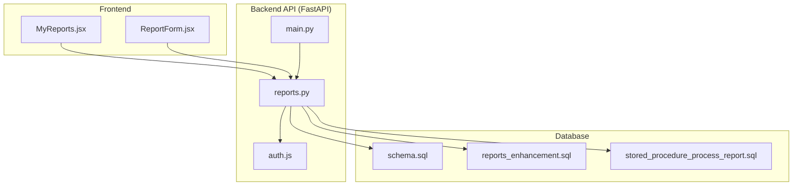
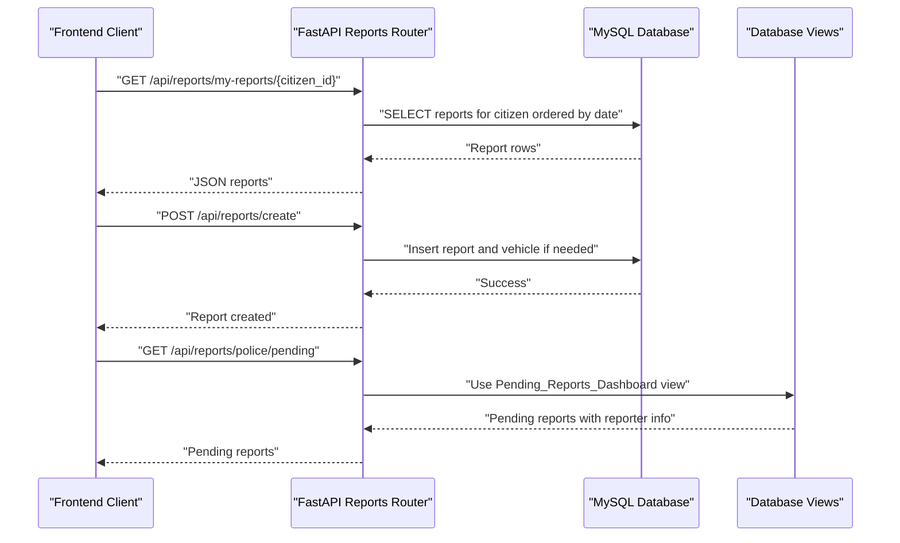
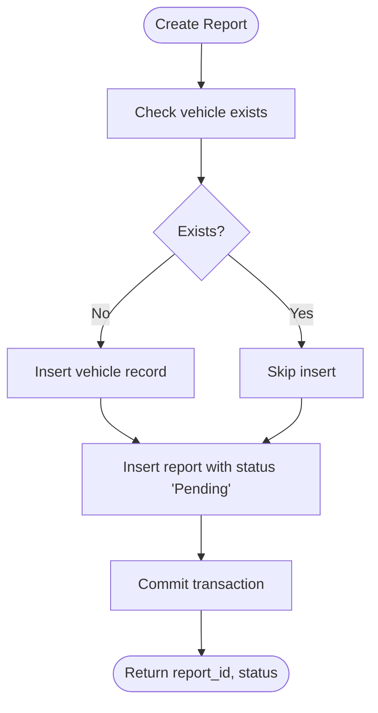
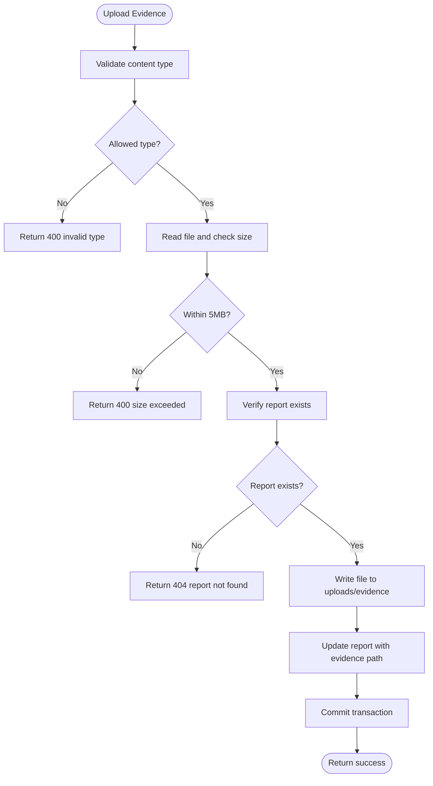
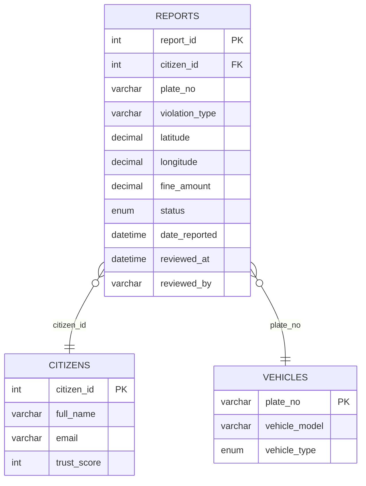
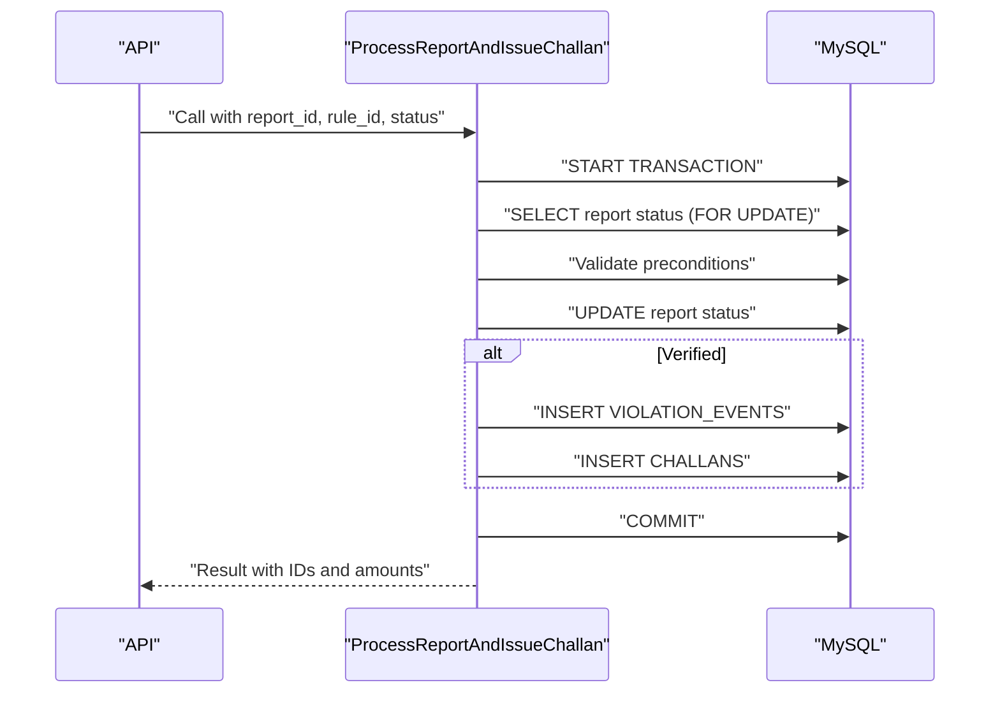
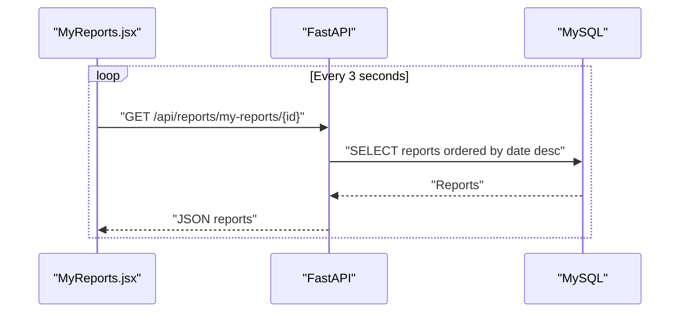
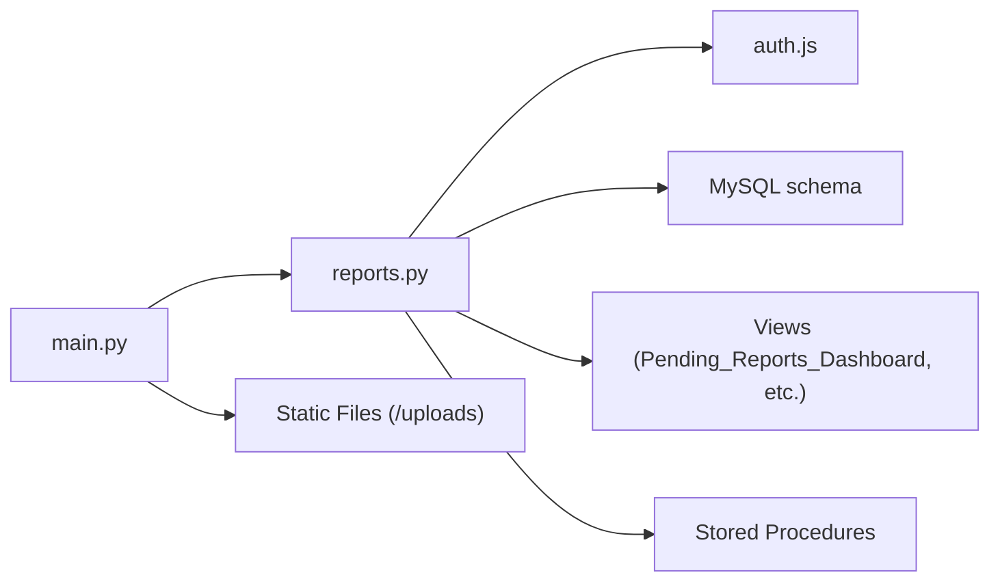

# Export and Reporting

<cite>
**Referenced Files in This Document**
- [reports.py](file://server/routes/reports.py)
- [main.py](file://server/main.py)
- [auth.js](file://backend/middleware/auth.js)
- [schema.sql](file://db/schema.sql)
- [reports_enhancement.sql](file://db/reports_enhancement.sql)
- [stored_procedure_process_report.sql](file://db/stored_procedure_process_report.sql)
- [MyReports.jsx](file://frontend/src/pages/MyReports.jsx)
- [ReportForm.jsx](file://frontend/src/components/ReportForm.jsx)
</cite>

## Table of Contents
1. [Introduction](#introduction)
2. [Project Structure](#project-structure)
3. [Core Components](#core-components)
4. [Architecture Overview](#architecture-overview)
5. [Detailed Component Analysis](#detailed-component-analysis)
6. [Dependency Analysis](#dependency-analysis)
7. [Performance Considerations](#performance-considerations)
8. [Troubleshooting Guide](#troubleshooting-guide)
9. [Conclusion](#conclusion)

## Introduction
This document provides comprehensive documentation for the export and reporting functionality of the Traffic Violation Management System. It covers report generation, data filtering, sorting, and pagination for large datasets, integration with database views and stored procedures, and the backend processing pipeline for report operations. It also outlines security considerations, access controls, and audit trail mechanisms that support report generation activities.

## Project Structure
The export and reporting system spans three layers:
- Backend API (FastAPI): Provides report lifecycle endpoints, evidence upload, and integration with database views and stored procedures.
- Database: Contains normalized tables, views, triggers, and stored procedures supporting report processing and auditability.
- Frontend: Renders citizen and police dashboards for report submission, review, and monitoring.

**Diagram sources**
- [main.py:77-86](file://server/main.py#L77-L86)
- [reports.py:147-223](file://server/routes/reports.py#L147-L223)
- [auth.js:5-20](file://backend/middleware/auth.js#L5-L20)
- [schema.sql:114-195](file://db/schema.sql#L114-L195)
- [reports_enhancement.sql:17-47](file://db/reports_enhancement.sql#L17-L47)
- [stored_procedure_process_report.sql:8-98](file://db/stored_procedure_process_report.sql#L8-L98)

**Section sources**
- [main.py:77-86](file://server/main.py#L77-L86)
- [reports.py:147-223](file://server/routes/reports.py#L147-L223)
- [auth.js:5-20](file://backend/middleware/auth.js#L5-L20)
- [schema.sql:114-195](file://db/schema.sql#L114-L195)
- [reports_enhancement.sql:17-47](file://db/reports_enhancement.sql#L17-L47)
- [stored_procedure_process_report.sql:8-98](file://db/stored_procedure_process_report.sql#L8-L98)

## Core Components
- Report lifecycle endpoints: create, fetch, update, delete, and police processing.
- Evidence upload with validation and storage.
- Integration with database views for dashboard feeds and summary statistics.
- Stored procedures for ACID-compliant report processing and challan issuance.
- Security middleware enforcing authentication and role-based access control.

Key capabilities:
- Real-time synchronization of report statuses via polling in the frontend.
- Auditability through triggers updating trust scores and maintaining temporal histories.
- Scalable data access via views and indexes for large datasets.

**Section sources**
- [reports.py:147-223](file://server/routes/reports.py#L147-L223)
- [reports.py:225-272](file://server/routes/reports.py#L225-L272)
- [reports.py:274-355](file://server/routes/reports.py#L274-L355)
- [reports.py:357-409](file://server/routes/reports.py#L357-L409)
- [reports.py:411-460](file://server/routes/reports.py#L411-L460)
- [reports.py:462-511](file://server/routes/reports.py#L462-L511)
- [reports.py:513-563](file://server/routes/reports.py#L513-L563)
- [schema.sql:764-820](file://db/schema.sql#L764-L820)
- [stored_procedure_process_report.sql:8-98](file://db/stored_procedure_process_report.sql#L8-L98)

## Architecture Overview
The system follows a layered architecture:
- Presentation: React frontend components for citizens and police.
- API: FastAPI routes implementing report operations and evidence management.
- Persistence: MySQL with normalized tables, views, triggers, and stored procedures.
- Security: JWT-based middleware enforcing authentication and role checks.

**Diagram sources**
- [reports.py:225-272](file://server/routes/reports.py#L225-L272)
- [reports.py:147-223](file://server/routes/reports.py#L147-L223)
- [reports.py:411-460](file://server/routes/reports.py#L411-L460)
- [schema.sql:764-780](file://db/schema.sql#L764-L780)

## Detailed Component Analysis

### Report Lifecycle Endpoints
Endpoints manage the complete lifecycle of a traffic violation report:
- Create report: Validates vehicle existence, inserts report with status Pending, and returns report metadata.
- Fetch citizen reports: Returns paginated-like results ordered by date descending.
- Update report: Allows edits only when status is Pending.
- Delete report: Supports deletion only when status is Pending.
- Police review: Updates status to Verified or Rejected; triggers handle trust score adjustments.

**Diagram sources**
- [reports.py:147-223](file://server/routes/reports.py#L147-L223)

**Section sources**
- [reports.py:147-223](file://server/routes/reports.py#L147-L223)
- [reports.py:225-272](file://server/routes/reports.py#L225-L272)
- [reports.py:274-355](file://server/routes/reports.py#L274-L355)
- [reports.py:357-409](file://server/routes/reports.py#L357-L409)
- [reports.py:411-460](file://server/routes/reports.py#L411-L460)
- [reports.py:462-511](file://server/routes/reports.py#L462-L511)
- [reports.py:513-563](file://server/routes/reports.py#L513-L563)

### Evidence Upload and Storage
Evidence photos are validated by type and size, saved to a controlled upload directory, and associated with a report via a URL path stored in the database.

**Diagram sources**
- [reports.py:50-121](file://server/routes/reports.py#L50-L121)

**Section sources**
- [reports.py:50-121](file://server/routes/reports.py#L50-L121)

### Database Views and Indexes for Reporting
Views consolidate frequently accessed report data for dashboards and summaries:
- Pending_Reports_Dashboard: Lists pending reports with reporter details.
- Citizen_Challan_Summary: Summarizes challans with rule and officer information.
- Officer_Performance_View: Aggregates verification and revenue metrics per officer.
- Citizen_Trust_History: Temporal view of trust score changes.

Indexes on REPORTS improve query performance for filtering and sorting:
- violation_type, latitude/longitude, fine_amount.

**Diagram sources**
- [schema.sql:114-195](file://db/schema.sql#L114-L195)
- [reports_enhancement.sql:17-47](file://db/reports_enhancement.sql#L17-L47)

**Section sources**
- [schema.sql:764-820](file://db/schema.sql#L764-L820)
- [reports_enhancement.sql:17-47](file://db/reports_enhancement.sql#L17-L47)

### Stored Procedures for Report Processing
Stored procedures encapsulate ACID-compliant operations:
- ProcessReportAndIssueChallan: Validates report state, updates status, and optionally creates violation events and challans.
- sp_issue_challan: Safe challan generation with transaction rollback on errors.
- sp_reject_report: Updates report status to Rejected with a reason.
- sp_flag_overdue_challans: Cursor-based procedure to flag overdue challans and penalize trust scores.

**Diagram sources**
- [stored_procedure_process_report.sql:8-98](file://db/stored_procedure_process_report.sql#L8-L98)

**Section sources**
- [stored_procedure_process_report.sql:8-98](file://db/stored_procedure_process_report.sql#L8-L98)

### Frontend Integration and Real-Time Monitoring
The frontend components:
- MyReports.jsx polls for updates to reflect police verification or rejection in near real-time.
- ReportForm.jsx validates form inputs, captures GPS coordinates, and enforces image constraints before submission.

**Diagram sources**
- [MyReports.jsx:13-44](file://frontend/src/pages/MyReports.jsx#L13-L44)

**Section sources**
- [MyReports.jsx:13-44](file://frontend/src/pages/MyReports.jsx#L13-L44)
- [ReportForm.jsx:30-85](file://frontend/src/components/ReportForm.jsx#L30-L85)

## Dependency Analysis
- API depends on database connectivity and static file serving for evidence images.
- Reports router integrates with authentication middleware and database views.
- Database schema defines referential integrity and indexes for performance.
- Stored procedures enforce business rules and maintain auditability.

**Diagram sources**
- [reports.py:147-223](file://server/routes/reports.py#L147-L223)
- [auth.js:5-20](file://backend/middleware/auth.js#L5-L20)
- [schema.sql:764-820](file://db/schema.sql#L764-L820)
- [stored_procedure_process_report.sql:8-98](file://db/stored_procedure_process_report.sql#L8-L98)
- [main.py:69-72](file://server/main.py#L69-L72)

**Section sources**
- [reports.py:147-223](file://server/routes/reports.py#L147-L223)
- [auth.js:5-20](file://backend/middleware/auth.js#L5-L20)
- [schema.sql:764-820](file://db/schema.sql#L764-L820)
- [stored_procedure_process_report.sql:8-98](file://db/stored_procedure_process_report.sql#L8-L98)
- [main.py:69-72](file://server/main.py#L69-L72)

## Performance Considerations
- Use database views for dashboard queries to reduce join complexity and improve response times.
- Leverage indexes on REPORTS (violation_type, latitude/longitude, fine_amount) for filtering and sorting.
- Apply pagination strategies at the API layer for large datasets (e.g., limit and offset parameters).
- Batch operations: Group related updates (e.g., multiple report status changes) within transactions to minimize round trips.
- Asynchronous processing: Offload heavy export tasks (CSV/PDF generation) to background jobs to avoid blocking API requests.

[No sources needed since this section provides general guidance]

## Troubleshooting Guide
Common issues and resolutions:
- Authentication failures: Verify JWT token presence and validity; ensure roles match required access.
- Report not found: Confirm report_id exists and belongs to the requesting user (for citizen endpoints).
- File upload errors: Validate content type (JPEG/PNG) and size (<5MB); check upload directory permissions.
- Transaction rollbacks: Stored procedures and API endpoints use explicit rollback on exceptions; inspect error messages for details.
- Audit trail discrepancies: Trust score updates and temporal histories are managed by triggers; verify trigger execution and view definitions.

**Section sources**
- [auth.js:5-20](file://backend/middleware/auth.js#L5-L20)
- [reports.py:50-121](file://server/routes/reports.py#L50-L121)
- [reports.py:462-511](file://server/routes/reports.py#L462-L511)

## Conclusion
The export and reporting system combines robust backend APIs, secure access controls, and database-driven views and stored procedures to support scalable report lifecycle management. By leveraging views, indexes, and stored procedures, the system ensures performance, auditability, and compliance. The frontend enables real-time monitoring and intuitive report submission and review experiences. Extending the system to include CSV/PDF exports and background job processing would further enhance scalability and usability for large-scale deployments.