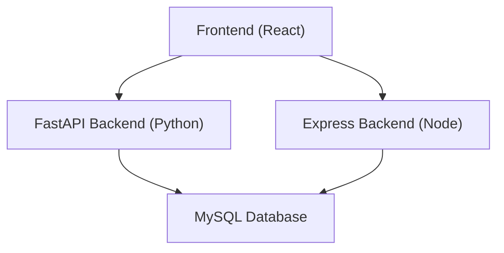
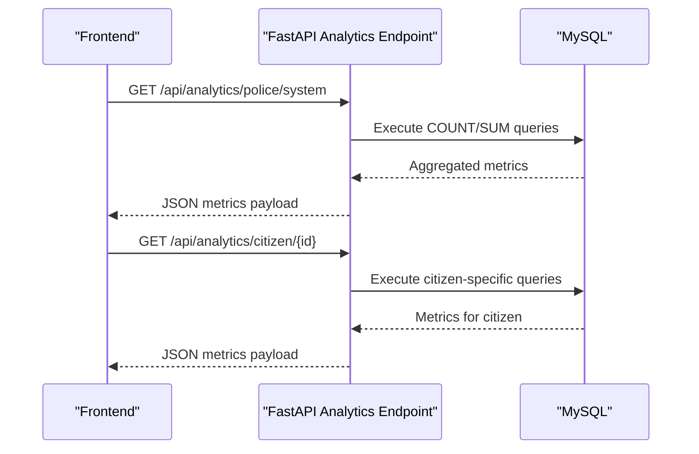
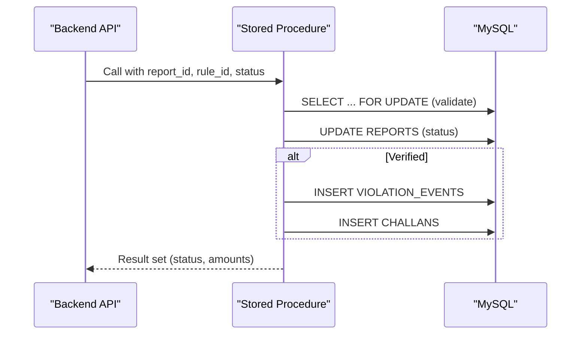
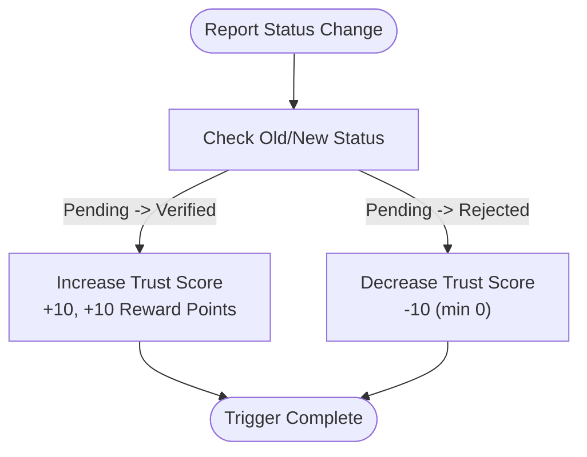
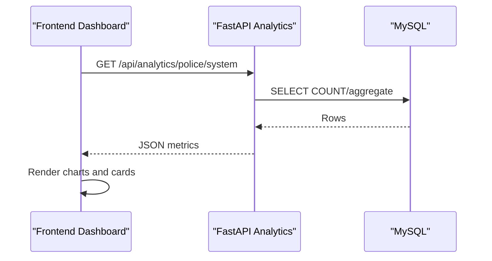
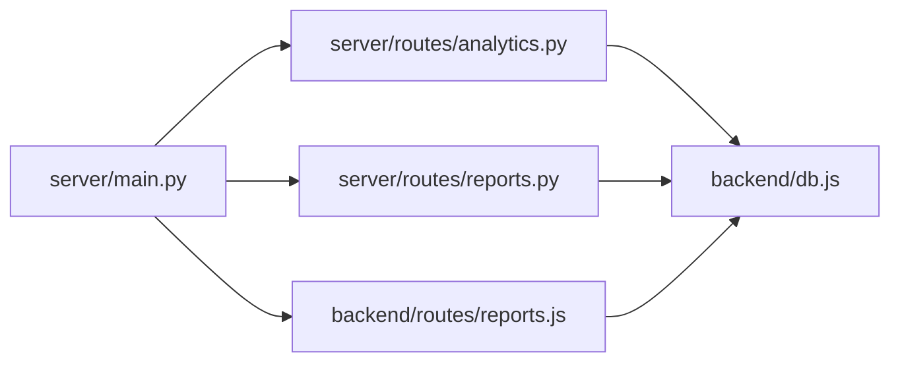

# Performance Metrics

<cite>
**Referenced Files in This Document**
- [schema.sql](file://db/schema.sql)
- [reports_enhancement.sql](file://db/reports_enhancement.sql)
- [stored_procedure_process_report.sql](file://db/stored_procedure_process_report.sql)
- [database_triggers.sql](file://db/database_triggers.sql)
- [marga_rakshak_triggers.sql](file://db/marga_rakshak_triggers.sql)
- [analytics.py](file://server/routes/analytics.py)
- [reports.py](file://server/routes/reports.py)
- [main.py](file://server/main.py)
- [db.js](file://backend/db.js)
- [reports.js](file://backend/routes/reports.js)
- [Analytics.jsx](file://frontend/src/pages/Analytics.jsx)
- [PoliceCommand.jsx](file://frontend/src/pages/PoliceCommand.jsx)
</cite>

## Table of Contents
1. [Introduction](#introduction)
2. [Project Structure](#project-structure)
3. [Core Components](#core-components)
4. [Architecture Overview](#architecture-overview)
5. [Detailed Component Analysis](#detailed-component-analysis)
6. [Dependency Analysis](#dependency-analysis)
7. [Performance Considerations](#performance-considerations)
8. [Troubleshooting Guide](#troubleshooting-guide)
9. [Conclusion](#conclusion)
10. [Appendices](#appendices)

## Introduction
This document explains the performance metrics system for the Traffic Violation Management System. It covers how key performance indicators are calculated and aggregated, including report processing rates, verification efficiency, revenue collection metrics, and system utilization statistics. It documents the database queries, indexing strategies, and stored procedures used for metrics computation, and describes how API endpoints expose these metrics to the frontend. It also outlines the real-time nature of metrics updates, the role of triggers and scheduled events, and optimization techniques.

## Project Structure
The metrics system spans:
- Database schema and views for pre-aggregated and derived metrics
- Stored procedures for transactional processing and revenue updates
- Backend analytics endpoints that query the database and return summaries
- Frontend dashboards that render metrics in real time

**Diagram sources**
- [main.py:77-86](file://server/main.py#L77-L86)
- [analytics.py:36-125](file://server/routes/analytics.py#L36-L125)
- [reports.js:8-31](file://backend/routes/reports.js#L8-L31)
- [db.js:1-26](file://backend/db.js#L1-L26)

**Section sources**
- [main.py:77-86](file://server/main.py#L77-L86)
- [analytics.py:36-125](file://server/routes/analytics.py#L36-L125)
- [reports.js:8-31](file://backend/routes/reports.js#L8-L31)
- [db.js:1-26](file://backend/db.js#L1-L26)

## Core Components
- Database schema defines core entities and indexes for efficient querying.
- Views encapsulate frequently accessed aggregations (e.g., officer performance).
- Stored procedures centralize transactional logic for report processing and challan issuance.
- Analytics endpoints compute system-wide and role-specific metrics via SQL.
- Triggers and scheduled events maintain trust scores and overdue penalties in real time.
- Frontend dashboards consume metrics via REST endpoints.

**Section sources**
- [schema.sql:114-195](file://db/schema.sql#L114-L195)
- [schema.sql:807-820](file://db/schema.sql#L807-L820)
- [stored_procedure_process_report.sql:8-98](file://db/stored_procedure_process_report.sql#L8-L98)
- [analytics.py:36-125](file://server/routes/analytics.py#L36-L125)
- [database_triggers.sql:10-35](file://db/database_triggers.sql#L10-L35)
- [marga_rakshak_triggers.sql:16-45](file://db/marga_rakshak_triggers.sql#L16-L45)

## Architecture Overview
The metrics pipeline integrates frontend dashboards, backend APIs, and database logic:

**Diagram sources**
- [analytics.py:332-396](file://server/routes/analytics.py#L332-L396)
- [analytics.py:257-330](file://server/routes/analytics.py#L257-L330)

## Detailed Component Analysis

### Metrics Categories and Calculations
- System-wide statistics
  - Total reports, pending, verified, rejected, total challans, paid/unpaid, total revenue, total citizens, total vehicles.
  - Computed via COUNT and SUM queries grouped by status or payment status.
- Citizen performance tracking
  - Personal totals: total reports, pending, verified, rejected, trust score.
  - Role-specific endpoint returns citizen-centric metrics.
- Police officer metrics
  - Officer performance view aggregates verified/rejected counts, challans issued, and revenue collected per officer.
- Administrative KPIs
  - System analytics endpoint provides totals for reports, statuses, citizens, and officers.

Examples of metric calculations:
- Revenue collected: SUM of paid challans.
- Verification efficiency: Verified / (Pending + Verified + Rejected).
- Report processing rate: New Verified/Rejected per time window (computed client-side from daily trends).
- System utilization: Counts of citizens, vehicles, challans, and overdue status.

**Section sources**
- [analytics.py:36-125](file://server/routes/analytics.py#L36-L125)
- [analytics.py:127-190](file://server/routes/analytics.py#L127-L190)
- [analytics.py:257-330](file://server/routes/analytics.py#L257-L330)
- [analytics.py:332-396](file://server/routes/analytics.py#L332-L396)
- [schema.sql:807-820](file://db/schema.sql#L807-L820)

### Database Queries and Indexing Strategies
- Aggregation queries
  - COUNT and SUM on REPORTS and CHALLANS tables filtered by status and payment_status.
  - GROUP BY date and status for daily trends.
- Indexes
  - REPORTS: status, citizen_id, date_reported, violation_type, latitude/longitude, fine_amount.
  - CHALLANS: payment_status, citizen_id, due_date, issue_date.
  - CITIZENS: email, account_status, trust_score.
  - POLICE_OFFICERS: station_code.
  - VEHICLES: vehicle_type.
- Optimized patterns
  - Use selective filters with indexed columns.
  - Prefer covering indexes for frequent GROUP BY and ORDER BY clauses.
  - Avoid SELECT *; request only needed columns.

**Section sources**
- [schema.sql:133-195](file://db/schema.sql#L133-L195)
- [reports_enhancement.sql:44-47](file://db/reports_enhancement.sql#L44-L47)
- [analytics.py:46-79](file://server/routes/analytics.py#L46-L79)
- [analytics.py:137-170](file://server/routes/analytics.py#L137-L170)

### Stored Procedures and Transactional Integrity
- ProcessReportAndIssueChallan
  - Validates report status, updates to Verified/Rejected, inserts violation events and challans when applicable, and returns structured results.
  - Uses row-level locks and ACID-compliant transactions.
- sp_issue_challan, sp_pay_challan, sp_reject_report
  - Encapsulate core operations with error handling and row-level locks.
- sp_flag_overdue_challans
  - Scheduled job that iterates unpaid challans past due date, applies penalties, logs overdue entries, and adjusts trust scores.

**Diagram sources**
- [stored_procedure_process_report.sql:8-98](file://db/stored_procedure_process_report.sql#L8-L98)

**Section sources**
- [stored_procedure_process_report.sql:8-98](file://db/stored_procedure_process_report.sql#L8-L98)
- [schema.sql:440-686](file://db/schema.sql#L440-L686)
- [schema.sql:927-936](file://db/schema.sql#L927-L936)

### Triggers and Real-Time Updates
- Auto_Reward_System and Auto_Penalty_System
  - Automatically adjust citizen trust scores and reward points upon report status changes.
- Additional triggers in marga_rakshak_triggers.sql
  - Extend reward/penalty logic and increment submission counters.
- Scheduled event
  - Daily overdue check invokes sp_flag_overdue_challans to flag overdue challans and penalize trust scores.

**Diagram sources**
- [database_triggers.sql:10-35](file://db/database_triggers.sql#L10-L35)
- [marga_rakshak_triggers.sql:16-45](file://db/marga_rakshak_triggers.sql#L16-L45)

**Section sources**
- [database_triggers.sql:10-35](file://db/database_triggers.sql#L10-L35)
- [marga_rakshak_triggers.sql:16-45](file://db/marga_rakshak_triggers.sql#L16-L45)
- [schema.sql:927-936](file://db/schema.sql#L927-L936)

### API Endpoints and Frontend Integration
- FastAPI analytics endpoints
  - /api/analytics/summary, /api/analytics/police-summary, /api/analytics/police/system, /api/analytics/citizen/{id}, /api/analytics/violation-types, /api/analytics/status-trend.
- Express routes
  - /api/reports (submit, fetch citizen reports).
- Frontend dashboards
  - Analytics.jsx and PoliceCommand.jsx fetch metrics and render charts and cards.

**Diagram sources**
- [analytics.py:332-396](file://server/routes/analytics.py#L332-L396)
- [Analytics.jsx:34-40](file://frontend/src/pages/Analytics.jsx#L34-L40)

**Section sources**
- [analytics.py:36-125](file://server/routes/analytics.py#L36-L125)
- [analytics.py:127-190](file://server/routes/analytics.py#L127-L190)
- [analytics.py:257-330](file://server/routes/analytics.py#L257-L330)
- [analytics.py:332-396](file://server/routes/analytics.py#L332-L396)
- [reports.js:8-31](file://backend/routes/reports.js#L8-L31)
- [Analytics.jsx:19-57](file://frontend/src/pages/Analytics.jsx#L19-L57)
- [PoliceCommand.jsx:42-48](file://frontend/src/pages/PoliceCommand.jsx#L42-L48)

## Dependency Analysis
- Backend FastAPI app mounts analytics and reports routers.
- Analytics endpoints depend on database connectivity and rely on schema-defined tables and views.
- Reports endpoints depend on database connectivity and schema for report lifecycle.
- Frontend dashboards depend on backend endpoints for metrics rendering.

**Diagram sources**
- [main.py:77-86](file://server/main.py#L77-L86)
- [analytics.py:24-34](file://server/routes/analytics.py#L24-L34)
- [reports.py:38-48](file://server/routes/reports.py#L38-L48)
- [reports.js:1-5](file://backend/routes/reports.js#L1-L5)
- [db.js:1-26](file://backend/db.js#L1-L26)

**Section sources**
- [main.py:77-86](file://server/main.py#L77-L86)
- [analytics.py:24-34](file://server/routes/analytics.py#L24-L34)
- [reports.py:38-48](file://server/routes/reports.py#L38-L48)
- [reports.js:1-5](file://backend/routes/reports.js#L1-L5)
- [db.js:1-26](file://backend/db.js#L1-L26)

## Performance Considerations
- Use indexed columns in WHERE clauses for report status and payment status filtering.
- Prefer covering indexes for GROUP BY and ORDER BY on date_reported and issue_date.
- Minimize result sets by selecting only required columns.
- Batch reads for dashboard summaries to reduce round trips.
- Connection pooling and timeouts configured in backend database connectors.
- Triggers and scheduled events offload real-time updates from API handlers.

[No sources needed since this section provides general guidance]

## Troubleshooting Guide
- Connection failures
  - Verify database credentials and availability; backend pools log connection status.
- Missing or stale metrics
  - Confirm triggers executed after status changes; review scheduled event execution.
- Slow dashboard loads
  - Ensure appropriate indexes exist; validate query plans; consider pagination for large datasets.
- Incorrect totals
  - Validate ENUM values and status transitions; confirm stored procedures executed successfully.

**Section sources**
- [db.js:15-23](file://backend/db.js#L15-L23)
- [database_triggers.sql:43-47](file://db/database_triggers.sql#L43-L47)
- [schema.sql:927-936](file://db/schema.sql#L927-L936)

## Conclusion
The performance metrics system leverages a combination of database views, stored procedures, triggers, and scheduled events to compute and maintain real-time KPIs. Backend analytics endpoints expose these metrics to frontend dashboards, enabling system-wide, citizen, officer, and administrative insights. Proper indexing and transactional procedures ensure correctness and performance.

[No sources needed since this section summarizes without analyzing specific files]

## Appendices

### Example Metric Definitions and Formulas
- Report processing rate (per day)
  - New Verified + New Rejected per calendar day.
- Verification efficiency
  - Verified / (Pending + Verified + Rejected).
- Revenue collection metrics
  - Total challans issued, total paid, total unpaid, total revenue (sum of paid challans).
- System utilization
  - Total citizens, total vehicles, total challans, overdue challans.

[No sources needed since this section provides general definitions]