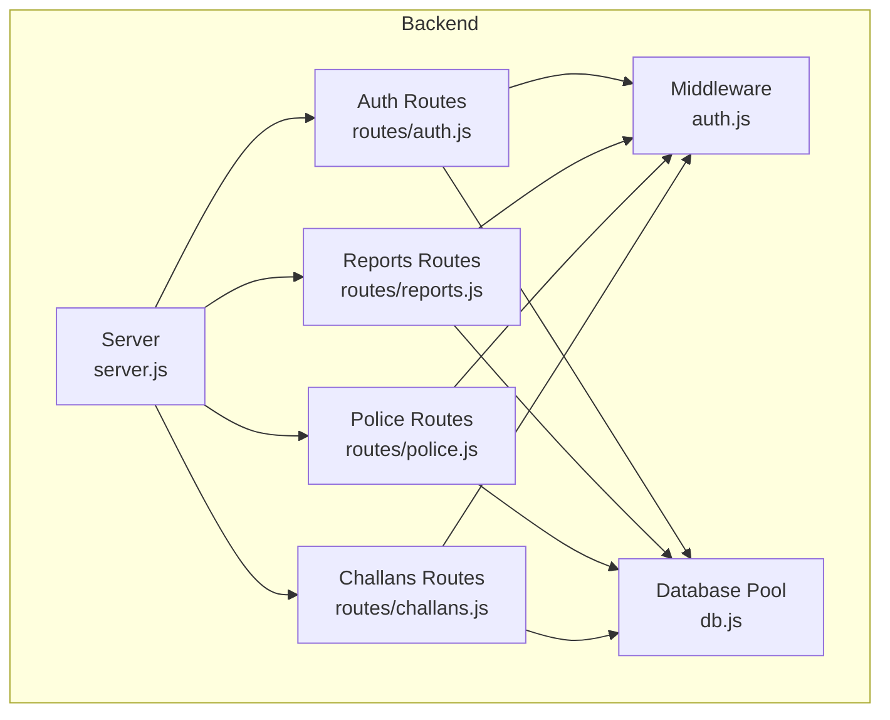
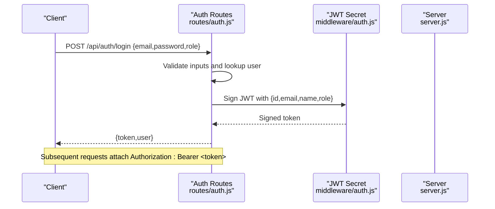
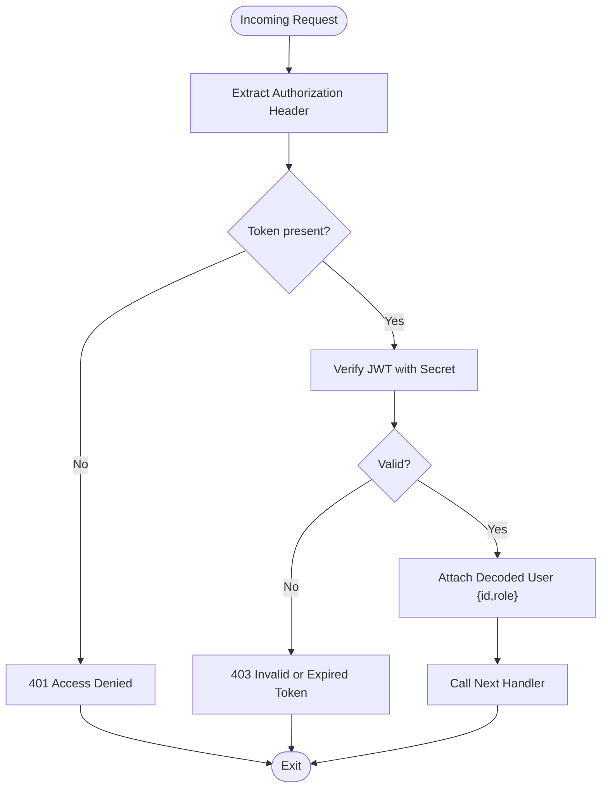
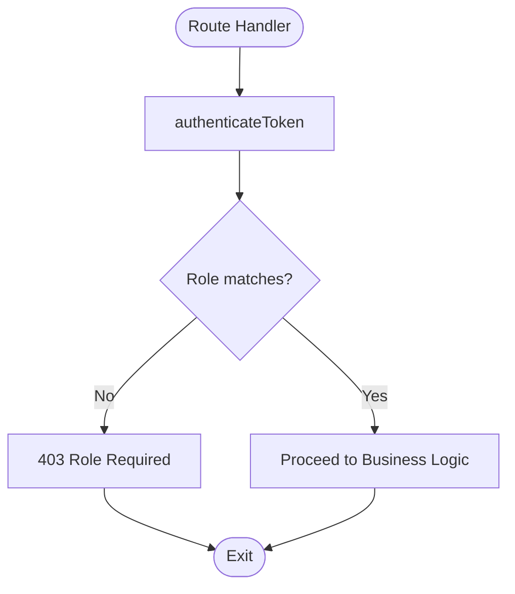
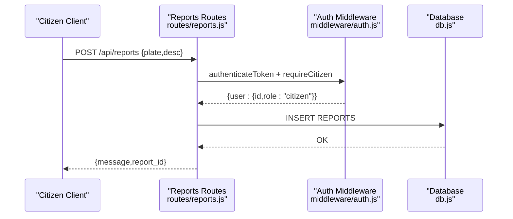
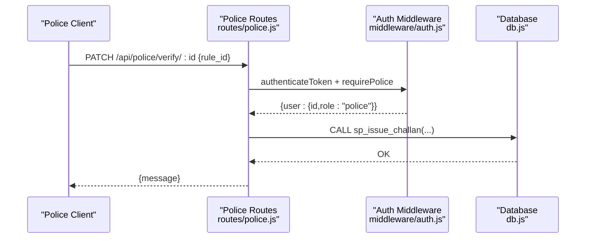
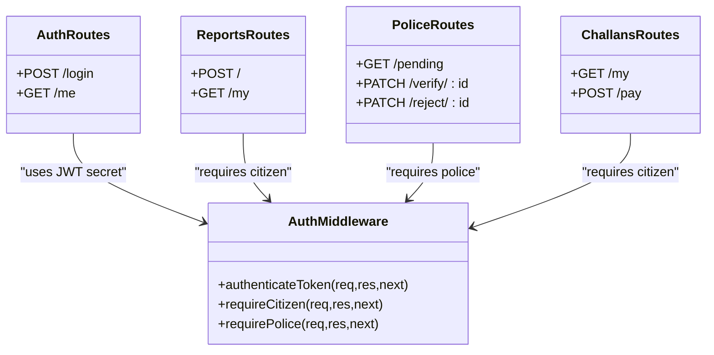
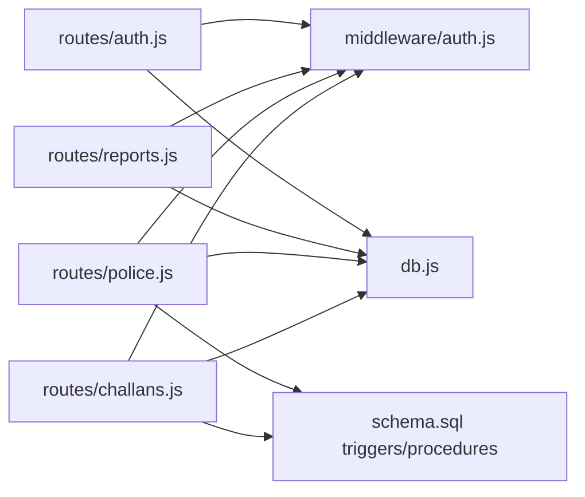

# Access Control and Authorization

<cite>
**Referenced Files in This Document**
- [auth.js](file://backend/middleware/auth.js)
- [auth.js](file://backend/routes/auth.js)
- [server.js](file://backend/server.js)
- [challans.js](file://backend/routes/challans.js)
- [police.js](file://backend/routes/police.js)
- [reports.js](file://backend/routes/reports.js)
- [db.js](file://backend/db.js)
- [schema.sql](file://db/schema.sql)
- [seed_demo_accounts.sql](file://db/seed_demo_accounts.sql)
</cite>

## Table of Contents
1. [Introduction](#introduction)
2. [Project Structure](#project-structure)
3. [Core Components](#core-components)
4. [Architecture Overview](#architecture-overview)
5. [Detailed Component Analysis](#detailed-component-analysis)
6. [Dependency Analysis](#dependency-analysis)
7. [Performance Considerations](#performance-considerations)
8. [Troubleshooting Guide](#troubleshooting-guide)
9. [Conclusion](#conclusion)
10. [Appendices](#appendices)

## Introduction
This document explains the role-based access control (RBAC) system implemented in the backend API. It covers the three-tier access model for citizen, police officer, and admin roles, the authorization middleware, integration between authentication tokens and authorization logic, endpoint protection via role-specific middleware, and fallback mechanisms for unauthorized access attempts. It also provides guidance on implementing access control in new routes, extending to a custom permission system, and enabling dynamic authorization based on user attributes. Security considerations such as privilege escalation prevention, session hijacking protection, and audit trail implementation are addressed.

## Project Structure
The RBAC system spans middleware, route handlers, and database schema. Authentication and authorization middleware are centralized, while routes apply role checks per endpoint. The database enforces integrity and supports audit trails.

**Diagram sources**
- [server.js:1-42](file://backend/server.js#L1-L42)
- [auth.js:1-117](file://backend/routes/auth.js#L1-L117)
- [reports.js:1-54](file://backend/routes/reports.js#L1-L54)
- [police.js:1-109](file://backend/routes/police.js#L1-L109)
- [challans.js:1-101](file://backend/routes/challans.js#L1-L101)
- [auth.js:1-37](file://backend/middleware/auth.js#L1-L37)
- [db.js:1-26](file://backend/db.js#L1-L26)

**Section sources**
- [server.js:1-42](file://backend/server.js#L1-L42)
- [auth.js:1-117](file://backend/routes/auth.js#L1-L117)
- [reports.js:1-54](file://backend/routes/reports.js#L1-L54)
- [police.js:1-109](file://backend/routes/police.js#L1-L109)
- [challans.js:1-101](file://backend/routes/challans.js#L1-L101)
- [auth.js:1-37](file://backend/middleware/auth.js#L1-L37)
- [db.js:1-26](file://backend/db.js#L1-L26)

## Core Components
- Authentication middleware validates bearer tokens and attaches user identity to requests.
- Role-based authorization middleware enforces access tiers (citizen, police) at the route level.
- Route handlers enforce both authentication and role checks and implement row-level access controls where applicable.
- Database schema defines user tables, triggers for audit and trust scoring, and stored procedures for safe operations.

Key implementation references:
- Authentication and role guards: [auth.js:1-37](file://backend/middleware/auth.js#L1-L37)
- Token issuance and user retrieval: [auth.js:1-117](file://backend/routes/auth.js#L1-L117)
- Endpoint protection examples:
  - Citizen-only endpoints: [reports.js:1-54](file://backend/routes/reports.js#L1-L54), [challans.js:1-101](file://backend/routes/challans.js#L1-L101)
  - Police-only endpoints: [police.js:1-109](file://backend/routes/police.js#L1-L109)
- Database schema and triggers: [schema.sql:1-942](file://db/schema.sql#L1-L942)

**Section sources**
- [auth.js:1-37](file://backend/middleware/auth.js#L1-L37)
- [auth.js:1-117](file://backend/routes/auth.js#L1-L117)
- [reports.js:1-54](file://backend/routes/reports.js#L1-L54)
- [challans.js:1-101](file://backend/routes/challans.js#L1-L101)
- [police.js:1-109](file://backend/routes/police.js#L1-L109)
- [schema.sql:1-942](file://db/schema.sql#L1-L942)

## Architecture Overview
The RBAC architecture separates concerns:
- Authentication: route handlers validate credentials and issue signed JWTs containing role and identity claims.
- Authorization: middleware verifies tokens and enforces role-based access.
- Endpoint protection: routes chain middleware to restrict access to intended roles.
- Data integrity and audit: database triggers and stored procedures protect against race conditions and maintain audit trails.

**Diagram sources**
- [auth.js:1-117](file://backend/routes/auth.js#L1-L117)
- [auth.js:1-37](file://backend/middleware/auth.js#L1-L37)
- [server.js:1-42](file://backend/server.js#L1-L42)

**Section sources**
- [auth.js:1-117](file://backend/routes/auth.js#L1-L117)
- [auth.js:1-37](file://backend/middleware/auth.js#L1-L37)
- [server.js:1-42](file://backend/server.js#L1-L42)

## Detailed Component Analysis

### Authentication and Token Lifecycle
- Token verification middleware extracts the bearer token from the Authorization header, verifies it against the shared secret, and attaches the decoded payload (including role) to the request.
- Login route authenticates users by role, selecting the appropriate table, verifying password hashes, and issuing a signed JWT with a finite TTL.
- The user retrieval endpoint validates the token and returns user details based on role.

**Diagram sources**
- [auth.js:1-37](file://backend/middleware/auth.js#L1-L37)
- [auth.js:1-117](file://backend/routes/auth.js#L1-L117)

**Section sources**
- [auth.js:1-37](file://backend/middleware/auth.js#L1-L37)
- [auth.js:1-117](file://backend/routes/auth.js#L1-L117)

### Role-Based Authorization Middleware
- Role guards enforce access by comparing the decoded role claim against expected values.
- Unauthorized access attempts receive a 403 response with a descriptive message.

**Diagram sources**
- [auth.js:1-37](file://backend/middleware/auth.js#L1-L37)

**Section sources**
- [auth.js:1-37](file://backend/middleware/auth.js#L1-L37)

### Endpoint Protection Examples

#### Citizen-Only Endpoints
- Reports submission and retrieval endpoints require authentication plus the citizen role.
- Payment endpoint adds row-level locking and ownership checks to prevent double payments and unauthorized access.

**Diagram sources**
- [reports.js:1-54](file://backend/routes/reports.js#L1-L54)
- [auth.js:1-37](file://backend/middleware/auth.js#L1-L37)
- [db.js:1-26](file://backend/db.js#L1-L26)

**Section sources**
- [reports.js:1-54](file://backend/routes/reports.js#L1-L54)
- [challans.js:1-101](file://backend/routes/challans.js#L1-L101)
- [auth.js:1-37](file://backend/middleware/auth.js#L1-L37)
- [db.js:1-26](file://backend/db.js#L1-L26)

#### Police-Only Endpoints
- Dashboard and report verification/rejection endpoints require authentication plus the police role.
- Verification uses a stored procedure and row-level locks to safely update reports and issue challans.

**Diagram sources**
- [police.js:1-109](file://backend/routes/police.js#L1-L109)
- [auth.js:1-37](file://backend/middleware/auth.js#L1-L37)
- [db.js:1-26](file://backend/db.js#L1-L26)

**Section sources**
- [police.js:1-109](file://backend/routes/police.js#L1-L109)
- [auth.js:1-37](file://backend/middleware/auth.js#L1-L37)
- [db.js:1-26](file://backend/db.js#L1-L26)

### Integration Between Authentication Tokens and Authorization Logic
- The middleware reads the Authorization header, verifies the token, and injects the user object with role into the request.
- Route handlers rely on this injected user object to enforce role checks and implement row-level access controls.

**Diagram sources**
- [auth.js:1-37](file://backend/middleware/auth.js#L1-L37)
- [auth.js:1-117](file://backend/routes/auth.js#L1-L117)
- [reports.js:1-54](file://backend/routes/reports.js#L1-L54)
- [police.js:1-109](file://backend/routes/police.js#L1-L109)
- [challans.js:1-101](file://backend/routes/challans.js#L1-L101)

**Section sources**
- [auth.js:1-37](file://backend/middleware/auth.js#L1-L37)
- [auth.js:1-117](file://backend/routes/auth.js#L1-L117)
- [reports.js:1-54](file://backend/routes/reports.js#L1-L54)
- [police.js:1-109](file://backend/routes/police.js#L1-L109)
- [challans.js:1-101](file://backend/routes/challans.js#L1-L101)

### Implementing Access Control in New Routes
- Apply middleware chain: authenticateToken followed by role-specific guard.
- Enforce ownership checks for sensitive operations (e.g., ensuring a challan belongs to the requesting citizen).
- Use transactions and row-level locks for operations that modify state to prevent race conditions.

References:
- [auth.js:1-37](file://backend/middleware/auth.js#L1-L37)
- [challans.js:1-101](file://backend/routes/challans.js#L1-L101)

**Section sources**
- [auth.js:1-37](file://backend/middleware/auth.js#L1-L37)
- [challans.js:1-101](file://backend/routes/challans.js#L1-L101)

### Extending to a Custom Permission System
- Add a permissions table and join it with users/officers.
- Extend middleware to check granular permissions in addition to roles.
- Store permission checks alongside role checks in route handlers.

References:
- [schema.sql:1-942](file://db/schema.sql#L1-L942)

**Section sources**
- [schema.sql:1-942](file://db/schema.sql#L1-L942)

### Dynamic Authorization Based on User Attributes
- Use user attributes (e.g., trust score, station) to conditionally allow actions.
- Combine role checks with attribute-based rules in route handlers.

References:
- [schema.sql:1-942](file://db/schema.sql#L1-L942)
- [seed_demo_accounts.sql:1-175](file://db/seed_demo_accounts.sql#L1-L175)

**Section sources**
- [schema.sql:1-942](file://db/schema.sql#L1-L942)
- [seed_demo_accounts.sql:1-175](file://db/seed_demo_accounts.sql#L1-L175)

## Dependency Analysis
- Routes depend on middleware for authentication and role checks.
- Route handlers depend on the database pool for data access.
- Stored procedures and triggers encapsulate safety-critical logic and audit.

**Diagram sources**
- [auth.js:1-117](file://backend/routes/auth.js#L1-L117)
- [reports.js:1-54](file://backend/routes/reports.js#L1-L54)
- [police.js:1-109](file://backend/routes/police.js#L1-L109)
- [challans.js:1-101](file://backend/routes/challans.js#L1-L101)
- [auth.js:1-37](file://backend/middleware/auth.js#L1-L37)
- [db.js:1-26](file://backend/db.js#L1-L26)
- [schema.sql:1-942](file://db/schema.sql#L1-L942)

**Section sources**
- [auth.js:1-117](file://backend/routes/auth.js#L1-L117)
- [reports.js:1-54](file://backend/routes/reports.js#L1-L54)
- [police.js:1-109](file://backend/routes/police.js#L1-L109)
- [challans.js:1-101](file://backend/routes/challans.js#L1-L101)
- [auth.js:1-37](file://backend/middleware/auth.js#L1-L37)
- [db.js:1-26](file://backend/db.js#L1-L26)
- [schema.sql:1-942](file://db/schema.sql#L1-L942)

## Performance Considerations
- Token verification is lightweight; ensure the JWT secret is strong and environment-managed.
- Use database pooling to handle concurrent requests efficiently.
- Prefer row-level locks and transactions for write-heavy endpoints to avoid contention and race conditions.

[No sources needed since this section provides general guidance]

## Troubleshooting Guide
Common issues and resolutions:
- Missing or malformed Authorization header: results in 401; ensure clients send Bearer <token>.
- Invalid or expired token: results in 403; regenerate token via login.
- Role mismatch: 403 with role-specific message; verify client role selection during login.
- Unauthorized access attempts: 403; confirm middleware chain and user ownership checks.

Operational checks:
- Verify JWT secret configuration and environment variables.
- Confirm database connectivity and pool settings.
- Inspect stored procedure outcomes and transaction rollbacks for failure diagnostics.

**Section sources**
- [auth.js:1-37](file://backend/middleware/auth.js#L1-L37)
- [auth.js:1-117](file://backend/routes/auth.js#L1-L117)
- [db.js:1-26](file://backend/db.js#L1-L26)

## Conclusion
The RBAC system employs a clean separation of authentication and authorization, enforced at the route level via middleware. Role checks and ownership validations protect endpoints, while database triggers and stored procedures ensure data integrity and auditability. Extending the system to include custom permissions and dynamic authorization is straightforward given the current modular design.

[No sources needed since this section summarizes without analyzing specific files]

## Appendices

### Three-Tier Access Model
- Citizen: submits reports, views personal reports/challans, pays challans.
- Police: views pending reports, verifies/rejects reports, issues challans.
- Admin: not implemented in the current backend routes; can be introduced as a new role with dedicated middleware and endpoints.

References:
- [reports.js:1-54](file://backend/routes/reports.js#L1-L54)
- [challans.js:1-101](file://backend/routes/challans.js#L1-L101)
- [police.js:1-109](file://backend/routes/police.js#L1-L109)

**Section sources**
- [reports.js:1-54](file://backend/routes/reports.js#L1-L54)
- [challans.js:1-101](file://backend/routes/challans.js#L1-L101)
- [police.js:1-109](file://backend/routes/police.js#L1-L109)

### Security Considerations
- Privilege escalation prevention:
  - Enforce role checks in middleware and route handlers.
  - Validate ownership for operations affecting another user’s data.
- Session hijacking protection:
  - Use short-lived tokens and secure storage on the client.
  - Consider adding device fingerprinting and IP binding if extending the system.
- Audit trail implementation:
  - Leverage database triggers and history tables to capture state changes.
  - Maintain logs for authentication and authorization events.

References:
- [schema.sql:1-942](file://db/schema.sql#L1-L942)
- [seed_demo_accounts.sql:1-175](file://db/seed_demo_accounts.sql#L1-L175)

**Section sources**
- [schema.sql:1-942](file://db/schema.sql#L1-L942)
- [seed_demo_accounts.sql:1-175](file://db/seed_demo_accounts.sql#L1-L175)