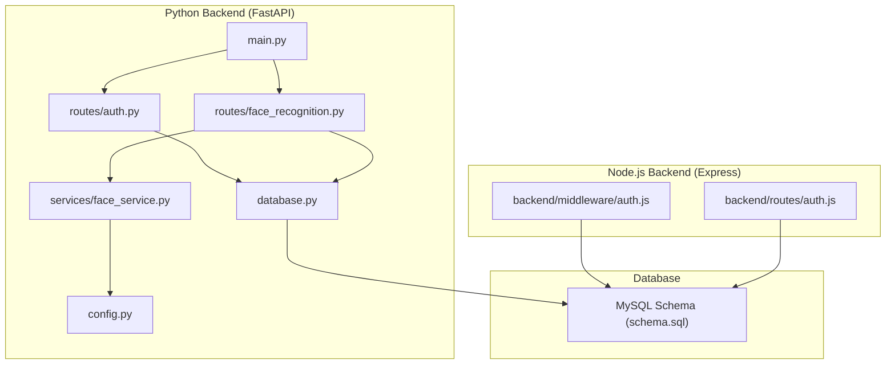
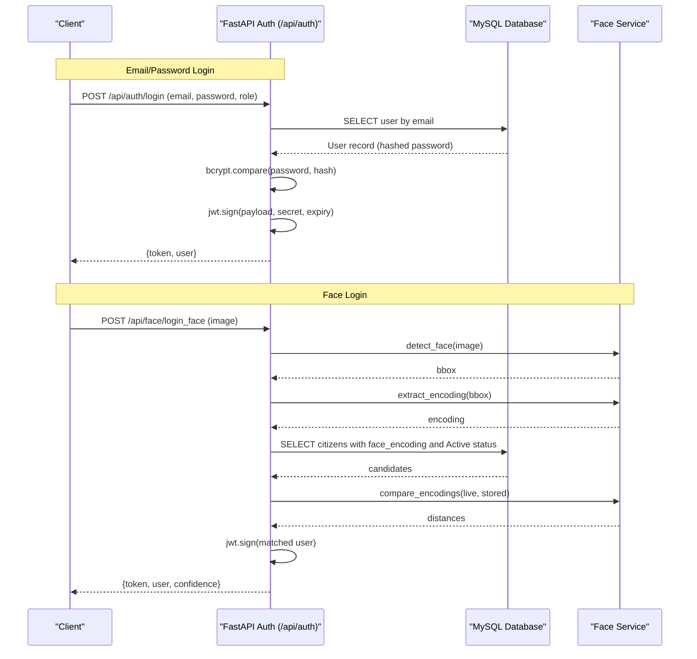
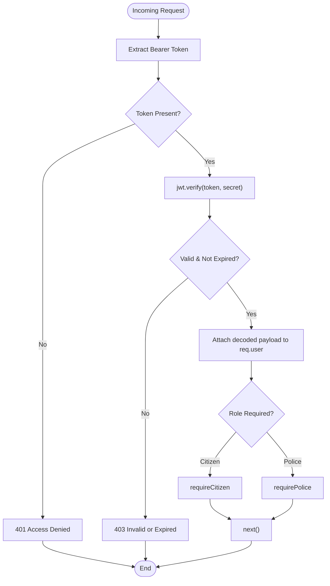
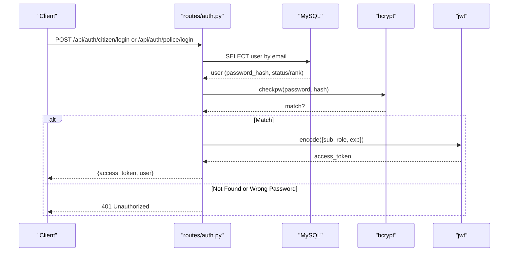
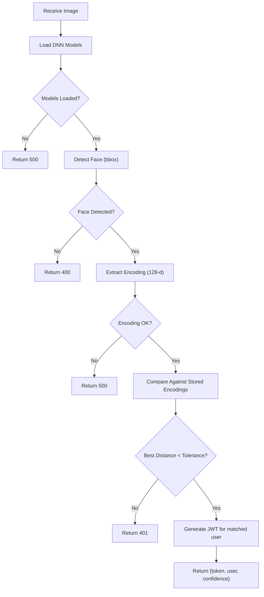
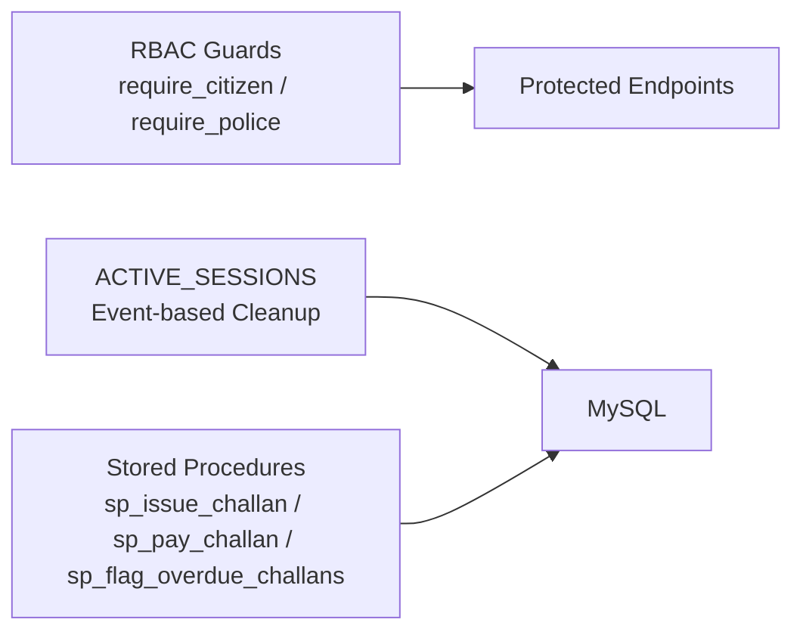
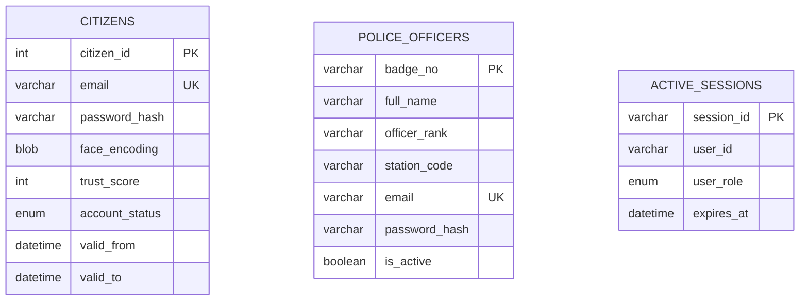
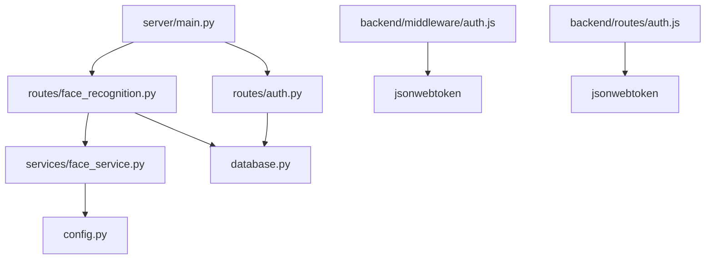

# Authentication and Security

<cite>
**Referenced Files in This Document**
- [auth.js](file://backend/middleware/auth.js)
- [auth.js](file://backend/routes/auth.js)
- [auth.py](file://server/routes/auth.py)
- [face_recognition.py](file://server/routes/face_recognition.py)
- [face_service.py](file://server/services/face_service.py)
- [main.py](file://server/main.py)
- [config.py](file://server/config.py)
- [database.py](file://server/database.py)
- [schema.sql](file://db/schema.sql)
- [police.py](file://server/routes/police.py)
- [trust.py](file://server/routes/trust.py)
</cite>

## Table of Contents
1. [Introduction](#introduction)
2. [Project Structure](#project-structure)
3. [Core Components](#core-components)
4. [Architecture Overview](#architecture-overview)
5. [Detailed Component Analysis](#detailed-component-analysis)
6. [Dependency Analysis](#dependency-analysis)
7. [Performance Considerations](#performance-considerations)
8. [Troubleshooting Guide](#troubleshooting-guide)
9. [Conclusion](#conclusion)
10. [Appendices](#appendices)

## Introduction
This document explains the authentication and security system for the Traffic Violation Management System. It covers:
- Dual authentication: email/password login and face recognition login
- JWT token generation, validation, and expiration handling
- Password hashing with bcrypt and salt generation
- Face recognition workflow using OpenCV DNN, detection, encoding extraction, and comparison
- Role-based access control (RBAC) and session management
- Security best practices including CORS, input validation, and SQL injection prevention
- Encrypted storage of face encodings and biometric data protection
- Authentication flows, error handling, and security testing procedures

## Project Structure
The authentication system spans both a Node.js backend (Express) and a Python FastAPI backend. The Python backend implements the primary authentication and face recognition features, while the Node.js backend provides complementary middleware and routes.

**Diagram sources**
- [main.py:1-107](file://server/main.py#L1-L107)
- [auth.py:1-744](file://server/routes/auth.py#L1-L744)
- [face_recognition.py:1-282](file://server/routes/face_recognition.py#L1-L282)
- [face_service.py:1-177](file://server/services/face_service.py#L1-L177)
- [database.py:1-76](file://server/database.py#L1-L76)
- [config.py:1-41](file://server/config.py#L1-L41)
- [auth.js:1-37](file://backend/middleware/auth.js#L1-L37)
- [auth.js:1-117](file://backend/routes/auth.js#L1-L117)
- [schema.sql:1-942](file://db/schema.sql#L1-L942)

**Section sources**
- [main.py:1-107](file://server/main.py#L1-L107)
- [auth.py:1-744](file://server/routes/auth.py#L1-L744)
- [face_recognition.py:1-282](file://server/routes/face_recognition.py#L1-L282)
- [face_service.py:1-177](file://server/services/face_service.py#L1-L177)
- [database.py:1-76](file://server/database.py#L1-L76)
- [config.py:1-41](file://server/config.py#L1-L41)
- [auth.js:1-37](file://backend/middleware/auth.js#L1-L37)
- [auth.js:1-117](file://backend/routes/auth.js#L1-L117)
- [schema.sql:1-942](file://db/schema.sql#L1-L942)

## Core Components
- JWT middleware and RBAC helpers (Node.js)
- Email/password authentication (Python FastAPI)
- Face recognition registration and login (Python FastAPI)
- OpenCV DNN-based face detection and encoding extraction
- Database schema supporting hashed passwords, face encodings, and session cleanup
- CORS configuration and secure token handling

Key implementation highlights:
- JWT secret and algorithm are configurable via environment settings
- bcrypt is used for password hashing with salt generation
- Face encodings are stored as binary BLOBs in the database
- Role-based access control restricts endpoints by role
- Session cleanup is automated via MySQL events

**Section sources**
- [auth.js:1-37](file://backend/middleware/auth.js#L1-L37)
- [auth.py:1-744](file://server/routes/auth.py#L1-L744)
- [face_recognition.py:1-282](file://server/routes/face_recognition.py#L1-L282)
- [face_service.py:1-177](file://server/services/face_service.py#L1-L177)
- [schema.sql:26-43](file://db/schema.sql#L26-L43)
- [main.py:57-67](file://server/main.py#L57-L67)

## Architecture Overview
The system supports two authentication paths:
- Traditional email/password login with bcrypt and JWT
- Face-based login using OpenCV DNN detection and encoding comparison

**Diagram sources**
- [auth.py:218-293](file://server/routes/auth.py#L218-L293)
- [face_recognition.py:110-231](file://server/routes/face_recognition.py#L110-L231)
- [face_service.py:47-150](file://server/services/face_service.py#L47-L150)
- [schema.sql:26-43](file://db/schema.sql#L26-L43)

## Detailed Component Analysis

### JWT and RBAC (Node.js)
- Token extraction from Authorization header
- Verification using a shared secret
- Role checks for citizen and police endpoints

**Diagram sources**
- [auth.js:5-34](file://backend/middleware/auth.js#L5-L34)

**Section sources**
- [auth.js:1-37](file://backend/middleware/auth.js#L1-L37)

### Email/Password Authentication (Python FastAPI)
- Supports citizen and police roles
- Validates credentials against hashed passwords
- Generates JWT with role-specific claims
- Enforces account status checks

**Diagram sources**
- [auth.py:218-293](file://server/routes/auth.py#L218-L293)
- [auth.py:399-476](file://server/routes/auth.py#L399-L476)

**Section sources**
- [auth.py:1-744](file://server/routes/auth.py#L1-L744)

### Face Recognition Workflow
- Model loading and detection using OpenCV DNN
- Encoding extraction and normalization
- Comparison against stored encodings
- Face registration and login endpoints

**Diagram sources**
- [face_recognition.py:28-231](file://server/routes/face_recognition.py#L28-L231)
- [face_service.py:47-150](file://server/services/face_service.py#L47-L150)

**Section sources**
- [face_recognition.py:1-282](file://server/routes/face_recognition.py#L1-L282)
- [face_service.py:1-177](file://server/services/face_service.py#L1-L177)
- [schema.sql:26-43](file://db/schema.sql#L26-L43)

### Role-Based Access Control and Session Management
- Role guards enforce access to citizen and police endpoints
- Active session cleanup via MySQL events
- Stored procedures encapsulate sensitive operations

**Diagram sources**
- [police.py:25-220](file://server/routes/police.py#L25-L220)
- [trust.py:15-134](file://server/routes/trust.py#L15-L134)
- [schema.sql:245-301](file://db/schema.sql#L245-L301)
- [schema.sql:440-629](file://db/schema.sql#L440-L629)

**Section sources**
- [police.py:1-220](file://server/routes/police.py#L1-L220)
- [trust.py:1-134](file://server/routes/trust.py#L1-L134)
- [schema.sql:245-301](file://db/schema.sql#L245-L301)
- [schema.sql:440-629](file://db/schema.sql#L440-L629)

### Data Protection and Storage
- Passwords are hashed with bcrypt and salt
- Face encodings are stored as BLOBs
- Database schema includes temporal auditing and triggers

**Diagram sources**
- [schema.sql:26-82](file://db/schema.sql#L26-L82)
- [schema.sql:245-256](file://db/schema.sql#L245-L256)

**Section sources**
- [schema.sql:26-82](file://db/schema.sql#L26-L82)
- [schema.sql:245-256](file://db/schema.sql#L245-L256)

## Dependency Analysis
- Python FastAPI app registers routers and middleware
- Face service depends on OpenCV and configuration
- Database module provides connection pooling and context managers
- Node.js middleware depends on jsonwebtoken

**Diagram sources**
- [main.py:1-107](file://server/main.py#L1-L107)
- [auth.py:1-744](file://server/routes/auth.py#L1-L744)
- [face_recognition.py:1-282](file://server/routes/face_recognition.py#L1-L282)
- [face_service.py:1-177](file://server/services/face_service.py#L1-L177)
- [database.py:1-76](file://server/database.py#L1-L76)
- [config.py:1-41](file://server/config.py#L1-L41)
- [auth.js:1-37](file://backend/middleware/auth.js#L1-L37)
- [auth.js:1-117](file://backend/routes/auth.js#L1-L117)

**Section sources**
- [main.py:1-107](file://server/main.py#L1-L107)
- [auth.py:1-744](file://server/routes/auth.py#L1-L744)
- [face_recognition.py:1-282](file://server/routes/face_recognition.py#L1-L282)
- [face_service.py:1-177](file://server/services/face_service.py#L1-L177)
- [database.py:1-76](file://server/database.py#L1-L76)
- [config.py:1-41](file://server/config.py#L1-L41)
- [auth.js:1-37](file://backend/middleware/auth.js#L1-L37)
- [auth.js:1-117](file://backend/routes/auth.js#L1-L117)

## Performance Considerations
- Use bcrypt cost factors appropriate for deployment environment
- Optimize OpenCV model loading and reuse instances
- Consider indexing on frequently queried columns (email, badge_no)
- Limit concurrent face comparisons and apply rate limiting
- Use database connection pooling and prepared statements

## Troubleshooting Guide
Common issues and resolutions:
- Invalid or expired JWT: Ensure clients renew tokens before expiry
- Face detection failures: Verify model files are present and accessible
- Encoding extraction errors: Confirm image quality and face visibility
- Account disabled or suspended: Check account status in database
- CORS errors: Validate allowed origins and credentials settings

Security testing procedures:
- Penetration testing for SQL injection using parameterized queries
- JWT token replay and tampering tests
- Biometric false acceptance/rejection rate evaluation
- Session timeout and cleanup validation

**Section sources**
- [auth.js:13-20](file://backend/middleware/auth.js#L13-L20)
- [face_recognition.py:117-125](file://server/routes/face_recognition.py#L117-L125)
- [face_service.py:34-45](file://server/services/face_service.py#L34-L45)
- [main.py:57-67](file://server/main.py#L57-L67)

## Conclusion
The system implements a robust dual-authentication approach with strong cryptographic foundations. JWT ensures secure sessionless authentication, bcrypt protects credentials, and OpenCV DNN enables practical face recognition. RBAC and database triggers enforce access control and maintain audit trails. Adhering to the recommended security practices and performing continuous security testing will further strengthen the system.

## Appendices

### Security Best Practices Checklist
- Use HTTPS in production
- Rotate JWT secrets regularly
- Sanitize and validate all inputs
- Prevent SQL injection via parameterized queries
- Enforce CORS policies
- Monitor and log authentication attempts
- Regularly review and update model dependencies

### Example Authentication Flows
- Email/Password Login: Client sends credentials; server verifies hash and issues JWT
- Face Login: Client uploads image; server detects face, extracts encoding, compares against stored encodings, and issues JWT on match

[No sources needed since this section provides general guidance]