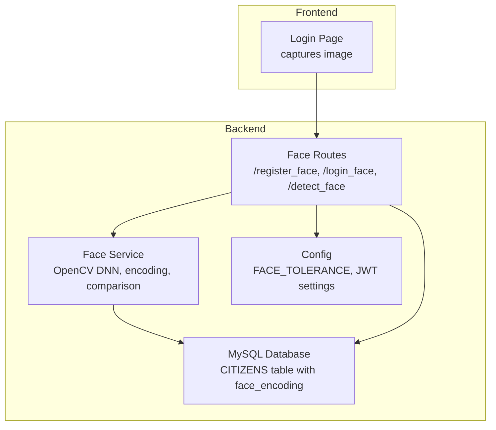
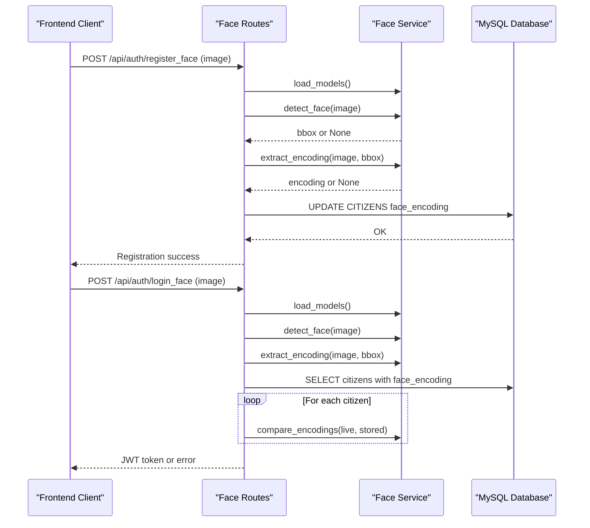
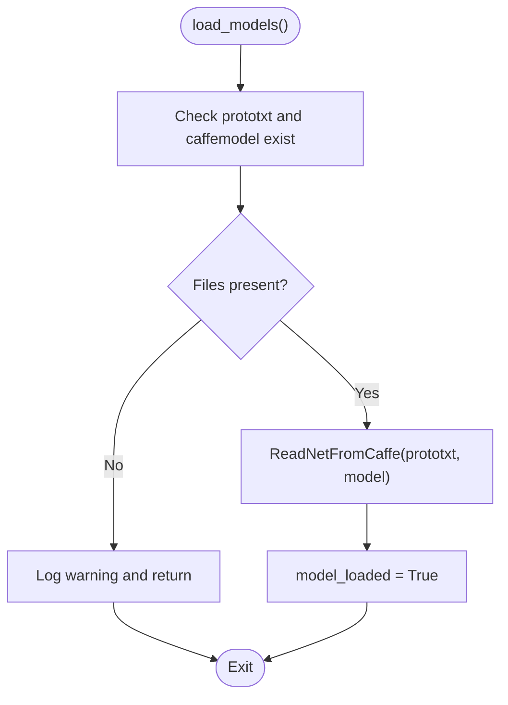
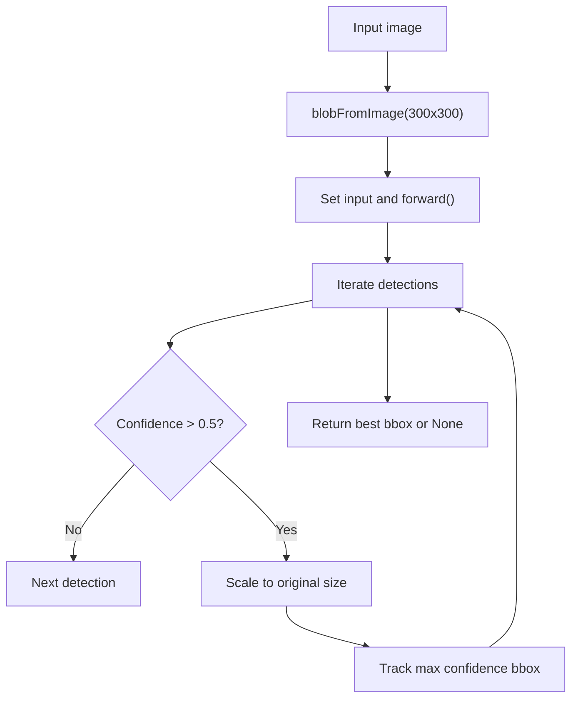
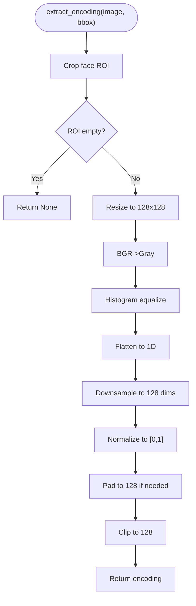
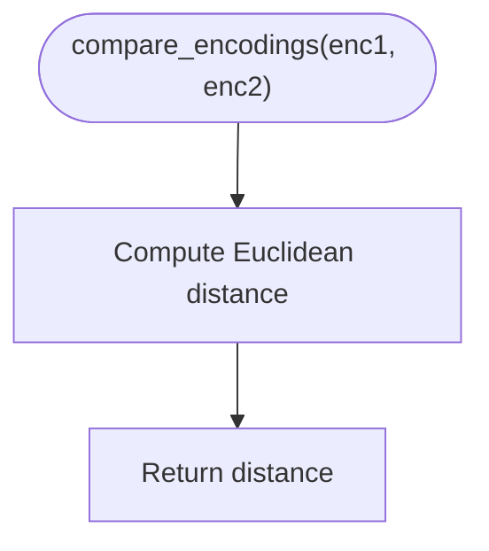
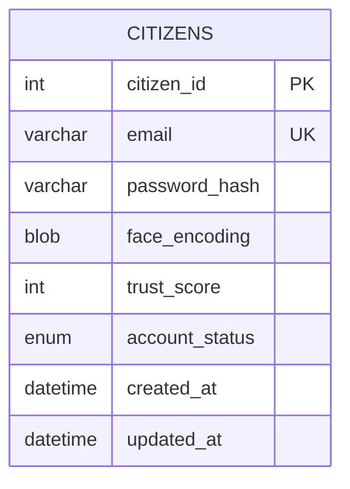
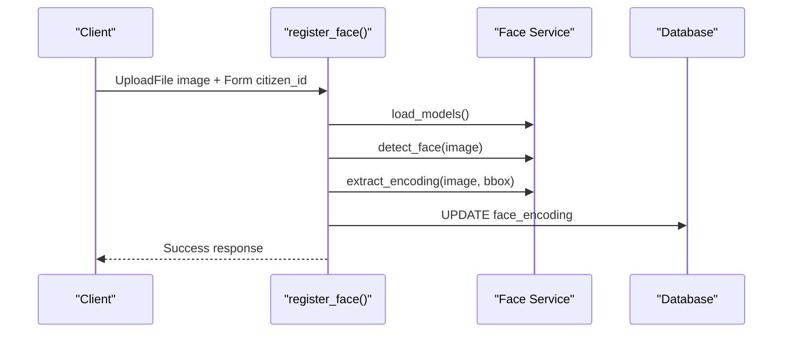
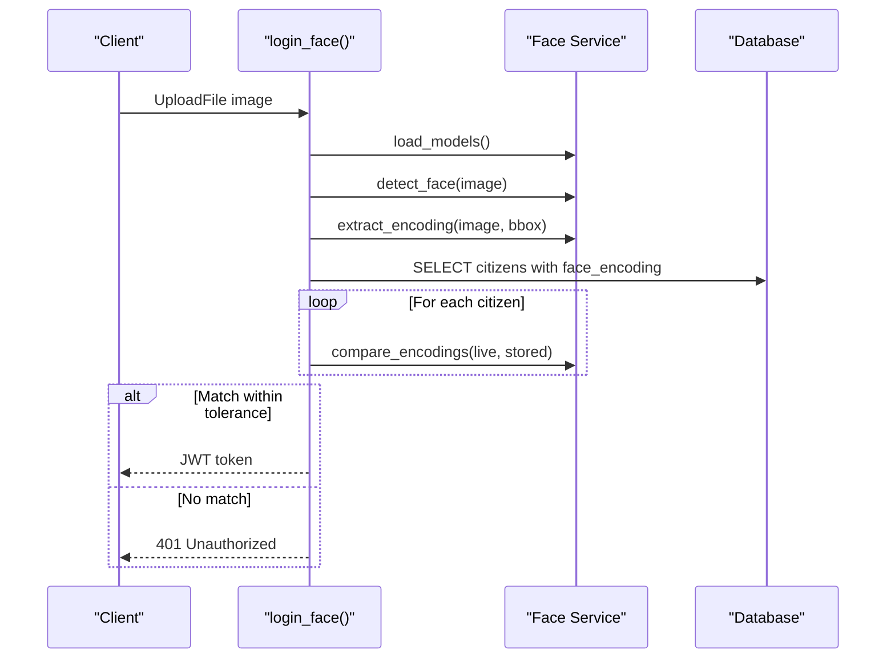
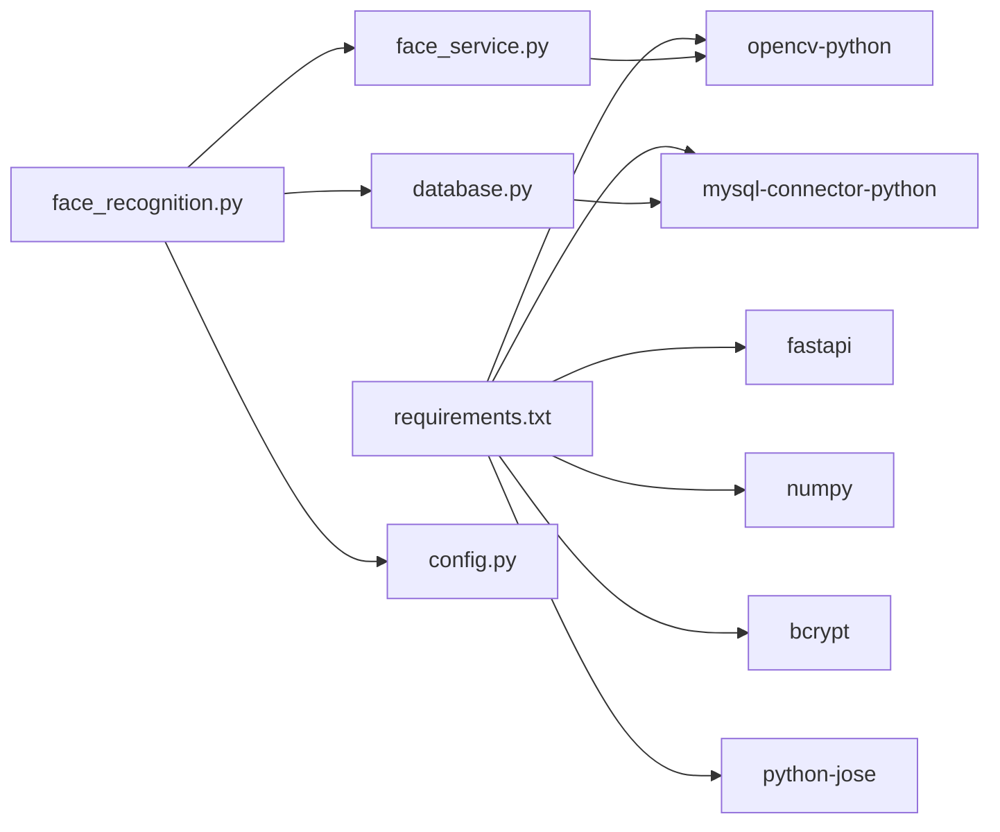

# Face Recognition System

<cite>
**Referenced Files in This Document**
- [face_recognition.py](file://server/routes/face_recognition.py)
- [face_service.py](file://server/services/face_service.py)
- [README.txt](file://server/models/README.txt)
- [auth.py](file://server/middleware/auth.py)
- [database.py](file://server/database.py)
- [schema.sql](file://db/schema.sql)
- [config.py](file://server/config.py)
- [requirements.txt](file://server/requirements.txt)
- [main.py](file://server/main.py)
- [README.md](file://README.md)
- [Login.jsx](file://frontend/src/pages/Login.jsx)
</cite>

## Table of Contents
1. [Introduction](#introduction)
2. [Project Structure](#project-structure)
3. [Core Components](#core-components)
4. [Architecture Overview](#architecture-overview)
5. [Detailed Component Analysis](#detailed-component-analysis)
6. [Dependency Analysis](#dependency-analysis)
7. [Performance Considerations](#performance-considerations)
8. [Troubleshooting Guide](#troubleshooting-guide)
9. [Privacy and Compliance](#privacy-and-compliance)
10. [Conclusion](#conclusion)

## Introduction
This document describes the biometric face recognition authentication system integrated into the Traffic Violation Management System. It covers OpenCV DNN-based face detection, face encoding extraction, face comparison with similarity thresholds, secure storage of biometric templates, and robust fallback authentication. It also documents implementation examples for registration and authentication workflows, error handling, performance optimization, camera integration, and privacy considerations aligned with biometric data regulations.

## Project Structure
The face recognition system spans backend routes, a dedicated service module, database schema, configuration, and frontend integration points. Key areas:
- Routes: Face registration, login, and detection endpoints
- Service: OpenCV DNN model loading, face detection, encoding extraction, and comparison
- Database: Schema for storing serialized face encodings and related user data
- Configuration: Model tolerance, JWT settings, and server parameters
- Frontend: Login page integration and webcam capture

**Diagram sources**
- [face_recognition.py:28-282](file://server/routes/face_recognition.py#L28-L282)
- [face_service.py:15-177](file://server/services/face_service.py#L15-L177)
- [schema.sql:26-43](file://db/schema.sql#L26-L43)
- [config.py:29-31](file://server/config.py#L29-L31)

**Section sources**
- [face_recognition.py:1-282](file://server/routes/face_recognition.py#L1-L282)
- [face_service.py:1-177](file://server/services/face_service.py#L1-L177)
- [schema.sql:26-43](file://db/schema.sql#L26-L43)
- [config.py:1-41](file://server/config.py#L1-L41)
- [README.md:1-214](file://README.md#L1-L214)

## Core Components
- Face Recognition Routes: Expose endpoints for face registration, login, and detection. They orchestrate model loading, image ingestion, detection, encoding extraction, and comparison against stored templates.
- Face Service: Encapsulates OpenCV DNN model loading, face detection via SSD with confidence filtering, and a lightweight encoding pipeline that produces a normalized 128-d vector. Provides Euclidean distance-based comparison.
- Database Schema: Stores serialized face encodings as BLOBs in the CITIZENS table alongside user credentials and trust metrics.
- Configuration: Centralizes tolerance thresholds and JWT secrets for secure token issuance.
- Fallback Authentication: Email/password login remains available as a backup when face recognition fails or is unavailable.

**Section sources**
- [face_recognition.py:28-282](file://server/routes/face_recognition.py#L28-L282)
- [face_service.py:15-177](file://server/services/face_service.py#L15-L177)
- [schema.sql:26-43](file://db/schema.sql#L26-L43)
- [config.py:29-31](file://server/config.py#L29-L31)
- [auth.py:68-123](file://server/middleware/auth.py#L68-L123)

## Architecture Overview
The system integrates a client-side webcam capture with backend endpoints that validate images, detect faces, compute encodings, and authenticate users by comparing against stored templates.

**Diagram sources**
- [face_recognition.py:28-232](file://server/routes/face_recognition.py#L28-L232)
- [face_service.py:24-149](file://server/services/face_service.py#L24-L149)
- [schema.sql:26-43](file://db/schema.sql#L26-L43)

## Detailed Component Analysis

### OpenCV DNN Integration and Model Loading
- Model files: The system expects two files in the models directory:
  - deploy.prototxt: Caffe model architecture
  - res10_300x300_ssd_iter_140000.caffemodel: Pre-trained weights (~10 MB)
- Loading logic: The service checks for file existence and loads the network via OpenCV’s DNN module. On failure, it logs warnings and sets a flag indicating models are not loaded.
- Detection pipeline: Converts input image to a blob sized to 300x300, runs forward pass, selects detection with highest confidence above a threshold, and returns a bounding box scaled to original image dimensions.

**Diagram sources**
- [face_service.py:24-46](file://server/services/face_service.py#L24-L46)
- [README.txt:15-41](file://server/models/README.txt#L15-L41)

**Section sources**
- [face_service.py:24-46](file://server/services/face_service.py#L24-L46)
- [README.txt:15-41](file://server/models/README.txt#L15-L41)

### Face Detection Algorithm
- Input preprocessing: Resize to 300x300 and subtract channel means per Caffe convention.
- Forward pass: Runs the network and iterates detections.
- Confidence threshold: Only detections above a fixed threshold are considered.
- Bounding box selection: Picks the detection with maximum confidence and scales to original image coordinates, clamping to image bounds.

**Diagram sources**
- [face_service.py:62-94](file://server/services/face_service.py#L62-L94)

**Section sources**
- [face_service.py:47-94](file://server/services/face_service.py#L47-L94)

### Face Encoding Extraction Workflow
- Region of interest: Extract face ROI from the detected bounding box.
- Preprocessing: Resize to 128x128, convert to grayscale, apply histogram equalization.
- Vectorization: Flatten pixel intensities, downsample to 128 dimensions using a simple step-based approach, normalize to [0,1], and pad to exactly 128 values if needed.
- Output: A normalized 128-d NumPy vector suitable for Euclidean distance comparison.

**Diagram sources**
- [face_service.py:96-141](file://server/services/face_service.py#L96-L141)

**Section sources**
- [face_service.py:96-141](file://server/services/face_service.py#L96-L141)

### Face Comparison Algorithm and Thresholds
- Distance metric: Euclidean distance between two 128-d vectors.
- Matching logic: For each registered user, compute distance and keep the minimum. If the best distance exceeds the tolerance, authentication fails.
- Tolerance tuning: Controlled via configuration and embedded constants in routes; adjust based on dataset characteristics and acceptance rate targets.

**Diagram sources**
- [face_service.py:143-149](file://server/services/face_service.py#L143-L149)
- [face_recognition.py:173-199](file://server/routes/face_recognition.py#L173-L199)

**Section sources**
- [face_service.py:143-149](file://server/services/face_service.py#L143-L149)
- [face_recognition.py:170-202](file://server/routes/face_recognition.py#L170-L202)
- [config.py](file://server/config.py#L30)

### Biometric Data Storage and Template Management
- Storage: Serialized 128-d face encodings are stored as BLOBs in the CITIZENS table.
- Indexing: The schema includes indexes on email, account status, and trust score to support efficient lookups.
- Integrity: Encodings are associated with user accounts and can be updated during registration.

**Diagram sources**
- [schema.sql:26-43](file://db/schema.sql#L26-L43)

**Section sources**
- [schema.sql:26-43](file://db/schema.sql#L26-L43)
- [face_recognition.py:78-95](file://server/routes/face_recognition.py#L78-L95)

### Implementation Examples

#### Face Registration Workflow
- Endpoint: POST /api/auth/register_face
- Steps:
  - Load models
  - Read and decode image
  - Detect face and extract bounding box
  - Compute encoding
  - Serialize encoding to bytes
  - Update database with face_encoding for the given citizen_id

**Diagram sources**
- [face_recognition.py:28-101](file://server/routes/face_recognition.py#L28-L101)
- [face_service.py:24-141](file://server/services/face_service.py#L24-L141)
- [schema.sql:26-43](file://db/schema.sql#L26-L43)

**Section sources**
- [face_recognition.py:28-101](file://server/routes/face_recognition.py#L28-L101)

#### Face Authentication Workflow
- Endpoint: POST /api/auth/login_face
- Steps:
  - Load models
  - Detect face and extract encoding
  - Retrieve all citizens with non-null face_encoding and Active status
  - Compare against each stored encoding and track best match
  - If best distance exceeds tolerance, reject; otherwise, issue JWT token

**Diagram sources**
- [face_recognition.py:110-225](file://server/routes/face_recognition.py#L110-L225)
- [face_service.py:143-149](file://server/services/face_service.py#L143-L149)
- [schema.sql:158-162](file://db/schema.sql#L158-L162)

**Section sources**
- [face_recognition.py:110-225](file://server/routes/face_recognition.py#L110-L225)

#### Fallback Authentication Methods
- Email/Password Login: Available as a reliable fallback when face recognition fails or is unavailable.
- Frontend Integration: The login page posts to the citizen login endpoint and persists tokens locally upon success.

**Section sources**
- [auth.py:96-123](file://server/middleware/auth.py#L96-L123)
- [Login.jsx:15-69](file://frontend/src/pages/Login.jsx#L15-L69)

### Error Handling for Detection Failures
- Missing models: Routes check model_loaded flag and return explicit 500/400 errors when models are not available or detection fails.
- Invalid images: Decoding failures lead to 400 errors.
- No face detected: Explicit 400 error instructing the user to ensure clear visibility.
- Encoding extraction failures: 500 errors with guidance to retry.
- Database errors: Context managers roll back transactions and propagate meaningful errors.

**Section sources**
- [face_recognition.py:34-107](file://server/routes/face_recognition.py#L34-L107)
- [face_recognition.py:117-231](file://server/routes/face_recognition.py#L117-L231)
- [database.py:52-76](file://server/database.py#L52-L76)

## Dependency Analysis
- External libraries: FastAPI, OpenCV (cv2), NumPy, bcrypt, python-jose for JWT, mysql-connector-python.
- Internal dependencies: Routes depend on the Face Service singleton, database helpers, and configuration.
- Model dependencies: Face Service depends on the presence of OpenCV DNN model files.

**Diagram sources**
- [requirements.txt:1-13](file://server/requirements.txt#L1-L13)
- [face_recognition.py:5-13](file://server/routes/face_recognition.py#L5-L13)
- [face_service.py:5-11](file://server/services/face_service.py#L5-L11)
- [database.py:4-8](file://server/database.py#L4-L8)
- [config.py:9-21](file://server/config.py#L9-L21)

**Section sources**
- [requirements.txt:1-13](file://server/requirements.txt#L1-L13)
- [face_recognition.py:5-13](file://server/routes/face_recognition.py#L5-L13)
- [face_service.py:5-11](file://server/services/face_service.py#L5-L11)
- [database.py:4-8](file://server/database.py#L4-L8)
- [config.py:9-21](file://server/config.py#L9-L21)

## Performance Considerations
- Model loading: Load models once per request lifecycle and reuse; avoid repeated reloads.
- Image preprocessing: Keep resizing and normalization minimal; ensure consistent lighting and cropping to improve detection reliability.
- Encoding computation: The current 128-d vectorization is lightweight; consider PCA or t-SNE for dimensionality reduction if needed.
- Database queries: Filter by Active status and non-null face_encoding to limit comparisons.
- Threshold tuning: Adjust tolerance to balance false positives and false negatives; monitor confidence distributions.
- Concurrency: Use connection pooling and context-managed cursors to handle concurrent requests efficiently.

[No sources needed since this section provides general guidance]

## Troubleshooting Guide
- Models not found: Verify deploy.prototxt and res10_300x300_ssd_iter_140000.caffemodel exist in the models directory and are downloadable from the referenced OpenCV links.
- Detection failures: Ensure adequate lighting, centered face, and clear image quality; reduce tolerance slightly if needed.
- Encoding extraction errors: Confirm ROI is valid and not empty; check preprocessing steps.
- Database connectivity: Validate connection pool initialization and credentials; ensure the database is reachable.
- Token issuance: Confirm JWT secret and algorithm settings align with configuration.

**Section sources**
- [README.txt:15-41](file://server/models/README.txt#L15-L41)
- [face_service.py:33-46](file://server/services/face_service.py#L33-L46)
- [database.py:14-43](file://server/database.py#L14-L43)
- [config.py:18-21](file://server/config.py#L18-L21)

## Privacy and Compliance
- Data minimization: Only store serialized face encodings; avoid retaining raw images unless necessary.
- Consent and transparency: Inform users about biometric collection and processing purposes; provide opt-out mechanisms.
- Security safeguards: Protect model files and database backups; restrict access to sensitive endpoints; enforce HTTPS and secure token storage.
- Retention and deletion: Implement policies for automatic purging of biometric data upon user request or account deletion.
- Regulatory alignment: Comply with applicable biometric data laws (e.g., guidelines on pseudonymization, purpose limitation, data sharing restrictions).
- Audit trails: Maintain logs of access and modifications to biometric data for accountability.

[No sources needed since this section provides general guidance]

## Conclusion
The system provides a practical, production-ready face recognition authentication layer built on OpenCV DNN, with robust fallbacks, secure storage of biometric templates, and clear operational boundaries. By tuning thresholds, optimizing image capture, and adhering to privacy and compliance best practices, the system can achieve strong usability and trustworthiness in law enforcement contexts.