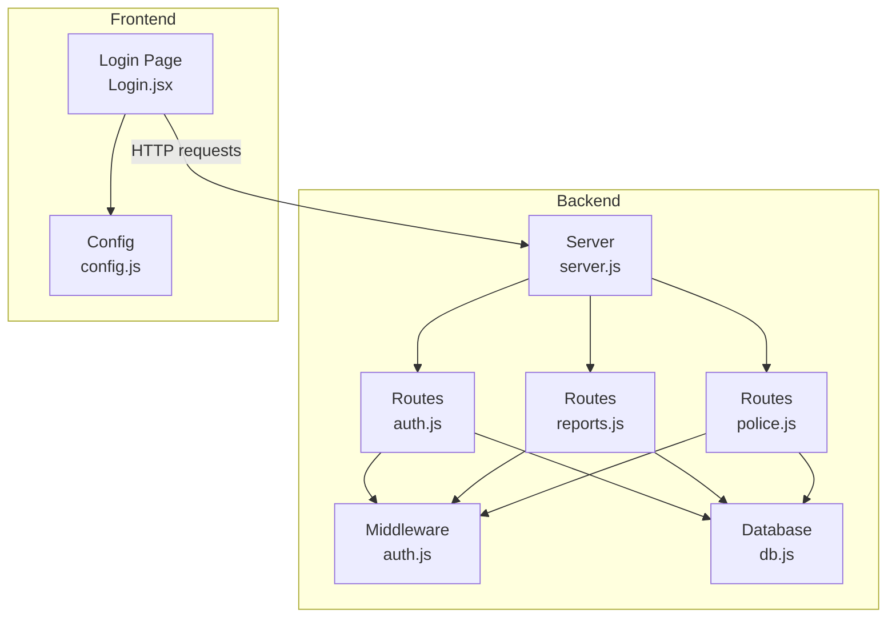
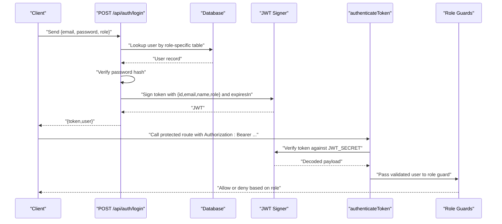
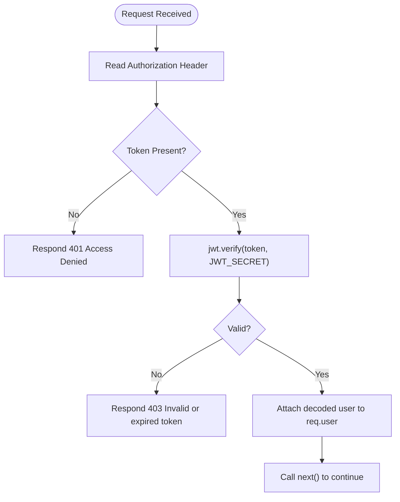
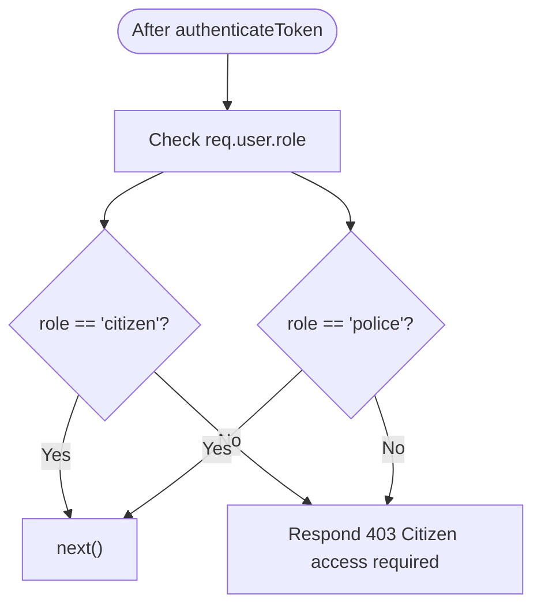
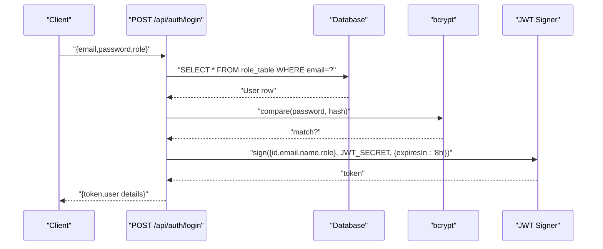
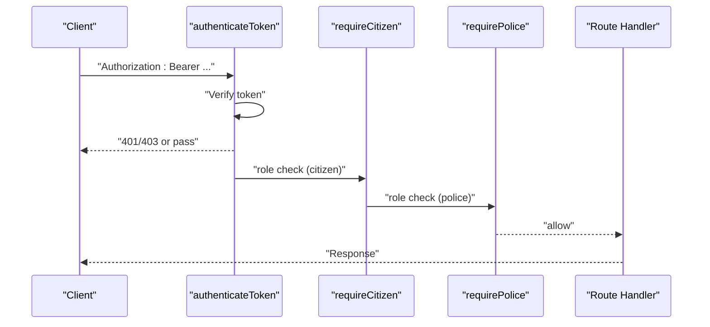
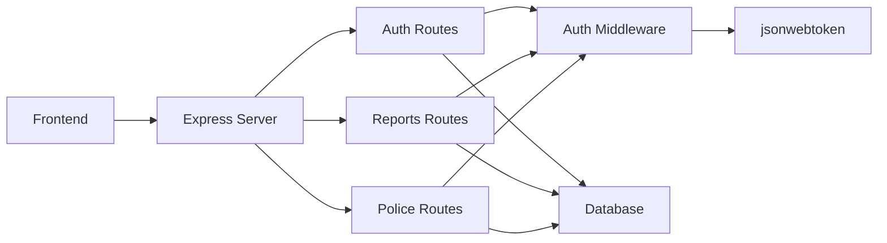

# JWT Authentication

<cite>
**Referenced Files in This Document**
- [auth.js](file://backend/middleware/auth.js)
- [auth.js](file://backend/routes/auth.js)
- [server.js](file://backend/server.js)
- [db.js](file://backend/db.js)
- [reports.js](file://backend/routes/reports.js)
- [police.js](file://backend/routes/police.js)
- [package.json](file://backend/package.json)
- [schema.sql](file://db/schema.sql)
- [config.js](file://frontend/src/config.js)
- [Login.jsx](file://frontend/src/pages/Login.jsx)
</cite>

## Table of Contents
1. [Introduction](#introduction)
2. [Project Structure](#project-structure)
3. [Core Components](#core-components)
4. [Architecture Overview](#architecture-overview)
5. [Detailed Component Analysis](#detailed-component-analysis)
6. [Dependency Analysis](#dependency-analysis)
7. [Performance Considerations](#performance-considerations)
8. [Security Considerations](#security-considerations)
9. [Troubleshooting Guide](#troubleshooting-guide)
10. [Conclusion](#conclusion)
11. [Appendices](#appendices)

## Introduction
This document explains the JWT (JSON Web Token) authentication system used by the Traffic Violation Management System. It covers the token-based authentication flow (login to token issuance), token validation middleware, role-based access control, token structure and expiration, and integration with Express.js routes. It also documents security considerations, error handling scenarios, and practical guidance for frontend integration.

## Project Structure
The authentication system spans backend middleware, routes, and frontend integration:
- Backend middleware defines token verification and role guards.
- Backend routes handle login, token validation, and protected endpoints.
- Frontend stores tokens and attaches them to authenticated requests.

**Diagram sources**
- [auth.js](file://backend/middleware/auth.js)
- [auth.js](file://backend/routes/auth.js)
- [reports.js](file://backend/routes/reports.js)
- [police.js](file://backend/routes/police.js)
- [server.js](file://backend/server.js)
- [db.js](file://backend/db.js)
- [config.js](file://frontend/src/config.js)
- [Login.jsx](file://frontend/src/pages/Login.jsx)

**Section sources**
- [server.js](file://backend/server.js)
- [auth.js](file://backend/middleware/auth.js)
- [auth.js](file://backend/routes/auth.js)
- [reports.js](file://backend/routes/reports.js)
- [police.js](file://backend/routes/police.js)
- [db.js](file://backend/db.js)
- [config.js](file://frontend/src/config.js)
- [Login.jsx](file://frontend/src/pages/Login.jsx)

## Core Components
- JWT_SECRET: The signing secret used to sign and verify tokens. Defaults to an internal fallback if environment variable is not set.
- authenticateToken: Express middleware that extracts the Authorization header, validates the token against JWT_SECRET, and attaches user claims to the request object.
- requireCitizen and requirePolice: Role-based guards that enforce authorization by checking the user’s role after token validation.
- Login endpoint: Issues a signed JWT with a fixed 8-hour expiration and returns user details appropriate to the role.
- Protected routes: Use authenticateToken followed by role guards to restrict access.

Key implementation references:
- JWT_SECRET and middleware functions: [auth.js](file://backend/middleware/auth.js)
- Login and profile retrieval: [auth.js](file://backend/routes/auth.js)
- Route protection usage: [reports.js](file://backend/routes/reports.js), [police.js](file://backend/routes/police.js)
- Server bootstrap and route registration: [server.js](file://backend/server.js)
- Database connectivity: [db.js](file://backend/db.js)

**Section sources**
- [auth.js](file://backend/middleware/auth.js)
- [auth.js](file://backend/routes/auth.js)
- [reports.js](file://backend/routes/reports.js)
- [police.js](file://backend/routes/police.js)
- [server.js](file://backend/server.js)
- [db.js](file://backend/db.js)

## Architecture Overview
The authentication flow consists of:
- Client sends credentials to the login endpoint.
- Server verifies credentials against the database.
- On success, server signs a JWT containing user identity and role.
- Client stores the token and includes it in subsequent requests.
- Middleware validates the token and enforces role-based access.

**Diagram sources**
- [auth.js](file://backend/routes/auth.js)
- [auth.js](file://backend/middleware/auth.js)
- [db.js](file://backend/db.js)

## Detailed Component Analysis

### JWT_SECRET and Token Validation
- JWT_SECRET is loaded from environment variables with a fallback value for development.
- authenticateToken reads the Authorization header, splits on whitespace, and verifies the token using the secret.
- On success, the decoded payload is attached to req.user; on failure, appropriate HTTP errors are returned.

**Diagram sources**
- [auth.js](file://backend/middleware/auth.js)

**Section sources**
- [auth.js](file://backend/middleware/auth.js)

### Role-Based Access Control
- requireCitizen: Ensures req.user.role equals "citizen".
- requirePolice: Ensures req.user.role equals "police".
- Both return 403 Forbidden if the role does not match.

**Diagram sources**
- [auth.js](file://backend/middleware/auth.js)

**Section sources**
- [auth.js](file://backend/middleware/auth.js)

### Login Flow and Token Issuance
- Accepts email, password, and role ("citizen" or "police").
- Validates presence of inputs and role.
- Queries the appropriate table (CITIZENS or POLICE) by email.
- Compares password hash using bcrypt.
- On success, signs a JWT with subject claims and 8-hour expiration.
- Returns token and user details tailored to role.

**Diagram sources**
- [auth.js](file://backend/routes/auth.js)
- [db.js](file://backend/db.js)

**Section sources**
- [auth.js](file://backend/routes/auth.js)
- [db.js](file://backend/db.js)
- [schema.sql](file://db/schema.sql)

### Protected Routes Integration
- Reports routes for citizens use authenticateToken followed by requireCitizen.
- Police routes use authenticateToken followed by requirePolice.
- The middleware chain ensures both authentication and authorization before executing route handlers.

**Diagram sources**
- [reports.js](file://backend/routes/reports.js)
- [police.js](file://backend/routes/police.js)
- [auth.js](file://backend/middleware/auth.js)

**Section sources**
- [reports.js](file://backend/routes/reports.js)
- [police.js](file://backend/routes/police.js)
- [auth.js](file://backend/middleware/auth.js)

### Token Structure and Expiration
- Claims included in the token: id, email, name, role.
- Expiration policy: 8 hours from issuance.
- Secret: JWT_SECRET from environment with a fallback.

Practical implications:
- Clients should refresh or re-authenticate before token expiry.
- Expiration aligns with typical session durations for web apps.

**Section sources**
- [auth.js](file://backend/routes/auth.js)
- [auth.js](file://backend/middleware/auth.js)

### Frontend Integration
- The frontend constructs API endpoints via a centralized config.
- Login page posts credentials and persists the returned token in localStorage.
- Subsequent authenticated requests should include the token in the Authorization header as a Bearer token.

Note: The current frontend login endpoint path differs from the backend route. Ensure the frontend calls the correct backend endpoint.

**Section sources**
- [config.js](file://frontend/src/config.js)
- [Login.jsx](file://frontend/src/pages/Login.jsx)
- [auth.js](file://backend/routes/auth.js)

## Dependency Analysis
- Express server registers routes and middleware.
- Routes depend on the authentication middleware and database.
- Middleware depends on jsonwebtoken and environment configuration.
- Frontend depends on backend endpoints and token storage.

**Diagram sources**
- [server.js](file://backend/server.js)
- [auth.js](file://backend/middleware/auth.js)
- [auth.js](file://backend/routes/auth.js)
- [reports.js](file://backend/routes/reports.js)
- [police.js](file://backend/routes/police.js)
- [db.js](file://backend/db.js)
- [package.json](file://backend/package.json)

**Section sources**
- [server.js](file://backend/server.js)
- [auth.js](file://backend/middleware/auth.js)
- [auth.js](file://backend/routes/auth.js)
- [reports.js](file://backend/routes/reports.js)
- [police.js](file://backend/routes/police.js)
- [db.js](file://backend/db.js)
- [package.json](file://backend/package.json)

## Performance Considerations
- Token verification is lightweight and CPU-bound only for signature validation.
- Keep JWT_SECRET secure and avoid excessive logging of tokens.
- Consider short-lived tokens with a refresh mechanism to reduce long-lived exposure.
- Ensure database queries for user lookup are indexed on email.

## Security Considerations
- Token storage: Store tokens securely (e.g., HttpOnly cookies) to mitigate XSS risks. LocalStorage is vulnerable to script injection.
- Transport: Always use HTTPS to prevent token interception.
- Refresh tokens: Implement a separate refresh token flow to minimize long-lived access tokens.
- Expiration: 8-hour expiration reduces risk window; consider sliding expiration or automatic renewal.
- Secrets: Never hardcode JWT_SECRET; use environment variables in production.
- Input validation: Validate and sanitize all inputs to prevent injection attacks.
- Rate limiting: Apply rate limits on login attempts to deter brute force.

## Troubleshooting Guide
Common error scenarios and resolutions:
- Missing Authorization header: 401 Access denied. Ensure the client sends Authorization: Bearer <token>.
- Invalid or expired token: 403 Invalid or expired token. Re-authenticate or refresh token.
- Unauthorized role: 403 Citizen/Police access required. Verify the user’s role matches the endpoint.
- Database connectivity: 500 errors during login or protected route access indicate DB issues; check connection pool configuration.
- Environment variables: Missing JWT_SECRET falls back to a default; configure a strong secret in production.

**Section sources**
- [auth.js](file://backend/middleware/auth.js)
- [auth.js](file://backend/routes/auth.js)
- [db.js](file://backend/db.js)

## Conclusion
The JWT authentication system provides a straightforward, role-aware mechanism for protecting endpoints. By centralizing token validation and enforcing role checks, it enables clean separation of concerns and consistent access control across routes. Adopting recommended security practices and refresh token strategies will further strengthen the system.

## Appendices

### API Endpoints and Usage Notes
- POST /api/auth/login: Issues a JWT with 8-hour expiration and user details.
- GET /api/auth/me: Verifies token and returns user details based on role.
- POST /api/reports: Requires citizen role; submits a report.
- GET /api/reports/my: Requires citizen role; lists the logged-in citizen’s reports.
- GET /api/police/pending: Requires police role; retrieves pending reports.
- PATCH /api/police/verify/:id: Requires police role; verifies a report and issues a challan.
- PATCH /api/police/reject/:id: Requires police role; rejects a report.

**Section sources**
- [auth.js](file://backend/routes/auth.js)
- [reports.js](file://backend/routes/reports.js)
- [police.js](file://backend/routes/police.js)