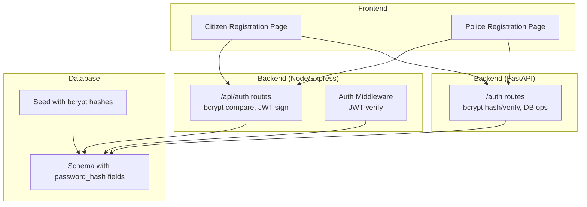
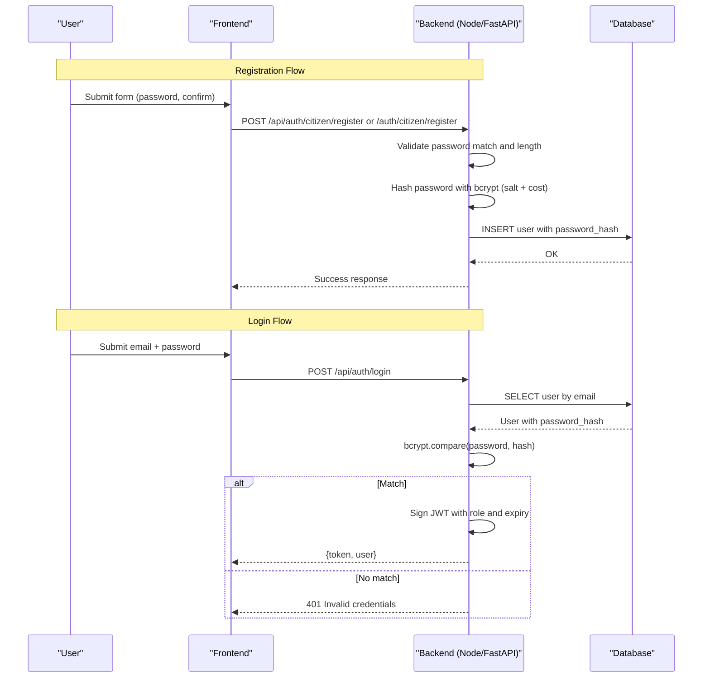
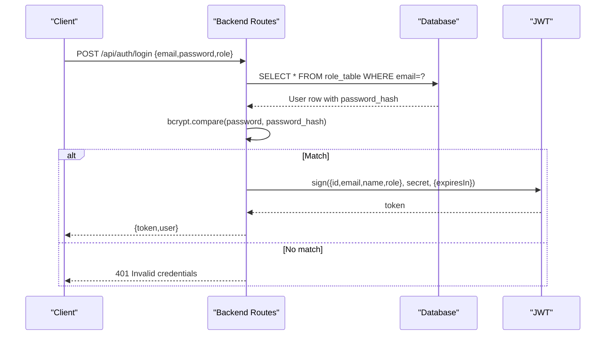
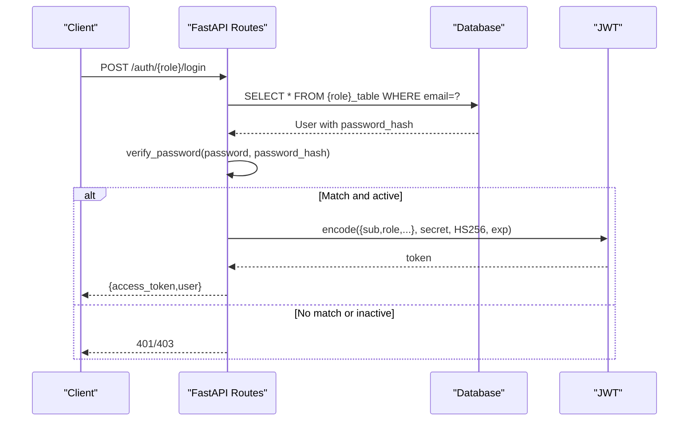
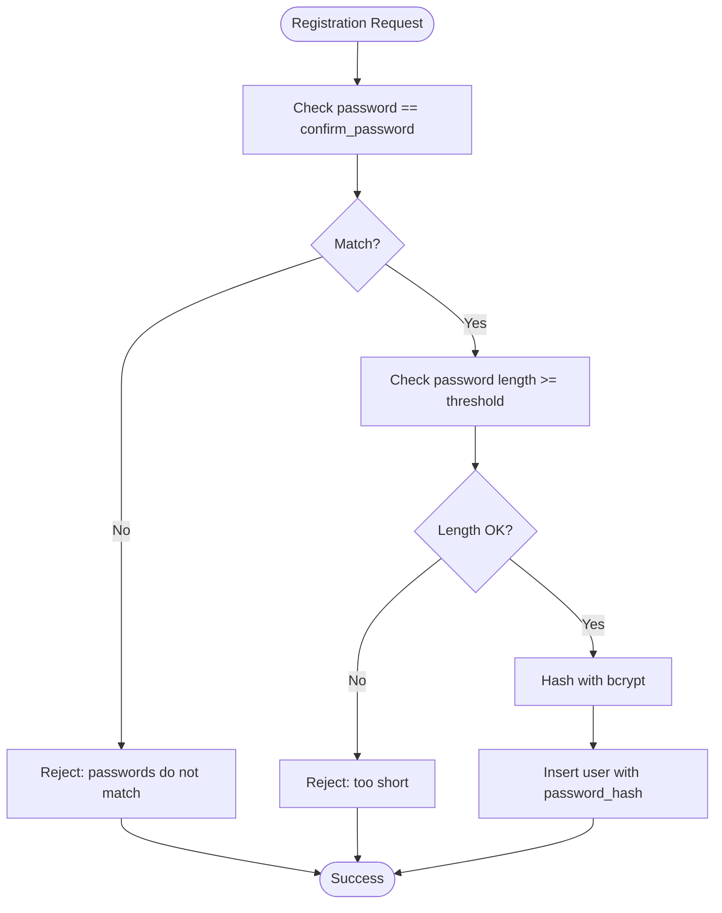
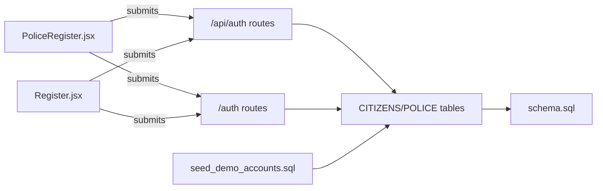

# Password Security

<cite>
**Referenced Files in This Document**
- [auth.js](file://backend/middleware/auth.js)
- [auth.js](file://backend/routes/auth.js)
- [generate_password_hashes.py](file://scripts/generate_password_hashes.py)
- [schema.sql](file://db/schema.sql)
- [seed_demo_accounts.sql](file://db/seed_demo_accounts.sql)
- [auth.py](file://server/routes/auth.py)
- [Register.jsx](file://frontend/src/pages/Register.jsx)
- [PoliceRegister.jsx](file://frontend/src/pages/PoliceRegister.jsx)
</cite>

## Table of Contents
1. [Introduction](#introduction)
2. [Project Structure](#project-structure)
3. [Core Components](#core-components)
4. [Architecture Overview](#architecture-overview)
5. [Detailed Component Analysis](#detailed-component-analysis)
6. [Dependency Analysis](#dependency-analysis)
7. [Performance Considerations](#performance-considerations)
8. [Troubleshooting Guide](#troubleshooting-guide)
9. [Conclusion](#conclusion)

## Introduction
This document provides comprehensive guidance for password security in the system, focusing on bcrypt-based password hashing, secure storage, validation during login, and robust protection against common threats such as rainbow table attacks, brute force attempts, and timing attacks. It also documents password strength validation, secure storage practices, and operational controls such as account lockout and audit logging.

## Project Structure
The password security implementation spans three layers:
- Frontend: Client-side password validation and submission
- Backend (Node/Express): JWT-based authentication and bcrypt verification for citizen/police login
- Backend (Python/FastAPI): Password hashing and verification for registration and login flows

**Diagram sources**
- [auth.js:1-117](file://backend/routes/auth.js#L1-L117)
- [auth.js:1-37](file://backend/middleware/auth.js#L1-L37)
- [auth.py:1-744](file://server/routes/auth.py#L1-L744)
- [schema.sql:26-82](file://db/schema.sql#L26-L82)
- [seed_demo_accounts.sql:17-107](file://db/seed_demo_accounts.sql#L17-L107)

**Section sources**
- [auth.js:1-117](file://backend/routes/auth.js#L1-L117)
- [auth.js:1-37](file://backend/middleware/auth.js#L1-L37)
- [auth.py:1-744](file://server/routes/auth.py#L1-L744)
- [schema.sql:26-82](file://db/schema.sql#L26-L82)
- [seed_demo_accounts.sql:17-107](file://db/seed_demo_accounts.sql#L17-L107)

## Core Components
- bcrypt password hashing and verification
- Secure JWT-based session tokens
- Database schema storing bcrypt hashes
- Client-side password validation rules
- Demo hash generation for seeding

Key implementation highlights:
- bcrypt hashing with per-password salts and adaptive cost factors
- Constant-time comparison via bcrypt during login
- Secure token issuance with expiration and role scoping
- Strong password requirements enforced at registration
- Demo hash generator to produce bcrypt hashes for seed data

**Section sources**
- [auth.js:1-117](file://backend/routes/auth.js#L1-L117)
- [auth.py:77-98](file://server/routes/auth.py#L77-L98)
- [schema.sql:26-82](file://db/schema.sql#L26-L82)
- [generate_password_hashes.py:1-33](file://scripts/generate_password_hashes.py#L1-L33)
- [seed_demo_accounts.sql:17-107](file://db/seed_demo_accounts.sql#L17-L107)
- [PoliceRegister.jsx:24-31](file://frontend/src/pages/PoliceRegister.jsx#L24-L31)
- [Register.jsx:1-221](file://frontend/src/pages/Register.jsx#L1-L221)

## Architecture Overview
The password lifecycle integrates frontend validation, backend hashing/verification, and secure token issuance.

**Diagram sources**
- [auth.js:9-76](file://backend/routes/auth.js#L9-L76)
- [auth.py:114-216](file://server/routes/auth.py#L114-L216)
- [schema.sql:26-82](file://db/schema.sql#L26-L82)

## Detailed Component Analysis

### bcrypt Password Hashing and Storage
- Hashing: bcrypt generates a unique salt per password and applies a configurable cost factor. The resulting hash is stored in the database.
- Storage: Two tables store bcrypt hashes:
  - CITIZENS.password_hash
  - POLICE_OFFICERS.password_hash
- Demo seeding: A Python script generates bcrypt hashes for demo accounts and prints them for insertion into seed scripts.

Security benefits:
- Per-password salt prevents rainbow table attacks.
- Cost factor increases computational work for attackers.
- Hashes are stored in the database, not plaintext passwords.

**Section sources**
- [schema.sql:26-82](file://db/schema.sql#L26-L82)
- [generate_password_hashes.py:1-33](file://scripts/generate_password_hashes.py#L1-L33)
- [seed_demo_accounts.sql:17-107](file://db/seed_demo_accounts.sql#L17-L107)

### Login Validation and Token Issuance (Node/Express)
- Endpoint: POST /api/auth/login accepts email, password, and role.
- Lookup: Queries the appropriate table (CITIZENS or POLICE) by email.
- Verification: Compares submitted password with stored bcrypt hash using constant-time comparison.
- Token: On success, issues a signed JWT with role-scoped claims and expiry.

**Diagram sources**
- [auth.js:9-76](file://backend/routes/auth.js#L9-L76)

**Section sources**
- [auth.js:9-76](file://backend/routes/auth.js#L9-L76)

### Login Validation and Token Issuance (FastAPI)
- Endpoints: /auth/citizen/login and /auth/police/login.
- Verification: Uses bcrypt.checkpw for constant-time comparison.
- Token: Creates JWT with role-specific subject and expiry.
- Additional checks: Verifies account status (active) before token issuance.

**Diagram sources**
- [auth.py:218-293](file://server/routes/auth.py#L218-L293)
- [auth.py:399-476](file://server/routes/auth.py#L399-L476)

**Section sources**
- [auth.py:218-293](file://server/routes/auth.py#L218-L293)
- [auth.py:399-476](file://server/routes/auth.py#L399-L476)

### Password Strength Validation
- Frontend (Police registration): Enforces minimum length and character complexity (uppercase, lowercase, digit).
- Backend (FastAPI registration): Enforces password match and minimum length before hashing.

**Diagram sources**
- [auth.py:114-216](file://server/routes/auth.py#L114-L216)
- [PoliceRegister.jsx:24-31](file://frontend/src/pages/PoliceRegister.jsx#L24-L31)

**Section sources**
- [auth.py:114-216](file://server/routes/auth.py#L114-L216)
- [PoliceRegister.jsx:24-31](file://frontend/src/pages/PoliceRegister.jsx#L24-L31)
- [Register.jsx:1-221](file://frontend/src/pages/Register.jsx#L1-L221)

### Secure Storage Practices
- password_hash fields are VARCHAR sized to accommodate bcrypt output.
- Indexes on email columns optimize lookup performance while maintaining security.
- Demo seed data uses precomputed bcrypt hashes to bootstrap test accounts.

**Section sources**
- [schema.sql:26-82](file://db/schema.sql#L26-L82)
- [seed_demo_accounts.sql:17-107](file://db/seed_demo_accounts.sql#L17-L107)

### Recovery Mechanisms
- No password reset or recovery endpoints are present in the analyzed backend routes.
- Recovery would typically involve out-of-band verification and secure password updates; absent here, potential risk if not addressed elsewhere.

**Section sources**
- [auth.js:1-117](file://backend/routes/auth.js#L1-L117)
- [auth.py:1-744](file://server/routes/auth.py#L1-L744)

### Security Measures Against Common Attacks
- Rainbow table attacks: bcrypt salt per password makes precomputation impractical.
- Brute force attempts: bcrypt cost factor increases CPU time; combined with rate limiting and account lockout (see Recommendations), reduces success probability.
- Timing attacks: bcrypt.compare/checkpw are designed to be constant-time; avoid early exits that leak timing information.

[No sources needed since this section provides general guidance]

## Dependency Analysis

**Diagram sources**
- [auth.js:1-117](file://backend/routes/auth.js#L1-L117)
- [auth.py:1-744](file://server/routes/auth.py#L1-L744)
- [schema.sql:26-82](file://db/schema.sql#L26-L82)
- [seed_demo_accounts.sql:17-107](file://db/seed_demo_accounts.sql#L17-L107)
- [PoliceRegister.jsx:1-346](file://frontend/src/pages/PoliceRegister.jsx#L1-L346)
- [Register.jsx:1-221](file://frontend/src/pages/Register.jsx#L1-L221)

**Section sources**
- [auth.js:1-117](file://backend/routes/auth.js#L1-L117)
- [auth.py:1-744](file://server/routes/auth.py#L1-L744)
- [schema.sql:26-82](file://db/schema.sql#L26-L82)
- [seed_demo_accounts.sql:17-107](file://db/seed_demo_accounts.sql#L17-L107)
- [PoliceRegister.jsx:1-346](file://frontend/src/pages/PoliceRegister.jsx#L1-L346)
- [Register.jsx:1-221](file://frontend/src/pages/Register.jsx#L1-L221)

## Performance Considerations
- bcrypt hashing cost: Higher cost improves security but increases latency. Tune cost to acceptable login time.
- Threadpool usage: Offload bcrypt operations to threadpool to avoid blocking the event loop.
- Database indexing: Email indexes improve lookup performance; ensure appropriate indexes exist.
- Token size: Keep JWT payloads minimal to reduce network overhead.

[No sources needed since this section provides general guidance]

## Troubleshooting Guide
Common issues and resolutions:
- Invalid credentials during login:
  - Verify email exists in the correct table (CITIZENS vs POLICE).
  - Confirm bcrypt hash matches the stored hash after re-hashing with the same salt.
- Password mismatch errors:
  - Ensure frontend and backend enforce consistent password validation rules.
  - Check for accidental trimming or normalization differences.
- Token verification failures:
  - Confirm JWT secret and algorithm match between signing and verifying components.
  - Validate token expiry and role claims.

**Section sources**
- [auth.js:9-76](file://backend/routes/auth.js#L9-L76)
- [auth.py:218-293](file://server/routes/auth.py#L218-L293)
- [auth.py:399-476](file://server/routes/auth.py#L399-L476)

## Conclusion
The system employs bcrypt for secure password hashing and constant-time verification, stores hashes in dedicated database columns, and issues JWT tokens for session management. Frontend validation complements backend enforcement to ensure strong passwords. To further harden security, implement rate limiting, account lockout, and comprehensive audit logging for authentication attempts, along with a secure password recovery mechanism.