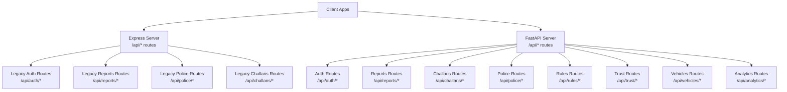
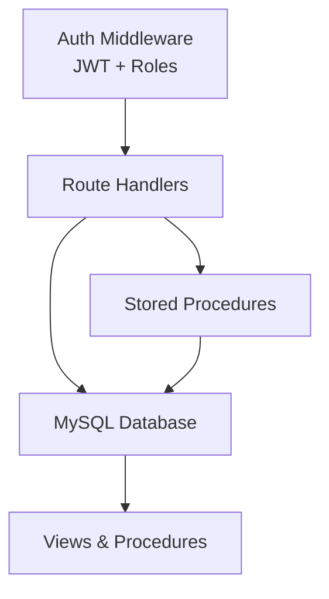

# API Endpoints

<cite>
**Referenced Files in This Document**
- [server.js](file://backend/server.js)
- [auth.js](file://backend/routes/auth.js)
- [reports.js](file://backend/routes/reports.js)
- [challans.js](file://backend/routes/challans.js)
- [police.js](file://backend/routes/police.js)
- [auth.js](file://backend/middleware/auth.js)
- [auth.py](file://server/routes/auth.py)
- [reports.py](file://server/routes/reports.py)
- [challans.py](file://server/routes/challans.py)
- [police.py](file://server/routes/police.py)
- [rules.py](file://server/routes/rules.py)
- [trust.py](file://server/routes/trust.py)
- [vehicles.py](file://server/routes/vehicles.py)
- [analytics.py](file://server/routes/analytics.py)
</cite>

## Table of Contents
1. [Introduction](#introduction)
2. [Project Structure](#project-structure)
3. [Core Components](#core-components)
4. [Architecture Overview](#architecture-overview)
5. [Detailed Component Analysis](#detailed-component-analysis)
6. [Dependency Analysis](#dependency-analysis)
7. [Performance Considerations](#performance-considerations)
8. [Troubleshooting Guide](#troubleshooting-guide)
9. [Conclusion](#conclusion)

## Introduction
This document provides comprehensive API documentation for the Traffic Violation Management System. It covers FastAPI endpoints for authentication, report management, challan processing, police operations, analytics, vehicle registration/search, rules management, and trust score operations. For each endpoint, you will find HTTP methods, URL patterns, request/response schemas, authentication requirements, validation rules, error responses, example requests/responses, status codes, and security considerations. Rate limiting and API versioning strategies are also documented.

## Project Structure
The system consists of:
- A legacy Express.js server exposing health checks and routing to backend modules.
- A FastAPI server under the server/ directory implementing the majority of endpoints.

**Diagram sources**
- [server.js:10-26](file://backend/server.js#L10-L26)
- [auth.js:1-117](file://backend/routes/auth.js#L1-L117)
- [reports.js:1-54](file://backend/routes/reports.js#L1-L54)
- [police.js:1-109](file://backend/routes/police.js#L1-L109)
- [challans.js:1-101](file://backend/routes/challans.js#L1-L101)

**Section sources**
- [server.js:10-42](file://backend/server.js#L10-L42)

## Core Components
- Authentication (legacy Express and FastAPI):
  - Login and profile retrieval for citizens and police.
  - Token-based access control with role checks.
- Report Management:
  - Submission, viewing, updating, and deletion of reports.
  - Evidence upload for reports.
- Challan Processing:
  - Challan creation, viewing, payment, and deletion.
- Police Operations:
  - Pending reports dashboard, verification/rejection, violation rules, and performance metrics.
- Analytics:
  - Dashboard summaries, leaderboards, citizen analytics, system analytics, violation types, recent activity, and status trends.
- Vehicle Registration/Search:
  - Vehicle search by plate number and violation history.
- Rules Management:
  - CRUD operations for violation rules.
- Trust Score Operations:
  - Trust history and current score retrieval, and overdue challan flagging.

**Section sources**
- [auth.js:1-117](file://backend/routes/auth.js#L1-L117)
- [auth.py:114-491](file://server/routes/auth.py#L114-L491)
- [reports.js:1-54](file://backend/routes/reports.js#L1-L54)
- [reports.py:147-563](file://server/routes/reports.py#L147-L563)
- [challans.js:1-101](file://backend/routes/challans.js#L1-L101)
- [challans.py:47-450](file://server/routes/challans.py#L47-L450)
- [police.js:1-109](file://backend/routes/police.js#L1-L109)
- [police.py:25-220](file://server/routes/police.py#L25-L220)
- [rules.py:58-377](file://server/routes/rules.py#L58-L377)
- [trust.py:15-134](file://server/routes/trust.py#L15-L134)
- [vehicles.py:36-145](file://server/routes/vehicles.py#L36-L145)
- [analytics.py:36-526](file://server/routes/analytics.py#L36-L526)

## Architecture Overview
The FastAPI server exposes modular routes grouped by domain. Authentication middleware enforces role-based access control. Several endpoints rely on stored procedures and database views for complex workflows.

```mermaid
graph TB
subgraph "Authentication"
A1["POST /api/auth/login"]
A2["GET /api/auth/me"]
A3["POST /api/auth/citizen/register"]
A4["POST /api/auth/citizen/login"]
A5["POST /api/auth/police/register"]
A6["POST /api/auth/police/login"]
A7["GET /api/auth/profile"]
A8["PUT /api/auth/profile"]
end
subgraph "Reports"
R1["POST /api/reports"]
R2["GET /api/reports/my"]
R3["POST /api/reports/create"]
R4["GET /api/reports/my-reports/{citizen_id}"]
R5["PUT /api/reports/update/{report_id}"]
R6["DELETE /api/reports/delete/{report_id}"]
R7["GET /api/reports/police/pending"]
R8["PUT /api/reports/police/process/{report_id}"]
R9["POST /api/reports/upload-evidence/{report_id}"]
end
subgraph "Challans"
C1["GET /api/challans/my"]
C2["POST /api/challans/pay"]
C3["POST /api/challans/create"]
C4["GET /api/challans/citizen/{citizen_id}"]
C5["GET /api/challans/my"]
C6["GET /api/challans/report/{report_id}"]
C7["PUT /api/challans/pay/{challan_id}"]
C8["DELETE /api/challans/{challan_id}"]
end
subgraph "Police"
P1["GET /api/police/pending"]
P2["PATCH /api/police/verify/{report_id}"]
P3["PATCH /api/police/reject/{report_id}"]
P4["GET /api/police/rules"]
P5["GET /api/police/performance"]
end
subgraph "Rules"
K1["GET /api/rules/all"]
K2["GET /api/rules/{rule_id}"]
K3["PUT /api/rules/{rule_id}"]
K4["POST /api/rules/create"]
K5["DELETE /api/rules/{rule_id}"]
end
subgraph "Trust & History"
T1["GET /api/trust/history/{citizen_id}"]
T2["GET /api/trust/current/{citizen_id}"]
T3["POST /api/trust/flag-overdue"]
end
subgraph "Vehicles"
V1["GET /api/vehicles/search/{plate_no}"]
end
subgraph "Analytics"
S1["GET /api/analytics/summary"]
S2["GET /api/analytics/police-summary"]
S3["GET /api/analytics/leaderboard"]
S4["GET /api/analytics/citizen/{citizen_id}"]
S5["GET /api/analytics/system"]
S6["GET /api/analytics/violation-types"]
S7["GET /api/analytics/recent-activity"]
S8["GET /api/analytics/status-trend"]
end
A1 --> R1
A2 --> R2
A3 --> R3
A4 --> R4
A5 --> R5
A6 --> R6
A7 --> R7
A8 --> R8
R1 --> C1
R2 --> C2
R3 --> C3
R4 --> C4
R5 --> C5
R6 --> C6
R7 --> C7
R8 --> C8
P1 --> K1
P2 --> K2
P3 --> K3
P4 --> K4
P5 --> K5
T1 --> V1
T2 --> S1
T3 --> S2
```

**Diagram sources**
- [auth.js:9-116](file://backend/routes/auth.js#L9-L116)
- [auth.py:114-491](file://server/routes/auth.py#L114-L491)
- [reports.js:7-51](file://backend/routes/reports.js#L7-L51)
- [reports.py:147-563](file://server/routes/reports.py#L147-L563)
- [challans.js:7-98](file://backend/routes/challans.js#L7-L98)
- [challans.py:47-450](file://server/routes/challans.py#L47-L450)
- [police.js:7-106](file://backend/routes/police.js#L7-L106)
- [police.py:25-220](file://server/routes/police.py#L25-L220)
- [rules.py:58-377](file://server/routes/rules.py#L58-L377)
- [trust.py:15-134](file://server/routes/trust.py#L15-L134)
- [vehicles.py:36-145](file://server/routes/vehicles.py#L36-L145)
- [analytics.py:36-526](file://server/routes/analytics.py#L36-L526)

## Detailed Component Analysis

### Authentication Endpoints
- Legacy Express Auth
  - POST /api/auth/login
    - Role-based login supporting citizen and police roles.
    - Request body: email, password, role.
    - Response: token and user profile; includes trust_score for citizens and badge_number/station for police.
    - Errors: 400 invalid role, 401 invalid credentials, 500 server error.
    - Security: JWT signed with secret; requires role-specific table lookup.
  - GET /api/auth/me
    - Requires Authorization header with Bearer token.
    - Returns user profile based on token payload.
    - Errors: 401 no token, 403 invalid/expired token, 404 user not found.

- FastAPI Auth
  - POST /api/auth/citizen/register
    - Request body: full_name, email, phone_no, password, confirm_password, plate_no, vehicle_type, vehicle_model.
    - Response: registration success with citizen_id and role.
    - Validation: passwords must match and be at least 6 characters; unique email; inserts vehicle record.
    - Errors: 400 validation failures, 409 conflict if email exists, 500 internal error.
  - POST /api/auth/citizen/login
    - Request body: email, password.
    - Response: access_token, user profile with trust_score.
    - Validation: account must be Active.
    - Errors: 401 invalid credentials, 403 forbidden if inactive, 500 internal error.
  - POST /api/auth/police/register
    - Request body: full_name, email, phone_no, password, confirm_password.
    - Response: badge_no, role, and profile details.
    - Validation: password match and minimum length; auto-generates badge_no.
    - Errors: 400 validation, 409 conflict if email exists, 500 internal error.
  - POST /api/auth/police/login
    - Request body: email, password.
    - Response: access_token, user profile with badge_number, station, rank.
    - Validation: officer must be active.
    - Errors: 401 invalid credentials, 403 forbidden if inactive, 500 internal error.
  - GET /api/auth/profile
    - Requires Authorization: Bearer token.
    - Returns full profile based on role.
    - Errors: 401 missing/invalid/expired token, 404 user not found, 500 internal error.
  - PUT /api/auth/profile
    - Dynamic update for citizen or police profiles.
    - Request body: patch fields (e.g., full_name, phone_no, reward_points for citizens).
    - Errors: 400 no valid fields, 401 unauthorized, 404 user not found, 500 internal error.

Example request (POST /api/auth/citizen/register):
- Headers: Content-Type: application/json
- Body: { "full_name": "...", "email": "...", "password": "...", "confirm_password": "...", "plate_no": "...", "vehicle_type": "..." }

Example response (POST /api/auth/citizen/login):
- 200 OK: { "access_token": "...", "token_type": "bearer", "user": { "id": "...", "full_name": "...", "email": "...", "role": "citizen", "trust_score": 50 } }

Common errors:
- 400 Bad Request: validation failures, invalid role, invalid status transitions.
- 401 Unauthorized: missing/invalid/expired tokens or credentials.
- 403 Forbidden: insufficient permissions or inactive accounts.
- 404 Not Found: user/report/challan/rule not found.
- 409 Conflict: duplicate email.
- 422 Unprocessable Entity: schema mismatches (FastAPI).
- 500 Internal Server Error: unexpected database or server errors.

Security considerations:
- JWT tokens are signed and validated centrally.
- Role guards enforce access to protected endpoints.
- Passwords are hashed using bcrypt; verification runs off the main thread.

**Section sources**
- [auth.js:9-116](file://backend/routes/auth.js#L9-L116)
- [auth.js:1-37](file://backend/middleware/auth.js#L1-L37)
- [auth.py:114-491](file://server/routes/auth.py#L114-L491)

### Report Management Endpoints
- Legacy Express Reports
  - POST /api/reports
    - Citizen-only endpoint to submit a report.
    - Request body: plate_number, latitude, longitude, image_url, description.
    - Response: report_id and success message.
    - Errors: 400 missing fields, 500 failure to submit.
  - GET /api/reports/my
    - Citizen-only endpoint to fetch their reports.
    - Response: array of reports ordered by reported_at descending.

- FastAPI Reports
  - POST /api/reports/create
    - Creates a report and ensures vehicle exists (inserts if missing).
    - Request body: citizen_id, plate_no, violation_type, location_coords, location_address, description, evidence_path.
    - Response: report_id, status, and whether vehicle was created.
    - Errors: 500 internal error on commit/failure.
  - GET /api/reports/my-reports/{citizen_id}
    - Fetches all reports for a given citizen.
    - Response: count and reports array with timestamps serialized.
  - PUT /api/reports/update/{report_id}
    - Updates a Pending report with provided fields.
    - Request body: plate_no, location_coords, location_address, description.
    - Errors: 404 not found, 400 if not Pending, 400 no fields to update.
  - DELETE /api/reports/delete/{report_id}
    - Deletes a Pending report.
    - Errors: 404 not found, 400 if not Pending.
  - GET /api/reports/police/pending
    - Fetches all pending reports with reporter details via JOIN.
    - Response: count and reports array.
  - PUT /api/reports/police/process/{report_id}
    - Updates report status to Verified or Rejected.
    - Request body: status, rule_id (optional), badge_no (optional).
    - Errors: 400 invalid status, 500 internal error.
  - POST /api/reports/upload-evidence/{report_id}
    - Uploads evidence image (JPEG/PNG up to 5MB).
    - Response: evidence_path saved.
    - Errors: 400 invalid type/size, 404 report not found, 500 internal error.

Example request (POST /api/reports/create):
- Body: { "citizen_id": 123, "plate_no": "ABC123", "violation_type": "Speeding", "description": "Observed speeding at 80km/h." }

Example response (GET /api/reports/my-reports/{citizen_id}):
- 200 OK: { "message": "...", "count": 2, "reports": [ {...}, {...} ] }

Validation rules:
- Reports must be Pending to update or delete.
- Evidence upload restricted to allowed types and size limits.
- Status transitions enforced to Verified or Rejected by police.

**Section sources**
- [reports.js:7-51](file://backend/routes/reports.js#L7-L51)
- [reports.py:147-563](file://server/routes/reports.py#L147-L563)

### Challan Processing Endpoints
- Legacy Express Challans
  - GET /api/challans/my
    - Citizen-only endpoint to fetch their challans with rule and issuing officer details.
  - POST /api/challans/pay
    - Citizen-only endpoint to pay a challan with row-level locking to prevent race conditions.
    - Request body: challan_id.
    - Response: amount_paid, paid_at, and success message.
    - Errors: 400 missing challan_id, 404 not found, 403 unauthorized, 409 already paid, 500 payment failure.

- FastAPI Challans
  - POST /api/challans/create
    - Creates a VIOLATION_EVENT and CHALLAN; links to violator or reporter if needed.
    - Request body: report_id, rule_id, badge_no, total_amount, notes.
    - Response: challan_id, event_id, plate_no, total_amount, due_date.
    - Errors: 404 report not found, 400 report already verified, 500 internal error.
  - GET /api/challans/citizen/{citizen_id}
    - Fetches all challans for a citizen with rule and report details.
  - GET /api/challans/my
    - Fetches logged-in citizen’s challans (alternative path).
  - GET /api/challans/report/{report_id}
    - Retrieves report details with violator/reporter info for challan creation.
  - PUT /api/challans/pay/{challan_id}
    - Updates payment status to Paid and sets paid_at and transaction_ref.
    - Errors: 404 not found, 400 already paid, 500 internal error.
  - DELETE /api/challans/{challan_id}
    - Deletes a challan (police only).
    - Errors: 404 not found, 500 internal error.

Example request (POST /api/challans/pay):
- Body: { "challan_id": 456 }

Example response (POST /api/challans/create):
- 200 OK: { "message": "...", "challan_id": 789, "event_id": 101, "total_amount": 2500.00, "due_date": "YYYY-MM-DD" }

Security and validation:
- Row-level locks during payment ensure atomicity.
- Stored procedures invoked for verified/rejected reports to maintain auditability.

**Section sources**
- [challans.js:7-98](file://backend/routes/challans.js#L7-L98)
- [challans.py:47-450](file://server/routes/challans.py#L47-L450)

### Police Operations Endpoints
- GET /api/police/pending
  - Fetches pending reports from a dashboard view.
  - Errors: 500 internal error.
- PATCH /api/police/verify/{report_id}
  - Verifies a report and issues a challan via stored procedure.
  - Request body: rule_id.
  - Errors: 400 missing rule_id, 404 not found or already processed, 500 failure.
- PATCH /api/police/reject/{report_id}
  - Rejects a report; updates status to Rejected.
  - Errors: 404 not found or already processed, 500 failure.
- GET /api/police/rules
  - Fetches active violation rules ordered by severity.
- GET /api/police/performance
  - Fetches officer performance statistics from a view filtered by badge_no.

Example request (PATCH /api/police/verify/{report_id}):
- Body: { "rule_id": 10 }

Example response (PATCH /api/police/verify/{report_id}):
- 200 OK: { "message": "...", "challan_id": 789, "report_id": 123 }

Validation:
- rule_id must be valid; report must be Pending.
- Stored procedures manage trust score triggers and audit logs.

**Section sources**
- [police.js:7-106](file://backend/routes/police.js#L7-L106)
- [police.py:25-220](file://server/routes/police.py#L25-L220)

### Analytics Endpoints
- GET /api/analytics/summary
  - Dashboard summary counts for reports, challans, payments, revenue, and system totals.
- GET /api/analytics/police-summary
  - Police dashboard counts for processed, pending, verified, rejected, fines collected, and active challans.
- GET /api/analytics/leaderboard
  - Top 50 citizens by trust_score and reward_points.
- GET /api/analytics/citizen/{citizen_id}
  - Personal analytics for a citizen: total reports, statuses, and trust_score.
- GET /api/analytics/system
  - Global system analytics for police/admin.
- GET /api/analytics/violation-types
  - Violation type distribution.
- GET /api/analytics/recent-activity
  - Recent report activity with optional limit.
- GET /api/analytics/status-trend
  - Daily report status trend for the last 7 days.

Response pattern:
- 200 OK with message, data, and optionally count.

**Section sources**
- [analytics.py:36-526](file://server/routes/analytics.py#L36-L526)

### Vehicle Registration/Search Endpoints
- GET /api/vehicles/search/{plate_no}
  - Searches vehicle by plate number and returns violation history with challan details.
  - Includes summary statistics: total violations, unpaid challans, total unpaid amount.
  - Errors: 404 not found, 500 internal error.

Example response:
- 200 OK: { "message": "...", "vehicle": {...}, "summary": {...}, "violations": [...] }

**Section sources**
- [vehicles.py:36-145](file://server/routes/vehicles.py#L36-L145)

### Rules Management Endpoints
- GET /api/rules/all
  - Fetches all violation rules ordered by rule_code.
- GET /api/rules/{rule_id}
  - Fetches a specific rule.
- PUT /api/rules/{rule_id}
  - Updates rule attributes with validation for severity and violation_time.
- POST /api/rules/create
  - Creates a new rule with validation and uniqueness of rule_code.
- DELETE /api/rules/{rule_id}
  - Deletes a rule.

Validation:
- Severity must be Minor/Moderate/Major/Critical.
- Violation time must be Daytime/Nighttime/Anytime.
- rule_code must be unique.

**Section sources**
- [rules.py:58-377](file://server/routes/rules.py#L58-L377)

### Trust Score Operations Endpoints
- GET /api/trust/history/{citizen_id}
  - Fetches trust score history from a view; only accessible by the citizen themselves.
  - Errors: 403 forbidden if accessing another’s history, 500 internal error.
- GET /api/trust/current/{citizen_id}
  - Fetches current trust score and related details; only accessible by the citizen.
  - Errors: 403 forbidden, 404 not found, 500 internal error.
- POST /api/trust/flag-overdue
  - Manually triggers overdue challan flagging procedure (police only).
  - Errors: 500 internal error.

**Section sources**
- [trust.py:15-134](file://server/routes/trust.py#L15-L134)

## Dependency Analysis
Key dependencies and relationships:
- Authentication middleware enforces role-based access across endpoints.
- Stored procedures (sp_issue_challan, sp_reject_report, sp_flag_overdue_challans) centralize business logic and audit.
- Database views (Pending_Reports_Dashboard, Officer_Performance_View, Citizen_Trust_History) simplify reporting and analytics.
- Row-level locking in payment endpoints prevents race conditions.

**Diagram sources**
- [auth.js:5-34](file://backend/middleware/auth.js#L5-L34)
- [police.py:63-81](file://server/routes/police.py#L63-L81)
- [trust.py:113-121](file://server/routes/trust.py#L113-L121)

**Section sources**
- [auth.js:5-34](file://backend/middleware/auth.js#L5-L34)
- [police.py:63-81](file://server/routes/police.py#L63-L81)
- [trust.py:113-121](file://server/routes/trust.py#L113-L121)

## Performance Considerations
- Row-level locking during payment reduces contention but requires careful transaction handling.
- Stored procedures encapsulate complex logic and reduce client-side retries.
- Views pre-aggregate data for dashboards and leaderboards to minimize query complexity.
- File uploads are validated and saved locally; consider CDN or blob storage for scalability.

## Troubleshooting Guide
Common issues and resolutions:
- Authentication failures:
  - Ensure Authorization header includes Bearer token.
  - Verify token is unexpired and matches the user’s role.
- Report operations:
  - Only Pending reports can be updated/deleted.
  - Evidence uploads must be JPEG/PNG and under 5MB.
- Challan payments:
  - Ensure challan belongs to the logged-in citizen.
  - Prevent concurrent payments using row-level locks.
- Stored procedure errors:
  - Check OUT parameters for detailed messages.
  - Confirm rule_id validity and report status.
- Database connectivity:
  - Validate DB_CONFIG settings and network access.
  - Use timeouts configured in route modules.

**Section sources**
- [challans.py:336-397](file://server/routes/challans.py#L336-L397)
- [reports.py:274-354](file://server/routes/reports.py#L274-L354)
- [police.py:73-93](file://server/routes/police.py#L73-L93)

## Conclusion
This API documentation consolidates endpoints across legacy and modern implementations, detailing HTTP methods, schemas, authentication, validation, and error handling. Adhering to role-based access control, stored procedures, and views ensures robustness and auditability. For production deployments, consider adding rate limiting, API versioning, and centralized OpenAPI/Swagger documentation.