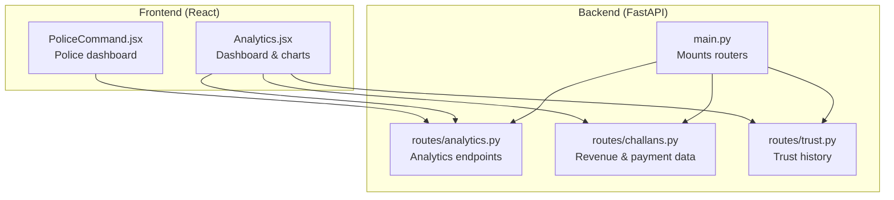
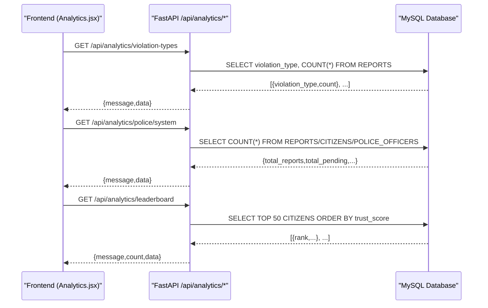
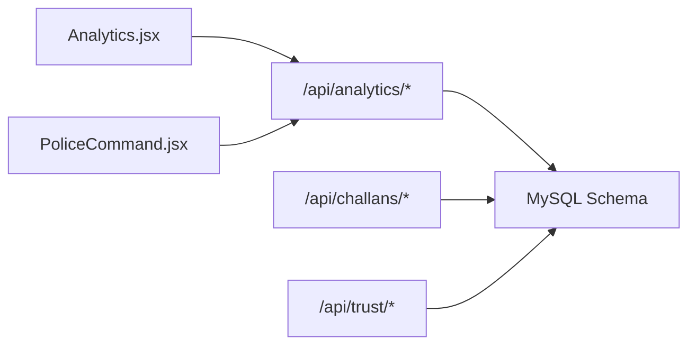

# Analytics and Data Endpoints

<cite>
**Referenced Files in This Document**
- [analytics.py](file://server/routes/analytics.py)
- [main.py](file://server/main.py)
- [Analytics.jsx](file://frontend/src/pages/Analytics.jsx)
- [schema.sql](file://db/schema.sql)
- [challans.py](file://server/routes/challans.py)
- [PoliceCommand.jsx](file://frontend/src/pages/PoliceCommand.jsx)
- [trust.py](file://server/routes/trust.py)
</cite>

## Table of Contents
1. [Introduction](#introduction)
2. [Project Structure](#project-structure)
3. [Core Components](#core-components)
4. [Architecture Overview](#architecture-overview)
5. [Detailed Component Analysis](#detailed-component-analysis)
6. [Dependency Analysis](#dependency-analysis)
7. [Performance Considerations](#performance-considerations)
8. [Troubleshooting Guide](#troubleshooting-guide)
9. [Conclusion](#conclusion)

## Introduction
This document provides comprehensive API documentation for analytics and data visualization endpoints in the Traffic Violation Management System. It focuses on:
- Real-time dashboard summaries
- Traffic violation statistics
- Trust score distributions
- Revenue reports
- Integration with frontend visualization components

It covers HTTP methods, query parameters, response formats, and chart-ready data structures. It also outlines filtering capabilities via date ranges and geographic boundaries, and demonstrates how frontend components consume and render analytics data.

## Project Structure
The analytics endpoints are exposed by a FastAPI application and mounted under the /api/analytics prefix. The frontend integrates with these endpoints to render charts and tables.

**Diagram sources**
- [main.py:78](file://server/main.py#L78)
- [analytics.py:1-526](file://server/routes/analytics.py#L1-L526)
- [challans.py:1-450](file://server/routes/challans.py#L1-L450)
- [trust.py:1-134](file://server/routes/trust.py#L1-L134)
- [Analytics.jsx:1-271](file://frontend/src/pages/Analytics.jsx#L1-L271)
- [PoliceCommand.jsx:1-146](file://frontend/src/pages/PoliceCommand.jsx#L1-L146)

**Section sources**
- [main.py:78](file://server/main.py#L78)
- [Analytics.jsx:32-50](file://frontend/src/pages/Analytics.jsx#L32-L50)
- [PoliceCommand.jsx:24-42](file://frontend/src/pages/PoliceCommand.jsx#L24-L42)

## Core Components
This section documents the analytics endpoints and their request/response contracts.

- Base URL: http://localhost:5000
- Prefix: /api/analytics
- Authentication: Not specified in analytics endpoints; ensure appropriate middleware is configured at the application level.

### Dashboard Summaries
- GET /api/analytics/summary
  - Purpose: Global system summary for administrators.
  - Response fields:
    - message: string
    - data.reports.pending, verified, rejected, total: integers
    - data.challans.total, paid, unpaid, total_revenue: integers/floats
    - data.system.total_citizens, total_vehicles: integers
  - Example usage: Frontend displays summary cards and revenue KPIs.

- GET /api/analytics/police-summary
  - Purpose: Real-time stats for police dashboards.
  - Response fields:
    - message: string
    - data.total_processed, pending_count, verified_count, rejected_count: integers
    - data.fines_collected: float
    - data.active_challans: integer
  - Example usage: Command center cards for processed/rejected counts and revenue.

- GET /api/analytics/police/system
  - Purpose: System-wide analytics for police/admin.
  - Response fields:
    - message: string
    - data.total_reports, total_pending, total_verified, total_rejected: integers
    - data.total_citizens, total_police: integers

**Section sources**
- [analytics.py:36-125](file://server/routes/analytics.py#L36-L125)
- [analytics.py:127-202](file://server/routes/analytics.py#L127-L202)
- [analytics.py:332-395](file://server/routes/analytics.py#L332-L395)

### Personalized Analytics
- GET /api/analytics/citizen/{citizen_id}
  - Purpose: Personal analytics for a specific citizen.
  - Path parameter:
    - citizen_id: integer
  - Response fields:
    - message: string
    - data.total_reports, total_pending, total_verified, total_rejected: integers
    - data.trust_score: integer
  - Notes: Role-based access is enforced in the frontend; ensure backend authorization aligns.

**Section sources**
- [analytics.py:257-329](file://server/routes/analytics.py#L257-L329)

### Violation Statistics
- GET /api/analytics/violation-types
  - Purpose: Violation type distribution for pie charts.
  - Response fields:
    - message: string
    - data: array of objects
      - violation_type: string
      - count: integer
  - Notes: Data grouped by actual violation types (not report status).

- GET /api/analytics/status-trend
  - Purpose: Daily report status trend for the last 7 days.
  - Response fields:
    - message: string
    - data: array of objects
      - date: ISO date string
      - status: enum string
      - count: integer

- GET /api/analytics/recent-activity
  - Purpose: Recent report activity feed.
  - Query parameter:
    - limit: integer (default 10)
  - Response fields:
    - message: string
    - data: array of objects
      - report_id: integer
      - violation_type: string
      - status: enum string
      - reported_at: ISO datetime string
      - reporter_name: string

- GET /api/analytics/leaderboard
  - Purpose: Top 50 citizens by trust score.
  - Response fields:
    - message: string
    - count: integer
    - data: array of objects
      - citizen_id: integer
      - full_name: string
      - email: string
      - trust_score: integer
      - reward_points: integer
      - created_at: ISO datetime string
      - rank: integer (added client-side)

**Section sources**
- [analytics.py:398-435](file://server/routes/analytics.py#L398-L435)
- [analytics.py:484-526](file://server/routes/analytics.py#L484-L526)
- [analytics.py:438-482](file://server/routes/analytics.py#L438-L482)
- [analytics.py:205-254](file://server/routes/analytics.py#L205-L254)

### Trust Score Distributions and History
- GET /api/trust/history/{citizen_id}
  - Purpose: Historical trust score changes for a citizen.
  - Response fields:
    - Array of objects with:
      - history_id: integer
      - citizen_id: integer
      - full_name: string
      - trust_score: integer
      - reward_points: integer
      - account_status: enum string
      - valid_from/valid_to/changed_at: ISO datetime strings
      - operation_type: enum string
      - changed_by: string

- GET /api/trust/current/{citizen_id}
  - Purpose: Current trust score and profile snapshot.
  - Response fields:
    - citizen_id: integer
    - full_name: string
    - trust_score: integer
    - reward_points: integer
    - account_status: enum string

**Section sources**
- [trust.py:15-60](file://server/routes/trust.py#L15-L60)
- [trust.py:63-101](file://server/routes/trust.py#L63-L101)

### Revenue Reports
- GET /api/analytics/police-summary
  - Includes total fines collected (fines_collected) suitable for revenue dashboards.

- GET /api/analytics/police/system
  - Includes total_citizens and total_police useful for cohort-based revenue modeling.

- GET /api/challans/citizen/{citizen_id}
  - Purpose: Detailed challan history for a citizen, including amounts and statuses.
  - Response fields:
    - message: string
    - count: integer
    - challans: array of objects with:
      - challan_id: integer
      - total_amount: number
      - payment_status: enum string
      - issue_date/due_date/paid_at: ISO date/datetime strings
      - rule_name/rule_code: strings
      - plate_no/event_timestamp: strings
      - location_address/violation_description: strings

**Section sources**
- [analytics.py:127-202](file://server/routes/analytics.py#L127-L202)
- [analytics.py:332-395](file://server/routes/analytics.py#L332-L395)
- [challans.py:141-206](file://server/routes/challans.py#L141-L206)

## Architecture Overview
The analytics pipeline connects frontend visualization components to backend endpoints, which query the database schema and views to produce chart-ready datasets.

**Diagram sources**
- [Analytics.jsx:46-50](file://frontend/src/pages/Analytics.jsx#L46-L50)
- [analytics.py:398-435](file://server/routes/analytics.py#L398-L435)
- [analytics.py:332-395](file://server/routes/analytics.py#L332-L395)
- [analytics.py:205-254](file://server/routes/analytics.py#L205-L254)

## Detailed Component Analysis

### Endpoint Catalog and Contracts
- GET /api/analytics/summary
  - Response shape: { message: string, data: { reports, challans, system } }
  - Use cases: Admin dashboard KPIs, revenue totals.

- GET /api/analytics/police-summary
  - Response shape: { message: string, data: { total_processed, pending_count, verified_count, rejected_count, fines_collected, active_challans } }
  - Use cases: Command center real-time stats.

- GET /api/analytics/police/system
  - Response shape: { message: string, data: { total_reports, total_pending, total_verified, total_rejected, total_citizens, total_police } }
  - Use cases: System-wide reporting and leaderboards.

- GET /api/analytics/citizen/{citizen_id}
  - Response shape: { message: string, data: { total_reports, total_pending, total_verified, total_rejected, trust_score } }
  - Use cases: Personal analytics and trust score display.

- GET /api/analytics/violation-types
  - Response shape: { message: string, data: [{ violation_type, count }] }
  - Use cases: Pie charts and violation breakdowns.

- GET /api/analytics/status-trend
  - Response shape: { message: string, data: [{ date, status, count }] }
  - Use cases: Line/bar charts for weekly trends.

- GET /api/analytics/recent-activity?limit=N
  - Response shape: { message: string, data: [{ report_id, violation_type, status, reported_at, reporter_name }] }
  - Use cases: Activity feeds and audit trails.

- GET /api/analytics/leaderboard
  - Response shape: { message: string, count: number, data: [{ citizen_id, full_name, email, trust_score, reward_points, created_at, rank }] }
  - Use cases: Leaderboards and trust rankings.

- GET /api/trust/history/{citizen_id}
  - Response shape: Array of historical records with timestamps and operation types.
  - Use cases: Trust score history charts.

- GET /api/trust/current/{citizen_id}
  - Response shape: { citizen_id, full_name, trust_score, reward_points, account_status }
  - Use cases: Personal trust score display.

- GET /api/challans/citizen/{citizen_id}
  - Response shape: { message: string, count: number, challans: [...] }
  - Use cases: Revenue and payment status dashboards.

**Section sources**
- [analytics.py:36-125](file://server/routes/analytics.py#L36-L125)
- [analytics.py:127-202](file://server/routes/analytics.py#L127-L202)
- [analytics.py:332-395](file://server/routes/analytics.py#L332-L395)
- [analytics.py:257-329](file://server/routes/analytics.py#L257-L329)
- [analytics.py:398-435](file://server/routes/analytics.py#L398-L435)
- [analytics.py:484-526](file://server/routes/analytics.py#L484-L526)
- [analytics.py:438-482](file://server/routes/analytics.py#L438-L482)
- [trust.py:15-60](file://server/routes/trust.py#L15-L60)
- [trust.py:63-101](file://server/routes/trust.py#L63-L101)
- [challans.py:141-206](file://server/routes/challans.py#L141-L206)

### Filtering and Date Range Support
- Current endpoints support:
  - limit parameter for recent activity
  - Built-in weekly trend filtering for status-trend
- Recommended enhancements (future):
  - Add date range filters (start_date, end_date) to status-trend and recent-activity
  - Add geographic filters (bbox/coordinates) to violation-type breakdowns
  - Add violation-type filters to leaderboard and system analytics

Note: Implement these at the query layer to maintain performance and avoid heavy client-side filtering.

### Chart-Ready Data Structures
- Violation Types (pie chart):
  - Input: [{ violation_type, count }]
  - Transformation: [{ name: violation_type, value: count }]

- Status Trend (line/bar):
  - Input: [{ date, status, count }]
  - Transformation: Normalize dates and group by status for stacked series

- Leaderboard:
  - Input: [{ trust_score, reward_points, created_at, ... }]
  - Transformation: Add rank and convert timestamps to ISO strings

- Trust History:
  - Input: [{ trust_score, valid_from, valid_to, operation_type, changed_at, ... }]
  - Transformation: Sort by valid_from desc, convert timestamps to ISO strings

**Section sources**
- [Analytics.jsx:67-71](file://frontend/src/pages/Analytics.jsx#L67-L71)
- [Analytics.jsx:59-65](file://frontend/src/pages/Analytics.jsx#L59-L65)
- [Analytics.jsx:249-260](file://frontend/src/pages/Analytics.jsx#L249-L260)
- [trust.py:32-53](file://server/routes/trust.py#L32-L53)

### Frontend Integration Examples
- Analytics page:
  - Fetches role-specific analytics and violation types
  - Renders bar chart for report status distribution
  - Renders pie chart for violation types
  - Renders a table with percentages

- Police command dashboard:
  - Fetches real-time stats from /api/analytics/police-summary
  - Displays processed, pending, verified, rejected, fines collected, active challans

**Section sources**
- [Analytics.jsx:19-57](file://frontend/src/pages/Analytics.jsx#L19-L57)
- [Analytics.jsx:196-264](file://frontend/src/pages/Analytics.jsx#L196-L264)
- [PoliceCommand.jsx:20-46](file://frontend/src/pages/PoliceCommand.jsx#L20-L46)

## Dependency Analysis
- Backend routing:
  - main.py mounts analytics, challans, trust, and other routers under /api/*
- Database schema:
  - Views and tables support analytics queries (REPORTS, CHALLANS, CITIZENS, VIOLATION_RULES)
- Frontend:
  - Analytics.jsx consumes analytics endpoints and renders charts
  - PoliceCommand.jsx consumes police-summary endpoint

**Diagram sources**
- [main.py:78](file://server/main.py#L78)
- [Analytics.jsx:32-50](file://frontend/src/pages/Analytics.jsx#L32-L50)
- [PoliceCommand.jsx:24-42](file://frontend/src/pages/PoliceCommand.jsx#L24-L42)

**Section sources**
- [main.py:78](file://server/main.py#L78)
- [schema.sql:764-840](file://db/schema.sql#L764-L840)

## Performance Considerations
- Indexes and views:
  - REPORTS and CHALLANS tables include indexes on status, dates, and foreign keys to optimize analytics queries.
  - Views like Pending_Reports_Dashboard and Citizen_Challan_Summary pre-aggregate data for dashboards.
- Recommendations:
  - Add composite indexes for frequent filter combinations (e.g., status + date_reported).
  - Consider materialized summaries for high-cardinality metrics.
  - Paginate leaderboard and recent activity for large datasets.
  - Cache frequently accessed endpoints (e.g., system summaries) with short TTLs.

[No sources needed since this section provides general guidance]

## Troubleshooting Guide
- Connection failures:
  - Verify database connectivity and credentials in analytics endpoints.
  - Check timeout configurations and network access.

- Missing data:
  - Confirm that REPORTS, CHALLANS, and CITIZENS tables are populated.
  - Validate that views exist and are up-to-date.

- Authorization:
  - Ensure role-based access controls are enforced for citizen-specific endpoints.
  - For trust history and current trust score, restrict access to the owning citizen.

- Frontend errors:
  - Check API_BASE_URL and CORS configuration.
  - Inspect network tab for 4xx/5xx responses and error messages.

**Section sources**
- [analytics.py:24-33](file://server/routes/analytics.py#L24-L33)
- [trust.py:24-29](file://server/routes/trust.py#L24-L29)
- [Analytics.jsx:52-56](file://frontend/src/pages/Analytics.jsx#L52-L56)

## Conclusion
The analytics and data visualization endpoints provide a solid foundation for real-time dashboards, violation statistics, trust score tracking, and revenue reporting. By leveraging the existing database schema, views, and frontend components, teams can extend filtering capabilities, improve caching, and enhance visualizations to meet operational needs.