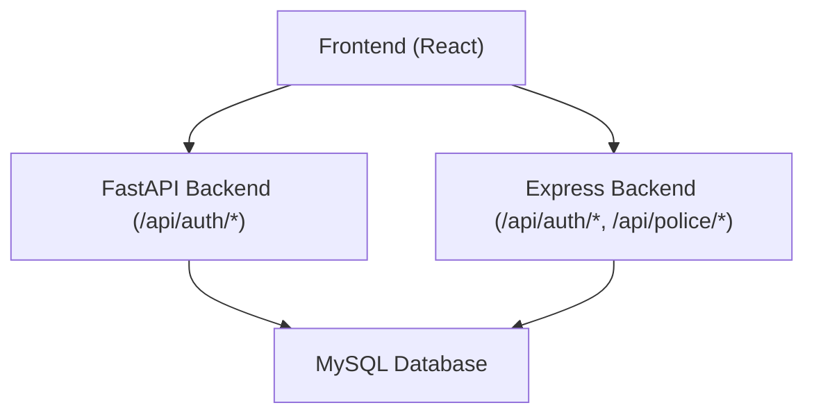
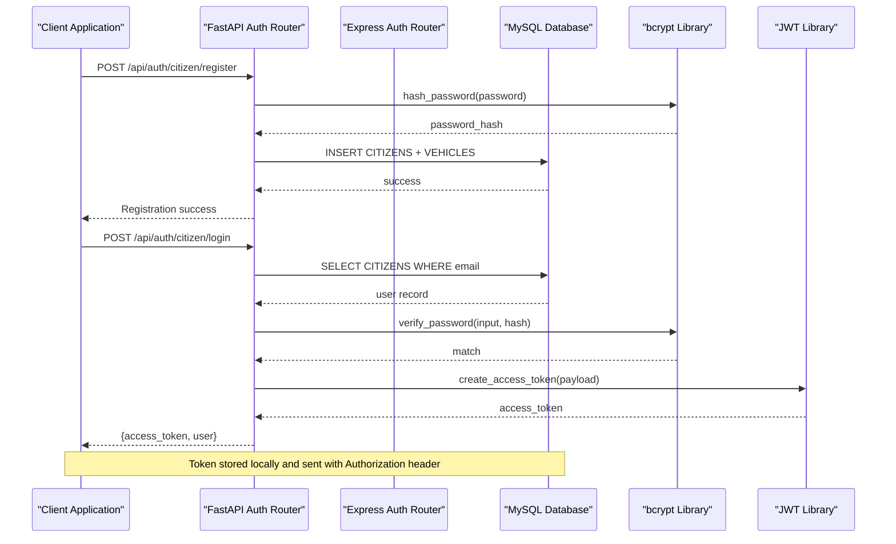
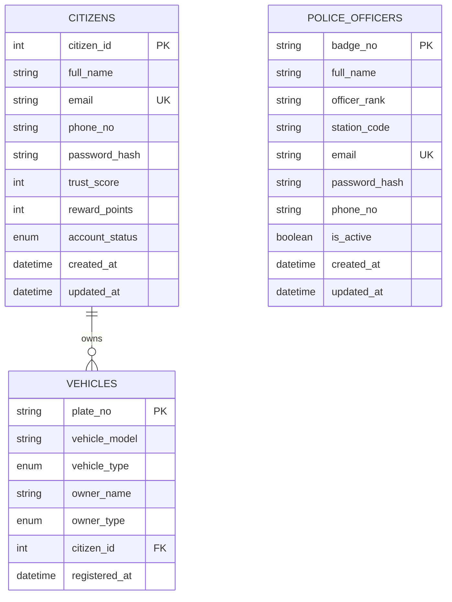
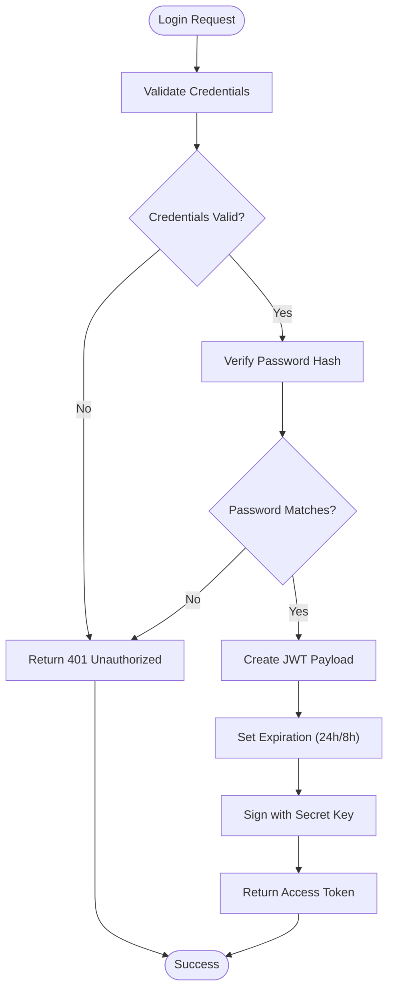
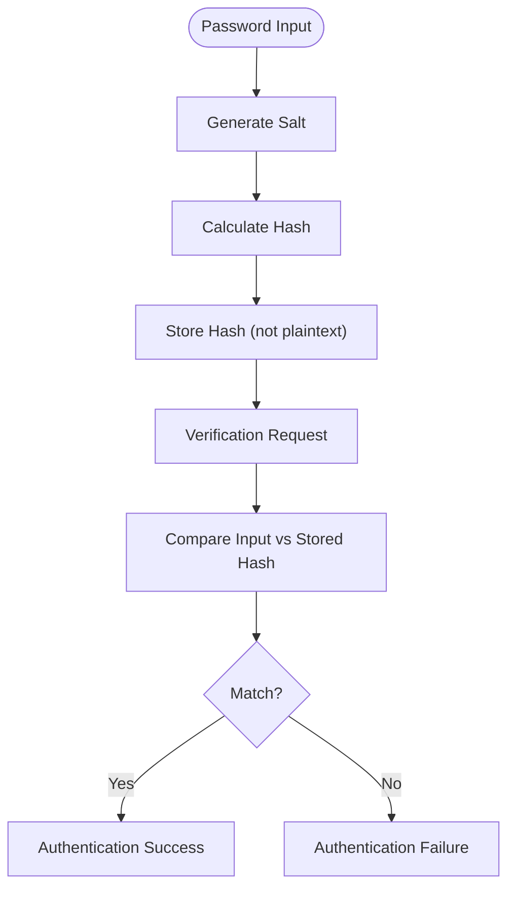
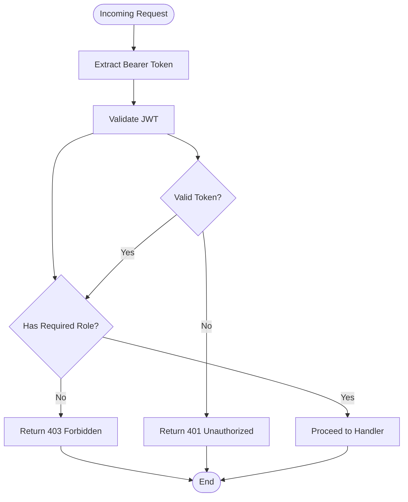
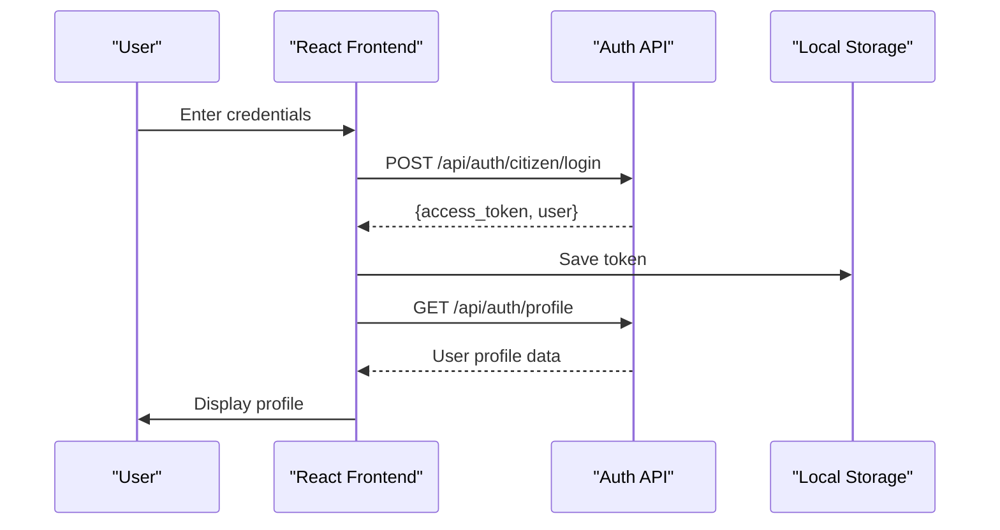
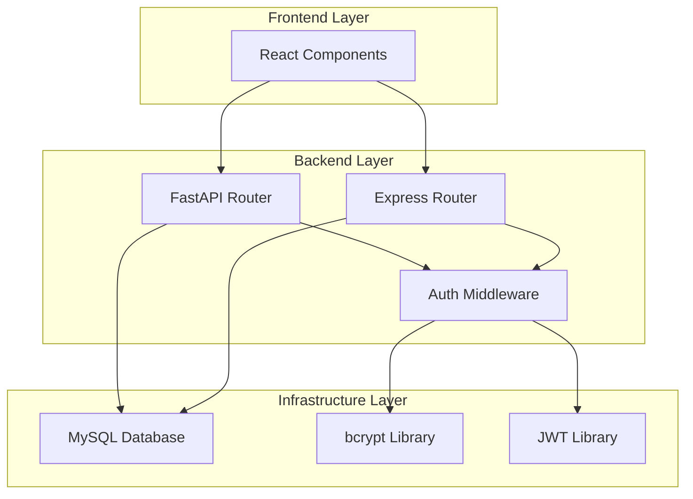

# Authentication Endpoints

<cite>
**Referenced Files in This Document**
- [auth.py](file://server/routes/auth.py)
- [auth.js](file://backend/routes/auth.js)
- [auth.js](file://backend/middleware/auth.js)
- [db.js](file://backend/db.js)
- [server.js](file://backend/server.js)
- [main.py](file://server/main.py)
- [schema.sql](file://db/schema.sql)
- [Profile.jsx](file://frontend/src/pages/Profile.jsx)
- [PoliceRegister.jsx](file://frontend/src/pages/PoliceRegister.jsx)
- [auth.py](file://server/middleware/auth.py)
</cite>

## Table of Contents
1. [Introduction](#introduction)
2. [Project Structure](#project-structure)
3. [Core Components](#core-components)
4. [Architecture Overview](#architecture-overview)
5. [Detailed Component Analysis](#detailed-component-analysis)
6. [Dependency Analysis](#dependency-analysis)
7. [Performance Considerations](#performance-considerations)
8. [Troubleshooting Guide](#troubleshooting-guide)
9. [Conclusion](#conclusion)

## Introduction
This document provides comprehensive API documentation for the authentication system covering:
- Citizen registration and login
- Police registration and login
- Profile management (fetch and update)
- JWT token generation and validation
- Password hashing with bcrypt
- Role-based access control
- Error handling and security considerations

The backend implements two distinct authentication stacks:
- FastAPI-based Python backend for modern endpoints
- Express-based JavaScript backend for legacy compatibility

## Project Structure
The authentication system spans three layers:
- Frontend React application for user interactions
- Backend APIs (FastAPI and Express)
- MySQL database with normalized schemas for citizens and police officers

**Diagram sources**
- [main.py:77-87](file://server/main.py#L77-L87)
- [server.js:22-26](file://backend/server.js#L22-L26)

**Section sources**
- [main.py:1-107](file://server/main.py#L1-L107)
- [server.js:1-42](file://backend/server.js#L1-L42)

## Core Components
This section documents the primary authentication endpoints with HTTP methods, request/response schemas, validation rules, and security mechanisms.

### FastAPI Authentication Endpoints

#### Citizen Registration
- Method: POST
- Path: `/api/auth/citizen/register`
- Purpose: Creates a new citizen account and links a vehicle record
- Request Schema:
  - full_name: string (required)
  - email: string (required)
  - phone_no: string (optional)
  - password: string (required, min 6 characters)
  - confirm_password: string (optional, must match password)
  - plate_no: string (required, vehicle number)
  - vehicle_type: string (required, vehicle category)
  - vehicle_model: string (optional)
- Response Schema:
  - message: string
  - citizen_id: integer
  - full_name: string
  - email: string
  - role: string ("citizen")
- Validation Rules:
  - Passwords must match and be at least 6 characters
  - Email uniqueness enforced
  - Vehicle registration performed automatically
- Security:
  - Password hashed with bcrypt
  - Transactional persistence with rollback on failure

#### Citizen Login
- Method: POST
- Path: `/api/auth/citizen/login`
- Purpose: Authenticates citizens and issues JWT
- Request Schema:
  - email: string (required)
  - password: string (required)
- Response Schema:
  - access_token: string (JWT)
  - token_type: string ("bearer")
  - message: string
  - user:
    - id: integer
    - full_name: string
    - email: string
    - role: string ("citizen")
    - trust_score: integer
- Security:
  - Password verification with bcrypt
  - Account status checked (must be "Active")
  - JWT expiry: 24 hours

#### Police Registration
- Method: POST
- Path: `/api/auth/police/register`
- Purpose: Creates a new police officer account
- Request Schema:
  - full_name: string (required)
  - email: string (required)
  - phone_no: string (optional)
  - password: string (required, min 6 characters)
  - confirm_password: string (optional, must match password)
- Response Schema:
  - message: string
  - badge_no: string (auto-generated)
  - full_name: string
  - email: string
  - role: string ("police")
- Validation Rules:
  - Passwords must match and be at least 6 characters
  - Email uniqueness enforced
  - Badge number auto-generated as POLXXXX format
- Security:
  - Password hashed with bcrypt
  - Default rank: "Constable"
  - Default station: "HQ001"
  - Default active status: true

#### Police Login
- Method: POST
- Path: `/api/auth/police/login`
- Purpose: Authenticates police officers and issues JWT
- Request Schema:
  - email: string (required)
  - password: string (required)
- Response Schema:
  - access_token: string (JWT)
  - token_type: string ("bearer")
  - message: string
  - user:
    - id: string (badge number)
    - full_name: string
    - email: string
    - role: string ("police")
    - badge_number: string
    - station: string
    - rank: string
- Security:
  - Password verification with bcrypt
  - Account activation checked (must be true)
  - JWT expiry: 24 hours

#### Profile Management
- Method: GET
- Path: `/api/auth/profile`
- Purpose: Retrieves current user's profile
- Headers:
  - Authorization: Bearer <token>
- Response Schema:
  - For citizens:
    - id: integer
    - name: string
    - email: string
    - phone_no: string
    - trust_score: integer
    - reward_points: integer
    - account_status: string
    - created_at: datetime
    - role: string ("citizen")
  - For police:
    - id: string (badge number)
    - name: string
    - email: string
    - phone_no: string
    - rank: string
    - station: string
    - is_active: boolean
    - created_at: datetime
    - role: string ("police")
- Security:
  - Token validation required
  - Role-specific queries executed

- Method: PUT
- Path: `/api/auth/profile`
- Purpose: Updates current user's profile information
- Headers:
  - Authorization: Bearer <token>
  - Content-Type: application/json
- Request Body (dynamic fields):
  - For citizens: full_name, phone_no, reward_points
  - For police: full_name, phone_no
- Response Schema:
  - message: string
  - profile: object (updated profile data)
- Security:
  - Token validation required
  - Dynamic query construction based on provided fields

**Section sources**
- [auth.py:114-216](file://server/routes/auth.py#L114-L216)
- [auth.py:218-293](file://server/routes/auth.py#L218-L293)
- [auth.py:310-396](file://server/routes/auth.py#L310-L396)
- [auth.py:399-490](file://server/routes/auth.py#L399-L490)
- [auth.py:493-599](file://server/routes/auth.py#L493-L599)
- [auth.py:602-744](file://server/routes/auth.py#L602-L744)

### Express Authentication Endpoints

#### Login Endpoint
- Method: POST
- Path: `/api/auth/login`
- Purpose: Authenticates users (citizen or police) and issues JWT
- Request Schema:
  - email: string (required)
  - password: string (required)
  - role: string (required, "citizen" or "police")
- Response Schema:
  - token: string (JWT)
  - user:
    - id: integer/string (citizen_id/police_id)
    - name: string
    - email: string
    - role: string
    - trust_score: integer (only for citizens)
    - badge_number: string (only for police)
    - station: string (only for police)
- Security:
  - Password verification with bcrypt
  - JWT expiry: 8 hours

#### Profile Endpoint
- Method: GET
- Path: `/api/auth/me`
- Purpose: Retrieves current user's profile using JWT
- Headers:
  - Authorization: Bearer <token>
- Response Schema:
  - For citizens: id, name, email, trust_score, phone, address
  - For police: id, name, email, badge_number, station
- Security:
  - Token validation required

**Section sources**
- [auth.js:9-76](file://backend/routes/auth.js#L9-L76)
- [auth.js:78-114](file://backend/routes/auth.js#L78-L114)

## Architecture Overview
The authentication system implements a dual-backend architecture supporting both modern FastAPI and legacy Express endpoints while sharing the same database schema.

**Diagram sources**
- [auth.py:114-216](file://server/routes/auth.py#L114-L216)
- [auth.py:218-293](file://server/routes/auth.py#L218-L293)

**Section sources**
- [main.py:77-87](file://server/main.py#L77-L87)
- [server.js:22-26](file://backend/server.js#L22-L26)

## Detailed Component Analysis

### Database Schema and Relationships
The authentication system relies on two core tables with strict constraints:

**Diagram sources**
- [schema.sql:26-43](file://db/schema.sql#L26-L43)
- [schema.sql:70-82](file://db/schema.sql#L70-L82)
- [schema.sql:87-95](file://db/schema.sql#L87-L95)

**Section sources**
- [schema.sql:26-95](file://db/schema.sql#L26-L95)

### JWT Token Generation and Validation
Both backends implement JWT-based authentication with different configurations:

**Diagram sources**
- [auth.py:100-112](file://server/routes/auth.py#L100-L112)
- [auth.js:49-58](file://backend/routes/auth.js#L49-L58)

**Section sources**
- [auth.py:270-278](file://server/routes/auth.py#L270-L278)
- [auth.js:49-58](file://backend/routes/auth.js#L49-L58)

### Password Hashing with bcrypt
The system uses bcrypt for secure password storage:

**Diagram sources**
- [auth.py:77-98](file://server/routes/auth.py#L77-L98)
- [auth.js](file://backend/routes/auth.js#L44)

**Section sources**
- [auth.py:77-98](file://server/routes/auth.py#L77-L98)
- [auth.js](file://backend/routes/auth.js#L44)

### Role-Based Access Control
The system implements role-based middleware for both backends:

**Diagram sources**
- [auth.js:5-20](file://backend/middleware/auth.js#L5-L20)
- [auth.py:1-20](file://server/middleware/auth.py#L1-L20)

**Section sources**
- [auth.js:22-34](file://backend/middleware/auth.js#L22-L34)
- [auth.py:1-20](file://server/middleware/auth.py#L1-L20)

### Frontend Integration Examples
The frontend demonstrates proper authentication flow:

**Diagram sources**
- [Profile.jsx:125-146](file://frontend/src/pages/Profile.jsx#L125-L146)

**Section sources**
- [Profile.jsx:125-146](file://frontend/src/pages/Profile.jsx#L125-L146)
- [PoliceRegister.jsx:103-113](file://frontend/src/pages/PoliceRegister.jsx#L103-L113)

## Dependency Analysis
The authentication system has clear separation of concerns across layers:

**Diagram sources**
- [main.py:77-87](file://server/main.py#L77-L87)
- [server.js:22-26](file://backend/server.js#L22-L26)

**Section sources**
- [main.py:1-107](file://server/main.py#L1-L107)
- [server.js:1-42](file://backend/server.js#L1-L42)

## Performance Considerations
- Connection pooling: Both backends implement connection pooling for database operations
- Asynchronous processing: FastAPI uses thread pools for bcrypt operations to prevent blocking
- Token expiration: Configurable JWT expiry (24 hours for FastAPI, 8 hours for Express)
- Index optimization: Database schemas include appropriate indexes for email lookups
- Transaction safety: All registration operations use transactions to ensure atomicity

## Troubleshooting Guide

### Common Error Scenarios

#### Authentication Failures
- Invalid credentials: Returns 401 Unauthorized
- Expired or invalid tokens: Returns 401 Unauthorized
- Missing authorization header: Returns 401 Unauthorized
- Invalid or malformed JWT: Returns 403 Forbidden

#### Business Logic Errors
- Duplicate email registration: Returns 409 Conflict
- Password validation failures: Returns 400 Bad Request
- Account not active/deactivated: Returns 403 Forbidden
- User not found: Returns 404 Not Found

#### Database Connectivity Issues
- Connection pool exhaustion: Check connection limits and timeouts
- Transaction rollbacks: Verify foreign key constraints and data integrity
- Deadlocks: Review concurrent access patterns

#### Frontend Integration Issues
- Token not being sent: Ensure Authorization header with Bearer prefix
- CORS errors: Verify frontend origin matches backend CORS configuration
- Profile updates failing: Check field validation and required permissions

**Section sources**
- [auth.py:580-589](file://server/routes/auth.py#L580-L589)
- [auth.js:37-47](file://backend/routes/auth.js#L37-L47)
- [auth.js:9-19](file://backend/middleware/auth.js#L9-L19)

## Conclusion
The authentication system provides robust, secure, and scalable user management across both modern and legacy backend implementations. Key strengths include:
- Dual backend support enabling gradual migration
- Strong security practices with bcrypt and JWT
- Comprehensive validation and error handling
- Clear role-based access control
- Transactional data persistence ensuring reliability

The system is production-ready with proper error handling, security considerations, and comprehensive API documentation. Future enhancements could include rate limiting, refresh token rotation, and enhanced audit logging.