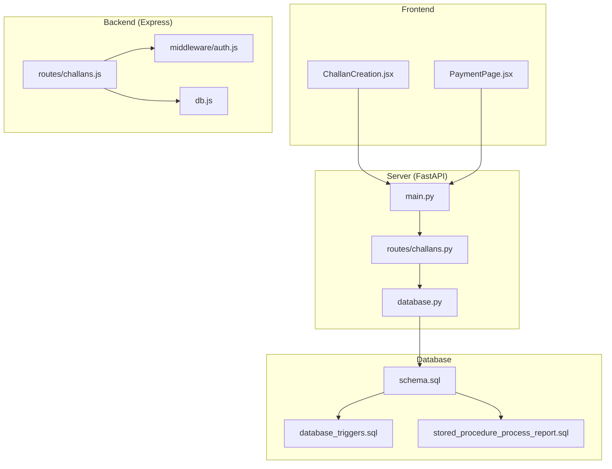
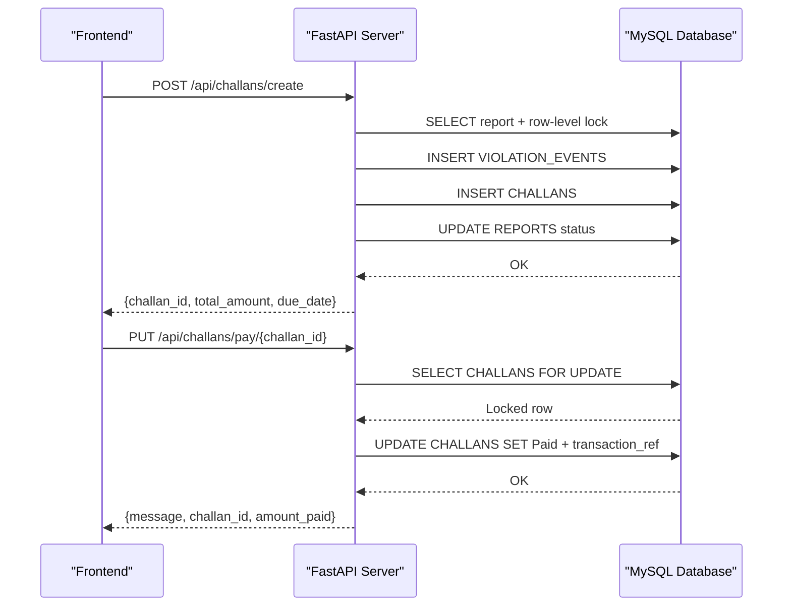
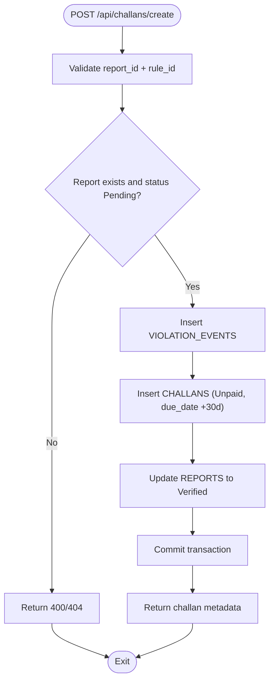
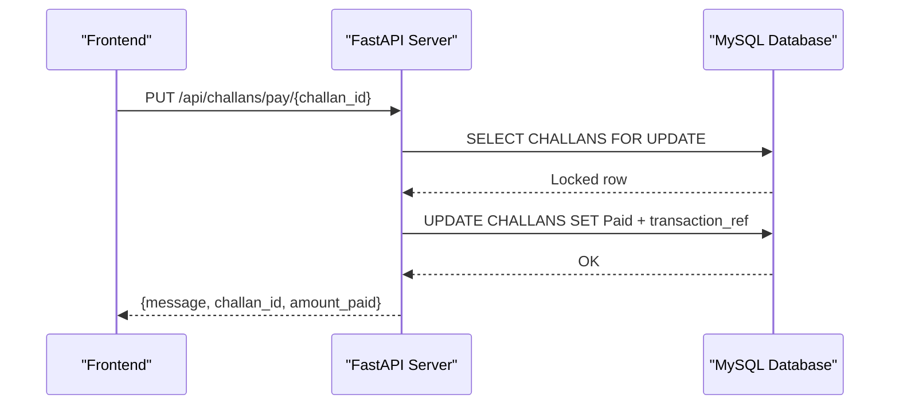
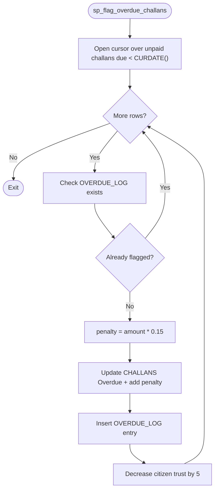
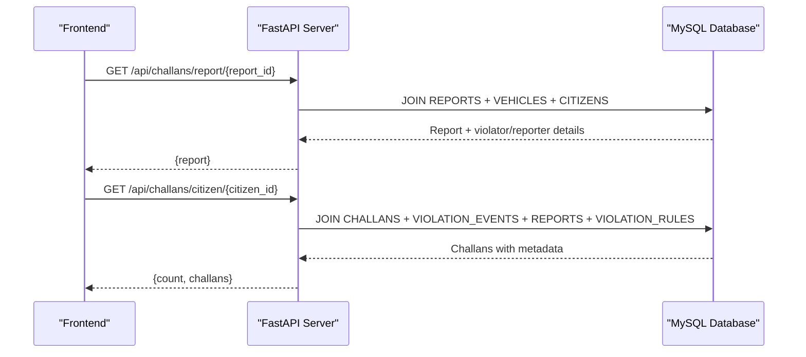
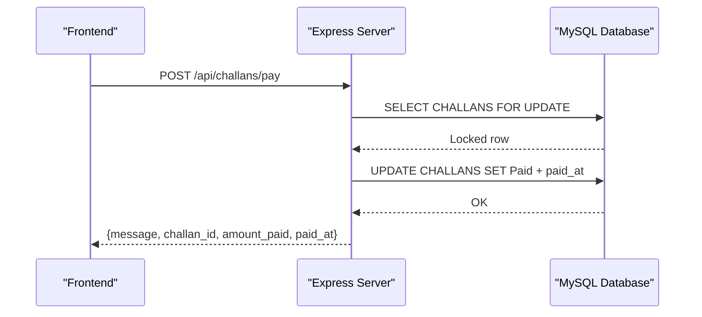
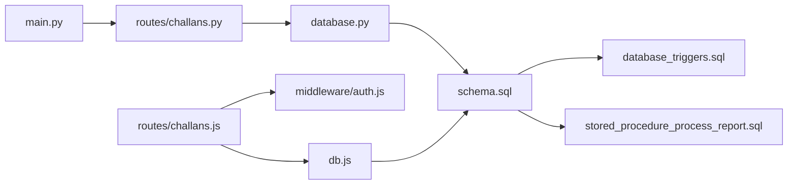

# Challan Processing Endpoints

<cite>
**Referenced Files in This Document**
- [challans.js](file://backend/routes/challans.js)
- [challans.py](file://server/routes/challans.py)
- [auth.js](file://backend/middleware/auth.js)
- [db.js](file://backend/db.js)
- [database.py](file://server/database.py)
- [schema.sql](file://db/schema.sql)
- [stored_procedure_process_report.sql](file://db/stored_procedure_process_report.sql)
- [database_triggers.sql](file://db/database_triggers.sql)
- [marga_rakshak_triggers.sql](file://db/marga_rakshak_triggers.sql)
- [main.py](file://server/main.py)
- [ChallanCreation.jsx](file://frontend/src/pages/ChallanCreation.jsx)
- [PaymentPage.jsx](file://frontend/src/pages/PaymentPage.jsx)
- [test_challan_pipeline.py](file://server/test_challan_pipeline.py)
</cite>

## Table of Contents
1. [Introduction](#introduction)
2. [Project Structure](#project-structure)
3. [Core Components](#core-components)
4. [Architecture Overview](#architecture-overview)
5. [Detailed Component Analysis](#detailed-component-analysis)
6. [Dependency Analysis](#dependency-analysis)
7. [Performance Considerations](#performance-considerations)
8. [Troubleshooting Guide](#troubleshooting-guide)
9. [Conclusion](#conclusion)

## Introduction
This document provides comprehensive API documentation for the challan processing endpoints within the Traffic Violation Management System. It covers:
- Challan generation workflow
- Payment processing
- Overdue penalty calculation
- Challan status tracking
- Database transaction handling and row-level locking
- Real-time payment verification and trigger-based automation
- Examples of challan lifecycle, penalty calculation algorithms, and payment failure scenarios
- Integration points with the financial system and front-end

## Project Structure
The system comprises:
- Backend (Express): Authentication middleware and legacy routes for citizen challans
- Server (FastAPI): Full production-grade routes for challan creation, payment, and status tracking
- Frontend (React): UI for issuing challans and processing payments
- Database (MySQL): Schema, triggers, stored procedures, and views supporting ACID transactions and automation
- Scripts and tests: Validation and end-to-end pipeline testing

**Diagram sources**
- [main.py:77-86](file://server/main.py#L77-L86)
- [challans.py:11-13](file://server/routes/challans.py#L11-L13)
- [database.py:45-50](file://server/database.py#L45-L50)
- [auth.js:3-20](file://backend/middleware/auth.js#L3-L20)
- [db.js:1-26](file://backend/db.js#L1-L26)
- [schema.sql:173-195](file://db/schema.sql#L173-L195)
- [database_triggers.sql:8-35](file://db/database_triggers.sql#L8-L35)
- [stored_procedure_process_report.sql:8-98](file://db/stored_procedure_process_report.sql#L8-L98)

**Section sources**
- [main.py:77-86](file://server/main.py#L77-L86)
- [challans.py:11-13](file://server/routes/challans.py#L11-L13)
- [database.py:45-50](file://server/database.py#L45-L50)
- [auth.js:3-20](file://backend/middleware/auth.js#L3-L20)
- [db.js:1-26](file://backend/db.js#L1-L26)
- [schema.sql:173-195](file://db/schema.sql#L173-L195)
- [database_triggers.sql:8-35](file://db/database_triggers.sql#L8-L35)
- [stored_procedure_process_report.sql:8-98](file://db/stored_procedure_process_report.sql#L8-L98)

## Core Components
- FastAPI Challans Router: Handles challan creation, payment, retrieval, and deletion
- Express Challans Router: Legacy citizen-only endpoints with row-level locking
- Authentication Middleware: JWT-based role gating for citizen and police access
- Database Layer: Connection pooling and transaction management
- Database Schema: Entities, constraints, and temporal auditing
- Triggers and Stored Procedures: Automated trust scoring, challan issuance, payment, and overdue flagging

**Section sources**
- [challans.py:47-139](file://server/routes/challans.py#L47-L139)
- [challans.js:31-98](file://backend/routes/challans.js#L31-L98)
- [auth.js:3-37](file://backend/middleware/auth.js#L3-L37)
- [database.py:14-76](file://server/database.py#L14-L76)
- [schema.sql:173-235](file://db/schema.sql#L173-L235)
- [database_triggers.sql:8-35](file://db/database_triggers.sql#L8-L35)
- [stored_procedure_process_report.sql:8-98](file://db/stored_procedure_process_report.sql#L8-L98)

## Architecture Overview
The system enforces ACID compliance and concurrency safety through:
- Row-level locks during payment
- Stored procedures encapsulating business logic
- Database triggers for automated trust scoring and temporal versioning
- Front-end integration for challan creation and payment simulation

**Diagram sources**
- [challans.py:47-139](file://server/routes/challans.py#L47-L139)
- [challans.py:336-397](file://server/routes/challans.py#L336-L397)
- [schema.sql:173-195](file://db/schema.sql#L173-L195)

**Section sources**
- [challans.py:47-139](file://server/routes/challans.py#L47-L139)
- [challans.py:336-397](file://server/routes/challans.py#L336-L397)
- [schema.sql:173-195](file://db/schema.sql#L173-L195)

## Detailed Component Analysis

### Challan Generation Endpoint
- Path: POST /api/challans/create
- Purpose: Create a challan after verifying a report and linking to the violator’s citizen_id
- Request Body:
  - report_id: integer
  - rule_id: integer
  - badge_no: string
  - total_amount: number
  - notes: optional string
- Response:
  - message: string
  - challan_id: integer
  - event_id: integer
  - report_id: integer
  - plate_no: string
  - violator_name: string
  - violator_citizen_id: integer
  - total_amount: number
  - due_date: string (ISO date, 30 days from creation)
- Processing Logic:
  - Validates report existence and status
  - Creates VIOLATION_EVENTS
  - Inserts CHALLANS with Unpaid status and due_date
  - Updates REPORTS status to Verified
  - Atomicity ensured via transaction
- Database Integration:
  - Uses stored procedure pattern with row-level locks and exception handling
  - Triggers update trust scores and temporal versioning

**Diagram sources**
- [challans.py:47-139](file://server/routes/challans.py#L47-L139)
- [schema.sql:154-167](file://db/schema.sql#L154-L167)
- [schema.sql:173-195](file://db/schema.sql#L173-L195)
- [schema.sql:116-136](file://db/schema.sql#L116-L136)

**Section sources**
- [challans.py:47-139](file://server/routes/challans.py#L47-L139)
- [schema.sql:154-167](file://db/schema.sql#L154-L167)
- [schema.sql:173-195](file://db/schema.sql#L173-L195)
- [schema.sql:116-136](file://db/schema.sql#L116-L136)

### Payment Processing Endpoint
- Path: PUT /api/challans/pay/{challan_id}
- Purpose: Mark a challan as Paid with row-level locking and transaction reference
- Request: None (uses path parameter)
- Response:
  - message: string
  - challan_id: integer
  - amount_paid: number
  - payment_status: string ("Paid")
- Processing Logic:
  - Selects and locks the specific challan row
  - Verifies unpaid status and ownership
  - Updates payment_status, sets paid_at, and generates transaction_ref
  - Commits transaction
- Frontend Integration:
  - Demo payment button simulates processing delay and invokes the endpoint

**Diagram sources**
- [challans.py:336-397](file://server/routes/challans.py#L336-L397)
- [schema.sql:173-195](file://db/schema.sql#L173-L195)

**Section sources**
- [challans.py:336-397](file://server/routes/challans.py#L336-L397)
- [schema.sql:173-195](file://db/schema.sql#L173-L195)
- [PaymentPage.jsx:46-80](file://frontend/src/pages/PaymentPage.jsx#L46-L80)

### Overdue Penalty Calculation
- Path: Not exposed as a public endpoint; executed via stored procedure
- Procedure: sp_flag_overdue_challans
- Algorithm:
  - Iterates unpaid challans past due date
  - Calculates 15% late penalty per challan
  - Updates CHALLANS status to Overdue and increases total_amount
  - Logs entries in OVERDUE_LOG
  - Decreases citizen trust score by 5
- Frontend Integration:
  - Police portal can trigger this procedure to flag overdue challans

**Diagram sources**
- [schema.sql:694-754](file://db/schema.sql#L694-L754)
- [schema.sql:224-235](file://db/schema.sql#L224-L235)

**Section sources**
- [schema.sql:694-754](file://db/schema.sql#L694-L754)
- [schema.sql:224-235](file://db/schema.sql#L224-L235)

### Challan Status Tracking
- Paths:
  - GET /api/challans/citizen/{citizen_id}
  - GET /api/challans/my
  - GET /api/challans/report/{report_id}
- Purpose: Retrieve challan details, associated violations, and report metadata
- Response: List of challans with amounts, statuses, dates, and related info
- Frontend Integration:
  - ChallanCreation page fetches report details for verification
  - Payment page lists challans for the logged-in citizen

**Diagram sources**
- [challans.py:277-334](file://server/routes/challans.py#L277-L334)
- [challans.py:141-207](file://server/routes/challans.py#L141-L207)

**Section sources**
- [challans.py:277-334](file://server/routes/challans.py#L277-L334)
- [challans.py:141-207](file://server/routes/challans.py#L141-L207)
- [ChallanCreation.jsx:29-47](file://frontend/src/pages/ChallanCreation.jsx#L29-L47)
- [PaymentPage.jsx:23-44](file://frontend/src/pages/PaymentPage.jsx#L23-L44)

### Legacy Express Endpoints (Citizen)
- GET /api/challans/my: Returns citizen’s challans with joined details
- POST /api/challans/pay: Row-level locking transaction to prevent double payment
- Authentication: Requires JWT and citizen role

**Diagram sources**
- [challans.js:31-98](file://backend/routes/challans.js#L31-L98)
- [auth.js:3-37](file://backend/middleware/auth.js#L3-L37)
- [db.js:1-26](file://backend/db.js#L1-L26)

**Section sources**
- [challans.js:7-29](file://backend/routes/challans.js#L7-L29)
- [challans.js:31-98](file://backend/routes/challans.js#L31-L98)
- [auth.js:3-37](file://backend/middleware/auth.js#L3-L37)
- [db.js:1-26](file://backend/db.js#L1-L26)

## Dependency Analysis
- Router Registration: FastAPI mounts the challans router under /api/challans
- Database Connectivity: Python routes use a connection pool; Express uses a promise-based pool
- Authentication: Express routes enforce JWT and role checks; FastAPI relies on middleware configuration
- Triggers and Procedures: MySQL triggers manage trust scoring; stored procedures encapsulate business logic

**Diagram sources**
- [main.py:77-86](file://server/main.py#L77-L86)
- [challans.py:11-13](file://server/routes/challans.py#L11-L13)
- [database.py:45-50](file://server/database.py#L45-L50)
- [auth.js:3-20](file://backend/middleware/auth.js#L3-L20)
- [db.js:1-26](file://backend/db.js#L1-L26)
- [schema.sql:173-195](file://db/schema.sql#L173-L195)
- [database_triggers.sql:8-35](file://db/database_triggers.sql#L8-L35)
- [stored_procedure_process_report.sql:8-98](file://db/stored_procedure_process_report.sql#L8-L98)

**Section sources**
- [main.py:77-86](file://server/main.py#L77-L86)
- [challans.py:11-13](file://server/routes/challans.py#L11-L13)
- [database.py:45-50](file://server/database.py#L45-L50)
- [auth.js:3-20](file://backend/middleware/auth.js#L3-L20)
- [db.js:1-26](file://backend/db.js#L1-L26)
- [schema.sql:173-195](file://db/schema.sql#L173-L195)
- [database_triggers.sql:8-35](file://db/database_triggers.sql#L8-L35)
- [stored_procedure_process_report.sql:8-98](file://db/stored_procedure_process_report.sql#L8-L98)

## Performance Considerations
- Connection Pooling: Both Python and Express layers use pools to minimize connection overhead
- Row-Level Locking: Ensures atomicity and prevents race conditions during payment
- Stored Procedures: Encapsulate complex logic and reduce network round trips
- Indexes: Strategic indexing on CHALLANS and REPORTS accelerates queries
- Triggers: Automated updates occur at the database level, reducing application-level overhead

[No sources needed since this section provides general guidance]

## Troubleshooting Guide
Common issues and resolutions:
- Payment Failures:
  - Duplicate payment attempts: Row-level lock prevents concurrent updates
  - Unauthorized access: Ensure citizen role and ownership validation
  - Transaction rollback: Stored procedures and manual transactions roll back on errors
- Report Already Verified:
  - Creation endpoint rejects reports already verified
- Overdue Flagging:
  - Procedure iterates unpaid challans past due date and applies 15% penalty
- Trust Score Adjustments:
  - Verified reports increase trust; rejected reports decrease trust
- Testing:
  - Use the provided test script to validate end-to-end pipeline behavior

**Section sources**
- [challans.js:40-98](file://backend/routes/challans.js#L40-L98)
- [challans.py:47-139](file://server/routes/challans.py#L47-L139)
- [challans.py:336-397](file://server/routes/challans.py#L336-L397)
- [database_triggers.sql:8-35](file://db/database_triggers.sql#L8-L35)
- [stored_procedure_process_report.sql:8-98](file://db/stored_procedure_process_report.sql#L8-L98)
- [test_challan_pipeline.py:10-99](file://server/test_challan_pipeline.py#L10-L99)

## Conclusion
The challan processing system integrates robust database automation, strict concurrency controls, and clear API boundaries between legacy and modern implementations. The FastAPI routes provide a production-ready interface for challan creation, payment, and status tracking, while MySQL triggers and stored procedures ensure consistency, auditability, and scalability.