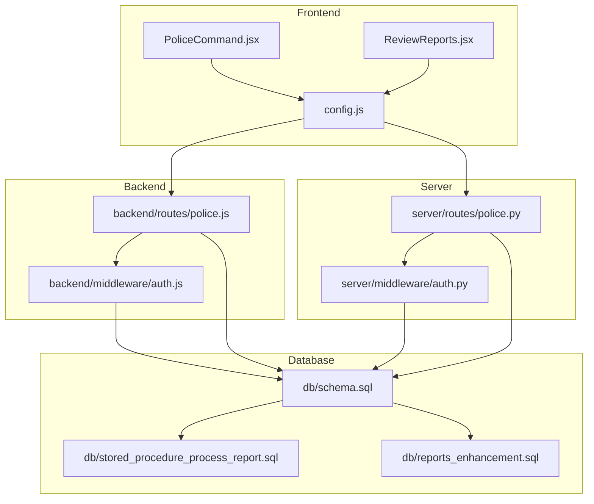
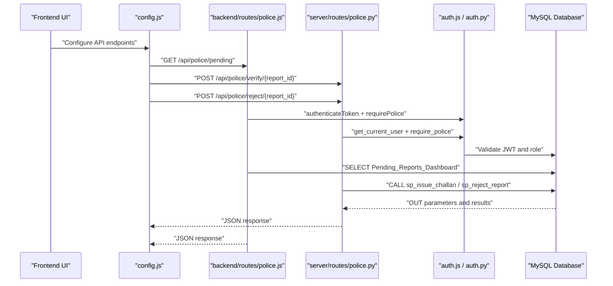
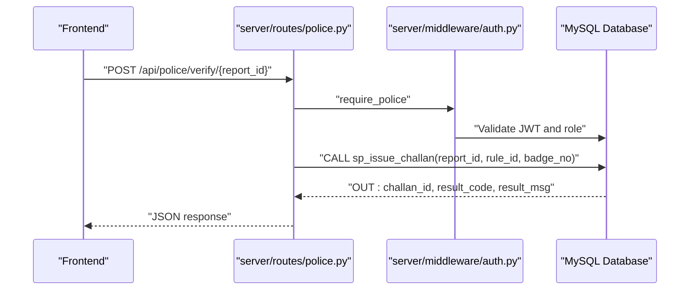
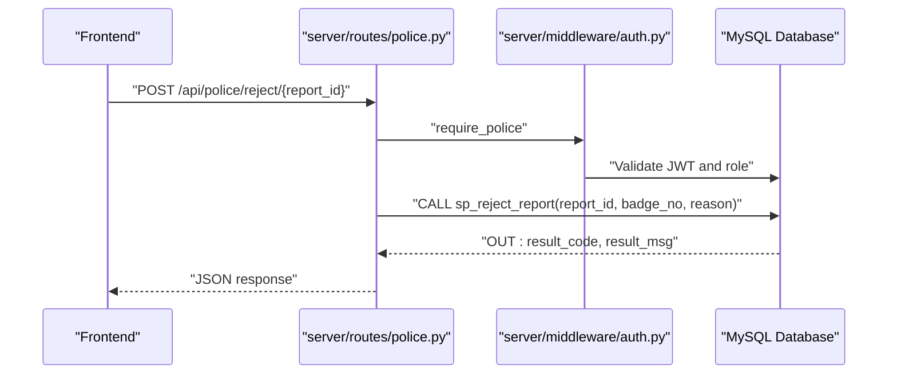
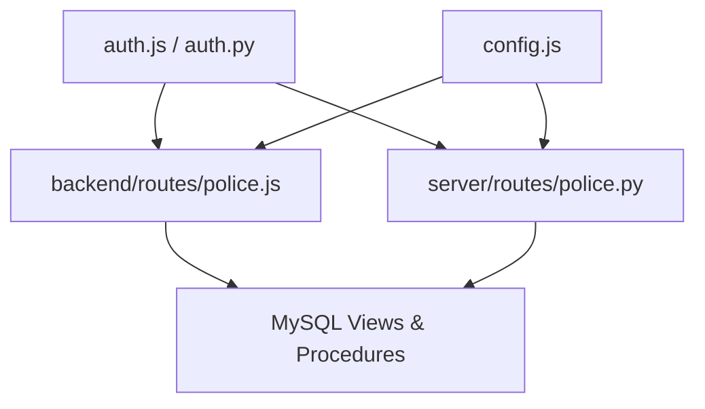

# Police Operations Endpoints

<cite>
**Referenced Files in This Document**
- [police.js](file://backend/routes/police.js)
- [police.py](file://server/routes/police.py)
- [auth.js](file://backend/middleware/auth.js)
- [auth.py](file://server/middleware/auth.py)
- [schema.sql](file://db/schema.sql)
- [stored_procedure_process_report.sql](file://db/stored_procedure_process_report.sql)
- [reports_enhancement.sql](file://db/reports_enhancement.sql)
- [REPORTS_API_DOCUMENTATION.md](file://server/REPORTS_API_DOCUMENTATION.md)
- [config.js](file://frontend/src/config.js)
- [PoliceCommand.jsx](file://frontend/src/pages/PoliceCommand.jsx)
- [ReviewReports.jsx](file://frontend/src/pages/ReviewReports.jsx)
</cite>

## Table of Contents
1. [Introduction](#introduction)
2. [Project Structure](#project-structure)
3. [Core Components](#core-components)
4. [Architecture Overview](#architecture-overview)
5. [Detailed Component Analysis](#detailed-component-analysis)
6. [Dependency Analysis](#dependency-analysis)
7. [Performance Considerations](#performance-considerations)
8. [Troubleshooting Guide](#troubleshooting-guide)
9. [Conclusion](#conclusion)

## Introduction
This document provides comprehensive API documentation for police operations endpoints within the Traffic Violation Management System. It covers officer management, report review workflows, and administrative functions with a focus on:
- Fetching assigned or pending reports
- Verifying and rejecting reports
- Managing officer profiles and performance
- Integration with the reporting system and audit trails

The documentation includes HTTP methods, request schemas, role-based permissions, and integration points with the database and frontend components.

## Project Structure
The system comprises:
- Backend routes for police operations (Node.js/Express)
- Server routes for police operations (Python/FastAPI)
- Middleware for authentication and role checks
- Database schema with views, triggers, stored procedures, and audit trails
- Frontend pages integrating with the APIs

**Diagram sources**
- [police.js:1-109](file://backend/routes/police.js#L1-L109)
- [police.py:1-220](file://server/routes/police.py#L1-L220)
- [auth.js:1-37](file://backend/middleware/auth.js#L1-L37)
- [auth.py:1-182](file://server/middleware/auth.py#L1-L182)
- [schema.sql:1-942](file://db/schema.sql#L1-L942)
- [reports_enhancement.sql:1-302](file://db/reports_enhancement.sql#L1-L302)
- [stored_procedure_process_report.sql:1-115](file://db/stored_procedure_process_report.sql#L1-L115)
- [config.js:1-33](file://frontend/src/config.js#L1-L33)
- [PoliceCommand.jsx:1-207](file://frontend/src/pages/PoliceCommand.jsx#L1-L207)
- [ReviewReports.jsx:1-256](file://frontend/src/pages/ReviewReports.jsx#L1-L256)

**Section sources**
- [police.js:1-109](file://backend/routes/police.js#L1-L109)
- [police.py:1-220](file://server/routes/police.py#L1-L220)
- [auth.js:1-37](file://backend/middleware/auth.js#L1-L37)
- [auth.py:1-182](file://server/middleware/auth.py#L1-L182)
- [schema.sql:1-942](file://db/schema.sql#L1-L942)
- [reports_enhancement.sql:1-302](file://db/reports_enhancement.sql#L1-L302)
- [stored_procedure_process_report.sql:1-115](file://db/stored_procedure_process_report.sql#L1-L115)
- [config.js:1-33](file://frontend/src/config.js#L1-L33)
- [PoliceCommand.jsx:1-207](file://frontend/src/pages/PoliceCommand.jsx#L1-L207)
- [ReviewReports.jsx:1-256](file://frontend/src/pages/ReviewReports.jsx#L1-L256)

## Core Components
- Authentication and authorization middleware enforces role-based access control for police endpoints.
- Police routes expose:
  - Pending reports dashboard
  - Report verification and rejection
  - Violation rules retrieval
  - Officer performance statistics
- Database integration via views, triggers, and stored procedures ensures auditability and data integrity.

Key integration points:
- Frontend pages consume backend endpoints for dashboard stats and report reviews.
- Stored procedures encapsulate ACID transactions for report processing and challan issuance.

**Section sources**
- [auth.js:1-37](file://backend/middleware/auth.js#L1-L37)
- [auth.py:1-182](file://server/middleware/auth.py#L1-L182)
- [police.js:1-109](file://backend/routes/police.js#L1-L109)
- [police.py:1-220](file://server/routes/police.py#L1-L220)
- [schema.sql:757-820](file://db/schema.sql#L757-L820)
- [stored_procedure_process_report.sql:1-115](file://db/stored_procedure_process_report.sql#L1-L115)

## Architecture Overview
The police operations architecture integrates frontend UI, backend routes, server routes, middleware, and database components.

**Diagram sources**
- [config.js:17-21](file://frontend/src/config.js#L17-L21)
- [police.js:7-16](file://backend/routes/police.js#L7-L16)
- [police.py:25-93](file://server/routes/police.py#L25-L93)
- [auth.js:5-34](file://backend/middleware/auth.js#L5-L34)
- [auth.py:57-61](file://server/middleware/auth.py#L57-L61)

## Detailed Component Analysis

### Endpoint: Fetch Pending Reports
- Method: GET
- Path: /api/police/pending
- Description: Retrieves pending reports from the Pending_Reports_Dashboard view for the police command center.
- Authentication: Requires a valid JWT bearer token.
- Authorization: Requires role "police".
- Response: Array of pending reports with reporter details and evidence counts.

Request
- Headers: Authorization: Bearer <token>
- Query Parameters: None

Response
- 200 OK: Array of pending reports
- 401 Unauthorized: Missing or invalid token
- 403 Forbidden: Role mismatch
- 500 Internal Server Error: Database error

Notes
- The backend route uses a MySQL view for efficient querying.
- The server route serializes datetime objects to ISO format for JSON compatibility.

**Section sources**
- [police.js:7-16](file://backend/routes/police.js#L7-L16)
- [police.py:25-45](file://server/routes/police.py#L25-L45)
- [schema.sql:764-780](file://db/schema.sql#L764-L780)

### Endpoint: Verify Report (Issue Challan)
- Method: POST
- Path: /api/police/verify/{report_id}
- Description: Verifies a report and issues a challan using a stored procedure. Updates report status to Verified and triggers trust score adjustments for the reporter.
- Authentication: Requires a valid JWT bearer token.
- Authorization: Requires role "police".
- Request Body Schema:
  - rule_id: integer (required) — Active violation rule identifier

Response
- 200 OK: {
    - message: string
    - challan_id: integer
    - report_id: integer
  }
- 400 Bad Request: Invalid rule or processing failure
- 401 Unauthorized: Missing or invalid token
- 403 Forbidden: Role mismatch
- 500 Internal Server Error: Database or stored procedure error

Processing Flow
- Validates report status and rule existence
- Calls stored procedure to update report status and create violation event and challan
- Commits transaction and returns OUT parameters

**Diagram sources**
- [police.py:48-93](file://server/routes/police.py#L48-L93)
- [auth.py:156-181](file://server/middleware/auth.py#L156-L181)
- [schema.sql:440-546](file://db/schema.sql#L440-L546)

**Section sources**
- [police.py:48-93](file://server/routes/police.py#L48-L93)
- [schema.sql:440-546](file://db/schema.sql#L440-L546)
- [stored_procedure_process_report.sql:8-98](file://db/stored_procedure_process_report.sql#L8-L98)

### Endpoint: Reject Report
- Method: POST
- Path: /api/police/reject/{report_id}
- Description: Rejects a report with a reason and updates status to Rejected. Triggers trust score penalties for the reporter.
- Authentication: Requires a valid JWT bearer token.
- Authorization: Requires role "police".
- Request Body Schema:
  - reason: string (required) — Reason for rejection

Response
- 200 OK: {
    - message: string
    - report_id: integer
  }
- 400 Bad Request: Invalid input or processing failure
- 401 Unauthorized: Missing or invalid token
- 403 Forbidden: Role mismatch
- 500 Internal Server Error: Database or stored procedure error

Processing Flow
- Calls stored procedure to validate report status and insert rejection reason
- Commits transaction and returns OUT parameters

**Diagram sources**
- [police.py:105-147](file://server/routes/police.py#L105-L147)
- [auth.py:156-181](file://server/middleware/auth.py#L156-L181)
- [schema.sql:634-686](file://db/schema.sql#L634-L686)

**Section sources**
- [police.py:105-147](file://server/routes/police.py#L105-L147)
- [schema.sql:634-686](file://db/schema.sql#L634-L686)

### Endpoint: Fetch Violation Rules
- Method: GET
- Path: /api/police/rules
- Description: Retrieves all active violation rules with severity and base fine amounts.
- Authentication: Requires a valid JWT bearer token.
- Authorization: Requires role "police".

Response
- 200 OK: Array of rules with numeric base_fine_amount converted to float
- 401 Unauthorized: Missing or invalid token
- 403 Forbidden: Role mismatch
- 500 Internal Server Error: Database error

**Section sources**
- [police.py:158-184](file://server/routes/police.py#L158-L184)
- [schema.sql:868-880](file://db/schema.sql#L868-L880)

### Endpoint: Fetch Officer Performance
- Method: GET
- Path: /api/police/performance
- Description: Retrieves performance statistics for the logged-in officer, including verified/rejected counts, challans issued, and revenue collected.
- Authentication: Requires a valid JWT bearer token.
- Authorization: Requires role "police".

Response
- 200 OK: {
    - badge_no: string
    - full_name: string
    - station_code: string
    - verified_count: integer
    - rejected_count: integer
    - challans_issued: integer
    - revenue_collected: number (converted from Decimal)
  }
- 404 Not Found: Performance data not found
- 401 Unauthorized: Missing or invalid token
- 403 Forbidden: Role mismatch
- 500 Internal Server Error: Database error

**Section sources**
- [police.py:187-220](file://server/routes/police.py#L187-L220)
- [schema.sql:809-819](file://db/schema.sql#L809-L819)

### Endpoint: Fetch Officer Profile
- Method: GET
- Path: /api/auth/profile
- Description: Retrieves the current officer's profile details using the JWT token.
- Authentication: Requires a valid JWT bearer token.
- Authorization: Requires role "police".

Response
- 200 OK: {
    - id: string (badge_no)
    - full_name: string
    - email: string
    - role: string
    - station: string
    - rank: string
  }
- 401 Unauthorized: Missing or invalid token
- 500 Internal Server Error: Database error

**Section sources**
- [auth.py:493-516](file://server/middleware/auth.py#L493-L516)

### Batch Operations
- Current system exposes individual endpoints for verification and rejection.
- For batch operations, consider extending the server routes to accept arrays of report identifiers and apply the same stored procedures with transaction batching.

[No sources needed since this section provides general guidance]

## Dependency Analysis
The police operations depend on:
- Authentication middleware for token validation and role enforcement
- Database views for dashboard queries
- Stored procedures for ACID-compliant report processing and challan issuance
- Frontend configuration for endpoint mapping

**Diagram sources**
- [auth.js:1-37](file://backend/middleware/auth.js#L1-L37)
- [auth.py:1-182](file://server/middleware/auth.py#L1-L182)
- [police.js:1-109](file://backend/routes/police.js#L1-L109)
- [police.py:1-220](file://server/routes/police.py#L1-L220)
- [schema.sql:757-820](file://db/schema.sql#L757-L820)
- [config.js:17-21](file://frontend/src/config.js#L17-L21)

**Section sources**
- [auth.js:1-37](file://backend/middleware/auth.js#L1-L37)
- [auth.py:1-182](file://server/middleware/auth.py#L1-L182)
- [police.js:1-109](file://backend/routes/police.js#L1-L109)
- [police.py:1-220](file://server/routes/police.py#L1-L220)
- [schema.sql:757-820](file://db/schema.sql#L757-L820)
- [config.js:17-21](file://frontend/src/config.js#L17-L21)

## Performance Considerations
- Stored procedures encapsulate complex transactions and reduce network round trips.
- Database views optimize dashboard queries by pre-aggregating data.
- Triggers automatically maintain audit trails and enforce trust score adjustments.
- Consider adding pagination for large datasets and indexing on frequently queried columns.

[No sources needed since this section provides general guidance]

## Troubleshooting Guide
Common issues and resolutions:
- Authentication failures:
  - Ensure Authorization header includes a valid bearer token.
  - Verify token expiration and secret configuration.
- Role mismatches:
  - Confirm the token role is "police".
- Report processing errors:
  - Check stored procedure OUT parameters for detailed error messages.
  - Validate report status and rule availability.
- Database connectivity:
  - Verify MySQL connection settings and event scheduler configuration.

**Section sources**
- [auth.js:5-20](file://backend/middleware/auth.js#L5-L20)
- [auth.py:57-61](file://server/middleware/auth.py#L57-L61)
- [police.py:83-87](file://server/routes/police.py#L83-L87)
- [schema.sql:279-287](file://db/schema.sql#L279-L287)

## Conclusion
The police operations endpoints provide a secure, auditable, and scalable foundation for traffic violation management. They integrate seamlessly with the frontend, enforce strict role-based access control, and leverage database features to maintain data integrity and transparency. Extending these endpoints with batch operations and enhanced monitoring would further improve operational efficiency.