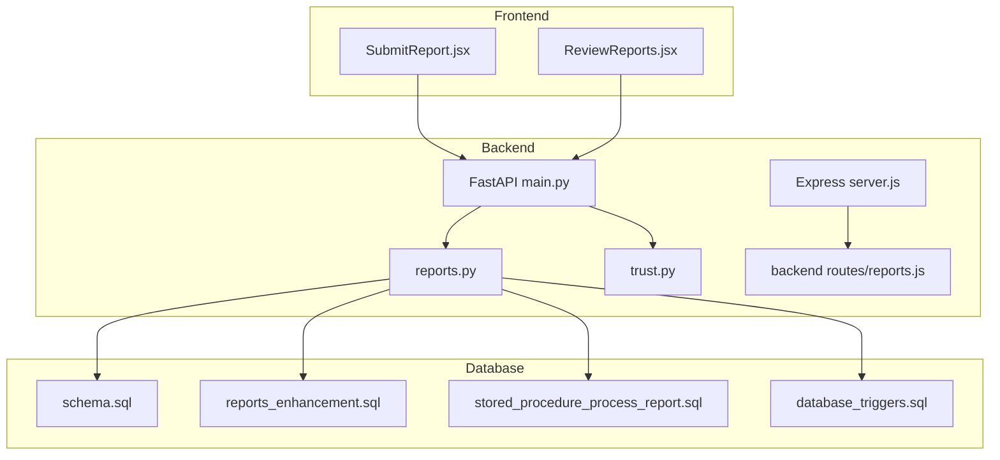
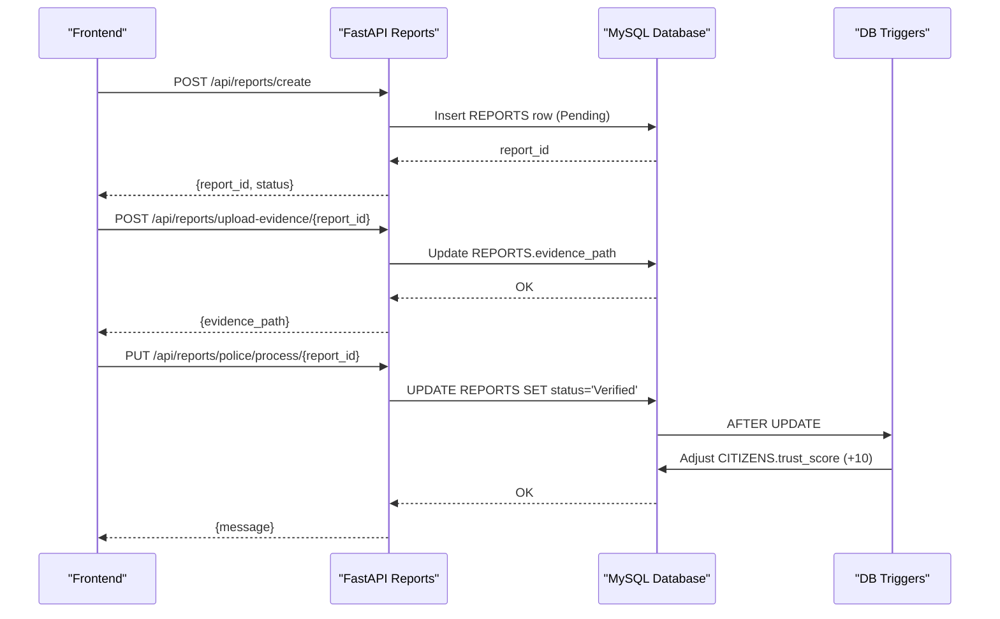
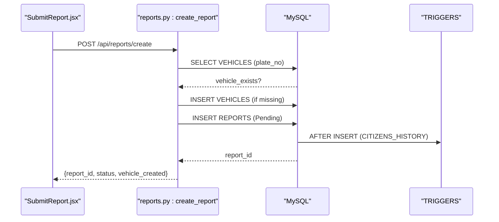
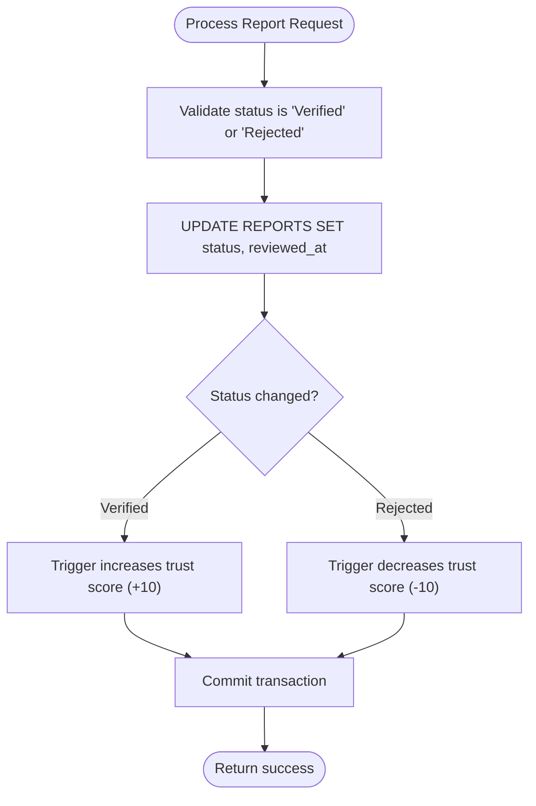
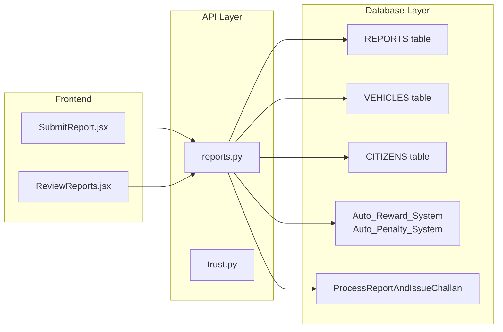

# Report Management Endpoints

<cite>
**Referenced Files in This Document**
- [server/main.py](file://server/main.py)
- [server/routes/reports.py](file://server/routes/reports.py)
- [server/routes/trust.py](file://server/routes/trust.py)
- [backend/server.js](file://backend/server.js)
- [backend/routes/reports.js](file://backend/routes/reports.js)
- [backend/middleware/auth.js](file://backend/middleware/auth.js)
- [db/schema.sql](file://db/schema.sql)
- [db/reports_enhancement.sql](file://db/reports_enhancement.sql)
- [db/stored_procedure_process_report.sql](file://db/stored_procedure_process_report.sql)
- [db/database_triggers.sql](file://db/database_triggers.sql)
- [frontend/src/pages/SubmitReport.jsx](file://frontend/src/pages/SubmitReport.jsx)
- [frontend/src/pages/ReviewReports.jsx](file://frontend/src/pages/ReviewReports.jsx)
- [server/REPORTS_API_DOCUMENTATION.md](file://server/REPORTS_API_DOCUMENTATION.md)
</cite>

## Table of Contents
1. [Introduction](#introduction)
2. [Project Structure](#project-structure)
3. [Core Components](#core-components)
4. [Architecture Overview](#architecture-overview)
5. [Detailed Component Analysis](#detailed-component-analysis)
6. [Dependency Analysis](#dependency-analysis)
7. [Performance Considerations](#performance-considerations)
8. [Troubleshooting Guide](#troubleshooting-guide)
9. [Conclusion](#conclusion)
10. [Appendices](#appendices)

## Introduction
This document provides comprehensive API documentation for the report management endpoints in the Traffic Violation Management System. It covers report submission, review, approval, and status tracking, including request/response schemas, status transitions, integration with the trust scoring system, and practical examples of the report lifecycle.

## Project Structure
The system consists of:
- A Python FastAPI backend serving the primary report management APIs under /api/reports
- An Express.js backend for legacy routes and complementary endpoints
- A MySQL database with enhanced report schema and triggers for trust scoring
- A React frontend that consumes the APIs for citizen submission and police review

**Diagram sources**
- [server/main.py:77-86](file://server/main.py#L77-L86)
- [server/routes/reports.py:14-146](file://server/routes/reports.py#L14-L146)
- [server/routes/trust.py:11-134](file://server/routes/trust.py#L11-L134)
- [backend/server.js:22-26](file://backend/server.js#L22-L26)
- [backend/routes/reports.js:5-54](file://backend/routes/reports.js#L5-L54)
- [db/schema.sql:114-136](file://db/schema.sql#L114-L136)
- [db/reports_enhancement.sql:17-47](file://db/reports_enhancement.sql#L17-L47)
- [db/stored_procedure_process_report.sql:8-98](file://db/stored_procedure_process_report.sql#L8-L98)
- [db/database_triggers.sql:10-35](file://db/database_triggers.sql#L10-L35)

**Section sources**
- [server/main.py:77-86](file://server/main.py#L77-L86)
- [backend/server.js:22-26](file://backend/server.js#L22-L26)

## Core Components
- Report submission endpoint for citizens with evidence upload support
- Report review and approval endpoints for police officers
- Trust scoring integration via database triggers
- Status tracking with lifecycle-aware transitions
- Frontend integration for seamless citizen and police workflows

**Section sources**
- [server/routes/reports.py:147-223](file://server/routes/reports.py#L147-L223)
- [server/routes/reports.py:411-511](file://server/routes/reports.py#L411-L511)
- [db/database_triggers.sql:10-35](file://db/database_triggers.sql#L10-L35)

## Architecture Overview
The report management system follows a layered architecture:
- Presentation layer: React frontend pages for citizen submission and police review
- API layer: FastAPI routes for report operations and trust scoring
- Business logic layer: Stored procedures and triggers for ACID-compliant processing
- Data layer: MySQL schema with enhanced report tracking and audit trails

**Diagram sources**
- [server/routes/reports.py:147-223](file://server/routes/reports.py#L147-L223)
- [server/routes/reports.py:50-121](file://server/routes/reports.py#L50-L121)
- [server/routes/reports.py:462-511](file://server/routes/reports.py#L462-L511)
- [db/database_triggers.sql:10-21](file://db/database_triggers.sql#L10-L21)

## Detailed Component Analysis

### Report Submission Endpoint
- Endpoint: POST /api/reports/create
- Purpose: Create a new report with automatic vehicle registration and initial status set to Pending
- Authentication: Requires valid JWT token with role "citizen"
- Request schema:
  - citizen_id: integer (from token)
  - plate_no: string (required)
  - violation_type: string (required)
  - location_coords: string (optional)
  - location_address: string (optional)
  - description: string (required)
  - evidence_path: string (optional)
- Response schema:
  - message: string
  - report_id: integer
  - status: string ("Pending")
  - vehicle_created: boolean (indicates if vehicle was newly created)

**Diagram sources**
- [server/routes/reports.py:147-223](file://server/routes/reports.py#L147-L223)
- [db/schema.sql:114-136](file://db/schema.sql#L114-L136)
- [db/database_triggers.sql:311-356](file://db/database_triggers.sql#L311-L356)

**Section sources**
- [server/routes/reports.py:147-223](file://server/routes/reports.py#L147-L223)
- [db/reports_enhancement.sql:17-37](file://db/reports_enhancement.sql#L17-L37)

### Evidence Upload Endpoint
- Endpoint: POST /api/reports/upload-evidence/{report_id}
- Purpose: Attach photographic evidence to a report
- Validation: Only JPEG/PNG images under 5MB are accepted
- Response schema:
  - message: string
  - report_id: integer
  - evidence_path: string (URL path)

**Section sources**
- [server/routes/reports.py:50-121](file://server/routes/reports.py#L50-L121)

### Report Retrieval for Citizens
- Endpoint: GET /api/reports/my-reports/{citizen_id}
- Purpose: Retrieve all reports filed by a specific citizen
- Response schema:
  - message: string
  - count: integer
  - reports: array of report objects with fields:
    - report_id, citizen_id, plate_no, violation_type
    - location_coords, location_address, description
    - status, date_reported, reviewed_at, reviewed_by

**Section sources**
- [server/routes/reports.py:225-272](file://server/routes/reports.py#L225-L272)

### Report Update Endpoint
- Endpoint: PUT /api/reports/update/{report_id}
- Purpose: Allow citizens to update Pending reports
- Constraints: Only Pending reports can be modified
- Request schema (partial updates):
  - plate_no: string (optional)
  - location_coords: string (optional)
  - location_address: string (optional)
  - description: string (optional)
- Response schema:
  - message: string
  - report_id: integer

**Section sources**
- [server/routes/reports.py:274-355](file://server/routes/reports.py#L274-L355)

### Report Deletion Endpoint
- Endpoint: DELETE /api/reports/delete/{report_id}
- Purpose: Allow citizens to withdraw Pending reports
- Constraints: Only Pending reports can be deleted
- Response schema:
  - message: string
  - report_id: integer

**Section sources**
- [server/routes/reports.py:357-409](file://server/routes/reports.py#L357-L409)

### Pending Reports for Police
- Endpoint: GET /api/reports/police/pending
- Purpose: Retrieve all Pending reports with citizen details for review
- Response schema:
  - message: string
  - count: integer
  - reports: array of report objects with:
    - report_id, citizen_id, plate_no, violation_type
    - location_coords, location_address, description, evidence_path
    - status, date_reported, reporter_name, reporter_email, reporter_trust_score

**Section sources**
- [server/routes/reports.py:411-460](file://server/routes/reports.py#L411-L460)

### Report Processing (Approval/Rejection)
- Endpoint: PUT /api/reports/police/process/{report_id}
- Purpose: Approve or reject a report
- Request schema:
  - status: string ("Verified" or "Rejected")
  - rule_id: integer (required for Verified)
  - badge_no: string (officer badge number)
- Response schema:
  - message: string indicating status update

**Diagram sources**
- [server/routes/reports.py:462-511](file://server/routes/reports.py#L462-L511)
- [db/database_triggers.sql:10-35](file://db/database_triggers.sql#L10-L35)

**Section sources**
- [server/routes/reports.py:462-511](file://server/routes/reports.py#L462-L511)

### Report Deletion (Global)
- Endpoint: DELETE /api/reports/{report_id}
- Purpose: Delete a report (citizen can delete Pending reports, police can delete any)
- Response schema:
  - message: string
  - report_id: integer

**Section sources**
- [server/routes/reports.py:513-563](file://server/routes/reports.py#L513-L563)

### Legacy Express Routes (Compatibility)
The Express backend exposes a simplified citizen-only report submission endpoint:
- POST /api/reports (legacy)
- GET /api/reports/my (legacy)

These endpoints are maintained for backward compatibility and use the same database schema.

**Section sources**
- [backend/routes/reports.js:7-51](file://backend/routes/reports.js#L7-L51)

## Dependency Analysis
The report management system integrates multiple components:

**Diagram sources**
- [server/routes/reports.py:14-146](file://server/routes/reports.py#L14-L146)
- [db/schema.sql:114-136](file://db/schema.sql#L114-L136)
- [db/database_triggers.sql:10-35](file://db/database_triggers.sql#L10-L35)
- [db/stored_procedure_process_report.sql:8-98](file://db/stored_procedure_process_report.sql#L8-L98)

Key dependencies:
- JWT authentication middleware for role verification
- Database triggers for automatic trust scoring
- Stored procedures for ACID-compliant processing
- Frontend components for user interaction

**Section sources**
- [backend/middleware/auth.js:5-37](file://backend/middleware/auth.js#L5-L37)
- [db/database_triggers.sql:10-35](file://db/database_triggers.sql#L10-L35)
- [db/stored_procedure_process_report.sql:8-98](file://db/stored_procedure_process_report.sql#L8-L98)

## Performance Considerations
- Database indexing on report status, violation type, and location coordinates
- Efficient pagination for large report lists
- Asynchronous evidence upload handling
- Minimal payload sizes for frequent polling in frontend review interface
- Connection pooling and timeout configurations in database layer

## Troubleshooting Guide

### Common Error Scenarios
- **Missing Evidence**: Evidence upload requires JPEG/PNG under 5MB; otherwise returns 400 with specific error message
- **Status Transition Errors**: Attempting to update/delete non-Pending reports results in 400 with explanatory message
- **Authentication Failures**: Missing or invalid JWT tokens return 401 or 403
- **Report Not Found**: Operations on non-existent report IDs return 404

### Trust Scoring Integration Issues
- Trust score adjustments occur automatically via database triggers
- Verify trigger execution by checking CITIZENS table after status changes
- Monitor CITIZENS_HISTORY for audit trail of trust score mutations

### Frontend Integration Tips
- SubmitReport.jsx demonstrates sequential submission flow: create report then upload evidence
- ReviewReports.jsx shows real-time polling for pending reports with automatic refresh

**Section sources**
- [server/routes/reports.py:50-121](file://server/routes/reports.py#L50-L121)
- [server/routes/reports.py:274-355](file://server/routes/reports.py#L274-L355)
- [frontend/src/pages/SubmitReport.jsx:92-177](file://frontend/src/pages/SubmitReport.jsx#L92-L177)
- [frontend/src/pages/ReviewReports.jsx:37-61](file://frontend/src/pages/ReviewReports.jsx#L37-L61)

## Conclusion
The report management system provides a robust, secure, and auditable framework for traffic violation reporting. Its integration with trust scoring ensures accountability while maintaining user privacy and system reliability. The documented endpoints, schemas, and workflows enable seamless citizen and police interactions with comprehensive error handling and audit capabilities.

## Appendices

### API Reference Summary
- POST /api/reports/create: Submit new report with evidence
- POST /api/reports/upload-evidence/{report_id}: Attach photographic evidence
- GET /api/reports/my-reports/{citizen_id}: Retrieve citizen's reports
- PUT /api/reports/update/{report_id}: Update Pending reports
- DELETE /api/reports/delete/{report_id}: Withdraw Pending reports
- GET /api/reports/police/pending: View pending reports for review
- PUT /api/reports/police/process/{report_id}: Approve or reject reports
- DELETE /api/reports/{report_id}: Delete reports (role-dependent)

### Status Enumeration
- Pending: Initial state after submission
- Verified: Approved by police officer
- Rejected: Dismissed by police officer
- Challan Issued: Fine generated (enhanced schema)

### Trust Scoring Rules
- Verified reports: +10 trust score, +5 reward points
- Rejected reports: -10 trust score (minimum 0)
- Automatic adjustments via database triggers