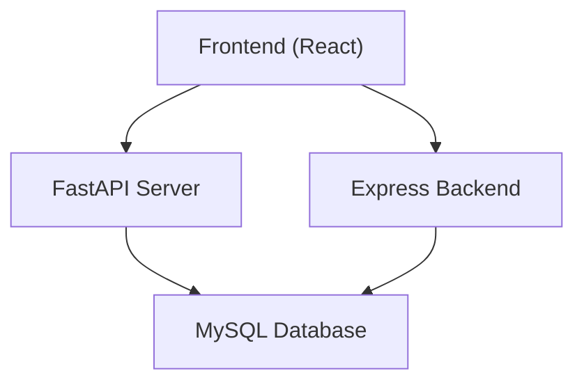
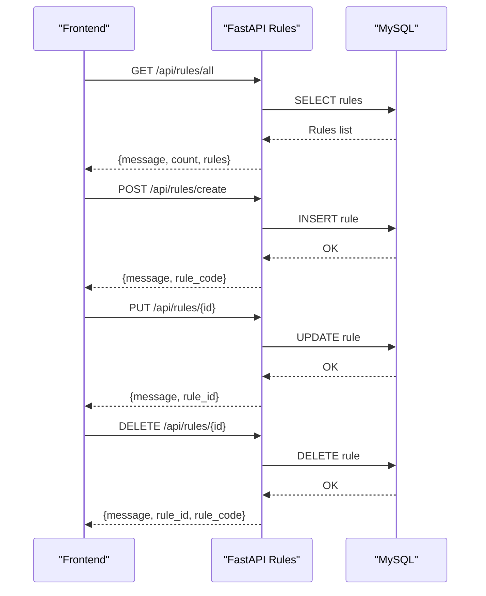
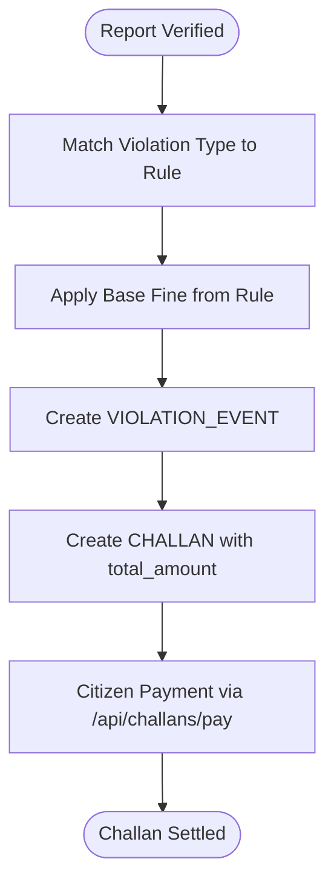
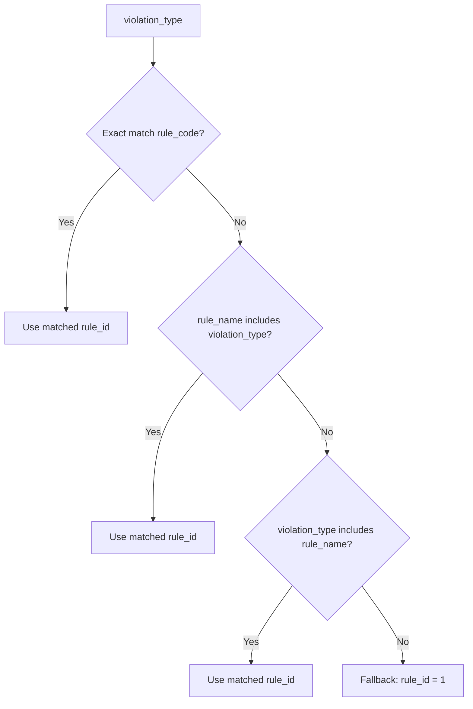
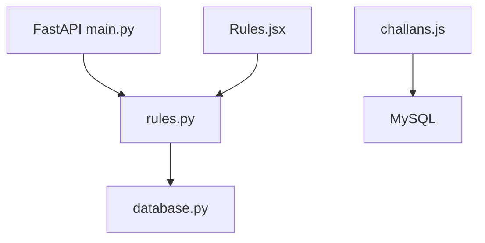

# Rules and Violations Endpoints

<cite>
**Referenced Files in This Document**
- [main.py](file://server/main.py)
- [rules.py](file://server/routes/rules.py)
- [schema.sql](file://db/schema.sql)
- [Rules.jsx](file://frontend/src/pages/Rules.jsx)
- [challans.js](file://backend/routes/challans.js)
- [database.py](file://server/database.py)
</cite>

## Table of Contents
1. [Introduction](#introduction)
2. [Project Structure](#project-structure)
3. [Core Components](#core-components)
4. [Architecture Overview](#architecture-overview)
5. [Detailed Component Analysis](#detailed-component-analysis)
6. [Dependency Analysis](#dependency-analysis)
7. [Performance Considerations](#performance-considerations)
8. [Troubleshooting Guide](#troubleshooting-guide)
9. [Conclusion](#conclusion)

## Introduction
This document provides comprehensive API documentation for the rules and violations management endpoints in the Traffic Violation Management System. It focuses on:
- Violation type definitions retrieval
- Penalty calculation mechanisms
- Compliance checking workflows
- Policy updates for violation rules

It also documents HTTP methods, request/response schemas, regulatory compliance considerations, and integration points with the challan generation pipeline.

## Project Structure
The system is split into:
- Backend (Express.js): Authentication, reports, challans, and basic routing
- Server (FastAPI): Core business logic including rules, reports, challans, vehicles, analytics, and police operations
- Frontend (React): Citizen and police UI for viewing and managing rules
- Database (MySQL): Schema and seed data for violation rules, reports, challans, and related entities

**Diagram sources**
- [main.py:77-82](file://server/main.py#L77-L82)
- [backend/server.js:22-26](file://backend/server.js#L22-L26)

**Section sources**
- [main.py:77-82](file://server/main.py#L77-L82)
- [backend/server.js:22-26](file://backend/server.js#L22-L26)

## Core Components
- Rules Management API (FastAPI): Provides CRUD operations for violation rules and exposes rule lists for citizens and police.
- Challans API (Express): Handles challan issuance and payment linked to rules.
- Frontend Rules Page: Displays rules and allows police to create/update/delete rules.
- Database Schema: Defines VIOLATION_RULES and related entities.

Key endpoints:
- GET /api/rules/all: Retrieve all rules for citizens
- GET /api/rules/{rule_id}: Retrieve a single rule
- PUT /api/rules/{rule_id}: Update rule attributes (e.g., base fine amount)
- POST /api/rules/create: Create a new rule
- DELETE /api/rules/{rule_id}: Delete a rule

Response formats include metadata, counts, and rule records with severity and time-of-violation categorization.

**Section sources**
- [rules.py:58-98](file://server/routes/rules.py#L58-L98)
- [rules.py:105-144](file://server/routes/rules.py#L105-L144)
- [rules.py:157-250](file://server/routes/rules.py#L157-L250)
- [rules.py:252-324](file://server/routes/rules.py#L252-L324)
- [rules.py:326-377](file://server/routes/rules.py#L326-L377)

## Architecture Overview
The rules and violations system integrates with the broader challan pipeline:
- Reports are submitted and processed
- Violation rules are matched to reports
- Challans are generated with calculated penalties
- Payments are processed via the challans API

**Diagram sources**
- [rules.py:58-98](file://server/routes/rules.py#L58-L98)
- [rules.py:252-324](file://server/routes/rules.py#L252-L324)
- [rules.py:326-377](file://server/routes/rules.py#L326-L377)

## Detailed Component Analysis

### Violation Type Definitions (/api/rules/all)
Purpose:
- Provide a comprehensive list of active violation rules for public awareness and reference.

HTTP Method and Endpoint:
- GET /api/rules/all

Request:
- No path or query parameters required.

Response:
- message: Human-readable status
- count: Number of returned rules
- rules: Array of rule objects with fields:
  - rule_id, rule_code, rule_name, description
  - base_fine_amount (numeric)
  - severity: Minor | Moderate | Major | Critical
  - violation_time: Anytime | Daytime | Nighttime
  - is_active: boolean
  - created_at: ISO timestamp

Validation and Constraints:
- Severity must be one of the enumerated values.
- Violation time must be one of the enumerated values.
- Base fine amount is numeric; returned as float.

Regulatory Compliance:
- Rules align with typical traffic regulations and reflect categorization by severity and timing.

Integration Notes:
- Used by the frontend Rules page for display and filtering.

**Section sources**
- [rules.py:58-98](file://server/routes/rules.py#L58-L98)
- [schema.sql:868-880](file://db/schema.sql#L868-L880)
- [Rules.jsx:35-58](file://frontend/src/pages/Rules.jsx#L35-L58)

### Penalty Calculation (/api/rules/calculate)
Note: There is no dedicated endpoint named /api/rules/calculate in the current codebase. However, the challan generation pipeline uses rule-defined base fines to compute penalties.

Mechanism:
- Base fine amount is stored per rule in VIOLATION_RULES.
- Challans are generated with total_amount derived from the applicable rule’s base_fine_amount.
- Example: Overloading rule has a base fine amount of 4000.00; a challan is created with this amount.

Workflow:
- Reports are verified and mapped to a rule.
- VIOLATION_EVENTS links a report to a rule and vehicle.
- CHALLANS records the event, citizen, issuing officer, and total_amount.

**Diagram sources**
- [schema.sql:906-910](file://db/schema.sql#L906-L910)
- [challans.js:31-98](file://backend/routes/challans.js#L31-L98)

**Section sources**
- [schema.sql:868-880](file://db/schema.sql#L868-L880)
- [schema.sql:906-910](file://db/schema.sql#L906-L910)
- [challans.js:31-98](file://backend/routes/challans.js#L31-L98)

### Compliance Checking (/api/rules/compliance)
Note: There is no dedicated endpoint named /api/rules/compliance in the current codebase. Compliance checks are part of the broader report verification and challan generation workflow.

Typical Compliance Checks:
- Rule existence and activation
- Severity classification alignment with violation type
- Time-of-violation constraints (e.g., DUI applies at nighttime)
- Vehicle and driver documentation validity (linked via reports and challans)

Integration:
- Reports are created with violation_type and vehicle details.
- Police verify reports and select appropriate rule_id.
- Active rules ensure only valid penalties are applied.

**Section sources**
- [rules.py:157-250](file://server/routes/rules.py#L157-L250)
- [schema.sql:868-880](file://db/schema.sql#L868-L880)

### Policy Updates (/api/rules/update)
Note: There is no endpoint named /api/rules/update. The correct endpoints for updating rules are:
- PUT /api/rules/{rule_id}: Update rule attributes
- POST /api/rules/create: Create new rule
- DELETE /api/rules/{rule_id}: Delete rule

Update Fields (PUT):
- rule_name: Optional
- description: Optional
- base_fine_amount: Optional numeric
- severity: Optional (Minor | Moderate | Major | Critical)
- violation_time: Optional (Anytime | Daytime | Nighttime)
- is_active: Optional boolean

Validation:
- Severity and violation_time are validated against allowed values.
- At least one field must be provided for update.
- Non-existent rule_id returns 404.

Response:
- message: Operation status
- rule_id: Updated rule identifier

**Section sources**
- [rules.py:157-250](file://server/routes/rules.py#L157-L250)
- [rules.py:252-324](file://server/routes/rules.py#L252-L324)
- [rules.py:326-377](file://server/routes/rules.py#L326-L377)

### Rule Matching Logic (Supporting Dynamic Penalty Calculation)
The system uses a prioritized matching strategy to associate violation types with rules during report processing. This ensures accurate penalty calculation.

Matching Priority:
1. Exact match: rule_code equals violation_type
2. Partial match: rule_name includes violation_type
3. Partial match: violation_type includes rule_name
4. Fallback: default rule_id = 1

Examples:
- "No Helmet" matches "Driving without Helmet" (rule_id 3)
- "Overspeeding" matches "Overspeeding" (rule_id 7)
- "Red Light" matches "Disobedience of Traffic Signal" (rule_id 3)
- Unknown type falls back to default rule

**Diagram sources**
- [APPROVE_BUTTON_AND_REALTIME_DASHBOARD_FIX.md:106-120](file://APPROVE_BUTTON_AND_REALTIME_DASHBOARD_FIX.md#L106-L120)

**Section sources**
- [APPROVE_BUTTON_AND_REALTIME_DASHBOARD_FIX.md:106-120](file://APPROVE_BUTTON_AND_REALTIME_DASHBOARD_FIX.md#L106-L120)

## Dependency Analysis
- FastAPI main application mounts the rules router under /api/rules.
- Rules endpoints depend on the database connection pool abstraction.
- Challans endpoints depend on the database and enforce row-level locking for payments.
- Frontend interacts with FastAPI rules endpoints for rule management.

**Diagram sources**
- [main.py:77-82](file://server/main.py#L77-L82)
- [database.py:45-76](file://server/database.py#L45-L76)
- [Rules.jsx:35-58](file://frontend/src/pages/Rules.jsx#L35-L58)
- [challans.js:31-98](file://backend/routes/challans.js#L31-L98)

**Section sources**
- [main.py:77-82](file://server/main.py#L77-L82)
- [database.py:45-76](file://server/database.py#L45-L76)
- [Rules.jsx:35-58](file://frontend/src/pages/Rules.jsx#L35-L58)
- [challans.js:31-98](file://backend/routes/challans.js#L31-L98)

## Performance Considerations
- Use pagination or filtering on the /api/rules/all endpoint for large datasets.
- Indexes on rule_code and rule_name improve matching performance.
- Batch operations for rule updates (PUT) reduce round trips.
- Connection pooling in database.py minimizes overhead for concurrent requests.

## Troubleshooting Guide
Common Issues and Resolutions:
- Database connection failures: Verify credentials and network connectivity; check pool initialization logs.
- Rule not found errors: Confirm rule_id exists and is active.
- Validation errors on updates: Ensure severity and violation_time are among allowed values; provide at least one field to update.
- Challan payment conflicts: Row-level locking prevents race conditions; retry after conflict resolution.

**Section sources**
- [database.py:45-76](file://server/database.py#L45-L76)
- [rules.py:157-250](file://server/routes/rules.py#L157-L250)
- [challans.js:31-98](file://backend/routes/challans.js#L31-L98)

## Conclusion
The rules and violations management system provides a robust foundation for defining, enforcing, and integrating traffic regulations with the challan generation pipeline. While dedicated endpoints for calculation and compliance are not explicitly defined, the underlying architecture supports dynamic penalty computation and regulatory alignment through rule-based matching and enforcement.