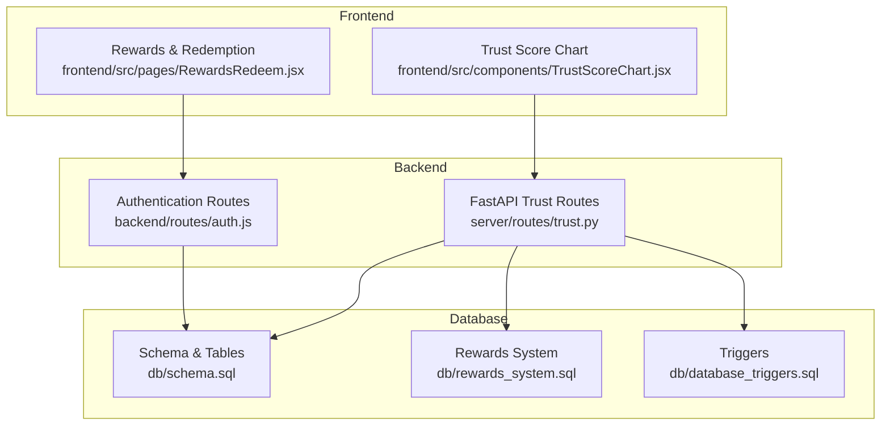
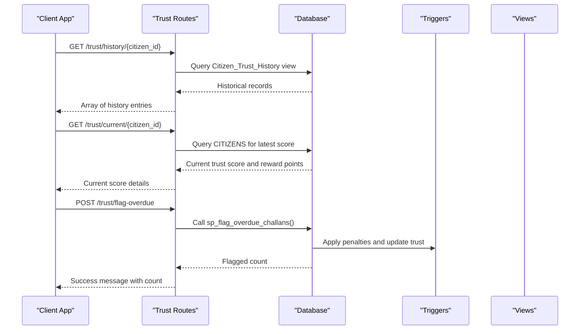
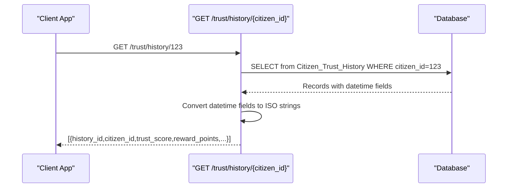
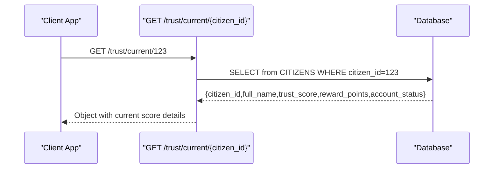
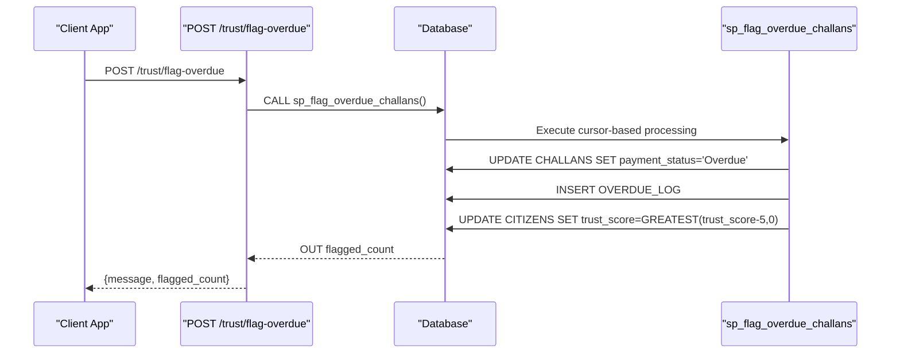
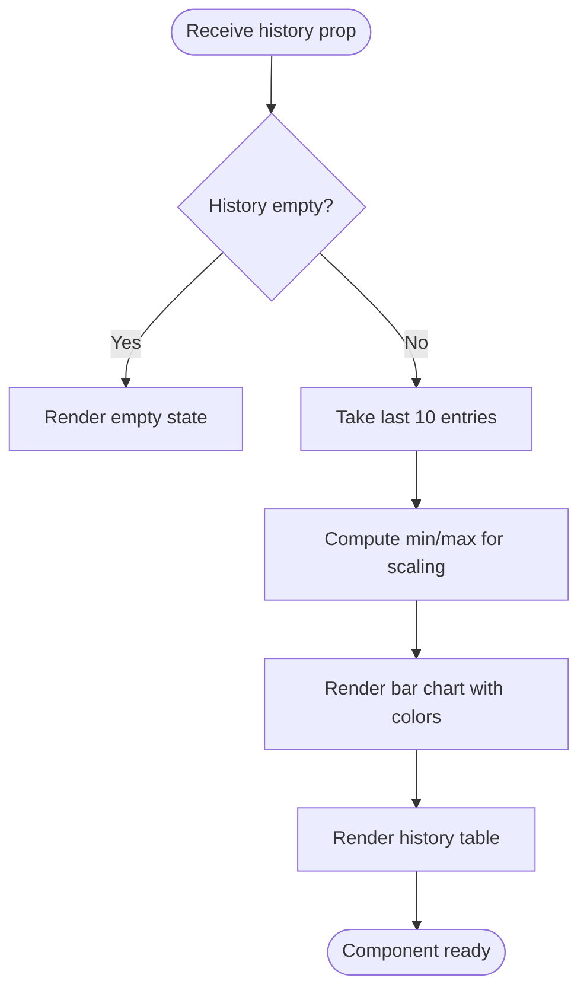
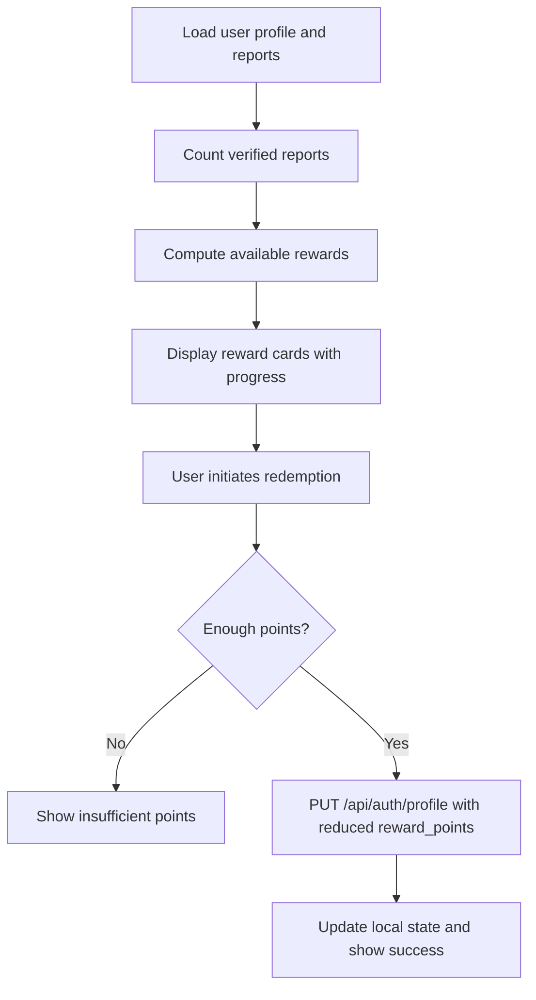
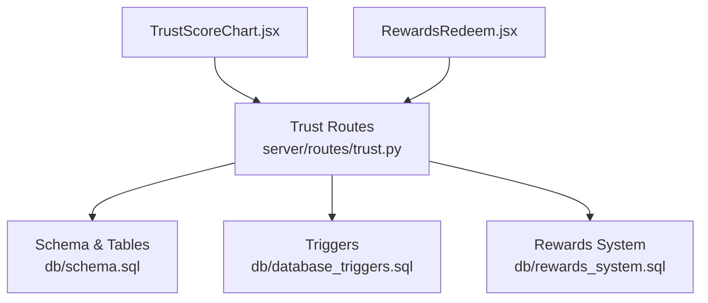

# Trust Score Management Endpoints

<cite>
**Referenced Files in This Document**
- [trust.py](file://server/routes/trust.py)
- [schema.sql](file://db/schema.sql)
- [rewards_system.sql](file://db/rewards_system.sql)
- [database_triggers.sql](file://db/database_triggers.sql)
- [TrustScoreChart.jsx](file://frontend/src/components/TrustScoreChart.jsx)
- [RewardsRedeem.jsx](file://frontend/src/pages/RewardsRedeem.jsx)
- [auth.js](file://backend/routes/auth.js)
</cite>

## Table of Contents
1. [Introduction](#introduction)
2. [Project Structure](#project-structure)
3. [Core Components](#core-components)
4. [Architecture Overview](#architecture-overview)
5. [Detailed Component Analysis](#detailed-component-analysis)
6. [Dependency Analysis](#dependency-analysis)
7. [Performance Considerations](#performance-considerations)
8. [Troubleshooting Guide](#troubleshooting-guide)
9. [Conclusion](#conclusion)

## Introduction
This document provides comprehensive API documentation for trust score management endpoints within the Traffic Violation Management System. It covers:
- Trust score calculation and history retrieval
- Reward point management and redemption
- Reputation updates integrated with the overall reputation system
- Automated scoring workflows, penalty impact calculations, and integration with user privileges and benefits

The trust score system is governed by database triggers and stored procedures that automatically adjust citizen trust scores and reward points based on report verification and payment activities. The frontend components visualize trust history and enable reward redemption.

## Project Structure
The trust score management functionality spans backend FastAPI routes, database schema and triggers, and frontend components for visualization and redemption.

**Diagram sources**
- [trust.py:15-134](file://server/routes/trust.py#L15-L134)
- [schema.sql:26-43](file://db/schema.sql#L26-L43)
- [rewards_system.sql:10-127](file://db/rewards_system.sql#L10-L127)
- [database_triggers.sql:8-35](file://db/database_triggers.sql#L8-L35)
- [TrustScoreChart.jsx:1-126](file://frontend/src/components/TrustScoreChart.jsx#L1-L126)
- [RewardsRedeem.jsx:1-437](file://frontend/src/pages/RewardsRedeem.jsx#L1-L437)
- [auth.js:9-117](file://backend/routes/auth.js#L9-L117)

**Section sources**
- [trust.py:1-134](file://server/routes/trust.py#L1-L134)
- [schema.sql:26-43](file://db/schema.sql#L26-L43)
- [rewards_system.sql:10-127](file://db/rewards_system.sql#L10-L127)
- [database_triggers.sql:8-35](file://db/database_triggers.sql#L8-L35)
- [TrustScoreChart.jsx:1-126](file://frontend/src/components/TrustScoreChart.jsx#L1-L126)
- [RewardsRedeem.jsx:1-437](file://frontend/src/pages/RewardsRedeem.jsx#L1-L437)
- [auth.js:9-117](file://backend/routes/auth.js#L9-L117)

## Core Components
- Trust History Endpoint: Retrieves temporal trust score history for a citizen.
- Current Trust Score Endpoint: Returns the latest trust score and reward points for a citizen.
- Overdue Challan Flagging Endpoint: Allows authorized police to manually trigger overdue challan processing, applying penalties and adjusting trust scores.
- Frontend Trust Visualization: Renders trust score history charts and tables.
- Rewards Catalog and Redemption: Manages reward point accumulation and redemption.

**Section sources**
- [trust.py:15-134](file://server/routes/trust.py#L15-L134)
- [TrustScoreChart.jsx:1-126](file://frontend/src/components/TrustScoreChart.jsx#L1-L126)
- [RewardsRedeem.jsx:1-437](file://frontend/src/pages/RewardsRedeem.jsx#L1-L437)

## Architecture Overview
The trust score system operates through a combination of backend APIs, database triggers, and stored procedures. Automated triggers adjust trust scores and reward points based on report status changes and payment activities. The frontend consumes these endpoints to present trust history and enable reward redemption.

**Diagram sources**
- [trust.py:15-134](file://server/routes/trust.py#L15-L134)
- [schema.sql:757-800](file://db/schema.sql#L757-L800)
- [database_triggers.sql:8-35](file://db/database_triggers.sql#L8-L35)

## Detailed Component Analysis

### Trust History Endpoint
- Path: `/trust/history/{citizen_id}`
- Method: GET
- Authentication: Requires citizen role; enforces self-view policy
- Request parameters:
  - Path parameter: `citizen_id` (integer)
- Response format: Array of historical records with fields:
  - `history_id`: Unique identifier
  - `citizen_id`: Associated citizen
  - `full_name`: Citizen name
  - `trust_score`: Trust score at the time of change
  - `reward_points`: Reward points at the time of change
  - `account_status`: Account status at the time of change
  - `valid_from`: Effective period start
  - `valid_to`: Effective period end
  - `operation_type`: Type of operation (INSERT/UPDATE/DELETE)
  - `changed_at`: Timestamp of change
  - `changed_by`: Entity that made the change
- Notes:
  - Dates are serialized as ISO format strings.
  - Only the citizen themselves can access their own history.

**Diagram sources**
- [trust.py:15-60](file://server/routes/trust.py#L15-L60)
- [schema.sql:49-65](file://db/schema.sql#L49-L65)

**Section sources**
- [trust.py:15-60](file://server/routes/trust.py#L15-L60)
- [schema.sql:49-65](file://db/schema.sql#L49-L65)

### Current Trust Score Endpoint
- Path: `/trust/current/{citizen_id}`
- Method: GET
- Authentication: Requires citizen role; enforces self-view policy
- Request parameters:
  - Path parameter: `citizen_id` (integer)
- Response format: Object containing:
  - `citizen_id`: Identifier
  - `full_name`: Name
  - `trust_score`: Current trust score
  - `reward_points`: Current reward points
  - `account_status`: Current account status
- Notes:
  - Returns 404 if citizen not found.
  - Self-access restriction enforced.

**Diagram sources**
- [trust.py:63-101](file://server/routes/trust.py#L63-L101)
- [schema.sql:26-43](file://db/schema.sql#L26-L43)

**Section sources**
- [trust.py:63-101](file://server/routes/trust.py#L63-L101)
- [schema.sql:26-43](file://db/schema.sql#L26-L43)

### Overdue Challan Flagging Endpoint
- Path: `/trust/flag-overdue`
- Method: POST
- Authentication: Requires police role
- Request body: None (no parameters)
- Response format: Object containing:
  - `message`: Operation completion message
  - `flagged_count`: Number of overdue challans processed
- Notes:
  - Calls stored procedure `sp_flag_overdue_challans`.
  - Applies 15% late penalty to unpaid overdue challans.
  - Updates `OVERDUE_LOG` and adjusts citizen trust scores by -5 per flagged challan.
  - Commits transaction and returns processed count.

**Diagram sources**
- [trust.py:104-134](file://server/routes/trust.py#L104-L134)
- [schema.sql:688-754](file://db/schema.sql#L688-L754)

**Section sources**
- [trust.py:104-134](file://server/routes/trust.py#L104-L134)
- [schema.sql:688-754](file://db/schema.sql#L688-L754)

### Frontend Trust Visualization
- Component: TrustScoreChart
- Purpose: Visualizes trust score history and account status changes.
- Features:
  - Bar chart rendering trust score over recent history.
  - Tabular display of history entries with status and operation type.
  - Color-coded status indicators and operation badges.
- Data consumption:
  - Receives history array from trust history endpoint.
  - Displays up to 10 most recent entries.

**Diagram sources**
- [TrustScoreChart.jsx:1-126](file://frontend/src/components/TrustScoreChart.jsx#L1-L126)

**Section sources**
- [TrustScoreChart.jsx:1-126](file://frontend/src/components/TrustScoreChart.jsx#L1-L126)

### Rewards Catalog and Redemption
- Data model:
  - `REWARDS_CATALOG`: Defines available rewards with point requirements and criteria.
  - `REDEMPTION_HISTORY`: Tracks reward redemptions for audit.
- Frontend behavior:
  - Calculates available rewards based on trust score and verified report counts.
  - Enables redemption by reducing reward points via profile update.
- Integration:
  - Reward points are also managed by database triggers and stored procedures that respond to report verification and payment activities.

**Diagram sources**
- [RewardsRedeem.jsx:69-213](file://frontend/src/pages/RewardsRedeem.jsx#L69-L213)
- [rewards_system.sql:10-127](file://db/rewards_system.sql#L10-L127)

**Section sources**
- [RewardsRedeem.jsx:69-213](file://frontend/src/pages/RewardsRedeem.jsx#L69-L213)
- [rewards_system.sql:10-127](file://db/rewards_system.sql#L10-L127)

## Dependency Analysis
Trust score management depends on:
- Database schema defining core entities and temporal tables
- Triggers that automatically adjust trust scores and reward points
- Stored procedures for complex operations like overdue challan processing
- Frontend components that visualize and act upon trust data

**Diagram sources**
- [trust.py:15-134](file://server/routes/trust.py#L15-L134)
- [schema.sql:26-43](file://db/schema.sql#L26-L43)
- [database_triggers.sql:8-35](file://db/database_triggers.sql#L8-L35)
- [rewards_system.sql:10-127](file://db/rewards_system.sql#L10-L127)
- [TrustScoreChart.jsx:1-126](file://frontend/src/components/TrustScoreChart.jsx#L1-L126)
- [RewardsRedeem.jsx:1-437](file://frontend/src/pages/RewardsRedeem.jsx#L1-L437)

**Section sources**
- [trust.py:15-134](file://server/routes/trust.py#L15-L134)
- [schema.sql:26-43](file://db/schema.sql#L26-L43)
- [database_triggers.sql:8-35](file://db/database_triggers.sql#L8-L35)
- [rewards_system.sql:10-127](file://db/rewards_system.sql#L10-L127)
- [TrustScoreChart.jsx:1-126](file://frontend/src/components/TrustScoreChart.jsx#L1-L126)
- [RewardsRedeem.jsx:1-437](file://frontend/src/pages/RewardsRedeem.jsx#L1-L437)

## Performance Considerations
- Indexes on temporal columns (`valid_from`, `valid_to`) and status fields support efficient historical queries.
- Triggers operate at statement level; ensure report verification frequency aligns with expected load.
- Stored procedures encapsulate complex operations (overdue processing) and use cursors; monitor execution time under heavy load.
- Frontend rendering limits history display to recent entries to minimize DOM overhead.

## Troubleshooting Guide
- Trust score not updating after report verification:
  - Verify triggers are installed and active.
  - Confirm report status transitions from Pending to Verified/Rejected.
  - Check for errors in stored procedures and trigger execution logs.
- Overdue challan flagging returns zero processed:
  - Ensure unpaid challans exist past due date.
  - Confirm stored procedure executes without exceptions.
- Reward points mismatch:
  - Validate reward calculation logic and trigger-based updates.
  - Check frontend nullish coalescing behavior for stale localStorage values.

**Section sources**
- [database_triggers.sql:8-35](file://db/database_triggers.sql#L8-L35)
- [schema.sql:688-754](file://db/schema.sql#L688-L754)
- [RewardsRedeem.jsx:169-213](file://frontend/src/pages/RewardsRedeem.jsx#L169-L213)

## Conclusion
The trust score management system integrates backend APIs, database triggers, and stored procedures to provide an automated, auditable reputation mechanism. Citizens benefit from transparent trust history, while reward systems incentivize positive contributions. The architecture ensures scalability and maintainability through well-defined endpoints, robust data models, and clear separation of concerns between backend logic and frontend presentation.