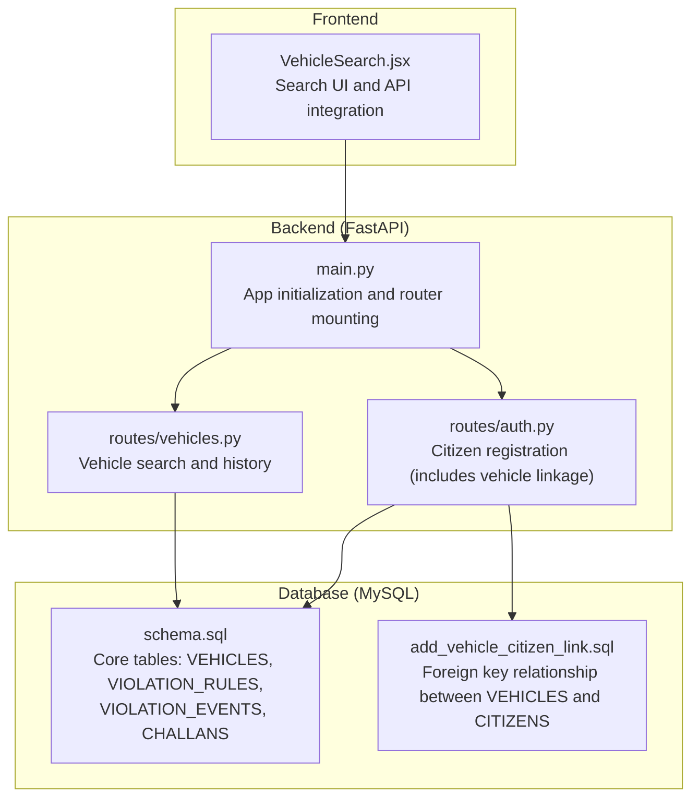
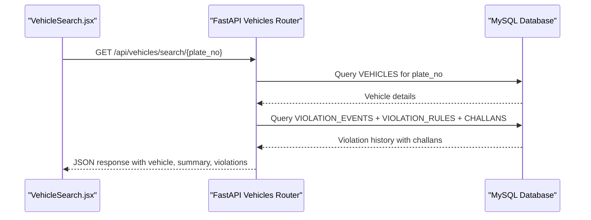
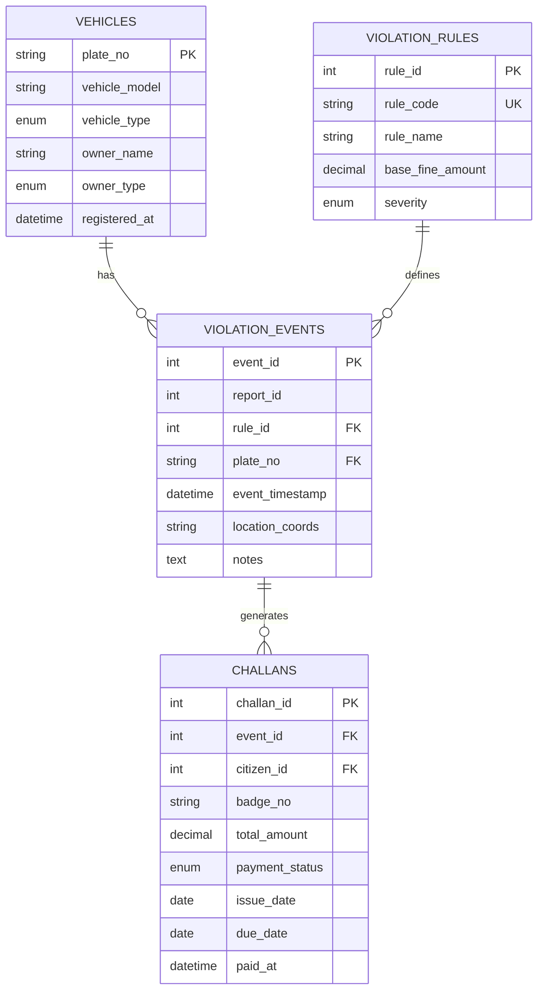
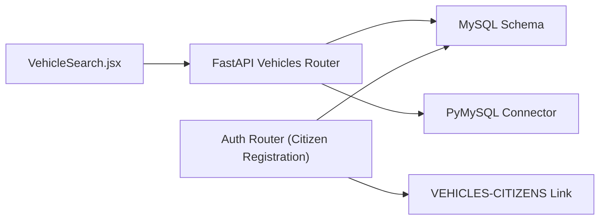

# Vehicle Management Endpoints

<cite>
**Referenced Files in This Document**
- [main.py](file://server/main.py)
- [vehicles.py](file://server/routes/vehicles.py)
- [schema.sql](file://db/schema.sql)
- [VehicleSearch.jsx](file://frontend/src/pages/VehicleSearch.jsx)
- [auth.py](file://server/routes/auth.py)
- [add_vehicle_citizen_link.sql](file://db/add_vehicle_citizen_link.sql)
</cite>

## Table of Contents
1. [Introduction](#introduction)
2. [Project Structure](#project-structure)
3. [Core Components](#core-components)
4. [Architecture Overview](#architecture-overview)
5. [Detailed Component Analysis](#detailed-component-analysis)
6. [Dependency Analysis](#dependency-analysis)
7. [Performance Considerations](#performance-considerations)
8. [Troubleshooting Guide](#troubleshooting-guide)
9. [Conclusion](#conclusion)

## Introduction
This document provides comprehensive API documentation for vehicle management endpoints within the Traffic Violation Management System. It focuses on four key areas:
- Vehicle registration via citizen onboarding
- Vehicle search and violation history retrieval
- Ownership verification and compliance checks
- Integration with the reporting system for vehicle-related violations

The documentation covers HTTP methods, request/response schemas, data models, example workflows, and operational considerations derived from the FastAPI backend, MySQL database schema, and frontend integration.

## Project Structure
The vehicle management functionality is implemented in a FastAPI application with dedicated routes and a robust relational database schema. The system exposes vehicle-related endpoints under the /api/vehicles namespace and integrates with the broader reporting and challan issuance pipeline.

**Diagram sources**
- [main.py:77-86](file://server/main.py#L77-L86)
- [vehicles.py:36-145](file://server/routes/vehicles.py#L36-L145)
- [auth.py:114-216](file://server/routes/auth.py#L114-L216)
- [schema.sql:84-195](file://db/schema.sql#L84-L195)
- [add_vehicle_citizen_link.sql:9-13](file://db/add_vehicle_citizen_link.sql#L9-L13)
- [VehicleSearch.jsx:13-44](file://frontend/src/pages/VehicleSearch.jsx#L13-L44)

**Section sources**
- [main.py:77-86](file://server/main.py#L77-L86)
- [vehicles.py:36-145](file://server/routes/vehicles.py#L36-L145)
- [auth.py:114-216](file://server/routes/auth.py#L114-L216)
- [schema.sql:84-195](file://db/schema.sql#L84-L195)
- [add_vehicle_citizen_link.sql:9-13](file://db/add_vehicle_citizen_link.sql#L9-L13)
- [VehicleSearch.jsx:13-44](file://frontend/src/pages/VehicleSearch.jsx#L13-L44)

## Core Components
- Vehicle search endpoint: Retrieves vehicle registration details and violation history for a given plate number, including summary statistics.
- Citizen registration endpoint: Registers a new citizen and automatically creates/links a vehicle record during onboarding.
- Database schema: Defines core entities (VEHICLES, VIOLATION_RULES, VIOLATION_EVENTS, CHALLANS) and their relationships.
- Frontend integration: Provides a user interface to search vehicles and displays results with violation summaries.

Key implementation references:
- Vehicle search route definition and logic
- Citizen registration route and vehicle linkage
- Database schema for VEHICLES and related entities
- Frontend VehicleSearch page integration

**Section sources**
- [vehicles.py:36-145](file://server/routes/vehicles.py#L36-L145)
- [auth.py:114-216](file://server/routes/auth.py#L114-L216)
- [schema.sql:84-195](file://db/schema.sql#L84-L195)
- [VehicleSearch.jsx:13-44](file://frontend/src/pages/VehicleSearch.jsx#L13-L44)

## Architecture Overview
The vehicle management system follows a layered architecture:
- Presentation layer: Frontend UI for vehicle search
- API layer: FastAPI routes for vehicle operations
- Data access layer: PyMySQL connections to MySQL database
- Persistence layer: Relational schema with normalized tables and referential integrity

**Diagram sources**
- [VehicleSearch.jsx:27-38](file://frontend/src/pages/VehicleSearch.jsx#L27-L38)
- [vehicles.py:36-145](file://server/routes/vehicles.py#L36-L145)
- [schema.sql:84-195](file://db/schema.sql#L84-L195)

## Detailed Component Analysis

### Vehicle Search Endpoint
- Path: /api/vehicles/search/{plate_no}
- Method: GET
- Description: Searches for a vehicle by plate number and returns registration details, violation history, and summary statistics.

Request
- Path parameters:
  - plate_no (string): Vehicle plate number (case-insensitive in query, uppercase normalization recommended)

Response
- Body fields:
  - message (string): Operation status message
  - vehicle (object): Vehicle registration details
    - plate_no (string)
    - vehicle_model (string or null)
    - vehicle_type (enum: Car, Motorcycle, Truck, Bus, Auto-Rickshaw, Bicycle, Other)
    - owner_name (string or null)
    - owner_type (enum: Individual, Corporate, Government)
    - registered_at (datetime ISO string)
  - summary (object): Aggregated statistics
    - total_violations (integer)
    - unpaid_challans (integer)
    - total_unpaid_amount (number)
  - violations (array of objects): Each violation includes:
    - event_id (integer)
    - event_timestamp (datetime ISO string)
    - location_coords (string or null)
    - notes (string or null)
    - rule_code (string)
    - rule_name (string)
    - base_fine_amount (number)
    - severity (enum: Minor, Moderate, Major, Critical)
    - challan_id (integer or null)
    - total_amount (number)
    - payment_status (enum: Unpaid, Paid, Overdue, Waived, Disputed)
    - issue_date (date ISO string)
    - due_date (date ISO string)
    - paid_at (datetime ISO string or null)

Success scenarios
- Vehicle found: Returns 200 OK with vehicle, summary, and violations
- Vehicle not found: Returns 404 Not Found

Error scenarios
- Database connectivity errors: Returns 500 Internal Server Error
- Unexpected exceptions: Returns 500 Internal Server Error

Example workflow
- User enters plate number in the VehicleSearch UI
- Frontend calls GET /api/vehicles/search/{plate_no}
- Backend queries VEHICLES and joins VIOLATION_EVENTS, VIOLATION_RULES, and CHALLANS
- Backend calculates summary statistics and returns structured JSON

**Section sources**
- [vehicles.py:36-145](file://server/routes/vehicles.py#L36-L145)
- [VehicleSearch.jsx:27-38](file://frontend/src/pages/VehicleSearch.jsx#L27-L38)
- [schema.sql:84-195](file://db/schema.sql#L84-L195)

### Vehicle Registration Endpoint (Citizen Onboarding)
- Path: /api/auth/citizen/register
- Method: POST
- Description: Registers a new citizen and automatically creates/links a vehicle record during onboarding.

Request body (CitizenRegister)
- full_name (string)
- email (string)
- phone_no (string or null)
- password (string)
- confirm_password (string or null)
- plate_no (string): Vehicle plate number (required)
- vehicle_type (string): Vehicle category (required)
- vehicle_model (string or null): Optional vehicle model

Response
- Body fields:
  - message (string): Operation status message
  - citizen_id (integer)
  - full_name (string)
  - email (string)
  - role (string): "citizen"

Behavior
- Validates password match and minimum length
- Hashes password using bcrypt
- Inserts new citizen into CITIZENS
- Inserts/updates vehicle record in VEHICLES with owner linkage
- Commits transaction to ensure persistence

Integration with vehicle management
- During registration, the system ensures a VEHICLE record exists for the citizen
- The VEHICLES table is linked to CITIZENS via a foreign key for proper ownership verification

**Section sources**
- [auth.py:114-216](file://server/routes/auth.py#L114-L216)
- [add_vehicle_citizen_link.sql:9-13](file://db/add_vehicle_citizen_link.sql#L9-L13)
- [schema.sql:84-95](file://db/schema.sql#L84-L95)

### Ownership Verification and Compliance Checks
Ownership verification and compliance status are derived from the vehicle search endpoint:
- Ownership verification: The vehicle owner details (owner_name, owner_type) are retrieved from the VEHICLES table
- Compliance status: Calculated from the violation history and challan records
  - Total violations: Count of VIOLATION_EVENTS entries for the plate number
  - Unpaid challans: Count of CHALLANS with payment_status = "Unpaid"
  - Total unpaid amount: Sum of total_amount for unpaid challans

These metrics enable enforcement agencies to quickly assess a vehicle's compliance status and outstanding obligations.

**Section sources**
- [vehicles.py:114-131](file://server/routes/vehicles.py#L114-L131)
- [schema.sql:173-195](file://db/schema.sql#L173-L195)

### Integration with Reporting System for Vehicle-Related Violations
The vehicle management system integrates with the reporting pipeline:
- VIOLATION_EVENTS links reports to specific violation rules and vehicles
- CHALLANS captures issued penalties with payment statuses
- The vehicle search endpoint aggregates this data to present a complete violation history

**Diagram sources**
- [schema.sql:84-195](file://db/schema.sql#L84-L195)

**Section sources**
- [schema.sql:84-195](file://db/schema.sql#L84-L195)
- [vehicles.py:72-94](file://server/routes/vehicles.py#L72-L94)

## Dependency Analysis
The vehicle management endpoints depend on:
- FastAPI router mounting in main.py
- PyMySQL connections for database operations
- MySQL schema with normalized tables and foreign keys
- Frontend UI integration for search and display

**Diagram sources**
- [main.py:77-86](file://server/main.py#L77-L86)
- [vehicles.py:24-34](file://server/routes/vehicles.py#L24-L34)
- [auth.py:66-74](file://server/routes/auth.py#L66-L74)
- [schema.sql:84-95](file://db/schema.sql#L84-L95)
- [add_vehicle_citizen_link.sql:9-13](file://db/add_vehicle_citizen_link.sql#L9-L13)
- [VehicleSearch.jsx:27-38](file://frontend/src/pages/VehicleSearch.jsx#L27-L38)

**Section sources**
- [main.py:77-86](file://server/main.py#L77-L86)
- [vehicles.py:24-34](file://server/routes/vehicles.py#L24-L34)
- [auth.py:66-74](file://server/routes/auth.py#L66-L74)
- [schema.sql:84-95](file://db/schema.sql#L84-L95)
- [add_vehicle_citizen_link.sql:9-13](file://db/add_vehicle_citizen_link.sql#L9-L13)
- [VehicleSearch.jsx:27-38](file://frontend/src/pages/VehicleSearch.jsx#L27-L38)

## Performance Considerations
- Database indexing: Ensure appropriate indexes on plate_no, rule_id, and foreign keys to optimize join performance
- Connection pooling: Use persistent connections and limit concurrent operations to reduce overhead
- Pagination: For extensive violation histories, consider pagination to avoid large payloads
- Caching: Cache frequently accessed vehicle metadata to reduce database load
- Query optimization: Minimize N+1 queries by fetching related data in single joins

## Troubleshooting Guide
Common issues and resolutions:
- Vehicle not found: Verify plate_no spelling and case sensitivity; ensure the vehicle exists in VEHICLES
- Database connectivity errors: Confirm MySQL service availability and credentials; check timeout configurations
- Unexpected server errors: Inspect backend logs for stack traces; validate database schema integrity
- Frontend search failures: Confirm API base URL and CORS configuration; verify network connectivity

Operational checks:
- Validate database schema and foreign key constraints
- Test vehicle search with known plate numbers
- Monitor database query performance and indexes

**Section sources**
- [vehicles.py:133-144](file://server/routes/vehicles.py#L133-L144)
- [VehicleSearch.jsx:30-42](file://frontend/src/pages/VehicleSearch.jsx#L30-L42)

## Conclusion
The vehicle management endpoints provide a comprehensive foundation for vehicle registration, search, ownership verification, and compliance tracking. By leveraging the integrated FastAPI backend, normalized MySQL schema, and frontend UI, enforcement agencies can efficiently manage vehicle-related operations and maintain accurate violation histories.