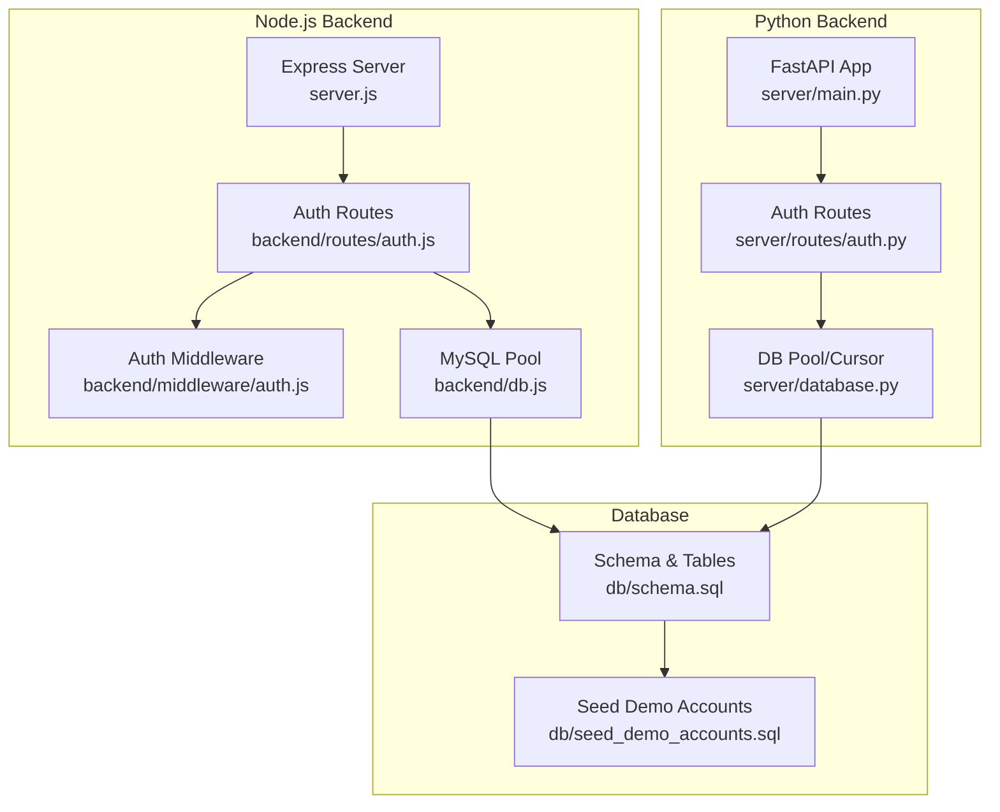
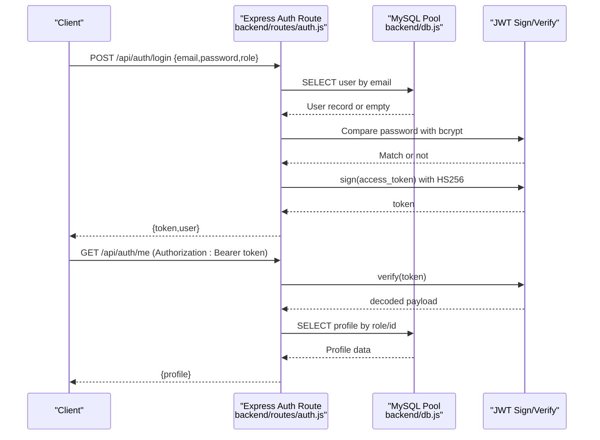
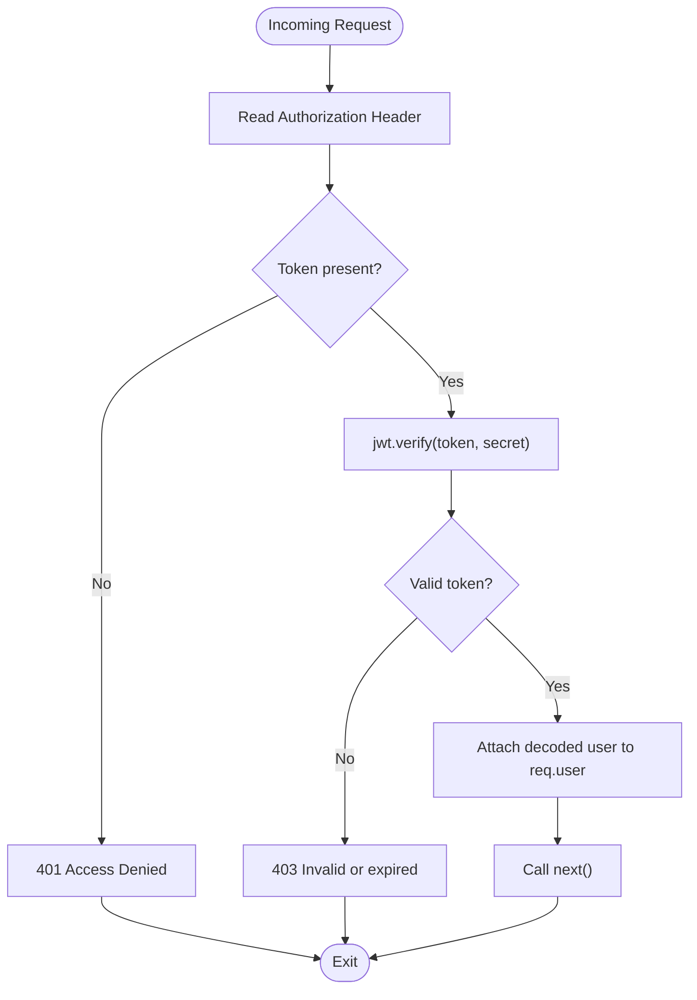
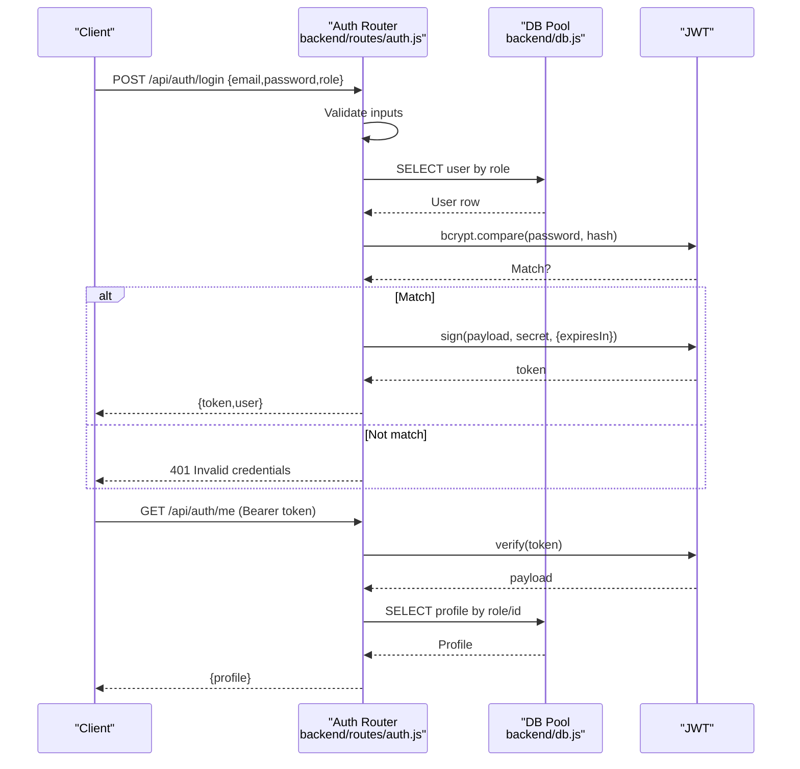
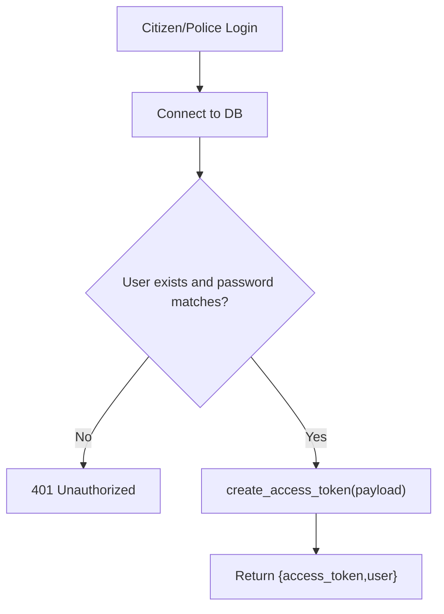
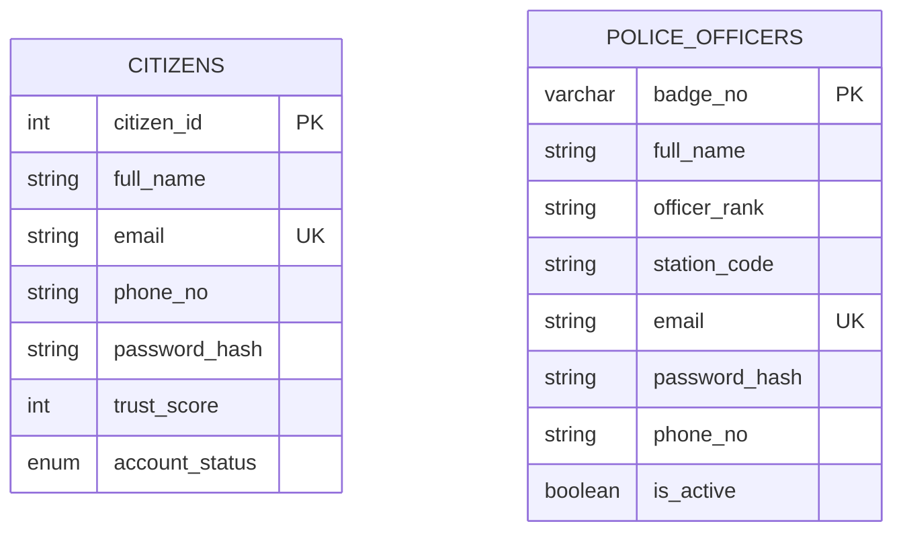
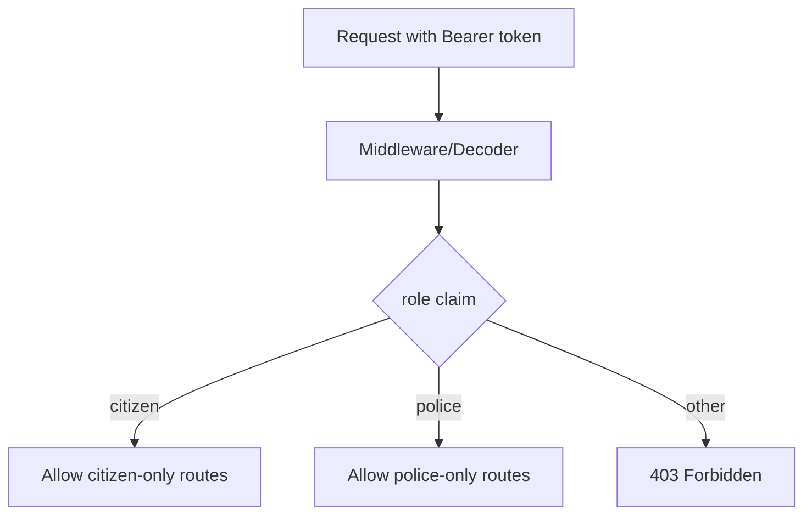
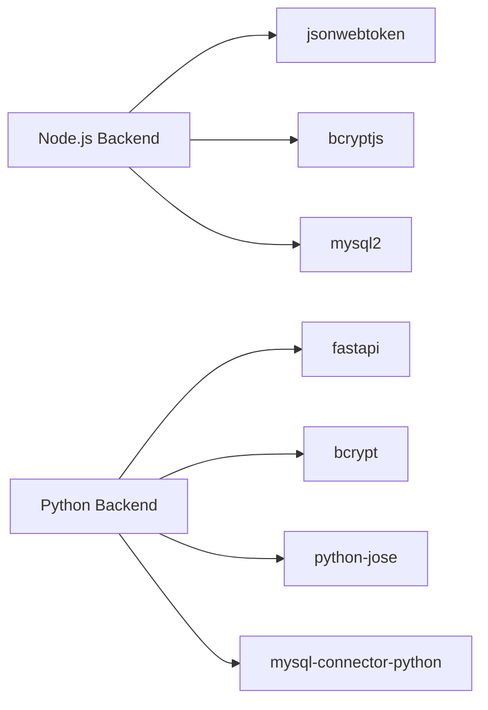

# Authentication System

<cite>
**Referenced Files in This Document**
- [auth.js](file://backend/middleware/auth.js)
- [auth.js](file://backend/routes/auth.js)
- [db.js](file://backend/db.js)
- [server.js](file://backend/server.js)
- [auth.py](file://server/routes/auth.py)
- [auth.py](file://server/middleware/auth.py)
- [database.py](file://server/database.py)
- [main.py](file://server/main.py)
- [schema.sql](file://db/schema.sql)
- [seed_demo_accounts.sql](file://db/seed_demo_accounts.sql)
- [package.json](file://backend/package.json)
- [requirements.txt](file://server/requirements.txt)
</cite>

## Table of Contents
1. [Introduction](#introduction)
2. [Project Structure](#project-structure)
3. [Core Components](#core-components)
4. [Architecture Overview](#architecture-overview)
5. [Detailed Component Analysis](#detailed-component-analysis)
6. [Dependency Analysis](#dependency-analysis)
7. [Performance Considerations](#performance-considerations)
8. [Troubleshooting Guide](#troubleshooting-guide)
9. [Conclusion](#conclusion)

## Introduction
This document describes the authentication system for the Traffic Violation Management System. It covers JWT-based authentication, password hashing with bcrypt, role-based access control (RBAC), middleware for protecting routes, token validation, and user session management. It also documents login/logout endpoints, user profile retrieval, and integration with the database layer. Security best practices, token expiration handling, and refresh token implementation are addressed.

## Project Structure
The authentication system spans two backend implementations:
- Node.js/Express backend under backend/
- Python/FastAPI backend under server/

Both share a common database schema and seed data.

**Diagram sources**
- [server.js:10-26](file://backend/server.js#L10-L26)
- [auth.js:1-117](file://backend/routes/auth.js#L1-L117)
- [auth.js:1-37](file://backend/middleware/auth.js#L1-L37)
- [db.js:1-26](file://backend/db.js#L1-L26)
- [main.py:77-86](file://server/main.py#L77-L86)
- [auth.py:1-744](file://server/routes/auth.py#L1-L744)
- [database.py:14-76](file://server/database.py#L14-L76)
- [schema.sql:26-82](file://db/schema.sql#L26-L82)
- [seed_demo_accounts.sql:17-107](file://db/seed_demo_accounts.sql#L17-L107)

**Section sources**
- [server.js:10-26](file://backend/server.js#L10-L26)
- [main.py:77-86](file://server/main.py#L77-L86)

## Core Components
- JWT-based authentication with HS256 signing
- bcrypt password hashing and verification
- Role-based access control (citizen vs police)
- Express middleware for token extraction and RBAC checks
- FastAPI route handlers for login/profile with database integration
- MySQL connection pooling and database schema for user storage

Key implementation references:
- JWT secret and middleware: [auth.js:3-20](file://backend/middleware/auth.js#L3-L20)
- Express login and profile endpoints: [auth.js:9-114](file://backend/routes/auth.js#L9-L114)
- Database pool configuration: [db.js:3-13](file://backend/db.js#L3-L13)
- FastAPI auth routes and helpers: [auth.py:29-112](file://server/routes/auth.py#L29-L112)
- Database schema for users: [schema.sql:26-82](file://db/schema.sql#L26-L82)
- Demo seed data: [seed_demo_accounts.sql:17-107](file://db/seed_demo_accounts.sql#L17-L107)

**Section sources**
- [auth.js:3-36](file://backend/middleware/auth.js#L3-L36)
- [auth.js:9-114](file://backend/routes/auth.js#L9-L114)
- [db.js:3-13](file://backend/db.js#L3-L13)
- [auth.py:29-112](file://server/routes/auth.py#L29-L112)
- [schema.sql:26-82](file://db/schema.sql#L26-L82)
- [seed_demo_accounts.sql:17-107](file://db/seed_demo_accounts.sql#L17-L107)

## Architecture Overview
The authentication flow consists of:
- Client sends credentials to login endpoint
- Server validates credentials against database using bcrypt
- On success, server issues a signed JWT with user claims
- Subsequent requests include the JWT in the Authorization header
- Middleware verifies the token and attaches user info to the request
- RBAC middleware enforces role-specific access

**Diagram sources**
- [auth.js:9-76](file://backend/routes/auth.js#L9-L76)
- [auth.js:5-20](file://backend/middleware/auth.js#L5-L20)
- [db.js:3-13](file://backend/db.js#L3-L13)

## Detailed Component Analysis

### Express Authentication Middleware
- Extracts token from Authorization header
- Verifies JWT signature and decodes payload
- Attaches user object to request for downstream routes
- Role guards enforce citizen or police access

**Diagram sources**
- [auth.js:5-20](file://backend/middleware/auth.js#L5-L20)

**Section sources**
- [auth.js:5-36](file://backend/middleware/auth.js#L5-L36)

### Express Auth Routes (Login and Profile)
- Login endpoint accepts email, password, and role
- Validates role and queries appropriate table (CITIZENS or POLICE)
- Compares password using bcrypt
- Issues JWT with HS256 and 8-hour expiry
- Profile endpoint validates token and returns user profile

**Diagram sources**
- [auth.js:9-76](file://backend/routes/auth.js#L9-L76)
- [db.js:3-13](file://backend/db.js#L3-L13)

**Section sources**
- [auth.js:9-114](file://backend/routes/auth.js#L9-L114)

### FastAPI Authentication Implementation
- Self-contained auth routes with no external middleware
- bcrypt hashing and verification helpers
- JWT creation with HS256 and 24-hour expiry
- Login endpoints for citizens and police
- Profile retrieval and updates via bearer token

**Diagram sources**
- [auth.py:218-293](file://server/routes/auth.py#L218-L293)
- [auth.py:399-476](file://server/routes/auth.py#L399-L476)

**Section sources**
- [auth.py:29-112](file://server/routes/auth.py#L29-L112)
- [auth.py:218-293](file://server/routes/auth.py#L218-L293)
- [auth.py:399-476](file://server/routes/auth.py#L399-L476)
- [auth.py:493-600](file://server/routes/auth.py#L493-L600)

### Database Integration and User Storage
- CITIZENS table stores full_name, email, phone_no, password_hash, trust_score, account_status
- POLICE_OFFICERS table stores badge_no, full_name, officer_rank, station_code, email, password_hash, phone_no, is_active
- Demo seed data initializes accounts with bcrypt hashes

**Diagram sources**
- [schema.sql:26-82](file://db/schema.sql#L26-L82)

**Section sources**
- [schema.sql:26-82](file://db/schema.sql#L26-L82)
- [seed_demo_accounts.sql:17-107](file://db/seed_demo_accounts.sql#L17-L107)

### Protected Route Implementation and RBAC
- Express: authenticateToken middleware verifies token; requireCitizen/requirePolice enforce roles
- FastAPI: profile retrieval validates Authorization header and decodes JWT; role-specific queries fetch profile

**Diagram sources**
- [auth.js:22-34](file://backend/middleware/auth.js#L22-L34)
- [auth.py:493-576](file://server/routes/auth.py#L493-L576)

**Section sources**
- [auth.js:22-34](file://backend/middleware/auth.js#L22-L34)
- [auth.py:493-576](file://server/routes/auth.py#L493-L576)

### Token Expiration and Refresh Strategy
- Current implementation sets token expiry in login:
  - Node.js: 8 hours
  - FastAPI: 24 hours
- No explicit logout or refresh token endpoints are present in the analyzed files
- Recommendations:
  - Implement logout via token blacklisting or short-lived access tokens with refresh tokens
  - Use sliding expiration or rotation for enhanced security

**Section sources**
- [auth.js:49-58](file://backend/routes/auth.js#L49-L58)
- [auth.py:100-112](file://server/routes/auth.py#L100-L112)

### Password Reset and Account Verification
- No password reset or email verification endpoints are present in the analyzed files
- Consider adding:
  - Secure password reset with time-limited tokens
  - Email verification for new registrations

[No sources needed since this section provides general guidance]

## Dependency Analysis
- Node.js backend depends on:
  - jsonwebtoken for JWT operations
  - bcryptjs for password hashing/verification
  - mysql2 for database connectivity
- Python backend depends on:
  - bcrypt for hashing/verification
  - fastapi for routing and HTTP exceptions
  - python-jose for JWT operations
  - mysql-connector-python for database connectivity

**Diagram sources**
- [package.json:10-16](file://backend/package.json#L10-L16)
- [requirements.txt:1-12](file://server/requirements.txt#L1-L12)

**Section sources**
- [package.json:10-16](file://backend/package.json#L10-L16)
- [requirements.txt:1-12](file://server/requirements.txt#L1-L12)

## Performance Considerations
- Use bcrypt cost appropriately to balance security and latency
- Prefer connection pooling for database operations
- Cache frequently accessed user metadata if acceptable for the system’s consistency requirements
- Keep JWT payloads minimal to reduce header size

[No sources needed since this section provides general guidance]

## Troubleshooting Guide
Common issues and resolutions:
- 401 Access Denied (No token): Ensure Authorization header is sent with Bearer token
- 403 Invalid or expired token: Validate token freshness and correct secret
- 401 Invalid credentials: Confirm role and email correctness; verify bcrypt hash alignment
- 404 User not found: Validate user ID and role mapping in database
- Database connection failures: Check pool configuration and credentials

Operational references:
- Express middleware error responses: [auth.js:9-19](file://backend/middleware/auth.js#L9-L19)
- Express login error handling: [auth.js:72-75](file://backend/routes/auth.js#L72-L75)
- FastAPI exception handling: [auth.py:295-302](file://server/routes/auth.py#L295-L302), [auth.py:478-485](file://server/routes/auth.py#L478-L485), [auth.py:578-594](file://server/routes/auth.py#L578-L594)

**Section sources**
- [auth.js:9-19](file://backend/middleware/auth.js#L9-L19)
- [auth.js:72-75](file://backend/routes/auth.js#L72-L75)
- [auth.py:295-302](file://server/routes/auth.py#L295-L302)
- [auth.py:478-485](file://server/routes/auth.py#L478-L485)
- [auth.py:578-594](file://server/routes/auth.py#L578-L594)

## Conclusion
The authentication system provides robust JWT-based authentication with bcrypt password hashing and role-based access control. Both Node.js and Python backends implement login and profile retrieval flows, backed by a shared database schema. Enhancements such as logout, refresh tokens, password reset, and email verification would further strengthen the system’s security posture.