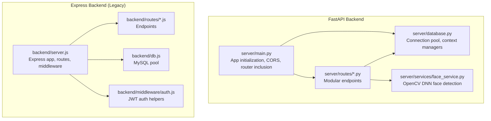
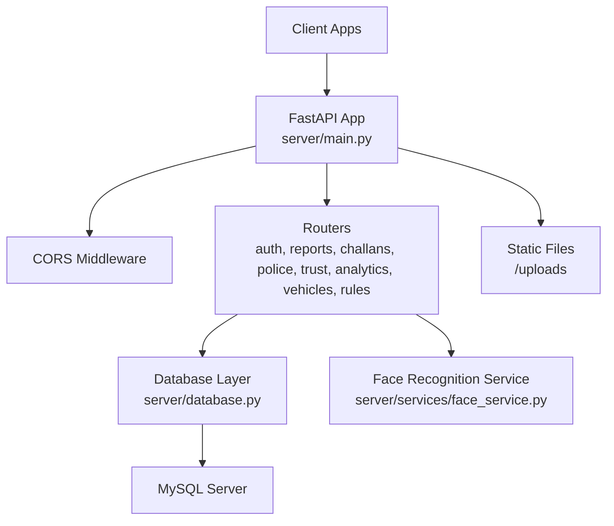
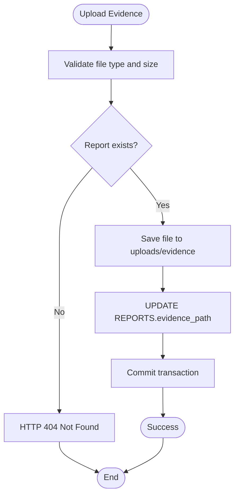
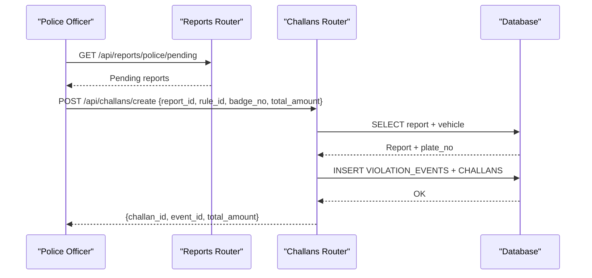
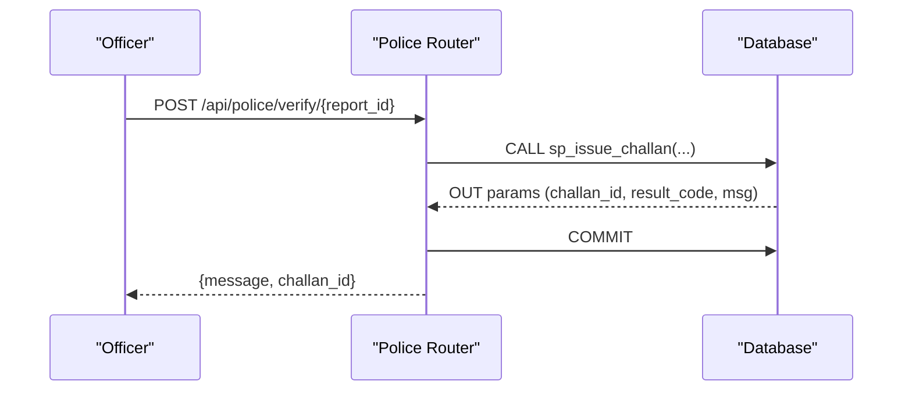
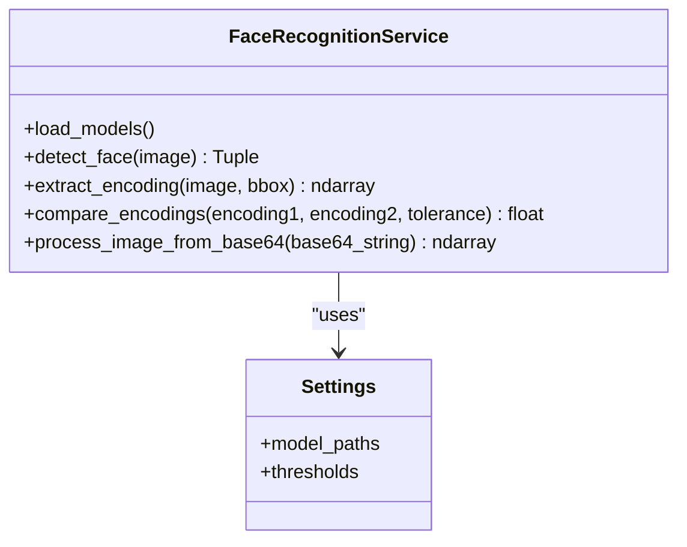
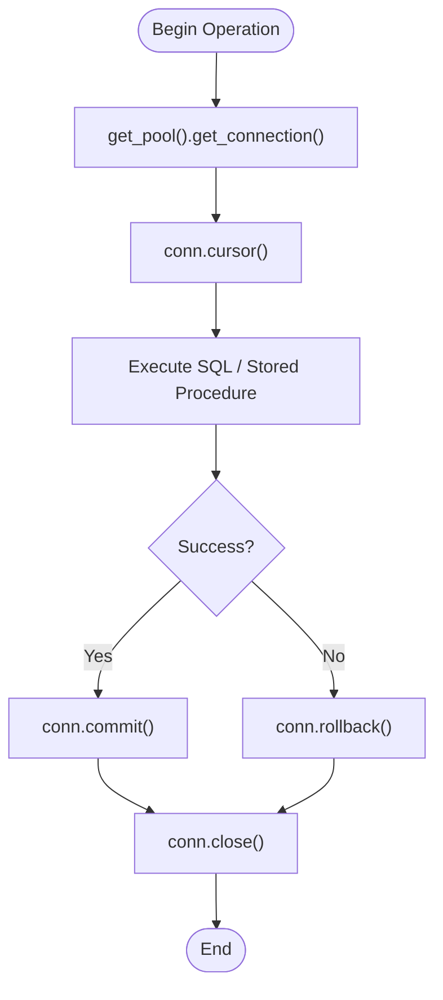
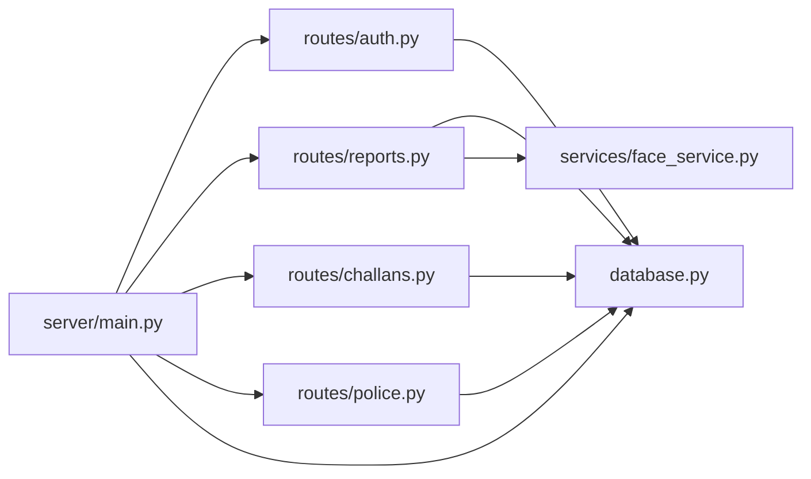

# Backend Services

<cite>
**Referenced Files in This Document**
- [main.py](file://server/main.py)
- [database.py](file://server/database.py)
- [face_service.py](file://server/services/face_service.py)
- [auth.py](file://server/routes/auth.py)
- [reports.py](file://server/routes/reports.py)
- [challans.py](file://server/routes/challans.py)
- [police.py](file://server/routes/police.py)
- [analytics.py](file://server/routes/analytics.py)
- [vehicles.py](file://server/routes/vehicles.py)
- [rules.py](file://server/routes/rules.py)
- [trust.py](file://server/routes/trust.py)
- [server.js](file://backend/server.js)
- [db.js](file://backend/db.js)
- [auth.js](file://backend/middleware/auth.js)
- [auth.js](file://backend/routes/auth.js)
- [reports.js](file://backend/routes/reports.js)
- [police.js](file://backend/routes/police.js)
- [challans.js](file://backend/routes/challans.js)
</cite>

## Table of Contents
1. [Introduction](#introduction)
2. [Project Structure](#project-structure)
3. [Core Components](#core-components)
4. [Architecture Overview](#architecture-overview)
5. [Detailed Component Analysis](#detailed-component-analysis)
6. [Dependency Analysis](#dependency-analysis)
7. [Performance Considerations](#performance-considerations)
8. [Troubleshooting Guide](#troubleshooting-guide)
9. [Conclusion](#conclusion)
10. [Appendices](#appendices)

## Introduction
This document describes the FastAPI backend services for the Traffic Violation Management System. It covers the modular route structure for authentication, reports, challans, police operations, and analytics; middleware for JWT authentication, CORS configuration, and request validation; service layer architecture including the face recognition service with OpenCV DNN integration; database abstraction with connection pooling and transactions; end-to-end face recognition workflow; error handling, logging, and performance monitoring; security measures including bcrypt-based password hashing, JWT token management, and input validation; examples of API endpoints, dependency injection patterns, and asynchronous processing; and integrations with external services and third-party libraries.

## Project Structure
The backend is organized into:
- FastAPI application entrypoint and middleware configuration
- Modular route groups for authentication, reports, challans, vehicles, rules, analytics, and optional police/trust modules
- Database abstraction layer with connection pooling and context-managed cursors
- Face recognition service using OpenCV DNN
- Legacy Express-based backend for comparison and historical context

**Diagram sources**
- [main.py:50-107](file://server/main.py#L50-L107)
- [database.py:14-76](file://server/database.py#L14-L76)
- [face_service.py:15-177](file://server/services/face_service.py#L15-L177)
- [server.js:1-42](file://backend/server.js#L1-L42)
- [db.js:1-26](file://backend/db.js#L1-L26)
- [auth.js:1-37](file://backend/middleware/auth.js#L1-L37)

**Section sources**
- [main.py:50-107](file://server/main.py#L50-L107)
- [server.js:1-42](file://backend/server.js#L1-L42)

## Core Components
- FastAPI application lifecycle and CORS configuration
- Modular route registration under /api/* prefixes
- Database abstraction with lazy-initialized connection pool and context-managed cursors
- Face recognition service with OpenCV DNN model loading and encoding extraction
- Authentication routes with bcrypt password hashing and JWT token issuance
- Reports, challans, and police operation endpoints with transactional safety and stored procedure integration
- Static file serving for evidence uploads

**Section sources**
- [main.py:50-107](file://server/main.py#L50-L107)
- [database.py:14-76](file://server/database.py#L14-L76)
- [face_service.py:15-177](file://server/services/face_service.py#L15-L177)
- [auth.py:114-744](file://server/routes/auth.py#L114-L744)
- [reports.py:147-563](file://server/routes/reports.py#L147-L563)
- [challans.py:47-450](file://server/routes/challans.py#L47-L450)
- [police.py:25-220](file://server/routes/police.py#L25-L220)

## Architecture Overview
The FastAPI backend follows a layered architecture:
- Application layer: FastAPI app with middleware and router inclusion
- Service layer: Business logic implemented as route handlers
- Persistence layer: MySQL via a connection pool with explicit transactions
- External integrations: OpenCV DNN for face recognition

**Diagram sources**
- [main.py:50-107](file://server/main.py#L50-L107)
- [database.py:14-76](file://server/database.py#L14-L76)
- [face_service.py:15-177](file://server/services/face_service.py#L15-L177)

## Detailed Component Analysis

### Authentication Module
- Endpoints:
  - Citizen registration with password hashing and vehicle linkage
  - Police registration with auto-generated badge number
  - Login endpoints for both roles with bcrypt verification and JWT issuance
  - Profile retrieval and updates with role-specific queries
- Security:
  - Password hashing with bcrypt in threadpool to avoid blocking
  - JWT with HS256 algorithm and expiry configuration
  - Role-based access checks and protected profile updates
- Validation:
  - Pydantic models for request bodies
  - Input sanitization and error handling with HTTP exceptions

```mermaid
sequenceDiagram
participant C as "Client"
participant A as "Auth Router"
participant DB as "Database"
participant BC as "bcrypt"
participant JWT as "JWT"
C->>A : POST /api/auth/citizen/register
A->>BC : hash_password(password)
BC-->>A : password_hash
A->>DB : INSERT CITIZENS + VEHICLES
DB-->>A : OK
A-->>C : {message, citizen_id, role}
C->>A : POST /api/auth/citizen/login
A->>DB : SELECT citizen
DB-->>A : user row
A->>BC : verify_password(input, hash)
BC-->>A : match?
A->>JWT : encode(payload)
JWT-->>A : token
A-->>C : {access_token, user}
```

**Diagram sources**
- [auth.py:114-308](file://server/routes/auth.py#L114-L308)
- [auth.py:493-600](file://server/routes/auth.py#L493-L600)

**Section sources**
- [auth.py:114-744](file://server/routes/auth.py#L114-L744)

### Reports Module
- Evidence upload with file type and size validation
- Report creation with automatic vehicle creation if needed
- Report updates and deletions constrained to Pending status
- Police dashboard and status updates with simple SQL for safety
- Data serialization with datetime conversion for JSON

**Diagram sources**
- [reports.py:50-121](file://server/routes/reports.py#L50-L121)

**Section sources**
- [reports.py:147-563](file://server/routes/reports.py#L147-L563)

### Challans Module
- Challan creation linking to reports and vehicles, with fallback to reporter if violator unknown
- Challan retrieval for citizens with joined details
- Payment processing with status updates and transaction reference generation
- Deletion endpoints with appropriate authorization checks

**Diagram sources**
- [challans.py:47-139](file://server/routes/challans.py#L47-L139)
- [reports.py:411-460](file://server/routes/reports.py#L411-L460)

**Section sources**
- [challans.py:47-450](file://server/routes/challans.py#L47-L450)

### Police Operations Module
- Pending reports dashboard via a database view
- Verification and rejection using stored procedures with OUT parameters
- Violation rules retrieval and officer performance metrics via views
- Role-based authorization enforced via dependency

**Diagram sources**
- [police.py:48-103](file://server/routes/police.py#L48-L103)

**Section sources**
- [police.py:25-220](file://server/routes/police.py#L25-L220)

### Analytics Module
- Analytics endpoints grouped under /api/analytics with modular router inclusion
- Supports dashboards, KPIs, and reporting views integrated via database views

**Section sources**
- [main.py:15-87](file://server/main.py#L15-L87)
- [analytics.py](file://server/routes/analytics.py)

### Vehicles and Rules Modules
- Vehicles module for managing vehicle records and associations
- Rules module for retrieving active violation rules used in challan creation

**Section sources**
- [vehicles.py](file://server/routes/vehicles.py)
- [rules.py](file://server/routes/rules.py)

### Trust & History Module
- Trust and history endpoints grouped under /api/trust
- Integrates with database triggers for trust score adjustments

**Section sources**
- [main.py:16-26](file://server/main.py#L16-L26)
- [trust.py](file://server/routes/trust.py)

### Face Recognition Service
- OpenCV DNN-based face detection using a Caffe model
- Encoding extraction with preprocessing and normalization
- Biometric comparison using Euclidean distance
- Base64 image decoding for processing

**Diagram sources**
- [face_service.py:15-177](file://server/services/face_service.py#L15-L177)

**Section sources**
- [face_service.py:15-177](file://server/services/face_service.py#L15-L177)

### Database Abstraction and Transactions
- Lazy-initialized connection pool with fixed size and reset session
- Context-managed connections and cursors for safe resource handling
- Explicit transaction control in critical endpoints (e.g., payment, verification)
- Stored procedure calls with OUT parameters for business operations

**Diagram sources**
- [database.py:52-76](file://server/database.py#L52-L76)
- [police.py:61-81](file://server/routes/police.py#L61-L81)
- [challans.py:346-373](file://server/routes/challans.py#L346-L373)

**Section sources**
- [database.py:14-76](file://server/database.py#L14-L76)
- [police.py:48-103](file://server/routes/police.py#L48-L103)
- [challans.py:336-397](file://server/routes/challans.py#L336-L397)

### Middleware and Security
- CORS configured to allow all origins for development
- JWT authentication middleware validating tokens and enforcing role-based access
- Password hashing with bcrypt and secure token generation
- Input validation via Pydantic models and explicit checks

**Section sources**
- [main.py:60-66](file://server/main.py#L60-L66)
- [auth.js:1-37](file://backend/middleware/auth.js#L1-L37)
- [auth.py:77-112](file://server/routes/auth.py#L77-L112)

### Legacy Express Backend (Reference)
- Basic Express server with CORS and JSON middleware
- Route modules for auth, reports, police, and challans
- MySQL pool and global error handling

**Section sources**
- [server.js:1-42](file://backend/server.js#L1-L42)
- [db.js:1-26](file://backend/db.js#L1-L26)
- [auth.js:1-117](file://backend/routes/auth.js#L1-L117)
- [reports.js:1-54](file://backend/routes/reports.js#L1-L54)
- [police.js:1-109](file://backend/routes/police.js#L1-L109)
- [challans.js:1-101](file://backend/routes/challans.js#L1-L101)

## Dependency Analysis
- FastAPI app depends on modular routers and database layer
- Routers depend on database abstractions and optionally on face recognition service
- Police operations depend on stored procedures and database views
- Express backend demonstrates a simpler, synchronous pattern for comparison

**Diagram sources**
- [main.py:12-87](file://server/main.py#L12-L87)
- [database.py:14-76](file://server/database.py#L14-L76)
- [face_service.py:15-177](file://server/services/face_service.py#L15-L177)

**Section sources**
- [main.py:12-87](file://server/main.py#L12-L87)

## Performance Considerations
- Connection pooling reduces connection overhead and improves throughput
- Context-managed cursors ensure proper resource cleanup
- Asynchronous processing for CPU-intensive tasks (e.g., bcrypt) using threadpool
- Row-level locking in payment endpoint prevents race conditions
- Stored procedures encapsulate complex logic and reduce network round-trips
- Logging at INFO level provides operational visibility without excessive overhead

## Troubleshooting Guide
- Authentication failures:
  - Verify JWT secret alignment across services
  - Check bcrypt hashing and token expiration
- Database connectivity:
  - Confirm pool initialization and timeouts
  - Validate stored procedure availability and OUT parameters
- Face recognition:
  - Ensure OpenCV DNN models are downloaded and accessible
  - Validate base64 image decoding and image preprocessing steps
- CORS issues:
  - Confirm middleware configuration allows required origins and headers

**Section sources**
- [auth.py:77-112](file://server/routes/auth.py#L77-L112)
- [database.py:20-43](file://server/database.py#L20-L43)
- [face_service.py:24-46](file://server/services/face_service.py#L24-L46)
- [main.py:60-66](file://server/main.py#L60-L66)

## Conclusion
The FastAPI backend provides a robust, modular foundation for the Traffic Violation Management System. It integrates authentication, reports, challans, and police operations with strong security practices, transactional integrity, and extensible service layers. The face recognition service demonstrates advanced biometric capabilities, while the database abstraction ensures scalability and reliability. The legacy Express backend offers a baseline reference for understanding the evolution of the system.

## Appendices

### API Endpoint Examples
- Authentication
  - POST /api/auth/citizen/register
  - POST /api/auth/citizen/login
  - POST /api/auth/police/register
  - POST /api/auth/police/login
  - GET /api/auth/profile
  - PUT /api/auth/profile
- Reports
  - POST /api/reports/upload-evidence/{report_id}
  - POST /api/reports/create
  - GET /api/reports/my-reports/{citizen_id}
  - PUT /api/reports/update/{report_id}
  - DELETE /api/reports/delete/{report_id}
  - GET /api/reports/police/pending
  - PUT /api/reports/police/process/{report_id}
- Challans
  - POST /api/challans/create
  - GET /api/challans/citizen/{citizen_id}
  - GET /api/challans/my
  - GET /api/challans/report/{report_id}
  - PUT /api/challans/pay/{challan_id}
  - DELETE /api/challans/{challan_id}
- Police
  - GET /api/police/pending
  - POST /api/police/verify/{report_id}
  - POST /api/police/reject/{report_id}
  - GET /api/police/rules
  - GET /api/police/performance

**Section sources**
- [auth.py:114-744](file://server/routes/auth.py#L114-L744)
- [reports.py:147-563](file://server/routes/reports.py#L147-L563)
- [challans.py:47-450](file://server/routes/challans.py#L47-L450)
- [police.py:25-220](file://server/routes/police.py#L25-L220)

### Dependency Injection Patterns
- Database cursors provided via context manager for safe acquisition/release
- Current user resolved via dependency (JWT payload) for role enforcement
- Face recognition service instantiated as a singleton for shared state

**Section sources**
- [database.py:68-76](file://server/database.py#L68-L76)
- [police.py:10-11](file://server/routes/police.py#L10-L11)
- [face_service.py:175-177](file://server/services/face_service.py#L175-L177)

### Asynchronous Processing
- Password hashing and verification executed in threadpool to avoid blocking the event loop
- File uploads validated asynchronously with streaming reads

**Section sources**
- [auth.py:77-98](file://server/routes/auth.py#L77-L98)
- [reports.py:50-121](file://server/routes/reports.py#L50-L121)

### Integration with External Services
- OpenCV DNN for face detection and encoding extraction
- MySQL via PyMySQL and mysql-connector for database connectivity
- Static file serving for evidence images

**Section sources**
- [face_service.py:15-177](file://server/services/face_service.py#L15-L177)
- [database.py:14-76](file://server/database.py#L14-L76)
- [main.py:69-72](file://server/main.py#L69-L72)