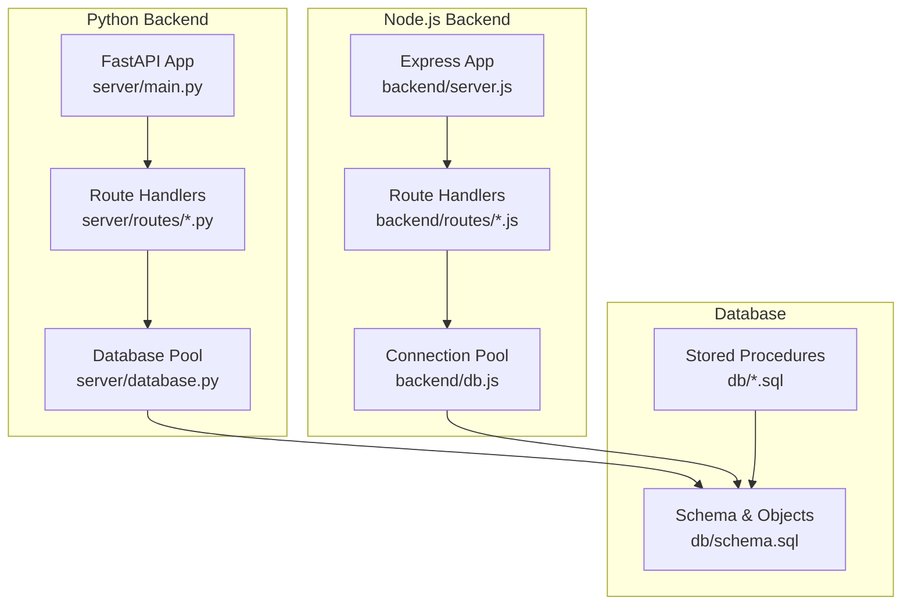
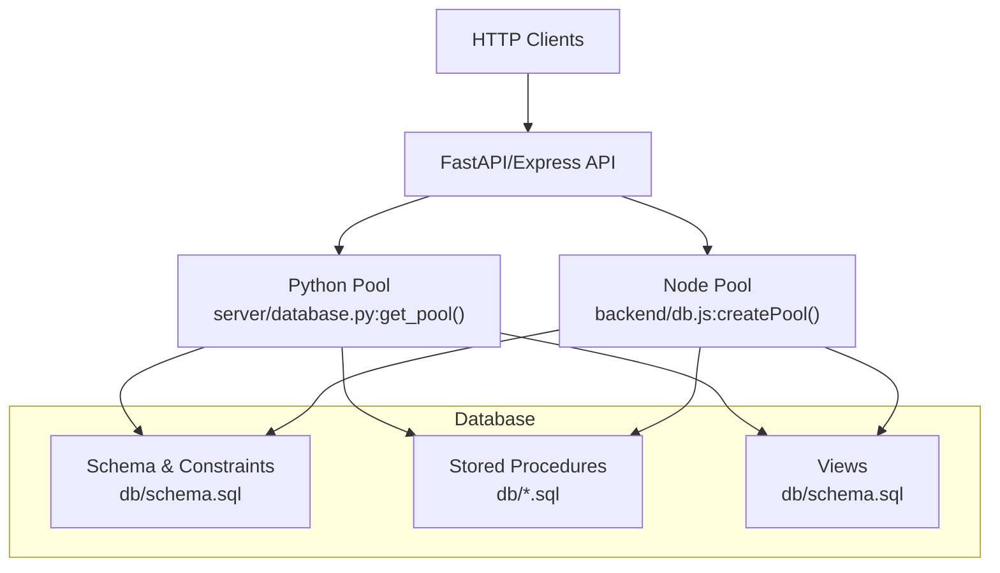
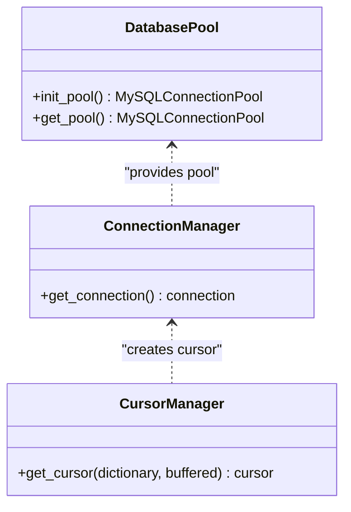
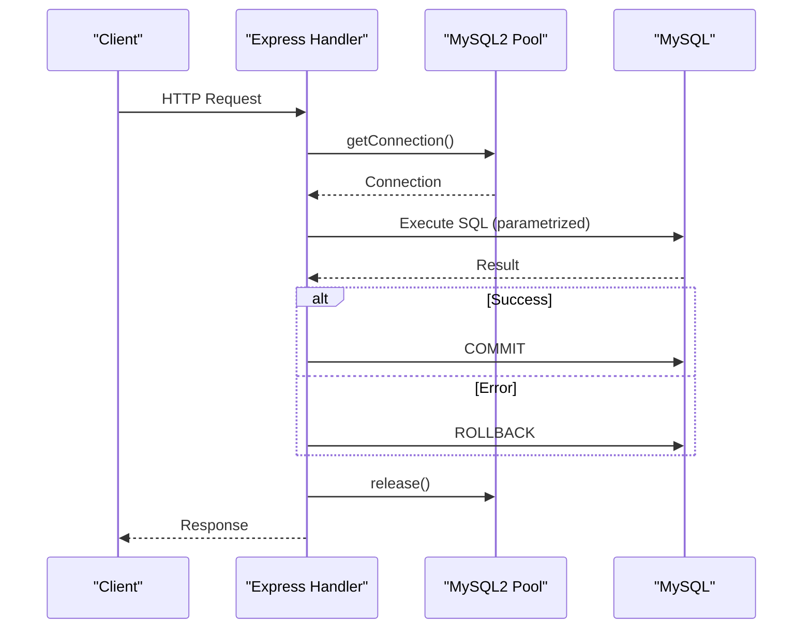
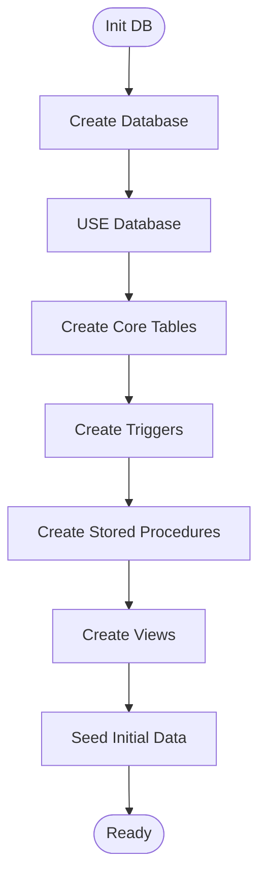
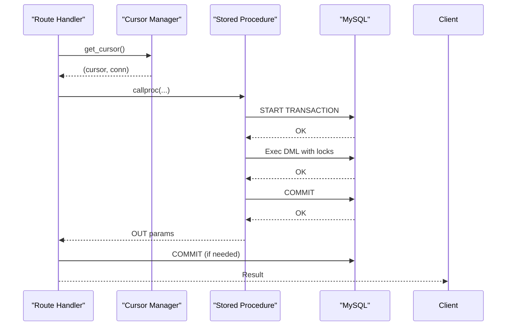
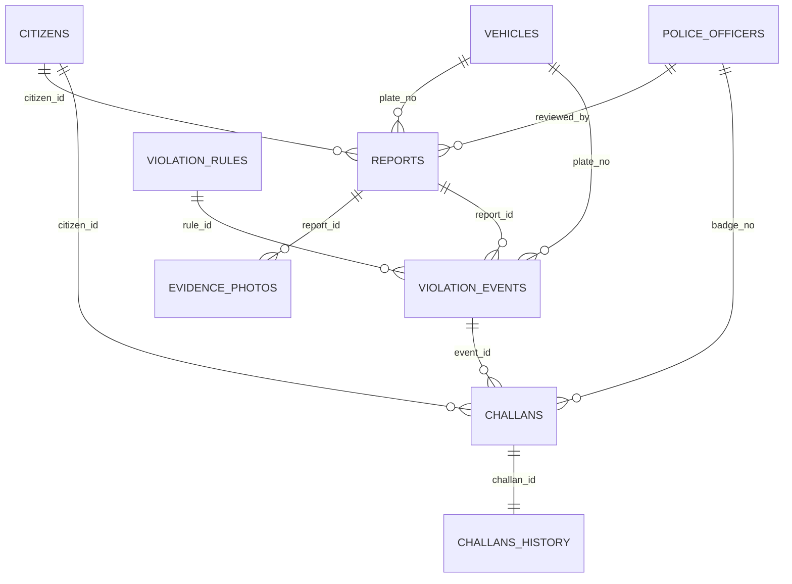
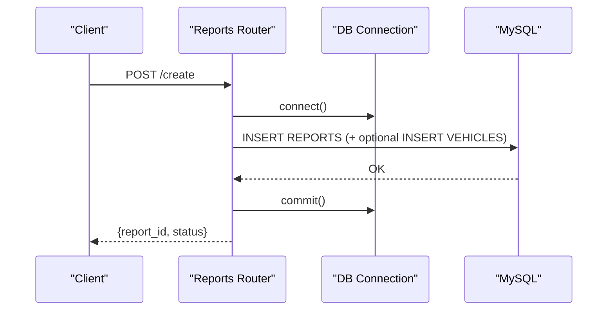
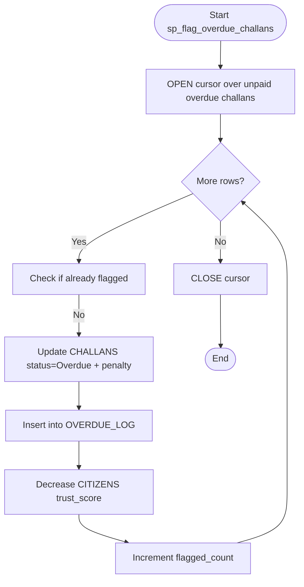
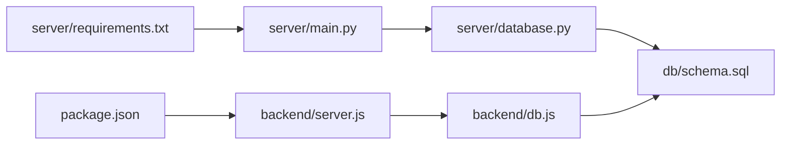

# Database Layer

<cite>
**Referenced Files in This Document**
- [backend/db.js](file://backend/db.js)
- [server/database.py](file://server/database.py)
- [server/main.py](file://server/main.py)
- [server/routes/challans.py](file://server/routes/challans.py)
- [server/routes/reports.py](file://server/routes/reports.py)
- [server/routes/police.py](file://server/routes/police.py)
- [server/init_db.py](file://server/init_db.py)
- [db/schema.sql](file://db/schema.sql)
- [db/stored_procedure_process_report.sql](file://db/stored_procedure_process_report.sql)
- [db/rewards_system.sql](file://db/rewards_system.sql)
- [scripts/setup_db.bat](file://scripts/setup_db.bat)
- [backend/server.js](file://backend/server.js)
- [server/requirements.txt](file://server/requirements.txt)
</cite>

## Table of Contents
1. [Introduction](#introduction)
2. [Project Structure](#project-structure)
3. [Core Components](#core-components)
4. [Architecture Overview](#architecture-overview)
5. [Detailed Component Analysis](#detailed-component-analysis)
6. [Dependency Analysis](#dependency-analysis)
7. [Performance Considerations](#performance-considerations)
8. [Troubleshooting Guide](#troubleshooting-guide)
9. [Conclusion](#conclusion)
10. [Appendices](#appendices)

## Introduction
This document describes the database abstraction layer and connection management for the Traffic Violation Management System. It covers connection pooling, transaction handling, query execution patterns, initialization and schema validation, connection lifecycle management, ORM/DAO patterns, model definitions, relationship mapping, CRUD and complex operations, error handling and recovery, performance optimization, migration and backup strategies, and monitoring capabilities.

## Project Structure
The system comprises:
- A Python FastAPI backend with two distinct database access layers:
  - A pure-Python MySQL connector pool with context-managed connections and cursors.
  - A Node.js Express backend using a MySQL2 promise pool for connection management.
- SQL schema and stored procedures defining the production schema, triggers, views, and procedures.
- Scripts to initialize the database and set up the environment.

**Diagram sources**
- [server/main.py:1-107](file://server/main.py#L1-L107)
- [server/database.py:1-76](file://server/database.py#L1-L76)
- [server/routes/challans.py:1-450](file://server/routes/challans.py#L1-L450)
- [server/routes/reports.py:1-563](file://server/routes/reports.py#L1-L563)
- [server/routes/police.py:1-220](file://server/routes/police.py#L1-L220)
- [backend/server.js:1-42](file://backend/server.js#L1-L42)
- [backend/db.js:1-26](file://backend/db.js#L1-L26)
- [db/schema.sql:1-942](file://db/schema.sql#L1-L942)
- [db/stored_procedure_process_report.sql:1-115](file://db/stored_procedure_process_report.sql#L1-L115)

**Section sources**
- [server/main.py:1-107](file://server/main.py#L1-L107)
- [backend/server.js:1-42](file://backend/server.js#L1-L42)

## Core Components
- Python MySQL Connector Pool and Context Managers:
  - Initializes a named connection pool with fixed size and reset behavior.
  - Provides context-managed connection and cursor helpers to ensure proper resource cleanup and automatic rollback on errors.
- Node.js MySQL2 Promise Pool:
  - Creates a connection pool with configurable limits and keep-alive behavior.
  - Tests connectivity at startup and logs success/failure.
- Route Handlers:
  - Python routes use the connector pool via context managers for transactional operations and stored procedure calls.
  - Node.js routes use the MySQL2 pool for direct SQL execution and basic CRUD operations.
- Schema and Stored Procedures:
  - Production schema defines normalized entities, foreign keys, indexes, and temporal history tables.
  - Stored procedures encapsulate ACID transactions for challan issuance, payment, rejection, and overdue processing.
- Initialization Scripts:
  - Batch script to run the schema and seed data.
  - Python script to bootstrap database and tables if needed.

**Section sources**
- [server/database.py:14-76](file://server/database.py#L14-L76)
- [backend/db.js:3-26](file://backend/db.js#L3-L26)
- [server/routes/police.py:25-156](file://server/routes/police.py#L25-L156)
- [server/routes/challans.py:47-139](file://server/routes/challans.py#L47-L139)
- [server/routes/reports.py:147-223](file://server/routes/reports.py#L147-L223)
- [db/schema.sql:1-942](file://db/schema.sql#L1-L942)
- [db/stored_procedure_process_report.sql:8-98](file://db/stored_procedure_process_report.sql#L8-L98)
- [scripts/setup_db.bat:1-64](file://scripts/setup_db.bat#L1-L64)

## Architecture Overview
The database layer supports two backend implementations:
- Python backend with a dedicated MySQL connector pool and context-managed resources.
- Node.js backend with a MySQL2 promise pool and per-request connections.

Both backends execute SQL against the shared schema, leveraging stored procedures for complex, atomic operations and views for reporting.

**Diagram sources**
- [server/database.py:45-76](file://server/database.py#L45-L76)
- [backend/db.js:3-26](file://backend/db.js#L3-L26)
- [db/schema.sql:1-942](file://db/schema.sql#L1-L942)
- [db/stored_procedure_process_report.sql:8-98](file://db/stored_procedure_process_report.sql#L8-L98)

## Detailed Component Analysis

### Python Database Abstraction Layer
- Pool Initialization:
  - Creates a named pool with fixed size and session reset behavior.
  - Logs creation and raises on failure.
- Connection and Cursor Context Managers:
  - get_connection: retrieves a connection from the pool, ensures rollback on error, and closes the connection in finally.
  - get_cursor: yields a dictionary cursor bound to a connection, ensuring cleanup.
- Usage in Routes:
  - Stored procedure calls use get_cursor and commit around procedure execution.
  - Direct SQL operations are executed within the same pattern.

**Diagram sources**
- [server/database.py:14-76](file://server/database.py#L14-L76)

**Section sources**
- [server/database.py:14-76](file://server/database.py#L14-L76)
- [server/routes/police.py:25-156](file://server/routes/police.py#L25-L156)

### Node.js Database Abstraction Layer
- Pool Configuration:
  - Creates a MySQL2 promise pool with connection limits and keep-alive settings.
  - Tests connectivity on startup and logs results.
- Route-Level Connections:
  - Each route establishes a connection, executes statements, commits or rolls back, and closes the connection.
  - Uses parameterized queries to prevent injection.

**Diagram sources**
- [backend/db.js:3-26](file://backend/db.js#L3-L26)
- [server/routes/challans.py:47-139](file://server/routes/challans.py#L47-L139)

**Section sources**
- [backend/db.js:3-26](file://backend/db.js#L3-L26)
- [server/routes/challans.py:47-139](file://server/routes/challans.py#L47-L139)

### Schema Validation and Initialization
- Schema Definition:
  - Defines core entities (CITIZENS, POLICE_OFFICERS, VEHICLES, VIOLATION_RULES, REPORTS, EVIDENCE_PHOTOS, VIOLATION_EVENTS, CHALLANS, CHALLANS_HISTORY, OVERDUE_LOG), indexes, foreign keys, and temporal history tables.
  - Includes triggers for trust scoring and temporal versioning, and views for dashboards.
- Stored Procedures:
  - sp_issue_challan: Atomic issuance with validation, row-level locks, and procedural error handling.
  - sp_pay_challan: Payment processing with concurrency checks and reward adjustments.
  - sp_reject_report: Rejection with validation and status updates.
  - sp_flag_overdue_challans: Batch processing of overdue challans with cursor iteration.
- Initialization:
  - Batch script runs schema.sql to create database, tables, triggers, views, and procedures.
  - Python script can create database and minimal tables if needed.

**Diagram sources**
- [db/schema.sql:10-300](file://db/schema.sql#L10-L300)
- [db/stored_procedure_process_report.sql:8-98](file://db/stored_procedure_process_report.sql#L8-L98)
- [scripts/setup_db.bat:30-35](file://scripts/setup_db.bat#L30-L35)

**Section sources**
- [db/schema.sql:1-942](file://db/schema.sql#L1-L942)
- [db/stored_procedure_process_report.sql:8-98](file://db/stored_procedure_process_report.sql#L8-L98)
- [scripts/setup_db.bat:1-64](file://scripts/setup_db.bat#L1-L64)
- [server/init_db.py:18-181](file://server/init_db.py#L18-L181)

### Transaction Handling and Concurrency Control
- Python:
  - Context managers ensure rollback on exceptions and explicit commit on success.
  - Stored procedure calls manage internal transactions and return OUT parameters for status.
- Node.js:
  - Per-route transactions with try/catch blocks, rollback on error, and commit on success.
  - Row-level locks are enforced inside stored procedures for critical operations.

**Diagram sources**
- [server/routes/police.py:60-93](file://server/routes/police.py#L60-L93)
- [db/schema.sql:440-546](file://db/schema.sql#L440-L546)

**Section sources**
- [server/routes/police.py:60-93](file://server/routes/police.py#L60-L93)
- [db/schema.sql:440-546](file://db/schema.sql#L440-L546)

### Model Definitions and Relationship Mapping
- Entities and Keys:
  - CITIZENS, POLICE_OFFICERS, VEHICLES, VIOLATION_RULES, REPORTS, EVIDENCE_PHOTOS, VIOLATION_EVENTS, CHALLANS, CHALLANS_HISTORY, OVERDUE_LOG.
  - Foreign keys enforce referential integrity across entities.
- Temporal Design:
  - History tables capture historical changes with valid_from/valid_to periods.
- Views:
  - Pending_Reports_Dashboard and others provide summarized, permission-aware datasets.

**Diagram sources**
- [db/schema.sql:26-235](file://db/schema.sql#L26-L235)

**Section sources**
- [db/schema.sql:26-235](file://db/schema.sql#L26-L235)

### CRUD Operations and Complex Queries
- Python Reports CRUD:
  - Create report with automatic vehicle creation, update/delete guarded by status checks, and retrieval with joins.
- Python Challans CRUD:
  - Create challan via stored procedure, fetch citizen challans with joins, pay challan, delete challan.
- Node.js Reports CRUD:
  - Create, update, delete, and fetch reports with evidence upload handling.
- Complex Queries:
  - Dashboard views join multiple entities for reporting.
  - Stored procedures encapsulate multi-table, multi-step operations with ACID guarantees.

**Diagram sources**
- [server/routes/reports.py:147-223](file://server/routes/reports.py#L147-L223)
- [server/routes/challans.py:47-139](file://server/routes/challans.py#L47-L139)

**Section sources**
- [server/routes/reports.py:147-223](file://server/routes/reports.py#L147-L223)
- [server/routes/challans.py:47-139](file://server/routes/challans.py#L47-L139)
- [server/routes/police.py:25-156](file://server/routes/police.py#L25-L156)

### Batch Processing and Triggers
- Overdue Processing:
  - Cursor-based stored procedure iterates unpaid overdue challans, applies penalties, logs entries, and adjusts trust scores.
- Trust Scoring:
  - Triggers update trust scores and maintain temporal history for citizens and challans.
- Rewards System:
  - Additional tables and procedures for citizen rewards tracking and redemption.

**Diagram sources**
- [db/schema.sql:688-754](file://db/schema.sql#L688-L754)

**Section sources**
- [db/schema.sql:688-754](file://db/schema.sql#L688-L754)
- [db/rewards_system.sql:52-103](file://db/rewards_system.sql#L52-L103)

### Error Handling Strategies and Recovery
- Python:
  - Context managers catch errors, rollback, log, and re-raise as HTTP exceptions.
  - Stored procedures use EXIT HANDLER to rollback on SQL exceptions.
- Node.js:
  - Try/catch around DB operations, rollback on error, and close connections in finally.
- Connection Recovery:
  - Python pool resets sessions; Node pool reconnects on demand; both log failures at startup.

**Section sources**
- [server/database.py:52-76](file://server/database.py#L52-L76)
- [db/schema.sql:460-465](file://db/schema.sql#L460-L465)
- [backend/db.js:15-23](file://backend/db.js#L15-L23)

### Performance Optimization Techniques
- Connection Management:
  - Use pools to reduce connection overhead; ensure proper release/close.
- Indexes and Views:
  - Strategic indexes on foreign keys and frequently filtered columns.
  - Views pre-aggregate data for dashboards.
- Stored Procedures:
  - Encapsulate multi-step operations in a single transaction to minimize round trips.
- Buffered Cursors:
  - Buffered cursors reduce memory footprint for large result sets.

**Section sources**
- [db/schema.sql:40-65](file://db/schema.sql#L40-L65)
- [db/schema.sql:764-800](file://db/schema.sql#L764-L800)
- [server/database.py:68-76](file://server/database.py#L68-L76)

### Migration Strategies
- Schema Evolution:
  - Use incremental SQL scripts to alter tables and add columns.
  - Keep triggers and procedures aligned with schema changes.
- Controlled Rollouts:
  - Apply changes during maintenance windows; validate with stored procedures and views.
- Backups:
  - Regular logical backups of the database; verify restore procedures.

[No sources needed since this section provides general guidance]

### Monitoring Capabilities
- Health Checks:
  - FastAPI health endpoint for readiness.
  - Startup logs for pool creation and connection tests.
- Audit Trails:
  - History tables and views provide operational visibility.
- Logging:
  - Structured logs in Python routes and database initialization.

**Section sources**
- [server/main.py:88-95](file://server/main.py#L88-L95)
- [backend/server.js:17-20](file://backend/server.js#L17-L20)
- [server/init_db.py:20-30](file://server/init_db.py#L20-L30)

## Dependency Analysis
- Python Backend Dependencies:
  - FastAPI, Uvicorn, mysql-connector-python, Pydantic, bcrypt, python-multipart.
- Node.js Backend Dependencies:
  - Express, cors, dotenv, mysql2.
- Internal Dependencies:
  - Python routes depend on database.py for pool and context managers.
  - Node routes depend on backend/db.js for pool configuration.

**Diagram sources**
- [server/requirements.txt:1-13](file://server/requirements.txt#L1-L13)
- [server/main.py:1-107](file://server/main.py#L1-L107)
- [backend/server.js:1-42](file://backend/server.js#L1-L42)
- [server/database.py:1-76](file://server/database.py#L1-L76)
- [backend/db.js:1-26](file://backend/db.js#L1-L26)
- [db/schema.sql:1-942](file://db/schema.sql#L1-L942)

**Section sources**
- [server/requirements.txt:1-13](file://server/requirements.txt#L1-L13)
- [server/main.py:1-107](file://server/main.py#L1-L107)
- [backend/server.js:1-42](file://backend/server.js#L1-L42)
- [server/database.py:14-76](file://server/database.py#L14-L76)
- [backend/db.js:3-26](file://backend/db.js#L3-L26)

## Performance Considerations
- Prefer connection pooling over per-request connections.
- Use prepared statements and parameterized queries.
- Minimize payload sizes; stream large uploads separately.
- Monitor slow queries and add indexes as needed.
- Use buffered cursors for large result sets.

[No sources needed since this section provides general guidance]

## Troubleshooting Guide
- Connection Failures:
  - Verify pool configuration and credentials; check startup logs for errors.
- Transaction Errors:
  - Ensure rollback is invoked on exceptions; review stored procedure OUT parameters.
- Schema Mismatches:
  - Confirm schema.sql has been applied; align triggers and procedures with tables.
- Upload Issues:
  - Validate file types and sizes; ensure upload directories exist.

**Section sources**
- [backend/db.js:15-23](file://backend/db.js#L15-L23)
- [server/database.py:52-76](file://server/database.py#L52-L76)
- [scripts/setup_db.bat:30-35](file://scripts/setup_db.bat#L30-L35)

## Conclusion
The database layer employs robust connection pooling, strict transaction handling, and stored procedures to ensure ACID compliance for complex workflows. The schema enforces referential integrity and supports temporal auditing. Both Python and Node.js backends integrate seamlessly with the shared database, enabling scalable and maintainable operations.

## Appendices
- Environment Variables:
  - Node.js reads DB_* environment variables for pool configuration.
- Initialization Checklist:
  - Run setup_db.bat to apply schema.
  - Install Python dependencies and start FastAPI server.
  - Start Node.js server for complementary endpoints.

[No sources needed since this section provides general guidance]