# Face Recognition Service

<cite>
**Referenced Files in This Document**
- [face_recognition.py](file://server/routes/face_recognition.py)
- [face_service.py](file://server/services/face_service.py)
- [auth.py](file://server/middleware/auth.py)
- [database.py](file://server/database.py)
- [config.py](file://server/config.py)
- [schema.sql](file://db/schema.sql)
- [README.txt](file://server/models/README.txt)
- [main.py](file://server/main.py)
- [requirements.txt](file://server/requirements.txt)
</cite>

## Table of Contents
1. [Introduction](#introduction)
2. [Project Structure](#project-structure)
3. [Core Components](#core-components)
4. [Architecture Overview](#architecture-overview)
5. [Detailed Component Analysis](#detailed-component-analysis)
6. [Dependency Analysis](#dependency-analysis)
7. [Performance Considerations](#performance-considerations)
8. [Troubleshooting Guide](#troubleshooting-guide)
9. [Privacy and Security Considerations](#privacy-and-security-considerations)
10. [Conclusion](#conclusion)

## Introduction
This document describes the face recognition biometric authentication system integrated into the Traffic Violation Management System. It covers OpenCV DNN-based face detection, model loading and management, face comparison workflow, similarity thresholds, authentication process, image preprocessing pipeline, feature extraction, and matching algorithms. It also documents model file management, performance optimization, accuracy tuning, and privacy/security considerations for biometric data storage.

## Project Structure
The face recognition service spans Python backend components:
- Route handlers for face registration, login, and detection
- Face service encapsulating OpenCV DNN integration and encoding extraction
- Database integration for storing serialized face encodings
- Configuration for model tolerance and runtime settings
- Database schema defining the citizens table with biometric fields

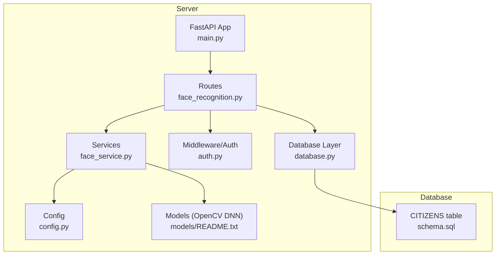

**Diagram sources**
- [main.py:1-107](file://server/main.py#L1-L107)
- [face_recognition.py:1-282](file://server/routes/face_recognition.py#L1-L282)
- [face_service.py:1-177](file://server/services/face_service.py#L1-L177)
- [auth.py:1-182](file://server/middleware/auth.py#L1-L182)
- [database.py:1-76](file://server/database.py#L1-L76)
- [config.py:1-41](file://server/config.py#L1-L41)
- [README.txt:1-41](file://server/models/README.txt#L1-L41)
- [schema.sql:26-43](file://db/schema.sql#L26-L43)

**Section sources**
- [main.py:1-107](file://server/main.py#L1-L107)
- [face_recognition.py:1-282](file://server/routes/face_recognition.py#L1-L282)
- [face_service.py:1-177](file://server/services/face_service.py#L1-L177)
- [database.py:1-76](file://server/database.py#L1-L76)
- [config.py:1-41](file://server/config.py#L1-L41)
- [schema.sql:26-43](file://db/schema.sql#L26-L43)
- [README.txt:1-41](file://server/models/README.txt#L1-L41)

## Core Components
- Face Recognition Routes: Expose endpoints for face registration, login, and detection. They orchestrate image ingestion, model loading, detection, encoding extraction, and database persistence or comparison.
- Face Recognition Service: Encapsulates OpenCV DNN model loading, face detection via blob preprocessing and forward pass, and encoding extraction with image preprocessing (resize, grayscale, histogram equalization, flattening, normalization).
- Database Integration: Provides connection pooling and context-managed cursors for database operations, including storing and retrieving serialized face encodings.
- Configuration: Centralized settings for face tolerance and model selection.
- Database Schema: Defines the citizens table with a BLOB field for serialized 128-d face encodings and related attributes.

Key responsibilities:
- Model lifecycle management and lazy loading
- Robust error handling and informative HTTP exceptions
- Secure token issuance upon successful authentication
- Efficient encoding comparison and threshold-based matching

**Section sources**
- [face_recognition.py:28-231](file://server/routes/face_recognition.py#L28-L231)
- [face_service.py:24-149](file://server/services/face_service.py#L24-L149)
- [database.py:14-76](file://server/database.py#L14-L76)
- [config.py:29-31](file://server/config.py#L29-L31)
- [schema.sql:26-43](file://db/schema.sql#L26-L43)

## Architecture Overview
The system integrates FastAPI routes with a dedicated face recognition service and database layer. The flow for face registration and login follows a clear pipeline: image ingestion, detection, encoding extraction, and persistence or comparison.

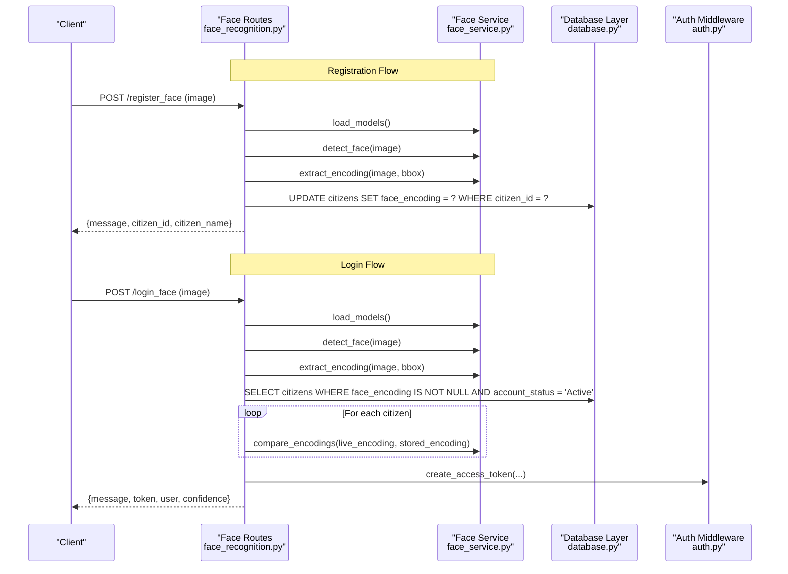

**Diagram sources**
- [face_recognition.py:28-231](file://server/routes/face_recognition.py#L28-L231)
- [face_service.py:24-149](file://server/services/face_service.py#L24-L149)
- [database.py:52-76](file://server/database.py#L52-L76)
- [auth.py:57-61](file://server/middleware/auth.py#L57-L61)

## Detailed Component Analysis

### Face Recognition Routes
Endpoints:
- POST /api/face/register_face: Registers a face encoding for a citizen by validating image, detecting face, extracting encoding, and persisting serialized encoding to the database.
- POST /api/face/login_face: Performs face-based login by detecting face, extracting encoding, fetching all registered citizens, comparing encodings, applying tolerance, and issuing a JWT token on match.
- POST /api/face/detect_face: Simple detection endpoint returning whether a face was detected and its bounding box.

Processing logic highlights:
- Lazy model loading via service method
- Image decoding from bytes
- Bounding box retrieval with confidence threshold
- Encoding extraction and serialization
- Threshold-based matching and error handling
- Token creation with user metadata

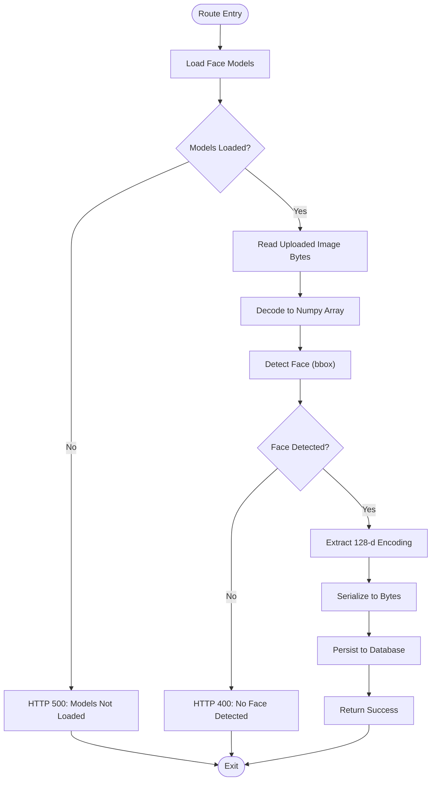

**Diagram sources**
- [face_recognition.py:28-101](file://server/routes/face_recognition.py#L28-L101)
- [face_service.py:24-94](file://server/services/face_service.py#L24-L94)

**Section sources**
- [face_recognition.py:28-231](file://server/routes/face_recognition.py#L28-L231)

### Face Recognition Service
Responsibilities:
- Model loading: Loads OpenCV DNN Caffe model from local models directory if available.
- Face detection: Preprocesses image into blob, runs network forward, selects detection with highest confidence above threshold, and returns bounding box.
- Encoding extraction: Crops face ROI, resizes to standard size, converts to grayscale, applies histogram equalization, flattens, downsamples to 128 dimensions, normalizes, and returns fixed-size vector.
- Encoding comparison: Computes Euclidean distance between two encodings.
- Base64 image processing: Decodes base64 images for testing endpoints.

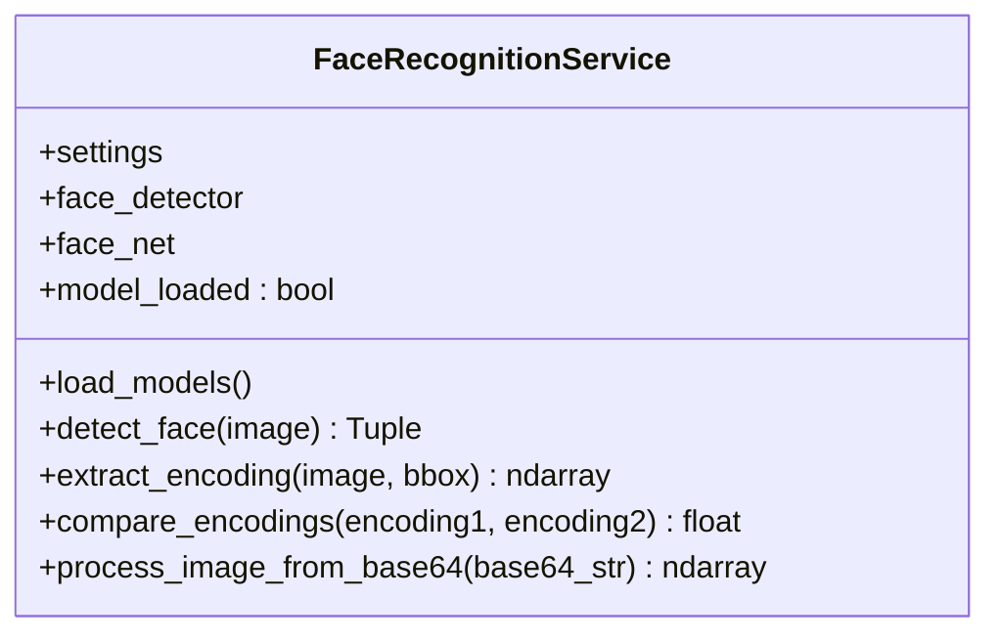

**Diagram sources**
- [face_service.py:15-177](file://server/services/face_service.py#L15-L177)

**Section sources**
- [face_service.py:24-149](file://server/services/face_service.py#L24-L149)

### Database Integration
- Connection pooling: Initializes a MySQL connection pool with configurable size and timeouts.
- Context-managed cursors: Provides context managers for safe database operations with automatic rollback on errors.
- Citizens table: Stores serialized face encodings in a BLOB column alongside user metadata and trust/account status.

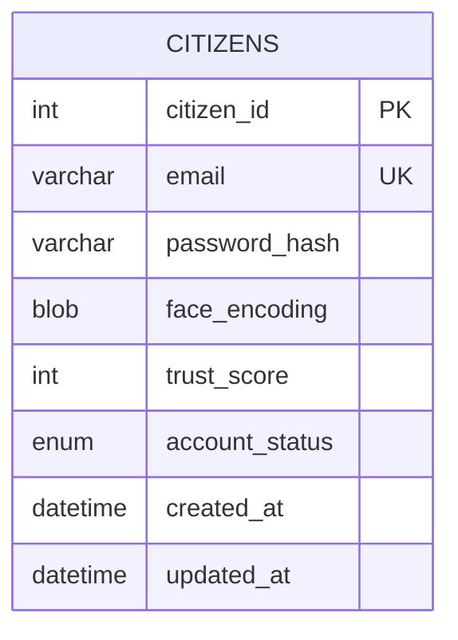

**Diagram sources**
- [schema.sql:26-43](file://db/schema.sql#L26-L43)

**Section sources**
- [database.py:14-76](file://server/database.py#L14-L76)
- [schema.sql:26-43](file://db/schema.sql#L26-L43)

### Configuration
- Face tolerance: Configurable threshold for determining a positive match during face login.
- Model selection: Placeholder for model type configuration.
- JWT secret and algorithm: Used for token creation in authentication flows.

**Section sources**
- [config.py:29-31](file://server/config.py#L29-L31)
- [auth.py:57-61](file://server/middleware/auth.py#L57-L61)

### Model File Management
- Expected files: deploy.prototxt and res10_300x300_ssd_iter_140000.caffemodel.
- Download instructions and verification steps are documented in the models README.
- Service logs warnings if models are missing and prevents detection operations.

**Section sources**
- [README.txt:1-41](file://server/models/README.txt#L1-L41)
- [face_service.py:24-45](file://server/services/face_service.py#L24-L45)

## Architecture Overview
The face recognition system is composed of:
- FastAPI routes orchestrating the end-to-end flow
- Face service encapsulating OpenCV DNN and preprocessing
- Database layer managing persistence and retrieval
- Configuration and middleware supporting authentication and security

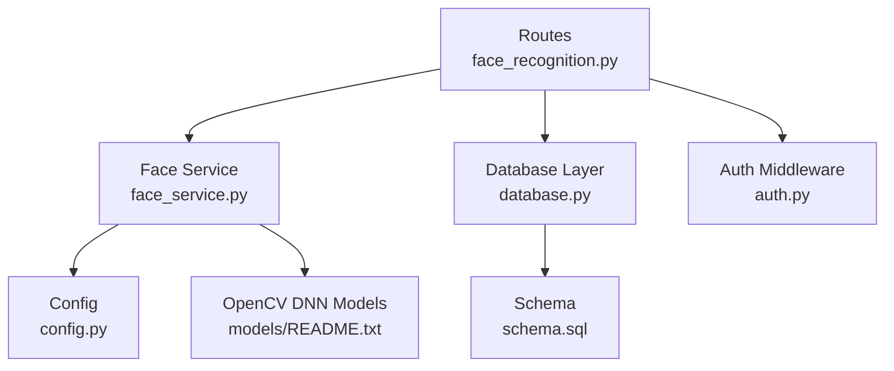

**Diagram sources**
- [face_recognition.py:1-282](file://server/routes/face_recognition.py#L1-L282)
- [face_service.py:1-177](file://server/services/face_service.py#L1-L177)
- [database.py:1-76](file://server/database.py#L1-L76)
- [config.py:1-41](file://server/config.py#L1-L41)
- [README.txt:1-41](file://server/models/README.txt#L1-L41)
- [schema.sql:26-43](file://db/schema.sql#L26-L43)
- [auth.py:1-182](file://server/middleware/auth.py#L1-L182)

## Detailed Component Analysis

### Face Detection Algorithm
- Input preprocessing: Converts image to blob with fixed size and mean subtraction.
- Forward pass: Runs the loaded Caffe network to obtain detections.
- Bounding box selection: Filters detections by confidence threshold and selects the highest-confidence face within image bounds.

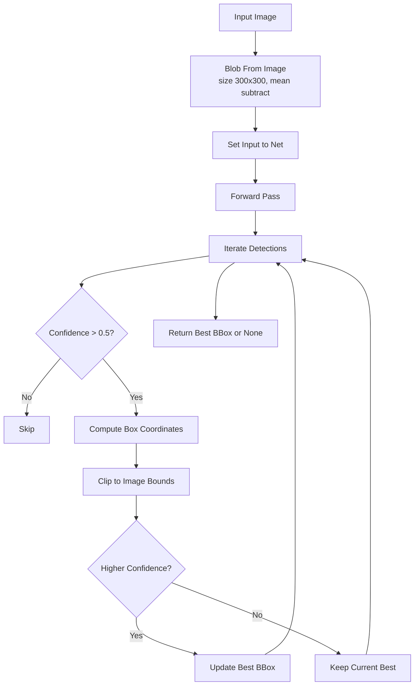

**Diagram sources**
- [face_service.py:47-94](file://server/services/face_service.py#L47-L94)

**Section sources**
- [face_service.py:47-94](file://server/services/face_service.py#L47-L94)

### Face Comparison Workflow and Similarity Threshold
- Live image is processed to produce a 128-d encoding.
- Stored encodings are retrieved from the database and deserialized.
- Euclidean distance is computed between live and stored encodings.
- The smallest distance determines the best match.
- Matching succeeds only if the best distance is below the configured tolerance.

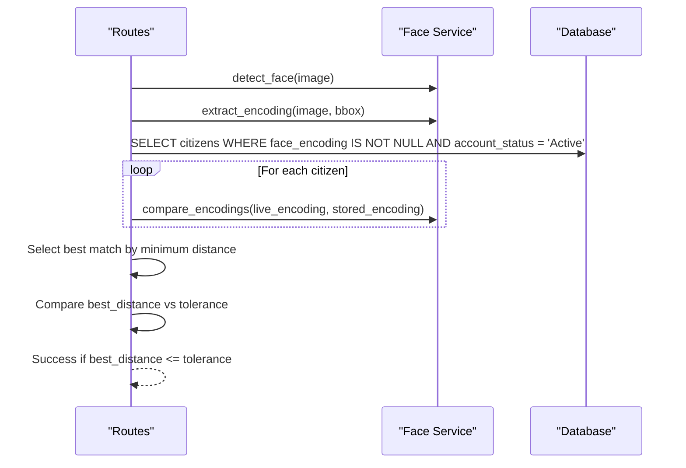

**Diagram sources**
- [face_recognition.py:110-231](file://server/routes/face_recognition.py#L110-L231)
- [face_service.py:143-149](file://server/services/face_service.py#L143-L149)

**Section sources**
- [face_recognition.py:170-202](file://server/routes/face_recognition.py#L170-L202)
- [face_service.py:143-149](file://server/services/face_service.py#L143-L149)

### Image Preprocessing Pipeline and Feature Extraction
- Cropping: Extract face region from bounding box.
- Resizing: Standardize to 128x128 pixels.
- Grayscale conversion: Transform to single-channel.
- Histogram equalization: Enhance contrast for robust features.
- Flattening and downsampling: Produce a 128-element vector.
- Normalization: Scale to [0, 1] range.
- Fixed-size guarantee: Pad or truncate to exactly 128 dimensions.

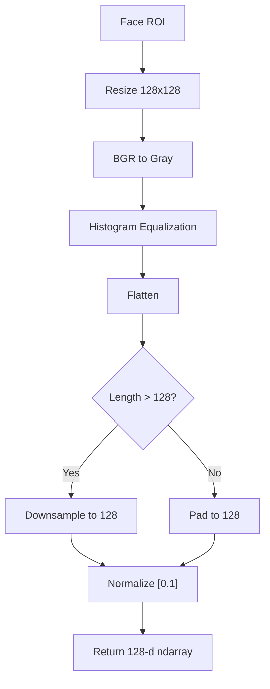

**Diagram sources**
- [face_service.py:96-141](file://server/services/face_service.py#L96-L141)

**Section sources**
- [face_service.py:96-141](file://server/services/face_service.py#L96-L141)

### Authentication Process
- On successful login, the system creates a JWT token containing user identity and role.
- Token payload includes citizen ID, role, email, and name.
- Token is signed with a secret key and set to expire after a configured duration.

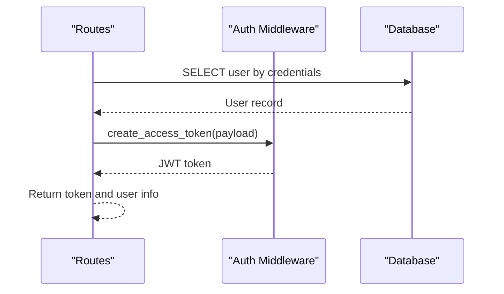

**Diagram sources**
- [auth.py:57-61](file://server/middleware/auth.py#L57-L61)
- [face_recognition.py:204-212](file://server/routes/face_recognition.py#L204-L212)

**Section sources**
- [auth.py:57-61](file://server/middleware/auth.py#L57-L61)
- [face_recognition.py:204-212](file://server/routes/face_recognition.py#L204-L212)

### Examples

#### Face Registration
- Endpoint: POST /api/face/register_face
- Steps:
  - Load models
  - Read and decode image
  - Detect face and validate bounding box
  - Extract encoding
  - Serialize encoding and update citizens table

**Section sources**
- [face_recognition.py:28-101](file://server/routes/face_recognition.py#L28-L101)
- [face_service.py:24-94](file://server/services/face_service.py#L24-L94)
- [face_service.py:96-141](file://server/services/face_service.py#L96-L141)

#### Face Authentication Verification
- Endpoint: POST /api/face/login_face
- Steps:
  - Load models
  - Detect face and extract encoding
  - Retrieve all registered citizens with active status
  - Compare encodings and select best match
  - Validate against tolerance
  - Issue JWT token on success

**Section sources**
- [face_recognition.py:110-231](file://server/routes/face_recognition.py#L110-L231)
- [face_service.py:143-149](file://server/services/face_service.py#L143-L149)

#### Error Handling for Failed Matches
- No face detected: HTTP 400 with descriptive message
- Model not loaded: HTTP 500 with guidance
- No registered faces: HTTP 404
- No match within tolerance: HTTP 401

**Section sources**
- [face_recognition.py:59-63](file://server/routes/face_recognition.py#L59-L63)
- [face_recognition.py:142-146](file://server/routes/face_recognition.py#L142-L146)
- [face_recognition.py:164-168](file://server/routes/face_recognition.py#L164-L168)
- [face_recognition.py:198-202](file://server/routes/face_recognition.py#L198-L202)

## Dependency Analysis
External dependencies include FastAPI, OpenCV (via python-opencv), NumPy, and MySQL connector. The face service depends on OpenCV DNN models located under server/models.

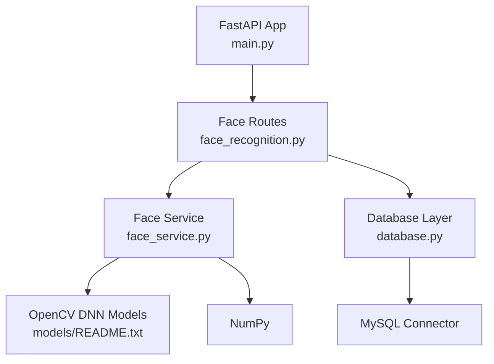

**Diagram sources**
- [main.py:1-107](file://server/main.py#L1-L107)
- [face_recognition.py:1-282](file://server/routes/face_recognition.py#L1-L282)
- [face_service.py:1-177](file://server/services/face_service.py#L1-L177)
- [database.py:1-76](file://server/database.py#L1-L76)
- [requirements.txt:1-13](file://server/requirements.txt#L1-L13)

**Section sources**
- [requirements.txt:1-13](file://server/requirements.txt#L1-L13)

## Performance Considerations
- Model loading: Lazy loading avoids unnecessary initialization; ensure models are downloaded to prevent repeated failures.
- Image preprocessing: Histogram equalization and resizing are lightweight; avoid excessive reprocessing.
- Encoding comparison: Linear scan over registered users; consider indexing or approximate nearest neighbor strategies for large-scale deployments.
- Tolerance tuning: Start with the configured tolerance and adjust based on false acceptance and false rejection rates.
- Concurrency: Use connection pooling and keep model loading outside hot paths.

[No sources needed since this section provides general guidance]

## Troubleshooting Guide
Common issues and resolutions:
- Missing models: Ensure deploy.prototxt and res10_300x300_ssd_iter_140000.caffemodel exist in server/models and restart the service.
- No face detected: Verify image quality, lighting, and face coverage; adjust tolerance if needed.
- Model not loaded: Check logs for warnings and confirm model files are present.
- Database errors: Confirm connection pool configuration and that the citizens table schema matches expectations.
- Encoding mismatch: Ensure stored encodings are 128-dimensional float32 arrays.

**Section sources**
- [README.txt:34-40](file://server/models/README.txt#L34-L40)
- [face_service.py:33-37](file://server/services/face_service.py#L33-L37)
- [face_recognition.py:38-42](file://server/routes/face_recognition.py#L38-L42)
- [schema.sql:26-43](file://db/schema.sql#L26-L43)

## Privacy and Security Considerations
- Biometric data protection: Store only serialized encodings in the database; apply strict access controls and encryption at rest.
- Token security: Use strong secrets and secure transport; limit token lifetimes; invalidate tokens on logout.
- Data minimization: Collect only necessary biometric data; provide user consent mechanisms.
- Audit logging: Track access to biometric data and authentication attempts.
- Compliance: Align storage and processing with applicable regulations (e.g., data protection laws).

[No sources needed since this section provides general guidance]

## Conclusion
The face recognition service integrates OpenCV DNN-based detection and a custom 128-d encoding pipeline with robust FastAPI routes and database persistence. By tuning tolerance, ensuring model availability, and following security and privacy best practices, the system can deliver reliable biometric authentication for the Traffic Violation Management System.