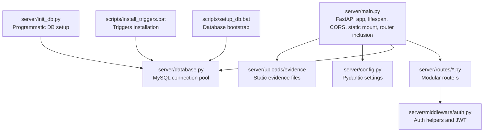
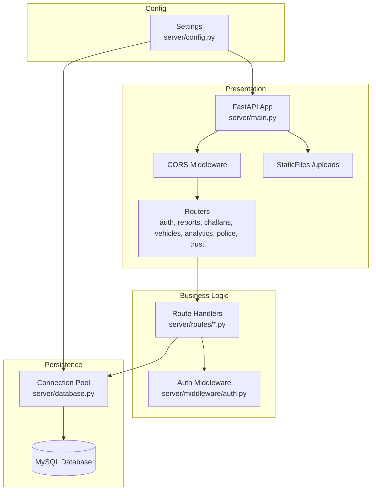
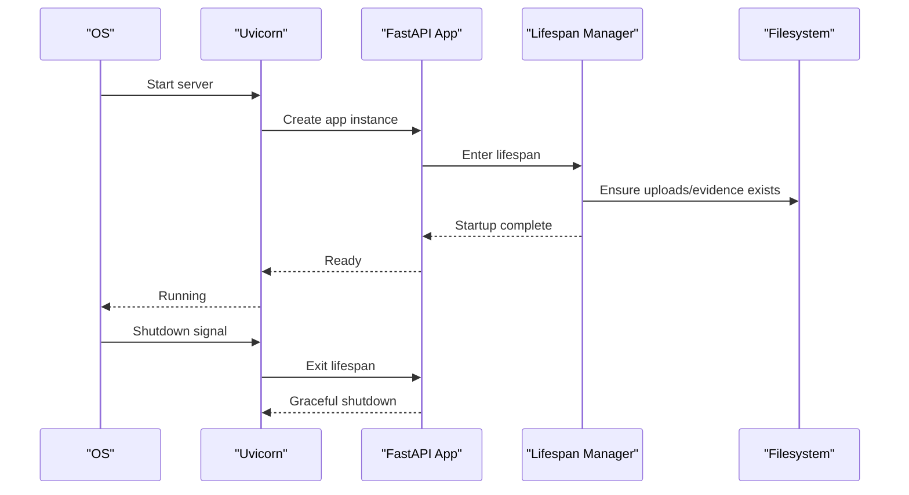
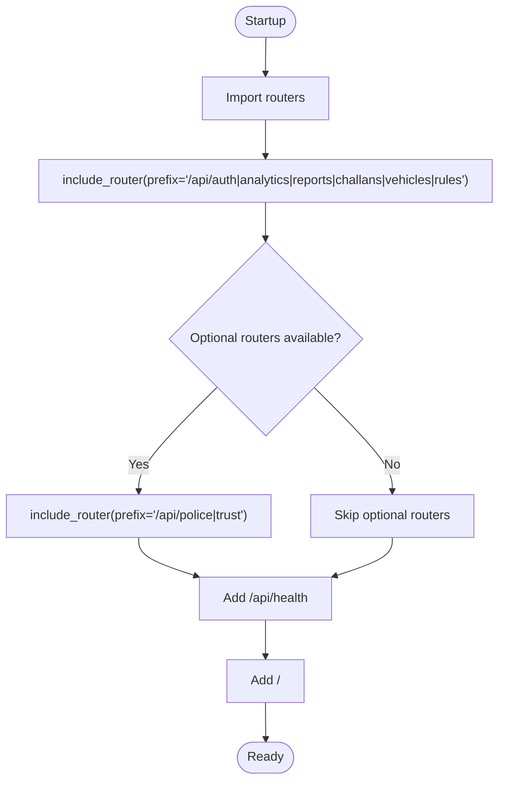
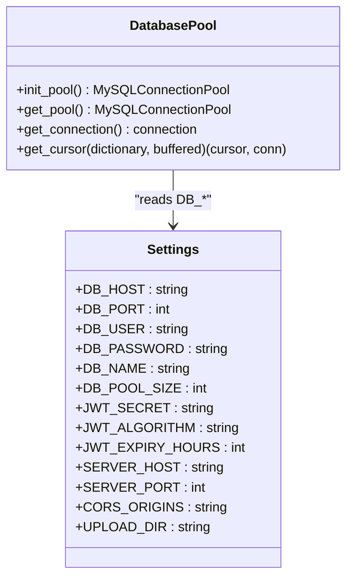
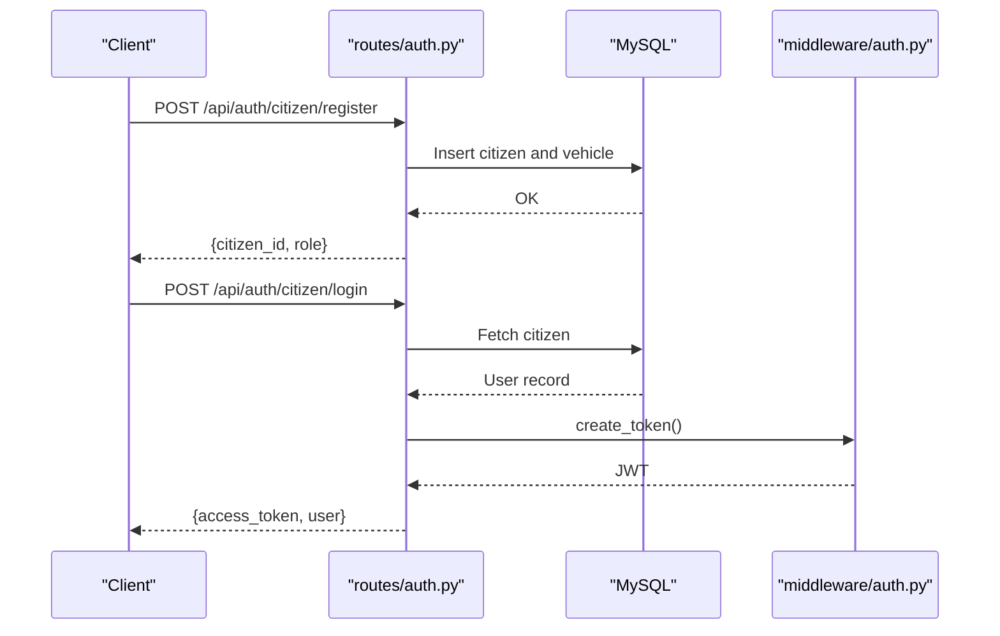
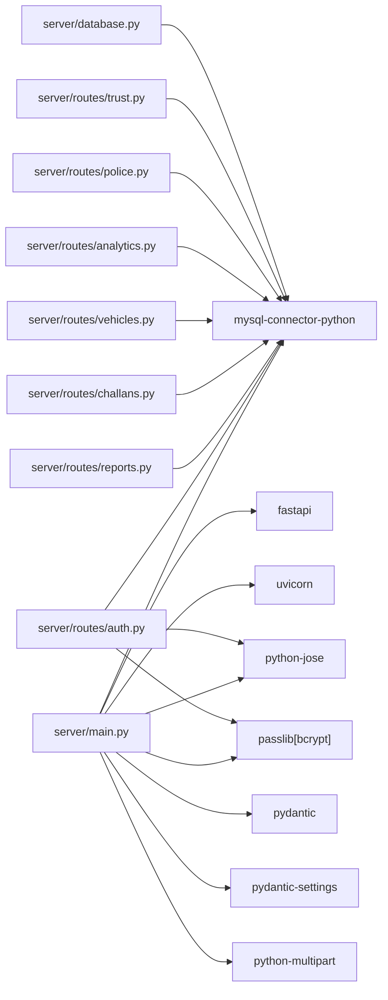

# FastAPI Application Architecture

<cite>
**Referenced Files in This Document**
- [main.py](file://server/main.py)
- [database.py](file://server/database.py)
- [config.py](file://server/config.py)
- [auth.py](file://server/routes/auth.py)
- [challans.py](file://server/routes/challans.py)
- [reports.py](file://server/routes/reports.py)
- [vehicles.py](file://server/routes/vehicles.py)
- [police.py](file://server/routes/police.py)
- [trust.py](file://server/routes/trust.py)
- [analytics.py](file://server/routes/analytics.py)
- [auth.py](file://server/middleware/auth.py)
- [requirements.txt](file://server/requirements.txt)
- [setup_db.bat](file://scripts/setup_db.bat)
- [install_triggers.bat](file://scripts/install_triggers.bat)
- [init_db.py](file://server/init_db.py)
</cite>

## Table of Contents
1. [Introduction](#introduction)
2. [Project Structure](#project-structure)
3. [Core Components](#core-components)
4. [Architecture Overview](#architecture-overview)
5. [Detailed Component Analysis](#detailed-component-analysis)
6. [Dependency Analysis](#dependency-analysis)
7. [Performance Considerations](#performance-considerations)
8. [Troubleshooting Guide](#troubleshooting-guide)
9. [Conclusion](#conclusion)
10. [Appendices](#appendices)

## Introduction
This document describes the FastAPI application architecture for the Traffic Violation Management System (TVMS). It covers application initialization, lifespan management, middleware configuration, CORS policy, static file serving for evidence uploads, modular router registration with route prefixes and tags, application lifecycle events, logging configuration, error handling strategies, and integration with external dependencies. It also includes deployment considerations and production readiness settings derived from the repository’s implementation.

## Project Structure
The backend is organized around a FastAPI application with modular routing under server/routes, database connectivity utilities, and configuration via Pydantic settings. Evidence uploads are served statically from a dedicated directory.

**Diagram sources**
- [main.py:35-107](file://server/main.py#L35-L107)
- [database.py:14-76](file://server/database.py#L14-L76)
- [config.py:9-41](file://server/config.py#L9-L41)
- [auth.py:1-182](file://server/middleware/auth.py#L1-L182)
- [setup_db.bat:1-64](file://scripts/setup_db.bat#L1-L64)
- [install_triggers.bat:1-55](file://scripts/install_triggers.bat#L1-L55)
- [init_db.py:18-181](file://server/init_db.py#L18-L181)

**Section sources**
- [main.py:12-107](file://server/main.py#L12-L107)
- [database.py:14-76](file://server/database.py#L14-L76)
- [config.py:9-41](file://server/config.py#L9-L41)

## Core Components
- Application factory and lifespan: The FastAPI app is initialized with a lifespan manager that ensures the uploads directory is created and logs startup/shutdown events.
- Middleware: CORS middleware is configured broadly to allow all origins, methods, and headers.
- Static files: Evidence uploads are mounted under /uploads for client access.
- Router registration: Modular routers are included with route prefixes and tags for clean grouping.
- Health and root endpoints: Lightweight endpoints expose service metadata and health status.
- Logging: Structured logging is configured at INFO level with a consistent format.

**Section sources**
- [main.py:35-107](file://server/main.py#L35-L107)

## Architecture Overview
The system follows a layered architecture:
- Presentation layer: FastAPI app with routers and endpoints.
- Business logic: Route handlers implement CRUD and orchestration.
- Persistence: MySQL via a connection pool abstraction.
- Configuration: Pydantic settings with environment file support.
- Security: JWT-based authentication and role checks in middleware.

**Diagram sources**
- [main.py:35-107](file://server/main.py#L35-L107)
- [database.py:14-76](file://server/database.py#L14-L76)
- [config.py:9-41](file://server/config.py#L9-L41)
- [auth.py:1-182](file://server/middleware/auth.py#L1-L182)

## Detailed Component Analysis

### Application Initialization and Lifespan
- Lifespan manager initializes the uploads directory and logs startup and shutdown events.
- The app defines descriptive metadata (title, description, version) and registers middleware and routers.

**Diagram sources**
- [main.py:35-48](file://server/main.py#L35-L48)

**Section sources**
- [main.py:35-55](file://server/main.py#L35-L55)

### CORS Middleware Configuration
- Broadly permissive CORS is configured to allow all origins, credentials, methods, and headers. This simplifies development and cross-origin access.

**Section sources**
- [main.py:60-67](file://server/main.py#L60-L67)

### Static File Serving for Evidence Uploads
- The uploads directory is ensured to exist during startup.
- StaticFiles is mounted at /uploads to serve evidence files.

**Section sources**
- [main.py:69-73](file://server/main.py#L69-L73)

### Router Registration Patterns
- Routers are imported and included with route prefixes and tags for logical grouping.
- Optional routers are conditionally included based on availability.

**Diagram sources**
- [main.py:13-87](file://server/main.py#L13-L87)

**Section sources**
- [main.py:77-95](file://server/main.py#L77-L95)

### Modular Routing Structure
- Route groups:
  - Authentication: /api/auth
  - Analytics: /api/analytics
  - Reports: /api/reports
  - Challans: /api/challans
  - Vehicles: /api/vehicles
  - Rules: /api/rules
  - Optional:
    - Police: /api/police
    - Trust & History: /api/trust

**Section sources**
- [main.py:77-87](file://server/main.py#L77-L87)

### Application Lifecycle Events
- Startup: Ensures uploads directory exists.
- Shutdown: Logs graceful shutdown.

**Section sources**
- [main.py:35-48](file://server/main.py#L35-L48)

### Logging Configuration
- Logging is configured at INFO level with a consistent format and a dedicated logger name for the application.

**Section sources**
- [main.py:28-34](file://server/main.py#L28-L34)

### Database Connectivity
- A MySQL connection pool is created with fixed pool size and reset session behavior.
- Context managers provide connection and cursor lifecycles with error handling and rollback semantics.

**Diagram sources**
- [database.py:14-76](file://server/database.py#L14-L76)
- [config.py:9-41](file://server/config.py#L9-L41)

**Section sources**
- [database.py:14-76](file://server/database.py#L14-L76)
- [config.py:9-41](file://server/config.py#L9-L41)

### Authentication Middleware and Routes
- Authentication routes are implemented as self-contained handlers with JWT token creation and bcrypt password hashing.
- Middleware provides role-based access checks and token decoding.

**Diagram sources**
- [auth.py:114-216](file://server/routes/auth.py#L114-L216)
- [auth.py:57-61](file://server/middleware/auth.py#L57-L61)

**Section sources**
- [auth.py:114-293](file://server/routes/auth.py#L114-L293)
- [auth.py:45-61](file://server/middleware/auth.py#L45-L61)

### Reports Module (Evidence Uploads and CRUD)
- Supports evidence upload with file type and size validation.
- Creates reports and links vehicles, ensuring referential integrity.
- Provides endpoints for citizens and police dashboards.

**Section sources**
- [reports.py:50-121](file://server/routes/reports.py#L50-L121)
- [reports.py:147-223](file://server/routes/reports.py#L147-L223)
- [reports.py:411-460](file://server/routes/reports.py#L411-L460)

### Challans Module (Payments and Enforcement)
- Creates challans from verified reports, linking to violators and updating statuses.
- Supports payment updates and deletion with appropriate validations.

**Section sources**
- [challans.py:47-139](file://server/routes/challans.py#L47-L139)
- [challans.py:336-398](file://server/routes/challans.py#L336-L398)

### Vehicles Module (Search and History)
- Searches vehicles by plate number and aggregates violation history with challan details.

**Section sources**
- [vehicles.py:36-145](file://server/routes/vehicles.py#L36-L145)

### Analytics Module (Dashboards and Metrics)
- Provides system summaries, leaderboards, citizen analytics, and status trends.

**Section sources**
- [analytics.py:36-125](file://server/routes/analytics.py#L36-L125)
- [analytics.py:205-255](file://server/routes/analytics.py#L205-L255)
- [analytics.py:484-526](file://server/routes/analytics.py#L484-L526)

### Police and Trust Modules (Optional Routers)
- Police module orchestrates report verification and rejection via stored procedures and exposes performance metrics.
- Trust module provides trust history and current score access with role-based restrictions.

**Section sources**
- [police.py:25-103](file://server/routes/police.py#L25-L103)
- [police.py:158-220](file://server/routes/police.py#L158-L220)
- [trust.py:15-61](file://server/routes/trust.py#L15-L61)
- [trust.py:104-134](file://server/routes/trust.py#L104-L134)

## Dependency Analysis
External dependencies are declared in requirements.txt. The application integrates with:
- FastAPI for routing and ASGI server
- Uvicorn for ASGI server runtime
- MySQL Connector and PyMySQL for database connectivity
- Pydantic and Pydantic Settings for configuration
- bcrypt and python-jose for authentication

**Diagram sources**
- [requirements.txt:1-12](file://server/requirements.txt#L1-L12)
- [main.py:5-11](file://server/main.py#L5-L11)
- [auth.py:5-12](file://server/routes/auth.py#L5-L12)
- [reports.py:5-12](file://server/routes/reports.py#L5-L12)
- [challans.py:5-9](file://server/routes/challans.py#L5-L9)
- [vehicles.py:5-7](file://server/routes/vehicles.py#L5-L7)
- [analytics.py:5-7](file://server/routes/analytics.py#L5-L7)
- [police.py:5-11](file://server/routes/police.py#L5-L11)
- [trust.py:5-9](file://server/routes/trust.py#L5-L9)
- [database.py:4-8](file://server/database.py#L4-L8)

**Section sources**
- [requirements.txt:1-12](file://server/requirements.txt#L1-L12)

## Performance Considerations
- Connection pooling: The MySQL pool is sized to balance concurrency and resource usage.
- Blocking operations: Password hashing runs in a thread pool to avoid blocking the event loop.
- Static file serving: Evidence files are served efficiently via StaticFiles.
- Query design: Route handlers use targeted queries and minimal joins to reduce overhead.

[No sources needed since this section provides general guidance]

## Troubleshooting Guide
- Database connectivity failures: Check pool initialization and connection timeouts; verify host, port, user, and password.
- CORS issues: Confirm CORS middleware configuration allows expected origins and methods.
- Upload failures: Validate file types and sizes; ensure uploads directory permissions.
- Authentication errors: Verify JWT secret, algorithm, and token payload structure.
- Optional routers: If police or trust routers fail to import, the app continues with core routers.

**Section sources**
- [database.py:45-76](file://server/database.py#L45-L76)
- [main.py:21-27](file://server/main.py#L21-L27)
- [reports.py:57-71](file://server/routes/reports.py#L57-L71)
- [auth.py:77-98](file://server/routes/auth.py#L77-L98)

## Conclusion
The TVMS FastAPI application is structured for modularity, scalability, and maintainability. It leverages FastAPI’s lifespan hooks, robust CORS configuration, and static file serving for evidence. The modular router pattern with route prefixes and tags improves API discoverability. Database connectivity is encapsulated with a pool and context-managed cursors. Configuration is centralized via Pydantic settings. With careful attention to production hardening (CORS, secrets, and environment variables), the system is suitable for deployment.

[No sources needed since this section summarizes without analyzing specific files]

## Appendices

### Environment and Deployment Notes
- Database setup: Use the provided scripts to initialize schema, triggers, and demo data.
- Secrets and configuration: The settings module supports environment files; ensure production-grade secrets are set.
- Static uploads: The uploads directory is created at startup; ensure persistent storage for evidence retention.
- Health checks: Use the /api/health endpoint for readiness probes.

**Section sources**
- [setup_db.bat:30-64](file://scripts/setup_db.bat#L30-L64)
- [install_triggers.bat:17-55](file://scripts/install_triggers.bat#L17-L55)
- [init_db.py:18-181](file://server/init_db.py#L18-L181)
- [config.py:9-41](file://server/config.py#L9-L41)
- [main.py:88-103](file://server/main.py#L88-L103)