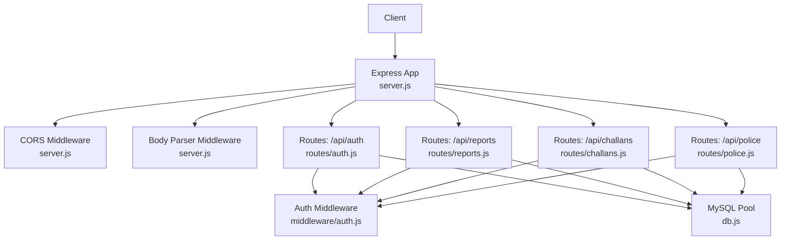
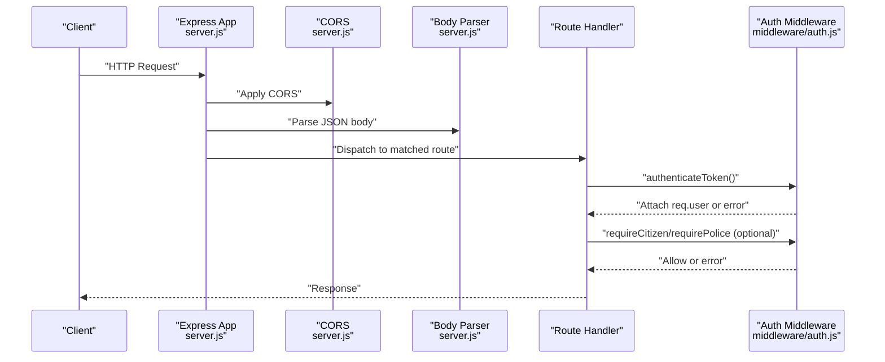
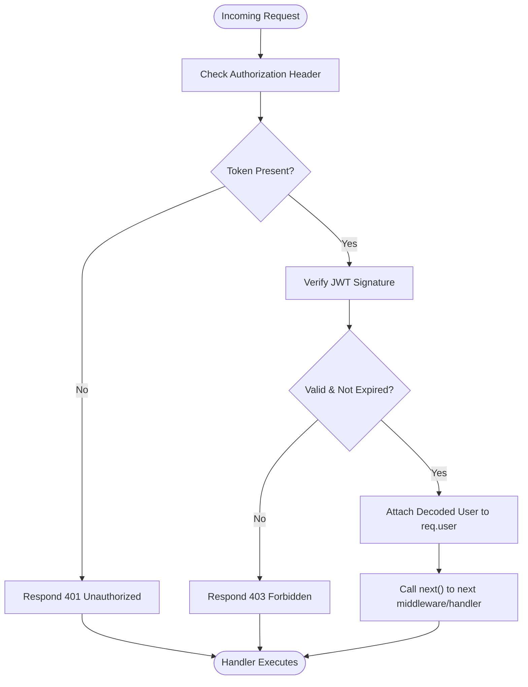
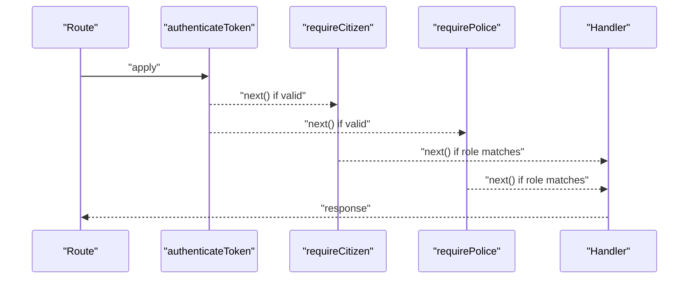
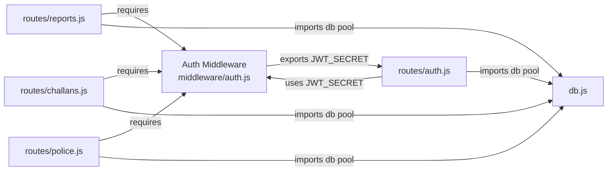
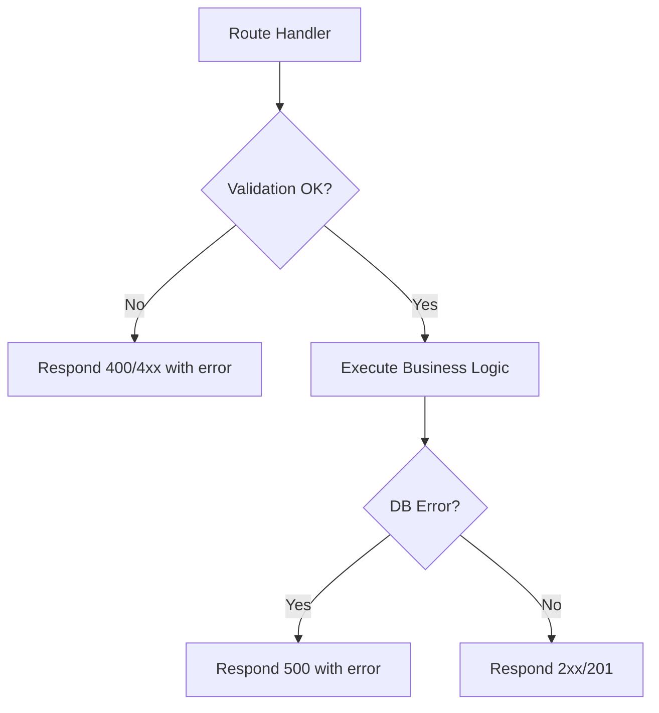
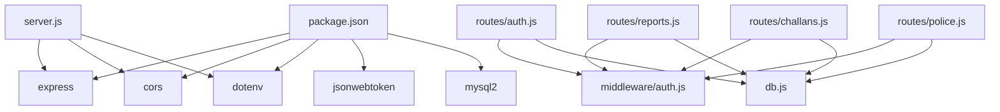

# Middleware Implementation

<cite>
**Referenced Files in This Document**
- [server.js](file://backend/server.js)
- [auth.js](file://backend/middleware/auth.js)
- [auth.js](file://backend/routes/auth.js)
- [reports.js](file://backend/routes/reports.js)
- [challans.js](file://backend/routes/challans.js)
- [police.js](file://backend/routes/police.js)
- [db.js](file://backend/db.js)
- [package.json](file://backend/package.json)
</cite>

## Table of Contents
1. [Introduction](#introduction)
2. [Project Structure](#project-structure)
3. [Core Components](#core-components)
4. [Architecture Overview](#architecture-overview)
5. [Detailed Component Analysis](#detailed-component-analysis)
6. [Dependency Analysis](#dependency-analysis)
7. [Performance Considerations](#performance-considerations)
8. [Troubleshooting Guide](#troubleshooting-guide)
9. [Conclusion](#conclusion)

## Introduction
This document explains the middleware implementation for request processing and response handling in the backend service. It focuses on authentication middleware, CORS configuration, and request validation patterns. It also documents middleware execution order, dependency injection via module exports, error propagation, and practical guidance for extending middleware with custom logic, logging, and integration with external services.

## Project Structure
The backend is an Express application with a dedicated middleware module and route modules that compose middleware to enforce authentication and role-based access control. CORS is enabled globally, and JSON parsing is applied before routing.

**Diagram sources**
- [server.js:13-26](file://backend/server.js#L13-L26)
- [auth.js](file://backend/middleware/auth.js)
- [auth.js](file://backend/routes/auth.js)
- [reports.js](file://backend/routes/reports.js)
- [challans.js](file://backend/routes/challans.js)
- [police.js](file://backend/routes/police.js)
- [db.js](file://backend/db.js)

**Section sources**
- [server.js:13-26](file://backend/server.js#L13-L26)
- [package.json:10-17](file://backend/package.json#L10-L17)

## Core Components
- Authentication middleware: Provides token extraction, verification, and attaches user identity to the request object. Includes role-based guards for citizen and police.
- CORS configuration: Enabled globally to support cross-origin requests.
- Request body parsing: Enabled to parse JSON payloads.
- Route-level middleware composition: Routes import and apply authentication and role guards.

Key behaviors:
- Token presence and validity are enforced before route handlers execute.
- Role guards restrict access to endpoints based on decoded token claims.
- Route handlers receive a populated request object with user identity and validated inputs.

**Section sources**
- [auth.js](file://backend/middleware/auth.js)
- [server.js:13-16](file://backend/server.js#L13-L16)
- [reports.js:8](file://backend/routes/reports.js#L8)
- [challans.js:8](file://backend/routes/challans.js#L8)
- [police.js:8](file://backend/routes/police.js#L8)

## Architecture Overview
The middleware pipeline runs in a fixed order per request. After global middleware, route-specific middleware executes in the order declared on each route. Authentication middleware verifies tokens and enforces roles before invoking the route handler.

**Diagram sources**
- [server.js:13-26](file://backend/server.js#L13-L26)
- [auth.js](file://backend/middleware/auth.js)
- [reports.js:8](file://backend/routes/reports.js#L8)
- [challans.js:8](file://backend/routes/challans.js#L8)
- [police.js:8](file://backend/routes/police.js#L8)

## Detailed Component Analysis

### Authentication Middleware
The authentication middleware performs:
- Authorization header parsing to extract the bearer token.
- Token verification against a shared secret.
- Attaching the decoded payload (including role) to the request object.
- Role-based enforcement via separate middleware functions.

**Diagram sources**
- [auth.js](file://backend/middleware/auth.js)

**Section sources**
- [auth.js](file://backend/middleware/auth.js)

### CORS Configuration
CORS is enabled globally with default settings, allowing cross-origin requests from browsers. This simplifies frontend-backend integration without additional per-route configuration.

**Section sources**
- [server.js:14](file://backend/server.js#L14)

### Request Validation Middleware
Validation occurs at two levels:
- Route-level checks inside handlers for required fields and business rules.
- Middleware-level checks for authentication and authorization.

Examples of validation patterns:
- Presence checks for required fields in request bodies.
- Role checks after authentication to ensure access control.

**Section sources**
- [reports.js:12-14](file://backend/routes/reports.js#L12-L14)
- [challans.js:36-38](file://backend/routes/challans.js#L36-L38)
- [police.js:24-26](file://backend/routes/police.js#L24-L26)

### Middleware Execution Order and Composition
Execution order per request:
1. Global middleware: CORS, JSON body parser.
2. Route-specific middleware: authentication and role guards in declaration order.
3. Route handler.

Composition examples:
- Reports submission requires both authentication and citizen role.
- Police endpoints require authentication and police role.
- Authentication middleware is reusable across routes.

**Diagram sources**
- [reports.js:8](file://backend/routes/reports.js#L8)
- [challans.js:8](file://backend/routes/challans.js#L8)
- [police.js:8](file://backend/routes/police.js#L8)
- [auth.js](file://backend/middleware/auth.js)

**Section sources**
- [reports.js:8](file://backend/routes/reports.js#L8)
- [challans.js:8](file://backend/routes/challans.js#L8)
- [police.js:8](file://backend/routes/police.js#L8)

### Dependency Injection Patterns
- Shared JWT secret is exported from middleware and consumed by routes for token verification and signing.
- Database pool is imported by routes for persistence operations.

**Diagram sources**
- [auth.js](file://backend/middleware/auth.js)
- [auth.js](file://backend/routes/auth.js)
- [reports.js](file://backend/routes/reports.js)
- [challans.js](file://backend/routes/challans.js)
- [police.js](file://backend/routes/police.js)
- [db.js](file://backend/db.js)

**Section sources**
- [auth.js](file://backend/middleware/auth.js)
- [auth.js](file://backend/routes/auth.js)
- [reports.js](file://backend/routes/reports.js)
- [challans.js](file://backend/routes/challans.js)
- [police.js](file://backend/routes/police.js)
- [db.js](file://backend/db.js)

### Error Propagation
- Authentication middleware returns 401 for missing tokens and 403 for invalid/expired tokens.
- Role guards return 403 when the user’s role does not match the required role.
- Route handlers return 4xx/5xx with structured error payloads for validation failures and internal errors.
- Global error handler logs unhandled errors and responds with a generic 500.

**Diagram sources**
- [auth.js](file://backend/middleware/auth.js)
- [reports.js:12-14](file://backend/routes/reports.js#L12-L14)
- [challans.js:36-38](file://backend/routes/challans.js#L36-L38)
- [police.js:24-26](file://backend/routes/police.js#L24-L26)
- [server.js:33-37](file://backend/server.js#L33-L37)

**Section sources**
- [auth.js](file://backend/middleware/auth.js)
- [reports.js:12-14](file://backend/routes/reports.js#L12-L14)
- [challans.js:36-38](file://backend/routes/challans.js#L36-L38)
- [police.js:24-26](file://backend/routes/police.js#L24-L26)
- [server.js:33-37](file://backend/server.js#L33-L37)

### Examples and Extension Patterns
- Custom middleware creation: Add a new function that inspects the request, optionally mutates it, and calls next() or responds with an error.
- Request/response modification: Middleware can set headers, attach metadata to req, or transform response bodies before they reach the client.
- Logging integration: Insert a logging middleware before route handlers to record method, URL, user identity, and response status.
- Conditional execution: Gate middleware on request path, method, or headers to minimize overhead for public endpoints.
- Integration with external services: Use middleware to fetch auxiliary data (e.g., user profile) from external APIs and attach it to req for downstream handlers.

[No sources needed since this section provides general guidance]

## Dependency Analysis
Express application dependencies include CORS, JSON parsing, and JWT utilities. The middleware module depends on the JWT library and environment configuration. Routes depend on the middleware module and the database pool.

**Diagram sources**
- [package.json:10-17](file://backend/package.json#L10-L17)
- [server.js:1-4](file://backend/server.js#L1-L4)
- [auth.js](file://backend/middleware/auth.js)
- [auth.js](file://backend/routes/auth.js)
- [reports.js](file://backend/routes/reports.js)
- [challans.js](file://backend/routes/challans.js)
- [police.js](file://backend/routes/police.js)
- [db.js](file://backend/db.js)

**Section sources**
- [package.json:10-17](file://backend/package.json#L10-L17)
- [server.js:1-4](file://backend/server.js#L1-L4)

## Performance Considerations
- Keep middleware lightweight: avoid heavy synchronous operations in hot paths.
- Use early exits: return 401/403 promptly when authentication fails to reduce unnecessary work.
- Centralize shared secrets and configuration: export constants from a single module to avoid repeated reads.
- Leverage connection pooling: the database pool is configured with connection limits and keep-alive to handle concurrent requests efficiently.
- Minimize global middleware overhead: enable only necessary middleware globally; apply route-specific middleware selectively.

**Section sources**
- [db.js](file://backend/db.js)

## Troubleshooting Guide
Common issues and remedies:
- Missing Authorization header: Ensure clients send a bearer token; authentication middleware returns 401.
- Invalid or expired token: JWT verification fails; middleware returns 403.
- Insufficient permissions: Role guard rejects access; ensure the token’s role matches the endpoint requirement.
- Route validation failures: Handlers return 400-style errors for missing fields; verify client payloads.
- Internal errors: Global error handler logs and returns 500; inspect server logs for stack traces.

Operational tips:
- Enable verbose logging around middleware boundaries to trace request flow.
- Use health checks to confirm service availability.
- Monitor database pool utilization and connection timeouts.

**Section sources**
- [auth.js](file://backend/middleware/auth.js)
- [server.js:33-37](file://backend/server.js#L33-L37)

## Conclusion
The middleware implementation centers on a small set of focused modules that enforce authentication, role-based access control, and basic request validation. The Express pipeline applies global middleware first, followed by route-specific middleware in declaration order. Dependencies are cleanly separated, with shared secrets and database connections injected via module exports. Extensibility is straightforward: add middleware functions, integrate logging, and compose them conditionally to meet evolving requirements while maintaining predictable error propagation and performance characteristics.