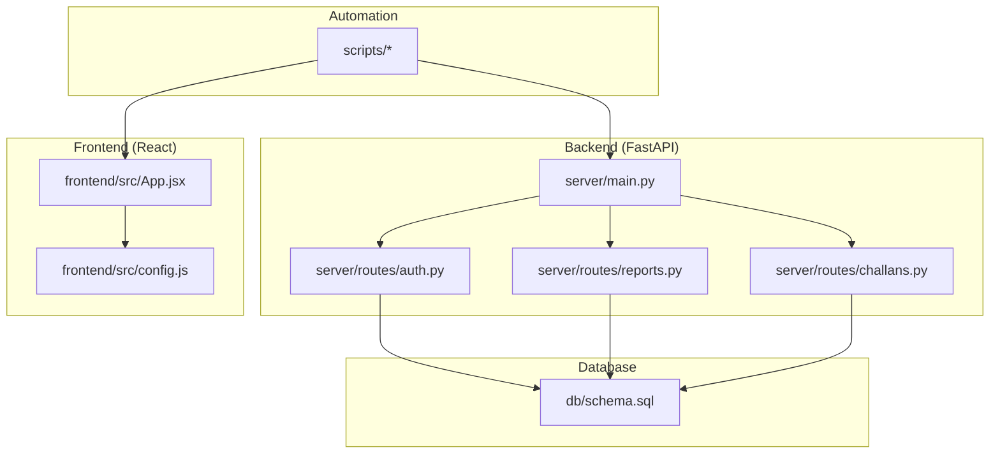
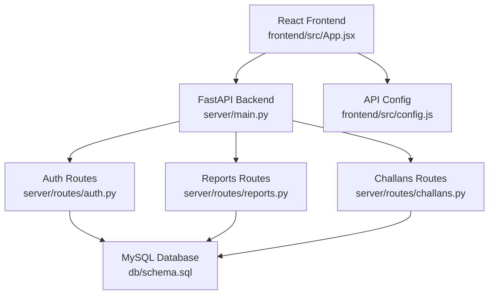
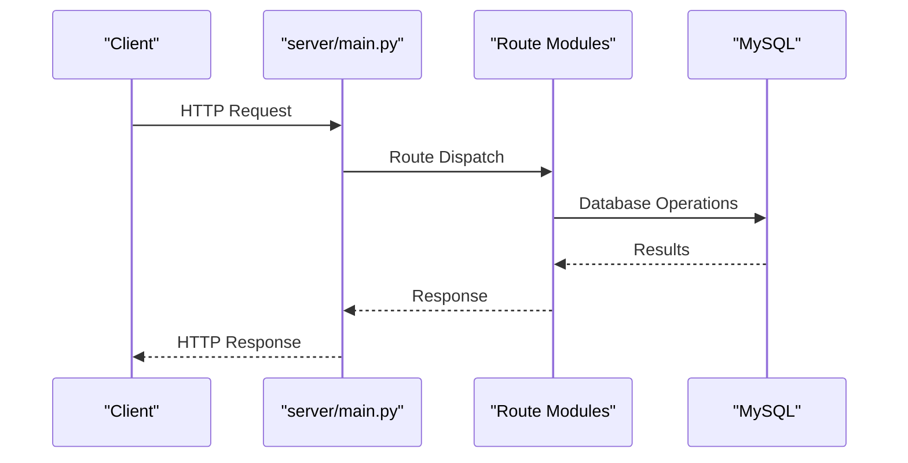
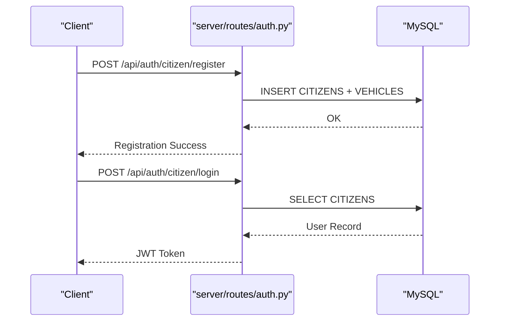
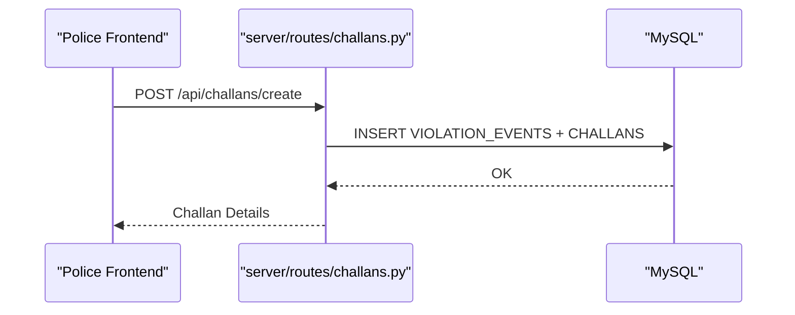
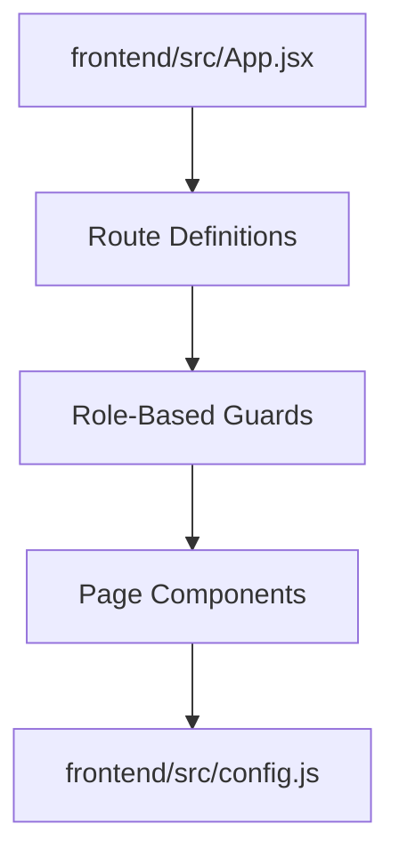
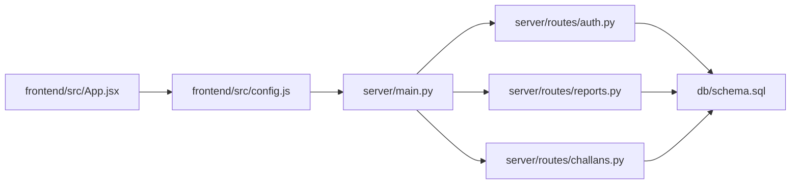

# Contributing and Development Guidelines

<cite>
**Referenced Files in This Document**
- [README.md](file://README.md)
- [main.py](file://server/main.py)
- [auth.py](file://server/routes/auth.py)
- [reports.py](file://server/routes/reports.py)
- [challans.py](file://server/routes/challans.py)
- [App.jsx](file://frontend/src/App.jsx)
- [config.js](file://frontend/src/config.js)
- [schema.sql](file://db/schema.sql)
- [PROJECT_CONTEXT_FOR_AI.md](file://PROJECT_CONTEXT_FOR_AI.md)
- [ACADEMIC_UI_TRANSFORMATION.md](file://ACADEMIC_UI_TRANSFORMATION.md)
- [COMPLETE_SYSTEM_GUARANTEE.md](file://COMPLETE_SYSTEM_GUARANTEE.md)
- [CHALLAN_SYSTEM_IMPLEMENTATION.md](file://CHALLAN_SYSTEM_IMPLEMENTATION.md)
- [TRUST_SCORE_SETUP_GUIDE.md](file://TRUST_SCORE_SETUP_GUIDE.md)
- [test_profile_api.py](file://scripts/test_profile_api.py)
</cite>

## Table of Contents
1. [Introduction](#introduction)
2. [Project Structure](#project-structure)
3. [Core Components](#core-components)
4. [Architecture Overview](#architecture-overview)
5. [Detailed Component Analysis](#detailed-component-analysis)
6. [Dependency Analysis](#dependency-analysis)
7. [Performance Considerations](#performance-considerations)
8. [Troubleshooting Guide](#troubleshooting-guide)
9. [Academic Context and Evaluation Criteria](#academic-context-and-evaluation-criteria)
10. [Contribution Workflow](#contribution-workflow)
11. [Code Standards and Conventions](#code-standards-and-conventions)
12. [Extending Existing Features](#extending-existing-features)
13. [Testing Requirements and Quality Assurance](#testing-requirements-and-quality-assurance)
14. [Documentation Standards](#documentation-standards)
15. [Examples and Collaboration Patterns](#examples-and-collaboration-patterns)
16. [Academic Presentation and Showcase Preparation](#academic-presentation-and-showcase-preparation)
17. [Conclusion](#conclusion)

## Introduction
This document defines the contributing and development guidelines for the Traffic Violation Management System (TVMS), a Tier-1 Government/Law Enforcement portal built with React + FastAPI + MySQL + OpenCV DNN. It covers development workflow, branch management, feature development, pull request procedures, code standards, academic evaluation criteria, testing, documentation, and collaboration patterns tailored to capstone-level DBMS projects.

## Project Structure
The repository follows a monorepo layout with:
- Backend: Python FastAPI application under server/
- Frontend: React + Vite application under frontend/
- Database: SQL schema and migration scripts under db/
- Automation and verification scripts under scripts/

**Diagram sources**
- [main.py:1-107](file://server/main.py#L1-L107)
- [auth.py:1-744](file://server/routes/auth.py#L1-L744)
- [reports.py:1-563](file://server/routes/reports.py#L1-L563)
- [challans.py:1-450](file://server/routes/challans.py#L1-L450)
- [App.jsx:1-274](file://frontend/src/App.jsx#L1-L274)
- [config.js:1-34](file://frontend/src/config.js#L1-L34)
- [schema.sql:1-942](file://db/schema.sql#L1-L942)

**Section sources**
- [README.md:45-93](file://README.md#L45-L93)
- [PROJECT_CONTEXT_FOR_AI.md:12-142](file://PROJECT_CONTEXT_FOR_AI.md#L12-L142)

## Core Components
- Backend API: Centralized in server/main.py with modular route modules for authentication, reports, challans, and analytics.
- Frontend Routing: Centralized routing in frontend/src/App.jsx with role-based navigation and protected routes.
- Database Schema: Fully normalized (5NF) with triggers, stored procedures, views, and temporal tables.
- Academic Context: Designed for DBMS capstone evaluation with explicit demonstration of normalization, triggers, ACID compliance, and real-time synchronization.

**Section sources**
- [main.py:1-107](file://server/main.py#L1-L107)
- [App.jsx:1-274](file://frontend/src/App.jsx#L1-L274)
- [schema.sql:1-942](file://db/schema.sql#L1-L942)
- [PROJECT_CONTEXT_FOR_AI.md:696-716](file://PROJECT_CONTEXT_FOR_AI.md#L696-L716)

## Architecture Overview
The system enforces role-based access control, uses JWT for authentication, and relies on MySQL triggers and stored procedures for business logic automation. Real-time updates are achieved via 3-second polling in frontend dashboards.

**Diagram sources**
- [main.py:77-86](file://server/main.py#L77-L86)
- [auth.py:1-744](file://server/routes/auth.py#L1-L744)
- [reports.py:1-563](file://server/routes/reports.py#L1-L563)
- [challans.py:1-450](file://server/routes/challans.py#L1-L450)
- [App.jsx:1-274](file://frontend/src/App.jsx#L1-L274)
- [config.js:1-34](file://frontend/src/config.js#L1-L34)
- [schema.sql:1-942](file://db/schema.sql#L1-L942)

## Detailed Component Analysis

### Backend API Entry Point and Routing
- FastAPI app initialization, CORS configuration, route inclusion, and health endpoint are defined centrally.
- Modular route inclusion ensures scalability and separation of concerns.

**Diagram sources**
- [main.py:50-95](file://server/main.py#L50-L95)
- [auth.py:114-216](file://server/routes/auth.py#L114-L216)
- [reports.py:147-223](file://server/routes/reports.py#L147-L223)
- [challans.py:47-138](file://server/routes/challans.py#L47-L138)

**Section sources**
- [main.py:1-107](file://server/main.py#L1-L107)

### Authentication Module
- Supports citizen and police registration/login, JWT token generation, and profile retrieval.
- Password hashing with bcrypt and threadpool execution to avoid blocking.

**Diagram sources**
- [auth.py:114-216](file://server/routes/auth.py#L114-L216)
- [auth.py:218-293](file://server/routes/auth.py#L218-L293)

**Section sources**
- [auth.py:1-744](file://server/routes/auth.py#L1-L744)

### Reports Module
- Handles report creation, retrieval, updates, deletion, and police processing.
- Integrates evidence upload and maintains referential integrity.

```mermaid
flowchart TD
Start(["Report Creation"]) --> CheckVehicle["Check Vehicle Exists"]
CheckVehicle --> |No| CreateVehicle["Insert VEHICLE"]
CheckVehicle --> |Yes| InsertReport["Insert REPORT"]
CreateVehicle --> InsertReport
InsertReport --> Commit["Commit Transaction"]
Commit --> End(["Success"])
```

**Diagram sources**
- [reports.py:147-223](file://server/routes/reports.py#L147-L223)

**Section sources**
- [reports.py:1-563](file://server/routes/reports.py#L1-L563)

### Challans Module
- Challan creation links to violator’s citizen via vehicle, payment processing with row-level locking, and real-time polling in frontend.

**Diagram sources**
- [challans.py:47-138](file://server/routes/challans.py#L47-L138)

**Section sources**
- [challans.py:1-450](file://server/routes/challans.py#L1-L450)

### Frontend Routing and API Configuration
- Centralized routing with role-based guards and protected routes.
- API endpoints configured via frontend/src/config.js for consistent consumption.

**Diagram sources**
- [App.jsx:78-262](file://frontend/src/App.jsx#L78-L262)
- [config.js:1-34](file://frontend/src/config.js#L1-L34)

**Section sources**
- [App.jsx:1-274](file://frontend/src/App.jsx#L1-L274)
- [config.js:1-34](file://frontend/src/config.js#L1-L34)

## Dependency Analysis
- Backend depends on PyMySQL for database connectivity and FastAPI for routing.
- Frontend consumes backend endpoints via centralized configuration.
- Database schema defines foreign keys, triggers, and stored procedures that enforce business rules.

**Diagram sources**
- [main.py:77-86](file://server/main.py#L77-L86)
- [auth.py:1-744](file://server/routes/auth.py#L1-L744)
- [reports.py:1-563](file://server/routes/reports.py#L1-L563)
- [challans.py:1-450](file://server/routes/challans.py#L1-L450)
- [schema.sql:1-942](file://db/schema.sql#L1-L942)

**Section sources**
- [main.py:1-107](file://server/main.py#L1-L107)
- [schema.sql:1-942](file://db/schema.sql#L1-L942)

## Performance Considerations
- Database performance relies on proper indexing and normalization (5NF).
- Real-time updates use 3-second polling; minimize unnecessary polling frequency.
- Use prepared statements and parameterized queries to prevent injection and improve throughput.
- Ensure database connections are pooled and properly closed to avoid resource leaks.

[No sources needed since this section provides general guidance]

## Troubleshooting Guide
Common issues and resolutions:
- Database “forgetting” data: This is impossible with current setup due to explicit commits and no truncation/drop commands.
- Trust score not updating: Install triggers using scripts/install_triggers.bat.
- Challan not appearing for violator: Verify VEHICLES.citizen_id linkage and CHALLANS.citizen_id alignment.
- Registration failures: Check uniqueness of emails and vehicle numbers; ensure migrations are applied.

**Section sources**
- [COMPLETE_SYSTEM_GUARANTEE.md:518-552](file://COMPLETE_SYSTEM_GUARANTEE.md#L518-L552)

## Academic Context and Evaluation Criteria
Demonstrated DBMS concepts suitable for capstone evaluation:
- Normalization: 5NF with zero redundancy.
- Triggers: Automatic trust score updates on report verification/rejection.
- Stored Procedures: ACID-compliant challan generation and payment.
- ACID Transactions: Commit/rollback guarantees.
- Referential Integrity: Foreign keys across CITIZENS, VEHICLES, REPORTS, CHALLANS.
- Audit Trails: HISTORY tables with temporal columns.
- Real-Time Synchronization: 3-second polling for dashboards.

**Section sources**
- [README.md:346-369](file://README.md#L346-L369)
- [schema.sql:304-754](file://db/schema.sql#L304-L754)
- [COMPLETE_SYSTEM_GUARANTEE.md:483-516](file://COMPLETE_SYSTEM_GUARANTEE.md#L483-L516)

## Contribution Workflow
Branch management and feature development:
- Use feature branches prefixed with feature/, fix/, or docs/ for clarity.
- Keep branches focused and small; reference related issues by number.
- Merge via pull requests with at least one reviewer approval.
- Ensure all tests pass and documentation is updated before merging.

Pull request procedures:
- Include a concise description of changes and rationale.
- Reference related issues and documentation updates.
- Perform a self-review focusing on code standards, error handling, and performance.
- Respond to feedback promptly and update the PR accordingly.

[No sources needed since this section provides general guidance]

## Code Standards and Conventions

### React Components (Frontend)
- Use functional components with hooks (useState, useEffect).
- Centralize API endpoints in frontend/src/config.js.
- Maintain consistent prop naming and component composition.
- Apply TailwindCSS utility classes for styling; avoid inline styles.
- Ensure role-based access control in App.jsx routes.

**Section sources**
- [App.jsx:1-274](file://frontend/src/App.jsx#L1-L274)
- [config.js:1-34](file://frontend/src/config.js#L1-L34)

### FastAPI Endpoints (Backend)
- Define clear request/response models with Pydantic.
- Use parameterized queries to prevent SQL injection.
- Implement explicit commit/rollback and error handling.
- Centralize database configuration and keep secrets in environment variables.
- Include health checks and CORS configuration.

**Section sources**
- [main.py:1-107](file://server/main.py#L1-L107)
- [auth.py:1-744](file://server/routes/auth.py#L1-L744)
- [reports.py:1-563](file://server/routes/reports.py#L1-L563)
- [challans.py:1-450](file://server/routes/challans.py#L1-L450)

### Database Schema Modifications
- Update db/schema.sql for schema changes.
- Create migration scripts under db/ and corresponding runner scripts under scripts/.
- Document changes in project documentation and update tests.
- Verify migrations before testing with scripts/verify_complete_system.py.

**Section sources**
- [schema.sql:1-942](file://db/schema.sql#L1-L942)
- [PROJECT_CONTEXT_FOR_AI.md:646-658](file://PROJECT_CONTEXT_FOR_AI.md#L646-L658)

## Extending Existing Features

### Adding New Violation Types
- Extend VIOLATION_RULES with new rules and base fine amounts.
- Update frontend forms and backend validation to include new rule selections.
- Ensure triggers and stored procedures remain compatible with new rule categories.

**Section sources**
- [schema.sql:98-111](file://db/schema.sql#L98-L111)
- [reports.py:462-511](file://server/routes/reports.py#L462-L511)

### Integrating Additional Biometric Authentication Methods
- Add new endpoints in server/routes/ for the new biometric method.
- Update frontend authentication flows to support the new method alongside face recognition.
- Ensure secure storage and validation of biometric templates or tokens.

[No sources needed since this section provides general guidance]

## Testing Requirements and Quality Assurance
Testing workflow and QA processes:
- Backend API testing: Use Swagger UI or curl to validate endpoints.
- Frontend manual testing checklist: Register, login, submit reports, view trust score, pay challan, verify/reject reports, and check performance stats.
- Automated verification: Use scripts/test_profile_api.py to validate profile retrieval and JWT decoding.
- System verification: Run scripts/verify_complete_system.py to confirm database persistence and system readiness.

**Section sources**
- [README.md:254-284](file://README.md#L254-L284)
- [test_profile_api.py:1-49](file://scripts/test_profile_api.py#L1-L49)
- [COMPLETE_SYSTEM_GUARANTEE.md:251-414](file://COMPLETE_SYSTEM_GUARANTEE.md#L251-L414)

## Documentation Standards
Documentation expectations:
- Update README.md for major feature additions or architectural changes.
- Document new API endpoints with request/response examples and error codes.
- Maintain academic documentation aligned with DBMS concepts (normalization, triggers, ACID).
- Ensure UI transformations align with academic presentation standards (remove emojis, use light theme).

**Section sources**
- [ACADEMIC_UI_TRANSFORMATION.md:1-380](file://ACADEMIC_UI_TRANSFORMATION.md#L1-L380)
- [README.md:346-369](file://README.md#L346-L369)

## Examples and Collaboration Patterns
Contribution patterns and collaboration workflows:
- Example contribution pattern: feature/add-new-violation-type
  - Create feature/add-new-violation-type branch
  - Update db/schema.sql and add migration script
  - Add new rule selection in frontend and backend validation
  - Write tests and update README/API docs
  - Open PR with reviewers
- Code review process: Self-review, peer review, address comments, re-run tests.

**Section sources**
- [PROJECT_CONTEXT_FOR_AI.md:632-660](file://PROJECT_CONTEXT_FOR_AI.md#L632-L660)

## Academic Presentation and Showcase Preparation
Preparation guidelines:
- Ensure UI meets academic standards: light theme, no emojis, professional typography.
- Prepare live demo scenarios covering registration, report submission, verification, challan issuance, trust score updates, and payment.
- Demonstrate DBMS concepts: normalization, triggers, stored procedures, ACID compliance, and real-time sync.
- Use scripts/verify_complete_system.py to guarantee system readiness before demos.

**Section sources**
- [ACADEMIC_UI_TRANSFORMATION.md:328-380](file://ACADEMIC_UI_TRANSFORMATION.md#L328-L380)
- [COMPLETE_SYSTEM_GUARANTEE.md:251-414](file://COMPLETE_SYSTEM_GUARANTEE.md#L251-L414)
- [CHALLAN_SYSTEM_IMPLEMENTATION.md:1-371](file://CHALLAN_SYSTEM_IMPLEMENTATION.md#L1-L371)
- [TRUST_SCORE_SETUP_GUIDE.md:1-408](file://TRUST_SCORE_SETUP_GUIDE.md#L1-L408)

## Conclusion
These guidelines establish a consistent, scalable development process for the Traffic Violation Management System, emphasizing academic rigor, robust backend APIs, responsive frontend UX, and comprehensive testing. By following these standards and workflows, contributors can confidently extend functionality while maintaining system integrity and presentation readiness.