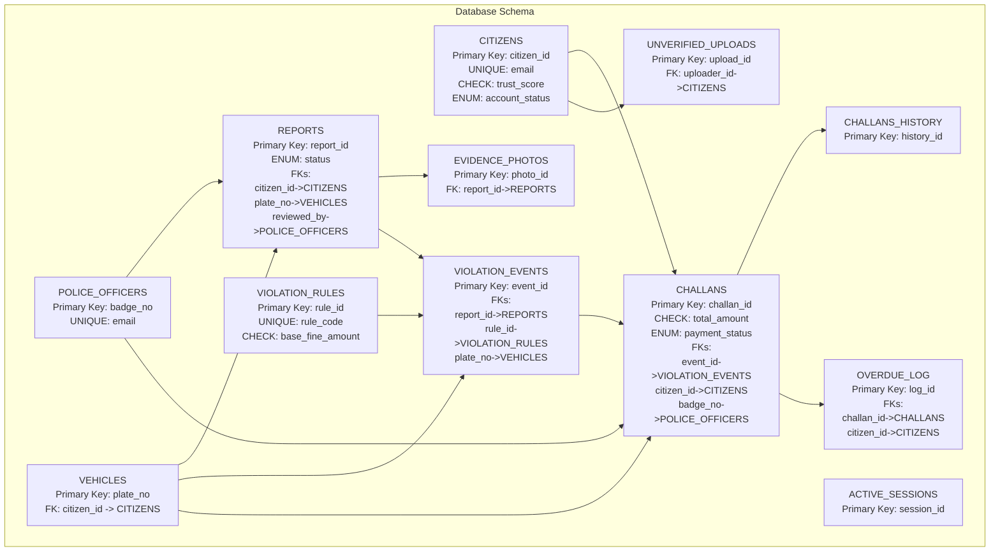
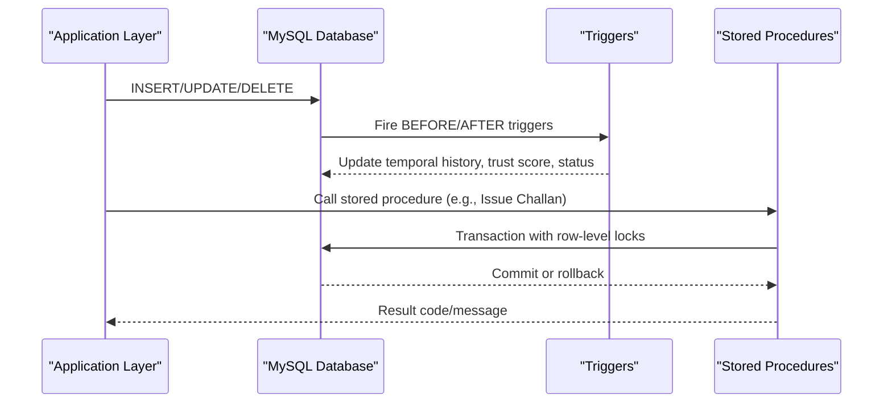
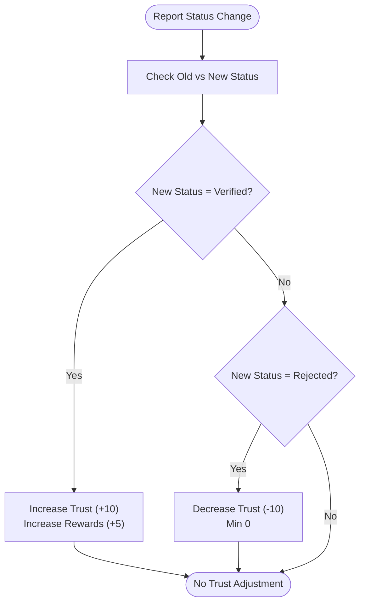
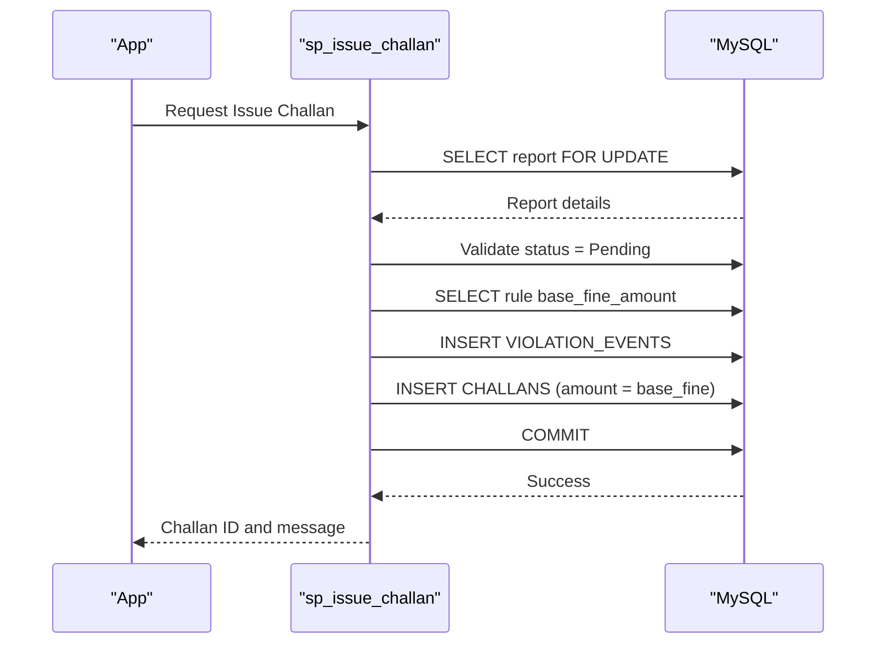
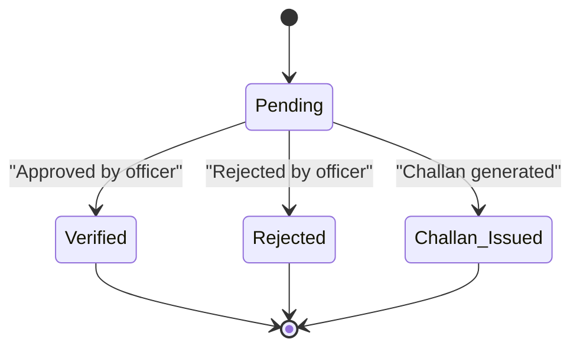
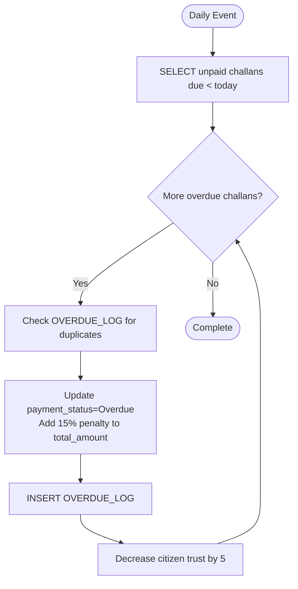
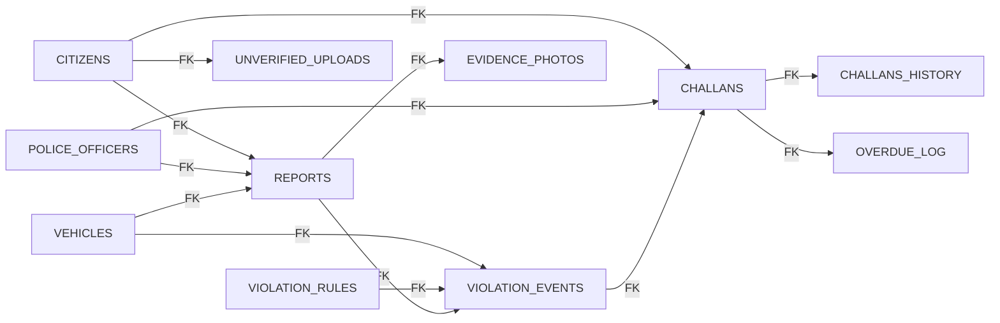

# Constraints and Data Validation

<cite>
**Referenced Files in This Document**
- [schema.sql](file://db/schema.sql)
- [database_triggers.sql](file://db/database_triggers.sql)
- [marga_rakshak_triggers.sql](file://db/marga_rakshak_triggers.sql)
- [stored_procedure_process_report.sql](file://db/stored_procedure_process_report.sql)
- [reports_enhancement.sql](file://db/reports_enhancement.sql)
- [add_vehicle_citizen_link.sql](file://db/add_vehicle_citizen_link.sql)
- [seed_demo_accounts.sql](file://db/seed_demo_accounts.sql)
- [insert_mock_reports.sql](file://db/insert_mock_reports.sql)
- [db.js](file://backend/db.js)
</cite>

## Table of Contents
1. [Introduction](#introduction)
2. [Project Structure](#project-structure)
3. [Core Components](#core-components)
4. [Architecture Overview](#architecture-overview)
5. [Detailed Component Analysis](#detailed-component-analysis)
6. [Dependency Analysis](#dependency-analysis)
7. [Performance Considerations](#performance-considerations)
8. [Troubleshooting Guide](#troubleshooting-guide)
9. [Conclusion](#conclusion)

## Introduction
This document provides a comprehensive analysis of the Traffic Violation Management System’s database constraints, validation rules, and business logic enforcement mechanisms. It covers:
- CHECK constraints and ENUM validations
- Cascading behaviors (ON DELETE CASCADE, SET NULL, RESTRICT)
- Unique constraints, composite keys, and indexing strategies
- Business rules such as trust score limits, fine amount calculations, and status transitions
- Examples of constraint violations and expected outcomes
- The balance between database-level and application-level validation

## Project Structure
The database schema and related scripts define the core entities, constraints, triggers, stored procedures, views, and scheduled events that enforce data integrity and business rules.

**Diagram sources**
- [schema.sql:26-235](file://db/schema.sql#L26-L235)

**Section sources**
- [schema.sql:1-942](file://db/schema.sql#L1-L942)

## Core Components
This section outlines the primary constraints and validations implemented at the database level.

- CITIZENS
  - Primary key: citizen_id
  - Unique constraint: email
  - CHECK constraint: trust_score between 0 and 200
  - ENUM: account_status with values Active, Suspended, Banned
  - Temporal columns: valid_from, valid_to for historical tracking
  - Indexes: idx_citizen_email, idx_citizen_status, idx_citizen_trust

- POLICE_OFFICERS
  - Primary key: badge_no
  - Unique constraint: email
  - Index: idx_police_station

- VEHICLES
  - Primary key: plate_no
  - ENUM: vehicle_type with values Car, Motorcycle, Truck, Bus, Auto-Rickshaw, Bicycle, Other
  - Owner type: ENUM Individual, Corporate, Government
  - Added FK: citizen_id -> CITIZENS (ON DELETE SET NULL)

- VIOLATION_RULES
  - Primary key: rule_id
  - Unique constraint: rule_code
  - CHECK constraint: base_fine_amount > 0
  - ENUM: severity Minor, Moderate, Major, Critical
  - ENUM: violation_time Daytime, Nighttime, Anytime
  - Index: idx_rule_severity

- REPORTS
  - Primary key: report_id
  - ENUM: status with values Pending, Verified, Rejected, Challan Issued
  - Foreign keys:
    - citizen_id -> CITIZENS (ON DELETE CASCADE)
    - plate_no -> VEHICLES (ON DELETE SET NULL)
    - reviewed_by -> POLICE_OFFICERS (ON DELETE SET NULL)
  - Additional columns: violation_type, latitude, longitude, fine_amount
  - Indexes: idx_report_status, idx_report_citizen, idx_report_date, idx_report_violation_type, idx_report_location, idx_report_fine

- EVIDENCE_PHOTOS
  - Primary key: photo_id
  - Foreign key: report_id -> REPORTS (ON DELETE CASCADE)
  - Index: idx_evidence_report

- VIOLATION_EVENTS
  - Primary key: event_id
  - Foreign keys:
    - report_id -> REPORTS (ON DELETE CASCADE)
    - rule_id -> VIOLATION_RULES (ON DELETE RESTRICT)
    - plate_no -> VEHICLES (ON DELETE SET NULL)
  - Indexes: idx_event_report, idx_event_rule

- CHALLANS
  - Primary key: challan_id
  - CHECK constraint: total_amount > 0
  - ENUM: payment_status with values Unpaid, Paid, Overdue, Waived, Disputed
  - Foreign keys:
    - event_id -> VIOLATION_EVENTS (ON DELETE CASCADE)
    - citizen_id -> CITIZENS (ON DELETE CASCADE)
    - badge_no -> POLICE_OFFICERS (ON DELETE RESTRICT)
  - Indexes: idx_challan_status, idx_challan_citizen, idx_challan_due, idx_challan_issued

- CHALLANS_HISTORY
  - Primary key: history_id
  - Temporal audit trail for challan adjustments

- OVERDUE_LOG
  - Primary key: log_id
  - Foreign keys:
    - challan_id -> CHALLANS (ON DELETE CASCADE)
    - citizen_id -> CITIZENS (ON DELETE CASCADE)
  - Index: idx_overdue_challan

- ACTIVE_SESSIONS
  - Primary key: session_id
  - Indexes: idx_session_user, idx_session_expires

- UNVERIFIED_UPLOADS
  - Primary key: upload_id
  - Foreign key: uploader_id -> CITIZENS (ON DELETE CASCADE)
  - Indexes: idx_upload_expires, idx_upload_linked

**Section sources**
- [schema.sql:26-235](file://db/schema.sql#L26-L235)
- [add_vehicle_citizen_link.sql:9-13](file://db/add_vehicle_citizen_link.sql#L9-L13)

## Architecture Overview
The system enforces integrity through a combination of:
- Column-level CHECK constraints and ENUM validations
- Foreign key constraints with explicit ON DELETE behaviors
- Triggers for automatic trust score updates and temporal versioning
- Stored procedures for ACID-compliant business operations
- Scheduled events for overdue processing

**Diagram sources**
- [schema.sql:307-429](file://db/schema.sql#L307-L429)
- [stored_procedure_process_report.sql:8-98](file://db/stored_procedure_process_report.sql#L8-L98)

## Detailed Component Analysis

### Constraint Types and Rationale
- CHECK constraints
  - trust_score: Ensures trust remains within [0, 200], preventing invalid scoring.
  - base_fine_amount: Ensures positive base fine amounts for all violation rules.
  - total_amount: Ensures challans have strictly positive amounts.
- ENUM validations
  - account_status: Limits account states to Active, Suspended, Banned.
  - vehicle_type: Standardizes vehicle categorization.
  - severity/violation_time: Provides controlled vocabulary for classification.
  - payment_status: Standardizes challan lifecycle states.
  - status: Controls report lifecycle states.
- Unique constraints
  - email (CITIZENS): Prevents duplicate identities.
  - email (POLICE_OFFICERS): Prevents badge duplication.
  - rule_code (VIOLATION_RULES): Ensures rule uniqueness.
  - plate_no (VEHICLES): Vehicle identity integrity.
- Composite keys and temporal design
  - CITIZENS_HISTORY and CHALLANS_HISTORY use primary keys and valid_from/valid_to to maintain historical audit trails.

**Section sources**
- [schema.sql:33-108](file://db/schema.sql#L33-L108)
- [schema.sql:178-189](file://db/schema.sql#L178-L189)

### Cascading Behaviors and Referential Integrity
- ON DELETE CASCADE
  - CITIZENS -> REPORTS (citizen_id)
  - CITIZENS -> CHALLANS (citizen_id)
  - REPORTS -> EVIDENCE_PHOTOS (report_id)
  - REPORTS -> VIOLATION_EVENTS (report_id)
  - CHALLANS -> CHALLANS_HISTORY (challan_id)
  - CHALLANS -> OVERDUE_LOG (challan_id)
  - CITIZENS -> UNVERIFIED_UPLOADS (uploader_id)
  - Rationale: Deleting a citizen removes all associated records to prevent orphaned data.
- ON DELETE SET NULL
  - REPORTS -> VEHICLES (plate_no) via plate_no foreign key
  - REPORTS -> POLICE_OFFICERS (reviewed_by) via reviewed_by foreign key
  - VIOLATION_EVENTS -> VEHICLES (plate_no)
  - Rationale: Allows deletion of referenced entities while preserving parent records; nullability maintains referential integrity.
- ON DELETE RESTRICT
  - VIOLATION_EVENTS -> VIOLATION_RULES (rule_id)
  - CHALLANS -> POLICE_OFFICERS (badge_no)
  - Rationale: Prevents accidental removal of rules/officers that are still referenced, maintaining business rule consistency.

**Section sources**
- [schema.sql:130-132](file://db/schema.sql#L130-L132)
- [schema.sql:162-164](file://db/schema.sql#L162-L164)
- [schema.sql:188-190](file://db/schema.sql#L188-L190)
- [schema.sql:232-233](file://db/schema.sql#L232-L233)

### Business Rules Enforcement

#### Trust Score Management
- Database-level checks
  - CITIZENS trust_score constrained to [0, 200].
- Triggers
  - After report verification: increase trust score and reward points.
  - After report rejection: decrease trust score (not below 0).
  - Before update on CITIZENS: auto-suspend when trust reaches zero.
  - Before update on CHALLANS: capture historical rows for auditing.

**Diagram sources**
- [schema.sql:364-382](file://db/schema.sql#L364-L382)
- [schema.sql:311-335](file://db/schema.sql#L311-L335)

**Section sources**
- [schema.sql:33-35](file://db/schema.sql#L33-L35)
- [schema.sql:364-382](file://db/schema.sql#L364-L382)
- [schema.sql:311-335](file://db/schema.sql#L311-L335)

#### Fine Amount Calculations
- Base fine amount sourced from VIOLATION_RULES (positive CHECK).
- Stored procedures enforce:
  - Report existence and Pending status before issuance.
  - Positive fine amount and valid rule selection.
  - Optional vehicle creation if missing.
  - Atomicity via transactions and row-level locks.

**Diagram sources**
- [schema.sql:440-546](file://db/schema.sql#L440-L546)

**Section sources**
- [schema.sql](file://db/schema.sql#L105)
- [schema.sql:440-546](file://db/schema.sql#L440-L546)

#### Status Transitions
- REPORTS status transitions are controlled by triggers and stored procedures:
  - Verified increases trust and rewards.
  - Rejected decreases trust.
  - Challan Issued status added via enhancement script.

**Diagram sources**
- [reports_enhancement.sql:34-37](file://db/reports_enhancement.sql#L34-L37)
- [schema.sql:364-382](file://db/schema.sql#L364-L382)

**Section sources**
- [reports_enhancement.sql:34-37](file://db/reports_enhancement.sql#L34-L37)
- [schema.sql:364-382](file://db/schema.sql#L364-L382)

#### Overdue Processing
- Scheduled event invokes a stored procedure to:
  - Flag unpaid challans past due date.
  - Apply 15% late penalty.
  - Log entries in OVERDUE_LOG.
  - Decrease citizen trust score.

**Diagram sources**
- [schema.sql:689-754](file://db/schema.sql#L689-L754)

**Section sources**
- [schema.sql:689-754](file://db/schema.sql#L689-L754)

### Validation Logic Examples and Expected Outcomes
- CHECK constraint violations
  - Attempting to insert/update CITIZENS with trust_score < 0 or > 200 will fail with a constraint error.
  - Inserting CHALLANS with total_amount ≤ 0 will fail with a constraint error.
  - Inserting VIOLATION_RULES with base_fine_amount ≤ 0 will fail with a constraint error.
- ENUM validation failures
  - Setting REPORTS.status to an unsupported value will fail with an ENUM error.
  - Setting CITIZENS.account_status to an unsupported value will fail with an ENUM error.
- Foreign key violations
  - Inserting REPORTS with a non-existent citizen_id will fail with a foreign key error.
  - Inserting CHALLANS with a non-existent badge_no will fail with a foreign key error.
  - Deleting a VIOLATION_RULES row referenced by VIOLATION_EVENTS will fail with a RESTRICT error.
- Cascading effects
  - Deleting a CITIZENS record deletes all associated REPORTS, CHALLANS, and UNVERIFIED_UPLOADS.
  - Deleting a POLICE_OFFICERS record sets reviewed_by to NULL in REPORTS and prevents CHALLANS creation.
- Application-level validation
  - Backend connection pool configuration ensures reliable connectivity.
  - Stored procedures provide ACID guarantees and explicit error signaling.

**Section sources**
- [schema.sql:33-108](file://db/schema.sql#L33-L108)
- [schema.sql:130-132](file://db/schema.sql#L130-L132)
- [schema.sql:162-164](file://db/schema.sql#L162-L164)
- [schema.sql:188-190](file://db/schema.sql#L188-L190)
- [schema.sql:232-233](file://db/schema.sql#L232-L233)
- [db.js:3-13](file://backend/db.js#L3-L13)

## Dependency Analysis
The following diagram shows key dependencies among tables and constraints:

**Diagram sources**
- [schema.sql:116-235](file://db/schema.sql#L116-L235)

**Section sources**
- [schema.sql:116-235](file://db/schema.sql#L116-L235)

## Performance Considerations
- Indexes
  - CITIZENS: idx_citizen_email, idx_citizen_status, idx_citizen_trust
  - POLICE_OFFICERS: idx_police_station
  - VEHICLES: idx_vehicle_type
  - REPORTS: idx_report_status, idx_report_citizen, idx_report_date, idx_report_violation_type, idx_report_location, idx_report_fine
  - EVIDENCE_PHOTOS: idx_evidence_report
  - VIOLATION_EVENTS: idx_event_report, idx_event_rule
  - CHALLANS: idx_challan_status, idx_challan_citizen, idx_challan_due, idx_challan_issued
  - CHALLANS_HISTORY: idx_chh_challan, idx_chh_period
  - OVERDUE_LOG: idx_overdue_challan
  - ACTIVE_SESSIONS: idx_session_user, idx_session_expires
  - UNVERIFIED_UPLOADS: idx_upload_expires, idx_upload_linked
- Temporal tables
  - CITIZENS_HISTORY and CHALLANS_HISTORY enable efficient historical queries without scanning live data.
- Scheduled events
  - Auto-purge of expired sessions and unverified uploads reduces storage overhead.
- Stored procedures
  - Row-level locks and transactions minimize contention and ensure consistency.

[No sources needed since this section provides general guidance]

## Troubleshooting Guide
- Constraint violations
  - CHECK constraint failures indicate invalid values (e.g., negative amounts, out-of-range trust scores).
  - ENUM errors occur when inserting unsupported values.
  - Foreign key errors indicate missing or invalid references.
- Cascading behavior issues
  - Unexpected deletions may stem from CASCADE rules; verify referential integrity before deleting.
  - SET NULL scenarios require nullability checks in parent records.
- Trigger-related anomalies
  - Trust score changes should be audited via CITIZENS_HISTORY.
  - Ensure triggers fire only on intended status changes.
- Stored procedure errors
  - Use provided result codes and messages to diagnose failures.
  - Verify transaction rollbacks on exceptions.
- Demo data and migrations
  - Seed scripts populate test accounts and sample data for validation.
  - Vehicle-citizen link migration adds FK and verifies constraints.

**Section sources**
- [schema.sql:307-429](file://db/schema.sql#L307-L429)
- [stored_procedure_process_report.sql:8-98](file://db/stored_procedure_process_report.sql#L8-L98)
- [seed_demo_accounts.sql:13-107](file://db/seed_demo_accounts.sql#L13-L107)
- [add_vehicle_citizen_link.sql:9-13](file://db/add_vehicle_citizen_link.sql#L9-L13)

## Conclusion
The Traffic Violation Management System enforces robust data integrity through a layered approach:
- Database-level CHECK constraints and ENUM validations prevent invalid data entry.
- Foreign key constraints with explicit ON DELETE behaviors maintain referential integrity.
- Triggers automate trust score management and temporal versioning.
- Stored procedures encapsulate complex business logic with ACID guarantees.
- Scheduled events and indexes optimize operational performance and data hygiene.

This design balances strong database-level enforcement with application-level validation, ensuring system integrity, auditability, and scalability.