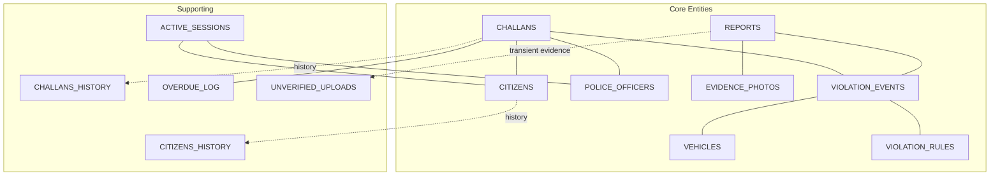
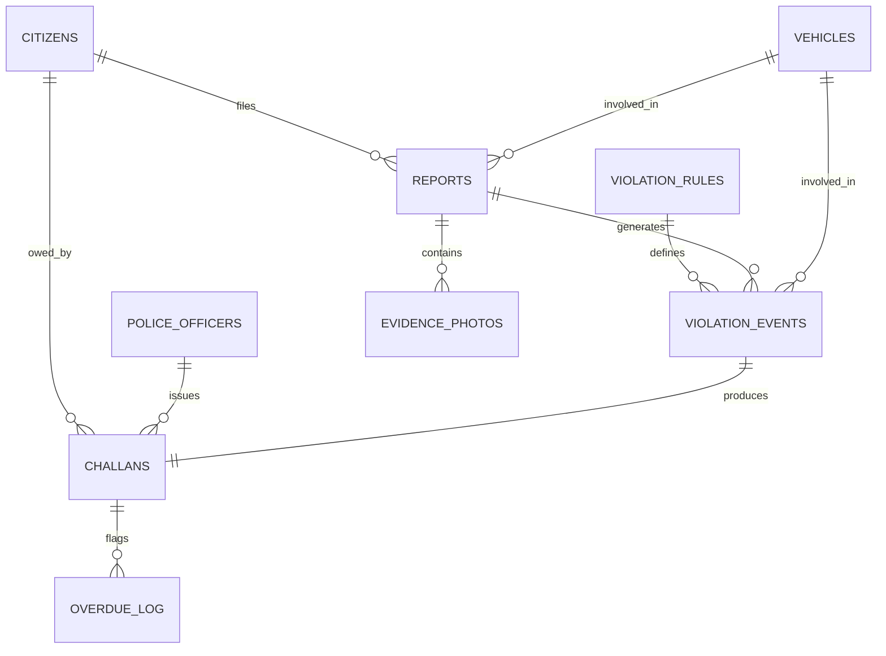
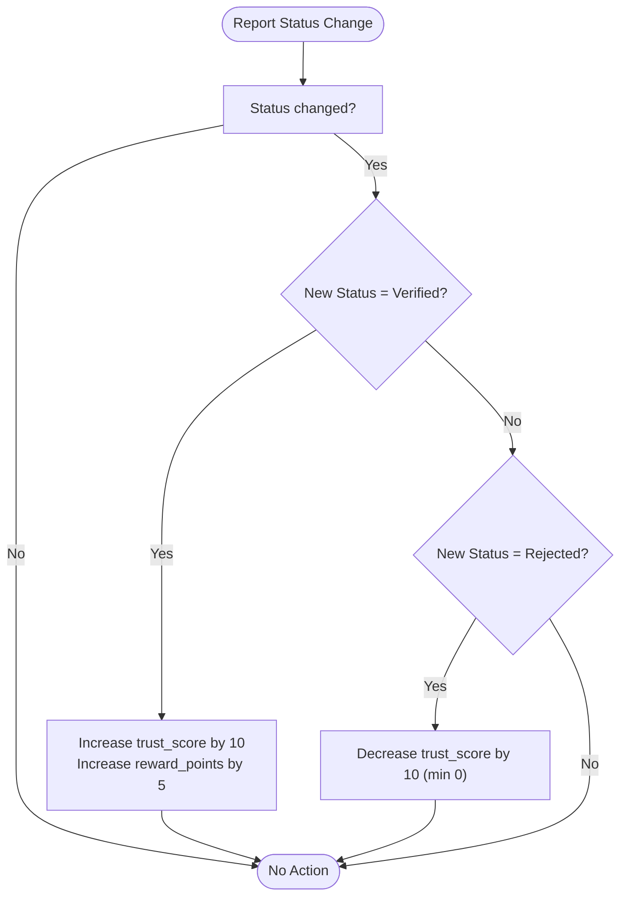
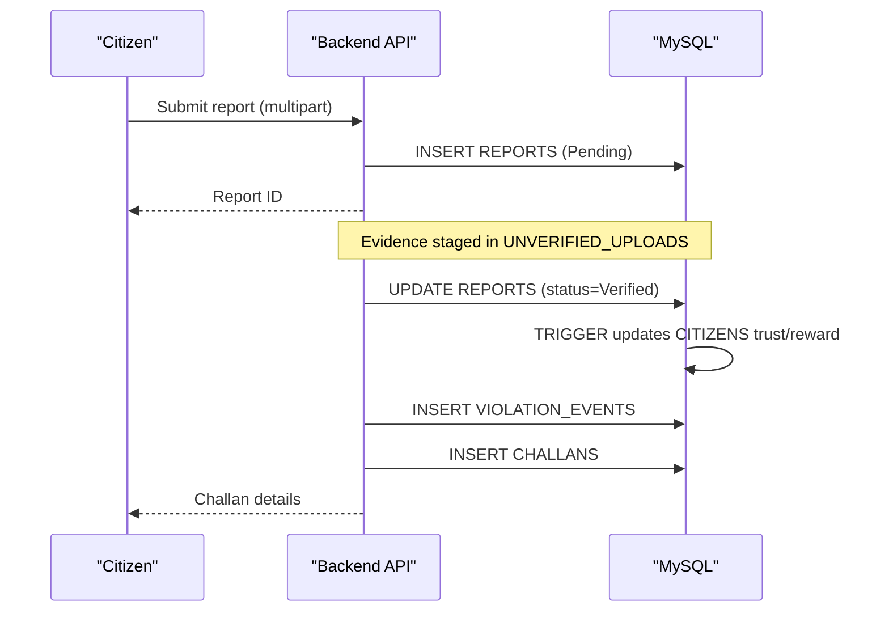
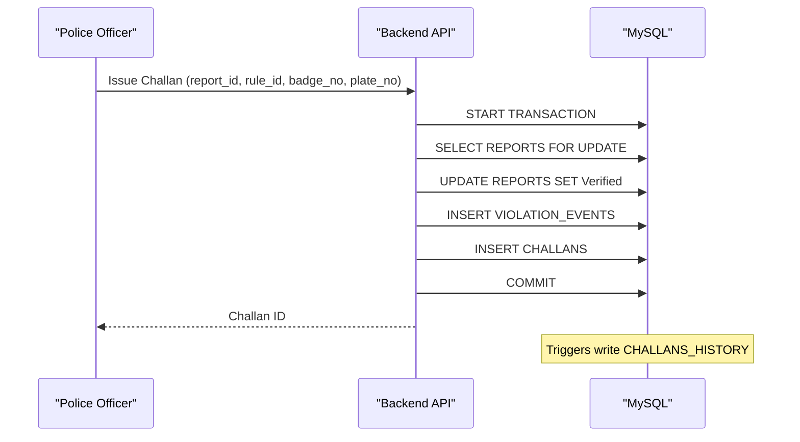
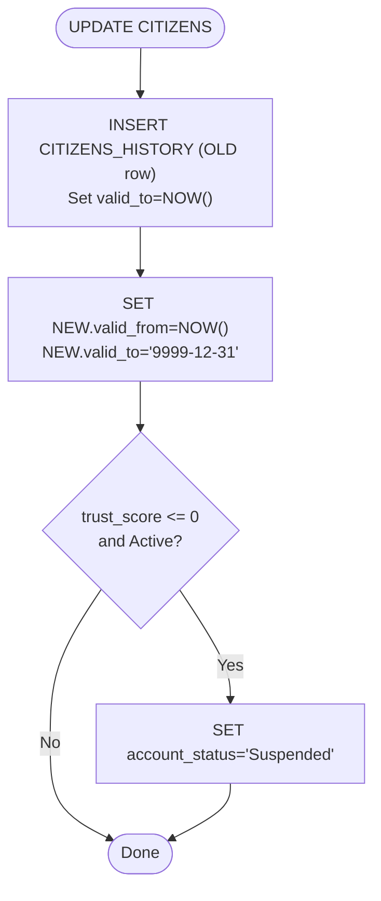
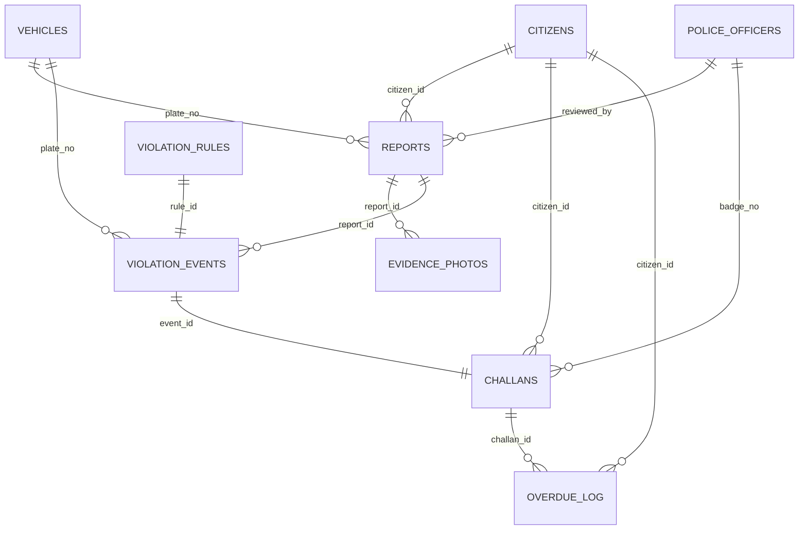

# Core Schema Design

<cite>
**Referenced Files in This Document**
- [schema.sql](file://db/schema.sql)
- [reports_enhancement.sql](file://db/reports_enhancement.sql)
- [add_vehicle_citizen_link.sql](file://db/add_vehicle_citizen_link.sql)
- [add_evidence_path_column.sql](file://db/add_evidence_path_column.sql)
- [stored_procedure_process_report.sql](file://db/stored_procedure_process_report.sql)
- [seed_demo_accounts.sql](file://db/seed_demo_accounts.sql)
- [README.md](file://README.md)
</cite>

## Table of Contents
1. [Introduction](#introduction)
2. [Project Structure](#project-structure)
3. [Core Components](#core-components)
4. [Architecture Overview](#architecture-overview)
5. [Detailed Component Analysis](#detailed-component-analysis)
6. [Dependency Analysis](#dependency-analysis)
7. [Performance Considerations](#performance-considerations)
8. [Troubleshooting Guide](#troubleshooting-guide)
9. [Conclusion](#conclusion)
10. [Appendices](#appendices)

## Introduction
This document provides comprehensive data model documentation for the Traffic Violation Management System’s core 5NF normalized schema. It details the 16-table structure, normalization rationale, business rules, primary and foreign keys, indexes, constraints, temporal versioning, and operational logic. It also documents the temporal table implementation with valid_from/valid_to columns, referential integrity, and the stored procedures and triggers that enforce business policies.

## Project Structure
The database schema is defined in a single comprehensive SQL script and augmented by several enhancement and migration scripts. The schema supports:
- Core entity tables (CITIZENS, POLICE_OFFICERS, VEHICLES, VIOLATION_RULES, REPORTS, EVIDENCE_PHOTOS, VIOLATION_EVENTS, CHALLANS)
- Supporting history tables (CITIZENS_HISTORY, CHALLANS_HISTORY)
- Ledger table (OVERDUE_LOG)
- Transient tables (ACTIVE_SESSIONS, UNVERIFIED_UPLOADS)
- Triggers, stored procedures, events, and views

**Diagram sources**
- [schema.sql:26-235](file://db/schema.sql#L26-L235)

**Section sources**
- [schema.sql:10-111](file://db/schema.sql#L10-L111)
- [README.md:48-93](file://README.md#L48-L93)

## Core Components
This section documents each of the 16 core tables, their fields, data types, constraints, and business significance.

- CITIZENS
  - Purpose: Primary civilian user accounts with biometric face encoding and trust scoring.
  - Keys: citizen_id (PK)
  - Constraints: UNIQUE(email), CHECK(trust_score in [0..200]), DEFAULTS for trust_score and reward_points.
  - Indexes: idx_citizen_email, idx_citizen_status, idx_citizen_trust.
  - Temporal: valid_from/valid_to for historical tracking; triggers manage history and suspension on zero trust.
  - Business rules: Trust score increases on verified reports, decreases on rejected reports; auto-suspension at zero trust.

- CITIZENS_HISTORY
  - Purpose: Audit trail for CITIZENS mutations with operation_type and changed_by.
  - Keys: history_id (PK), citizen_id (FK).
  - Indexes: idx_ch_citizen, idx_ch_period.

- POLICE_OFFICERS
  - Purpose: Law enforcement personnel with badge_no as PK.
  - Keys: badge_no (PK)
  - Constraints: UNIQUE(email), DEFAULT(is_active=true).
  - Indexes: idx_police_station.

- VEHICLES
  - Purpose: Vehicle registry linked to violation events and optionally to owners.
  - Keys: plate_no (PK)
  - Constraints: vehicle_type ENUM, owner_type ENUM.
  - Indexes: idx_vehicle_type.
  - Enhancement: Added citizen_id FK to link to CITIZENS (migration script).

- VIOLATION_RULES
  - Purpose: Master catalog of traffic violation categories with base fines and severity.
  - Keys: rule_id (PK)
  - Constraints: UNIQUE(rule_code), CHECK(base_fine_amount > 0), DEFAULT(is_active=true).
  - Indexes: idx_rule_severity.

- REPORTS
  - Purpose: Violation reports filed by citizens; enhanced with violation_type, GPS coordinates, fine_amount, and status lifecycle.
  - Keys: report_id (PK)
  - Constraints: status ENUM extended to include 'Challan Issued'; violation_type, latitude/longitude, fine_amount added.
  - Indexes: idx_report_status, idx_report_citizen, idx_report_date, idx_report_violation_type, idx_report_location, idx_report_fine.
  - Enhancements: reviewed_by mapped to badge_no; evidence_path added for direct linking.

- EVIDENCE_PHOTOS
  - Purpose: Photographic evidence attached to reports.
  - Keys: photo_id (PK)
  - Constraints: image_url NOT NULL; FK to REPORTS.

- VIOLATION_EVENTS
  - Purpose: Junction table linking REPORTS to VIOLATION_RULES and optional VEHICLE; captures event metadata.
  - Keys: event_id (PK)
  - Constraints: FKs to REPORTS, VIOLATION_RULES, VEHICLES; restrict on rule deletion.

- CHALLANS
  - Purpose: Traffic fines/penalties issued; includes temporal columns for adjustments.
  - Keys: challan_id (PK)
  - Constraints: CHECK(total_amount > 0); payment_status ENUM; valid_from/valid_to for history.
  - Indexes: idx_challan_status, idx_challan_citizen, idx_challan_due, idx_challan_issued.
  - FKs: to VIOLATION_EVENTS, CITIZENS, POLICE_OFFICERS.

- CHALLANS_HISTORY
  - Purpose: Audit trail for CHALLANS adjustments with operation_type and changed_by.
  - Keys: history_id (PK), challan_id (FK).
  - Indexes: idx_chh_challan, idx_chh_period.

- OVERDUE_LOG
  - Purpose: Ledger for flagged overdue challans with penalties and notes.
  - Keys: log_id (PK)
  - Constraints: FKs to CHALLANS and CITIZENS.

- ACTIVE_SESSIONS
  - Purpose: Short-lived login sessions with auto-purge eligibility.
  - Keys: session_id (PK)
  - Indexes: idx_session_user, idx_session_expires.

- UNVERIFIED_UPLOADS
  - Purpose: Staging area for evidence before report linkage.
  - Keys: upload_id (PK)
  - Indexes: idx_upload_expires, idx_upload_linked.

**Section sources**
- [schema.sql:26-235](file://db/schema.sql#L26-L235)
- [reports_enhancement.sql:14-47](file://db/reports_enhancement.sql#L14-L47)
- [add_vehicle_citizen_link.sql:9-37](file://db/add_vehicle_citizen_link.sql#L9-L37)
- [add_evidence_path_column.sql:8-23](file://db/add_evidence_path_column.sql#L8-L23)

## Architecture Overview
The schema enforces 5NF normalization by eliminating join dependencies and ensuring each table represents a single subject with atomic attributes. Business rules are enforced through:
- Foreign keys for referential integrity
- Triggers for trust score automation and temporal versioning
- Stored procedures for ACID-compliant operations (issuance, payment, rejection, overdue flagging)
- Events for auto-purge of transient data
- Views for dashboards

**Diagram sources**
- [schema.sql:116-235](file://db/schema.sql#L116-L235)

**Section sources**
- [schema.sql:100-111](file://db/schema.sql#L100-L111)
- [README.md:346-362](file://README.md#L346-L362)

## Detailed Component Analysis

### CITIZENS
- Primary key: citizen_id
- Notable constraints: UNIQUE(email), CHECK(trust_score in [0..200])
- Temporal: valid_from/valid_to; triggers write history rows and auto-suspend at zero trust
- Business logic: Trust score adjusted by triggers on REPORTS status changes; reward_points incremented on verified reports

**Diagram sources**
- [schema.sql:364-382](file://db/schema.sql#L364-L382)

**Section sources**
- [schema.sql:26-43](file://db/schema.sql#L26-L43)
- [schema.sql:307-382](file://db/schema.sql#L307-L382)

### REPORTS
- Enhanced columns: violation_type, latitude, longitude, fine_amount, evidence_path
- Status lifecycle: Pending → Verified/Rejected/Challan Issued
- Indexes optimized for dashboard and filtering

**Diagram sources**
- [reports_enhancement.sql:14-47](file://db/reports_enhancement.sql#L14-L47)
- [schema.sql:440-546](file://db/schema.sql#L440-L546)

**Section sources**
- [reports_enhancement.sql:14-47](file://db/reports_enhancement.sql#L14-L47)
- [schema.sql:116-136](file://db/schema.sql#L116-L136)

### CHALLANS and Overdue Processing
- ACID-compliant issuance via stored procedure
- Row-level locking in payment procedure prevents race conditions
- Overdue flagging via cursor-based procedure applies penalties and updates trust

**Diagram sources**
- [schema.sql:440-546](file://db/schema.sql#L440-L546)
- [stored_procedure_process_report.sql:8-98](file://db/stored_procedure_process_report.sql#L8-L98)

**Section sources**
- [schema.sql:173-195](file://db/schema.sql#L173-L195)
- [schema.sql:549-629](file://db/schema.sql#L549-L629)
- [schema.sql:689-754](file://db/schema.sql#L689-L754)

### Temporal Tables and Historical Tracking
- CITIZENS and CHALLANS maintain valid_from/valid_to for historical tracking
- Triggers automatically write history rows on updates and inserts
- History tables preserve operation_type and changed_by for auditability

**Diagram sources**
- [schema.sql:311-336](file://db/schema.sql#L311-L336)
- [schema.sql:341-356](file://db/schema.sql#L341-L356)
- [schema.sql:387-429](file://db/schema.sql#L387-L429)

**Section sources**
- [schema.sql:49-65](file://db/schema.sql#L49-L65)
- [schema.sql:200-219](file://db/schema.sql#L200-L219)
- [schema.sql:307-429](file://db/schema.sql#L307-L429)

### Supporting Tables and Migrations
- VEHICLES: Added citizen_id FK to link owners for challan routing
- REPORTS: Added evidence_path for direct linking and enhanced status ENUM
- Demo seeding: Inserts 1 police officer and 3 citizens for testing

**Section sources**
- [add_vehicle_citizen_link.sql:9-37](file://db/add_vehicle_citizen_link.sql#L9-L37)
- [add_evidence_path_column.sql:8-23](file://db/add_evidence_path_column.sql#L8-L23)
- [seed_demo_accounts.sql:13-107](file://db/seed_demo_accounts.sql#L13-L107)

## Dependency Analysis
Foreign keys define the core relationships among entities. The following diagram highlights referential integrity:

**Diagram sources**
- [schema.sql:116-235](file://db/schema.sql#L116-L235)

**Section sources**
- [schema.sql:130-132](file://db/schema.sql#L130-L132)
- [schema.sql:162-164](file://db/schema.sql#L162-L164)
- [schema.sql:188-190](file://db/schema.sql#L188-L190)
- [schema.sql:232-234](file://db/schema.sql#L232-L234)

## Performance Considerations
- Indexes on frequently filtered/sorted columns (status, dates, coordinates) improve query performance.
- ENUMs reduce storage and improve comparisons for categorical data.
- Triggers and stored procedures encapsulate business logic and ensure consistency at the DB level.
- Temporal tables increase write overhead but enable auditability and historical reporting.
- Events automate cleanup of transient data to prevent bloat.

[No sources needed since this section provides general guidance]

## Troubleshooting Guide
- Reports status lifecycle: Ensure status transitions follow Pending → Verified/Rejected/Challan Issued; verify triggers fire for trust adjustments.
- Challan issuance: Use stored procedure to guarantee ACID semantics; confirm foreign keys and vehicle existence.
- Payment processing: Use row-level locking to avoid race conditions; verify payment_status checks.
- Overdue flagging: Confirm cursor-based procedure runs and updates both CHALLANS and OVERDUE_LOG.
- Temporal history: Validate CITIZENS_HISTORY and CHALLANS_HISTORY entries after updates.

**Section sources**
- [schema.sql:440-546](file://db/schema.sql#L440-L546)
- [schema.sql:549-629](file://db/schema.sql#L549-L629)
- [schema.sql:689-754](file://db/schema.sql#L689-L754)
- [schema.sql:307-429](file://db/schema.sql#L307-L429)

## Conclusion
The Traffic Violation Management System employs a 5NF normalized schema with robust referential integrity, temporal versioning, and procedural safeguards. The design balances data integrity, auditability, and operational efficiency, supported by triggers, stored procedures, events, and views tailored to citizen and police workflows.

[No sources needed since this section summarizes without analyzing specific files]

## Appendices

### Sample Data Structures
- CITIZENS: minimal fields for identity and trust scoring; includes biometric face encoding placeholder
- POLICE_OFFICERS: badge_no as PK; includes rank and station assignment
- VEHICLES: plate_no as PK; includes ownership and type metadata
- VIOLATION_RULES: rule_id PK; includes base fine and severity
- REPORTS: enhanced with violation_type, GPS coordinates, fine_amount, and evidence_path
- EVIDENCE_PHOTOS: FK to REPORTS; stores image URLs and captions
- VIOLATION_EVENTS: junction linking reports to rules and vehicles
- CHALLANS: includes payment lifecycle and temporal validity
- Supporting tables: HISTORY tables for audit, OVERDUE_LOG for penalties, ACTIVE_SESSIONS and UNVERIFIED_UPLOADS for transient data

**Section sources**
- [schema.sql:26-235](file://db/schema.sql#L26-L235)
- [reports_enhancement.sql:53-285](file://db/reports_enhancement.sql#L53-L285)
- [seed_demo_accounts.sql:13-107](file://db/seed_demo_accounts.sql#L13-L107)