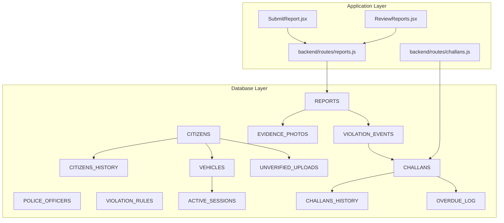
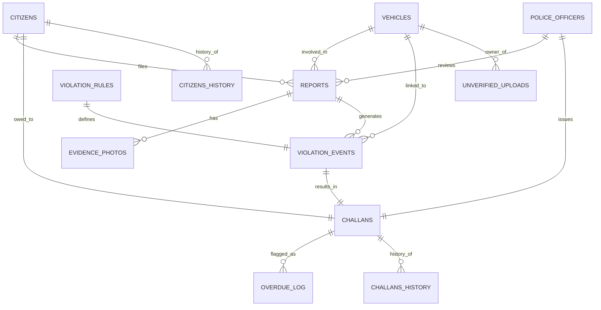
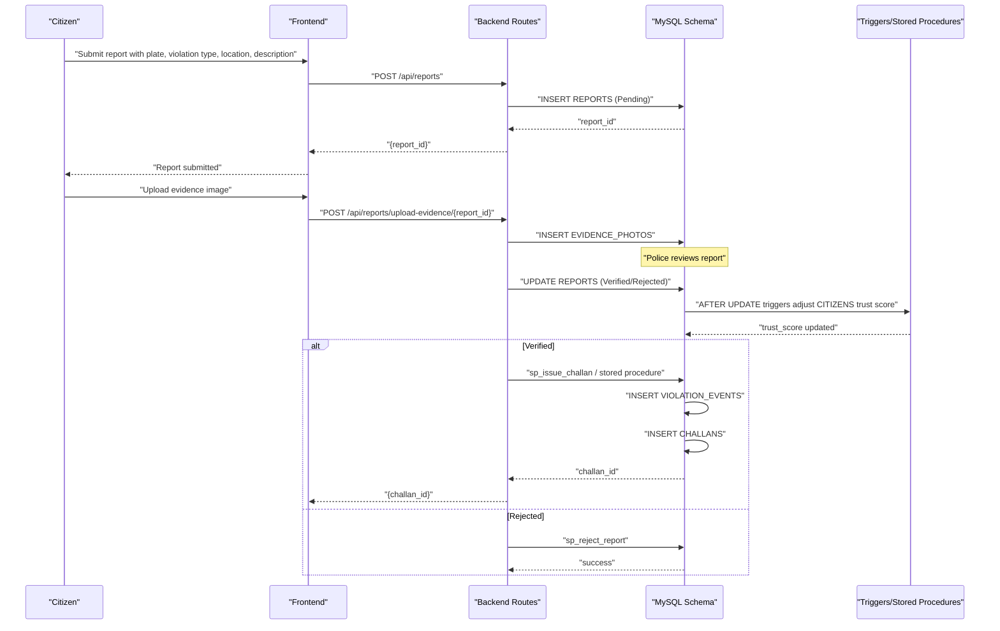
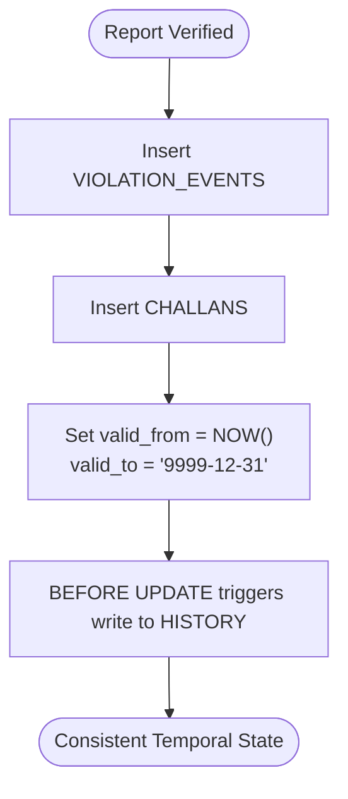
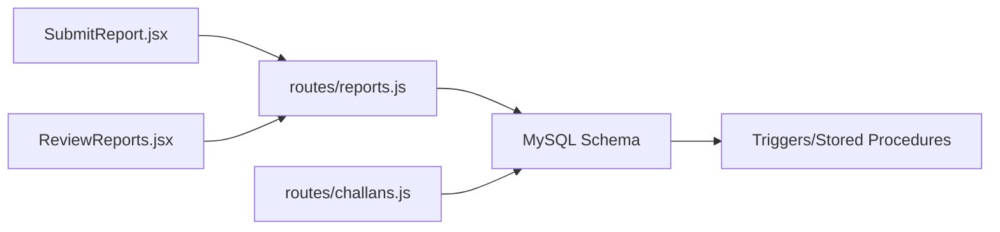

# Entity Relationship Mapping

<cite>
**Referenced Files in This Document**
- [schema.sql](file://db/schema.sql)
- [reports_enhancement.sql](file://db/reports_enhancement.sql)
- [add_vehicle_citizen_link.sql](file://db/add_vehicle_citizen_link.sql)
- [stored_procedure_process_report.sql](file://db/stored_procedure_process_report.sql)
- [database_triggers.sql](file://db/database_triggers.sql)
- [marga_rakshak_triggers.sql](file://db/marga_rakshak_triggers.sql)
- [seed_demo_accounts.sql](file://db/seed_demo_accounts.sql)
- [insert_mock_reports.sql](file://db/insert_mock_reports.sql)
- [SubmitReport.jsx](file://frontend/src/pages/SubmitReport.jsx)
- [ReviewReports.jsx](file://frontend/src/pages/ReviewReports.jsx)
- [reports.js](file://backend/routes/reports.js)
- [challans.js](file://backend/routes/challans.js)
</cite>

## Table of Contents
1. [Introduction](#introduction)
2. [Project Structure](#project-structure)
3. [Core Components](#core-components)
4. [Architecture Overview](#architecture-overview)
5. [Detailed Component Analysis](#detailed-component-analysis)
6. [Dependency Analysis](#dependency-analysis)
7. [Performance Considerations](#performance-considerations)
8. [Troubleshooting Guide](#troubleshooting-guide)
9. [Conclusion](#conclusion)
10. [Appendices](#appendices)

## Introduction
This document provides a comprehensive Entity Relationship (ER) mapping for the Traffic Violation Management System. It documents all 16 tables, their attributes, foreign key relationships, cardinalities, referential integrity constraints, and cascade behaviors. It also explains the end-to-end business workflow from report filing by citizens to challan issuance by police officers, including temporal modeling, triggers, stored procedures, and views. Finally, it includes examples of complex queries that join multiple tables and demonstrates the benefits of normalization.

## Project Structure
The system’s database schema is defined in a single production-grade SQL script with supporting enhancement and migration scripts. Frontend and backend components integrate with the database via HTTP APIs and React pages.

**Diagram sources**
- [schema.sql:26-95](file://db/schema.sql#L26-L95)
- [schema.sql:116-195](file://db/schema.sql#L116-L195)
- [schema.sql:245-274](file://db/schema.sql#L245-L274)
- [SubmitReport.jsx:110-156](file://frontend/src/pages/SubmitReport.jsx#L110-L156)
- [ReviewReports.jsx:37-61](file://frontend/src/pages/ReviewReports.jsx#L37-L61)
- [reports.js:8-31](file://backend/routes/reports.js#L8-L31)
- [challans.js:7-29](file://backend/routes/challans.js#L7-L29)

**Section sources**
- [schema.sql:1-942](file://db/schema.sql#L1-L942)
- [reports_enhancement.sql:1-302](file://db/reports_enhancement.sql#L1-L302)
- [add_vehicle_citizen_link.sql:1-38](file://db/add_vehicle_citizen_link.sql#L1-L38)
- [stored_procedure_process_report.sql:1-115](file://db/stored_procedure_process_report.sql#L1-L115)
- [database_triggers.sql:1-48](file://db/database_triggers.sql#L1-L48)
- [marga_rakshak_triggers.sql:1-78](file://db/marga_rakshak_triggers.sql#L1-L78)
- [seed_demo_accounts.sql:1-175](file://db/seed_demo_accounts.sql#L1-L175)
- [insert_mock_reports.sql:1-22](file://db/insert_mock_reports.sql#L1-L22)
- [SubmitReport.jsx:1-344](file://frontend/src/pages/SubmitReport.jsx#L1-L344)
- [ReviewReports.jsx:1-256](file://frontend/src/pages/ReviewReports.jsx#L1-L256)
- [reports.js:1-54](file://backend/routes/reports.js#L1-L54)
- [challans.js:1-101](file://backend/routes/challans.js#L1-L101)

## Core Components
Below are the 16 tables and their primary roles in the system:

- CITIZENS: Civilian users with trust scoring and temporal validity.
- CITIZENS_HISTORY: Audit trail for trust and profile changes.
- POLICE_OFFICERS: Law enforcement actors with station and rank metadata.
- VEHICLES: Vehicle registry with optional owner linkage.
- VIOLATION_RULES: Master catalog of violations with severity and base fines.
- REPORTS: Citations filed by citizens; includes status lifecycle and geolocation.
- EVIDENCE_PHOTOS: Attachments linked to reports.
- VIOLATION_EVENTS: Junction linking reports to specific rules and optionally vehicles.
- CHALLANS: Penalty notices with payment lifecycle and temporal validity.
- CHALLANS_HISTORY: Audit trail for challan changes.
- OVERDUE_LOG: Ledger for overdue challans and penalties.
- ACTIVE_SESSIONS: Temporary session storage for authentication.
- UNVERIFIED_UPLOADS: Staging area for evidence files.
- Views: Pending_Reports_Dashboard, Citizen_Challan_Summary, Officer_Performance_View, Citizen_Trust_History.

**Section sources**
- [schema.sql:26-95](file://db/schema.sql#L26-L95)
- [schema.sql:116-195](file://db/schema.sql#L116-L195)
- [schema.sql:245-274](file://db/schema.sql#L245-L274)
- [schema.sql:764-840](file://db/schema.sql#L764-L840)

## Architecture Overview
The system follows a normalized 5NF design with explicit temporal modeling and referential integrity enforced by foreign keys and cascading rules. Business workflows are supported by triggers and stored procedures to maintain data consistency and enforce policies (e.g., trust scoring, overdue handling).

**Diagram sources**
- [schema.sql:26-95](file://db/schema.sql#L26-L95)
- [schema.sql:116-195](file://db/schema.sql#L116-L195)

## Detailed Component Analysis

### ER Diagram with Foreign Keys, Cardinalities, and Cascade Behaviors
- CITIZENS (PK: citizen_id)
  - REPORTS.citizen_id: 1–1 with CASCADE DELETE
  - VEHICLES.citizen_id: 1–1 with SET NULL
  - CHALLANS.citizen_id: 1–1 with CASCADE DELETE
- POLICE_OFFICERS (PK: badge_no)
  - REPORTS.reviewed_by: 1–1 with SET NULL
  - CHALLANS.badge_no: 1–1 with RESTRICT
- VEHICLES (PK: plate_no)
  - REPORTS.plate_no: 1–1 with SET NULL
  - VIOLATION_EVENTS.plate_no: 1–1 with SET NULL
  - VEHICLES.citizen_id: 1–1 with SET NULL
- VIOLATION_RULES (PK: rule_id)
  - VIOLATION_EVENTS.rule_id: 1–1 with RESTRICT
- REPORTS (PK: report_id)
  - EVIDENCE_PHOTOS.report_id: 1–many with CASCADE DELETE
  - VIOLATION_EVENTS.report_id: 1–many with CASCADE DELETE
- VIOLATION_EVENTS (PK: event_id)
  - CHALLANS.event_id: 1–1 with CASCADE DELETE
- CHALLANS (PK: challan_id)
  - CHALLANS_HISTORY.challan_id: 1–many with CASCADE DELETE
  - OVERDUE_LOG.challan_id: 1–1 with CASCADE DELETE
- CITIZENS_HISTORY: Historical snapshot of CITIZENS
- CHALLANS_HISTORY: Historical snapshot of CHALLANS
- UNVERIFIED_UPLOADS: Staging for uploads linked to CITIZENS

Cascade behaviors summary:
- CASCADE DELETE: CITIZENS → REPORTS, REPORTS → EVIDENCE_PHOTOS, REPORTS → VIOLATION_EVENTS, VIOLATION_EVENTS → CHALLANS
- SET NULL: REPORTS.plate_no, REPORTS.reviewed_by, VIOLATION_EVENTS.plate_no, VEHICLES.citizen_id
- RESTRICT: CHALLANS.badge_no (officer cannot be deleted while having challans)

**Section sources**
- [schema.sql:130-132](file://db/schema.sql#L130-L132)
- [schema.sql](file://db/schema.sql#L147)
- [schema.sql:162-164](file://db/schema.sql#L162-L164)
- [schema.sql:188-190](file://db/schema.sql#L188-L190)
- [schema.sql:232-233](file://db/schema.sql#L232-L233)
- [schema.sql:311-336](file://db/schema.sql#L311-L336)
- [schema.sql:387-429](file://db/schema.sql#L387-L429)

### Business Workflow: From Report Filing to Challan Issuance

**Diagram sources**
- [SubmitReport.jsx:110-156](file://frontend/src/pages/SubmitReport.jsx#L110-L156)
- [ReviewReports.jsx:63-88](file://frontend/src/pages/ReviewReports.jsx#L63-L88)
- [reports.js:8-31](file://backend/routes/reports.js#L8-L31)
- [schema.sql:440-546](file://db/schema.sql#L440-L546)
- [schema.sql:634-686](file://db/schema.sql#L634-L686)
- [schema.sql:363-382](file://db/schema.sql#L363-L382)

**Section sources**
- [SubmitReport.jsx:110-156](file://frontend/src/pages/SubmitReport.jsx#L110-L156)
- [ReviewReports.jsx:63-88](file://frontend/src/pages/ReviewReports.jsx#L63-L88)
- [reports.js:8-31](file://backend/routes/reports.js#L8-L31)
- [schema.sql:440-546](file://db/schema.sql#L440-L546)
- [schema.sql:634-686](file://db/schema.sql#L634-L686)
- [schema.sql:363-382](file://db/schema.sql#L363-L382)

### Temporal Modeling and Historical Tracking
- CITIZENS and CHALLANS include valid_from and valid_to for temporal versioning.
- Triggers capture historical snapshots:
  - CITIZENS: BEFORE UPDATE and AFTER INSERT to CITIZENS_HISTORY
  - CHALLANS: BEFORE UPDATE and AFTER INSERT to CHALLANS_HISTORY
- Views:
  - Pending_Reports_Dashboard: Live feed for police
  - Citizen_Challan_Summary: Citizen-facing overview
  - Officer_Performance_View: Aggregated stats
  - Citizen_Trust_History: Historical trust timeline

**Diagram sources**
- [schema.sql:387-429](file://db/schema.sql#L387-L429)
- [schema.sql:764-840](file://db/schema.sql#L764-L840)

**Section sources**
- [schema.sql:307-356](file://db/schema.sql#L307-L356)
- [schema.sql:387-429](file://db/schema.sql#L387-L429)
- [schema.sql:764-840](file://db/schema.sql#L764-L840)

### Complex Queries and Normalization Benefits
Normalized design enables robust joins across entities. Below are example query patterns (described conceptually):

- Join reports with citizens, evidence photos, violation rules, and officers:
  - Purpose: Dashboard for police to review pending reports with evidence counts.
  - Tables: REPORTS, CITIZENS, EVIDENCE_PHOTOS, VIOLATION_EVENTS, VIOLATION_RULES, POLICE_OFFICERS.
  - Benefit: Clean separation of concerns, reduced redundancy, and accurate reporting.

- Citizen dashboard summary:
  - Purpose: View challans with rule details, officer info, and payment status.
  - Tables: CHALLANS, VIOLATION_EVENTS, VIOLATION_RULES, POLICE_OFFICERS.
  - Benefit: Single-source-of-truth for payment lifecycle and due dates.

- Overdue tracking:
  - Purpose: Flag unpaid challans past due date, apply penalties, update trust scores.
  - Tables: CHALLANS, OVERDUE_LOG, CITIZENS.
  - Benefit: Automated enforcement with audit trails.

- Trust score audit:
  - Purpose: Track historical changes to trust scores and account status.
  - Tables: CITIZENS_HISTORY.
  - Benefit: Transparent governance and compliance.

**Section sources**
- [schema.sql:764-840](file://db/schema.sql#L764-L840)
- [schema.sql:689-754](file://db/schema.sql#L689-L754)

### Enhanced REPORTS Schema and Migration Notes
- Added columns: violation_type, latitude, longitude, fine_amount, and updated ENUM status to include “Challan Issued”.
- Indexes added for violation_type, latitude/longitude, and fine_amount to support analytics and filtering.
- These enhancements improve reporting and geospatial analytics without altering core referential integrity.

**Section sources**
- [reports_enhancement.sql:14-47](file://db/reports_enhancement.sql#L14-L47)

### Vehicle-Citizen Ownership Link
- Added citizen_id to VEHICLES with foreign key to CITIZENS and cascade behavior SET NULL.
- Supports routing challans to the correct owner and auditing ownership changes.

**Section sources**
- [add_vehicle_citizen_link.sql:9-13](file://db/add_vehicle_citizen_link.sql#L9-L13)

### Stored Procedures and Concurrency Controls
- sp_issue_challan: ACID-compliant transaction to validate report, create violation event, and issue challan.
- sp_pay_challan: Row-level locking to prevent double payments.
- sp_reject_report: Controlled rejection with audit trail.
- sp_flag_overdue_challans: Cursor-based batch processing for overdue penalties.

**Section sources**
- [schema.sql:440-546](file://db/schema.sql#L440-L546)
- [schema.sql:552-629](file://db/schema.sql#L552-L629)
- [schema.sql:634-686](file://db/schema.sql#L634-L686)
- [schema.sql:689-754](file://db/schema.sql#L689-L754)

### Triggers and Automation
- Auto_Reward_System and Auto_Penalty_System: After UPDATE on REPORTS, adjust CITIZENS trust score and reward points.
- Additional triggers in separate scripts maintain consistency and enforce policies.

**Section sources**
- [database_triggers.sql:8-35](file://db/database_triggers.sql#L8-L35)
- [marga_rakshak_triggers.sql:16-45](file://db/marga_rakshak_triggers.sql#L16-L45)

### Seed Data and Demo Accounts
- Pre-populated citizens, police officers, violation rules, vehicles, and sample reports/challans.
- Demo accounts script seeds test users and optional pipeline test report.

**Section sources**
- [seed_demo_accounts.sql:13-175](file://db/seed_demo_accounts.sql#L13-L175)
- [schema.sql:846-921](file://db/schema.sql#L846-L921)

## Dependency Analysis
- Application-layer components:
  - Frontend pages SubmitReport.jsx and ReviewReports.jsx drive report submission and review workflows.
  - Backend routes reports.js and challans.js interact with MySQL tables and stored procedures.
- Database dependencies:
  - REPORTS depends on CITIZENS and optionally POLICE_OFFICERS and VEHICLES.
  - VIOLATION_EVENTS bridges REPORTS and CHALLANS via rule definitions.
  - CHALLANS depends on CITIZENS, POLICE_OFFICERS, and VIOLATION_EVENTS.
  - Triggers and stored procedures enforce referential integrity and policy automation.

**Diagram sources**
- [SubmitReport.jsx:110-156](file://frontend/src/pages/SubmitReport.jsx#L110-L156)
- [ReviewReports.jsx:37-61](file://frontend/src/pages/ReviewReports.jsx#L37-L61)
- [reports.js:8-31](file://backend/routes/reports.js#L8-L31)
- [challans.js:7-29](file://backend/routes/challans.js#L7-L29)
- [schema.sql:440-546](file://db/schema.sql#L440-L546)

**Section sources**
- [SubmitReport.jsx:110-156](file://frontend/src/pages/SubmitReport.jsx#L110-L156)
- [ReviewReports.jsx:37-61](file://frontend/src/pages/ReviewReports.jsx#L37-L61)
- [reports.js:8-31](file://backend/routes/reports.js#L8-L31)
- [challans.js:7-29](file://backend/routes/challans.js#L7-L29)
- [schema.sql:440-546](file://db/schema.sql#L440-L546)

## Performance Considerations
- Indexes on frequently filtered columns (e.g., REPORTS.status, REPORTS.citizen_id, CHALLANS.payment_status) improve query performance.
- Temporal queries benefit from valid_from/valid_to range scans.
- Stored procedures with transactions reduce network round trips and ensure atomicity.
- Scheduled events automate cleanup and overdue processing to maintain system health.

[No sources needed since this section provides general guidance]

## Troubleshooting Guide
Common issues and resolutions:
- Report status transitions: Use stored procedures sp_issue_challan or sp_reject_report to ensure proper state changes and trigger firing.
- Overdue challans: Verify scheduled event evt_daily_overdue_check runs and sp_flag_overdue_challans executes without conflicts.
- Trust score anomalies: Check triggers Auto_Reward_System and Auto_Penalty_System and CITIZENS_HISTORY entries.
- Foreign key constraint failures: Confirm referential integrity (CASCADE/SET NULL rules) and that parent records exist before inserts.

**Section sources**
- [schema.sql:440-546](file://db/schema.sql#L440-L546)
- [schema.sql:689-754](file://db/schema.sql#L689-L754)
- [database_triggers.sql:8-35](file://db/database_triggers.sql#L8-L35)
- [marga_rakshak_triggers.sql:16-45](file://db/marga_rakshak_triggers.sql#L16-L45)

## Conclusion
The Traffic Violation Management System employs a highly normalized, temporal-aware relational model with robust referential integrity and automation. The ER design supports end-to-end workflows from report filing to challan issuance, with triggers and stored procedures ensuring consistency. Complex queries leverage normalized tables to deliver accurate dashboards and audit trails, while scheduled events maintain system hygiene and enforcement.

[No sources needed since this section summarizes without analyzing specific files]

## Appendices

### Appendix A: Representative Mock Data Scripts
- Seed demo accounts and basic data for testing.
- Insert additional mock reports for real-time dashboard testing.

**Section sources**
- [seed_demo_accounts.sql:13-175](file://db/seed_demo_accounts.sql#L13-L175)
- [insert_mock_reports.sql:11-21](file://db/insert_mock_reports.sql#L11-L21)