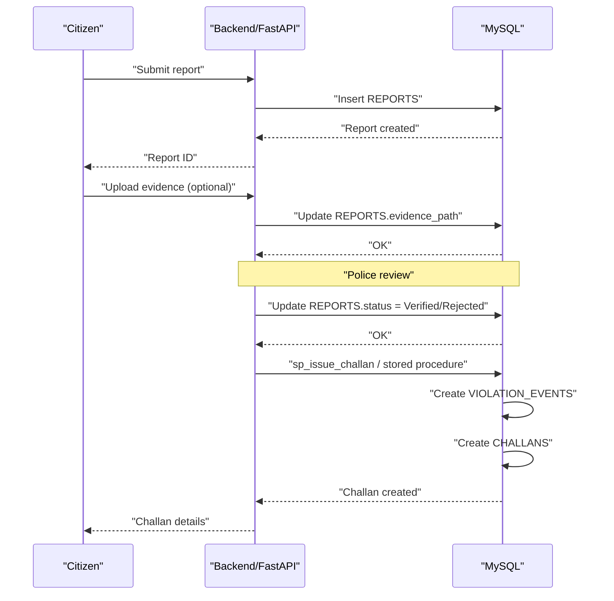
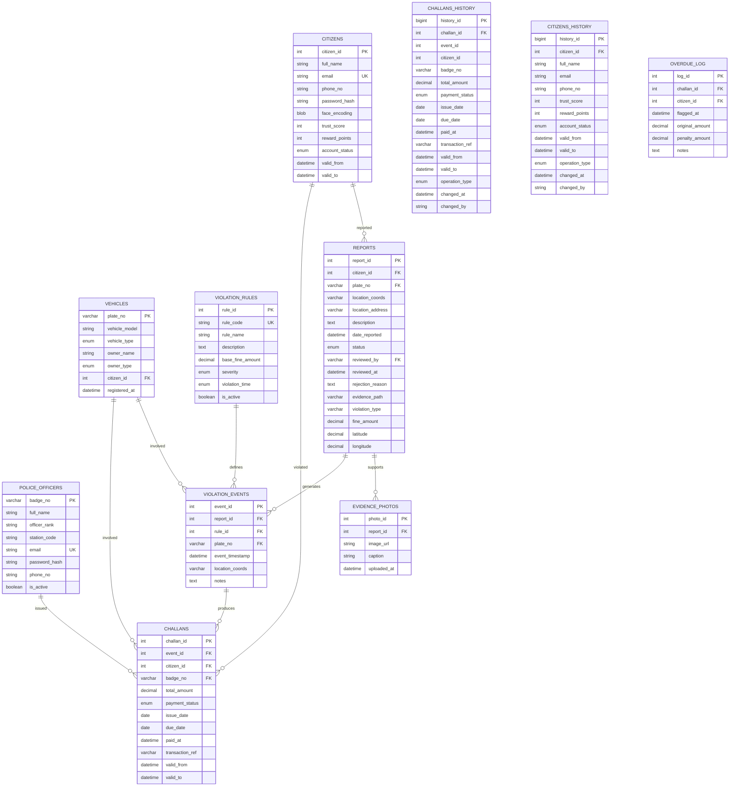
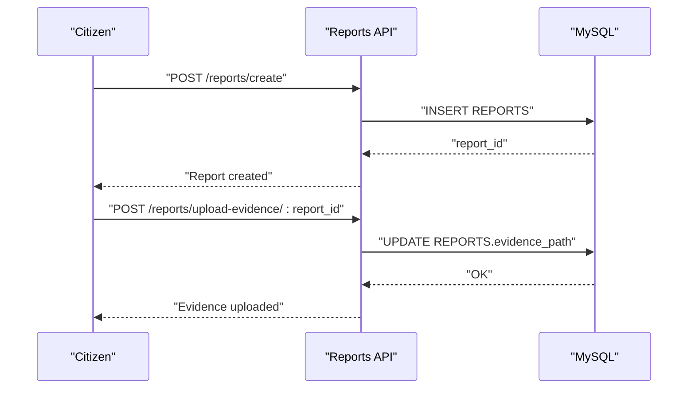
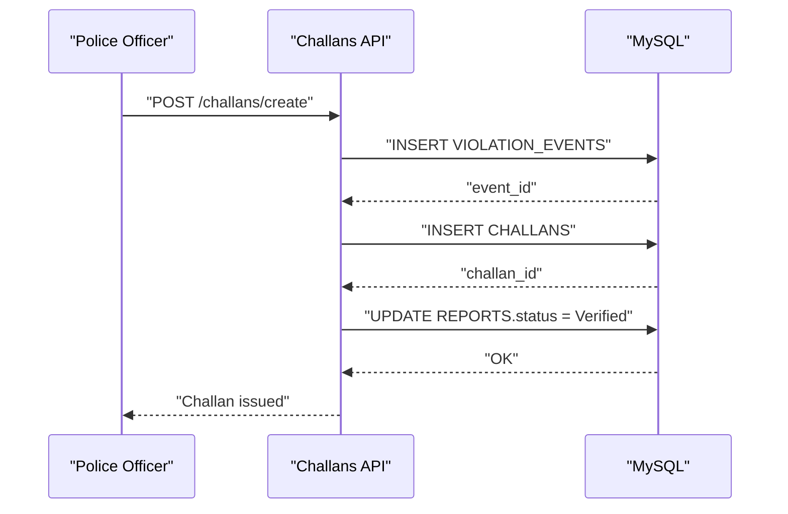
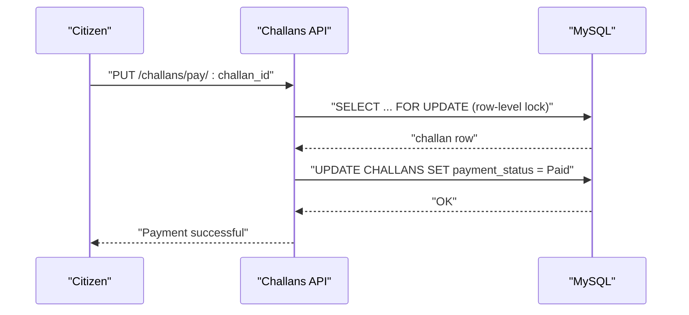
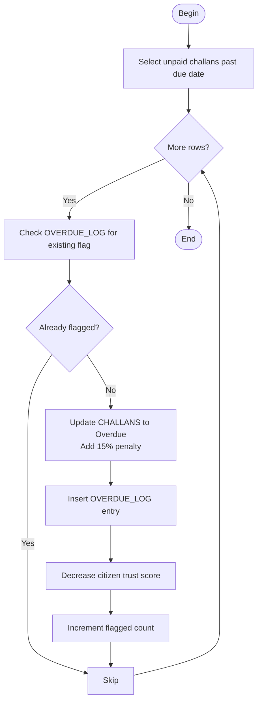
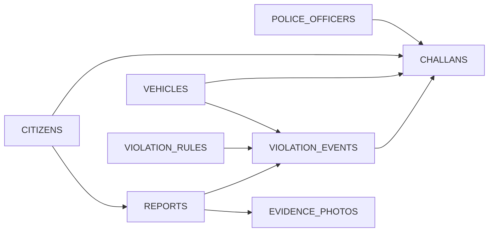

# Normalization Rational and 5NF Design

<cite>
**Referenced Files in This Document**
- [schema.sql](file://db/schema.sql)
- [add_vehicle_citizen_link.sql](file://db/add_vehicle_citizen_link.sql)
- [reports_enhancement.sql](file://db/reports_enhancement.sql)
- [stored_procedure_process_report.sql](file://db/stored_procedure_process_report.sql)
- [database_triggers.sql](file://db/database_triggers.sql)
- [marga_rakshak_triggers.sql](file://db/marga_rakshak_triggers.sql)
- [seed_demo_accounts.sql](file://db/seed_demo_accounts.sql)
- [insert_mock_reports.sql](file://db/insert_mock_reports.sql)
- [rewards_system.sql](file://db/rewards_system.sql)
- [add_evidence_path_column.sql](file://db/add_evidence_path_column.sql)
- [db.js](file://backend/db.js)
- [database.py](file://server/database.py)
- [challans.js](file://backend/routes/challans.js)
- [reports.js](file://backend/routes/reports.js)
- [challans.py](file://server/routes/challans.py)
- [reports.py](file://server/routes/reports.py)
</cite>

## Table of Contents
1. [Introduction](#introduction)
2. [Project Structure](#project-structure)
3. [Core Components](#core-components)
4. [Architecture Overview](#architecture-overview)
5. [Detailed Component Analysis](#detailed-component-analysis)
6. [Dependency Analysis](#dependency-analysis)
7. [Performance Considerations](#performance-considerations)
8. [Troubleshooting Guide](#troubleshooting-guide)
9. [Conclusion](#conclusion)
10. [Appendices](#appendices)

## Introduction
This document explains the 5NF normalization rationale and design decisions for the Traffic Violation Management System. It details the step-by-step normalization process from 1NF to 5NF, the business rules and functional dependencies that justify decomposition, and how the resulting schema prevents update anomalies, maintains integrity, and supports complex relationships among citizens, police officers, vehicles, violation rules, reports, and challans. It also covers real-world scenarios (multiple violations, repeated offenders, cross-references), trade-offs between normalization and query performance, and indexing strategies to optimize common queries.

## Project Structure
The system’s database schema is defined in a production-grade SQL script that establishes core entities, transient tables, triggers, stored procedures, and views. Application routes in both backend and server tiers orchestrate CRUD and workflow operations against the normalized schema.

```mermaid
graph TB
subgraph "Database Layer"
A["CITIZENS"]
B["POLICE_OFFICERS"]
C["VEHICLES"]
D["VIOLATION_RULES"]
E["REPORTS"]
F["EVIDENCE_PHOTOS"]
G["VIOLATION_EVENTS"]
H["CHALLANS"]
I["CHALLANS_HISTORY"]
J["CITIZENS_HISTORY"]
K["OVERDUE_LOG"]
L["ACTIVE_SESSIONS"]
M["UNVERIFIED_UPLOADS"]
N["Pending_Reports_Dashboard (View)"]
O["Citizen_Challan_Summary (View)"]
end
subgraph "Application Layer"
P["Backend (Express)"]
Q["Server (FastAPI)"]
end
P --> |"HTTP Routes"| A
P --> |"HTTP Routes"| B
P --> |"HTTP Routes"| C
P --> |"HTTP Routes"| D
P --> |"HTTP Routes"| E
P --> |"HTTP Routes"| F
P --> |"HTTP Routes"| G
P --> |"HTTP Routes"| H
Q --> |"HTTP Routes"| A
Q --> |"HTTP Routes"| B
Q --> |"HTTP Routes"| C
Q --> |"HTTP Routes"| D
Q --> |"HTTP Routes"| E
Q --> |"HTTP Routes"| F
Q --> |"HTTP Routes"| G
Q --> |"HTTP Routes"| H
```

**Diagram sources**
- [schema.sql:26-235](file://db/schema.sql#L26-L235)
- [challans.js:1-101](file://backend/routes/challans.js#L1-L101)
- [challans.py:1-450](file://server/routes/challans.py#L1-L450)
- [reports.js:1-54](file://backend/routes/reports.js#L1-L54)
- [reports.py:1-563](file://server/routes/reports.py#L1-L563)

**Section sources**
- [schema.sql:1-942](file://db/schema.sql#L1-L942)

## Core Components
- Core entities:
  - CITIZENS: civilian users with trust scoring and temporal validity.
  - POLICE_OFFICERS: law enforcement actors.
  - VEHICLES: vehicle registry with optional owner linkage.
  - VIOLATION_RULES: master catalog of violations and penalties.
  - REPORTS: citizen-submitted violation reports with enhanced fields.
  - EVIDENCE_PHOTOS: photographic evidence linked to reports.
  - VIOLATION_EVENTS: junction linking reports to specific rules and vehicles.
  - CHALLANS: issued penalties with temporal validity and payment tracking.
  - Supporting histories and logs: CITIZENS_HISTORY, CHALLANS_HISTORY, OVERDUE_LOG.
- Transient tables: ACTIVE_SESSIONS and UNVERIFIED_UPLOADS with automated cleanup via events.
- Triggers and stored procedures enforce business rules, maintain audit trails, and coordinate issuance workflows.
- Views simplify dashboards and reporting.

**Section sources**
- [schema.sql:26-235](file://db/schema.sql#L26-L235)
- [add_vehicle_citizen_link.sql:9-13](file://db/add_vehicle_citizen_link.sql#L9-L13)
- [reports_enhancement.sql:14-47](file://db/reports_enhancement.sql#L14-L47)
- [stored_procedure_process_report.sql:8-98](file://db/stored_procedure_process_report.sql#L8-L98)
- [database_triggers.sql:8-35](file://db/database_triggers.sql#L8-L35)
- [marga_rakshak_triggers.sql:16-45](file://db/marga_rakshak_triggers.sql#L16-L45)

## Architecture Overview
The system enforces 5NF by decomposing higher normal forms into projections that eliminate join dependencies. Business workflows (report submission, review, challan issuance, payment) are orchestrated by stored procedures and triggers, ensuring atomicity and referential integrity.

**Diagram sources**
- [reports.py:147-222](file://server/routes/reports.py#L147-L222)
- [challans.py:47-139](file://server/routes/challans.py#L47-L139)
- [stored_procedure_process_report.sql:8-98](file://db/stored_procedure_process_report.sql#L8-L98)
- [schema.sql:440-546](file://db/schema.sql#L440-L546)

## Detailed Component Analysis

### 1NF to 5NF Normalization Walkthrough
- 1NF: All attributes are atomic. Primary keys are defined across all tables. Examples: CITIZENS.citizen_id, POLICE_OFFICERS.badge_no, VEHICLES.plate_no, VIOLATION_RULES.rule_id, REPORTS.report_id, CHALLANS.challan_id.
- 2NF: Eliminate partial dependencies. All non-key attributes are fully functionally dependent on the primary key. Composite keys are minimized; candidate keys are enforced.
- 3NF: Eliminate transitive dependencies. Non-key attributes depend only on the primary key. For example, REPORTS.status depends on REPORTS.report_id; CHALLANS.total_amount depends on CHALLANS.challan_id.
- BCNF: Strengthen 3NF with dependency preservation. Foreign keys and constraints ensure that every determinant is a superkey (e.g., CITIZENS → CHALLANS via citizen_id, POLICE_OFFICERS → CHALLANS via badge_no).
- 4NF: Eliminate multivalued dependencies. The schema avoids multivalued dependencies by decomposing composite facts into separate relations (e.g., REPORTS and VIOLATION_EVENTS).
- 5NF (Projections): Eliminate join dependencies. The schema decomposes the universe into projections that reconstruct via natural joins without loss. For example:
  - REPORTS → VIOLATION_EVENTS → CHALLANS preserves the relationship between reporters, violators, vehicles, rules, and penalties.
  - CITIZENS_HISTORY and CHALLANS_HISTORY preserve temporal versions without embedding redundant state.

Business rules and functional dependencies:
- A report is uniquely identified by report_id and links to a citizen (reporter) and optionally a vehicle.
- A challan is uniquely identified by challan_id and links to a violation event, a citizen (violator), and a police officer.
- A violation event links a report to a specific rule and optionally a vehicle.
- Trust scoring and reward points are managed via triggers on REPORTS and CITIZENS.
- Temporal validity is tracked via valid_from/valid_to on CITIZENS and CHALLANS.

Why each higher normal form was necessary:
- 4NF: Prevents multivalued dependencies (e.g., a report could otherwise embed multiple rules or vehicles in a single tuple).
- 5NF: Ensures that complex relationships can be reconstructed losslessly and that join anomalies are avoided.

Preventing update anomalies:
- Atomic stored procedures (sp_issue_challan, sp_pay_challan) ensure that related updates occur together.
- Triggers maintain audit trails and enforce policy changes (trust scoring, suspension).
- Row-level locks in application code and stored procedures prevent race conditions.

Maintaining integrity:
- Foreign keys constrain referential integrity across entities.
- Unique indexes on emails, badge numbers, and plate numbers reduce duplication.
- Triggers and events enforce business policies (auto-suspension, overdue penalties).

Supporting complex relationships:
- VIOLATION_EVENTS acts as a bridge between REPORTS and CHALLANS via rule_id and plate_no.
- CITIZENS_HISTORY and CHALLANS_HISTORY support temporal auditing.
- Views simplify dashboards and reporting.

Real-world scenario examples:
- Multiple violations: Each report maps to one or more VIOLATION_EVENTS; each event maps to a CHALLAN. This supports multiple violations per report.
- Repeated offenders: Trust score thresholds and suspensions are enforced via triggers and policies embedded in triggers and stored procedures.
- Cross-references: The schema cleanly separates reporter identity (CITIZENS), violator identity (CITIZENS), and vehicle ownership (VEHICLES), enabling accurate attribution.

Trade-offs between normalization and query performance:
- Normalization reduces redundancy and anomalies but may increase join depth.
- Indexes mitigate performance costs for frequent filters (e.g., CITIZENS.email, REPORTS.status, CHALLANS.payment_status).
- Stored procedures centralize complex workflows to minimize application-side joins.

Indexing strategy:
- CITIZENS: idx_citizen_email, idx_citizen_status, idx_citizen_trust.
- REPORTS: idx_report_status, idx_report_citizen, idx_report_date, idx_report_violation_type, idx_report_location, idx_report_fine, idx_evidence_path.
- CHALLANS: idx_challan_status, idx_challan_citizen, idx_challan_due, idx_challan_issued.
- VIOLATION_EVENTS: idx_event_report, idx_event_rule.
- VEHICLES: idx_vehicle_type.
- POLICE_OFFICERS: idx_police_station.
- ACTIVE_SESSIONS and UNVERIFIED_UPLOADS include expiry-based indexes for automated cleanup.

**Section sources**
- [schema.sql:26-235](file://db/schema.sql#L26-L235)
- [reports_enhancement.sql:14-47](file://db/reports_enhancement.sql#L14-L47)
- [stored_procedure_process_report.sql:8-98](file://db/stored_procedure_process_report.sql#L8-L98)
- [database_triggers.sql:8-35](file://db/database_triggers.sql#L8-L35)
- [marga_rakshak_triggers.sql:16-45](file://db/marga_rakshak_triggers.sql#L16-L45)
- [add_vehicle_citizen_link.sql:9-13](file://db/add_vehicle_citizen_link.sql#L9-L13)

### Functional Dependencies and Decomposition

**Diagram sources**
- [schema.sql:26-235](file://db/schema.sql#L26-L235)

### Workflow Sequences

#### Report Submission and Evidence Attachment

**Diagram sources**
- [reports.py:147-222](file://server/routes/reports.py#L147-L222)
- [reports.js:7-31](file://backend/routes/reports.js#L7-L31)

#### Challan Issuance Pipeline

**Diagram sources**
- [challans.py:47-139](file://server/routes/challans.py#L47-L139)
- [stored_procedure_process_report.sql:8-98](file://db/stored_procedure_process_report.sql#L8-L98)

#### Payment Processing with Row-Level Locking

**Diagram sources**
- [challans.py:336-397](file://server/routes/challans.py#L336-L397)
- [challans.js:31-98](file://backend/routes/challans.js#L31-L98)

### Algorithmic Flow: Overdue Flagging

**Diagram sources**
- [schema.sql:689-754](file://db/schema.sql#L689-L754)

## Dependency Analysis
- Foreign key dependencies:
  - REPORTS.citizen_id → CITIZENS.citizen_id
  - REPORTS.plate_no → VEHICLES.plate_no
  - REPORTS.reviewed_by → POLICE_OFFICERS.badge_no
  - VIOLATION_EVENTS.report_id → REPORTS.report_id
  - VIOLATION_EVENTS.rule_id → VIOLATION_RULES.rule_id
  - VIOLATION_EVENTS.plate_no → VEHICLES.plate_no
  - CHALLANS.event_id → VIOLATION_EVENTS.event_id
  - CHALLANS.citizen_id → CITIZENS.citizen_id
  - CHALLANS.badge_no → POLICE_OFFICERS.badge_no
  - CHALLANS_HISTORY.challan_id → CHALLANS.challan_id
  - CITIZENS_HISTORY.citizen_id → CITIZENS.citizen_id
  - OVERDUE_LOG.challan_id → CHALLANS.challan_id
  - OVERDUE_LOG.citizen_id → CITIZENS.citizen_id
- Indexes and constraints:
  - Unique indexes on CITIZENS.email, POLICE_OFFICERS.email, VIOLATION_RULES.rule_code.
  - Expiry-based indexes on ACTIVE_SESSIONS.expires_at and UNVERIFIED_UPLOADS.expires_at.
  - Triggers and events automate temporal versioning and cleanup.

**Diagram sources**
- [schema.sql:116-195](file://db/schema.sql#L116-L195)

**Section sources**
- [schema.sql:116-195](file://db/schema.sql#L116-L195)

## Performance Considerations
- Indexes:
  - High-selectivity filters: CITIZENS.email, REPORTS.status, CHALLANS.payment_status, CHALLANS.due_date.
  - Spatial/geospatial: latitude/longitude for proximity queries (enhanced in reports_enhancement.sql).
  - Audit trails: valid_from/valid_to on temporal tables for time-bound queries.
- Stored procedures:
  - Encapsulate multi-table updates and reduce network round-trips.
  - Use row-level locks to prevent race conditions.
- Connection pooling:
  - Backend uses a promise-based pool; server uses a Python connector pool with buffered cursors and context-managed transactions.
- Events:
  - Automated cleanup of transient tables reduces maintenance overhead.

[No sources needed since this section provides general guidance]

## Troubleshooting Guide
Common issues and remedies:
- Duplicate key errors on CITIZENS.email or POLICE_OFFICERS.email:
  - Ensure uniqueness constraints are respected; use seed scripts to initialize test data safely.
- FK constraint failures during challan creation:
  - Verify REPORTS.status is Pending and VIOLATION_RULES.rule_id is active.
- Trust score anomalies:
  - Triggers adjust trust on REPORTS status changes; confirm triggers exist and are enabled.
- Overdue penalties not applying:
  - Run the overdue flagging procedure and verify cursor logic and penalties.
- Payment race conditions:
  - Ensure row-level locks are used in payment endpoints.

**Section sources**
- [seed_demo_accounts.sql:13-107](file://db/seed_demo_accounts.sql#L13-L107)
- [database_triggers.sql:8-35](file://db/database_triggers.sql#L8-L35)
- [marga_rakshak_triggers.sql:16-45](file://db/marga_rakshak_triggers.sql#L16-L45)
- [schema.sql:689-754](file://db/schema.sql#L689-L754)
- [challans.js:31-98](file://backend/routes/challans.js#L31-L98)
- [challans.py:336-397](file://server/routes/challans.py#L336-L397)

## Conclusion
The Traffic Violation Management System achieves 5NF by carefully decomposing the domain into atomic, dependency-preserving relations. Business rules are enforced through triggers, stored procedures, and constraints, ensuring data integrity and preventing update anomalies. The design supports complex, real-world scenarios—multiple violations, repeated offenders, and cross-referencing—while maintaining strong referential integrity and temporal auditing. Indexes and connection pooling balance normalization benefits with query performance.

[No sources needed since this section summarizes without analyzing specific files]

## Appendices

### Appendix A: Enhanced Reports Schema Details
- New columns: violation_type, latitude, longitude, fine_amount, evidence_path.
- Updated status enum to include “Challan Issued”.
- Indexes added for performance on frequently filtered columns.

**Section sources**
- [reports_enhancement.sql:14-47](file://db/reports_enhancement.sql#L14-L47)
- [add_evidence_path_column.sql:8-14](file://db/add_evidence_path_column.sql#L8-L14)

### Appendix B: Rewards System Integration
- REWARDS_CATALOG and REDEMPTION_HISTORY tables track citizen rewards.
- Trigger updates reward points upon report verification.
- View aggregates citizen metrics for dashboards.

**Section sources**
- [rewards_system.sql:10-127](file://db/rewards_system.sql#L10-L127)

### Appendix C: Demo Data and Pipelines
- Seed scripts create test citizens and a police officer.
- Mock reports injection demonstrates end-to-end workflows.
- Verification queries confirm schema and data integrity.

**Section sources**
- [seed_demo_accounts.sql:13-175](file://db/seed_demo_accounts.sql#L13-L175)
- [insert_mock_reports.sql:11-22](file://db/insert_mock_reports.sql#L11-L22)

### Appendix D: Application Database Connections
- Backend uses a Node.js MySQL pool with keep-alive and connection limits.
- Server uses a Python MySQL connector pool with buffered cursors and context managers.

**Section sources**
- [db.js:1-26](file://backend/db.js#L1-L26)
- [database.py:14-76](file://server/database.py#L14-L76)