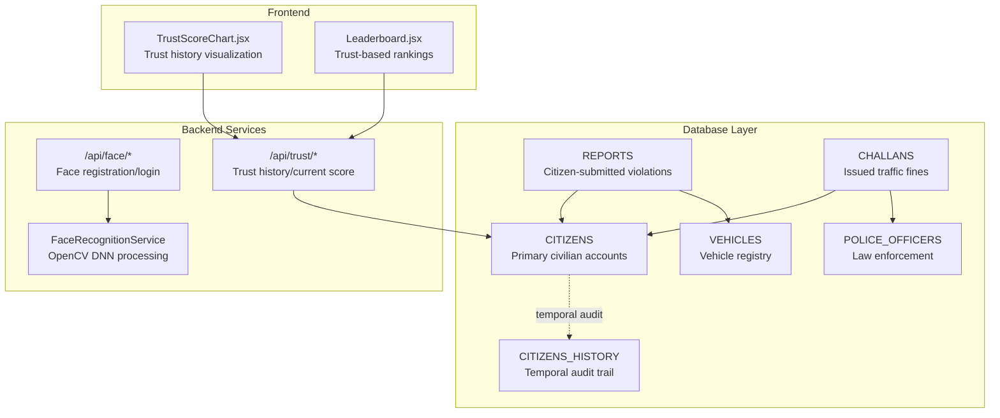
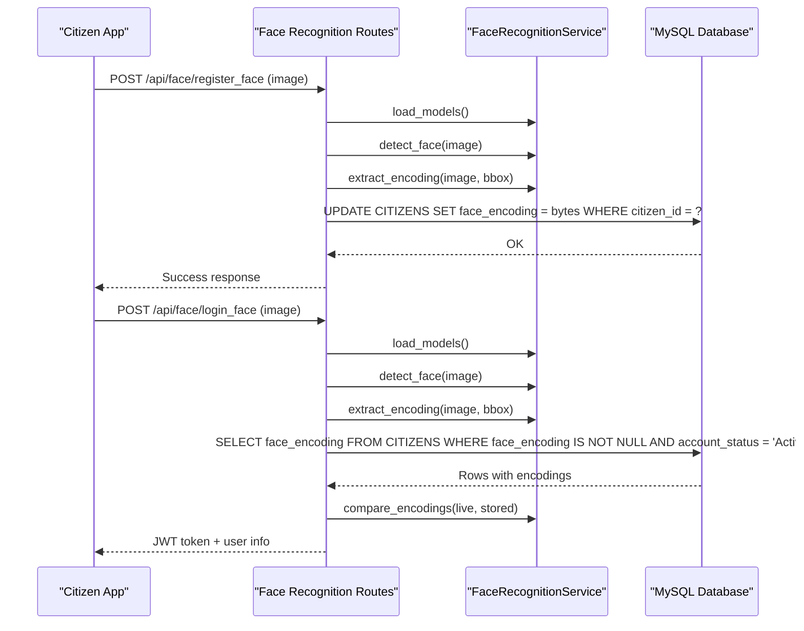
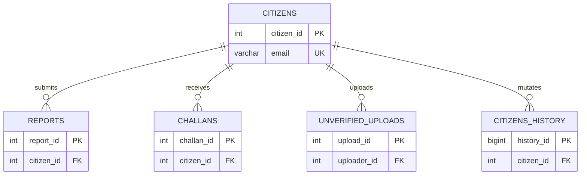
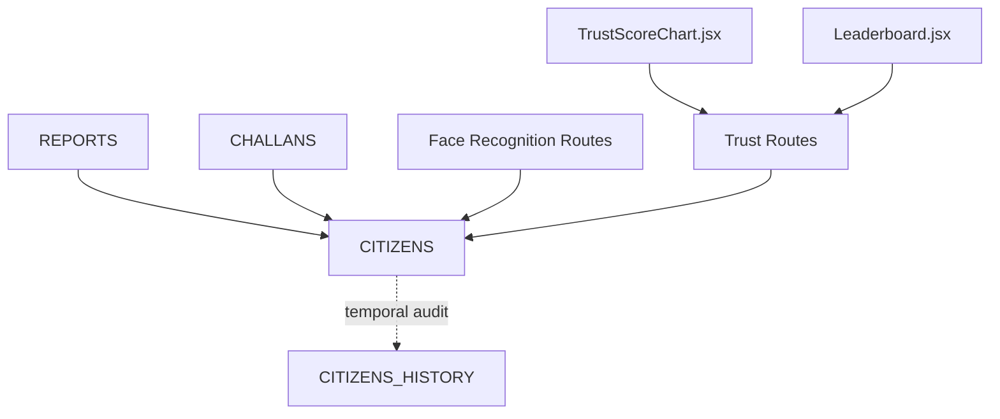

# CITIZENS - Primary Civilian User Accounts

<cite>
**Referenced Files in This Document**
- [schema.sql](file://db/schema.sql)
- [face_recognition.py](file://server/routes/face_recognition.py)
- [face_service.py](file://server/services/face_service.py)
- [trust.py](file://server/routes/trust.py)
- [database_triggers.sql](file://db/database_triggers.sql)
- [test_trust_score_triggers.py](file://scripts/test_trust_score_triggers.py)
- [TrustScoreChart.jsx](file://frontend/src/components/TrustScoreChart.jsx)
- [Leaderboard.jsx](file://frontend/src/pages/Leaderboard.jsx)
- [README.md](file://README.md)
</cite>

## Table of Contents
1. [Introduction](#introduction)
2. [Project Structure](#project-structure)
3. [Core Components](#core-components)
4. [Architecture Overview](#architecture-overview)
5. [Detailed Component Analysis](#detailed-component-analysis)
6. [Dependency Analysis](#dependency-analysis)
7. [Performance Considerations](#performance-considerations)
8. [Troubleshooting Guide](#troubleshooting-guide)
9. [Conclusion](#conclusion)

## Introduction
This document provides comprehensive technical and operational documentation for the CITIZENS table, which manages primary civilian user accounts in the Traffic Violation Management System. It covers field definitions, biometric face encoding storage and security, the trust score system (including automatic suspension at zero), temporal columns for historical tracking, validation rules, constraints, indexing strategy, and relationships with other tables. It also includes examples of trust score changes, their impact on user privileges, and practical guidance for troubleshooting and maintenance.

## Project Structure
The CITIZENS table is part of the production database schema and integrates with backend routes for face recognition and trust management, as well as frontend components for displaying trust score history and leaderboards.

**Diagram sources**
- [schema.sql:26-43](file://db/schema.sql#L26-L43)
- [schema.sql:49-65](file://db/schema.sql#L49-L65)
- [schema.sql:116-136](file://db/schema.sql#L116-L136)
- [schema.sql:173-195](file://db/schema.sql#L173-L195)
- [face_recognition.py:28-108](file://server/routes/face_recognition.py#L28-L108)
- [face_recognition.py:110-232](file://server/routes/face_recognition.py#L110-L232)
- [trust.py:15-101](file://server/routes/trust.py#L15-L101)
- [TrustScoreChart.jsx:1-126](file://frontend/src/components/TrustScoreChart.jsx#L1-L126)
- [Leaderboard.jsx:1-119](file://frontend/src/pages/Leaderboard.jsx#L1-L119)

**Section sources**
- [schema.sql:26-43](file://db/schema.sql#L26-L43)
- [schema.sql:49-65](file://db/schema.sql#L49-L65)
- [schema.sql:116-136](file://db/schema.sql#L116-L136)
- [schema.sql:173-195](file://db/schema.sql#L173-L195)

## Core Components
This section defines each field in the CITIZENS table, its purpose, constraints, and behavior.

- citizen_id
  - Type: INT, Auto-increment, Primary Key
  - Purpose: Unique identifier for each civilian user
  - Constraints: Not null; auto-generated
  - Index: Implicit primary key index

- full_name
  - Type: VARCHAR(120)
  - Purpose: Registered full name of the citizen
  - Constraints: Not null

- email
  - Type: VARCHAR(255), Unique
  - Purpose: Login identity and communication address
  - Constraints: Not null; unique across the table
  - Index: idx_citizen_email

- phone_no
  - Type: VARCHAR(20)
  - Purpose: Contact phone number
  - Constraints: Nullable

- password_hash
  - Type: VARCHAR(255)
  - Purpose: Server-side password storage using bcrypt
  - Constraints: Not null

- face_encoding
  - Type: BLOB
  - Purpose: Serialized 128-dimensional face embedding vector
  - Constraints: Nullable; comment indicates serialized vector from face_recognition library
  - Storage mechanism: Stored as raw bytes; deserialized to float32 NumPy arrays for comparison
  - Security implications: Encoded as binary; transmitted via secure HTTPS endpoints; tolerance-based matching prevents brute-force attacks; fallback to email/password login ensures resilience

- trust_score
  - Type: INT
  - Purpose: Reputation metric ranging from 0 to 200
  - Default: 50
  - Constraints: Check constraint enforces 0 ≤ score ≤ 200
  - Behavior: Automatically adjusted by triggers on report verification/rejection; automatically suspended when reaching 0

- reward_points
  - Type: INT
  - Purpose: Accumulated points for good behavior and timely actions
  - Default: 0
  - Constraints: Not null

- account_status
  - Type: ENUM('Active','Suspended','Banned')
  - Purpose: Account privilege state
  - Default: 'Active'
  - Behavior: Automatically set to 'Suspended' when trust_score reaches 0

- created_at
  - Type: DATETIME
  - Purpose: Record creation timestamp
  - Default: CURRENT_TIMESTAMP

- updated_at
  - Type: DATETIME
  - Purpose: Last update timestamp
  - Default: CURRENT_TIMESTAMP on update

- valid_from
  - Type: DATETIME
  - Purpose: Temporal validity start for this record version
  - Default: CURRENT_TIMESTAMP

- valid_to
  - Type: DATETIME
  - Purpose: Temporal validity end for this record version
  - Default: '9999-12-31 23:59:59'

Validation rules and constraints summary:
- Unique constraints: email (unique)
- Check constraints: trust_score between 0 and 200
- Not null constraints: full_name, email, password_hash, trust_score, reward_points, account_status, created_at, updated_at, valid_from, valid_to
- Default values: trust_score=50, reward_points=0, account_status='Active', timestamps and temporal ends as noted

Indexing strategy:
- idx_citizen_email: Supports email-based lookups
- idx_citizen_status: Supports filtering by account status
- idx_citizen_trust: Supports trust-based queries and leaderboards

**Section sources**
- [schema.sql:26-43](file://db/schema.sql#L26-L43)
- [schema.sql:32-32](file://db/schema.sql#L32-L32)
- [schema.sql:33-33](file://db/schema.sql#L33-L33)
- [schema.sql:40-42](file://db/schema.sql#L40-L42)

## Architecture Overview
The CITIZENS table participates in a broader ecosystem involving face recognition, trust scoring, and temporal auditing. The following diagram illustrates the end-to-end flow for face registration and login, and how trust score changes propagate through triggers and stored procedures.

**Diagram sources**
- [face_recognition.py:28-108](file://server/routes/face_recognition.py#L28-L108)
- [face_recognition.py:110-232](file://server/routes/face_recognition.py#L110-L232)
- [face_service.py:24-94](file://server/services/face_service.py#L24-L94)
- [face_service.py:96-149](file://server/services/face_service.py#L96-L149)

## Detailed Component Analysis

### Field Definitions and Behavioral Details
- Identity and contact fields (citizen_id, full_name, email, phone_no)
  - citizen_id: Primary key; auto-increment; used as foreign key in REPORTS and CHALLANS
  - email: Unique; indexed; serves as login identity
  - phone_no: Optional; supports communication

- Authentication fields (password_hash, face_encoding)
  - password_hash: bcrypt-hashed credentials; fallback authentication method
  - face_encoding: BLOB storing serialized 128-d vectors; deserialized to float32 arrays for Euclidean distance comparisons; tolerance-based matching; stored as bytes

- Reputation and privilege fields (trust_score, reward_points, account_status)
  - trust_score: Range 0–200; triggers adjust score on report status changes; automatically suspended at 0
  - reward_points: Incremented for verified reports and timely payments
  - account_status: Impacts access; auto-suspension when trust_score reaches 0

- Audit and temporal fields (created_at, updated_at, valid_from, valid_to)
  - created_at/updated_at: Timestamps managed by defaults
  - valid_from/valid_to: Temporal versioning; CITIZENS_HISTORY captures historical versions

**Section sources**
- [schema.sql:26-43](file://db/schema.sql#L26-L43)
- [schema.sql:49-65](file://db/schema.sql#L49-L65)
- [face_recognition.py:158-202](file://server/routes/face_recognition.py#L158-L202)
- [face_service.py:143-149](file://server/services/face_service.py#L143-L149)

### Biometric Face Encoding Storage and Security
Storage mechanism:
- Encoding extraction uses OpenCV DNN-based detection and a flattening/normalization pipeline to produce a 128-d vector
- Vector is serialized to bytes and stored in face_encoding BLOB
- During login, encodings are deserialized to float32 arrays and compared using Euclidean distance

Security considerations:
- Encoded vectors are stored as binary; transmission occurs over HTTPS endpoints
- Matching uses a configurable tolerance to balance false positives/negatives
- Fallback to email/password login maintains usability if biometric systems fail
- Access control restricts trust history retrieval to the requesting citizen

Operational notes:
- Model loading is validated before processing
- Robust error handling for invalid images, detection failures, and encoding extraction errors

**Section sources**
- [face_recognition.py:28-108](file://server/routes/face_recognition.py#L28-L108)
- [face_recognition.py:110-232](file://server/routes/face_recognition.py#L110-L232)
- [face_service.py:24-94](file://server/services/face_service.py#L24-L94)
- [face_service.py:96-149](file://server/services/face_service.py#L96-L149)
- [trust.py:15-61](file://server/routes/trust.py#L15-L61)

### Trust Score System and Automatic Suspension
Trust score mechanics:
- Range: 0–200; enforced by check constraint
- Automatic adjustments:
  - Verified report: +10 trust, +10 reward (native triggers)
  - Rejected report: −10 trust (minimum 0)
- Automatic suspension:
  - When trust_score reaches 0, account_status is set to 'Suspended' via trigger

Temporal tracking:
- CITIZENS_HISTORY captures every mutation with valid_from/valid_to periods
- Trigger closes previous version on update and advances valid_from for new version

Examples of trust score changes:
- Verified report increases trust by 10; reflected immediately in current score and history
- Rejected report decreases trust by 10; if reduced to 0, account becomes suspended
- Timely payment adds reward_points and may improve user experience indirectly

Impact on user privileges:
- Active accounts can submit reports, view leaderboards, and access payment portals
- Suspended accounts lose access until trust improves or administrative action is taken

**Section sources**
- [schema.sql:33-33](file://db/schema.sql#L33-L33)
- [schema.sql:311-336](file://db/schema.sql#L311-L336)
- [schema.sql:363-382](file://db/schema.sql#L363-L382)
- [database_triggers.sql:8-35](file://db/database_triggers.sql#L8-L35)
- [test_trust_score_triggers.py:100-181](file://scripts/test_trust_score_triggers.py#L100-L181)
- [trust.py:15-101](file://server/routes/trust.py#L15-L101)

### Temporal Columns and Historical Tracking
Temporal design:
- valid_from/valid_to define the validity period for each record version
- CITIZENS_HISTORY mirrors mutations with operation_type and changed_at
- Views and procedures support temporal queries and audits

Audit trail:
- BEFORE UPDATE on CITIZENS inserts a closed version into CITIZENS_HISTORY
- AFTER INSERT on CITIZENS logs initial version
- Frontend components consume trust history for visualization

**Section sources**
- [schema.sql:38-39](file://db/schema.sql#L38-L39)
- [schema.sql:49-65](file://db/schema.sql#L49-L65)
- [schema.sql:311-356](file://db/schema.sql#L311-L356)
- [trust.py:15-61](file://server/routes/trust.py#L15-L61)
- [TrustScoreChart.jsx:1-126](file://frontend/src/components/TrustScoreChart.jsx#L1-L126)

### Field Validation Rules, Unique Constraints, and Indexing Strategy
Validation rules:
- Unique: email
- Check: trust_score ∈ [0, 200]
- Not null: identity, authentication, reputation, and temporal fields

Constraints:
- Foreign keys:
  - REPORTS.citizen_id → CITIZENS.citizen_id (CASCADE)
  - CHALLANS.citizen_id → CITIZENS.citizen_id (CASCADE)
  - UNVERIFIED_UPLOADS.uploader_id → CITIZENS.citizen_id (CASCADE)

Indexing:
- idx_citizen_email: email lookups
- idx_citizen_status: filtering by account status
- idx_citizen_trust: trust-based queries and leaderboards

**Section sources**
- [schema.sql:29-29](file://db/schema.sql#L29-L29)
- [schema.sql:33-33](file://db/schema.sql#L33-L33)
- [schema.sql:118-130](file://db/schema.sql#L118-L130)
- [schema.sql:176-189](file://db/schema.sql#L176-L189)
- [schema.sql:261-271](file://db/schema.sql#L261-L271)
- [schema.sql:40-42](file://db/schema.sql#L40-L42)

### Examples of Trust Score Changes and Privilege Impact
Example scenarios:
- Verified report increases trust by 10; citizen sees updated score and reward points
- Rejected report decreases trust by 10; if score falls to 0, account becomes suspended
- Overdue challans reduce trust by 5 per incident; repeated incidents increase risk of suspension

Privilege impact:
- Active: full access to platform features
- Suspended: restricted access until trust improves
- Banned: permanent restriction

These behaviors are enforced by triggers and stored procedures and reflected in the frontend leaderboard and trust history views.

**Section sources**
- [schema.sql:363-382](file://db/schema.sql#L363-L382)
- [schema.sql:693-754](file://db/schema.sql#L693-L754)
- [Leaderboard.jsx:41-46](file://frontend/src/pages/Leaderboard.jsx#L41-L46)
- [README.md:176-214](file://README.md#L176-L214)

### Relationships with Other Tables Through Foreign Keys
- CITIZENS ↔ REPORTS: One-to-many; citizen submits reports; cascading delete on citizen removal
- CITIZENS ↔ CHALLANS: One-to-many; citizens receive challans; cascading delete on citizen removal
- CITIZENS ↔ UNVERIFIED_UPLOADS: One-to-many; staging for evidence photos; cascading delete on citizen removal
- CITIZENS ↔ CITIZENS_HISTORY: One-to-many; temporal audit trail

**Diagram sources**
- [schema.sql:26-43](file://db/schema.sql#L26-L43)
- [schema.sql:116-136](file://db/schema.sql#L116-L136)
- [schema.sql:173-195](file://db/schema.sql#L173-L195)
- [schema.sql:261-271](file://db/schema.sql#L261-L271)
- [schema.sql:49-65](file://db/schema.sql#L49-L65)

## Dependency Analysis
Key dependencies and coupling:
- CITIZENS depends on REPORTS and CHALLANS for trust score triggers
- CITIZENS_HISTORY provides temporal audit for trust score and profile changes
- Frontend components depend on trust history and current score endpoints
- Face recognition endpoints depend on FaceRecognitionService for encoding extraction and comparison

**Diagram sources**
- [schema.sql:116-136](file://db/schema.sql#L116-L136)
- [schema.sql:173-195](file://db/schema.sql#L173-L195)
- [schema.sql:311-356](file://db/schema.sql#L311-L356)
- [face_recognition.py:28-108](file://server/routes/face_recognition.py#L28-L108)
- [trust.py:15-101](file://server/routes/trust.py#L15-L101)
- [TrustScoreChart.jsx:1-126](file://frontend/src/components/TrustScoreChart.jsx#L1-L126)
- [Leaderboard.jsx:1-119](file://frontend/src/pages/Leaderboard.jsx#L1-L119)

**Section sources**
- [schema.sql:116-136](file://db/schema.sql#L116-L136)
- [schema.sql:173-195](file://db/schema.sql#L173-L195)
- [schema.sql:311-356](file://db/schema.sql#L311-L356)
- [face_recognition.py:28-108](file://server/routes/face_recognition.py#L28-L108)
- [trust.py:15-101](file://server/routes/trust.py#L15-L101)
- [TrustScoreChart.jsx:1-126](file://frontend/src/components/TrustScoreChart.jsx#L1-L126)
- [Leaderboard.jsx:1-119](file://frontend/src/pages/Leaderboard.jsx#L1-L119)

## Performance Considerations
- Index utilization:
  - Email lookups benefit from idx_citizen_email
  - Filtering by account status leverages idx_citizen_status
  - Trust-based queries and leaderboards use idx_citizen_trust efficiently
- Temporal queries:
  - valid_from/valid_to enable efficient historical snapshots
  - CITIZENS_HISTORY indexing (citizen_id, valid_from, valid_to) supports audit performance
- Face recognition:
  - Tolerance-based comparison reduces unnecessary computations
  - Model loading validation prevents repeated failures
- Stored procedures and triggers:
  - ACID guarantees for challan issuance and payment
  - Row-level locks prevent race conditions during payment processing

[No sources needed since this section provides general guidance]

## Troubleshooting Guide
Common issues and resolutions:
- Face registration/login failures:
  - Ensure face detection models are downloaded and loaded
  - Validate image quality and face visibility
  - Confirm face_encoding is not null for login attempts
- Trust score not updating:
  - Verify triggers Auto_Reward_System and Auto_Penalty_System exist and are active
  - Use test script to confirm trigger behavior
- Suspicious account suspension:
  - Check CITIZENS_HISTORY for recent trust score changes
  - Review report statuses and overdue challans affecting score
- Frontend trust history not displaying:
  - Confirm trust history endpoint permissions and current user context
  - Validate date serialization and timezone handling

**Section sources**
- [face_recognition.py:34-43](file://server/routes/face_recognition.py#L34-L43)
- [face_recognition.py:56-64](file://server/routes/face_recognition.py#L56-L64)
- [face_recognition.py:118-126](file://server/routes/face_recognition.py#L118-L126)
- [database_triggers.sql:8-35](file://db/database_triggers.sql#L8-L35)
- [test_trust_score_triggers.py:17-48](file://scripts/test_trust_score_triggers.py#L17-L48)
- [trust.py:15-61](file://server/routes/trust.py#L15-L61)

## Conclusion
The CITIZENS table forms the foundation of civilian identity and reputation within the Traffic Violation Management System. Its robust schema, including biometric face encoding, trust scoring, and temporal auditing, enables secure, auditable, and scalable user management. The integrated backend and frontend components provide a seamless experience for citizens while maintaining strong governance through automated triggers and stored procedures.