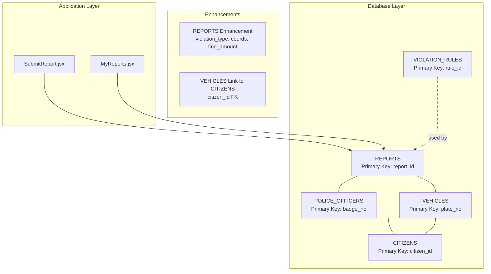
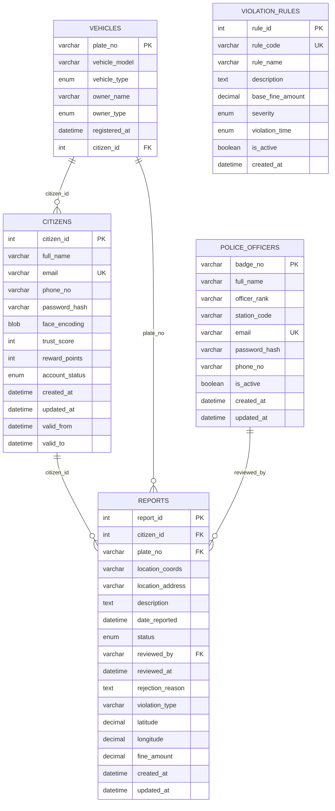
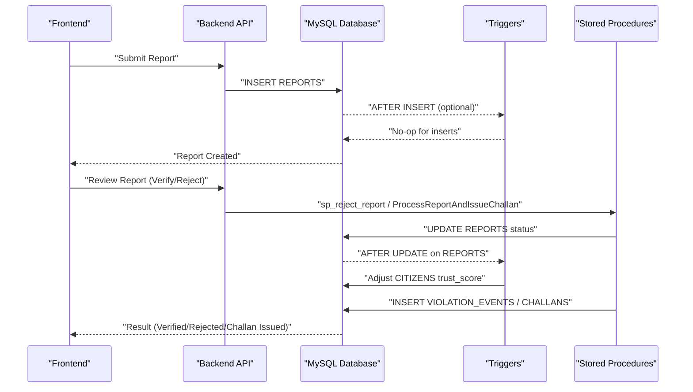
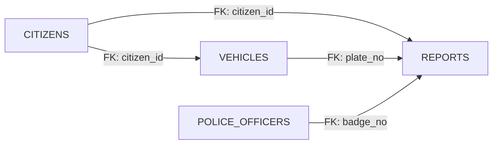

# Core Entity Tables

<cite>
**Referenced Files in This Document**
- [schema.sql](file://db/schema.sql)
- [reports_enhancement.sql](file://db/reports_enhancement.sql)
- [add_vehicle_citizen_link.sql](file://db/add_vehicle_citizen_link.sql)
- [marga_rakshak_triggers.sql](file://db/marga_rakshak_triggers.sql)
- [stored_procedure_process_report.sql](file://db/stored_procedure_process_report.sql)
- [seed_demo_accounts.sql](file://db/seed_demo_accounts.sql)
- [insert_mock_reports.sql](file://db/insert_mock_reports.sql)
- [SubmitReport.jsx](file://frontend/src/pages/SubmitReport.jsx)
- [MyReports.jsx](file://frontend/src/pages/MyReports.jsx)
</cite>

## Table of Contents
1. [Introduction](#introduction)
2. [Project Structure](#project-structure)
3. [Core Components](#core-components)
4. [Architecture Overview](#architecture-overview)
5. [Detailed Component Analysis](#detailed-component-analysis)
6. [Dependency Analysis](#dependency-analysis)
7. [Performance Considerations](#performance-considerations)
8. [Troubleshooting Guide](#troubleshooting-guide)
9. [Conclusion](#conclusion)

## Introduction
This document provides comprehensive documentation for the five core entity tables that underpin the Traffic Violation Management System: CITIZENS, POLICE_OFFICERS, VEHICLES, VIOLATION_RULES, and REPORTS. It explains each table’s field definitions, data types, constraints, validation rules, and business purpose. It also documents primary keys, foreign keys, indexes, referential integrity constraints, and their impact on data consistency. Temporal columns and their role in historical tracking are covered, along with sample data structures and design rationales.

## Project Structure
The core schema and enhancements are defined in database migration and enhancement scripts. The frontend demonstrates how these tables are used in practice for report submission and review.

**Diagram sources**
- [schema.sql](file://db/schema.sql)
- [reports_enhancement.sql](file://db/reports_enhancement.sql)
- [add_vehicle_citizen_link.sql](file://db/add_vehicle_citizen_link.sql)
- [SubmitReport.jsx](file://frontend/src/pages/SubmitReport.jsx)
- [MyReports.jsx](file://frontend/src/pages/MyReports.jsx)

**Section sources**
- [schema.sql](file://db/schema.sql)
- [reports_enhancement.sql](file://db/reports_enhancement.sql)
- [add_vehicle_citizen_link.sql](file://db/add_vehicle_citizen_link.sql)
- [SubmitReport.jsx](file://frontend/src/pages/SubmitReport.jsx)
- [MyReports.jsx](file://frontend/src/pages/MyReports.jsx)

## Core Components
This section documents the five core entity tables and their relationships.

- CITIZENS
  - Purpose: Stores primary civilian user accounts, biometric face encoding, trust score, and reward points.
  - Primary Key: citizen_id (auto-increment).
  - Temporal Columns: valid_from, valid_to for historical tracking; triggers manage versioning.
  - Indexes: idx_citizen_email, idx_citizen_status, idx_citizen_trust.
  - Constraints: Unique email; trust_score constrained to [0, 200]; account_status enum; created_at/updated_at timestamps.

- POLICE_OFFICERS
  - Purpose: Stores law enforcement personnel with badge numbers and station assignments.
  - Primary Key: badge_no (unique identifier).
  - Indexes: idx_police_station.
  - Constraints: Unique email; is_active boolean; created_at/updated_at timestamps.

- VEHICLES
  - Purpose: Vehicle registry linked to violation events and ownership.
  - Primary Key: plate_no (vehicle registration number).
  - Indexes: idx_vehicle_type.
  - Constraints: vehicle_type enum; owner_type enum; registered_at timestamp.

- VIOLATION_RULES
  - Purpose: Master table of traffic violation categories with base fine amounts and severity.
  - Primary Key: rule_id (auto-increment).
  - Indexes: idx_rule_severity.
  - Constraints: rule_code unique; base_fine_amount positive; severity enum; is_active flag; created_at timestamp.

- REPORTS
  - Purpose: Violation reports filed by citizens; enhanced with violation_type, coordinates, and fine_amount.
  - Primary Key: report_id (auto-increment).
  - Foreign Keys: citizen_id (CITIZENS), plate_no (VEHICLES), reviewed_by (POLICE_OFFICERS).
  - Indexes: idx_report_status, idx_report_citizen, idx_report_date, idx_report_violation_type, idx_report_location, idx_report_fine.
  - Constraints: status enum expanded to include 'Challan Issued'; fine_amount non-negative; date_reported defaults to current timestamp.

**Section sources**
- [schema.sql](file://db/schema.sql)
- [reports_enhancement.sql](file://db/reports_enhancement.sql)
- [add_vehicle_citizen_link.sql](file://db/add_vehicle_citizen_link.sql)

## Architecture Overview
The system follows a normalized 5NF design with referential integrity enforced by foreign keys. Temporal versioning is implemented via triggers and temporal columns to maintain historical audit trails. Stored procedures encapsulate ACID-compliant workflows for report processing and challan issuance.

**Diagram sources**
- [schema.sql](file://db/schema.sql)
- [reports_enhancement.sql](file://db/reports_enhancement.sql)
- [add_vehicle_citizen_link.sql](file://db/add_vehicle_citizen_link.sql)

## Detailed Component Analysis

### CITIZENS
- Business Purpose: Central identity and reputation management for citizens. Supports trust scoring and reward points to incentivize good reporting behavior.
- Field-Level Documentation:
  - citizen_id: Surrogate key; auto-increment; primary key.
  - full_name: Required; personal name.
  - email: Required; unique; used for authentication.
  - phone_no: Optional; contact number.
  - password_hash: Required; bcrypt hash for secure authentication.
  - face_encoding: Optional; serialized 128-d vector for biometric linkage.
  - trust_score: Required; integer bounded [0, 200]; auto-adjusted by triggers.
  - reward_points: Required; integer; increases with verified reports.
  - account_status: Required; enum Active/Suspended/Banned; auto-suspension at trust_score 0.
  - created_at/updated_at: Timestamps for audit.
  - valid_from/valid_to: Temporal versioning for historical tracking; triggers manage validity windows.
- Constraints and Validation:
  - Unique email.
  - trust_score CHECK (>= 0 AND <= 200).
  - account_status enum.
  - Indexes on email, status, trust_score for efficient filtering and reporting.
- Temporal Behavior:
  - Triggers capture historical changes and advance valid_from/valid_to on updates.
- Sample Data Structure:
  - Example citizen with trust_score 50, Active status, and reward_points 0.
- Design Rationale:
  - Separate temporal history table (CITIZENS_HISTORY) ensures immutable audit trail and supports compliance and analytics.

**Section sources**
- [schema.sql](file://db/schema.sql)
- [marga_rakshak_triggers.sql](file://db/marga_rakshak_triggers.sql)
- [seed_demo_accounts.sql](file://db/seed_demo_accounts.sql)

### POLICE_OFFICERS
- Business Purpose: Identity and authority management for law enforcement officers.
- Field-Level Documentation:
  - badge_no: Primary key; unique badge identifier.
  - full_name: Required; officer name.
  - officer_rank: Required; default Constable.
  - station_code: Required; assignment code.
  - email: Required; unique; login credential.
  - password_hash: Required; bcrypt hash.
  - phone_no: Optional; contact.
  - is_active: Required; boolean flag for employment status.
  - created_at/updated_at: Timestamps for audit.
- Constraints and Validation:
  - Unique email.
  - Index on station_code for operational dashboards.
- Sample Data Structure:
  - Example officer with badge_no POL-101, Inspector rank, STATION-001, Active.

**Section sources**
- [schema.sql](file://db/schema.sql)
- [seed_demo_accounts.sql](file://db/seed_demo_accounts.sql)

### VEHICLES
- Business Purpose: Vehicle registry and ownership linkage for violation events.
- Field-Level Documentation:
  - plate_no: Primary key; vehicle registration number.
  - vehicle_model: Optional; manufacturer model.
  - vehicle_type: Required; enum Car/Motorcycle/Truck/Bus/Auto-Rickshaw/Bicycle/Other.
  - owner_name: Optional; owner name.
  - owner_type: Required; enum Individual/Corporate/Government.
  - registered_at: Required; timestamp of registration.
  - citizen_id: Optional; foreign key to CITIZENS for ownership linkage.
- Constraints and Validation:
  - vehicle_type and owner_type enums.
  - Index on vehicle_type for filtering.
  - Foreign key constraint to CITIZENS (ON DELETE SET NULL).
- Enhanced Ownership Link:
  - Migration adds citizen_id FK to VEHICLES; supports challan routing and ownership queries.
- Sample Data Structure:
  - Example vehicle TN-01-AB-1234 with Car type and Individual owner.

**Section sources**
- [schema.sql](file://db/schema.sql)
- [add_vehicle_citizen_link.sql](file://db/add_vehicle_citizen_link.sql)

### VIOLATION_RULES
- Business Purpose: Defines violation categories, base fines, severity, and applicable time-of-day rules.
- Field-Level Documentation:
  - rule_id: Primary key; auto-increment.
  - rule_code: Required; unique; standardized code for violations.
  - rule_name: Required; descriptive name.
  - description: Optional; detailed explanation.
  - base_fine_amount: Required; positive decimal; used as base for challan amount.
  - severity: Required; enum Minor/Moderate/Major/Critical.
  - violation_time: Required; enum Daytime/Nighttime/Anytime.
  - is_active: Required; boolean flag to enable/disable rules.
  - created_at: Timestamp for audit.
- Constraints and Validation:
  - base_fine_amount CHECK (> 0).
  - rule_code UNIQUE.
  - Index on severity for analytics.
- Sample Data Structure:
  - Example rule with base_fine_amount 5000.00, Moderate severity, Anytime.

**Section sources**
- [schema.sql](file://db/schema.sql)

### REPORTS
- Business Purpose: Captures citizen-submitted violation reports with enhanced metadata for processing and analytics.
- Field-Level Documentation:
  - report_id: Primary key; auto-increment.
  - citizen_id: Required; foreign key to CITIZENS; links reporter.
  - plate_no: Optional; foreign key to VEHICLES; links vehicle.
  - location_coords: Optional; GPS coordinates string.
  - location_address: Optional; human-readable address.
  - description: Required; narrative details.
  - date_reported: Required; timestamp; defaults to current time.
  - status: Required; enum Pending/Verified/Rejected/Challan Issued; expanded from prior schema.
  - reviewed_by: Optional; foreign key to POLICE_OFFICERS; badge number of reviewer.
  - reviewed_at: Optional; timestamp of review.
  - rejection_reason: Optional; text reason for rejection.
  - violation_type: Optional; added for categorization (e.g., Speeding).
  - latitude/longitude: Optional; precise GPS coordinates for spatial queries.
  - fine_amount: Required; decimal; default 0.00; populated upon challan issuance.
  - created_at/updated_at: Timestamps for audit.
- Enhanced Columns and Indexes:
  - Added violation_type, latitude, longitude, fine_amount with supporting indexes.
  - Status enum expanded to include 'Challan Issued'.
- Constraints and Validation:
  - Foreign keys: CITIZENS (ON DELETE CASCADE), VEHICLES (ON DELETE SET NULL), POLICE_OFFICERS (ON DELETE SET NULL).
  - Indexes: status, citizen_id, date_reported, violation_type, (latitude, longitude), fine_amount.
- Sample Data Structures:
  - Pending reports with violation_type and coordinates.
  - Verified and Rejected reports with reviewer details and timestamps.
  - Challan Issued report with fine_amount populated.
- Design Rationale:
  - Enhanced REPORTS table centralizes processing metadata and supports real-time dashboards and analytics.

**Section sources**
- [schema.sql](file://db/schema.sql)
- [reports_enhancement.sql](file://db/reports_enhancement.sql)
- [insert_mock_reports.sql](file://db/insert_mock_reports.sql)

## Architecture Overview
The system enforces referential integrity across core entities and uses triggers and stored procedures to maintain data consistency and automate workflows.

**Diagram sources**
- [schema.sql](file://db/schema.sql)
- [marga_rakshak_triggers.sql](file://db/marga_rakshak_triggers.sql)
- [stored_procedure_process_report.sql](file://db/stored_procedure_process_report.sql)

## Detailed Component Analysis

### CITIZENS History and Temporal Versioning
- Purpose: Maintain immutable audit trail of citizen profile changes and trust score mutations.
- Mechanism:
  - Triggers capture old rows into CITIZENS_HISTORY on UPDATE/INSERT.
  - valid_from/valid_to define validity periods; triggers advance valid_from on updates.
  - Auto-suspension when trust_score reaches 0.
- Impact:
  - Ensures compliance and enables historical analysis of trust trends.

**Section sources**
- [schema.sql](file://db/schema.sql)

### POLICE_OFFICERS
- Purpose: Provide authoritative identity for law enforcement reviewers.
- Integration:
  - Foreign key reviewed_by in REPORTS references badge_no.
  - Stored procedures use badge_no to process reports and issue challans.

**Section sources**
- [schema.sql](file://db/schema.sql)
- [stored_procedure_process_report.sql](file://db/stored_procedure_process_report.sql)

### VEHICLES Ownership Link
- Purpose: Link vehicles to their owners for accurate challan routing and ownership queries.
- Mechanism:
  - Migration adds citizen_id FK to VEHICLES with ON DELETE SET NULL.
  - Supports downstream queries linking vehicles to citizens.

**Section sources**
- [add_vehicle_citizen_link.sql](file://db/add_vehicle_citizen_link.sql)

### VIOLATION_RULES
- Purpose: Define base fines and categorization for violations.
- Integration:
  - Used by stored procedures to compute challan amounts.
  - Indexed by severity for analytics and policy decisions.

**Section sources**
- [schema.sql](file://db/schema.sql)
- [stored_procedure_process_report.sql](file://db/stored_procedure_process_report.sql)

### REPORTS Enhancement and Workflow
- Purpose: Enhance REPORTS with violation_type, coordinates, and fine_amount for richer processing.
- Mechanism:
  - Triggers adjust CITIZENS trust_score on status changes (Verified/Rejected).
  - Stored procedures encapsulate ACID-compliant report processing and challan issuance.
- Frontend Integration:
  - SubmitReport.jsx posts report creation and evidence upload.
  - MyReports.jsx displays status and auto-refreshes for real-time updates.

**Section sources**
- [reports_enhancement.sql](file://db/reports_enhancement.sql)
- [marga_rakshak_triggers.sql](file://db/marga_rakshak_triggers.sql)
- [stored_procedure_process_report.sql](file://db/stored_procedure_process_report.sql)
- [SubmitReport.jsx](file://frontend/src/pages/SubmitReport.jsx)
- [MyReports.jsx](file://frontend/src/pages/MyReports.jsx)

## Dependency Analysis
Foreign keys and indexes define the relationships and performance characteristics of the core entities.

**Diagram sources**
- [schema.sql](file://db/schema.sql)
- [reports_enhancement.sql](file://db/reports_enhancement.sql)
- [add_vehicle_citizen_link.sql](file://db/add_vehicle_citizen_link.sql)

**Section sources**
- [schema.sql](file://db/schema.sql)
- [reports_enhancement.sql](file://db/reports_enhancement.sql)
- [add_vehicle_citizen_link.sql](file://db/add_vehicle_citizen_link.sql)

## Performance Considerations
- Indexes:
  - REPORTS: status, citizen_id, date_reported, violation_type, (latitude, longitude), fine_amount.
  - CITIZENS: email, account_status, trust_score.
  - POLICE_OFFICERS: station_code.
  - VEHICLES: vehicle_type.
  - CHALLANS/OVERDUE_LOG: payment_status, due_date, issue_date, citizen_id.
- Temporal Queries:
  - Use valid_from/valid_to ranges for historical analysis without scanning full history.
- Triggers and Stored Procedures:
  - Encapsulate ACID transactions to prevent partial states and reduce application-level complexity.
- Frontend Real-Time Sync:
  - Auto-refresh intervals balance responsiveness with server load.

[No sources needed since this section provides general guidance]

## Troubleshooting Guide
- Common Issues:
  - Foreign Key Constraint Failures: Ensure referenced records exist (e.g., CITIZENS, VEHICLES, POLICE_OFFICERS).
  - Trust Score Boundaries: trust_score is bounded [0, 200]; triggers enforce min 0 and auto-suspension at 0.
  - Report Status Transitions: Use stored procedures to ensure atomic transitions and side effects (e.g., trust score adjustments).
  - Vehicle Ownership: If plate_no is new, VEHICLES may be auto-created; otherwise ensure ownership linkage via citizen_id.
- Verification Scripts:
  - Use provided verification queries in migration and enhancement scripts to confirm schema and constraints.
- Demo Accounts:
  - Seed demo accounts to quickly test end-to-end flows.

**Section sources**
- [schema.sql](file://db/schema.sql)
- [reports_enhancement.sql](file://db/reports_enhancement.sql)
- [seed_demo_accounts.sql](file://db/seed_demo_accounts.sql)
- [marga_rakshak_triggers.sql](file://db/marga_rakshak_triggers.sql)
- [stored_procedure_process_report.sql](file://db/stored_procedure_process_report.sql)

## Conclusion
The five core entity tables (CITIZENS, POLICE_OFFICERS, VEHICLES, VIOLATION_RULES, REPORTS) form a robust, normalized foundation for the Traffic Violation Management System. They incorporate referential integrity, temporal versioning, and automated workflows to ensure data consistency, auditability, and scalability. The enhancements to REPORTS and the addition of ownership linkage in VEHICLES improve analytical capabilities and operational efficiency. Together, these components support real-time dashboards, compliance reporting, and trustworthy enforcement processes.