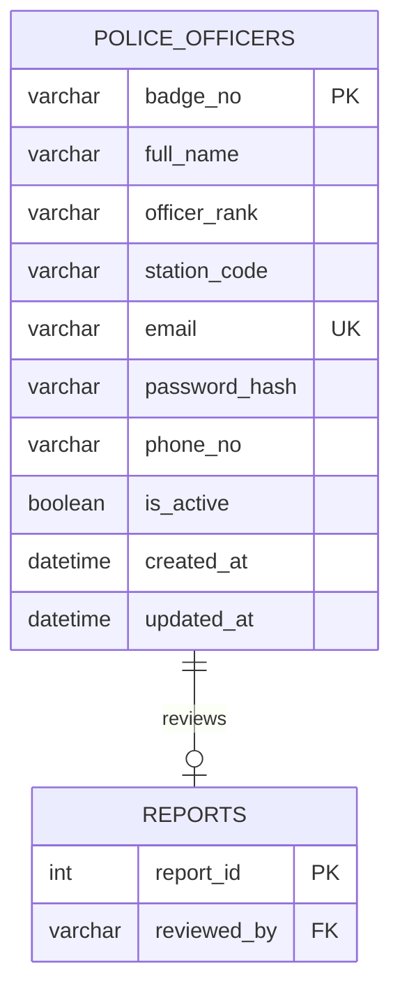
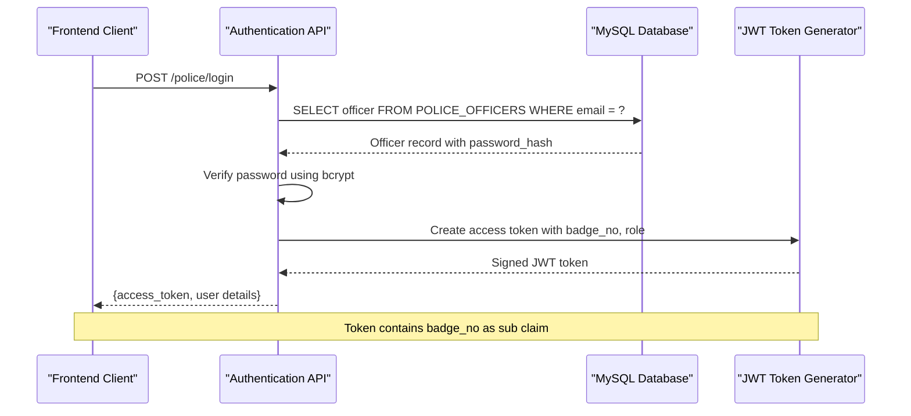
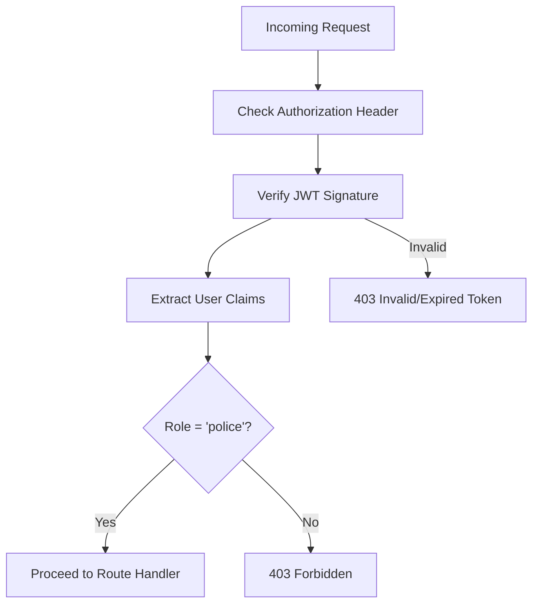
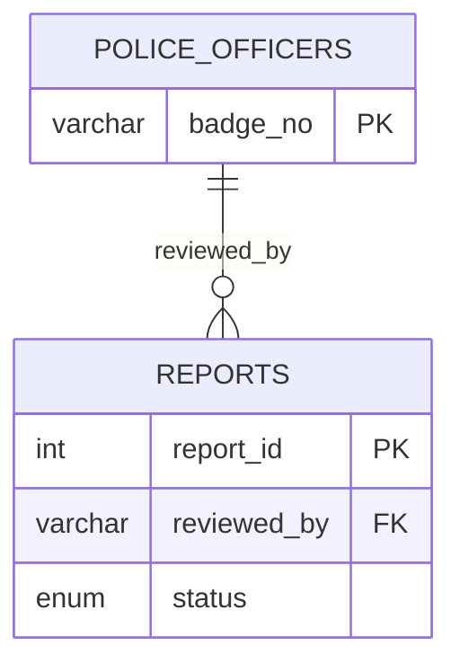
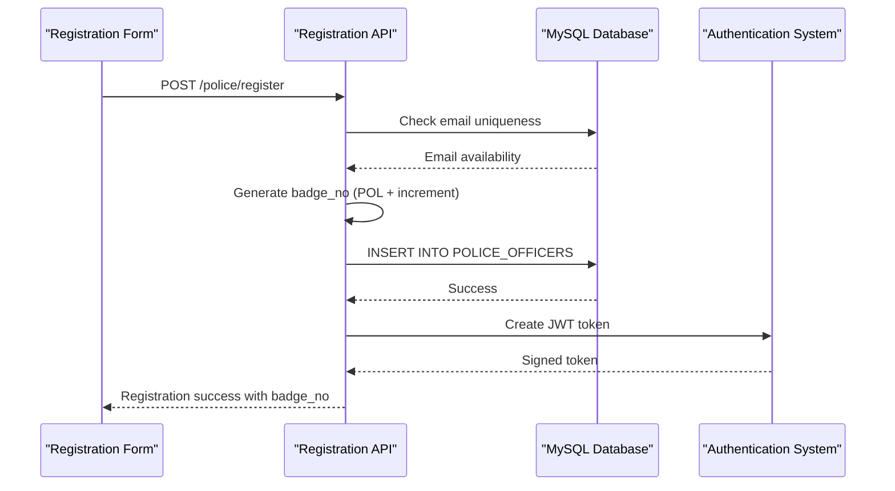
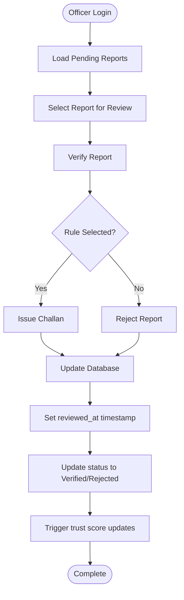

# POLICE_OFFICERS - Law Enforcement Personnel

<cite>
**Referenced Files in This Document**
- [schema.sql](file://db/schema.sql)
- [police.js](file://backend/routes/police.js)
- [police.py](file://server/routes/police.py)
- [auth.js](file://backend/middleware/auth.js)
- [auth.py](file://server/middleware/auth.py)
- [auth.py](file://server/routes/auth.py)
- [ReviewReports.jsx](file://frontend/src/pages/ReviewReports.jsx)
- [PoliceCommand.jsx](file://frontend/src/pages/PoliceCommand.jsx)
</cite>

## Table of Contents
1. [Introduction](#introduction)
2. [Table Structure](#table-structure)
3. [Field Definitions](#field-definitions)
4. [Authentication System](#authentication-system)
5. [Ranking Hierarchy](#ranking-hierarchy)
6. [Station Assignment](#station-assignment)
7. [Unique Constraints](#unique-constraints)
8. [Indexing Strategy](#indexing-strategy)
9. [Integration with Reports](#integration-with-reports)
10. [Workflow Examples](#workflow-examples)
11. [Performance Considerations](#performance-considerations)
12. [Troubleshooting Guide](#troubleshooting-guide)
13. [Conclusion](#conclusion)

## Introduction

The POLICE_OFFICERS table serves as the cornerstone of law enforcement personnel management in the Traffic Violation Management System. This table manages all active law enforcement officers, their authentication credentials, hierarchical positions, and operational assignments across various police stations. The system implements a comprehensive database-first approach with MySQL triggers handling automatic trust score adjustments and temporal versioning for audit trails.

The table follows enterprise-grade security practices with bcrypt password hashing, JWT token-based authentication, and role-based access control. It integrates seamlessly with the broader traffic violation ecosystem, enabling real-time report processing, challan issuance, and performance analytics.

## Table Structure

The POLICE_OFFICERS table is designed with the following core structure:

**Diagram sources**
- [schema.sql:70-82](file://db/schema.sql#L70-L82)
- [schema.sql:125](file://db/schema.sql#L125)

**Section sources**
- [schema.sql:68-82](file://db/schema.sql#L68-L82)

## Field Definitions

### Primary Key: badge_no
The badge number serves as the unique identifier for each police officer and functions as the primary key. This field follows a specific numbering convention:

- **Format**: `XX-XXXX` (e.g., 'TN-4521')
- **Type**: VARCHAR(20)
- **Constraints**: PRIMARY KEY, NOT NULL
- **Role**: Authentication identifier, foreign key reference in REPORTS table

### Required Fields

#### full_name
- **Type**: VARCHAR(120)
- **Constraints**: NOT NULL
- **Purpose**: Officer's complete name for identification and reporting

#### officer_rank
- **Type**: VARCHAR(50)
- **Default**: 'Constable'
- **Constraints**: NOT NULL
- **Purpose**: Hierarchical position classification

#### station_code
- **Type**: VARCHAR(30)
- **Constraints**: NOT NULL
- **Purpose**: Geographic assignment to police station

#### email
- **Type**: VARCHAR(255)
- **Constraints**: NOT NULL, UNIQUE
- **Purpose**: Primary authentication credential

#### password_hash
- **Type**: VARCHAR(255)
- **Constraints**: NOT NULL
- **Purpose**: Secure password storage using bcrypt

#### phone_no
- **Type**: VARCHAR(20)
- **Constraints**: DEFAULT NULL
- **Purpose**: Contact information for communication

### Status Tracking

#### is_active
- **Type**: BOOLEAN
- **Default**: TRUE
- **Constraints**: NOT NULL
- **Purpose**: Account activation/deactivation status
- **Integration**: Prevents login for deactivated accounts

#### Timestamp Fields
- **created_at**: DATETIME, DEFAULT CURRENT_TIMESTAMP
- **updated_at**: DATETIME, DEFAULT CURRENT_TIMESTAMP ON UPDATE CURRENT_TIMESTAMP

**Section sources**
- [schema.sql:70-82](file://db/schema.sql#L70-L82)

## Authentication System

The authentication system implements a robust JWT-based approach with comprehensive security measures:

### Login Process Flow

**Diagram sources**
- [auth.py:1128-1185](file://server/routes/auth.py#L1128-L1185)
- [auth.py:156-182](file://server/middleware/auth.py#L156-L182)

### Security Features

- **Password Hashing**: bcrypt with salt generation
- **Token Expiration**: 24-hour validity period
- **Role-Based Access**: Distinct police authentication flow
- **Account Status Validation**: Prevents login for deactivated officers
- **JWT Payload**: Contains badge_no, role, email, and name

### Middleware Integration

The backend authentication middleware validates tokens and enforces role-based access control:

**Diagram sources**
- [auth.js:5-20](file://backend/middleware/auth.js#L5-L20)
- [auth.py:45-61](file://server/middleware/auth.py#L45-L61)

**Section sources**
- [auth.py:1128-1185](file://server/routes/auth.py#L1128-L1185)
- [auth.js:5-37](file://backend/middleware/auth.js#L5-L37)

## Ranking Hierarchy

The officer ranking system follows a standardized hierarchy with clear progression levels:

### Rank Categories
- **Constable**: Entry-level officer position
- **Sub-Inspector**: Mid-level supervisory position  
- **Assistant Sub-Inspector**: Senior officer position
- **Inspector**: Senior supervisory position
- **Assistant Commissioner**: Senior administrative position

### Implementation Details
- **Default Value**: 'Constable' for new registrations
- **Storage**: VARCHAR(50) to accommodate future rank additions
- **Display**: Used in performance analytics and reporting
- **Integration**: Appears in officer performance views

### Rank-Based Permissions
Higher ranks typically inherit additional permissions and oversight responsibilities within the system, though specific permission matrices are managed at the application level.

**Section sources**
- [schema.sql:73](file://db/schema.sql#L73)
- [schema.sql:861-863](file://db/schema.sql#L861-L863)

## Station Assignment

### Station Code System
- **Format**: `XXX-XX-XXXX` (e.g., 'CHN-T-NAGAR')
- **Purpose**: Geographic and administrative assignment
- **Constraints**: NOT NULL, indexed for performance
- **Default**: 'HQ001' for headquarters assignment

### Assignment Logic
- **Initial Assignment**: New officers default to HQ001
- **Geographic Coverage**: Supports multiple city districts
- **Administrative Control**: Enables station-based reporting and analytics
- **Performance Tracking**: Station code appears in performance metrics

### Indexing Strategy
The station_code field is indexed to support efficient station-based queries and filtering operations.

**Section sources**
- [schema.sql:74](file://db/schema.sql#L74)
- [schema.sql:81](file://db/schema.sql#L81)

## Unique Constraints

### Email Uniqueness
The email field maintains uniqueness across all officers:
- **Constraint**: UNIQUE NOT NULL
- **Validation**: Prevents duplicate email registrations
- **Security**: Single sign-on capability per email address
- **Integration**: Email serves as primary authentication credential

### Badge Number Uniqueness
- **Constraint**: PRIMARY KEY
- **Validation**: Ensures unique officer identification
- **Foreign Key Reference**: Used throughout the system for officer references

### Constraint Enforcement
Both constraints are enforced at the database level, preventing duplicate entries and maintaining referential integrity across related tables.

**Section sources**
- [schema.sql:75](file://db/schema.sql#L75)
- [schema.sql:71](file://db/schema.sql#L71)

## Indexing Strategy

### Primary Key Indexing
- **badge_no**: Automatically indexed as PRIMARY KEY
- **Performance**: Optimized for officer lookups and joins

### Station-Based Queries
- **idx_police_station**: Index on station_code
- **Purpose**: Efficient filtering by geographic assignment
- **Performance Impact**: Enables fast station-based officer queries

### Additional Index Considerations
- **Email Index**: UNIQUE constraint provides implicit indexing
- **Composite Indexes**: Consider adding composite indexes for common query patterns
- **Maintenance**: Regular ANALYZE TABLE operations recommended

### Query Optimization
Common query patterns benefit from the established indexing strategy:
- Officer lookup by badge number
- Station-based officer filtering
- Email-based authentication
- Performance analytics by station

**Section sources**
- [schema.sql:81](file://db/schema.sql#L81)

## Integration with Reports

### Foreign Key Relationship
The POLICE_OFFICERS table integrates with the REPORTS table through the reviewed_by field:

**Diagram sources**
- [schema.sql:125](file://db/schema.sql#L125)
- [schema.sql:132](file://db/schema.sql#L132)

### Review Process Integration

#### Report Verification Workflow
1. **Officer Authentication**: Badge number used as authentication identifier
2. **Report Processing**: reviewed_by field populated with officer badge
3. **Status Updates**: Report status transitions (Pending → Verified)
4. **Audit Trail**: Timestamps and reviewer information maintained

#### Stored Procedure Integration
The system uses stored procedures for complex operations:
- **sp_issue_challan**: Issues challans based on verified reports
- **sp_reject_report**: Handles report rejections with reasons
- **Transaction Management**: Ensures data consistency across operations

### Performance Views
The system includes specialized views for officer performance:
- **Officer_Performance_View**: Aggregates verification statistics
- **Pending_Reports_Dashboard**: Real-time report processing feed
- **Citizen_Challan_Summary**: Links officers to issued challans

**Section sources**
- [schema.sql:125](file://db/schema.sql#L125)
- [schema.sql:809-820](file://db/schema.sql#L809-L820)

## Workflow Examples

### Officer Registration Process

**Diagram sources**
- [auth.py:1075-1127](file://server/routes/auth.py#L1075-L1127)

### Report Review Workflow

**Diagram sources**
- [police.js:18-85](file://backend/routes/police.js#L18-L85)
- [police.py:48-156](file://server/routes/police.py#L48-L156)

### Daily Operations

#### Performance Monitoring
- **Real-time Dashboards**: Live officer performance metrics
- **Station Analytics**: Geographic performance comparisons
- **Revenue Tracking**: Challan issuance and collection monitoring

#### Administrative Functions
- **Badge Management**: Badge number generation and assignment
- **Rank Progression**: Officer rank updates and promotions
- **Station Transfers**: Geographic reassignment capabilities

**Section sources**
- [police.js:7-16](file://backend/routes/police.js#L7-L16)
- [police.py:25-46](file://server/routes/police.py#L25-L46)

## Performance Considerations

### Database Optimization
- **Connection Pooling**: Efficient resource utilization for concurrent operations
- **Query Optimization**: Indexed fields minimize query execution time
- **Transaction Management**: Proper COMMIT/ROLLBACK handling prevents deadlocks

### Scalability Factors
- **Badge Number Growth**: VARCHAR(20) accommodates millions of officers
- **Station Expansion**: Flexible station_code format supports geographic growth
- **Index Maintenance**: Regular optimization ensures sustained performance

### Monitoring Recommendations
- **Query Performance**: Monitor slow query logs regularly
- **Connection Statistics**: Track connection pool utilization
- **Index Effectiveness**: Periodic ANALYZE TABLE operations

## Troubleshooting Guide

### Common Authentication Issues

#### Login Failures
- **Invalid Credentials**: Verify email exists and password hash matches
- **Account Deactivation**: Check is_active status before login
- **Token Expiration**: Implement automatic refresh mechanisms

#### Badge Number Conflicts
- **Duplicate Badge Numbers**: Ensure unique badge generation logic
- **Format Validation**: Verify badge number format compliance
- **Foreign Key Integrity**: Check REPORTS table references

### Performance Issues

#### Slow Report Loading
- **Index Verification**: Ensure idx_police_station is active
- **Query Optimization**: Review EXPLAIN plans for complex queries
- **Connection Pool Limits**: Monitor pool exhaustion scenarios

#### Authentication Delays
- **Password Hashing**: Consider bcrypt cost factor tuning
- **JWT Token Size**: Minimize payload to reduce processing overhead
- **Network Latency**: Optimize database connection configuration

### Data Integrity Problems

#### Duplicate Email Registrations
- **Constraint Violations**: Handle UNIQUE constraint errors gracefully
- **Validation Logic**: Implement pre-check before database operations
- **Error Messaging**: Provide clear feedback for duplicate attempts

#### Report Processing Errors
- **Transaction Rollback**: Ensure proper error handling in stored procedures
- **Foreign Key Constraints**: Validate REPORTS table relationships
- **Audit Trail Consistency**: Maintain temporal data integrity

**Section sources**
- [auth.py:1145-1154](file://server/routes/auth.py#L1145-L1154)
- [police.js:39-43](file://backend/routes/police.js#L39-L43)

## Conclusion

The POLICE_OFFICERS table represents a comprehensive solution for law enforcement personnel management within the Traffic Violation Management System. Its design balances security, scalability, and operational efficiency while maintaining strict adherence to database normalization principles.

Key strengths include:
- **Robust Security**: Enterprise-grade authentication with bcrypt and JWT
- **Hierarchical Organization**: Clear rank structure with flexible expansion
- **Geographic Flexibility**: Station-based assignment supporting multiple jurisdictions
- **Integration Capabilities**: Seamless connection with reporting and challan systems
- **Performance Optimization**: Strategic indexing and query optimization

The system's database-first approach, combined with MySQL triggers and stored procedures, ensures data consistency and reduces application-level complexity. The comprehensive authentication system provides secure access control while maintaining user experience.

Future enhancements could include advanced permission matrices, dynamic rank structures, and expanded geographic coverage for larger metropolitan areas.