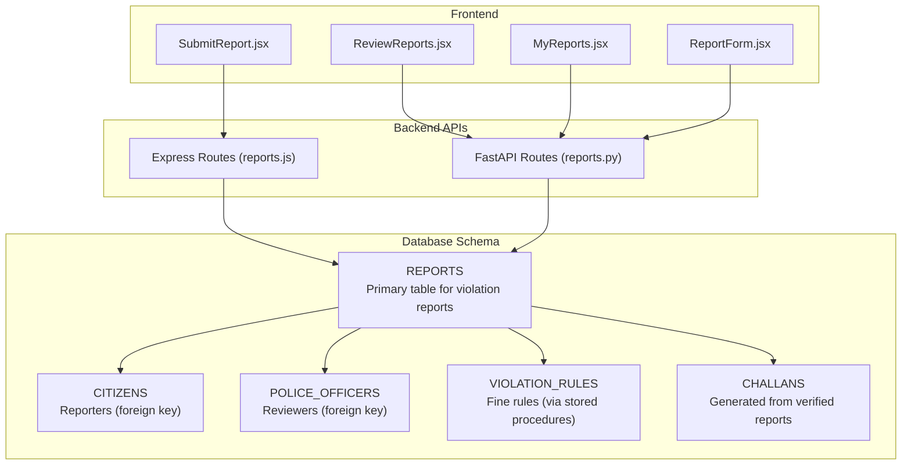
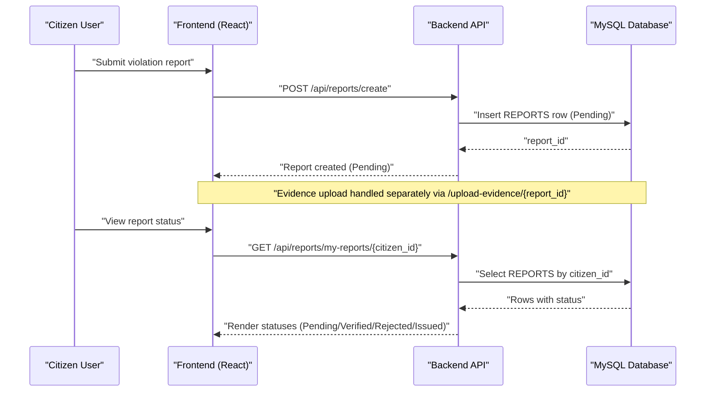
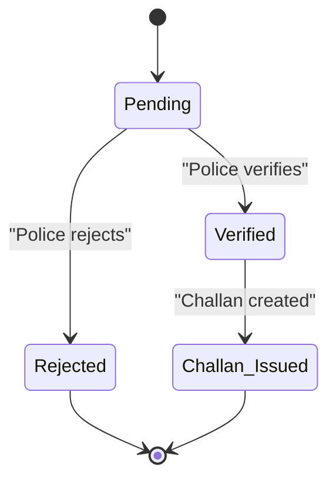
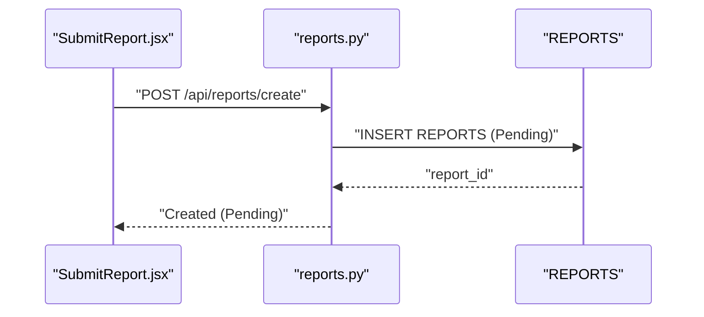
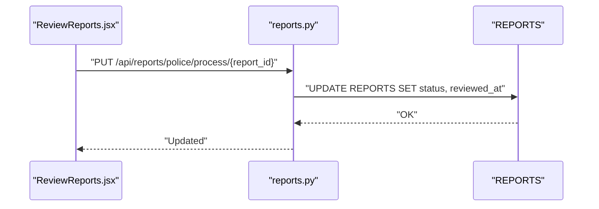
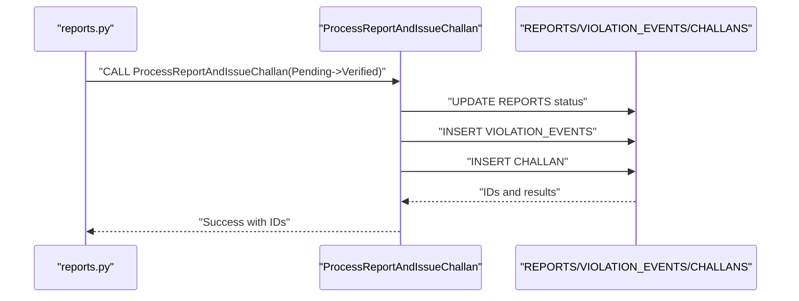
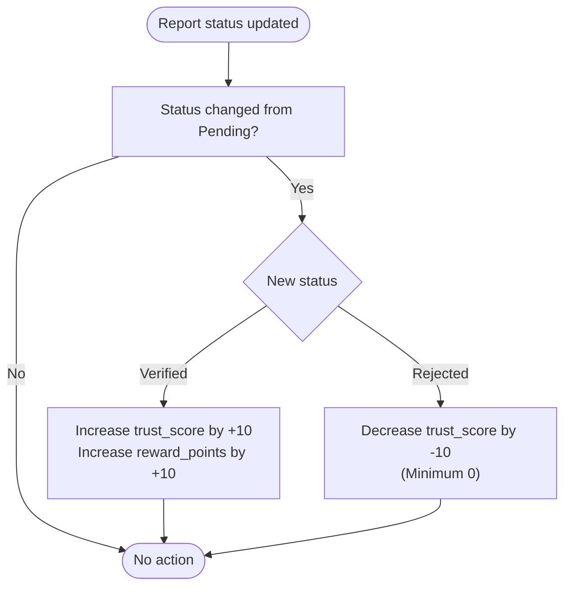
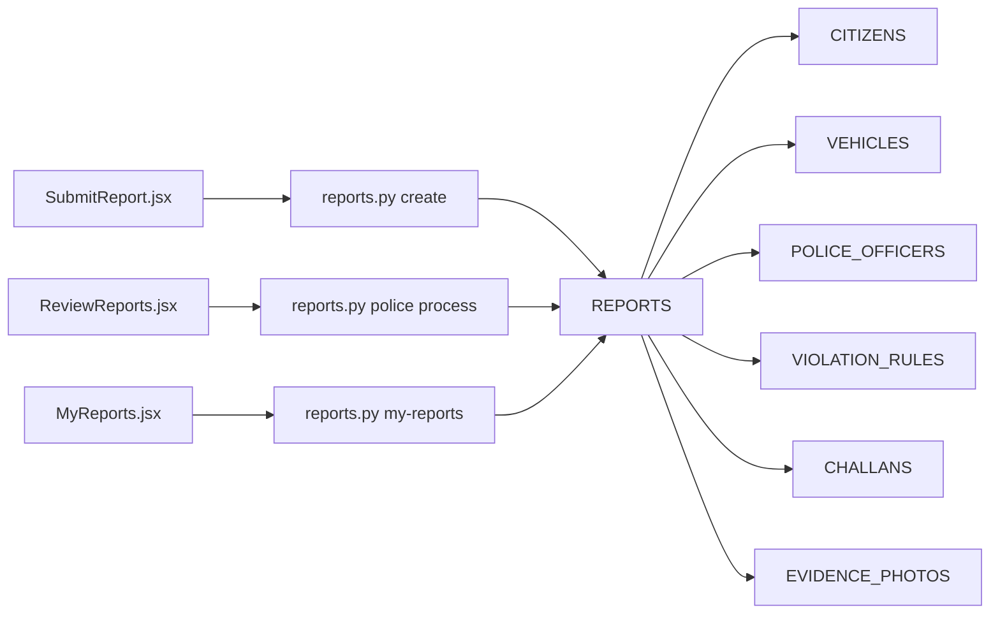

# REPORTS - Violation Reports

<cite>
**Referenced Files in This Document**
- [schema.sql](file://db/schema.sql)
- [reports_enhancement.sql](file://db/reports_enhancement.sql)
- [database_triggers.sql](file://db/database_triggers.sql)
- [marga_rakshak_triggers.sql](file://db/marga_rakshak_triggers.sql)
- [stored_procedure_process_report.sql](file://db/stored_procedure_process_report.sql)
- [reports.js](file://backend/routes/reports.js)
- [reports.py](file://server/routes/reports.py)
- [SubmitReport.jsx](file://frontend/src/pages/SubmitReport.jsx)
- [ReviewReports.jsx](file://frontend/src/pages/ReviewReports.jsx)
- [MyReports.jsx](file://frontend/src/pages/MyReports.jsx)
- [ReportForm.jsx](file://frontend/src/components/ReportForm.jsx)
- [insert_mock_reports.sql](file://db/insert_mock_reports.sql)
</cite>

## Table of Contents
1. [Introduction](#introduction)
2. [Project Structure](#project-structure)
3. [Core Components](#core-components)
4. [Architecture Overview](#architecture-overview)
5. [Detailed Component Analysis](#detailed-component-analysis)
6. [Dependency Analysis](#dependency-analysis)
7. [Performance Considerations](#performance-considerations)
8. [Troubleshooting Guide](#troubleshooting-guide)
9. [Conclusion](#conclusion)

## Introduction
This document provides comprehensive documentation for the REPORTS table that manages traffic violation reports filed by citizens. It defines all fields, explains the report status workflow, describes GPS coordinate storage and address resolution, documents foreign key relationships with CITIZENS and POLICE_OFFICERS, outlines indexing strategies, and illustrates end-to-end processing workflows including trigger-based trust score adjustments.

## Project Structure
The REPORTS table is part of a normalized, production-grade database schema with supporting triggers, stored procedures, and API routes. The frontend integrates with the backend to support report submission, review, and tracking.

**Diagram sources**
- [schema.sql:116-136](file://db/schema.sql#L116-L136)
- [reports.js:1-54](file://backend/routes/reports.js#L1-L54)
- [reports.py:147-223](file://server/routes/reports.py#L147-L223)

**Section sources**
- [schema.sql:116-136](file://db/schema.sql#L116-L136)
- [reports.js:1-54](file://backend/routes/reports.js#L1-L54)
- [reports.py:147-223](file://server/routes/reports.py#L147-L223)

## Core Components
This section defines the REPORTS table fields and their roles in the system.

- report_id: Unique identifier for each report (auto-increment primary key).
- citizen_id: Foreign key to CITIZENS; identifies the reporter who submitted the report.
- plate_no: Optional foreign key to VEHICLES; identifies the alleged violator’s vehicle.
- violation_type: New field indicating the category of violation (e.g., Speeding, Red Light Violation).
- location_coords: String representation of GPS coordinates (lat,lng) for quick parsing.
- latitude: Decimal field storing precise latitude for spatial indexing and geolocation features.
- longitude: Decimal field storing precise longitude for spatial indexing and geolocation features.
- location_address: Human-readable address for display and mapping.
- description: Text description of the incident.
- evidence_path: Path to photographic evidence uploaded by the citizen.
- status: Enumerated status with values Pending, Verified, Rejected, Challan Issued.
- fine_amount: Monetary amount associated with the issued challan (when applicable).
- date_reported: Timestamp when the report was created.
- reviewed_by: Badge number of the reviewing police officer (foreign key to POLICE_OFFICERS).
- reviewed_at: Timestamp when the report was reviewed.
- rejection_reason: Optional text explaining why a report was rejected.
- created_at / updated_at: Audit timestamps for record lifecycle.

Indexing strategy:
- Indexes on status, citizen_id, and date_reported support efficient filtering and sorting.
- Additional indexes on violation_type, latitude/longitude, and fine_amount enhance analytical queries.

Foreign keys:
- citizen_id references CITIZENS(citizen_id) with cascade delete.
- plate_no references VEHICLES(plate_no) with set null on delete.
- reviewed_by references POLICE_OFFICERS(badge_no) with set null on delete.

**Section sources**
- [schema.sql:116-136](file://db/schema.sql#L116-L136)
- [reports_enhancement.sql:14-47](file://db/reports_enhancement.sql#L14-L47)

## Architecture Overview
The REPORTS table participates in a complete pipeline from citizen submission to police review and optional challan issuance. Triggers automatically adjust citizen trust scores based on report outcomes.

**Diagram sources**
- [reports.py:147-223](file://server/routes/reports.py#L147-L223)
- [reports.js:8-31](file://backend/routes/reports.js#L8-L31)
- [schema.sql:116-136](file://db/schema.sql#L116-L136)

## Detailed Component Analysis

### Field Definitions and Constraints
- report_id: Primary key; auto-incremented.
- citizen_id: Not null; foreign key to CITIZENS; ensures referential integrity and cascading deletion.
- plate_no: Nullable; foreign key to VEHICLES; set null on delete to preserve report history.
- violation_type: Nullable; supports categorization of violations for analytics and policy decisions.
- location_coords: Nullable; stores comma-separated lat,lng for quick parsing.
- latitude / longitude: Nullable decimals enabling spatial indexing and precise mapping.
- location_address: Nullable; human-readable location for UI and notifications.
- description: Not null; free-text description of the incident.
- evidence_path: Nullable; path to uploaded evidence image.
- status: Enum with default Pending; supports transitions to Verified, Rejected, and Challan Issued.
- fine_amount: Not null default 0.00; populated when a challan is issued.
- date_reported: Not null default current timestamp; tracks submission time.
- reviewed_by: Nullable; foreign key to POLICE_OFFICERS; reviewer identity.
- reviewed_at: Nullable; timestamp of review action.
- rejection_reason: Nullable; textual justification for rejections.
- created_at / updated_at: Audit timestamps with automatic updates.

Constraints and indexes:
- Foreign keys enforce referential integrity across CITIZENS, VEHICLES, and POLICE_OFFICERS.
- Indexes on status, citizen_id, date_reported, violation_type, latitude/longitude, and fine_amount optimize common queries.

**Section sources**
- [schema.sql:116-136](file://db/schema.sql#L116-L136)
- [reports_enhancement.sql:14-47](file://db/reports_enhancement.sql#L14-L47)

### Report Status Workflow
The status lifecycle progresses from Pending to Verified or Rejected, with optional Challan Issued linkage.

- Pending: Initial state after submission.
- Verified: Approved by a police officer; triggers trust score reward and optional challan creation.
- Rejected: Declined by a police officer; triggers trust score penalty.
- Challan Issued: Indicates a challan has been generated and linked to the report.

**Diagram sources**
- [schema.sql:124-124](file://db/schema.sql#L124-L124)
- [reports_enhancement.sql:34-37](file://db/reports_enhancement.sql#L34-L37)

**Section sources**
- [schema.sql:124-124](file://db/schema.sql#L124-L124)
- [reports_enhancement.sql:34-37](file://db/reports_enhancement.sql#L34-L37)

### GPS Coordinate Storage and Address Resolution
- location_coords: Comma-separated string of latitude and longitude for quick parsing and legacy compatibility.
- latitude / longitude: Separate decimal fields for precise spatial queries and indexing.
- location_address: Free-text field for human-readable addresses used in UI and notifications.

Address resolution is not enforced by the schema; however, the presence of both location_coords and location_address allows flexible frontends to present either raw coordinates or formatted addresses.

**Section sources**
- [reports_enhancement.sql:22-27](file://db/reports_enhancement.sql#L22-L27)
- [reports_enhancement.sql:14-21](file://db/reports_enhancement.sql#L14-L21)

### Foreign Key Relationships
- CITIZENS: reporter identity; deletion cascades to remove reports.
- VEHICLES: violator vehicle; deletion sets plate_no to null to preserve report context.
- POLICE_OFFICERS: reviewer identity; deletion sets reviewed_by to null to preserve audit trail.

These relationships ensure referential integrity and maintain historical context even when referenced entities are removed.

**Section sources**
- [schema.sql:130-132](file://db/schema.sql#L130-L132)

### Indexing Strategy for Status and Date Queries
- Index idx_report_status: Accelerates filtering by status (e.g., Pending reports for review).
- Index idx_report_citizen: Supports per-citizen report retrieval.
- Index idx_report_date: Optimizes chronological queries and dashboards.
- Additional indexes on violation_type, latitude/longitude, and fine_amount improve analytical workloads.

**Section sources**
- [schema.sql:133-135](file://db/schema.sql#L133-L135)
- [reports_enhancement.sql:43-47](file://db/reports_enhancement.sql#L43-L47)

### Report Processing Workflows
End-to-end workflows include submission, review, and optional challan issuance.

#### Workflow 1: Citizen Submits a Report
- Frontend collects plate_no, violation_type, location_address, description, and evidence.
- Backend inserts a new REPORTS row with status Pending.
- Evidence is uploaded separately and linked to the report.

**Diagram sources**
- [SubmitReport.jsx:122-137](file://frontend/src/pages/SubmitReport.jsx#L122-L137)
- [reports.py:147-223](file://server/routes/reports.py#L147-L223)

**Section sources**
- [SubmitReport.jsx:122-137](file://frontend/src/pages/SubmitReport.jsx#L122-L137)
- [reports.py:147-223](file://server/routes/reports.py#L147-L223)

#### Workflow 2: Police Reviews and Updates Status
- Frontend displays pending reports to police officers.
- Officer selects Verify or Reject; backend updates status and reviewer metadata.

**Diagram sources**
- [ReviewReports.jsx:63-88](file://frontend/src/pages/ReviewReports.jsx#L63-L88)
- [reports.py:462-511](file://server/routes/reports.py#L462-L511)

**Section sources**
- [ReviewReports.jsx:63-88](file://frontend/src/pages/ReviewReports.jsx#L63-L88)
- [reports.py:462-511](file://server/routes/reports.py#L462-L511)

#### Workflow 3: Stored Procedure-Based Processing (Alternative)
- A stored procedure validates the report is Pending, updates status, and optionally creates a VIOLATION_EVENT and CHALLAN.

**Diagram sources**
- [stored_procedure_process_report.sql:8-98](file://db/stored_procedure_process_report.sql#L8-L98)
- [reports.py:462-511](file://server/routes/reports.py#L462-L511)

**Section sources**
- [stored_procedure_process_report.sql:8-98](file://db/stored_procedure_process_report.sql#L8-L98)
- [reports.py:462-511](file://server/routes/reports.py#L462-L511)

### Trigger-Based Trust Score Adjustments
Triggers automatically adjust CITIZENS trust_score and reward_points based on report outcomes.

- Verified: Increases trust_score and reward_points upon successful verification.
- Rejected: Decreases trust_score by 10, ensuring it does not drop below 0.

**Diagram sources**
- [database_triggers.sql:10-35](file://db/database_triggers.sql#L10-L35)
- [marga_rakshak_triggers.sql:16-45](file://db/marga_rakshak_triggers.sql#L16-L45)

**Section sources**
- [database_triggers.sql:10-35](file://db/database_triggers.sql#L10-L35)
- [marga_rakshak_triggers.sql:16-45](file://db/marga_rakshak_triggers.sql#L16-L45)

## Dependency Analysis
The REPORTS table interacts with multiple entities and utilities across the stack.

**Diagram sources**
- [schema.sql:116-149](file://db/schema.sql#L116-L149)
- [reports.py:147-272](file://server/routes/reports.py#L147-L272)

**Section sources**
- [schema.sql:116-149](file://db/schema.sql#L116-L149)
- [reports.py:147-272](file://server/routes/reports.py#L147-L272)

## Performance Considerations
- Use indexes on frequently filtered/sorted columns (status, date_reported, citizen_id) to speed up dashboard queries.
- Prefer separate latitude/longitude fields for spatial queries; consider adding a spatial index if the database supports it.
- Batch operations and transactions (as seen in stored procedures) reduce contention and ensure consistency.
- Frontend real-time polling (every few seconds) keeps UI synchronized without heavy client-side complexity.

## Troubleshooting Guide
Common issues and resolutions:
- Report not found: Ensure the report_id exists and matches the expected status (Pending for updates/deletions).
- Status update failures: Verify the report is still Pending; otherwise, it cannot be modified.
- Evidence upload errors: Confirm file type and size limits; ensure the report exists before linking evidence.
- Trust score not updating: Check that the status transition is from Pending to Verified or Rejected; triggers activate only on such transitions.

**Section sources**
- [reports.py:274-355](file://server/routes/reports.py#L274-L355)
- [reports.py:462-511](file://server/routes/reports.py#L462-L511)
- [database_triggers.sql:10-35](file://db/database_triggers.sql#L10-L35)

## Conclusion
The REPORTS table forms the backbone of the traffic violation reporting system. Its design balances flexibility (multiple violation types, optional vehicle info, evidence linkage) with strong referential integrity and performance through strategic indexing. The status workflow, combined with trigger-driven trust score adjustments, incentivizes accurate reporting while maintaining fairness. The end-to-end pipeline from submission to review and optional challan issuance is supported by robust backend APIs and intuitive frontend components.