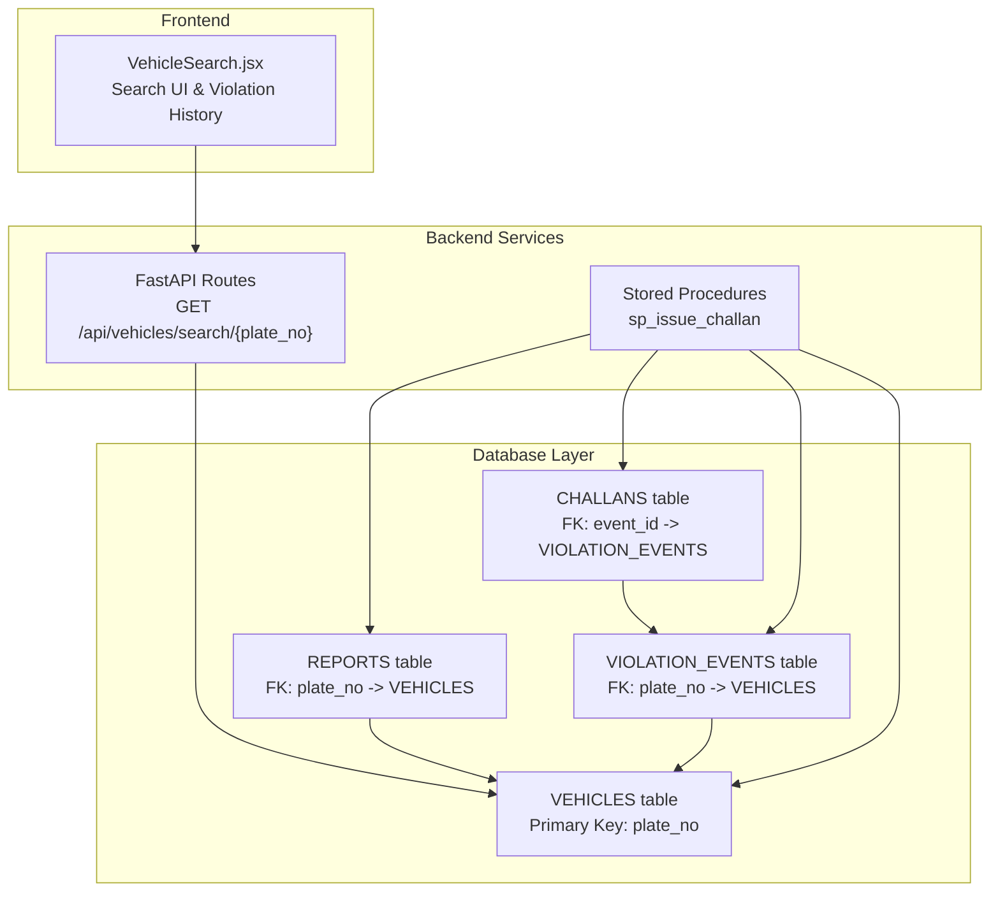
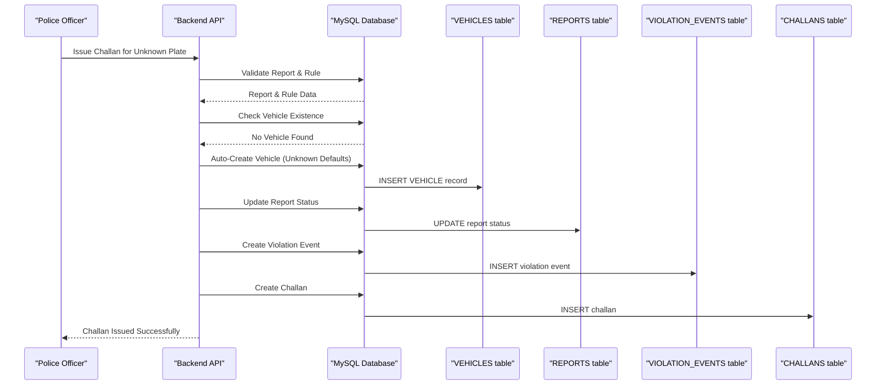
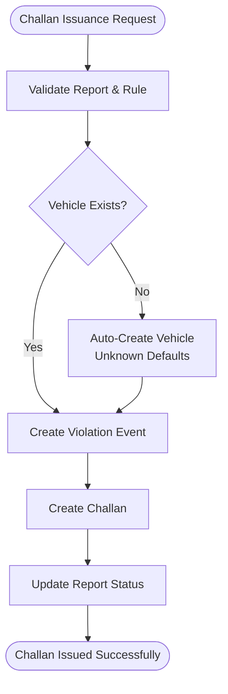
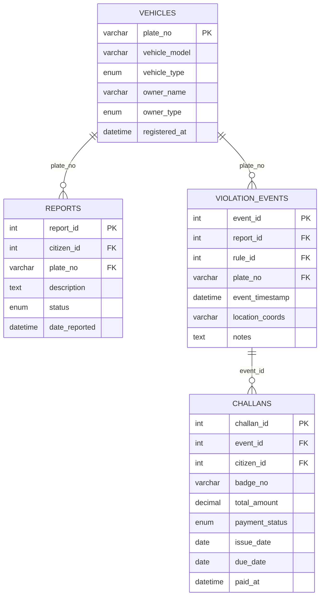

# VEHICLES - Vehicle Registry

<cite>
**Referenced Files in This Document**
- [schema.sql](file://db/schema.sql)
- [vehicles.py](file://server/routes/vehicles.py)
- [VehicleSearch.jsx](file://frontend/src/pages/VehicleSearch.jsx)
- [add_vehicle_citizen_link.sql](file://db/add_vehicle_citizen_link.sql)
- [sp_issue_challan.sql](file://db/schema.sql)
- [test_fk_fix.py](file://server/test_fk_fix.py)
- [test_challan_pipeline.py](file://server/test_challan_pipeline.py)
</cite>

## Table of Contents
1. [Introduction](#introduction)
2. [Project Structure](#project-structure)
3. [Core Components](#core-components)
4. [Architecture Overview](#architecture-overview)
5. [Detailed Component Analysis](#detailed-component-analysis)
6. [Dependency Analysis](#dependency-analysis)
7. [Performance Considerations](#performance-considerations)
8. [Troubleshooting Guide](#troubleshooting-guide)
9. [Conclusion](#conclusion)

## Introduction
This document provides comprehensive documentation for the VEHICLES table, which serves as the central vehicle registry in the Traffic Violation Management System. It covers field definitions, enumerations, owner classifications, the vehicle registration process, automatic creation during challan issuance, indexing strategy for efficient queries, and practical examples of vehicle matching in violation events with auto-create functionality for unknown plates.

## Project Structure
The VEHICLES table is part of the production database schema and integrates with multiple backend services and frontend components:
- Database schema defines the VEHICLES table structure and constraints
- Backend routes expose vehicle search APIs for frontend consumption
- Frontend components provide vehicle search UI and violation history display
- Stored procedures and triggers support automatic vehicle creation and challan issuance workflows

**Diagram sources**
- [schema.sql:87-95](file://db/schema.sql#L87-L95)
- [vehicles.py:36-145](file://server/routes/vehicles.py#L36-L145)
- [VehicleSearch.jsx:13-44](file://frontend/src/pages/VehicleSearch.jsx#L13-L44)

**Section sources**
- [schema.sql:87-95](file://db/schema.sql#L87-L95)
- [vehicles.py:36-145](file://server/routes/vehicles.py#L36-L145)
- [VehicleSearch.jsx:13-44](file://frontend/src/pages/VehicleSearch.jsx#L13-L44)

## Core Components
The VEHICLES table is the cornerstone of vehicle identity and ownership within the system. It maintains vehicle registration details and enables efficient linking to violation events and challans.

### Field Definitions
- plate_no (Primary Key): Unique identifier for each vehicle, serving as the primary key and foreign key reference point for related tables
- vehicle_model: Optional manufacturer and model designation for identification and reporting
- vehicle_type: Enumeration with predefined categories enabling targeted queries and analytics
- owner_name: Registered owner's name for legal and administrative purposes
- owner_type: Classification of ownership entity for regulatory compliance
- registered_at: Timestamp indicating when the vehicle record was created

### Vehicle Type Enumeration
The vehicle_type field supports seven distinct categories:
- Car: Passenger vehicles designed for personal or commercial transport
- Motorcycle: Two-wheeled motorized vehicles
- Truck: Heavy-duty cargo transport vehicles
- Bus: Public or private passenger transport vehicles
- Auto-Rickshaw: Three-wheeled auto-rickshaws commonly used for short-distance transport
- Bicycle: Human-powered two-wheeled vehicles
- Other: Miscellaneous or specialized vehicle types not covered by the above categories

### Owner Type Classification
The owner_type field categorizes vehicle ownership into three classifications:
- Individual: Private ownership by individuals
- Corporate: Business or company ownership
- Government: Government agency or public institution ownership

### Indexing Strategy
The VEHICLES table includes a dedicated index on vehicle_type to optimize queries filtering by vehicle category. This index supports:
- Efficient vehicle type-based reporting and analytics
- Performance optimization for administrative dashboards
- Streamlined search operations for law enforcement

**Section sources**
- [schema.sql:87-95](file://db/schema.sql#L87-L95)

## Architecture Overview
The VEHICLES table integrates seamlessly with the broader traffic violation ecosystem, enabling automatic vehicle creation during challan issuance and supporting comprehensive violation tracking.

**Diagram sources**
- [sp_issue_challan.sql:508-514](file://db/schema.sql#L508-L514)
- [vehicles.py:164-178](file://server/routes/vehicles.py#L164-L178)

**Section sources**
- [sp_issue_challan.sql:508-514](file://db/schema.sql#L508-L514)
- [vehicles.py:164-178](file://server/routes/vehicles.py#L164-L178)

## Detailed Component Analysis

### Vehicle Registration Process
The vehicle registration process encompasses both manual registration and automatic creation during challan issuance:

#### Manual Registration Flow
During citizen registration, the system creates both CITIZENS and VEHICLES records linked by citizen_id:
- Registration form captures mandatory vehicle number and type
- Backend validates vehicle existence before creating CITIZENS record
- If vehicle doesn't exist, it's auto-created with default values
- Foreign key constraints ensure referential integrity

#### Automatic Creation During Challan Issuance
The stored procedure sp_issue_challan implements robust auto-creation logic:
- Validates report and violation rule before proceeding
- Checks VEHICLES table for existing plate_no
- Creates vehicle record with default values if not found
- Ensures atomic transaction completion

**Diagram sources**
- [sp_issue_challan.sql:508-514](file://db/schema.sql#L508-L514)
- [vehicles.py:164-178](file://server/routes/vehicles.py#L164-L178)

**Section sources**
- [sp_issue_challan.sql:508-514](file://db/schema.sql#L508-L514)
- [vehicles.py:164-178](file://server/routes/vehicles.py#L164-L178)

### Vehicle Matching in Violation Events
The system ensures seamless vehicle matching through foreign key relationships and automatic creation:

#### Foreign Key Relationships
- REPORTS.plate_no references VEHICLES.plate_no with ON DELETE SET NULL
- VIOLATION_EVENTS.plate_no references VEHICLES.plate_no with ON DELETE SET NULL
- This design prevents orphaned records while maintaining referential integrity

#### Auto-Create Functionality for Unknown Plates
When processing reports for previously unknown plates:
- System checks VEHICLES table for existing record
- Creates vehicle with default values if not found
- Inserts report with validated foreign key relationship
- Maintains transactional consistency

**Section sources**
- [schema.sql:119-131](file://db/schema.sql#L119-L131)
- [schema.sql:158-164](file://db/schema.sql#L158-L164)
- [test_fk_fix.py:10-49](file://server/test_fk_fix.py#L10-L49)

### Vehicle Search and Violation History
The frontend VehicleSearch component provides comprehensive vehicle information and violation history:

#### API Integration
- Backend exposes GET /api/vehicles/search/{plate_no} endpoint
- Returns vehicle profile, violation history, and summary statistics
- Handles error cases gracefully with meaningful messages

#### Violation History Display
- Comprehensive table showing all violation events
- Severity badges for quick risk assessment
- Challan status indicators (Unpaid, Paid, Overdue)
- Financial summaries including total violations and unpaid amounts

**Section sources**
- [vehicles.py:36-145](file://server/routes/vehicles.py#L36-L145)
- [VehicleSearch.jsx:13-44](file://frontend/src/pages/VehicleSearch.jsx#L13-L44)

## Dependency Analysis
The VEHICLES table participates in several critical relationships within the traffic violation ecosystem:

**Diagram sources**
- [schema.sql:87-95](file://db/schema.sql#L87-L95)
- [schema.sql:116-136](file://db/schema.sql#L116-L136)
- [schema.sql:154-167](file://db/schema.sql#L154-L167)
- [schema.sql:173-195](file://db/schema.sql#L173-L195)

### Cross-Table Dependencies
- VEHICLES serves as the central hub for vehicle identity
- REPORTS depends on VEHICLES for vehicle context
- VIOLATION_EVENTS links reports to specific violation rules and vehicles
- CHALLANS connects violation events to enforcement actions

**Section sources**
- [schema.sql:87-95](file://db/schema.sql#L87-L95)
- [schema.sql:116-136](file://db/schema.sql#L116-L136)
- [schema.sql:154-167](file://db/schema.sql#L154-L167)
- [schema.sql:173-195](file://db/schema.sql#L173-L195)

## Performance Considerations
The VEHICLES table employs strategic indexing and normalization to ensure optimal performance:

### Index Strategy
- Primary key index on plate_no for O(log n) lookups
- vehicle_type index for category-based queries
- Composite indexes could benefit frequent join operations

### Query Optimization Opportunities
- Vehicle type filtering queries can leverage the dedicated index
- Consider adding composite indexes for common join patterns
- Monitor query execution plans for optimization opportunities

### Scalability Considerations
- Current design supports millions of vehicle records efficiently
- Partitioning strategies could be considered for extremely large deployments
- Regular maintenance of indexes ensures sustained performance

## Troubleshooting Guide

### Common Issues and Solutions

#### Vehicle Not Found Errors
- Verify plate number format matches database entries
- Check for case sensitivity issues in plate number input
- Confirm vehicle exists in VEHICLES table before processing

#### Auto-Creation Failures
- Ensure stored procedure sp_issue_challan executes successfully
- Verify transaction boundaries prevent partial updates
- Check for concurrent access conflicts during auto-creation

#### Foreign Key Constraint Errors
- Validate that vehicle records exist before creating reports
- Use transaction-safe operations for report and vehicle creation
- Monitor for duplicate vehicle creation attempts

**Section sources**
- [vehicles.py:61-65](file://server/routes/vehicles.py#L61-L65)
- [test_fk_fix.py:10-49](file://server/test_fk_fix.py#L10-L49)
- [test_challan_pipeline.py:24-36](file://server/test_challan_pipeline.py#L24-L36)

## Conclusion
The VEHICLES table serves as the foundational element of the Traffic Violation Management System, providing robust vehicle identity management with automatic creation capabilities during enforcement workflows. Its comprehensive field definitions, strategic enumerations, and well-designed relationships enable efficient violation tracking, automated challan issuance, and detailed reporting capabilities. The system's architecture ensures data integrity through foreign key constraints while maintaining performance through strategic indexing and transactional consistency.