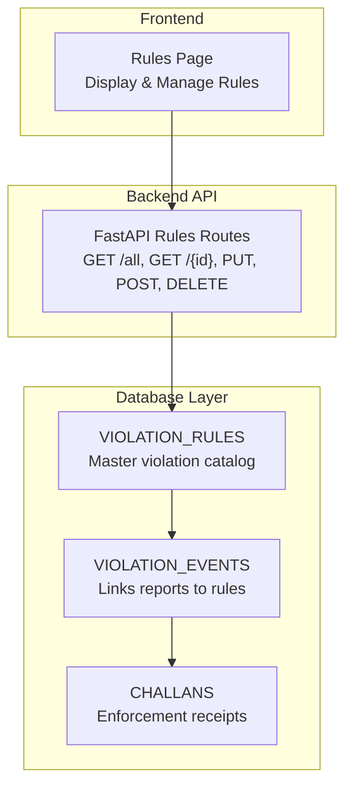
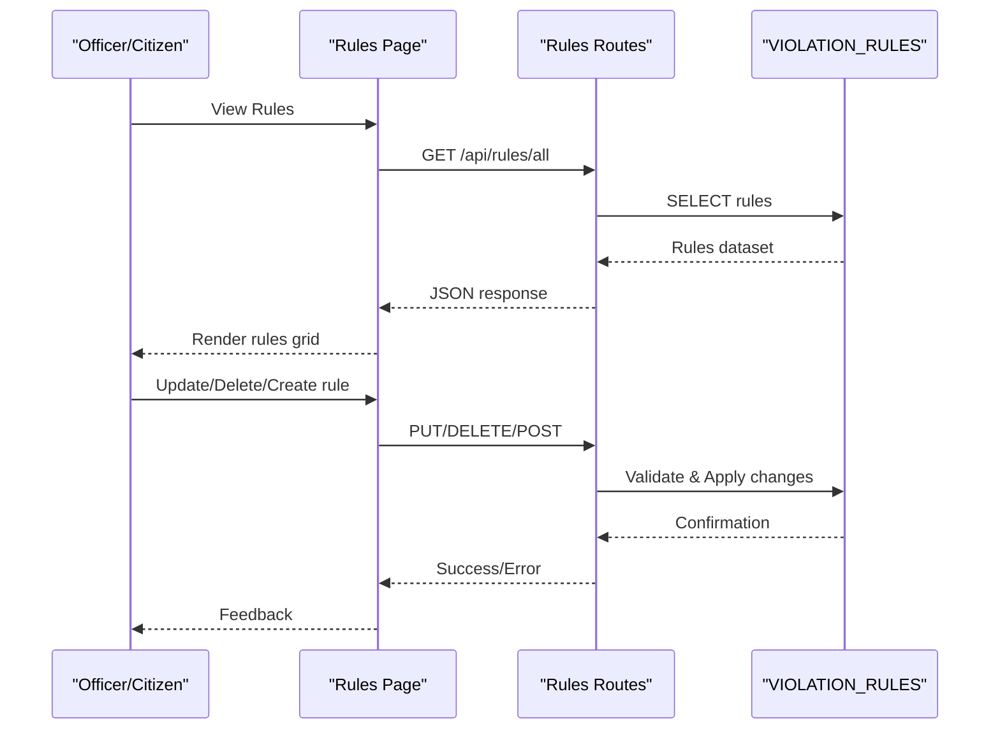
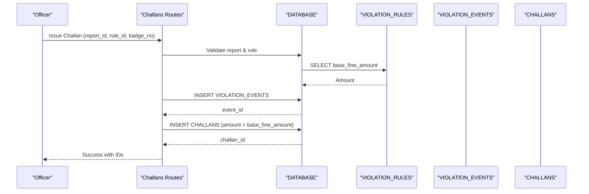
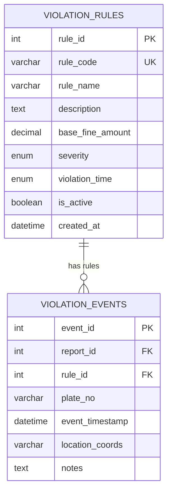
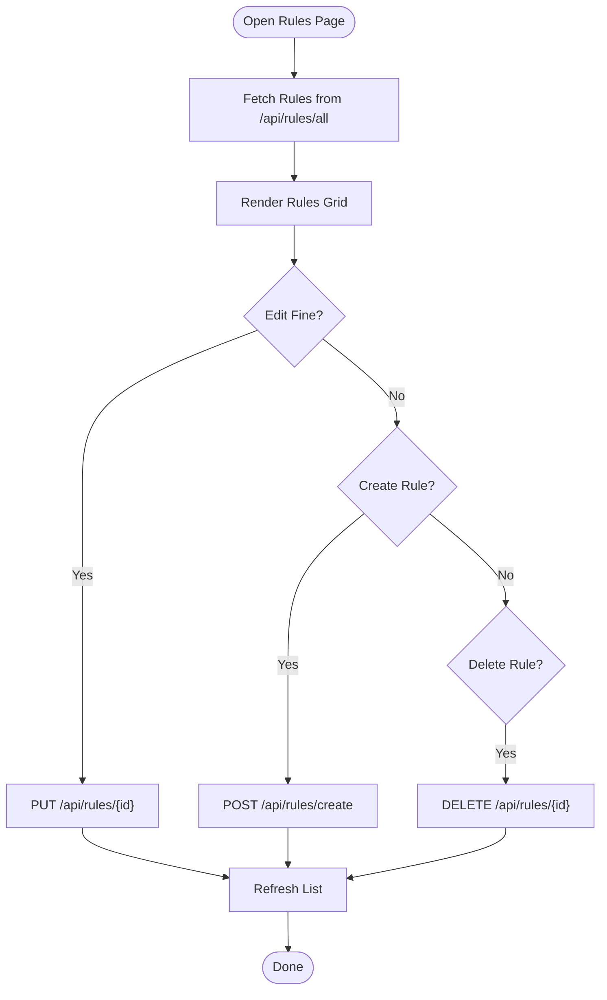
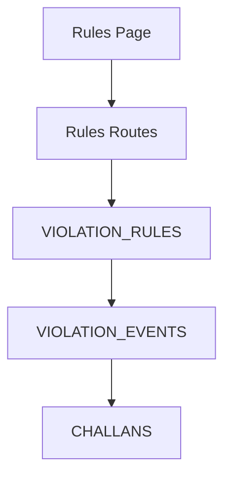

# VIOLATION_RULES - Traffic Violation Categories

<cite>
**Referenced Files in This Document**
- [schema.sql](file://db/schema.sql)
- [rules.py](file://server/routes/rules.py)
- [Rules.jsx](file://frontend/src/pages/Rules.jsx)
- [challans.py](file://server/routes/challans.py)
- [init_db.py](file://server/init_db.py)
</cite>

## Table of Contents
1. [Introduction](#introduction)
2. [Project Structure](#project-structure)
3. [Core Components](#core-components)
4. [Architecture Overview](#architecture-overview)
5. [Detailed Component Analysis](#detailed-component-analysis)
6. [Dependency Analysis](#dependency-analysis)
7. [Performance Considerations](#performance-considerations)
8. [Troubleshooting Guide](#troubleshooting-guide)
9. [Conclusion](#conclusion)

## Introduction
This document provides comprehensive documentation for the VIOLATION_RULES table, which serves as the master catalog of traffic violation categories in the Traffic Violation Management System. It defines the canonical structure of violations, including identifiers, descriptions, monetary penalties, enforcement priorities, and legal classification windows. The document explains the severity scale, violation time classifications, base fine amount validation, indexing strategy, and practical application in challan generation and the relationship with the VIOLATION_EVENTS table.

## Project Structure
The VIOLATION_RULES table is part of the production database schema and integrates with backend APIs and the frontend Rules page. The relevant components are:
- Database schema defining the table structure and constraints
- Backend FastAPI routes for CRUD operations on rules
- Frontend Rules page for displaying and managing rules
- Integration with VIOLATION_EVENTS and CHALLANS during enforcement

**Diagram sources**
- [schema.sql:99-111](file://db/schema.sql#L99-L111)
- [rules.py:58-377](file://server/routes/rules.py#L58-L377)
- [Rules.jsx:35-137](file://frontend/src/pages/Rules.jsx#L35-L137)

**Section sources**
- [schema.sql:99-111](file://db/schema.sql#L99-L111)
- [rules.py:58-377](file://server/routes/rules.py#L58-L377)
- [Rules.jsx:35-137](file://frontend/src/pages/Rules.jsx#L35-L137)

## Core Components
The VIOLATION_RULES table defines the canonical set of traffic violations used across the system. Below are the field definitions and their roles:

- rule_id: Unique identifier for each rule (primary key)
- rule_code: Unique alphanumeric code for the rule (e.g., SPD-001)
- rule_name: Human-readable name of the violation
- description: Detailed explanation of the violation
- base_fine_amount: Monetary penalty amount (validated > 0)
- severity: Enforcement priority level (Minor, Moderate, Major, Critical)
- violation_time: Legal classification window (Daytime, Nighttime, Anytime)
- is_active: Boolean flag to enable/disable rule usage
- created_at: Timestamp of rule creation

These fields collectively govern how violations are categorized, enforced, and monetized.

**Section sources**
- [schema.sql:100-111](file://db/schema.sql#L100-L111)

## Architecture Overview
The VIOLATION_RULES table is central to the enforcement pipeline:
- Frontend displays rules to citizens and allows authorized officers to manage them
- Backend validates inputs and persists changes to the database
- During enforcement, reports are linked to rules via VIOLATION_EVENTS, and CHALLANS are generated with the rule’s base fine amount

**Diagram sources**
- [Rules.jsx:35-137](file://frontend/src/pages/Rules.jsx#L35-L137)
- [rules.py:58-377](file://server/routes/rules.py#L58-L377)
- [schema.sql:100-111](file://db/schema.sql#L100-L111)

## Detailed Component Analysis

### Field Definitions and Constraints
- rule_id: Auto-incremented integer primary key
- rule_code: Unique, non-null varchar; validated for uniqueness
- rule_name: Non-null varchar; human-readable label
- description: Optional text field for explanatory notes
- base_fine_amount: Non-null decimal with precision 10,2; constrained to be greater than zero
- severity: Enum with values Minor, Moderate, Major, Critical; defaults to Moderate
- violation_time: Enum with values Daytime, Nighttime, Anytime; defaults to Anytime
- is_active: Boolean flag to activate/deactivate rules; defaults to true
- created_at: Timestamp with default current time

Indexing strategy:
- Index on severity (idx_rule_severity) to optimize severity-based queries
- Additional indexes exist on rule_code and is_active in the legacy initialization script

**Section sources**
- [schema.sql:100-111](file://db/schema.sql#L100-L111)
- [init_db.py:115-122](file://server/init_db.py#L115-L122)

### Severity Scale and Enforcement Priorities
The severity levels define enforcement priorities:
- Minor: Low-risk violations with lower penalties
- Moderate: Standard violations with moderate penalties
- Major: Significant violations with higher penalties
- Critical: Serious violations with highest penalties

Impact on enforcement:
- Higher severity violations often trigger stricter enforcement actions and higher financial penalties
- Enforcement workflows can prioritize Critical and Major violations for immediate review

Validation:
- Backend routes enforce that severity values are one of the four enumerated values

**Section sources**
- [rules.py:196-203](file://server/routes/rules.py#L196-L203)

### Violation Time Classifications
Legal implications:
- Daytime: Enforceable only during daylight hours
- Nighttime: Enforceable only during nighttime hours
- Anytime: Enforceable at any time

Use cases:
- DUI enforcement restricted to Nighttime aligns with typical enforcement schedules
- Anytime rules apply universally

Validation:
- Backend routes enforce that violation_time values are one of the three enumerated values

**Section sources**
- [rules.py:205-212](file://server/routes/rules.py#L205-L212)
- [schema.sql:868-880](file://db/schema.sql#L868-L880)

### Base Fine Amount Validation and Currency Formatting
Validation:
- Database constraint ensures base_fine_amount > 0
- Backend routes accept numeric values and convert Decimals to floats for JSON responses

Currency formatting:
- The system stores amounts as DECIMAL(10,2)
- Frontend highlights and categorizes fine amounts by color thresholds for readability

**Section sources**
- [schema.sql](file://db/schema.sql#L105)
- [rules.py:192-194](file://server/routes/rules.py#L192-L194)
- [Rules.jsx:147-151](file://frontend/src/pages/Rules.jsx#L147-L151)

### Indexing Strategy for Severity-Based Queries
- Index idx_rule_severity on severity enables efficient filtering by enforcement priority
- Additional indexes on rule_code and is_active support rule lookup and activation checks

Optimization opportunities:
- Consider composite indexes if frequent queries combine severity with is_active or rule_code
- Monitor query plans for enforcement dashboards and analytics views

**Section sources**
- [schema.sql](file://db/schema.sql#L110)
- [init_db.py:119-120](file://server/init_db.py#L119-L120)

### Rule Application in Challan Generation
The enforcement pipeline:
- Reports are reviewed and verified
- A VIOLATION_EVENT is created linking the report to a specific rule
- A CHALLAN is generated with the rule’s base_fine_amount as the total_amount
- Payment workflows adjust totals and statuses accordingly

Integration points:
- Backend challan routes create VIOLATION_EVENTS and CHALLANS
- Stored procedures encapsulate transactional enforcement steps

**Diagram sources**
- [challans.py:86-106](file://server/routes/challans.py#L86-L106)
- [schema.sql:154-167](file://db/schema.sql#L154-L167)
- [schema.sql:173-195](file://db/schema.sql#L173-L195)

**Section sources**
- [challans.py:86-106](file://server/routes/challans.py#L86-L106)
- [schema.sql:154-167](file://db/schema.sql#L154-L167)
- [schema.sql:173-195](file://db/schema.sql#L173-L195)

### Relationship with VIOLATION_EVENTS Table
- VIOLATION_EVENTS acts as a junction table linking REPORTS to VIOLATION_RULES
- Each event captures the rule_id, optional plate_no, location coordinates, and notes
- The foreign key constraint restricts deletion of rules that are still referenced by events

**Diagram sources**
- [schema.sql:100-111](file://db/schema.sql#L100-L111)
- [schema.sql:154-167](file://db/schema.sql#L154-L167)

**Section sources**
- [schema.sql:154-167](file://db/schema.sql#L154-L167)

### Frontend Integration and Management
- The Rules page fetches all rules via GET /api/rules/all
- Officers can create, update, and delete rules through dedicated endpoints
- The UI displays rule metadata and provides controls for editing fine amounts

**Diagram sources**
- [Rules.jsx:35-137](file://frontend/src/pages/Rules.jsx#L35-L137)
- [rules.py:58-377](file://server/routes/rules.py#L58-L377)

**Section sources**
- [Rules.jsx:35-137](file://frontend/src/pages/Rules.jsx#L35-L137)
- [rules.py:58-377](file://server/routes/rules.py#L58-L377)

## Dependency Analysis
- VIOLATION_RULES is referenced by VIOLATION_EVENTS via a foreign key
- CHALLANS are generated from VIOLATION_EVENTS, indirectly depending on VIOLATION_RULES
- Backend routes depend on database constraints and enums for validation
- Frontend depends on backend endpoints for rule lifecycle operations

**Diagram sources**
- [schema.sql:100-111](file://db/schema.sql#L100-L111)
- [schema.sql:154-167](file://db/schema.sql#L154-L167)
- [schema.sql:173-195](file://db/schema.sql#L173-L195)
- [rules.py:58-377](file://server/routes/rules.py#L58-L377)
- [Rules.jsx:35-137](file://frontend/src/pages/Rules.jsx#L35-L137)

**Section sources**
- [schema.sql:100-111](file://db/schema.sql#L100-L111)
- [schema.sql:154-167](file://db/schema.sql#L154-L167)
- [schema.sql:173-195](file://db/schema.sql#L173-L195)
- [rules.py:58-377](file://server/routes/rules.py#L58-L377)
- [Rules.jsx:35-137](file://frontend/src/pages/Rules.jsx#L35-L137)

## Performance Considerations
- Use the severity index for queries filtering by enforcement priority
- Consider adding composite indexes for frequent combinations (e.g., severity + is_active)
- Normalize rule_code lookups to leverage the unique constraint and index
- Monitor stored procedure performance for bulk enforcement operations

## Troubleshooting Guide
Common issues and resolutions:
- Invalid severity or violation_time values: Ensure values match the enumerated lists
- Duplicate rule_code: The uniqueness constraint prevents duplicates
- Negative or zero base_fine_amount: Database CHECK constraint enforces positive values
- Deleting active rules: Foreign key restrictions prevent deletion of rules linked to events

**Section sources**
- [rules.py:196-212](file://server/routes/rules.py#L196-L212)
- [rules.py:276-285](file://server/routes/rules.py#L276-L285)
- [schema.sql](file://db/schema.sql#L105)
- [schema.sql:162-163](file://db/schema.sql#L162-L163)

## Conclusion
The VIOLATION_RULES table is the authoritative source for traffic violation categories in the system. Its structured fields, constraints, and indexes enable robust enforcement workflows, while the integration with VIOLATION_EVENTS and CHALLANS ensures traceability and compliance. The backend and frontend components provide a secure, user-friendly interface for managing rules and applying them consistently during enforcement.