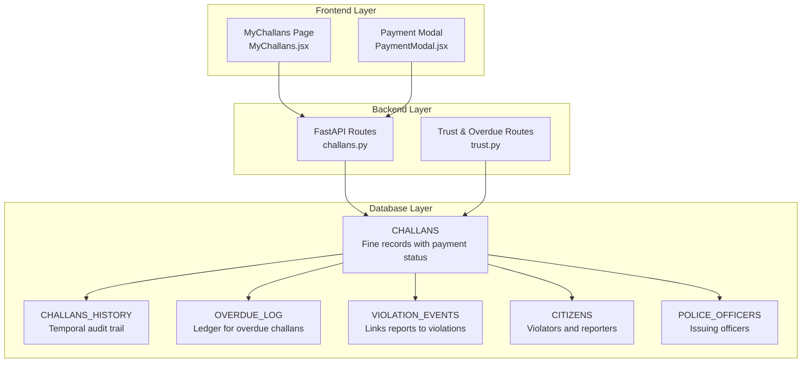
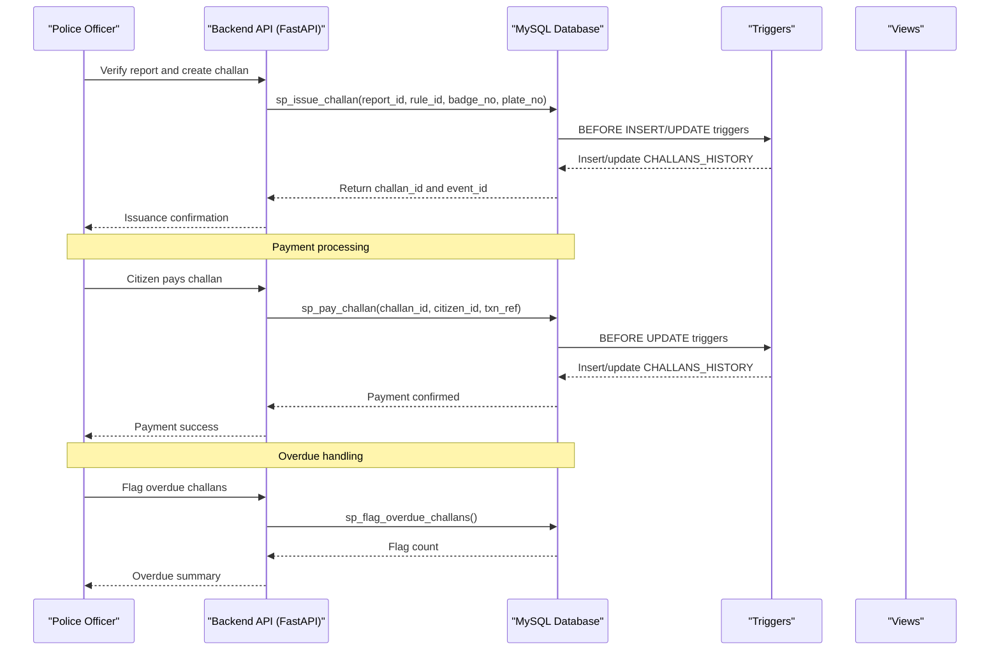
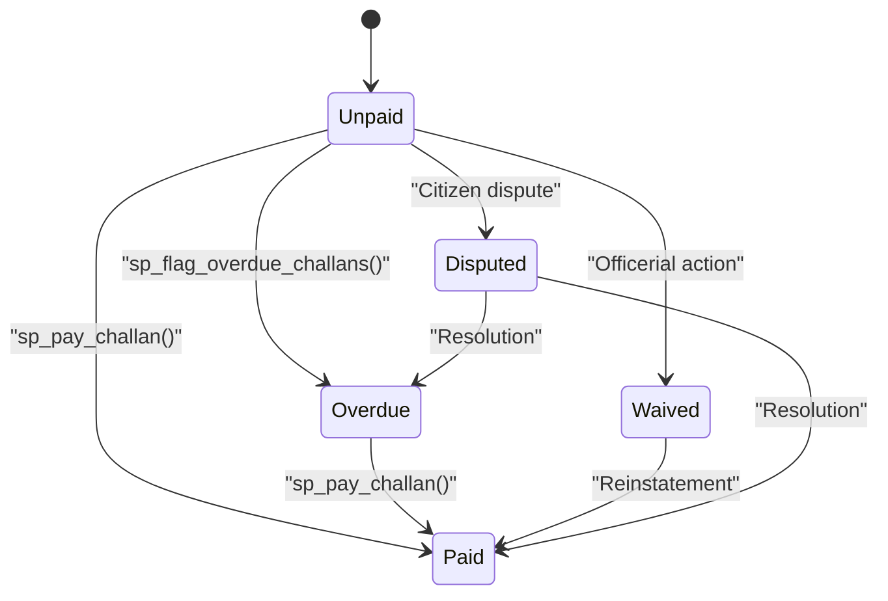
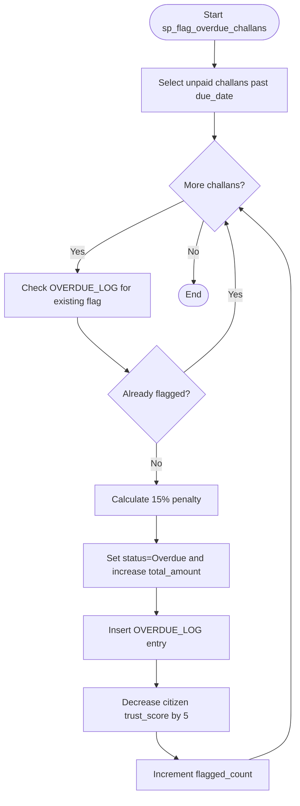
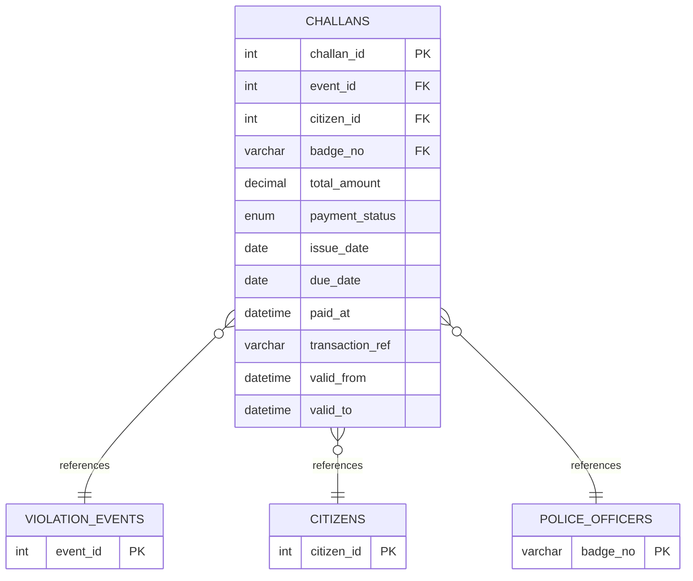
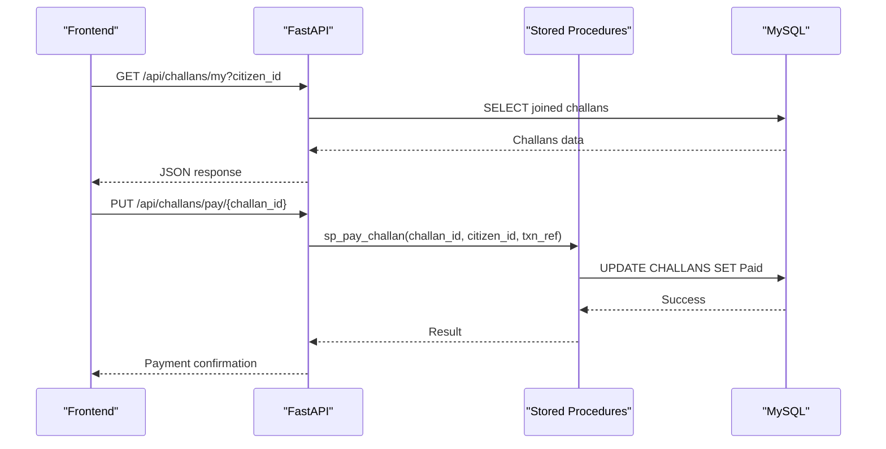
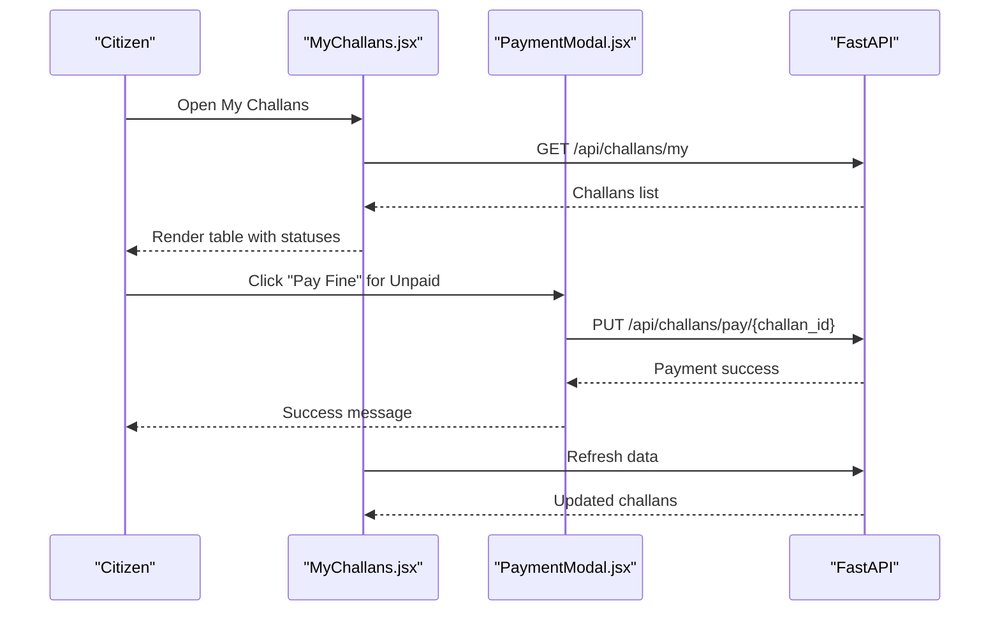
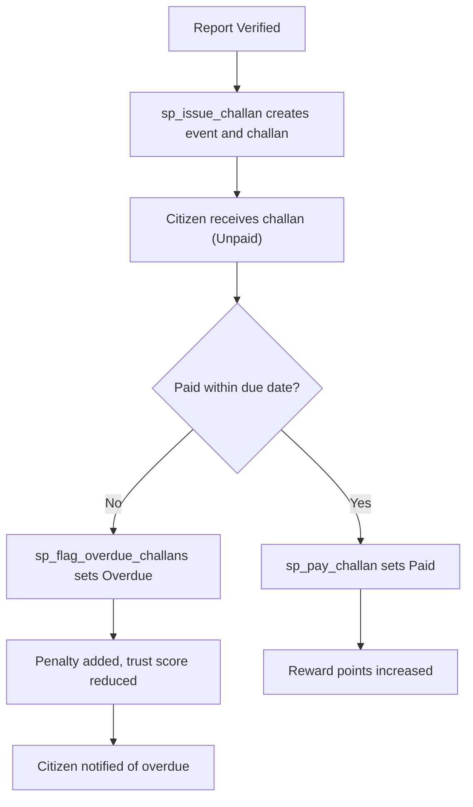
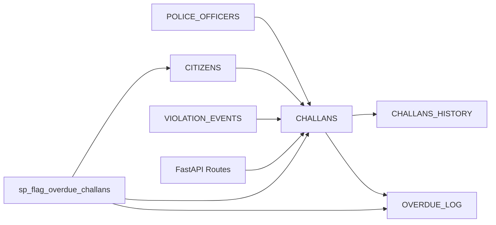

# CHALLANS - Traffic Fines and Penalties

<cite>
**Referenced Files in This Document**
- [schema.sql](file://db/schema.sql)
- [challans.py](file://server/routes/challans.py)
- [trust.py](file://server/routes/trust.py)
- [MyChallans.jsx](file://frontend/src/pages/MyChallans.jsx)
- [PaymentModal.jsx](file://frontend/src/components/PaymentModal.jsx)
- [test_challan_pipeline.py](file://server/test_challan_pipeline.py)
- [check_challan_schema.py](file://server/check_challan_schema.py)
</cite>

## Table of Contents
1. [Introduction](#introduction)
2. [Project Structure](#project-structure)
3. [Core Components](#core-components)
4. [Architecture Overview](#architecture-overview)
5. [Detailed Component Analysis](#detailed-component-analysis)
6. [Dependency Analysis](#dependency-analysis)
7. [Performance Considerations](#performance-considerations)
8. [Troubleshooting Guide](#troubleshooting-guide)
9. [Conclusion](#conclusion)

## Introduction
This document provides comprehensive documentation for the CHALLANS table that manages traffic fines and penalties in the Traffic Violation Management System. It defines all CHALLANS fields, explains the payment status workflow, details overdue penalty calculations, describes foreign key relationships, and outlines indexing strategies. It also covers the end-to-end challan lifecycle from issuance to payment and integration with payment processing.

## Project Structure
The CHALLANS table is part of the production database schema and integrates with backend APIs, triggers, stored procedures, and the frontend dashboard.

**Diagram sources**
- [schema.sql:170-235](file://db/schema.sql#L170-L235)
- [challans.py:1-450](file://server/routes/challans.py#L1-L450)
- [trust.py:104-133](file://server/routes/trust.py#L104-L133)
- [MyChallans.jsx:1-207](file://frontend/src/pages/MyChallans.jsx#L1-L207)
- [PaymentModal.jsx:1-99](file://frontend/src/components/PaymentModal.jsx#L1-L99)

**Section sources**
- [schema.sql:170-235](file://db/schema.sql#L170-L235)
- [challans.py:1-450](file://server/routes/challans.py#L1-L450)
- [trust.py:104-133](file://server/routes/trust.py#L104-L133)
- [MyChallans.jsx:1-207](file://frontend/src/pages/MyChallans.jsx#L1-L207)
- [PaymentModal.jsx:1-99](file://frontend/src/components/PaymentModal.jsx#L1-L99)

## Core Components
This section defines the CHALLANS table fields and their roles in the system.

- challan_id: Primary key for the challan record.
- event_id: Foreign key to VIOLATION_EVENTS linking the challan to a specific violation event.
- citizen_id: Foreign key to CITIZENS representing the violator.
- badge_no: Foreign key to POLICE_OFFICERS indicating the issuing officer.
- total_amount: Decimal amount of the fine; must be greater than zero.
- payment_status: Enum with values Unpaid, Paid, Overdue, Waived, Disputed; default Unpaid.
- issue_date: Date when the challan was issued.
- due_date: Date by which the challan must be paid.
- paid_at: Timestamp when the challan was marked Paid.
- transaction_ref: Reference identifier for the payment transaction.
- valid_from / valid_to: Temporal columns enabling historical tracking of changes.
- created_at / updated_at: Audit timestamps for record creation and updates.

Constraints and indexes:
- Foreign keys enforce referential integrity with VIOLATION_EVENTS, CITIZENS, and POLICE_OFFICERS.
- Indexes on payment_status, due_date, and issue_date support efficient querying.

**Section sources**
- [schema.sql:170-235](file://db/schema.sql#L170-L235)

## Architecture Overview
The CHALLANS lifecycle spans report verification, challan issuance, payment processing, and overdue handling. Stored procedures and triggers maintain data integrity and audit trails.

**Diagram sources**
- [schema.sql:440-546](file://db/schema.sql#L440-L546)
- [schema.sql:552-629](file://db/schema.sql#L552-L629)
- [schema.sql:688-754](file://db/schema.sql#L688-L754)
- [challans.py:47-139](file://server/routes/challans.py#L47-L139)
- [trust.py:104-133](file://server/routes/trust.py#L104-L133)

## Detailed Component Analysis

### CHALLANS Field Definitions and Constraints
- Primary key: challan_id
- Foreign keys:
  - event_id references VIOLATION_EVENTS(event_id) with cascade delete
  - citizen_id references CITIZENS(citizen_id) with cascade delete
  - badge_no references POLICE_OFFICERS(badge_no) with restrict
- Check constraint: total_amount > 0
- Enum: payment_status with default Unpaid
- Temporal: valid_from, valid_to for historical tracking
- Audit: created_at, updated_at

Indexes:
- idx_challan_status(payment_status)
- idx_challan_citizen(citizen_id)
- idx_challan_due(due_date)
- idx_challan_issued(issue_date)

**Section sources**
- [schema.sql:170-235](file://db/schema.sql#L170-L235)

### Payment Status Workflow
The payment status transitions through Unpaid, Paid, Overdue, Waived, and Disputed. The system supports:
- Unpaid: Initial state until payment or action occurs.
- Paid: Successfully paid by the citizen.
- Overdue: Automatically flagged when past due_date and not Paid/Waived/Disputed.
- Waived: Officerially forgiven; no payment required.
- Disputed: Under dispute resolution; payment suspended until resolved.

**Diagram sources**
- [schema.sql:178-179](file://db/schema.sql#L178-L179)
- [schema.sql:552-629](file://db/schema.sql#L552-L629)
- [schema.sql:688-754](file://db/schema.sql#L688-L754)

**Section sources**
- [schema.sql:178-179](file://db/schema.sql#L178-L179)
- [schema.sql:552-629](file://db/schema.sql#L552-L629)
- [schema.sql:688-754](file://db/schema.sql#L688-L754)

### Overdue Penalty Calculation and Trust Impact
Overdue processing:
- Procedure scans unpaid challans whose due_date is earlier than the current date.
- Applies a 15% late penalty on total_amount and updates payment_status to Overdue.
- Logs entries in OVERDUE_LOG with original and penalty amounts.
- Decreases the citizen’s trust_score by 5 points (minimum 0).

**Diagram sources**
- [schema.sql:688-754](file://db/schema.sql#L688-L754)

**Section sources**
- [schema.sql:688-754](file://db/schema.sql#L688-L754)

### Foreign Key Relationships
CHALLANS maintains referential integrity with:
- VIOLATION_EVENTS(event_id): Ensures each challan corresponds to a valid violation event.
- CITIZENS(citizen_id): Links the challan to the violator.
- POLICE_OFFICERS(badge_no): Records the issuing officer.

**Diagram sources**
- [schema.sql:170-235](file://db/schema.sql#L170-L235)

**Section sources**
- [schema.sql:170-235](file://db/schema.sql#L170-L235)

### Indexing Strategy for Payment Status and Due Date Queries
- idx_challan_status(payment_status): Optimizes filtering by payment status for dashboards and overdue checks.
- idx_challan_due(due_date): Supports overdue identification and aging queries.
- idx_challan_citizen(citizen_id): Efficient retrieval of a citizen’s challans.
- idx_challan_issued(issue_date): Facilitates challan aging and reporting.

These indexes enable:
- Real-time citizen dashboards to filter Unpaid challans.
- Overdue processing to scan only relevant records.
- Historical reporting by date ranges.

**Section sources**
- [schema.sql:190-194](file://db/schema.sql#L190-L194)

### Backend API Integration
- Create challan: FastAPI route constructs CHALLANS via stored procedure sp_issue_challan, ensuring report verification and event linkage.
- Retrieve challans: Routes provide citizen-specific challans with joined details from VIOLATION_EVENTS, REPORTS, and VIOLATION_RULES.
- Payment processing: Route sp_pay_challan updates status to Paid and increments reward points for timely payment.
- Overdue flagging: Route calls sp_flag_overdue_challans to process overdue challans.

**Diagram sources**
- [challans.py:141-274](file://server/routes/challans.py#L141-L274)
- [challans.py:336-398](file://server/routes/challans.py#L336-L398)
- [schema.sql:440-546](file://db/schema.sql#L440-L546)
- [schema.sql:552-629](file://db/schema.sql#L552-L629)

**Section sources**
- [challans.py:47-139](file://server/routes/challans.py#L47-L139)
- [challans.py:141-274](file://server/routes/challans.py#L141-L274)
- [challans.py:336-398](file://server/routes/challans.py#L336-L398)
- [schema.sql:440-546](file://db/schema.sql#L440-L546)
- [schema.sql:552-629](file://db/schema.sql#L552-L629)

### Frontend Integration
- MyChallans page displays challans with status badges, due dates, and actions.
- PaymentModal handles payment confirmation and communicates with the backend.
- Real-time refresh ensures up-to-date status after payment.

**Diagram sources**
- [MyChallans.jsx:1-207](file://frontend/src/pages/MyChallans.jsx#L1-L207)
- [PaymentModal.jsx:1-99](file://frontend/src/components/PaymentModal.jsx#L1-L99)
- [challans.py:336-398](file://server/routes/challans.py#L336-L398)

**Section sources**
- [MyChallans.jsx:1-207](file://frontend/src/pages/MyChallans.jsx#L1-L207)
- [PaymentModal.jsx:1-99](file://frontend/src/components/PaymentModal.jsx#L1-L99)
- [challans.py:336-398](file://server/routes/challans.py#L336-L398)

### Example: Challan Lifecycle Management
- Report verification: Officer verifies a report and invokes sp_issue_challan to create VIOLATION_EVENTS and CHALLANS.
- Payment: Citizen pays via PaymentModal; backend executes sp_pay_challan and updates CHALLANS and CITIZENS.
- Overdue: Officer runs manual overdue flagging; backend calls sp_flag_overdue_challans to apply penalties and adjust trust scores.

**Diagram sources**
- [schema.sql:440-546](file://db/schema.sql#L440-L546)
- [schema.sql:552-629](file://db/schema.sql#L552-L629)
- [schema.sql:688-754](file://db/schema.sql#L688-L754)

**Section sources**
- [schema.sql:440-546](file://db/schema.sql#L440-L546)
- [schema.sql:552-629](file://db/schema.sql#L552-L629)
- [schema.sql:688-754](file://db/schema.sql#L688-L754)

## Dependency Analysis
- CHALLANS depends on VIOLATION_EVENTS for event linkage, CITIZENS for violator identity, and POLICE_OFFICERS for issuing officer.
- Triggers maintain CHALLANS_HISTORY for temporal auditing.
- Stored procedures encapsulate business logic for issuance, payment, and overdue flagging.
- Frontend components depend on backend endpoints for data and actions.

**Diagram sources**
- [schema.sql:170-235](file://db/schema.sql#L170-L235)
- [schema.sql:384-429](file://db/schema.sql#L384-L429)
- [schema.sql:688-754](file://db/schema.sql#L688-L754)
- [challans.py:1-450](file://server/routes/challans.py#L1-L450)

**Section sources**
- [schema.sql:170-235](file://db/schema.sql#L170-L235)
- [schema.sql:384-429](file://db/schema.sql#L384-L429)
- [schema.sql:688-754](file://db/schema.sql#L688-L754)
- [challans.py:1-450](file://server/routes/challans.py#L1-L450)

## Performance Considerations
- Use indexes on payment_status and due_date to optimize frequent queries for overdue and status filtering.
- Batch processing via stored procedures reduces application-level loops and improves throughput.
- Triggers ensure audit trails without burdening application code.
- Consider partitioning or materialized views for large-scale reporting on CHALLANS.

## Troubleshooting Guide
Common issues and resolutions:
- Challan not found during payment: Verify challan_id and ownership checks in payment route.
- Double payment attempts: Backend uses row-level locking to prevent concurrent updates.
- Overdue not flagged: Ensure scheduled job or manual trigger execution for sp_flag_overdue_challans.
- Schema mismatches: Use schema checker script to confirm column definitions.

**Section sources**
- [challans.py:336-398](file://server/routes/challans.py#L336-L398)
- [trust.py:104-133](file://server/routes/trust.py#L104-L133)
- [check_challan_schema.py:1-25](file://server/check_challan_schema.py#L1-L25)

## Conclusion
The CHALLANS table centralizes traffic fine management with robust foreign key relationships, temporal auditing, and integrated payment and overdue workflows. The combination of stored procedures, triggers, and frontend dashboards enables a secure, auditable, and user-friendly system for managing challans from issuance to resolution.