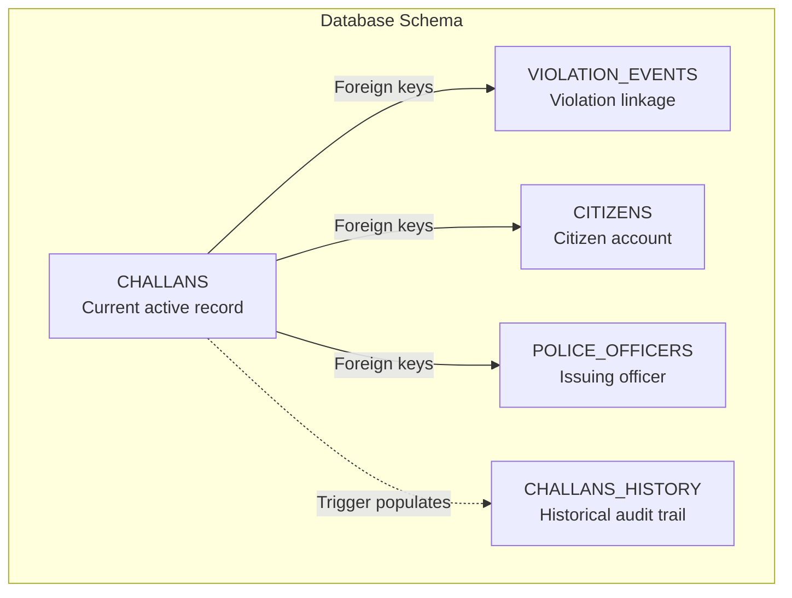
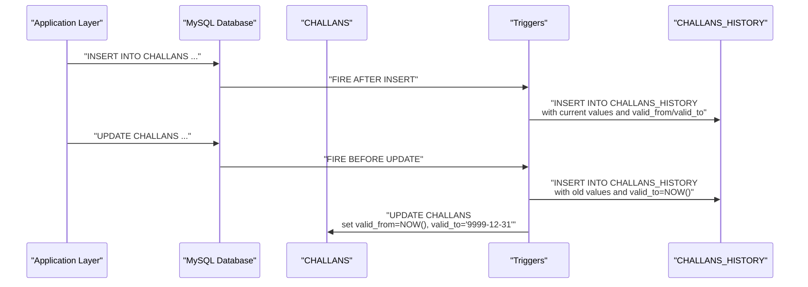
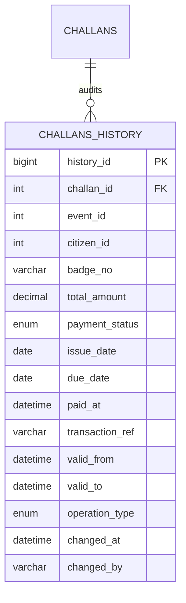
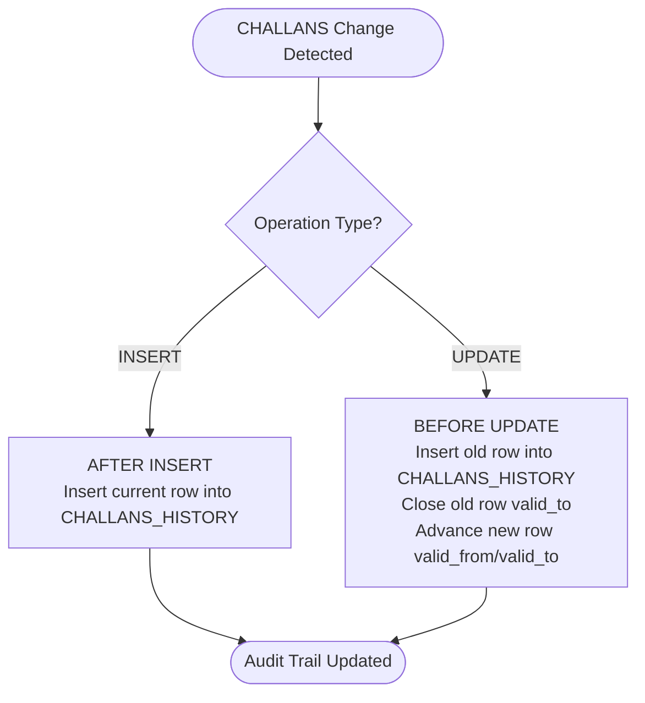
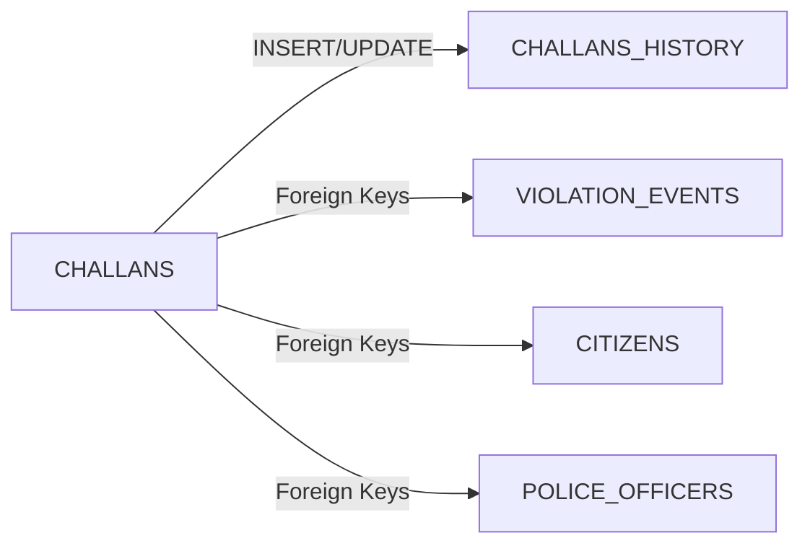

# CHALLANS_HISTORY - Temporal Audit Trail

<cite>
**Referenced Files in This Document**
- [schema.sql](file://db/schema.sql)
- [database_triggers.sql](file://db/database_triggers.sql)
- [marga_rakshak_triggers.sql](file://db/marga_rakshak_triggers.sql)
- [challans.js](file://backend/routes/challans.js)
- [db.js](file://backend/db.js)
- [verify_complete_system.py](file://scripts/verify_complete_system.py)
</cite>

## Table of Contents
1. [Introduction](#introduction)
2. [Project Structure](#project-structure)
3. [Core Components](#core-components)
4. [Architecture Overview](#architecture-overview)
5. [Detailed Component Analysis](#detailed-component-analysis)
6. [Dependency Analysis](#dependency-analysis)
7. [Performance Considerations](#performance-considerations)
8. [Troubleshooting Guide](#troubleshooting-guide)
9. [Conclusion](#conclusion)

## Introduction
This document provides comprehensive documentation for the CHALLANS_HISTORY table, which maintains a temporal audit trail for all adjustments made to traffic challan records. It explains the schema, temporal versioning semantics, trigger-based population mechanism, and indexing strategy. It also outlines how CHALLANS_HISTORY relates to the CHALLANS table and demonstrates practical approaches for retrieving historical records and performing audit trail analysis.

## Project Structure
The CHALLANS_HISTORY table is part of the Traffic Violation Management System’s production database schema. It resides alongside core entities such as CITIZENS, CHALLANS, VIOLATION_EVENTS, and supporting tables. Triggers automatically populate CHALLANS_HISTORY on insert and update operations against CHALLANS, ensuring a complete temporal audit trail.

**Diagram sources**
- [schema.sql:173-219](file://db/schema.sql#L173-L219)

**Section sources**
- [schema.sql:173-219](file://db/schema.sql#L173-L219)

## Core Components
The CHALLANS_HISTORY table captures the complete lifecycle of a challan’s temporal state. Each historical record preserves the values that were in effect during a specific period, enabling accurate audit and compliance reporting.

Key fields and their roles:
- history_id: Unique identifier for each historical record.
- challan_id: Foreign key linking to the CHALLANS record being audited.
- event_id: Links to the underlying violation event.
- citizen_id: Identifies the affected citizen.
- badge_no: Identifies the issuing officer.
- total_amount: Fine amount at the time of the recorded change.
- payment_status: Status at the time of the recorded change.
- issue_date/due_date: Dates associated with the challan at the time of change.
- paid_at: Timestamp when the challan was marked paid (nullable).
- transaction_ref: Reference for the payment transaction (nullable).
- valid_from/valid_to: Temporal period indicating when the record was valid.
- operation_type: Indicates whether the change was an INSERT, UPDATE, or DELETE.
- changed_at: Timestamp when the historical record was created.
- changed_by: Identifier of who or what initiated the change (default SYSTEM).

Temporal versioning semantics:
- valid_from marks the start of a record’s validity.
- valid_to marks the end of validity; for active/current records, valid_to is set to a far-future sentinel value.
- On updates, the previous record’s valid_to is closed by setting it to the timestamp of the change, and a new record starts with valid_from set to the change time and valid_to set to the sentinel.

Relationship with CHALLANS:
- CHALLANS stores the current state of a challan.
- CHALLANS_HISTORY stores all prior states, enabling time-based queries and audit trails.

**Section sources**
- [schema.sql:198-219](file://db/schema.sql#L198-L219)
- [schema.sql:384-429](file://db/schema.sql#L384-L429)

## Architecture Overview
The temporal audit trail is populated automatically via MySQL triggers. The system ensures that every insert and update to CHALLANS creates a corresponding historical record in CHALLANS_HISTORY, preserving the exact values and timestamps for auditability.

**Diagram sources**
- [schema.sql:384-429](file://db/schema.sql#L384-L429)

**Section sources**
- [schema.sql:384-429](file://db/schema.sql#L384-L429)

## Detailed Component Analysis

### CHALLANS_HISTORY Schema
The table definition establishes the audit trail structure with appropriate constraints and indexes for efficient temporal queries.

**Diagram sources**
- [schema.sql:198-219](file://db/schema.sql#L198-L219)

**Section sources**
- [schema.sql:198-219](file://db/schema.sql#L198-L219)

### Trigger-Based Population Mechanism
Two triggers are responsible for maintaining CHALLANS_HISTORY:
- BEFORE UPDATE on CHALLANS: Captures the old row into CHALLANS_HISTORY and advances the valid_from/valid_to on the new row.
- AFTER INSERT on CHALLANS: Logs the newly inserted row into CHALLANS_HISTORY.

**Diagram sources**
- [schema.sql:384-429](file://db/schema.sql#L384-L429)

**Section sources**
- [schema.sql:384-429](file://db/schema.sql#L384-L429)

### Indexing Strategy for Temporal Queries
Efficient retrieval of historical records relies on strategic indexing:
- idx_chh_challan: Supports queries filtering by challan_id.
- idx_chh_period: Supports range queries over valid_from and valid_to, enabling temporal filtering.

These indexes optimize:
- Retrieving all historical versions of a specific challan.
- Finding the active or effective version of a challan at a given point in time.
- Performing time-bound analyses across multiple challans.

**Section sources**
- [schema.sql:217-218](file://db/schema.sql#L217-L218)

### Relationship with CHALLANS and Other Entities
- CHALLANS_HISTORY holds copies of CHALLANS fields at the time of change, including foreign keys to VIOLATION_EVENTS, CITIZENS, and POLICE_OFFICERS.
- The temporal columns (valid_from/valid_to) in CHALLANS_HISTORY mirror the temporal model used in other tables, ensuring consistency across the system.

**Section sources**
- [schema.sql:173-219](file://db/schema.sql#L173-L219)

### Practical Examples: Historical Record Retrieval and Audit Trail Analysis
Below are example queries demonstrating how to retrieve historical records and analyze audit trails. These examples illustrate typical use cases without exposing specific code content.

- Retrieve all historical versions of a specific challan:
  - Filter CHALLANS_HISTORY by challan_id and order by valid_from to observe the chronological sequence of changes.
  - Use idx_chh_challan to efficiently locate all versions for a given challan.

- Find the effective state of a challan at a specific point in time:
  - Select records where valid_from ≤ target_datetime and valid_to > target_datetime.
  - Use idx_chh_period to optimize range scans.

- Analyze payment status transitions:
  - Group by challan_id and examine payment_status changes over time.
  - Identify when a challan moved from Unpaid to Paid, Overdue, or Waived.

- Identify who made changes and when:
  - Filter by changed_by to attribute actions to specific users or systems.
  - Combine with changed_at to reconstruct timelines.

Note: The backend routes for challans focus on current operations (fetching and payment). The audit trail retrieval is typically performed directly against CHALLANS_HISTORY using the above patterns.

**Section sources**
- [schema.sql:217-218](file://db/schema.sql#L217-L218)
- [challans.js:1-101](file://backend/routes/challans.js#L1-L101)

## Dependency Analysis
The CHALLANS_HISTORY table depends on:
- CHALLANS: Provides the source of truth for inserts and updates.
- CHALLANS_HISTORY: Maintains historical snapshots with temporal semantics.
- Supporting entities: VIOLATION_EVENTS, CITIZENS, POLICE_OFFICERS provide referential integrity and context.

**Diagram sources**
- [schema.sql:173-219](file://db/schema.sql#L173-L219)

**Section sources**
- [schema.sql:173-219](file://db/schema.sql#L173-L219)

## Performance Considerations
- Index utilization: Ensure queries leverage idx_chh_challan and idx_chh_period to avoid full table scans during temporal filtering.
- Trigger overhead: Triggers add minimal latency to INSERT/UPDATE operations but provide robust auditability.
- Data growth: Historical tables can grow substantially; consider retention policies and archiving strategies if needed.
- Concurrency: The triggers operate within the same transaction boundaries as the CHALLANS operations, maintaining consistency.

[No sources needed since this section provides general guidance]

## Troubleshooting Guide
Common issues and resolutions:
- Missing historical records:
  - Verify that triggers are installed and enabled.
  - Confirm that CHALLANS operations are firing the expected triggers.
- Incorrect temporal periods:
  - Check that valid_from/valid_to values are correctly set during updates.
  - Ensure that the BEFORE UPDATE trigger closes the previous record and advances the new record.
- Slow historical queries:
  - Confirm proper use of indexes idx_chh_challan and idx_chh_period.
  - Avoid SELECT * on large historical datasets; filter early and limit results.

Verification steps:
- Use system verification scripts to confirm that audit trails (CITIZENS_HISTORY, CHALLANS_HISTORY) are present and functioning.
- Validate trigger installation and behavior using database inspection queries.

**Section sources**
- [verify_complete_system.py:225-231](file://scripts/verify_complete_system.py#L225-L231)
- [schema.sql:384-429](file://db/schema.sql#L384-L429)

## Conclusion
CHALLANS_HISTORY provides a robust temporal audit trail for challan adjustments, ensuring complete traceability of all changes. Through trigger-based population and carefully designed temporal columns and indexes, the system supports accurate historical analysis, compliance reporting, and operational oversight. By leveraging the provided indexes and query patterns, stakeholders can efficiently retrieve historical records and perform comprehensive audit trail analysis.