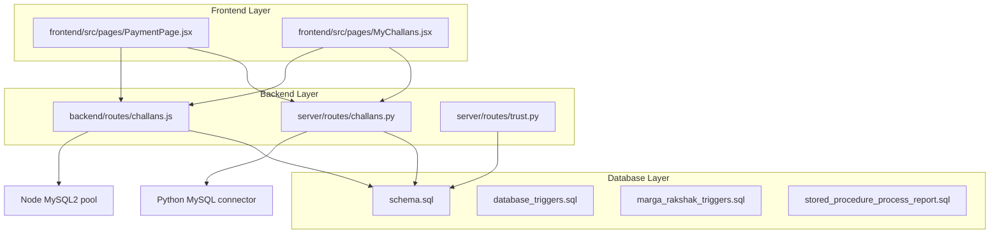
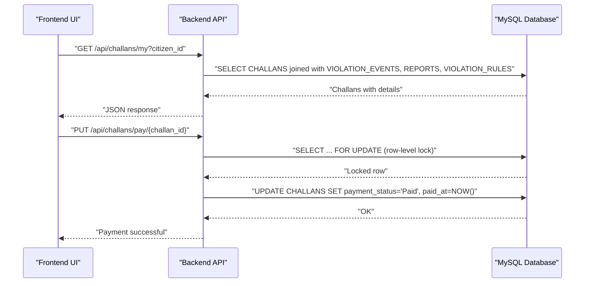
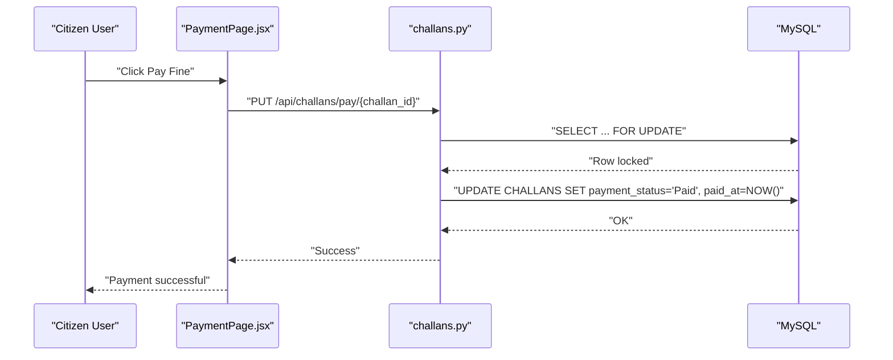
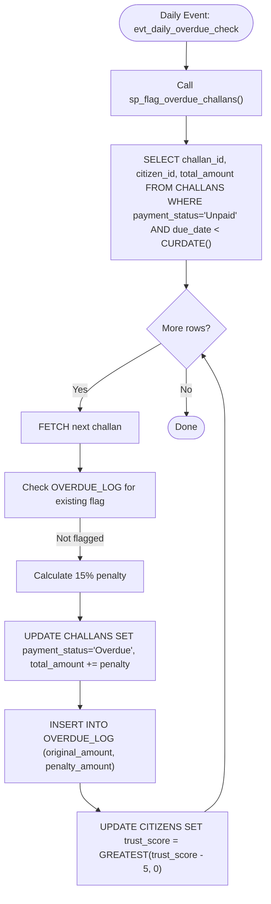
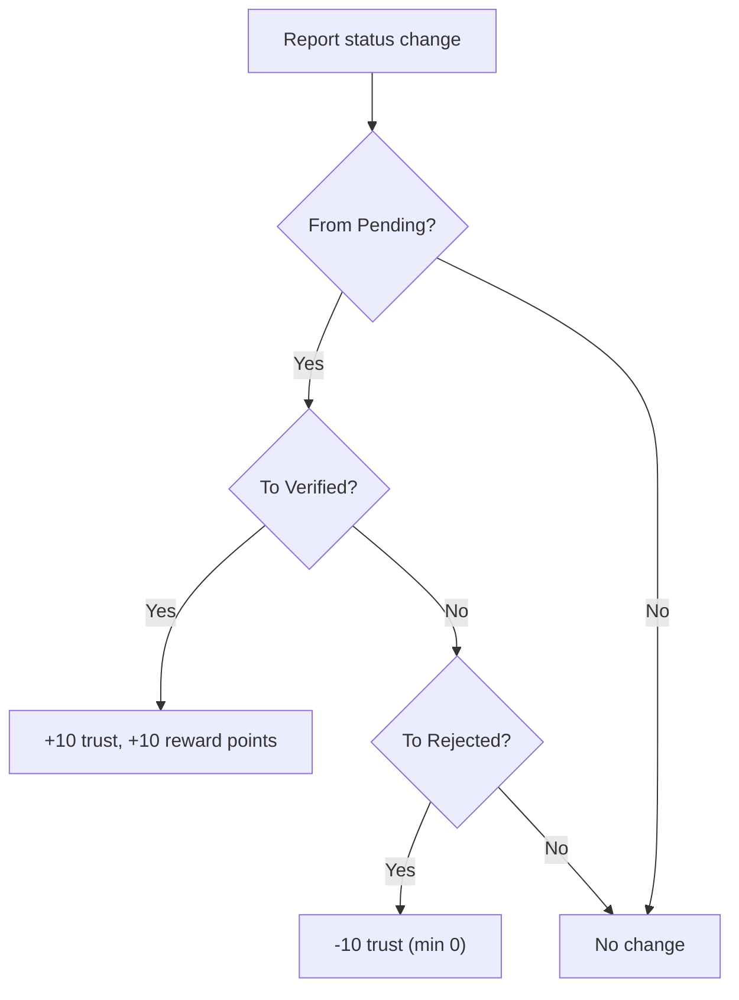
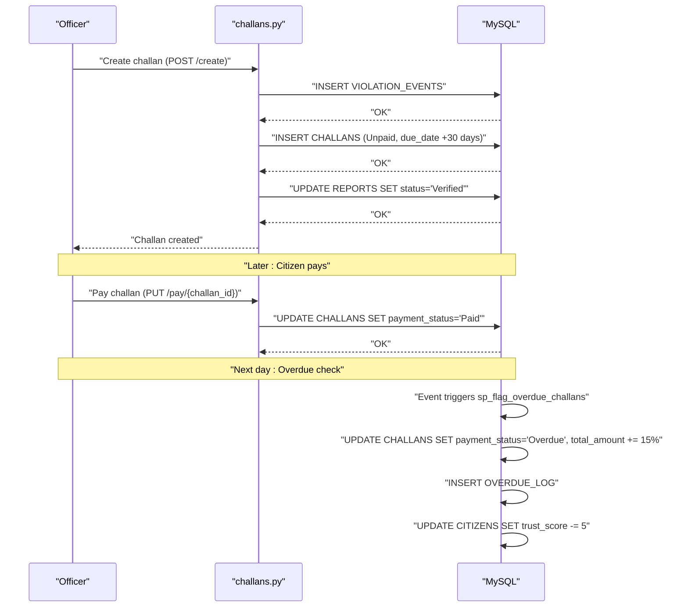
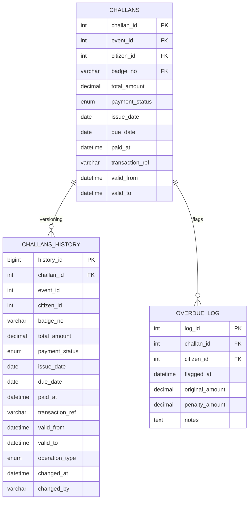

# Financial and Challan Tables

<cite>
**Referenced Files in This Document**
- [schema.sql](file://db/schema.sql)
- [database_triggers.sql](file://db/database_triggers.sql)
- [marga_rakshak_triggers.sql](file://db/marga_rakshak_triggers.sql)
- [stored_procedure_process_report.sql](file://db/stored_procedure_process_report.sql)
- [trust.py](file://server/routes/trust.py)
- [challans.py](file://server/routes/challans.py)
- [challans.js](file://backend/routes/challans.js)
- [PaymentPage.jsx](file://frontend/src/pages/PaymentPage.jsx)
- [MyChallans.jsx](file://frontend/src/pages/MyChallans.jsx)
</cite>

## Table of Contents
1. [Introduction](#introduction)
2. [Project Structure](#project-structure)
3. [Core Components](#core-components)
4. [Architecture Overview](#architecture-overview)
5. [Detailed Component Analysis](#detailed-component-analysis)
6. [Dependency Analysis](#dependency-analysis)
7. [Performance Considerations](#performance-considerations)
8. [Troubleshooting Guide](#troubleshooting-guide)
9. [Conclusion](#conclusion)

## Introduction
This document provides comprehensive documentation for the financial and challan-related tables that manage traffic fines and payments in the Traffic Violation Management System. It focuses on:
- CHALLANS: complete field definitions, referential integrity, and payment lifecycle
- CHALLANS_HISTORY: temporal audit trail structure
- OVERDUE_LOG: overdue challan ledger functionality
- Payment workflow, overdue penalty calculation, and trust score penalties
- Referential integrity constraints and cascade behaviors
- Indexing strategies for payment status and due date queries
- Examples of challan lifecycle management and automated overdue processing

## Project Structure
The financial and challan domain spans three layers:
- Database schema and stored procedures
- Backend API routes (Python FastAPI and Node.js Express)
- Frontend user interfaces for challan viewing and payment simulation

**Diagram sources**
- [schema.sql](file://db/schema.sql)
- [database_triggers.sql](file://db/database_triggers.sql)
- [marga_rakshak_triggers.sql](file://db/marga_rakshak_triggers.sql)
- [stored_procedure_process_report.sql](file://db/stored_procedure_process_report.sql)
- [challans.py](file://server/routes/challans.py)
- [challans.js](file://backend/routes/challans.js)
- [trust.py](file://server/routes/trust.py)
- [PaymentPage.jsx](file://frontend/src/pages/PaymentPage.jsx)
- [MyChallans.jsx](file://frontend/src/pages/MyChallans.jsx)

**Section sources**
- [schema.sql](file://db/schema.sql)
- [challans.py](file://server/routes/challans.py)
- [challans.js](file://backend/routes/challans.js)
- [PaymentPage.jsx](file://frontend/src/pages/PaymentPage.jsx)
- [MyChallans.jsx](file://frontend/src/pages/MyChallans.jsx)

## Core Components
This section documents the three core tables involved in financial and challan management.

### CHALLANS
Primary table for traffic fines and penalties. Key fields and constraints:
- Primary key: challan_id
- Foreign keys:
  - event_id → VIOLATION_EVENTS(event_id) with ON DELETE CASCADE
  - citizen_id → CITIZENS(citizen_id) with ON DELETE CASCADE
  - badge_no → POLICE_OFFICERS(badge_no) with ON DELETE RESTRICT
- Business fields:
  - total_amount: DECIMAL(10,2), positive amount
  - payment_status: ENUM('Unpaid','Paid','Overdue','Waived','Disputed')
  - issue_date: DATE
  - due_date: DATE
  - paid_at: DATETIME (nullable)
  - transaction_ref: VARCHAR(100) (nullable)
- Temporal columns:
  - valid_from, valid_to for versioning
- Audit timestamps:
  - created_at, updated_at
- Indexes:
  - idx_challan_status (payment_status)
  - idx_challan_citizen (citizen_id)
  - idx_challan_due (due_date)
  - idx_challan_issued (issue_date)

Referential integrity and cascade behaviors:
- Deleting a violation event cascades to challans
- Deleting a citizen cascades to challans
- Deleting an officer is restricted if referenced by challans

**Section sources**
- [schema.sql](file://db/schema.sql)

### CHALLANS_HISTORY
Temporal audit trail capturing all changes to CHALLANS:
- Primary key: history_id
- Copy of CHALLANS fields: challan_id, event_id, citizen_id, badge_no, total_amount, payment_status, issue_date, due_date, paid_at, transaction_ref
- Temporal fields: valid_from, valid_to
- Operation metadata: operation_type ('INSERT','UPDATE','DELETE'), changed_at, changed_by
- Indexes:
  - idx_chh_challan (challan_id)
  - idx_chh_period (valid_from, valid_to)

Triggers:
- BEFORE UPDATE on CHALLANS inserts a snapshot with valid_to set to NOW() and advances NEW.valid_from
- AFTER INSERT on CHALLANS inserts initial snapshot with valid_to set to '9999-12-31 23:59:59'

**Section sources**
- [schema.sql](file://db/schema.sql)

### OVERDUE_LOG
Ledger for flagged overdue challans:
- Primary key: log_id
- Fields: challan_id, citizen_id, flagged_at (default CURRENT_TIMESTAMP), original_amount, penalty_amount, notes
- Foreign keys:
  - challan_id → CHALLANS(challan_id) with ON DELETE CASCADE
  - citizen_id → CITIZENS(citizen_id) with ON DELETE CASCADE
- Index: idx_overdue_challan (challan_id)

**Section sources**
- [schema.sql](file://db/schema.sql)

## Architecture Overview
The system integrates database-level automation with backend APIs and frontend UIs to manage challan lifecycle, payments, and overdue processing.

**Diagram sources**
- [challans.py](file://server/routes/challans.py)
- [challans.js](file://backend/routes/challans.js)
- [schema.sql](file://db/schema.sql)

## Detailed Component Analysis

### Payment Workflow
End-to-end payment flow ensures atomicity and prevents race conditions:
- Frontend initiates payment via PUT endpoint
- Backend locks the specific challan row for update
- Validates ownership and current status
- Updates payment_status to 'Paid', sets paid_at, and generates transaction_ref
- Commits transaction and returns success

**Diagram sources**
- [PaymentPage.jsx](file://frontend/src/pages/PaymentPage.jsx)
- [challans.py](file://server/routes/challans.py)

**Section sources**
- [challans.py](file://server/routes/challans.py)
- [PaymentPage.jsx](file://frontend/src/pages/PaymentPage.jsx)

### Overdue Penalty Calculation and Automated Processing
Automated overdue processing runs daily via scheduled event and stored procedure:
- Scheduled event executes sp_flag_overdue_challans every day
- Stored procedure selects unpaid challans past due date
- Applies 15% late penalty to total_amount
- Updates payment_status to 'Overdue'
- Logs entry in OVERDUE_LOG with original and penalty amounts
- Deducts 5 points from citizen's trust score

**Diagram sources**
- [schema.sql](file://db/schema.sql)

**Section sources**
- [schema.sql](file://db/schema.sql)
- [trust.py](file://server/routes/trust.py)

### Trust Score Penalties
Trust score adjustments occur through triggers and stored procedures:
- Auto-reward system: +10 trust and reward points when a report is verified
- Auto-penalty system: -10 trust when a report is rejected
- Overdue processing: additional -5 trust per overdue challan

**Diagram sources**
- [database_triggers.sql](file://db/database_triggers.sql)
- [marga_rakshak_triggers.sql](file://db/marga_rakshak_triggers.sql)
- [schema.sql](file://db/schema.sql)

**Section sources**
- [database_triggers.sql](file://db/database_triggers.sql)
- [marga_rakshak_triggers.sql](file://db/marga_rakshak_triggers.sql)
- [schema.sql](file://db/schema.sql)

### Challan Lifecycle Management Example
Example scenario: issuing a challan, payment, and overdue processing:
1. Report verification and challan issuance
   - Backend route creates VIOLATION_EVENTS and CHALLANS
   - Report status updated to Verified
2. Payment
   - Citizen pays online; backend updates CHALLANS to 'Paid'
3. Overdue processing
   - Daily event detects overdue challans
   - Applies 15% penalty and updates status to 'Overdue'
   - Logs in OVERDUE_LOG and reduces trust score

**Diagram sources**
- [challans.py](file://server/routes/challans.py)
- [schema.sql](file://db/schema.sql)

**Section sources**
- [challans.py](file://server/routes/challans.py)
- [schema.sql](file://db/schema.sql)

## Dependency Analysis
Key dependencies and relationships among financial and challan components:

**Diagram sources**
- [schema.sql](file://db/schema.sql)

**Section sources**
- [schema.sql](file://db/schema.sql)

## Performance Considerations
Indexing strategies for optimal query performance:
- CHALLANS
  - idx_challan_status (payment_status): supports filtering by status for payment dashboards and overdue checks
  - idx_challan_due (due_date): optimizes overdue detection queries
  - idx_challan_citizen (citizen_id): accelerates citizen-specific challan retrieval
  - idx_challan_issued (issue_date): useful for reporting and analytics
- CHALLANS_HISTORY
  - idx_chh_challan (challan_id): efficient temporal queries and audits
  - idx_chh_period (valid_from, valid_to): supports range scans for versioning
- OVERDUE_LOG
  - idx_overdue_challan (challan_id): speeds up duplicate-flagging checks during overdue processing

Additional recommendations:
- Use covering indexes for frequently executed views and reports
- Monitor slow queries and add composite indexes where needed
- Leverage partitioning for large-scale historical data if growth warrants

[No sources needed since this section provides general guidance]

## Troubleshooting Guide
Common issues and resolutions:
- Payment race condition prevention
  - Ensure row-level locking is used during payment processing
  - Validate ownership and current status before updating
- Overdue processing duplicates
  - Check OVERDUE_LOG existence before applying penalties
  - Confirm daily event execution and stored procedure success
- Trust score anomalies
  - Verify trigger execution for report status changes
  - Confirm manual adjustments and penalties are applied consistently
- Foreign key constraint violations
  - Ensure referential integrity before inserting/updating records
  - Respect cascade behaviors for dependent deletions

**Section sources**
- [challans.py](file://server/routes/challans.py)
- [challans.js](file://backend/routes/challans.js)
- [schema.sql](file://db/schema.sql)
- [database_triggers.sql](file://db/database_triggers.sql)
- [marga_rakshak_triggers.sql](file://db/marga_rakshak_triggers.sql)

## Conclusion
The Traffic Violation Management System employs robust database design, stored procedures, and automated triggers to manage challan lifecycle, enforce payment discipline, and maintain financial integrity. The CHALLANS, CHALLANS_HISTORY, and OVERDUE_LOG tables provide a complete audit trail and temporal versioning, while the payment workflow and overdue processing ensure compliance and fairness. Proper indexing and monitoring support scalability and reliability across the platform.