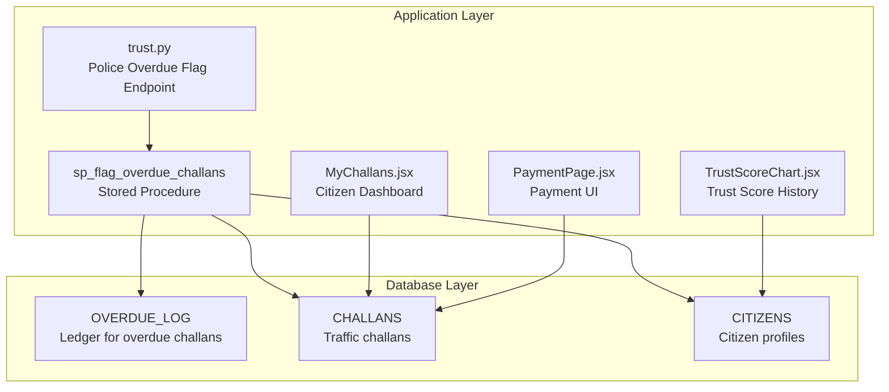
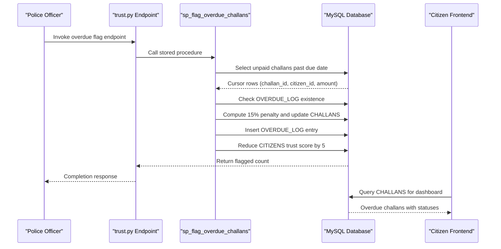
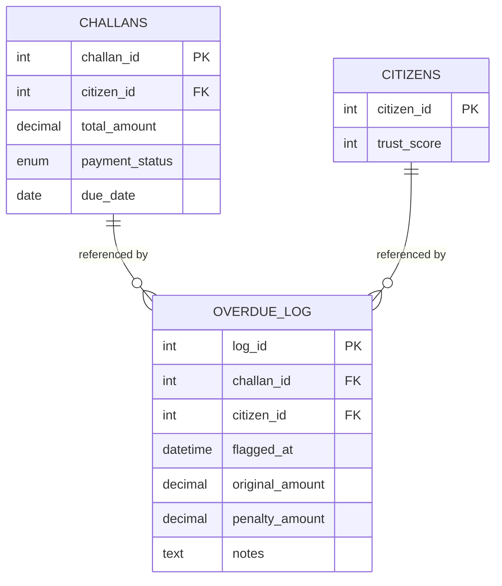
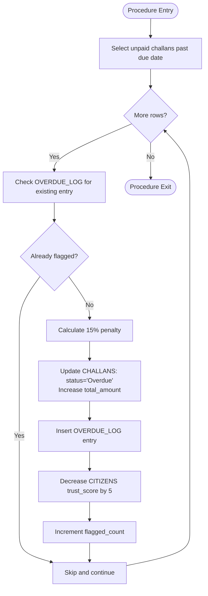
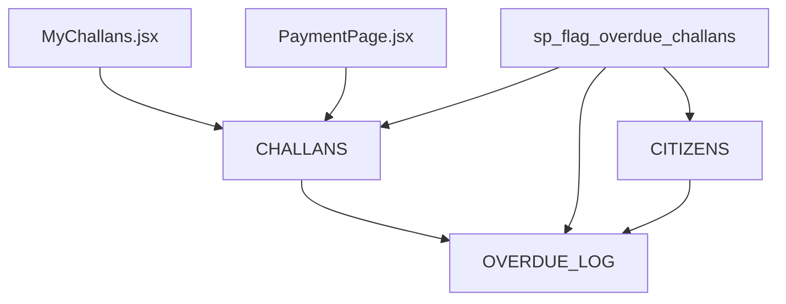

# OVERDUE_LOG - Overdue Challan Ledger

<cite>
**Referenced Files in This Document**
- [schema.sql](file://db/schema.sql)
- [database_triggers.sql](file://db/database_triggers.sql)
- [marga_rakshak_triggers.sql](file://db/marga_rakshak_triggers.sql)
- [trust.py](file://server/routes/trust.py)
- [MyChallans.jsx](file://frontend/src/pages/MyChallans.jsx)
- [PaymentPage.jsx](file://frontend/src/pages/PaymentPage.jsx)
- [TrustScoreChart.jsx](file://frontend/src/components/TrustScoreChart.jsx)
</cite>

## Table of Contents
1. [Introduction](#introduction)
2. [Project Structure](#project-structure)
3. [Core Components](#core-components)
4. [Architecture Overview](#architecture-overview)
5. [Detailed Component Analysis](#detailed-component-analysis)
6. [Dependency Analysis](#dependency-analysis)
7. [Performance Considerations](#performance-considerations)
8. [Troubleshooting Guide](#troubleshooting-guide)
9. [Conclusion](#conclusion)

## Introduction
This document provides comprehensive documentation for the OVERDUE_LOG table, which serves as the ledger for tracking overdue challans. It defines all table fields, explains the automatic overdue processing workflow, details the 15% late penalty calculation system, describes the automatic flagging mechanism, and documents the relationships with CHALLANS and CITIZENS tables. Additionally, it covers the indexing strategy for efficient overdue queries, presents practical processing scenarios, and explains the integration with trust score penalties.

## Project Structure
The OVERDUE_LOG table is part of the production database schema and participates in several automated workflows:
- Stored procedure-driven overdue flagging
- Real-time citizen visibility via frontend dashboards
- Trust score adjustments integrated with overdue processing
- Foreign key relationships with CHALLANS and CITIZENS

**Diagram sources**
- [schema.sql:224-235](file://db/schema.sql#L224-L235)
- [schema.sql:688-754](file://db/schema.sql#L688-L754)
- [trust.py:108-133](file://server/routes/trust.py#L108-L133)
- [MyChallans.jsx:1-207](file://frontend/src/pages/MyChallans.jsx#L1-L207)
- [PaymentPage.jsx:301-478](file://frontend/src/pages/PaymentPage.jsx#L301-L478)
- [TrustScoreChart.jsx:1-126](file://frontend/src/components/TrustScoreChart.jsx#L1-L126)

**Section sources**
- [schema.sql:224-235](file://db/schema.sql#L224-L235)
- [schema.sql:688-754](file://db/schema.sql#L688-L754)
- [trust.py:108-133](file://server/routes/trust.py#L108-L133)

## Core Components
The OVERDUE_LOG table maintains a permanent record of overdue challans with associated financial and administrative details.

Field definitions:
- log_id: Primary key, auto-incremented identifier for each ledger entry.
- challan_id: Foreign key referencing CHALLANS.challan_id; identifies the overdue challan.
- citizen_id: Foreign key referencing CITIZENS.citizen_id; identifies the challan owner.
- flagged_at: Timestamp indicating when the challan was flagged as overdue (defaults to current timestamp).
- original_amount: Decimal value capturing the challan's amount at the time it became overdue.
- penalty_amount: Decimal value representing the 15% late penalty applied.
- notes: Optional text field for administrative comments or audit notes.

Constraints and indexes:
- Foreign keys ensure referential integrity with CHALLANS and CITIZENS.
- Index on challan_id supports efficient lookups by challan identifier.

**Section sources**
- [schema.sql:224-235](file://db/schema.sql#L224-L235)

## Architecture Overview
The overdue processing pipeline integrates database triggers, stored procedures, and frontend dashboards to automatically flag overdue challans, apply penalties, update trust scores, and present real-time information to citizens and police officers.

**Diagram sources**
- [schema.sql:688-754](file://db/schema.sql#L688-L754)
- [trust.py:108-133](file://server/routes/trust.py#L108-L133)

## Detailed Component Analysis

### OVERDUE_LOG Table Schema
The table enforces referential integrity and provides efficient querying via a dedicated index.

**Diagram sources**
- [schema.sql:173-195](file://db/schema.sql#L173-L195)
- [schema.sql:224-235](file://db/schema.sql#L224-L235)

**Section sources**
- [schema.sql:224-235](file://db/schema.sql#L224-L235)

### Overdue Processing Workflow
The stored procedure iterates unpaid challans whose due date has passed, applies a 15% late penalty, updates the CHALLANS record, logs the event in OVERDUE_LOG, and reduces the citizen's trust score by 5 points.

Key steps:
- Cursor selection filters CHALLANS by payment_status = 'Unpaid' and due_date < CURDATE().
- Duplicate detection checks OVERDUE_LOG for existing entries to avoid re-flagging.
- Penalty calculation uses ROUND(original_amount × 0.15, 2).
- CHALLANS updates set payment_status to 'Overdue' and increase total_amount by penalty.
- OVERDUE_LOG inserts capture the original and penalty amounts along with notes.
- CITIZENS trust score decremented by 5 (minimum 0).

**Diagram sources**
- [schema.sql:688-754](file://db/schema.sql#L688-L754)

**Section sources**
- [schema.sql:688-754](file://db/schema.sql#L688-L754)

### Late Penalty Calculation System
- Penalty rate: 15% of the original challan amount.
- Precision: Rounded to two decimal places using ROUND().
- Application: Adds penalty to total_amount and marks payment_status as 'Overdue'.

Integration points:
- Stored procedure computes penalty and updates CHALLANS.
- OVERDUE_LOG captures original_amount and penalty_amount for auditability.

**Section sources**
- [schema.sql:688-754](file://db/schema.sql#L688-L754)

### Automatic Flagging Mechanism
- Trigger-based trust score adjustments occur when REPORTS status changes (verified/rejected), indirectly influencing future challan compliance.
- Manual triggering via trust.py endpoint invokes sp_flag_overdue_challans for batch processing.
- Real-time citizen dashboards reflect overdue status and amounts.

**Section sources**
- [database_triggers.sql:8-35](file://db/database_triggers.sql#L8-L35)
- [marga_rakshak_triggers.sql:16-45](file://db/marga_rakshak_triggers.sql#L16-L45)
- [trust.py:108-133](file://server/routes/trust.py#L108-L133)

### Relationship with CHALLANS and CITIZENS
- CHALLANS: The overdue flag originates from unpaid challans past due date; each flagged challan creates a corresponding OVERDUE_LOG entry.
- CITIZENS: Trust score reduction occurs concurrently with overdue flagging to incentivize timely payments.

**Section sources**
- [schema.sql:173-195](file://db/schema.sql#L173-L195)
- [schema.sql:224-235](file://db/schema.sql#L224-L235)

### Indexing Strategy for Overdue Queries
- OVERDUE_LOG.idx_overdue_challan: Optimizes lookups by challan_id, supporting queries that filter or join on overdue records.
- CHALLANS indexes support the cursor selection:
  - idx_challan_status: Filters by payment_status.
  - idx_challan_due: Supports due date comparisons.
- Additional indexes on CHALLANS and CITIZENS facilitate broader operational queries and reporting.

**Section sources**
- [schema.sql:191-194](file://db/schema.sql#L191-L194)
- [schema.sql:234-235](file://db/schema.sql#L234-L235)

### Examples of Overdue Processing Scenarios
- Scenario A: Single overdue challan
  - A challan remains unpaid past its due date; the stored procedure detects it, computes a 15% penalty, updates CHALLANS, logs OVERDUE_LOG, and reduces trust score by 5.
- Scenario B: Multiple overdue challans
  - The cursor iterates through all qualifying challans, applying penalties and logging each entry, with flagged_count incremented accordingly.
- Scenario C: Duplicate prevention
  - If a challan was already flagged earlier in the same run, the procedure skips it to avoid double penalties.

**Section sources**
- [schema.sql:688-754](file://db/schema.sql#L688-L754)

### Integration with Trust Score Penalties
- Trust score reduction: 5 points per overdue challan during the flagging process.
- Visual representation: TrustScoreChart displays historical trust score changes, enabling citizens to monitor the impact of overdue challans.
- Complementary triggers: Auto-reward (+10 trust) and auto-penalty (-10 trust) for report verification/rejection influence long-term trust trends.

**Section sources**
- [schema.sql:744-746](file://db/schema.sql#L744-L746)
- [TrustScoreChart.jsx:1-126](file://frontend/src/components/TrustScoreChart.jsx#L1-L126)
- [database_triggers.sql:8-35](file://db/database_triggers.sql#L8-L35)
- [marga_rakshak_triggers.sql:16-45](file://db/marga_rakshak_triggers.sql#L16-L45)

## Dependency Analysis
The OVERDUE_LOG table depends on CHALLANS and CITIZENS for referential integrity and on the stored procedure for lifecycle management. Frontend dashboards depend on CHALLANS data to present overdue status and amounts.

**Diagram sources**
- [schema.sql:173-195](file://db/schema.sql#L173-L195)
- [schema.sql:224-235](file://db/schema.sql#L224-L235)
- [schema.sql:688-754](file://db/schema.sql#L688-L754)
- [MyChallans.jsx:1-207](file://frontend/src/pages/MyChallans.jsx#L1-L207)
- [PaymentPage.jsx:301-478](file://frontend/src/pages/PaymentPage.jsx#L301-L478)

**Section sources**
- [schema.sql:173-195](file://db/schema.sql#L173-L195)
- [schema.sql:224-235](file://db/schema.sql#L224-L235)
- [schema.sql:688-754](file://db/schema.sql#L688-L754)

## Performance Considerations
- Cursor-based processing ensures controlled iteration over overdue records; consider batching and monitoring flagged_count to assess workload.
- Indexes on CHALLANS (status, due_date) and OVERDUE_LOG (challan_id) are essential for efficient filtering and lookup.
- Regular maintenance of statistics and periodic review of overdue volumes help maintain query performance.

## Troubleshooting Guide
Common issues and resolutions:
- Overdue challans not being flagged
  - Verify the stored procedure execution permissions and confirm that CHALLANS rows meet the criteria (Unpaid and due_date < CURDATE()).
  - Check for duplicate entries in OVERDUE_LOG preventing re-flagging.
- Incorrect penalty amounts
  - Confirm ROUND(original_amount × 0.15, 2) produces expected results and that CHALLANS.total_amount reflects the updated value.
- Trust score not decreasing
  - Ensure the procedure executes the trust score decrement and that CITIZENS records are not locked or modified externally.
- Frontend shows stale data
  - Citizens' dashboards refresh periodically; confirm network connectivity and API responses for overdue challans.

**Section sources**
- [schema.sql:688-754](file://db/schema.sql#L688-L754)
- [MyChallans.jsx:1-207](file://frontend/src/pages/MyChallans.jsx#L1-L207)
- [PaymentPage.jsx:301-478](file://frontend/src/pages/PaymentPage.jsx#L301-L478)

## Conclusion
The OVERDUE_LOG table provides a robust audit trail for overdue challans, integrating seamlessly with CHALLANS and CITIZENS to enforce financial and behavioral compliance. The stored procedure automates overdue flagging, applies precise penalties, and adjusts trust scores, while frontend dashboards keep citizens informed. Proper indexing and monitoring ensure reliable performance and transparency across the system.