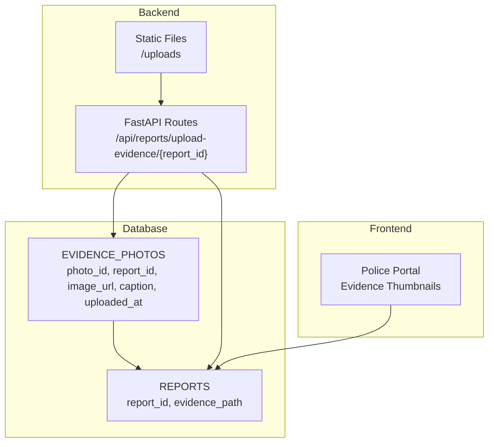
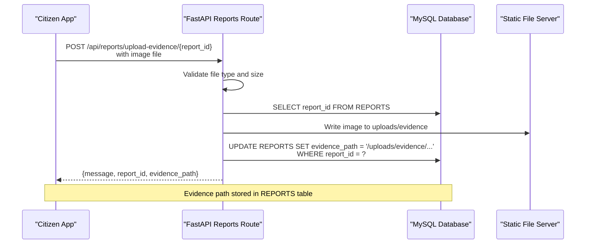
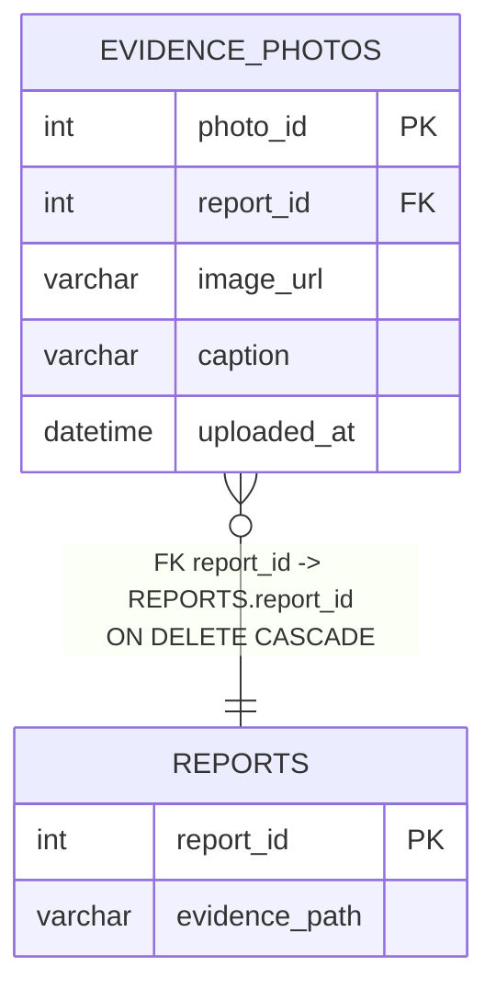
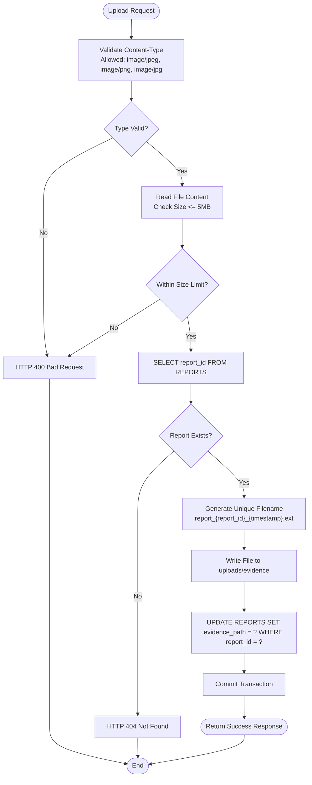
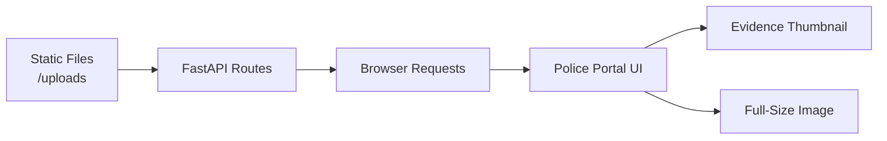
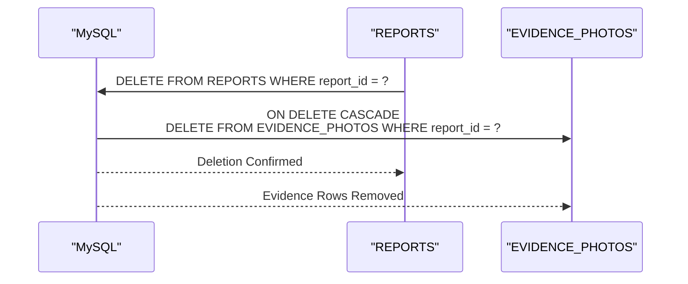
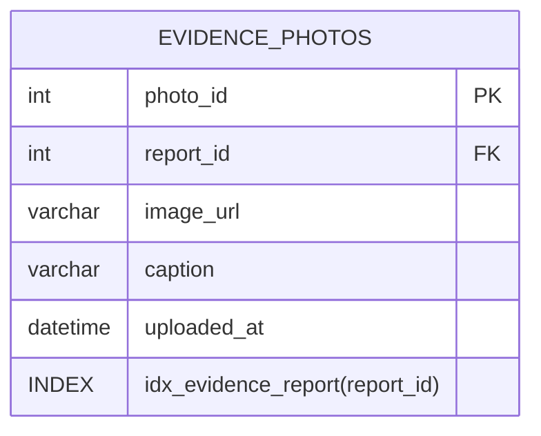
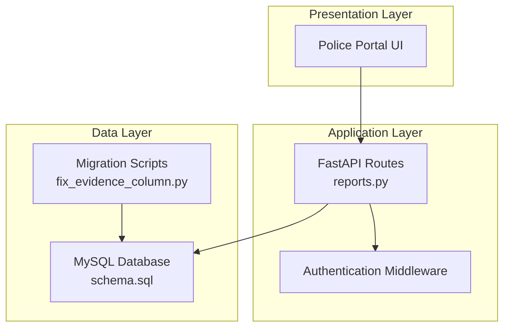

# EVIDENCE_PHOTOS - Photographic Evidence

<cite>
**Referenced Files in This Document**
- [schema.sql](file://db/schema.sql)
- [reports.py](file://server/routes/reports.py)
- [main.py](file://server/main.py)
- [fix_evidence_column.py](file://scripts/fix_evidence_column.py)
- [test_upload.py](file://scripts/test_upload.py)
- [EVIDENCE_PHOTO_GUIDE.md](file://EVIDENCE_PHOTO_GUIDE.md)
- [EVIDENCE_PATH_MIGRATION_GUIDE.md](file://EVIDENCE_PATH_MIGRATION_GUIDE.md)
</cite>

## Table of Contents
1. [Introduction](#introduction)
2. [Project Structure](#project-structure)
3. [Core Components](#core-components)
4. [Architecture Overview](#architecture-overview)
5. [Detailed Component Analysis](#detailed-component-analysis)
6. [Dependency Analysis](#dependency-analysis)
7. [Performance Considerations](#performance-considerations)
8. [Troubleshooting Guide](#troubleshooting-guide)
9. [Conclusion](#conclusion)

## Introduction
This document provides comprehensive documentation for the EVIDENCE_PHOTOS table and the associated photographic evidence workflow. It covers the database schema, upload and display mechanisms, foreign key relationships, indexing strategy, and security considerations. The system integrates citizen-submitted evidence with the reporting pipeline and enables law enforcement to review photographic evidence within the police portal.

## Project Structure
The evidence photo system spans database schema definitions, backend API routes, static file serving, and frontend integration. The key components are organized as follows:
- Database schema defines the EVIDENCE_PHOTOS table and foreign key relationships
- Backend FastAPI routes implement upload validation, persistence, and report updates
- Static file serving exposes uploaded images via HTTP URLs
- Frontend displays thumbnails and full-size images in the police portal

**Diagram sources**
- [schema.sql:139-149](file://db/schema.sql#L139-L149)
- [reports.py:50-121](file://server/routes/reports.py#L50-L121)
- [main.py:69-72](file://server/main.py#L69-L72)

**Section sources**
- [schema.sql:139-149](file://db/schema.sql#L139-L149)
- [reports.py:50-121](file://server/routes/reports.py#L50-L121)
- [main.py:69-72](file://server/main.py#L69-L72)

## Core Components
- EVIDENCE_PHOTOS table: Stores photographic evidence linked to reports with a cascading delete relationship
- Upload endpoint: Validates file types and sizes, persists files, and updates report metadata
- Static file serving: Exposes uploaded images via HTTP URLs for frontend consumption
- Frontend integration: Displays evidence thumbnails and full-size images in the police portal

Key field definitions:
- photo_id: Primary key (auto-increment)
- report_id: Foreign key referencing REPORTS.report_id with ON DELETE CASCADE
- image_url: Storage location URL (VARCHAR 500)
- caption: Optional description of the evidence (VARCHAR 255)
- uploaded_at: Timestamp of upload (DATETIME with default CURRENT_TIMESTAMP)

**Section sources**
- [schema.sql:141-149](file://db/schema.sql#L141-L149)

## Architecture Overview
The evidence photo workflow connects citizen submissions to law enforcement review through a secure, indexed, and scalable architecture.

**Diagram sources**
- [reports.py:50-121](file://server/routes/reports.py#L50-L121)
- [schema.sql:139-149](file://db/schema.sql#L139-L149)
- [main.py:69-72](file://server/main.py#L69-L72)

## Detailed Component Analysis

### EVIDENCE_PHOTOS Table Definition
The EVIDENCE_PHOTOS table captures photographic evidence with strict referential integrity and cascading deletes.

**Diagram sources**
- [schema.sql:141-149](file://db/schema.sql#L141-L149)
- [schema.sql:116-136](file://db/schema.sql#L116-L136)

Field specifications:
- photo_id: INT, AUTO_INCREMENT, PRIMARY KEY
- report_id: INT, NOT NULL, FK to REPORTS.report_id
- image_url: VARCHAR(500), NOT NULL, stores HTTP-accessible path
- caption: VARCHAR(255), DEFAULT NULL
- uploaded_at: DATETIME, NOT NULL DEFAULT CURRENT_TIMESTAMP

Foreign key constraint:
- ON DELETE CASCADE ensures evidence deletion when a report is removed

Indexing:
- INDEX idx_evidence_report(report_id) optimizes report-based queries

**Section sources**
- [schema.sql:141-149](file://db/schema.sql#L141-L149)

### Evidence Upload Workflow
The upload endpoint enforces validation, persists files, and updates report metadata.

**Diagram sources**
- [reports.py:50-121](file://server/routes/reports.py#L50-L121)

Validation rules:
- File type restricted to JPEG, PNG, JPG
- Maximum file size 5MB
- Report existence verified before upload

Storage and URL construction:
- Files saved under server/uploads/evidence with unique filenames
- Database stores HTTP-accessible path starting with /uploads/evidence

**Section sources**
- [reports.py:50-121](file://server/routes/reports.py#L50-L121)
- [main.py:69-72](file://server/main.py#L69-L72)

### Static File Serving and Frontend Integration
Uploaded images are exposed via static file serving for immediate access in the police portal.

**Diagram sources**
- [main.py:69-72](file://server/main.py#L69-L72)

Frontend behavior:
- Police portal queries reports and renders evidence thumbnails
- Clicking thumbnails opens full-size images in new tabs
- Images are loaded from URLs constructed by the backend

**Section sources**
- [main.py:69-72](file://server/main.py#L69-L72)
- [EVIDENCE_PHOTO_GUIDE.md:84-96](file://EVIDENCE_PHOTO_GUIDE.md#L84-L96)

### Foreign Key Relationship and Cascade Delete
The EVIDENCE_PHOTOS table maintains referential integrity with REPORTS and enforces cascade delete behavior.

**Diagram sources**
- [schema.sql:147](file://db/schema.sql#L147)

Behavior:
- Deleting a report automatically removes all associated evidence rows
- Maintains data consistency and prevents orphaned evidence entries

**Section sources**
- [schema.sql:147](file://db/schema.sql#L147)

### Indexing Strategy for Report-Based Queries
The EVIDENCE_PHOTOS table includes an index on report_id to optimize report-based queries.

**Diagram sources**
- [schema.sql:148](file://db/schema.sql#L148)

Benefits:
- Efficient joins and filtering by report_id
- Supports frequent queries in the police portal and reporting dashboards

**Section sources**
- [schema.sql:148](file://db/schema.sql#L148)

### Security Considerations
Security measures implemented in the upload workflow:
- File type validation: Only JPEG, PNG, JPG accepted
- File size limits: Maximum 5MB per image
- Unique filenames: Timestamp-based to prevent collisions and predictable paths
- Static file serving: Controlled via FastAPI StaticFiles mounting
- Database storage: Only HTTP-accessible paths stored, not raw binary data

Access control:
- Authentication and authorization handled by separate routes
- Evidence URLs are publicly accessible via mounted static files
- Consider implementing role-based access checks for production deployments

**Section sources**
- [reports.py:34-35](file://server/routes/reports.py#L34-L35)
- [reports.py:84-87](file://server/routes/reports.py#L84-L87)
- [main.py:69-72](file://server/main.py#L69-L72)

## Dependency Analysis
The evidence photo system exhibits clear separation of concerns across layers.

**Diagram sources**
- [reports.py:14](file://server/routes/reports.py#L14)
- [schema.sql:1](file://db/schema.sql#L1)
- [fix_evidence_column.py:1](file://scripts/fix_evidence_column.py#L1)

Dependencies:
- Backend routes depend on database schema and static file configuration
- Frontend depends on backend endpoints and static file URLs
- Migration scripts ensure schema alignment before runtime

**Section sources**
- [reports.py:14](file://server/routes/reports.py#L14)
- [schema.sql:1](file://db/schema.sql#L1)
- [fix_evidence_column.py:1](file://scripts/fix_evidence_column.py#L1)

## Performance Considerations
- File I/O: Writing to disk and serving static files can be optimized with asynchronous I/O and CDN integration
- Database queries: Indexes on report_id minimize join costs; consider adding composite indexes for frequently filtered combinations
- Memory usage: Streaming uploads reduces memory overhead compared to buffering entire files
- Scalability: For high-volume deployments, consider cloud storage backends and CDN caching

[No sources needed since this section provides general guidance]

## Troubleshooting Guide
Common issues and resolutions:
- Upload failures: Verify backend is running, upload directory exists, file type is JPEG/PNG, and size is under 5MB
- Images not displaying: Check static file serving configuration, confirm file exists in uploads/evidence, and validate URL construction
- Cascade delete behavior: Ensure reports are deleted to remove associated evidence; verify foreign key constraints

Diagnostic steps:
- Use test scripts to validate upload endpoints and verify database updates
- Inspect server logs for error messages during file writes
- Confirm CORS settings allow cross-origin requests from the frontend

**Section sources**
- [EVIDENCE_PHOTO_GUIDE.md:133-180](file://EVIDENCE_PHOTO_GUIDE.md#L133-L180)
- [test_upload.py:1-107](file://scripts/test_upload.py#L1-L107)

## Conclusion
The EVIDENCE_PHOTOS table and associated upload workflow provide a robust foundation for managing photographic evidence within the traffic violation management system. The design emphasizes referential integrity, efficient querying, and secure file handling. With proper deployment configurations and monitoring, the system supports seamless citizen-to-enforcement evidence sharing while maintaining data consistency and performance.