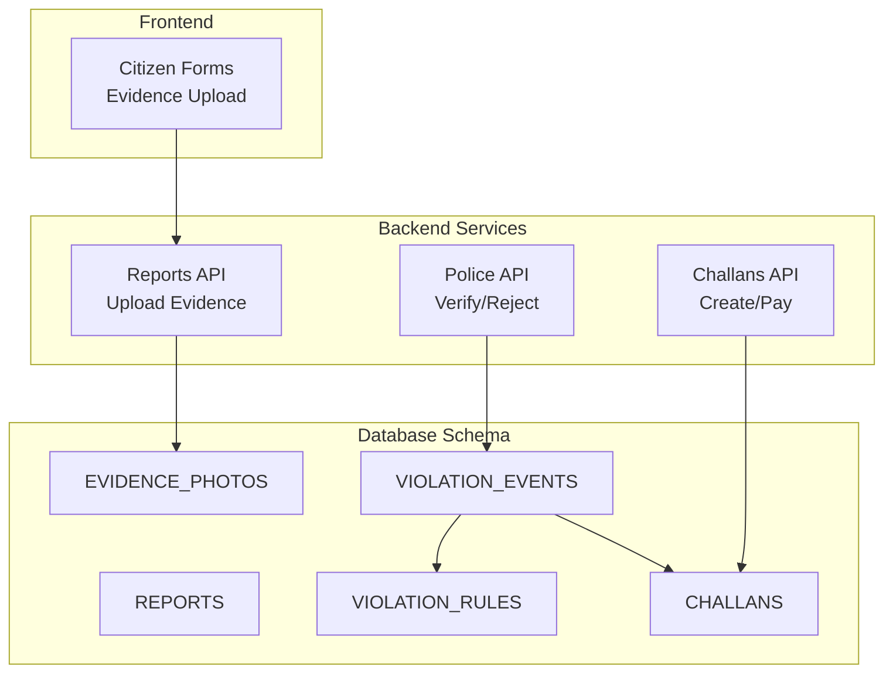
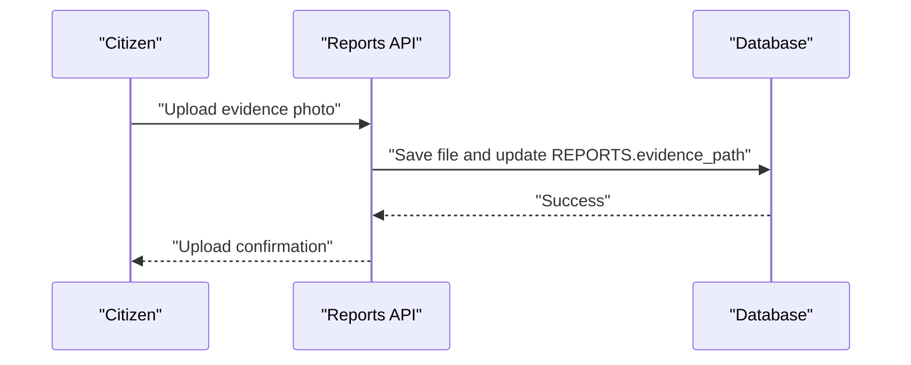
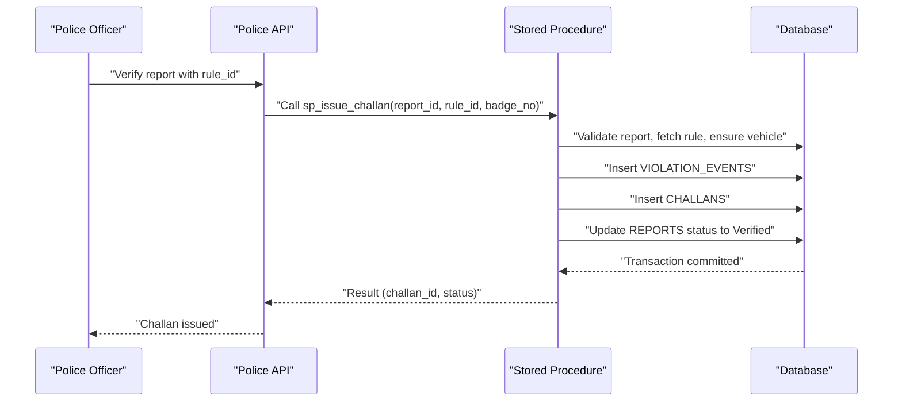
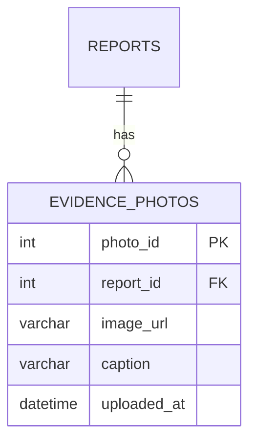
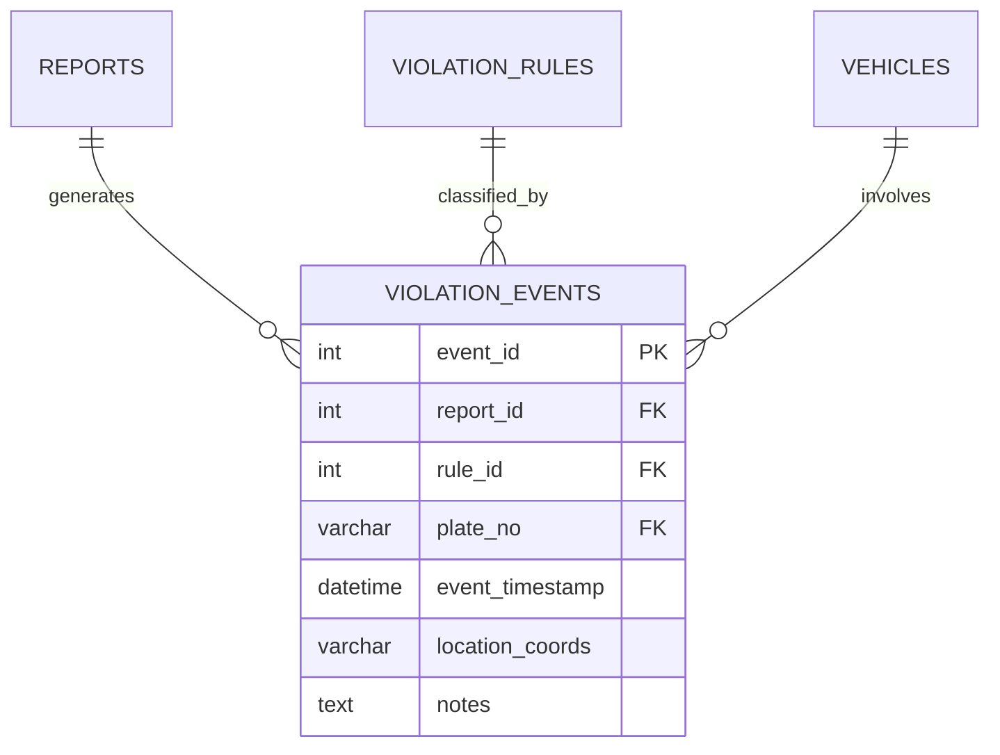
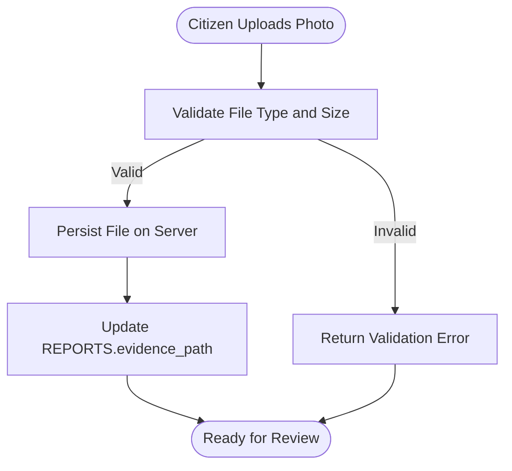
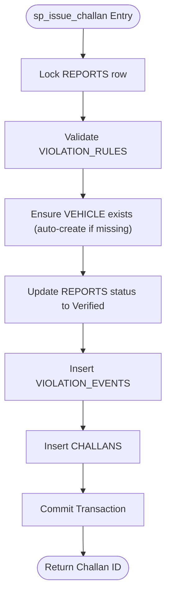
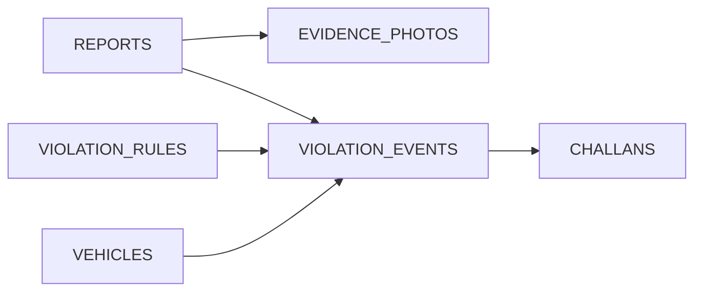

# Supporting Evidence Tables

<cite>
**Referenced Files in This Document**
- [schema.sql](file://db/schema.sql)
- [stored_procedure_process_report.sql](file://db/stored_procedure_process_report.sql)
- [reports.py](file://server/routes/reports.py)
- [police.py](file://server/routes/police.py)
- [police.js](file://backend/routes/police.js)
- [challans.py](file://server/routes/challans.py)
- [challans.js](file://backend/routes/challans.js)
- [database_triggers.sql](file://db/database_triggers.sql)
- [insert_mock_reports.sql](file://db/insert_mock_reports.sql)
</cite>

## Table of Contents
1. [Introduction](#introduction)
2. [Project Structure](#project-structure)
3. [Core Components](#core-components)
4. [Architecture Overview](#architecture-overview)
5. [Detailed Component Analysis](#detailed-component-analysis)
6. [Dependency Analysis](#dependency-analysis)
7. [Performance Considerations](#performance-considerations)
8. [Troubleshooting Guide](#troubleshooting-guide)
9. [Conclusion](#conclusion)

## Introduction
This document explains the supporting evidence tables that enrich violation reports with photographic evidence and structured violation event linkage. It focuses on:
- EVIDENCE_PHOTOS: stores photo attachments linked to reports with metadata and timestamps.
- VIOLATION_EVENTS: links reports to specific violation rules, captures event details, and maintains referential integrity.

It also documents how these tables integrate with the broader system during challan processing, including referential integrity constraints, cascade behaviors, indexing strategies, and practical workflows for attaching evidence and creating violation events.

## Project Structure
The relevant schema and processing logic are defined in the database schema and stored procedures, while the backend exposes APIs for evidence upload and challan creation. The frontend components support evidence submission.

**Diagram sources**
- [schema.sql:116-167](file://db/schema.sql#L116-L167)
- [reports.py:50-121](file://server/routes/reports.py#L50-L121)
- [police.py:48-93](file://server/routes/police.py#L48-L93)
- [challans.py:47-123](file://server/routes/challans.py#L47-L123)

**Section sources**
- [schema.sql:116-167](file://db/schema.sql#L116-L167)
- [reports.py:50-121](file://server/routes/reports.py#L50-L121)
- [police.py:48-93](file://server/routes/police.py#L48-L93)
- [challans.py:47-123](file://server/routes/challans.py#L47-L123)

## Core Components
- EVIDENCE_PHOTOS
  - photo_id: auto-increment primary key
  - report_id: foreign key to REPORTS
  - image_url: storage path for the uploaded image
  - caption: optional description
  - uploaded_at: timestamp of upload
  - Index: idx_evidence_report on report_id
  - Constraint: ON DELETE CASCADE with REPORTS

- VIOLATION_EVENTS
  - event_id: auto-increment primary key
  - report_id: foreign key to REPORTS
  - rule_id: foreign key to VIOLATION_RULES
  - plate_no: optional foreign key to VEHICLES
  - event_timestamp: timestamp of the violation event
  - location_coords: GPS coordinates string
  - notes: free-text notes
  - Indexes: idx_event_report on report_id, idx_event_rule on rule_id
  - Constraints:
    - ON DELETE CASCADE with REPORTS
    - ON DELETE RESTRICT with VIOLATION_RULES
    - ON DELETE SET NULL with VEHICLES

These tables connect reports to specific violations and photographic evidence, enabling robust audit trails and efficient querying.

**Section sources**
- [schema.sql:141-149](file://db/schema.sql#L141-L149)
- [schema.sql:154-167](file://db/schema.sql#L154-L167)

## Architecture Overview
The system orchestrates evidence attachment and violation event creation during challan processing. The flow integrates frontend uploads, backend APIs, and stored procedures to maintain data integrity and enforce constraints.

**Diagram sources**
- [reports.py:50-121](file://server/routes/reports.py#L50-L121)
- [police.py:48-93](file://server/routes/police.py#L48-L93)
- [schema.sql:440-546](file://db/schema.sql#L440-L546)

**Section sources**
- [reports.py:50-121](file://server/routes/reports.py#L50-L121)
- [police.py:48-93](file://server/routes/police.py#L48-L93)
- [schema.sql:440-546](file://db/schema.sql#L440-L546)

## Detailed Component Analysis

### EVIDENCE_PHOTOS
- Purpose: Store photographic evidence associated with a report.
- Columns:
  - photo_id: unique identifier
  - report_id: links to REPORTS
  - image_url: path to the uploaded image
  - caption: optional description
  - uploaded_at: timestamp
- Constraints and indexes:
  - Foreign key to REPORTS with ON DELETE CASCADE
  - Index on report_id for efficient joins and deletions
- Typical usage:
  - After a citizen uploads an image, the backend saves the file and updates REPORTS.evidence_path.
  - During challan processing, VIOLATION_EVENTS captures event details and CHALLANS links to the event.

**Diagram sources**
- [schema.sql:141-149](file://db/schema.sql#L141-L149)

**Section sources**
- [schema.sql:141-149](file://db/schema.sql#L141-L149)

### VIOLATION_EVENTS
- Purpose: Record the specific violation event that connects a report to a rule and optionally a vehicle.
- Columns:
  - event_id: unique identifier
  - report_id: links to REPORTS
  - rule_id: links to VIOLATION_RULES
  - plate_no: optional link to VEHICLES
  - event_timestamp: timestamp of the event
  - location_coords: GPS coordinates string
  - notes: free-text notes
- Constraints and indexes:
  - ON DELETE CASCADE with REPORTS
  - ON DELETE RESTRICT with VIOLATION_RULES
  - ON DELETE SET NULL with VEHICLES
  - Indexes on report_id and rule_id for efficient filtering
- Role in processing:
  - Created during challan issuance to anchor CHALLANS and provide auditability.

**Diagram sources**
- [schema.sql:154-167](file://db/schema.sql#L154-L167)

**Section sources**
- [schema.sql:154-167](file://db/schema.sql#L154-L167)

### Evidence Attachment Workflow (Citizen to Police Portal)
- Citizen uploads an image via the frontend.
- Backend validates file type and size, persists the file, and updates REPORTS.evidence_path.
- Police can review the report and evidence in the portal.

**Diagram sources**
- [reports.py:50-121](file://server/routes/reports.py#L50-L121)

**Section sources**
- [reports.py:50-121](file://server/routes/reports.py#L50-L121)

### Violation Event Creation During Challan Processing
- The stored procedure validates the report and rule, ensures vehicle existence, updates report status, inserts VIOLATION_EVENTS, and creates CHALLANS.
- This guarantees referential integrity and consistent audit trails.

**Diagram sources**
- [schema.sql:440-546](file://db/schema.sql#L440-L546)

**Section sources**
- [schema.sql:440-546](file://db/schema.sql#L440-L546)

## Dependency Analysis
- EVIDENCE_PHOTOS depends on REPORTS with ON DELETE CASCADE, ensuring evidence is removed when a report is deleted.
- VIOLATION_EVENTS depends on:
  - REPORTS with ON DELETE CASCADE
  - VIOLATION_RULES with ON DELETE RESTRICT (prevents deletion of active rules while events reference them)
  - VEHICLES with ON DELETE SET NULL (allows vehicle records to be removed without breaking event references)
- These constraints ensure data integrity across the lifecycle of reports, violations, and challans.

**Diagram sources**
- [schema.sql:141-167](file://db/schema.sql#L141-L167)

**Section sources**
- [schema.sql:141-167](file://db/schema.sql#L141-L167)

## Performance Considerations
- Indexing strategy:
  - EVIDENCE_PHOTOS.idx_evidence_report: supports fast retrieval of evidence per report and cascading deletes.
  - VIOLATION_EVENTS.idx_event_report and idx_event_rule: optimize filtering by report and rule.
- Query patterns:
  - Use targeted joins to fetch reports with evidence counts and violation summaries.
  - Prefer indexed columns in WHERE clauses for frequent queries (e.g., report_id, rule_id).
- Storage:
  - Store image URLs in the database and keep actual files on disk to minimize database load.
- Concurrency:
  - Use row-level locks and transactions during critical operations (e.g., updating report status, inserting events/challans) to prevent race conditions.

[No sources needed since this section provides general guidance]

## Troubleshooting Guide
- Evidence upload fails:
  - Verify allowed file types and size limits.
  - Confirm the report exists before upload.
  - Check server-side upload directory permissions.
- Violation event not created:
  - Ensure the report status is Pending and the rule_id is valid and active.
  - Confirm vehicle registration if plate_no is provided.
- Referential integrity errors:
  - Deleting a VIOLATION_RULES row fails if events reference it (RESTRICT).
  - Removing a VEHICLE clears plate_no in events (SET NULL).
- Trust score adjustments:
  - Verified reports increase trust; rejected reports decrease trust via triggers.

**Section sources**
- [reports.py:50-121](file://server/routes/reports.py#L50-L121)
- [schema.sql:440-546](file://db/schema.sql#L440-L546)
- [database_triggers.sql:10-35](file://db/database_triggers.sql#L10-L35)

## Conclusion
EVIDENCE_PHOTOS and VIOLATION_EVENTS provide essential context and auditability for violation reports. Together with the stored procedures and backend APIs, they ensure:
- Secure, validated evidence attachment
- Strict referential integrity across reports, rules, and vehicles
- Efficient querying through strategic indexing
- Robust challan processing with clear audit trails

These components form the backbone of transparent, traceable traffic violation management.