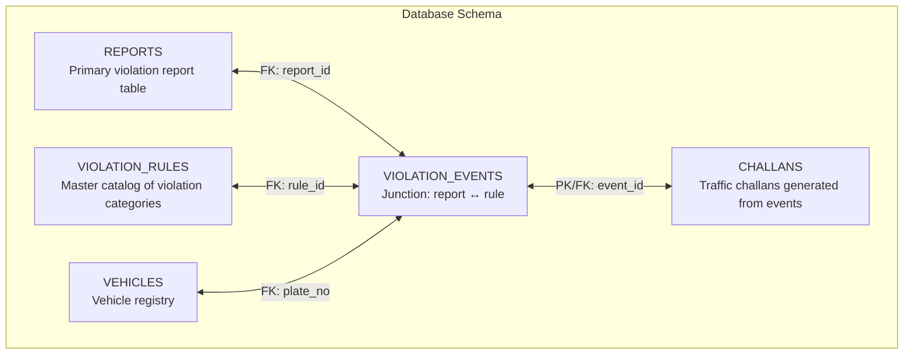
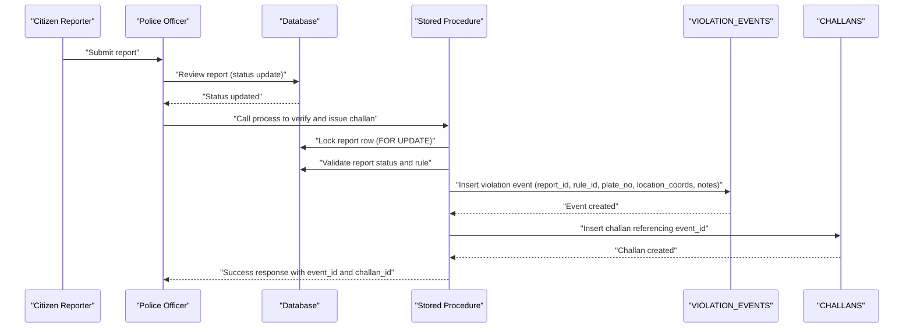
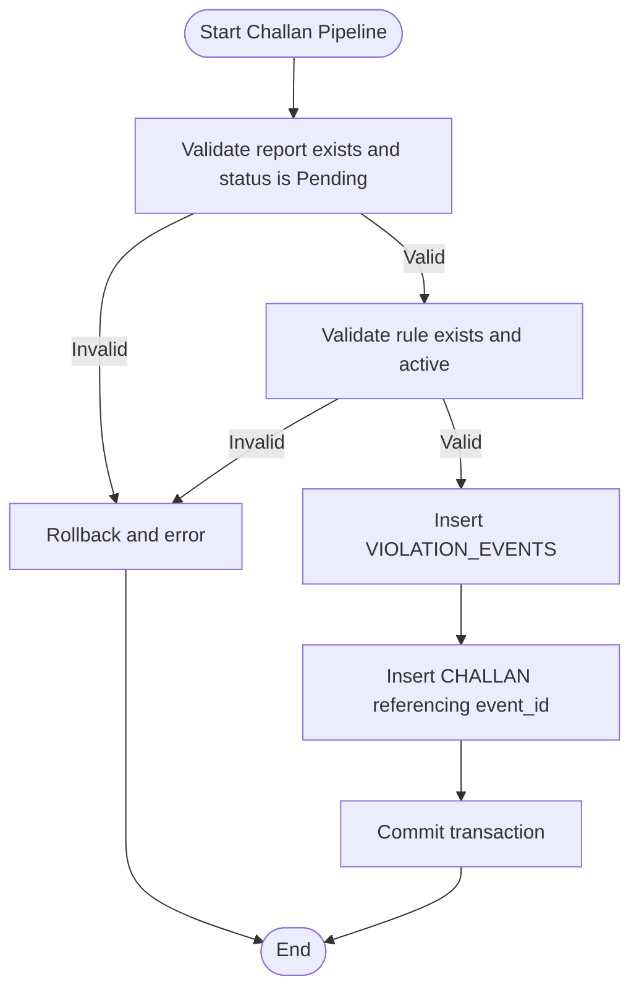
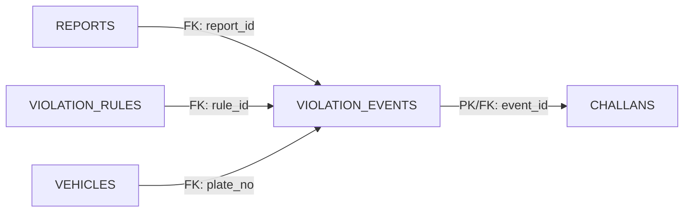

# VIOLATION_EVENTS - Violation Event Links

<cite>
**Referenced Files in This Document**
- [schema.sql](file://db/schema.sql)
- [stored_procedure_process_report.sql](file://db/stored_procedure_process_report.sql)
- [reports_enhancement.sql](file://db/reports_enhancement.sql)
</cite>

## Table of Contents
1. [Introduction](#introduction)
2. [Project Structure](#project-structure)
3. [Core Components](#core-components)
4. [Architecture Overview](#architecture-overview)
5. [Detailed Component Analysis](#detailed-component-analysis)
6. [Dependency Analysis](#dependency-analysis)
7. [Performance Considerations](#performance-considerations)
8. [Troubleshooting Guide](#troubleshooting-guide)
9. [Conclusion](#conclusion)

## Introduction
This document provides comprehensive documentation for the VIOLATION_EVENTS table, which acts as a junction table linking reports to specific violation rules. It explains the table’s role in modeling many-to-many relationships between reports and violation categories, details all field definitions, foreign key constraints, indexing strategy, and demonstrates practical usage patterns during challan processing. It also clarifies the relationship with the CHALLANS table and how the table enables temporal tracking for violation history analysis.

## Project Structure
The VIOLATION_EVENTS table is defined within the production database schema and participates in a strict transactional pipeline that creates violation events and subsequently issues challans. The relevant artifacts are:
- Core schema definition containing the table and its constraints
- Stored procedures that orchestrate report review, event creation, and challan issuance
- Enhanced reports schema that adds richer location and categorization metadata



**Diagram sources**
- [schema.sql:116-167](file://db/schema.sql#L116-L167)
- [schema.sql:173-195](file://db/schema.sql#L173-L195)

**Section sources**
- [schema.sql:116-167](file://db/schema.sql#L116-L167)
- [schema.sql:173-195](file://db/schema.sql#L173-L195)

## Core Components
The VIOLATION_EVENTS table serves as a bridge between REPORTS and VIOLATION_RULES, capturing the specifics of each violation occurrence. Its fields and constraints are designed to preserve referential integrity and enable efficient querying.

Field definitions:
- event_id: Primary key, auto-incremented integer uniquely identifying each violation event
- report_id: Foreign key referencing REPORTS.report_id; ensures every event ties to a valid report
- rule_id: Foreign key referencing VIOLATION_RULES.rule_id; associates the event with a specific violation category
- plate_no: Optional reference to VEHICLES.plate_no; captures the vehicle involved (nullable to support rule-based events without vehicle data)
- event_timestamp: Timestamp indicating when the violation event occurred; defaults to current timestamp
- location_coords: Optional field storing GPS coordinates for the event location
- notes: Optional free-text field for contextual notes

Foreign key constraints and their impact on data integrity:
- report_id → REPORTS(report_id) with ON DELETE CASCADE: Deleting a report automatically deletes all associated events
- rule_id → VIOLATION_RULES(rule_id) with ON DELETE RESTRICT: Prevents deletion of a rule if events still reference it
- plate_no → VEHICLES(plate_no) with ON DELETE SET NULL: If a vehicle is deleted, event references to it become null-safe

Indexing strategy for efficient querying:
- Index on report_id: Optimizes lookups by report
- Index on rule_id: Optimizes lookups by violation category

These indexes support typical analytical queries such as “find all events for a given report” and “find all events under a specific violation rule.”

**Section sources**
- [schema.sql:154-167](file://db/schema.sql#L154-L167)

## Architecture Overview
The VIOLATION_EVENTS table integrates tightly with the report review and challan issuance pipeline. When a report is verified, a violation event is created, linking the report to a specific rule and capturing relevant metadata. This event becomes the anchor for issuing a challan.



**Diagram sources**
- [schema.sql:440-546](file://db/schema.sql#L440-L546)
- [stored_procedure_process_report.sql:8-99](file://db/stored_procedure_process_report.sql#L8-L99)

**Section sources**
- [schema.sql:440-546](file://db/schema.sql#L440-L546)
- [stored_procedure_process_report.sql:8-99](file://db/stored_procedure_process_report.sql#L8-L99)

## Detailed Component Analysis

### Field Definitions and Roles
- event_id: Unique identifier enabling downstream references (e.g., CHALLANS.event_id)
- report_id: Ensures traceability back to the originating report
- rule_id: Enforces categorization against the master rule set
- plate_no: Optional linkage to the vehicle; supports rule-only events
- event_timestamp: Captures temporal context for event ordering and analytics
- location_coords: Preserves spatial context for geospatial analytics
- notes: Provides extensibility for officer comments or additional context

Constraints and behaviors:
- Cascading delete on report_id ensures referential integrity when reports are removed
- Restrict on rule_id prevents orphaning events when rules are removed
- Set null on plate_no allows vehicle deletions without breaking event records

**Section sources**
- [schema.sql:154-167](file://db/schema.sql#L154-L167)

### Many-to-Many Relationship Model
The junction pattern enables complex scenarios:
- A single report can be linked to multiple violation rules (e.g., multiple infractions in one incident)
- A single rule can apply to many reports (e.g., repeated speeding violations)
- Events can be created independently of vehicle data, allowing rule-based categorization

This flexibility supports nuanced enforcement and analytics.

**Section sources**
- [schema.sql:154-167](file://db/schema.sql#L154-L167)

### Event Creation During Challan Processing
Two stored procedures demonstrate event creation:
- sp_issue_challan: Creates a violation event and a challan in a single transaction
- ProcessReportAndIssueChallan: Alternative pipeline that validates and creates the event before issuing a challan

Both procedures:
- Lock the report row to prevent concurrent modifications
- Validate report status and rule availability
- Insert a violation event with report_id, rule_id, plate_no, location_coords, and notes
- Issue a challan referencing the newly created event_id



**Diagram sources**
- [schema.sql:440-546](file://db/schema.sql#L440-L546)
- [stored_procedure_process_report.sql:33-84](file://db/stored_procedure_process_report.sql#L33-L84)

**Section sources**
- [schema.sql:440-546](file://db/schema.sql#L440-L546)
- [stored_procedure_process_report.sql:33-84](file://db/stored_procedure_process_report.sql#L33-L84)

### Relationship with CHALLANS via Junction Pattern
The CHALLANS table references VIOLATION_EVENTS.event_id, forming a strict one-to-one relationship per event. This design:
- Ensures each challan corresponds to a single violation event
- Maintains referential integrity across the lifecycle of a violation
- Supports temporal auditing via CHALLANS_HISTORY

```mermaid
classDiagram
class REPORTS {
+int report_id
+int citizen_id
+string plate_no
+string location_coords
+string description
+datetime date_reported
+enum status
}
class VIOLATION_RULES {
+int rule_id
+string rule_code
+string rule_name
+decimal base_fine_amount
+enum severity
}
class VEHICLES {
+string plate_no
+string vehicle_model
+enum vehicle_type
}
class VIOLATION_EVENTS {
+int event_id
+int report_id
+int rule_id
+string plate_no
+datetime event_timestamp
+string location_coords
+text notes
}
class CHALLANS {
+int challan_id
+int event_id
+int citizen_id
+string badge_no
+decimal total_amount
+enum payment_status
+date issue_date
+date due_date
+datetime paid_at
+string transaction_ref
}
REPORTS --> VIOLATION_EVENTS : "FK : report_id"
VIOLATION_RULES --> VIOLATION_EVENTS : "FK : rule_id"
VEHICLES --> VIOLATION_EVENTS : "FK : plate_no"
VIOLATION_EVENTS --> CHALLANS : "PK/FK : event_id"
```

**Diagram sources**
- [schema.sql:116-167](file://db/schema.sql#L116-L167)
- [schema.sql:173-195](file://db/schema.sql#L173-L195)

**Section sources**
- [schema.sql:116-167](file://db/schema.sql#L116-L167)
- [schema.sql:173-195](file://db/schema.sql#L173-L195)

### Temporal Tracking and History Analysis
While VIOLATION_EVENTS itself does not include temporal columns, it anchors the CHALLANS table, which supports temporal versioning via valid_from and valid_to. This enables:
- Historical tracking of challan changes
- Auditing of amount adjustments and status transitions
- Compliance with regulatory requirements for temporal records

Additionally, the event_timestamp field provides a temporal marker for event ordering and analytics.

**Section sources**
- [schema.sql:173-195](file://db/schema.sql#L173-L195)

## Dependency Analysis
The VIOLATION_EVENTS table depends on three core entities:
- REPORTS: Ensures every event originates from a valid report
- VIOLATION_RULES: Ensures every event is categorized under a valid rule
- VEHICLES: Optionally links the event to a vehicle



**Diagram sources**
- [schema.sql:154-167](file://db/schema.sql#L154-L167)
- [schema.sql:173-195](file://db/schema.sql#L173-L195)

**Section sources**
- [schema.sql:154-167](file://db/schema.sql#L154-L167)
- [schema.sql:173-195](file://db/schema.sql#L173-L195)

## Performance Considerations
- Indexes on report_id and rule_id optimize join-heavy queries and reduce latency for analytical workloads
- Cascading deletes on report_id minimize orphaned records and simplify cleanup
- Event_timestamp can be used for time-series analytics; consider adding an index if frequent temporal filtering is required
- Stored procedures enforce row-level locks and ACID compliance, reducing contention and ensuring consistency

[No sources needed since this section provides general guidance]

## Troubleshooting Guide
Common issues and resolutions:
- Integrity errors when deleting a rule: Ensure no events reference the rule before deletion (RESTRICT behavior)
- Orphaned events after report deletion: Cascading delete removes events; confirm report deletion behavior aligns with expectations
- Missing vehicle linkage: plate_no can be null; verify whether rule-only events are intended
- Concurrency conflicts: Stored procedures use row-level locks; ensure transactions are short and errors are handled gracefully

**Section sources**
- [schema.sql:162-164](file://db/schema.sql#L162-L164)
- [schema.sql:440-546](file://db/schema.sql#L440-L546)
- [stored_procedure_process_report.sql:33-84](file://db/stored_procedure_process_report.sql#L33-L84)

## Conclusion
The VIOLATION_EVENTS table is central to the system’s ability to model complex violation scenarios through a robust many-to-many relationship between reports and rules. Its carefully chosen constraints and indexes ensure data integrity and efficient querying, while its integration with stored procedures and the CHALLANS table provides a complete, auditable lifecycle for traffic enforcement actions. Together, these components support reliable temporal tracking, scalable analytics, and strong referential integrity across the traffic violation management system.