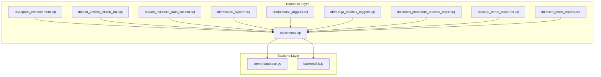
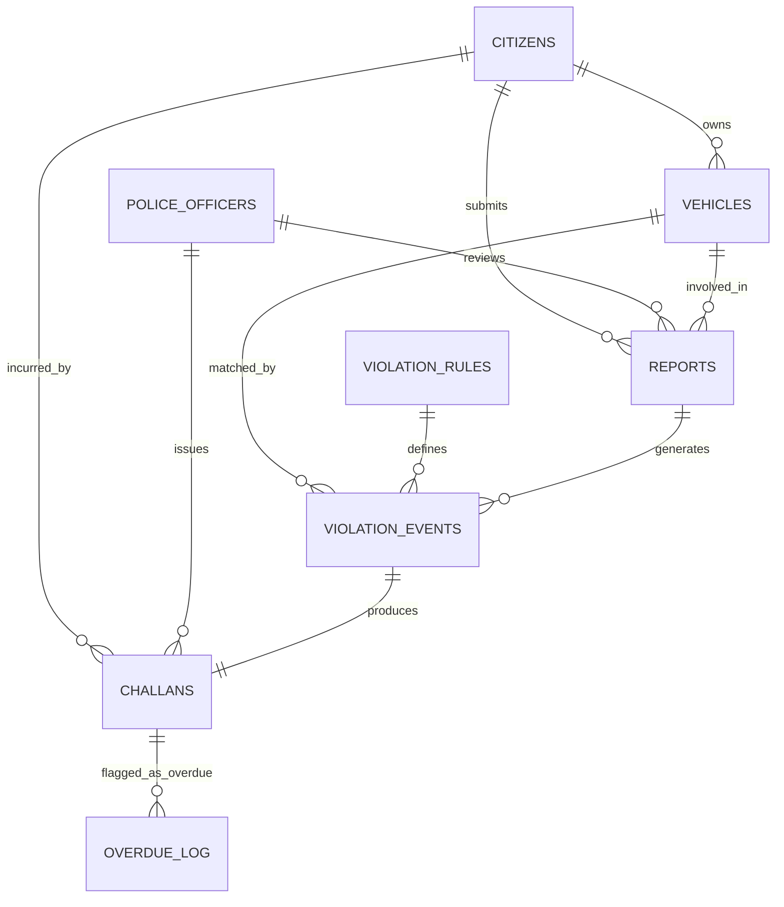
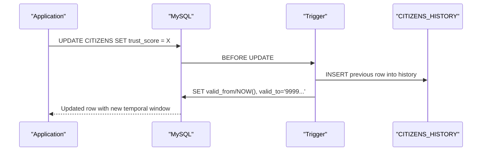
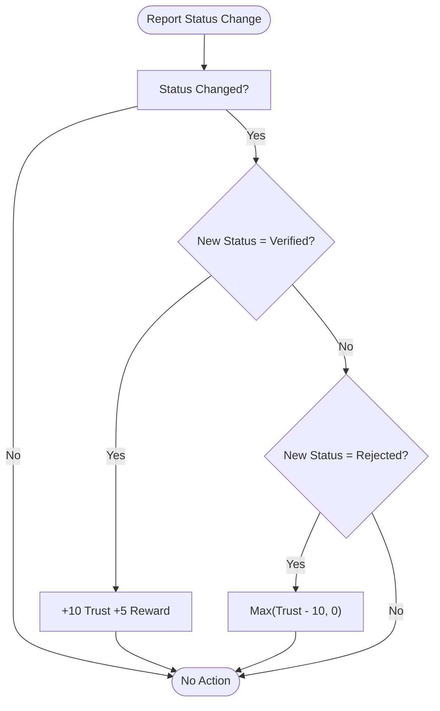
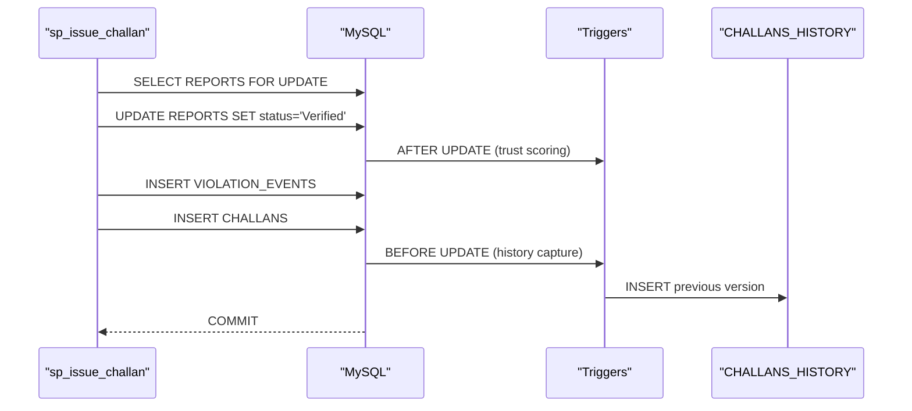
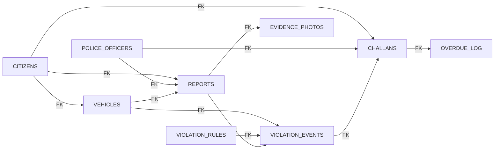

# Table Descriptions

<cite>
**Referenced Files in This Document**
- [schema.sql](file://db/schema.sql)
- [reports_enhancement.sql](file://db/reports_enhancement.sql)
- [add_vehicle_citizen_link.sql](file://db/add_vehicle_citizen_link.sql)
- [add_evidence_path_column.sql](file://db/add_evidence_path_column.sql)
- [rewards_system.sql](file://db/rewards_system.sql)
- [stored_procedure_process_report.sql](file://db/stored_procedure_process_report.sql)
- [database_triggers.sql](file://db/database_triggers.sql)
- [marga_rakshak_triggers.sql](file://db/marga_rakshak_triggers.sql)
- [seed_demo_accounts.sql](file://db/seed_demo_accounts.sql)
- [insert_mock_reports.sql](file://db/insert_mock_reports.sql)
- [database.py](file://server/database.py)
- [db.js](file://backend/db.js)
</cite>

## Table of Contents
1. [Introduction](#introduction)
2. [Project Structure](#project-structure)
3. [Core Components](#core-components)
4. [Architecture Overview](#architecture-overview)
5. [Detailed Component Analysis](#detailed-component-analysis)
6. [Dependency Analysis](#dependency-analysis)
7. [Performance Considerations](#performance-considerations)
8. [Troubleshooting Guide](#troubleshooting-guide)
9. [Conclusion](#conclusion)
10. [Appendices](#appendices)

## Introduction
This document provides comprehensive table descriptions for the Traffic Violation Management System (TVMS) database schema. It covers all core tables, detailing field definitions, constraints, indexes, temporal columns, referential integrity, and business logic. It also explains how data flows through the system from report submission to challan issuance and payment, and outlines the rationale behind design decisions such as temporal versioning, trust scoring, and audit trails.

## Project Structure
The TVMS database schema is defined primarily in the schema creation script and extended via enhancement and migration scripts. The backend and server components connect to the database using connection pools configured in Python and Node.js.

**Diagram sources**
- [schema.sql](file://db/schema.sql)
- [reports_enhancement.sql](file://db/reports_enhancement.sql)
- [add_vehicle_citizen_link.sql](file://db/add_vehicle_citizen_link.sql)
- [add_evidence_path_column.sql](file://db/add_evidence_path_column.sql)
- [rewards_system.sql](file://db/rewards_system.sql)
- [database_triggers.sql](file://db/database_triggers.sql)
- [marga_rakshak_triggers.sql](file://db/marga_rakshak_triggers.sql)
- [stored_procedure_process_report.sql](file://db/stored_procedure_process_report.sql)
- [seed_demo_accounts.sql](file://db/seed_demo_accounts.sql)
- [insert_mock_reports.sql](file://db/insert_mock_reports.sql)
- [database.py](file://server/database.py)
- [db.js](file://backend/db.js)

**Section sources**
- [schema.sql](file://db/schema.sql)
- [database.py](file://server/database.py)
- [db.js](file://backend/db.js)

## Core Components
This section documents the 16 core tables and supporting views, focusing on:
- Field definitions with data types, constraints, and defaults
- Primary keys, foreign keys, and indexes
- Temporal columns (valid_from/valid_to) and their roles
- Referential integrity and triggers
- Business logic and data flow

### 1. CITIZENS
- Purpose: Primary civilian user accounts with biometric face encoding support and trust scoring.
- Key fields:
  - citizen_id (PK)
  - full_name, email (unique), phone_no
  - password_hash
  - face_encoding (BLOB)
  - trust_score (0–200), reward_points
  - account_status: Active, Suspended, Banned
  - created_at, updated_at
  - valid_from, valid_to (temporal)
- Indexes: idx_citizen_email, idx_citizen_status, idx_citizen_trust
- Notes: Temporal versioning via triggers updates valid_from/valid_to and auto-suspends when trust reaches zero.

**Section sources**
- [schema.sql](file://db/schema.sql)

### 2. CITIZENS_HISTORY
- Purpose: Audit trail capturing historical state changes for CITIZENS.
- Key fields:
  - history_id (PK)
  - citizen_id (FK), full_name, email, phone_no, trust_score, reward_points, account_status
  - valid_from, valid_to
  - operation_type: INSERT, UPDATE, DELETE
  - changed_at, changed_by
- Indexes: idx_ch_citizen, idx_ch_period

**Section sources**
- [schema.sql](file://db/schema.sql)

### 3. POLICE_OFFICERS
- Purpose: Law enforcement personnel with badge-based identity.
- Key fields:
  - badge_no (PK)
  - full_name, officer_rank, station_code
  - email (unique), password_hash, phone_no
  - is_active
  - created_at, updated_at
- Indexes: idx_police_station

**Section sources**
- [schema.sql](file://db/schema.sql)

### 4. VEHICLES
- Purpose: Vehicle registry linked to owners and violation events.
- Key fields:
  - plate_no (PK)
  - vehicle_model, vehicle_type, owner_name, owner_type
  - registered_at
  - citizen_id (FK to CITIZENS, nullable)
- Indexes: idx_vehicle_type
- Notes: Foreign key ensures referential integrity; nullable to allow orphaned records during cleanup.

**Section sources**
- [schema.sql](file://db/schema.sql)
- [add_vehicle_citizen_link.sql](file://db/add_vehicle_citizen_link.sql)

### 5. VIOLATION_RULES
- Purpose: Master catalog of traffic violation categories and associated metadata.
- Key fields:
  - rule_id (PK)
  - rule_code (unique), rule_name, description
  - base_fine_amount (>0)
  - severity: Minor, Moderate, Major, Critical
  - violation_time: Daytime, Nighttime, Anytime
  - is_active
  - created_at
- Indexes: idx_rule_severity

**Section sources**
- [schema.sql](file://db/schema.sql)

### 6. REPORTS
- Purpose: Violation reports submitted by citizens; enhanced with new columns and statuses.
- Key fields:
  - report_id (PK)
  - citizen_id (FK), plate_no (FK), location_coords, location_address, description
  - date_reported, status: Pending, Verified, Rejected, Challan Issued
  - reviewed_by (badge_no), reviewed_at, rejection_reason
  - violation_type, latitude, longitude, fine_amount (default 0)
  - evidence_path (path to evidence image)
  - created_at, updated_at
- Indexes: idx_report_status, idx_report_citizen, idx_report_date, idx_report_violation_type, idx_report_location, idx_report_fine
- Notes: Enhanced via reports_enhancement.sql; supports spatial coordinates and fine amount; status enum extended.

**Section sources**
- [schema.sql](file://db/schema.sql)
- [reports_enhancement.sql](file://db/reports_enhancement.sql)
- [add_evidence_path_column.sql](file://db/add_evidence_path_column.sql)

### 7. EVIDENCE_PHOTOS
- Purpose: Photographic evidence attached to reports.
- Key fields:
  - photo_id (PK)
  - report_id (FK), image_url, caption, uploaded_at
- Indexes: idx_evidence_report

**Section sources**
- [schema.sql](file://db/schema.sql)

### 8. VIOLATION_EVENTS
- Purpose: Junction linking a report to specific violation rules and optional vehicle.
- Key fields:
  - event_id (PK)
  - report_id (FK), rule_id (FK), plate_no (FK)
  - event_timestamp, location_coords, notes
- Indexes: idx_event_report, idx_event_rule

**Section sources**
- [schema.sql](file://db/schema.sql)

### 9. CHALLANS
- Purpose: Traffic fines/penalties issued; includes temporal versioning.
- Key fields:
  - challan_id (PK)
  - event_id (FK), citizen_id (FK), badge_no (FK)
  - total_amount (>0), payment_status: Unpaid, Paid, Overdue, Waived, Disputed
  - issue_date, due_date, paid_at, transaction_ref
  - valid_from, valid_to (temporal)
  - created_at, updated_at
- Indexes: idx_challan_status, idx_challan_citizen, idx_challan_due, idx_challan_issued
- Notes: Temporal versioning via triggers; foreign keys enforce referential integrity.

**Section sources**
- [schema.sql](file://db/schema.sql)

### 10. CHALLANS_HISTORY
- Purpose: Audit trail for challan adjustments and lifecycle changes.
- Key fields:
  - history_id (PK)
  - challan_id (FK), event_id, citizen_id, badge_no
  - total_amount, payment_status, issue_date, due_date, paid_at, transaction_ref
  - valid_from, valid_to
  - operation_type: INSERT, UPDATE, DELETE
  - changed_at, changed_by
- Indexes: idx_chh_challan, idx_chh_period

**Section sources**
- [schema.sql](file://db/schema.sql)

### 11. OVERDUE_LOG
- Purpose: Ledger for flagged overdue challans with penalties and notes.
- Key fields:
  - log_id (PK)
  - challan_id (FK), citizen_id (FK)
  - flagged_at, original_amount, penalty_amount, notes
- Indexes: idx_overdue_challan

**Section sources**
- [schema.sql](file://db/schema.sql)

### 12. ACTIVE_SESSIONS
- Purpose: Short-lived login sessions with auto-purge eligibility.
- Key fields:
  - session_id (PK)
  - user_id (citizen_id or badge_no), user_role: Citizen, Police
  - ip_address, user_agent, created_at, expires_at, is_active
- Indexes: idx_session_user, idx_session_expires

**Section sources**
- [schema.sql](file://db/schema.sql)

### 13. UNVERIFIED_UPLOADS
- Purpose: Staging area for evidence before report linkage.
- Key fields:
  - upload_id (PK)
  - uploader_id (FK), file_path, file_hash, mime_type, file_size_bytes
  - uploaded_at, expires_at, is_linked
- Indexes: idx_upload_expires, idx_upload_linked

**Section sources**
- [schema.sql](file://db/schema.sql)

### 14. REWARDS_CATALOG
- Purpose: Catalog of available rewards redeemable by citizens.
- Key fields:
  - reward_id (PK)
  - reward_name, description, points_required, icon, color_scheme
  - requirement_type: verified_reports, trust_score, combined
  - requirement_value, is_active
  - created_at, updated_at
- Indexes: idx_points_required, idx_is_active

**Section sources**
- [rewards_system.sql](file://db/rewards_system.sql)

### 15. REDEMPTION_HISTORY
- Purpose: Audit trail of reward redemptions.
- Key fields:
  - redemption_id (PK)
  - citizen_id (FK), reward_id (FK)
  - points_redeemed, redemption_date, status: Pending, Completed, Cancelled
  - notes
- Indexes: idx_citizen_id, idx_redemption_date, idx_status

**Section sources**
- [rewards_system.sql](file://db/rewards_system.sql)

### 16. CITIZEN_LINK_AUDIT (Virtual/Logical)
- Purpose: Not a physical table; represents the logical relationship maintained by the VEHICLES.citizen_id FK and enforced migrations.
- Relationship: Vehicles linked to citizens via citizen_id (nullable) to route challans and manage ownership.

**Section sources**
- [add_vehicle_citizen_link.sql](file://db/add_vehicle_citizen_link.sql)

## Architecture Overview
The TVMS database enforces ACID transactions and referential integrity across core entities. Triggers automate trust scoring, temporal versioning, and audit trails. Stored procedures encapsulate end-to-end workflows such as report verification and challan issuance.

**Diagram sources**
- [schema.sql](file://db/schema.sql)
- [add_vehicle_citizen_link.sql](file://db/add_vehicle_citizen_link.sql)

## Detailed Component Analysis

### CITIZENS and CITIZENS_HISTORY
- Design rationale:
  - Temporal versioning preserves historical trust score and profile changes.
  - Auto-suspension at zero trust ensures accountability.
- Triggers:
  - Before UPDATE captures prior row into history and advances valid_from/valid_to.
  - After INSERT logs initial state.
- Indexes:
  - Email uniqueness and status/trust indexing optimize lookups and reporting.

**Diagram sources**
- [schema.sql](file://db/schema.sql)

**Section sources**
- [schema.sql](file://db/schema.sql)

### REPORTS and Trust Scoring
- Enhancement:
  - Added violation_type, latitude/longitude, fine_amount, status extension to Challan Issued, evidence_path.
- Triggers:
  - Auto_Reward_System (+10 trust and reward on Verified).
  - Auto_Penalty_System (-10 trust on Rejected).
- Indexes:
  - New indexes on violation_type, location (lat/long), fine_amount for performance.

**Diagram sources**
- [reports_enhancement.sql](file://db/reports_enhancement.sql)
- [database_triggers.sql](file://db/database_triggers.sql)
- [marga_rakshak_triggers.sql](file://db/marga_rakshak_triggers.sql)

**Section sources**
- [reports_enhancement.sql](file://db/reports_enhancement.sql)
- [database_triggers.sql](file://db/database_triggers.sql)
- [marga_rakshak_triggers.sql](file://db/marga_rakshak_triggers.sql)

### CHALLANS and CHALLANS_HISTORY
- Design rationale:
  - Separate payment lifecycle and temporal versioning for auditability.
  - Overdue handling with penalties and trust deductions.
- Triggers:
  - Before UPDATE logs previous version and advances temporal window.
  - After INSERT logs initial version.
- Stored procedures:
  - sp_issue_challan: ACID transaction to verify report, create event, and issue challan.
  - sp_flag_overdue_challans: Daily cursor-based procedure to flag overdue challans.

**Diagram sources**
- [schema.sql](file://db/schema.sql)
- [stored_procedure_process_report.sql](file://db/stored_procedure_process_report.sql)

**Section sources**
- [schema.sql](file://db/schema.sql)
- [stored_procedure_process_report.sql](file://db/stored_procedure_process_report.sql)

### VEHICLES and Ownership Linking
- Migration rationale:
  - Added citizen_id to VEHICLES to link ownership for challan routing and reporting.
- Constraints:
  - Foreign key to CITIZENS with ON DELETE SET NULL to preserve historical records.

**Section sources**
- [add_vehicle_citizen_link.sql](file://db/add_vehicle_citizen_link.sql)

### Rewards System (REWARDS_CATALOG and REDEMPTION_HISTORY)
- Design rationale:
  - Encourages good reporting behavior and trust maintenance via reward points.
- Triggers and Procedures:
  - sp_calculate_reward_points computes points based on verified reports and trust thresholds.
  - trg_update_rewards_after_verification recalculates after report verification.

**Section sources**
- [rewards_system.sql](file://db/rewards_system.sql)

### Demo Accounts and Sample Data
- Purpose:
  - Seed demo accounts for quick testing of the end-to-end pipeline.
- Scripts:
  - seed_demo_accounts.sql for officers and citizens.
  - insert_mock_reports.sql for pending reports.

**Section sources**
- [seed_demo_accounts.sql](file://db/seed_demo_accounts.sql)
- [insert_mock_reports.sql](file://db/insert_mock_reports.sql)

## Dependency Analysis
- Referential Integrity:
  - REPORTS: FK to CITIZENS (CASCADE), VEHICLES (SET NULL), POLICE_OFFICERS (SET NULL).
  - VIOLATION_EVENTS: FK to REPORTS (CASCADE), VIOLATION_RULES (RESTRICT), VEHICLES (SET NULL).
  - CHALLANS: FK to VIOLATION_EVENTS (CASCADE), CITIZENS (CASCADE), POLICE_OFFICERS (RESTRICT).
  - OVERDUE_LOG: FK to CHALLANS (CASCADE), CITIZENS (CASCADE).
  - EVIDENCE_PHOTOS: FK to REPORTS (CASCADE).
  - VEHICLES: FK to CITIZENS (SET NULL).
  - REDEMPTION_HISTORY: FK to CITIZENS (CASCADE), REWARDS_CATALOG (RESTRICT).
- Triggers:
  - CITIZENS: temporal history and auto-suspension.
  - REPORTS: trust scoring automation.
  - CHALLANS: temporal history capture.
- Events:
  - Scheduled daily overdue check invoking sp_flag_overdue_challans.

**Diagram sources**
- [schema.sql](file://db/schema.sql)

**Section sources**
- [schema.sql](file://db/schema.sql)

## Performance Considerations
- Indexes:
  - Use targeted indexes on frequently filtered columns (status, dates, coordinates, foreign keys).
  - Consider composite indexes for multi-column filters (e.g., status + date_reported).
- Temporal Queries:
  - Utilize valid_from/valid_to windows for historical reporting and auditing.
- Triggers and Events:
  - Keep triggers minimal and efficient; offload heavy computations to scheduled events.
- Connection Pools:
  - Backend uses pooled connections to reduce overhead and improve throughput.

[No sources needed since this section provides general guidance]

## Troubleshooting Guide
- Common Issues:
  - Foreign key constraint failures when inserting REPORTS with invalid citizen_id or plate_no.
  - Trust score not updating after report status change; verify triggers exist and are enabled.
  - Challan temporal history not recorded; confirm BEFORE UPDATE trigger on CHALLANS is active.
  - Overdue penalties not applied; ensure scheduled event evt_daily_overdue_check runs and calls sp_flag_overdue_challans.
- Verification Steps:
  - Confirm triggers existence and timing via INFORMATION_SCHEMA.TRIGGERS.
  - Validate foreign keys via INFORMATION_SCHEMA.KEY_COLUMN_USAGE.
  - Check scheduled events via SHOW EVENTS and routine definitions via INFORMATION_SCHEMA.ROUTINES.

**Section sources**
- [schema.sql](file://db/schema.sql)
- [database_triggers.sql](file://db/database_triggers.sql)
- [marga_rakshak_triggers.sql](file://db/marga_rakshak_triggers.sql)

## Conclusion
The TVMS database schema is designed for reliability, auditability, and scalability. It leverages temporal versioning, robust referential integrity, automated triggers, and stored procedures to enforce business rules and maintain data consistency. The enhancements to REPORTS and the addition of rewards and overdue mechanisms further strengthen operational workflows and citizen engagement.

[No sources needed since this section summarizes without analyzing specific files]

## Appendices

### Appendix A: Backend Database Connectivity
- Python backend uses a MySQL connection pool with UTF8MB4 and unicode_ci collation.
- Node.js backend creates a promise-based pool with configurable environment variables.

**Section sources**
- [database.py](file://server/database.py)
- [db.js](file://backend/db.js)