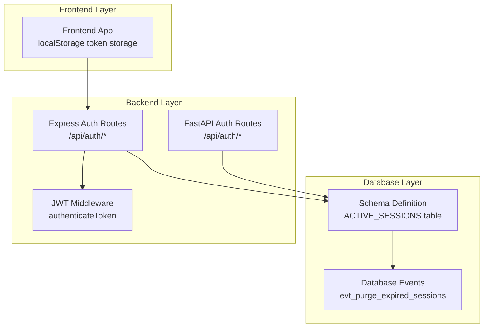
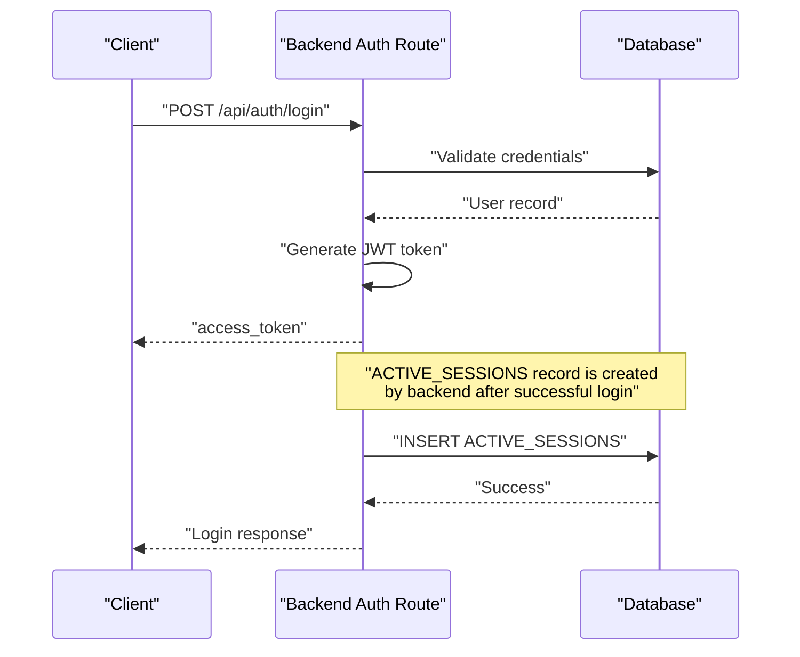
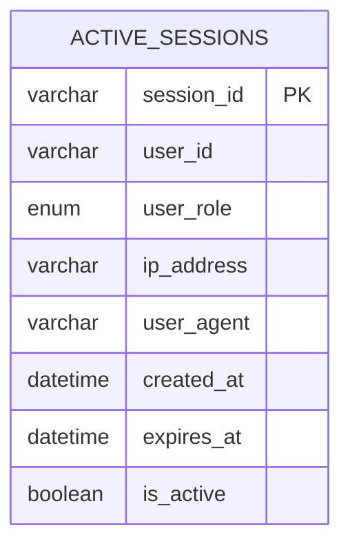
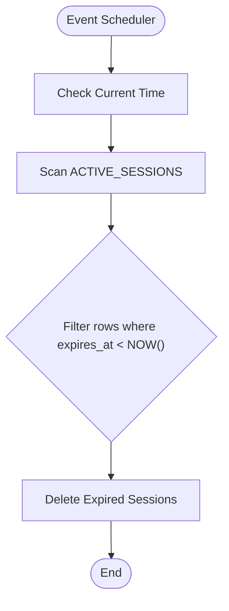
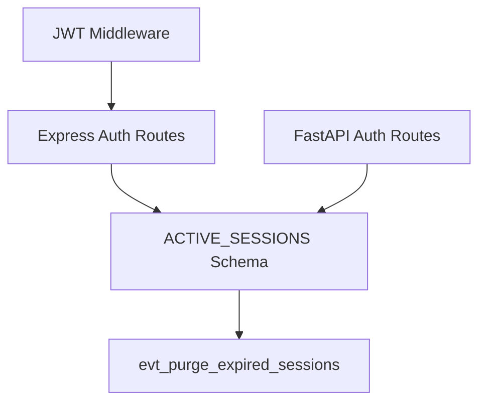

# ACTIVE_SESSIONS - Session Management

<cite>
**Referenced Files in This Document**
- [schema.sql](file://db/schema.sql)
- [database_triggers.sql](file://db/database_triggers.sql)
- [auth.js](file://backend/middleware/auth.js)
- [routes/auth.js](file://backend/routes/auth.js)
- [main.py](file://server/main.py)
- [database.py](file://server/database.py)
- [routes/auth.py](file://server/routes/auth.py)
</cite>

## Table of Contents
1. [Introduction](#introduction)
2. [Project Structure](#project-structure)
3. [Core Components](#core-components)
4. [Architecture Overview](#architecture-overview)
5. [Detailed Component Analysis](#detailed-component-analysis)
6. [Dependency Analysis](#dependency-analysis)
7. [Performance Considerations](#performance-considerations)
8. [Troubleshooting Guide](#troubleshooting-guide)
9. [Conclusion](#conclusion)

## Introduction
This document provides comprehensive documentation for the ACTIVE_SESSIONS table that manages user login sessions in the Traffic Violation Management System. It defines all table fields, explains the session lifecycle from creation to automatic purging, documents the auto-purge mechanism via database events, and outlines the security implications of session tracking. It also covers the indexing strategy for efficient cleanup operations and provides practical examples of session creation, validation, and automatic expiration handling.

## Project Structure
The ACTIVE_SESSIONS table is part of the production database schema and is complemented by authentication middleware and routes. The backend uses JWT tokens for authentication, while the database maintains transient session records for tracking and cleanup.

**Diagram sources**
- [schema.sql:242-287](file://db/schema.sql#L242-L287)
- [routes/auth.js:9-76](file://backend/routes/auth.js#L9-L76)
- [auth.js:5-20](file://backend/middleware/auth.js#L5-L20)
- [routes/auth.py:218-490](file://server/routes/auth.py#L218-L490)

**Section sources**
- [schema.sql:242-287](file://db/schema.sql#L242-L287)
- [routes/auth.js:9-76](file://backend/routes/auth.js#L9-L76)
- [auth.js:5-20](file://backend/middleware/auth.js#L5-L20)
- [routes/auth.py:218-490](file://server/routes/auth.py#L218-L490)

## Core Components
The ACTIVE_SESSIONS table is designed to track short-lived login sessions with automatic cleanup capabilities. Below are the field definitions and their roles:

- session_id: Unique identifier for the session (VARCHAR, PRIMARY KEY)
- user_id: Identifies the user (VARCHAR); stores either citizen_id or badge_no depending on role
- user_role: Enumerated role value indicating whether the session belongs to a Citizen or Police user
- ip_address: Optional client IP address for tracking and security monitoring
- user_agent: Optional browser/device agent string for auditing
- created_at: Timestamp marking session creation
- expires_at: Expiration timestamp used by the auto-purge mechanism
- is_active: Boolean flag indicating whether the session is currently active

Indexing strategy:
- Index on user_id: Supports queries filtering sessions by user identity
- Index on expires_at: Optimizes the hourly purge event by enabling fast deletion of expired rows

Security implications:
- Tracking ip_address and user_agent aids in detecting suspicious activity and potential session hijacking attempts
- The is_active flag allows administrators to disable compromised sessions
- The expires_at field ensures stale sessions are automatically removed, reducing the risk window for unauthorized access

**Section sources**
- [schema.sql:245-256](file://db/schema.sql#L245-L256)

## Architecture Overview
The session lifecycle is managed through a combination of backend authentication flows and database automation. While the backend primarily uses JWT tokens for authentication, the database maintains ACTIVE_SESSIONS records for transient session tracking and cleanup.

**Diagram sources**
- [routes/auth.js:9-76](file://backend/routes/auth.js#L9-L76)
- [schema.sql:245-256](file://db/schema.sql#L245-L256)

## Detailed Component Analysis

### ACTIVE_SESSIONS Table Definition
The ACTIVE_SESSIONS table is defined with a primary key on session_id and supporting indexes for user_id and expires_at. The table includes optional fields for IP address and user agent tracking, along with timestamps for creation and expiration.

**Diagram sources**
- [schema.sql:245-256](file://db/schema.sql#L245-L256)

**Section sources**
- [schema.sql:245-256](file://db/schema.sql#L245-L256)

### Auto-Purge Mechanism
The database includes a scheduled event that automatically purges expired sessions every hour. This event scans the ACTIVE_SESSIONS table and deletes rows where expires_at is earlier than the current time.

**Diagram sources**
- [schema.sql:279-287](file://db/schema.sql#L279-L287)

**Section sources**
- [schema.sql:279-287](file://db/schema.sql#L279-L287)

### Security Implications and Monitoring
Tracking ip_address and user_agent enables:
- Detection of concurrent sessions from different locations
- Identification of unusual user agents that may indicate automated access
- Auditing of session lifecycles for compliance and forensic analysis

The is_active flag supports immediate revocation of compromised sessions without requiring client-side action.

**Section sources**
- [schema.sql:249-253](file://db/schema.sql#L249-L253)

### Session Lifecycle Examples

#### Example: Session Creation
- After successful authentication, the backend creates an ACTIVE_SESSIONS record with:
  - session_id: Generated unique identifier
  - user_id: citizen_id or badge_no
  - user_role: 'Citizen' or 'Police'
  - ip_address: Client IP
  - user_agent: Browser/device info
  - created_at: Current timestamp
  - expires_at: Calculated from created_at plus session lifetime
  - is_active: TRUE

#### Example: Session Validation
- During protected requests, the backend verifies the JWT token and checks:
  - Token signature and expiration
  - Associated ACTIVE_SESSIONS record existence and is_active status

#### Example: Automatic Expiration Handling
- The scheduled event evt_purge_expired_sessions runs hourly and removes all ACTIVE_SESSIONS entries where expires_at < NOW(), ensuring stale sessions are cleaned up without manual intervention.

**Section sources**
- [routes/auth.js:9-76](file://backend/routes/auth.js#L9-L76)
- [schema.sql:279-287](file://db/schema.sql#L279-L287)

## Dependency Analysis
The ACTIVE_SESSIONS table interacts with authentication flows and database automation. The backend authentication routes depend on the database schema for session persistence, while the database event depends on the ACTIVE_SESSIONS table structure for cleanup.

**Diagram sources**
- [routes/auth.js:9-76](file://backend/routes/auth.js#L9-L76)
- [auth.js:5-20](file://backend/middleware/auth.js#L5-L20)
- [routes/auth.py:218-490](file://server/routes/auth.py#L218-L490)
- [schema.sql:245-287](file://db/schema.sql#L245-L287)

**Section sources**
- [routes/auth.js:9-76](file://backend/routes/auth.js#L9-L76)
- [auth.js:5-20](file://backend/middleware/auth.js#L5-L20)
- [routes/auth.py:218-490](file://server/routes/auth.py#L218-L490)
- [schema.sql:245-287](file://db/schema.sql#L245-L287)

## Performance Considerations
- Indexes on user_id and expires_at optimize session queries and the hourly purge operation.
- The purge event runs every hour, balancing cleanup frequency with database overhead.
- Using VARCHAR(128) for session_id provides sufficient entropy for secure identifiers.
- Optional fields (ip_address, user_agent) add minimal overhead while enabling robust monitoring.

## Troubleshooting Guide
Common issues and resolutions:
- Session not found: Verify that the ACTIVE_SESSIONS record exists and is not expired. Check the expires_at timestamp and ensure the purge event is enabled.
- Authentication failures: Confirm that the JWT token is valid and not expired. Validate that the associated ACTIVE_SESSIONS record is marked is_active.
- Purge event not working: Ensure the event scheduler is enabled and the event definition is present in the schema.

**Section sources**
- [schema.sql:279-287](file://db/schema.sql#L279-L287)
- [auth.js:5-20](file://backend/middleware/auth.js#L5-L20)

## Conclusion
The ACTIVE_SESSIONS table provides a robust foundation for managing user login sessions with automatic cleanup and strong security controls. Its design balances operational efficiency with monitoring capabilities, ensuring that session lifecycles are handled reliably while minimizing administrative overhead.