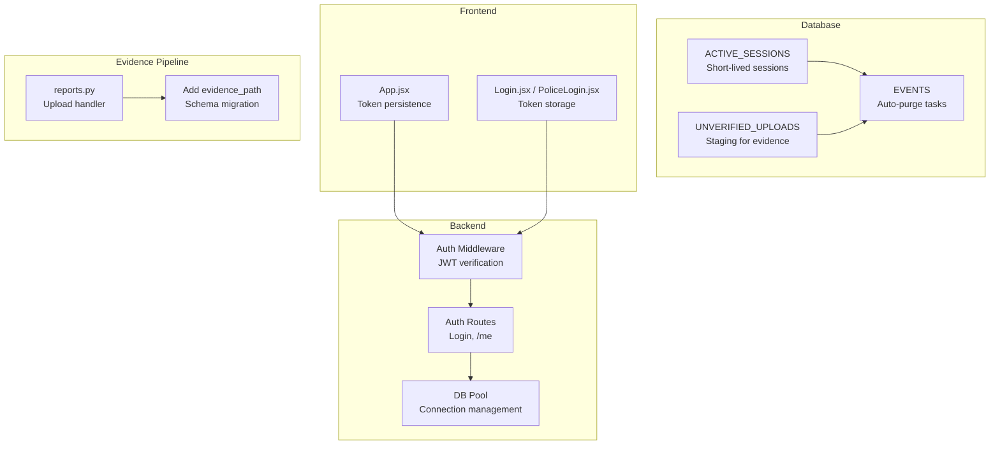
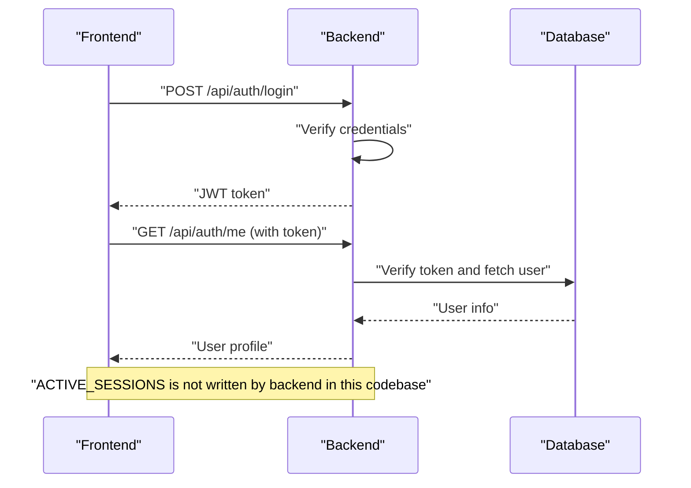
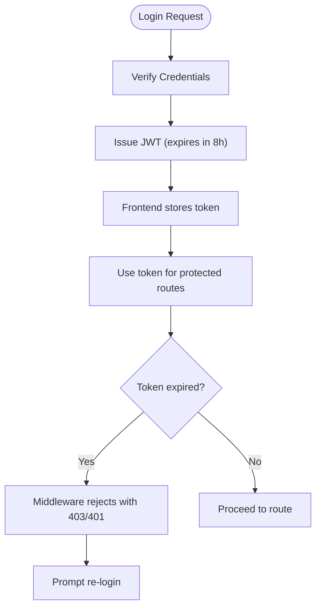
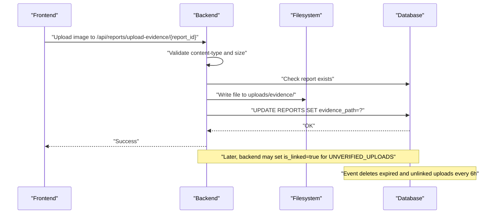
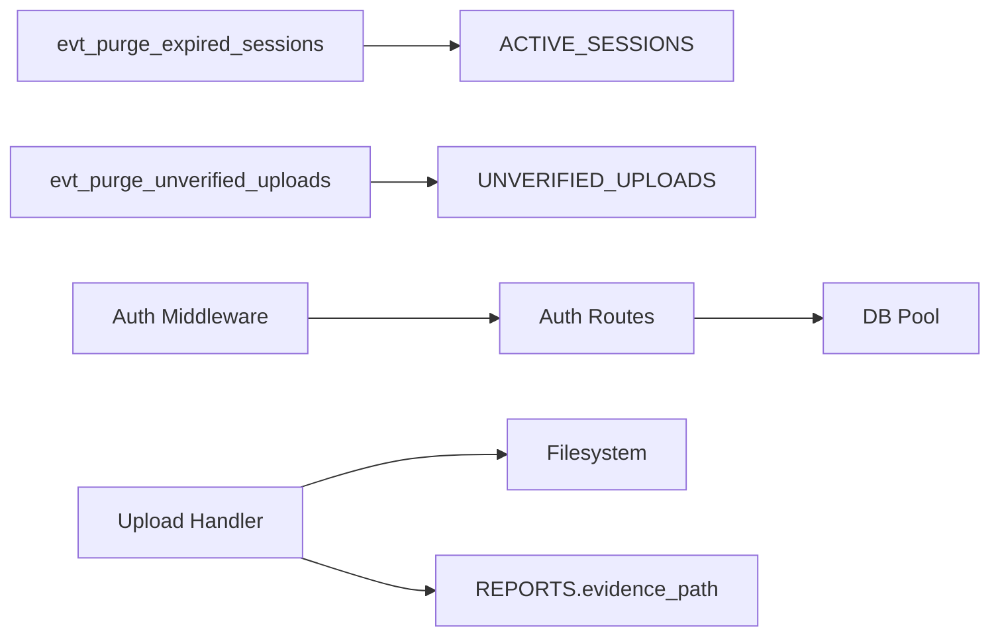

# Transient and Temporary Tables

<cite>
**Referenced Files in This Document**
- [schema.sql](file://db/schema.sql)
- [database_triggers.sql](file://db/database_triggers.sql)
- [auth.js](file://backend/middleware/auth.js)
- [auth.js](file://backend/routes/auth.js)
- [db.js](file://backend/db.js)
- [App.jsx](file://frontend/src/App.jsx)
- [Login.jsx](file://frontend/src/pages/Login.jsx)
- [PoliceLogin.jsx](file://frontend/src/pages/PoliceLogin.jsx)
- [add_evidence_path_column.sql](file://db/add_evidence_path_column.sql)
- [EVIDENCE_PHOTO_GUIDE.md](file://EVIDENCE_PHOTO_GUIDE.md)
- [EVIDENCE_PATH_MIGRATION_GUIDE.md](file://EVIDENCE_PATH_MIGRATION_GUIDE.md)
- [reports.py](file://server/routes/reports.py)
</cite>

## Table of Contents
1. [Introduction](#introduction)
2. [Project Structure](#project-structure)
3. [Core Components](#core-components)
4. [Architecture Overview](#architecture-overview)
5. [Detailed Component Analysis](#detailed-component-analysis)
6. [Dependency Analysis](#dependency-analysis)
7. [Performance Considerations](#performance-considerations)
8. [Troubleshooting Guide](#troubleshooting-guide)
9. [Conclusion](#conclusion)

## Introduction
This document focuses on two transient and temporary tables that support short-term operations and system maintenance:
- ACTIVE_SESSIONS: A short-lived session registry with automatic cleanup via database events.
- UNVERIFIED_UPLOADS: A staging area for evidence files prior to linking to a report, with automatic cleanup policies.

It explains schema design, auto-purge mechanisms, indexing strategies for cleanup operations, security implications, and practical examples of session lifecycle and evidence staging.

## Project Structure
The relevant implementation spans database schema and events, backend authentication middleware, frontend token persistence, and evidence upload pipeline.

**Diagram sources**
- [schema.sql:245-300](file://db/schema.sql#L245-L300)
- [auth.js:1-37](file://backend/middleware/auth.js#L1-L37)
- [auth.js:1-117](file://backend/routes/auth.js#L1-L117)
- [db.js:1-26](file://backend/db.js#L1-L26)
- [App.jsx:27-76](file://frontend/src/App.jsx#L27-L76)
- [Login.jsx:42-78](file://frontend/src/pages/Login.jsx#L42-L78)
- [PoliceLogin.jsx:41-77](file://frontend/src/pages/PoliceLogin.jsx#L41-L77)
- [reports.py:50-85](file://server/routes/reports.py#L50-L85)
- [add_evidence_path_column.sql:1-24](file://db/add_evidence_path_column.sql#L1-L24)

**Section sources**
- [schema.sql:245-300](file://db/schema.sql#L245-L300)
- [auth.js:1-37](file://backend/middleware/auth.js#L1-L37)
- [auth.js:1-117](file://backend/routes/auth.js#L1-L117)
- [db.js:1-26](file://backend/db.js#L1-L26)
- [App.jsx:27-76](file://frontend/src/App.jsx#L27-L76)
- [Login.jsx:42-78](file://frontend/src/pages/Login.jsx#L42-L78)
- [PoliceLogin.jsx:41-77](file://frontend/src/pages/PoliceLogin.jsx#L41-L77)
- [reports.py:50-85](file://server/routes/reports.py#L50-L85)
- [add_evidence_path_column.sql:1-24](file://db/add_evidence_path_column.sql#L1-L24)

## Core Components
- ACTIVE_SESSIONS
  - Purpose: Store active login sessions with expiration and optional client metadata.
  - Key fields: session_id (primary key), user_id, user_role, ip_address, user_agent, created_at, expires_at, is_active.
  - Indexes: idx_session_user, idx_session_expires.
  - Auto-purge: event evt_purge_expired_sessions runs hourly to delete expired sessions.

- UNVERIFIED_UPLOADS
  - Purpose: Staging area for evidence files uploaded by citizens before being linked to a report.
  - Key fields: upload_id (primary key), uploader_id (FK to CITIZENS), file_path, file_hash, mime_type, file_size_bytes, uploaded_at, expires_at, is_linked.
  - Indexes: idx_upload_expires, idx_upload_linked.
  - Auto-purge: event evt_purge_unverified_uploads runs every six hours to remove expired and unlinked uploads.

- Evidence Path Migration
  - Adds evidence_path to REPORTS for direct photo retrieval and includes an index for performance.

**Section sources**
- [schema.sql:245-300](file://db/schema.sql#L245-L300)
- [add_evidence_path_column.sql:1-24](file://db/add_evidence_path_column.sql#L1-L24)

## Architecture Overview
The transient tables integrate with:
- Authentication: JWT-based session tokens are verified by middleware; the backend does not write to ACTIVE_SESSIONS in the analyzed code.
- Evidence upload: Backend validates and stores images, then updates REPORTS with evidence_path.
- Cleanup: MySQL events automatically purge expired rows from both transient tables.

**Diagram sources**
- [auth.js:1-37](file://backend/middleware/auth.js#L1-L37)
- [auth.js:1-117](file://backend/routes/auth.js#L1-L117)

**Section sources**
- [auth.js:1-37](file://backend/middleware/auth.js#L1-L37)
- [auth.js:1-117](file://backend/routes/auth.js#L1-L117)

## Detailed Component Analysis

### ACTIVE_SESSIONS: Session Management
- Schema highlights
  - session_id: primary key; used as the session identifier.
  - user_id: citizen_id or badge_no depending on role.
  - user_role: enum indicating Citizen or Police.
  - Optional metadata: ip_address, user_agent.
  - Lifecycle: created_at, expires_at, is_active.
  - Indexes: idx_session_user, idx_session_expires.

- Auto-purge mechanism
  - Event: evt_purge_expired_sessions runs hourly and deletes rows where expires_at < NOW().
  - Frequency: Every 1 hour.

- Security implications
  - ACTIVE_SESSIONS is not populated by the backend in the analyzed code; therefore, the JWT token lifecycle is managed entirely by the frontend and backend middleware.
  - Since ACTIVE_SESSIONS is not written by the backend, there is no immediate risk of stale session rows persisting beyond token expiry in this codebase.
  - If ACTIVE_SESSIONS is intended for server-side session storage, ensure the backend writes session records with appropriate expires_at and cleans up on logout.

- Practical example: Session lifecycle
  - Login: Frontend obtains a JWT token with a fixed expiry configured in the backend route.
  - Usage: Frontend includes the token in Authorization headers for protected routes.
  - Expiry: On token expiry, the middleware rejects requests; the frontend should prompt re-authentication.
  - Note: ACTIVE_SESSIONS is not written by the backend in the analyzed code.

**Diagram sources**
- [auth.js:49-58](file://backend/routes/auth.js#L49-L58)
- [auth.js:13-20](file://backend/middleware/auth.js#L13-L20)

**Section sources**
- [schema.sql:245-256](file://db/schema.sql#L245-L256)
- [schema.sql:279-287](file://db/schema.sql#L279-L287)
- [auth.js:49-58](file://backend/routes/auth.js#L49-L58)
- [auth.js:13-20](file://backend/middleware/auth.js#L13-L20)

### UNVERIFIED_UPLOADS: Evidence Staging Area
- Schema highlights
  - upload_id: primary key; auto-increment.
  - uploader_id: foreign key to CITIZENS; cascade delete ensures cleanup on user deletion.
  - file_path: absolute path stored for later retrieval.
  - file_hash: optional SHA-256 for deduplication.
  - mime_type, file_size_bytes: metadata for validation and reporting.
  - Lifecycle: uploaded_at, expires_at, is_linked.
  - Indexes: idx_upload_expires, idx_upload_linked.

- Auto-purge mechanism
  - Event: evt_purge_unverified_uploads runs every six hours and deletes rows where expires_at < NOW() AND is_linked = FALSE.
  - Frequency: Every 6 hours.

- Evidence upload workflow
  - Backend validates file type and size, checks report existence, generates a unique filename, saves the file, and updates REPORTS with evidence_path.
  - The evidence_path is then used by the frontend to render thumbnails and full-size images.

- Security considerations
  - File validation: Content-type allowed types and size limits prevent oversized or malicious uploads.
  - Report linkage: After linking to a report, is_linked becomes true; expired and unlinked rows are purged automatically.
  - Cascade delete: Deleting a citizen also removes their uploads, preventing orphaned files.

**Diagram sources**
- [reports.py:50-85](file://server/routes/reports.py#L50-L85)
- [add_evidence_path_column.sql:9-14](file://db/add_evidence_path_column.sql#L9-L14)
- [schema.sql:292-300](file://db/schema.sql#L292-L300)

**Section sources**
- [schema.sql:261-274](file://db/schema.sql#L261-L274)
- [schema.sql:292-300](file://db/schema.sql#L292-L300)
- [reports.py:50-85](file://server/routes/reports.py#L50-L85)
- [add_evidence_path_column.sql:9-14](file://db/add_evidence_path_column.sql#L9-L14)
- [EVIDENCE_PHOTO_GUIDE.md:66-96](file://EVIDENCE_PHOTO_GUIDE.md#L66-L96)
- [EVIDENCE_PATH_MIGRATION_GUIDE.md:77-92](file://EVIDENCE_PATH_MIGRATION_GUIDE.md#L77-L92)

### Indexing Strategies for Cleanup Operations
- ACTIVE_SESSIONS
  - idx_session_expires: Supports efficient deletion of expired sessions by the hourly purge event.
  - idx_session_user: Useful for per-user session queries if needed.

- UNVERIFIED_UPLOADS
  - idx_upload_expires: Supports the purge event filtering by expiration.
  - idx_upload_linked: Supports filtering by linkage status for cleanup and reporting.

These indexes minimize I/O during purge operations and improve responsiveness of cleanup tasks.

**Section sources**
- [schema.sql:254-255](file://db/schema.sql#L254-L255)
- [schema.sql:272-273](file://db/schema.sql#L272-L273)

### Security Implications
- ACTIVE_SESSIONS
  - Not written by the backend in the analyzed code; thus, no server-side session table to secure.
  - JWT token security depends on secret management and proper expiry handling.

- UNVERIFIED_UPLOADS
  - File validation prevents invalid or oversized uploads.
  - Cascade delete ensures orphaned uploads are removed with user deletion.
  - Purge events remove stale unlinked uploads, reducing disk usage and exposure.

- Authentication and Authorization
  - Middleware enforces token presence and validity.
  - Role guards restrict access to citizen/police endpoints.

**Section sources**
- [auth.js:1-37](file://backend/middleware/auth.js#L1-L37)
- [auth.js:22-34](file://backend/routes/auth.js#L22-L34)
- [schema.sql](file://db/schema.sql#L271)

## Dependency Analysis
- Database events depend on:
  - ACTIVE_SESSIONS and UNVERIFIED_UPLOADS tables.
  - Properly maintained indexes to support fast deletions.

- Backend authentication depends on:
  - JWT secret configuration.
  - Database connectivity pool for any future session storage integration.

- Evidence upload pipeline depends on:
  - Filesystem write permissions.
  - REPORTS.evidence_path column for storing retrieval paths.

**Diagram sources**
- [schema.sql:279-300](file://db/schema.sql#L279-L300)
- [auth.js:1-37](file://backend/middleware/auth.js#L1-L37)
- [auth.js:1-117](file://backend/routes/auth.js#L1-L117)
- [db.js:1-26](file://backend/db.js#L1-L26)
- [reports.py:50-85](file://server/routes/reports.py#L50-L85)
- [add_evidence_path_column.sql:9-14](file://db/add_evidence_path_column.sql#L9-L14)

**Section sources**
- [schema.sql:279-300](file://db/schema.sql#L279-L300)
- [auth.js:1-37](file://backend/middleware/auth.js#L1-L37)
- [auth.js:1-117](file://backend/routes/auth.js#L1-L117)
- [db.js:1-26](file://backend/db.js#L1-L26)
- [reports.py:50-85](file://server/routes/reports.py#L50-L85)
- [add_evidence_path_column.sql:9-14](file://db/add_evidence_path_column.sql#L9-L14)

## Performance Considerations
- Event frequency
  - ACTIVE_SESSIONS purge runs hourly; adjust frequency based on expected session volume and cleanup urgency.
  - UNVERIFIED_UPLOADS purge runs every six hours; suitable for staged uploads with reasonable TTL.

- Index utilization
  - Ensure indexes on expires_at and is_linked are leveraged by purge events.
  - Monitor slow purge operations and consider partitioning for very large datasets.

- File storage
  - Store uploads outside the database to reduce DB load; maintain cleanup of orphaned files.

[No sources needed since this section provides general guidance]

## Troubleshooting Guide
- Sessions not expiring as expected
  - Confirm event_scheduler is enabled and events exist.
  - Verify purge event schedules and that expires_at is correctly set.

- Evidence uploads not cleaned up
  - Check purge event schedule and that is_linked remains false for staged uploads.
  - Ensure filesystem cleanup complements database cleanup.

- Authentication failures
  - Verify JWT_SECRET environment variable and token expiry.
  - Confirm middleware is applied to protected routes.

- Upload errors
  - Validate allowed content types and file size limits.
  - Confirm report existence before upload and that evidence_path is updated.

**Section sources**
- [schema.sql](file://db/schema.sql#L8)
- [schema.sql:279-300](file://db/schema.sql#L279-L300)
- [auth.js:13-20](file://backend/middleware/auth.js#L13-L20)
- [reports.py:57-82](file://server/routes/reports.py#L57-L82)

## Conclusion
ACTIVE_SESSIONS and UNVERIFIED_UPLOADS provide structured, auto-purging mechanisms for short-term operations:
- ACTIVE_SESSIONS supports session lifecycle management with automatic cleanup.
- UNVERIFIED_UPLOADS stages evidence uploads with robust validation and periodic cleanup.
- Together with JWT-based authentication and file-system storage, they form a secure and maintainable foundation for transient data handling.

[No sources needed since this section summarizes without analyzing specific files]