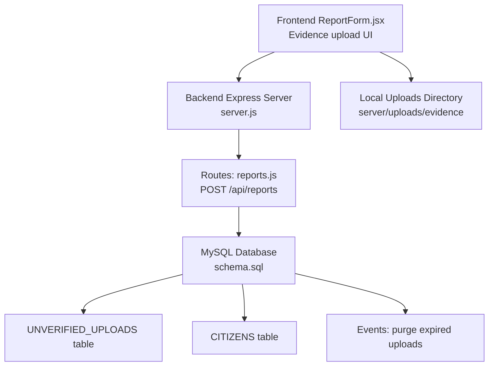
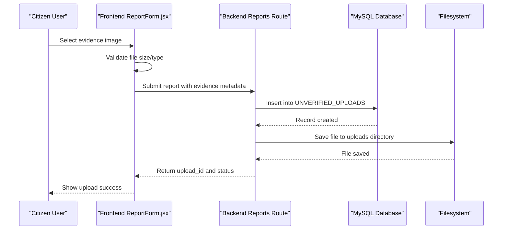
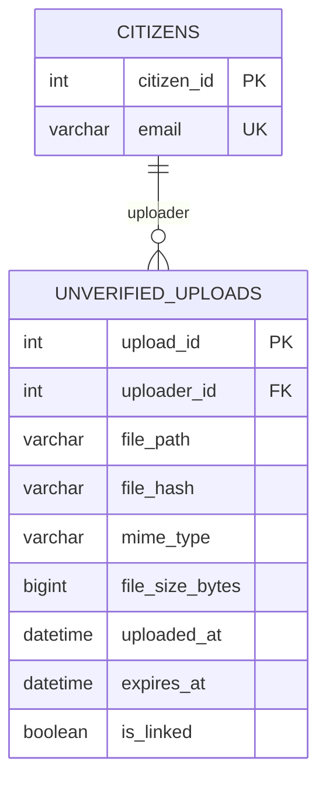
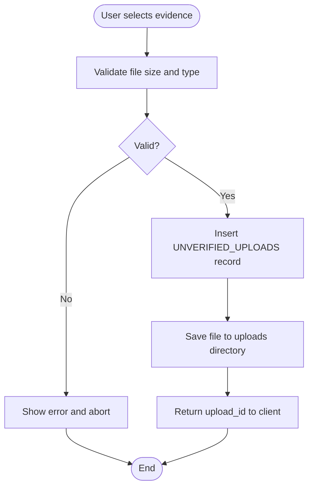
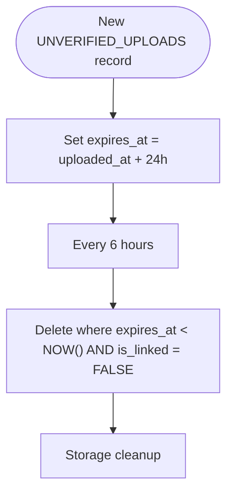
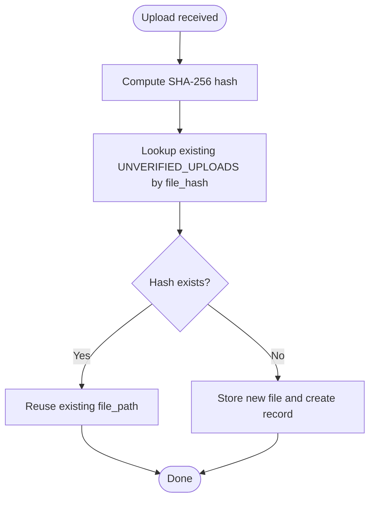
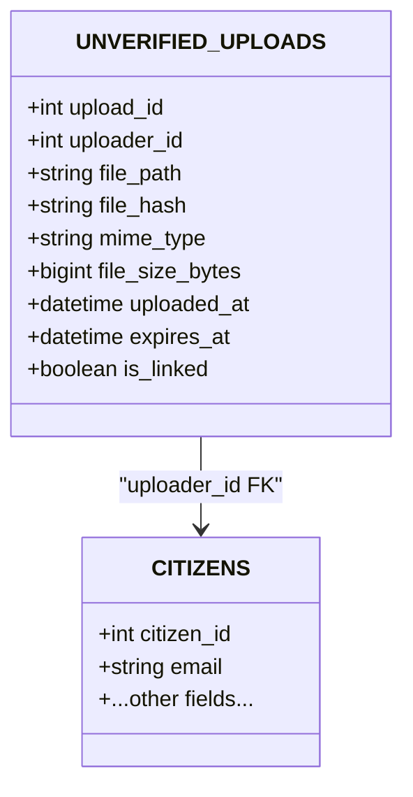
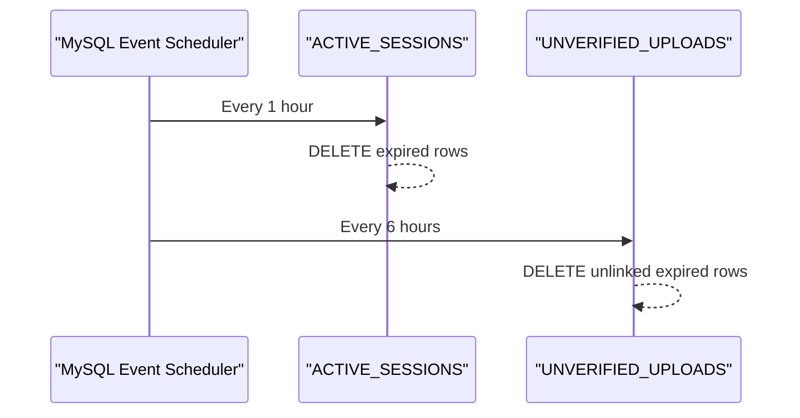
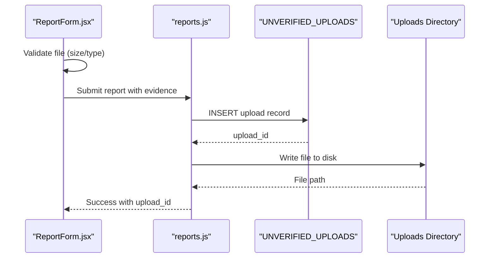
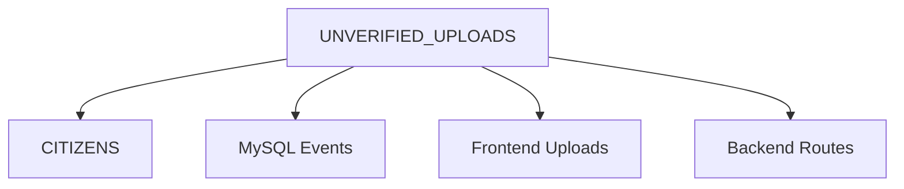

# UNVERIFIED_UPLOADS - Evidence Staging Area

<cite>
**Referenced Files in This Document**
- [schema.sql](file://db/schema.sql)
- [database_triggers.sql](file://db/database_triggers.sql)
- [stored_procedure_process_report.sql](file://db/stored_procedure_process_report.sql)
- [ReportForm.jsx](file://frontend/src/components/ReportForm.jsx)
- [test_upload.py](file://scripts/test_upload.py)
- [server.js](file://backend/server.js)
- [auth.js](file://backend/middleware/auth.js)
- [reports.js](file://backend/routes/reports.js)
- [db.js](file://backend/db.js)
</cite>

## Table of Contents
1. [Introduction](#introduction)
2. [Project Structure](#project-structure)
3. [Core Components](#core-components)
4. [Architecture Overview](#architecture-overview)
5. [Detailed Component Analysis](#detailed-component-analysis)
6. [Dependency Analysis](#dependency-analysis)
7. [Performance Considerations](#performance-considerations)
8. [Troubleshooting Guide](#troubleshooting-guide)
9. [Conclusion](#conclusion)

## Introduction
This document provides comprehensive documentation for the UNVERIFIED_UPLOADS table, which serves as a transient staging area for evidence files before they are linked to official reports. It explains the table schema, the evidence upload workflow, the 24-hour expiration policy for unlinked uploads, the deduplication mechanism using SHA-256 hashes, and the relationship with the CITIZENS table. Additionally, it documents the auto-purge events that manage storage and outlines practical examples of upload processes and cleanup mechanisms.

## Project Structure
The UNVERIFIED_UPLOADS table is part of the production database schema and is managed alongside other core and transient tables. The system integrates:
- Frontend form components for evidence upload
- Backend API endpoints for report submission
- Database schema with the UNVERIFIED_UPLOADS table and supporting triggers/events
- Storage directories for physical file persistence

**Diagram sources**
- [ReportForm.jsx:208-242](file://frontend/src/components/ReportForm.jsx#L208-L242)
- [server.js:10-26](file://backend/server.js#L10-L26)
- [reports.js:7-31](file://backend/routes/reports.js#L7-L31)
- [schema.sql:259-274](file://db/schema.sql#L259-L274)
- [schema.sql:289-300](file://db/schema.sql#L289-L300)

**Section sources**
- [schema.sql:259-274](file://db/schema.sql#L259-L274)
- [ReportForm.jsx:208-242](file://frontend/src/components/ReportForm.jsx#L208-L242)
- [server.js:10-26](file://backend/server.js#L10-L26)
- [reports.js:7-31](file://backend/routes/reports.js#L7-L31)

## Core Components
The UNVERIFIED_UPLOADS table defines a staging area for evidence files with the following fields:
- upload_id: Unique identifier for each upload record
- uploader_id: Foreign key referencing CITIZENS.citizen_id
- file_path: Physical storage path of the uploaded file
- file_hash: SHA-256 hash for deduplication
- mime_type: MIME type of the uploaded file
- file_size_bytes: Size of the file in bytes
- uploaded_at: Timestamp when the upload record was created
- expires_at: Expiration timestamp for the upload record
- is_linked: Boolean flag indicating whether the upload is linked to a report

Constraints and indexes:
- Foreign key constraint to CITIZENS ensures referential integrity
- Index on expires_at supports efficient purging
- Index on is_linked supports filtering unlinked uploads

Auto-purge events:
- An hourly event purges expired ACTIVE_SESSIONS entries
- A six-hour event purges unlinked UNVERIFIED_UPLOADS entries that have expired

**Section sources**
- [schema.sql:259-274](file://db/schema.sql#L259-L274)
- [schema.sql:277-300](file://db/schema.sql#L277-L300)

## Architecture Overview
The evidence upload workflow spans frontend, backend, and database layers. Evidence is collected via the frontend, validated, persisted to storage, and recorded in UNVERIFIED_UPLOADS. Later, during report processing, uploads are linked to reports and moved into the permanent evidence model.

**Diagram sources**
- [ReportForm.jsx:59-82](file://frontend/src/components/ReportForm.jsx#L59-L82)
- [reports.js:7-31](file://backend/routes/reports.js#L7-L31)
- [schema.sql:259-274](file://db/schema.sql#L259-L274)

## Detailed Component Analysis

### UNVERIFIED_UPLOADS Schema and Constraints
The table enforces referential integrity with CITIZENS and uses indexes to optimize purging and filtering. The foreign key cascade ensures that when a citizen account is removed, their uploads are also removed.

**Diagram sources**
- [schema.sql:26-43](file://db/schema.sql#L26-L43)
- [schema.sql:259-274](file://db/schema.sql#L259-L274)

**Section sources**
- [schema.sql:26-43](file://db/schema.sql#L26-L43)
- [schema.sql:259-274](file://db/schema.sql#L259-L274)

### Evidence Upload Workflow
The upload process involves:
- Frontend validation: size limit (≤5MB) and MIME type checks
- Backend route: receives report submission and creates an UNVERIFIED_UPLOADS record
- File persistence: saves the file to the server's uploads directory
- Deduplication: computes SHA-256 and stores file_hash for future comparisons

**Diagram sources**
- [ReportForm.jsx:62-69](file://frontend/src/components/ReportForm.jsx#L62-L69)
- [reports.js:16-31](file://backend/routes/reports.js#L16-L31)
- [schema.sql](file://db/schema.sql#L265)

**Section sources**
- [ReportForm.jsx:59-82](file://frontend/src/components/ReportForm.jsx#L59-L82)
- [reports.js:7-31](file://backend/routes/reports.js#L7-L31)
- [schema.sql:259-274](file://db/schema.sql#L259-L274)

### 24-Hour Expiration Policy for Unlinked Uploads
Each UNVERIFIED_UPLOADS record is assigned an expires_at timestamp. Unlinked uploads older than 24 hours are automatically purged by a scheduled event. This policy prevents stale evidence from accumulating and ensures storage hygiene.

**Diagram sources**
- [schema.sql:268-269](file://db/schema.sql#L268-L269)
- [schema.sql:290-300](file://db/schema.sql#L290-L300)

**Section sources**
- [schema.sql:268-269](file://db/schema.sql#L268-L269)
- [schema.sql:290-300](file://db/schema.sql#L290-L300)

### Deduplication Mechanism Using SHA-256
To avoid storing duplicate files, the system computes a SHA-256 hash of the uploaded content and stores it in file_hash. Subsequent uploads can be checked against existing hashes to prevent redundant storage. While the schema defines the column, the specific deduplication logic is not shown in the provided backend routes; it is recommended to implement a pre-check against existing hashes before inserting new records.

**Diagram sources**
- [schema.sql](file://db/schema.sql#L265)

**Section sources**
- [schema.sql](file://db/schema.sql#L265)

### Relationship with CITIZENS Table
The uploader_id field references CITIZENS.citizen_id, establishing ownership of uploads. The foreign key constraint ensures that uploads are associated with valid citizens and cascades deletion to remove orphaned uploads when a citizen is deleted.

**Diagram sources**
- [schema.sql:26-43](file://db/schema.sql#L26-L43)
- [schema.sql:259-274](file://db/schema.sql#L259-L274)

**Section sources**
- [schema.sql:26-43](file://db/schema.sql#L26-L43)
- [schema.sql:259-274](file://db/schema.sql#L259-L274)

### Auto-Purge Events and Storage Management
Two MySQL events manage automatic cleanup:
- Hourly purge of expired ACTIVE_SESSIONS
- Every-six-hours purge of unlinked UNVERIFIED_UPLOADS older than expires_at

These events ensure long-term storage efficiency and reduce manual maintenance overhead.

**Diagram sources**
- [schema.sql:277-300](file://db/schema.sql#L277-L300)

**Section sources**
- [schema.sql:277-300](file://db/schema.sql#L277-L300)

### Examples of Evidence Upload Processes
- Frontend validation: Ensures images are ≤5MB and of image/* type before submission
- Backend insertion: Creates UNVERIFIED_UPLOADS records with metadata and sets expires_at
- File saving: Stores files in the server's uploads directory for later retrieval
- Linking to reports: During report processing, unlinked uploads are associated with a report and transition into the permanent evidence model

**Diagram sources**
- [ReportForm.jsx:62-82](file://frontend/src/components/ReportForm.jsx#L62-L82)
- [reports.js:16-31](file://backend/routes/reports.js#L16-L31)
- [schema.sql:259-274](file://db/schema.sql#L259-L274)

**Section sources**
- [ReportForm.jsx:59-82](file://frontend/src/components/ReportForm.jsx#L59-L82)
- [reports.js:7-31](file://backend/routes/reports.js#L7-L31)
- [schema.sql:259-274](file://db/schema.sql#L259-L274)

## Dependency Analysis
The UNVERIFIED_UPLOADS table depends on:
- CITIZENS for uploader identity
- MySQL events for automated cleanup
- Frontend/backend components for ingestion and persistence

**Diagram sources**
- [schema.sql:259-274](file://db/schema.sql#L259-L274)
- [schema.sql:277-300](file://db/schema.sql#L277-L300)
- [ReportForm.jsx:208-242](file://frontend/src/components/ReportForm.jsx#L208-L242)
- [reports.js:7-31](file://backend/routes/reports.js#L7-L31)

**Section sources**
- [schema.sql:259-274](file://db/schema.sql#L259-L274)
- [schema.sql:277-300](file://db/schema.sql#L277-L300)
- [ReportForm.jsx:208-242](file://frontend/src/components/ReportForm.jsx#L208-L242)
- [reports.js:7-31](file://backend/routes/reports.js#L7-L31)

## Performance Considerations
- Indexes on expires_at and is_linked improve purging performance
- SHA-256 hashing enables efficient duplicate detection
- Cascading deletes maintain referential integrity without manual cleanup
- Scheduled events operate during off-peak periods to minimize load

## Troubleshooting Guide
Common issues and resolutions:
- Upload fails due to invalid file type or size: Verify frontend validation and MIME type checks
- Missing file on disk despite successful record creation: Confirm backend file write operations and directory permissions
- Purged uploads not visible: Check event scheduler status and purge timing
- Duplicate storage: Implement pre-check against file_hash before inserting new records

**Section sources**
- [ReportForm.jsx:62-69](file://frontend/src/components/ReportForm.jsx#L62-L69)
- [reports.js:16-31](file://backend/routes/reports.js#L16-L31)
- [schema.sql:277-300](file://db/schema.sql#L277-L300)

## Conclusion
The UNVERIFIED_UPLOADS table provides a robust staging area for evidence files with built-in deduplication, expiration policies, and automated cleanup. Together with frontend validation and backend ingestion, it ensures secure, efficient, and maintainable evidence handling prior to report linkage.